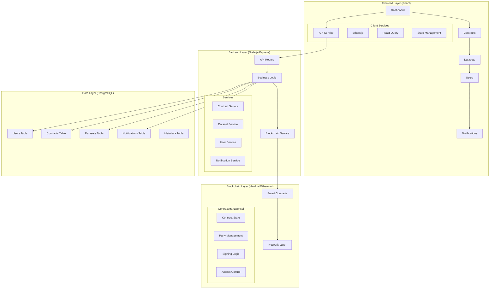
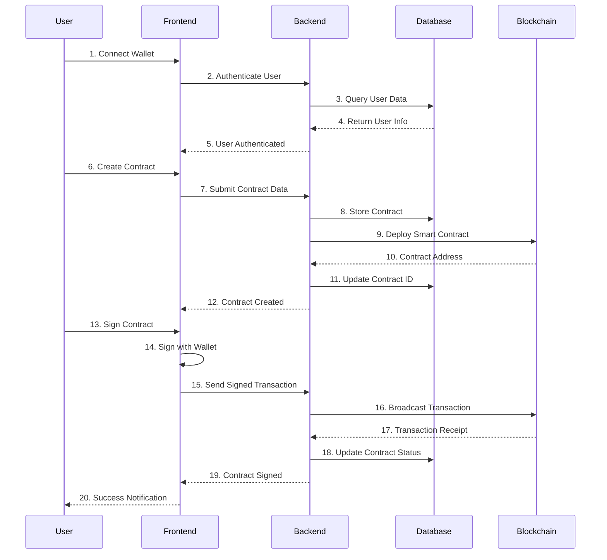
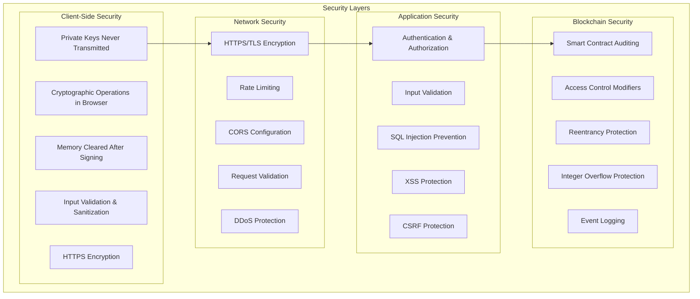
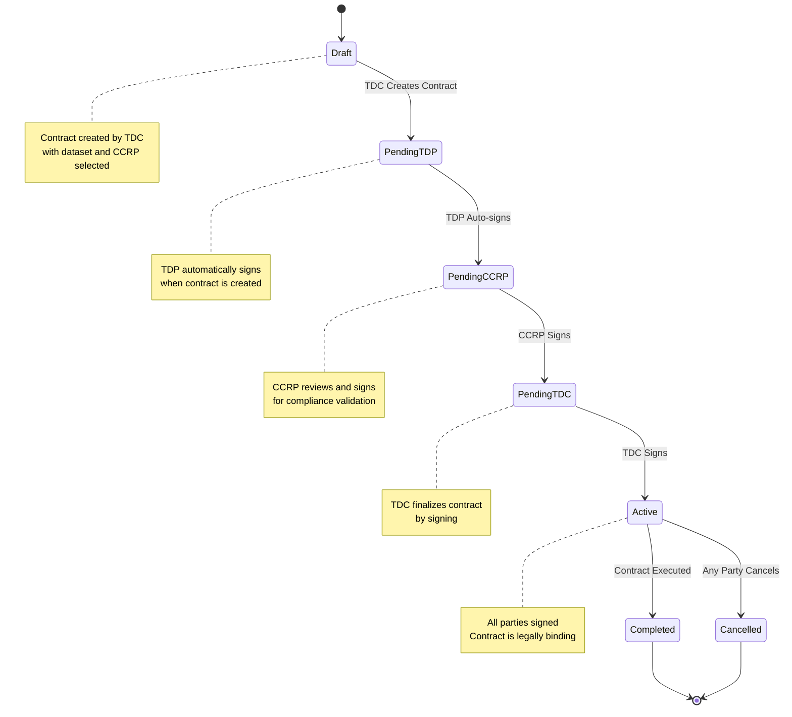
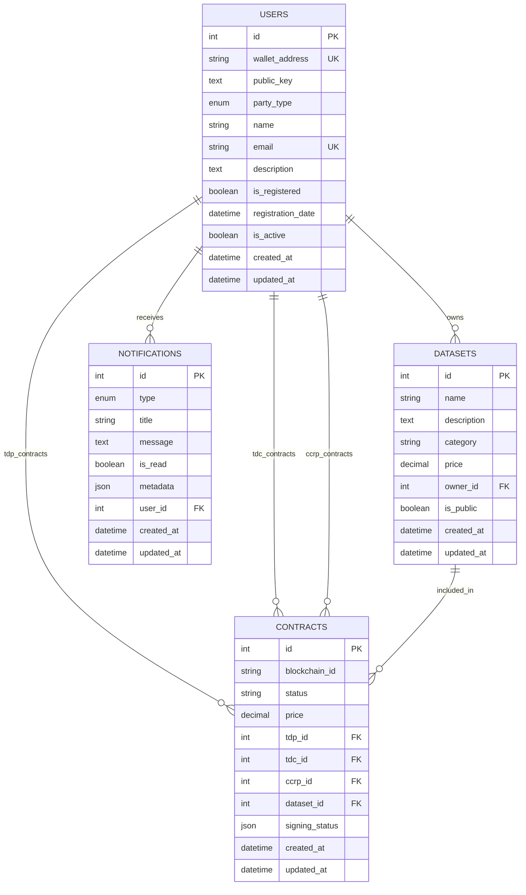
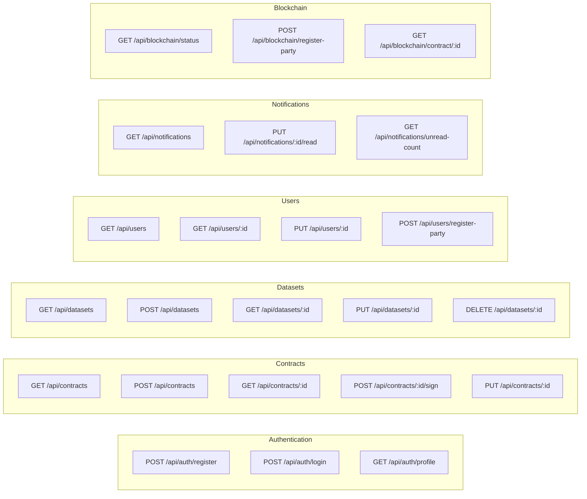
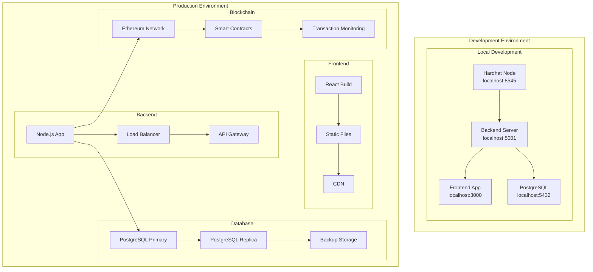

# System Architecture Diagram
## Secure Contract Management System

## System Overview

## Data Flow Architecture

## User Roles and Permissions

```mermaid
graph TD
    subgraph "User Roles"
        TDP[TDP - Training Data Provider<br/>Dataset Owner]
        TDC[TDC - Training Data Consumer<br/>Contract Initiator]
        CCRP[CCRP - Confidential Clean Room Provider<br/>Compliance Checker]
    end
    
    subgraph "TDP Permissions"
        TDP1[Create Datasets]
        TDP2[Manage Own Datasets]
        TDP3[Initiate Contracts]
        TDP4[Auto-sign Contracts]
        TDP5[View Contract History]
    end
    
    subgraph "TDC Permissions"
        TDC1[Browse Datasets]
        TDC2[Select CCRP]
        TDC3[Create Contracts]
        TDC4[Sign Contracts]
        TDC5[Access Purchased Data]
    end
    
    subgraph "CCRP Permissions"
        CCRP1[Review Contracts]
        CCRP2[Validate Compliance]
        CCRP3[Sign Contracts]
        CCRP4[Provide Oversight]
        CCRP5[Maintain Audit Trail]
    end
    
    TDP --> TDP1
    TDP --> TDP2
    TDP --> TDP3
    TDP --> TDP4
    TDP --> TDP5
    
    TDC --> TDC1
    TDC --> TDC2
    TDC --> TDC3
    TDC --> TDC4
    TDC --> TDC5
    
    CCRP --> CCRP1
    CCRP --> CCRP2
    CCRP --> CCRP3
    CCRP --> CCRP4
    CCRP --> CCRP5
```

## Security Architecture

## Contract Workflow

## Database Schema

## API Endpoints

## Deployment Architecture

## Technology Stack

```mermaid
graph TB
    subgraph "Frontend"
        F1[React 18]
        F2[React Router]
        F3[Material-UI]
        F4[React Query]
        F5[Ethers.js]
        F6[Axios]
    end
    
    subgraph "Backend"
        B1[Node.js]
        B2[Express.js]
        B3[Sequelize ORM]
        B4[JWT Authentication]
        B5[Helmet Security]
        B6[CORS]
    end
    
    subgraph "Database"
        DB1[PostgreSQL]
        DB2[Sequelize]
        DB3[Database Migrations]
    end
    
    subgraph "Blockchain"
        BC1[Hardhat]
        BC2[Solidity]
        BC3[Ethers.js]
        BC4[Web3.js]
    end
    
    subgraph "Development Tools"
        DT1[Git]
        DT2[Docker]
        DT3[Jest Testing]
        DT4[ESLint]
        DT5[Prettier]
    end
    
    F1 --> F2
    F2 --> F3
    F3 --> F4
    F4 --> F5
    F5 --> F6
    
    B1 --> B2
    B2 --> B3
    B3 --> B4
    B4 --> B5
    B5 --> B6
    
    DB1 --> DB2
    DB2 --> DB3
    
    BC1 --> BC2
    BC2 --> BC3
    BC3 --> BC4
    
    DT1 --> DT2
    DT2 --> DT3
    DT3 --> DT4
    DT4 --> DT5
``` 

