# Architecture Guide

## Contract Management System

Complete technical architecture and design documentation for the Contract Management System.

## 🏗️ System Overview

The Contract Management System is a blockchain-based platform that enables secure, transparent, and legally binding contract creation and management between three parties:
- **TDP (Training Data Provider)**: Dataset owners who provide data
- **TDC (Training Data Consumer)**: Organizations that purchase and use data
- **CCRP (Confidential Clean Room Provider)**: Independent reviewers who validate contracts

### Key Features
- **Enterprise IAM Integration**: Keycloak-based identity and access management
- **Secure Private Key Management**: Client-side signing with private keys never transmitted
- **Blockchain Immutability**: All contracts stored on Ethereum-compatible blockchain
- **Multi-Party Workflow**: Sequential signing process with role-based permissions
- **User Onboarding**: Multi-step registration with email verification
- **Real-time Notifications**: Email and in-app notifications for contract events
- **Comprehensive Audit Trail**: Complete history of all contract actions
- **Profile Management**: Enhanced user profiles with organization details

## 🏛️ System Architecture

### High-Level Architecture
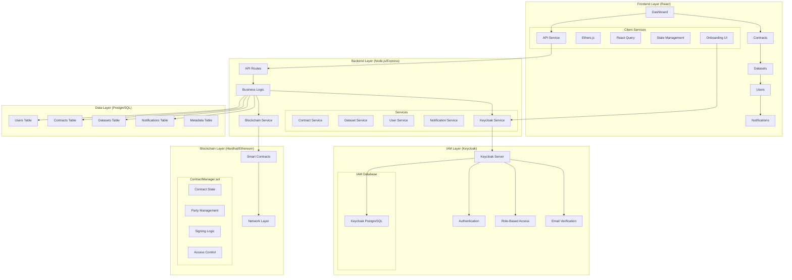

### Technology Stack
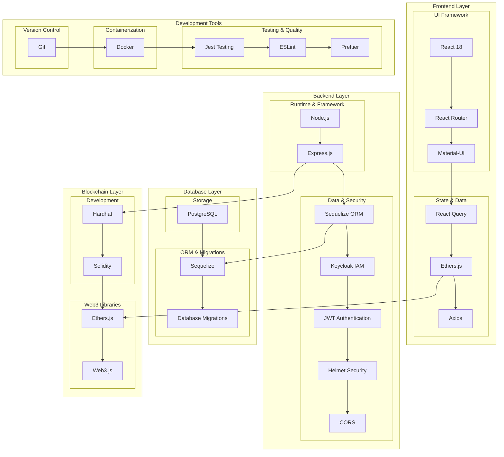

## 🔄 Data Flow Architecture

### Complete Data Flow
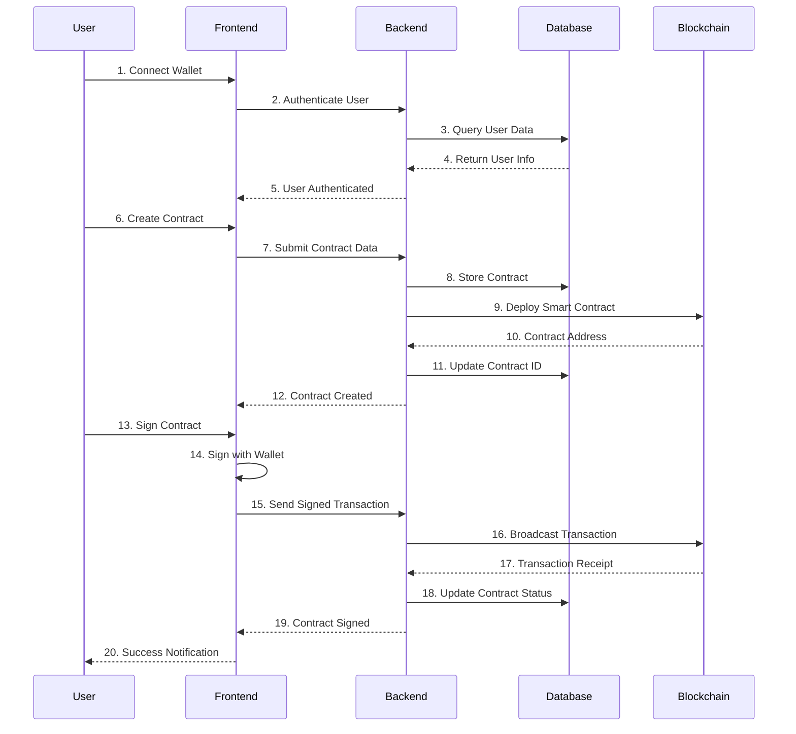

### User Authentication Flow
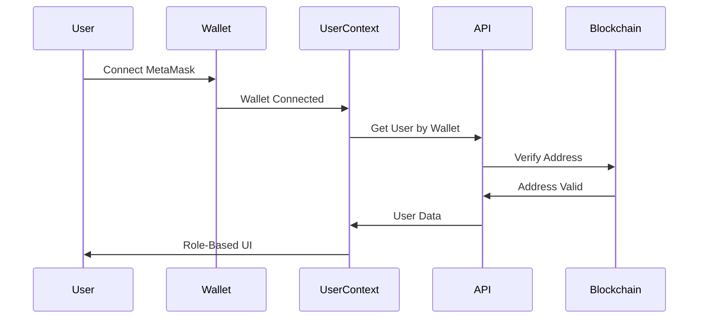

## 🔐 Security Architecture

### Multi-Layer Security Model
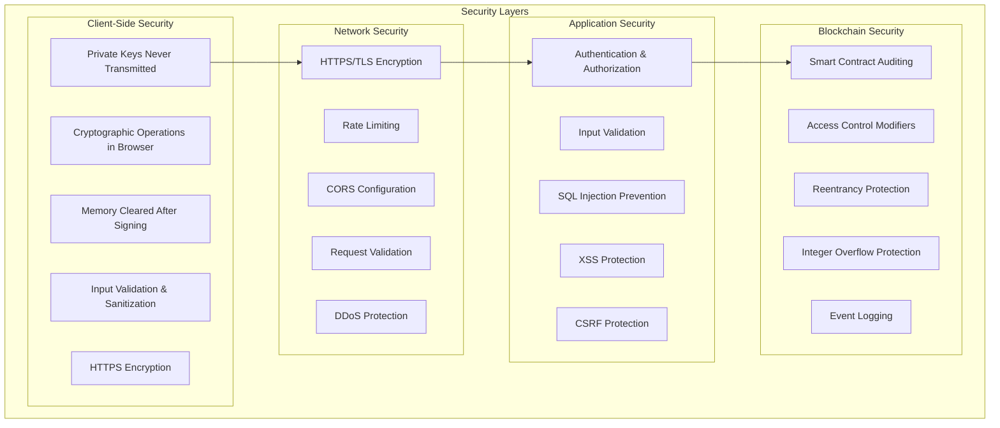

### Secure Signing Flow
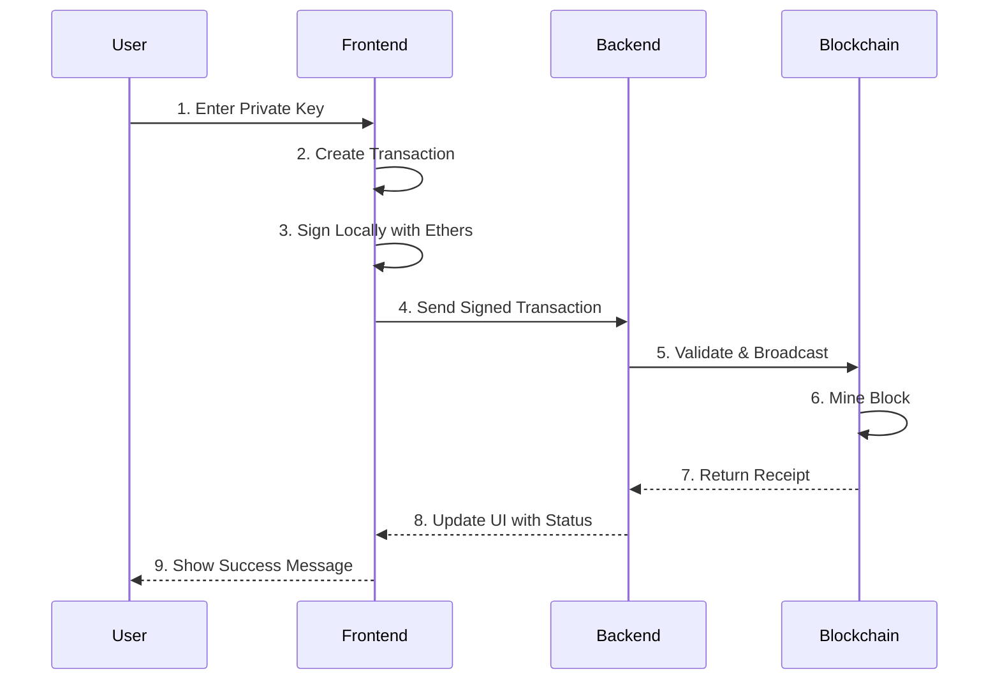

## 📊 Database Schema

### Entity Relationship Diagram
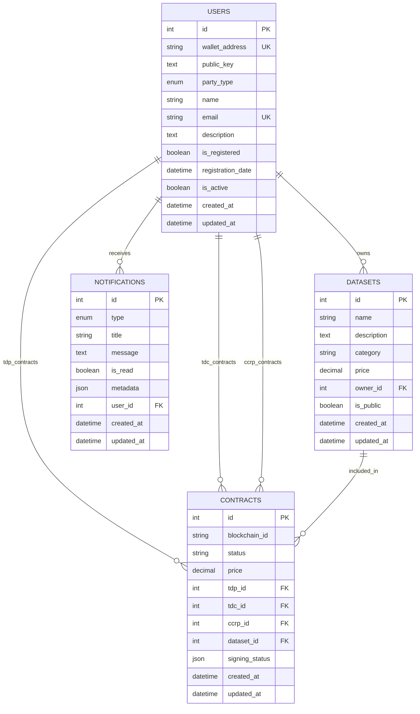

## 🔗 API Endpoints

### RESTful API Structure
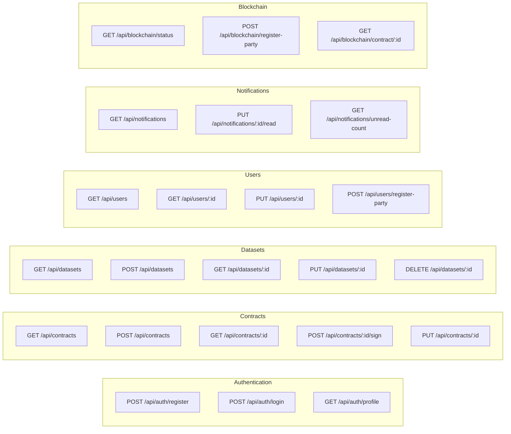

## ⚡ Smart Contract Architecture

### ContractManager.sol Structure
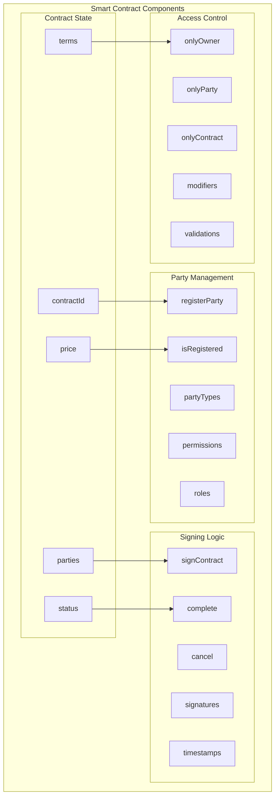

### Contract Workflow States
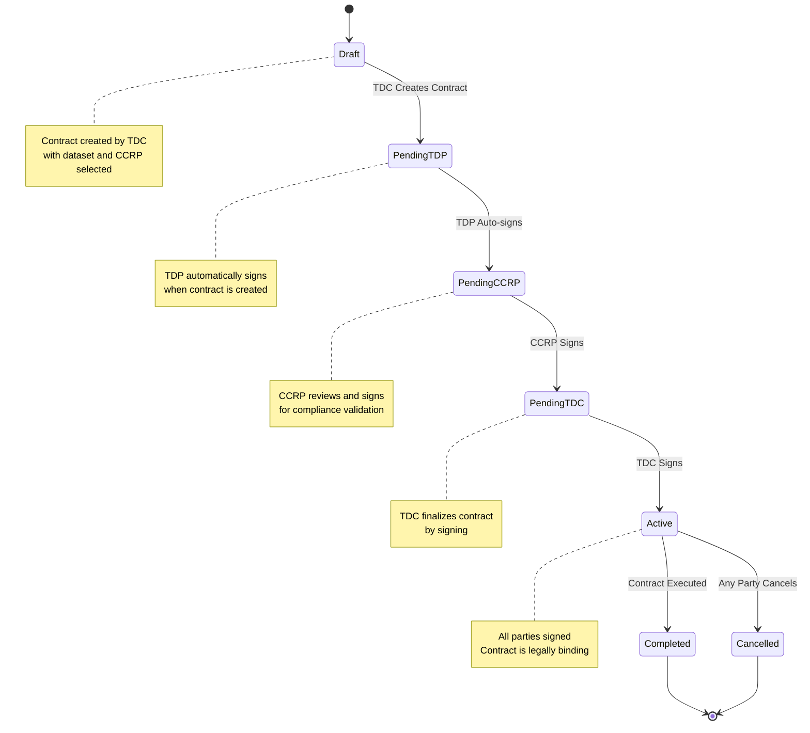

## 🚀 Deployment Architecture

### Development Environment
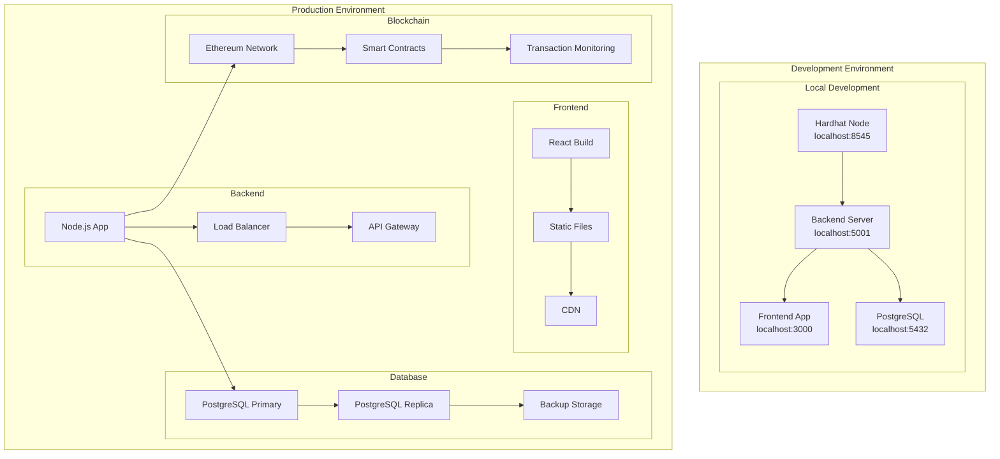

## 🔧 Implementation Details

### Frontend Architecture

#### Component Structure
```
frontend/src/
├── components/
│   ├── Layout.js              # Main layout with navigation
│   ├── WalletSwitcher.js      # Wallet switching dialog
│   └── MetaMaskGuide.js       # MetaMask setup guide
├── contexts/
│   └── UserContext.js         # User authentication and state
├── pages/
│   ├── Dashboard.js           # Role-based dashboard
│   ├── Contracts.js           # Contract management
│   ├── CreateContract.js      # Contract creation (TDC only)
│   ├── Datasets.js            # Dataset browsing
│   ├── Users.js               # User management
│   └── Notifications.js       # Notification center
└── services/
    └── api.js                 # API client with authentication
```

#### State Management
- **React Context**: User authentication and wallet state
- **React Query**: Server state management and caching
- **Local State**: Form state and UI interactions

### Backend Architecture

#### Service Layer
```
backend/
├── routes/
│   ├── contracts.js           # Contract CRUD operations
│   ├── datasets.js            # Dataset management
│   ├── users.js               # User registration and management
│   └── notifications.js       # Notification system
├── services/
│   ├── blockchainService.js   # Smart contract interactions
│   └── notificationService.js # Email and in-app notifications
├── models/
│   ├── User.js                # User model with role-based fields
│   ├── Contract.js            # Contract model with relationships
│   ├── Dataset.js             # Dataset model
│   └── Notification.js        # Notification model
└── middleware/
    ├── auth.js                # JWT authentication
    └── validation.js          # Request validation
```

#### Database Design
- **Sequelize ORM**: Database abstraction and migrations
- **PostgreSQL**: Primary database with ACID compliance
- **Indexes**: Optimized for wallet address and role queries
- **Relationships**: Foreign key constraints for data integrity

### Blockchain Integration

#### Smart Contract Design
```solidity
// Key features of ContractManager.sol
contract ContractManager {
    // Party registration
    mapping(address => bool) public isRegistered;
    mapping(address => PartyType) public partyTypes;
    
    // Contract management
    mapping(uint256 => Contract) public contracts;
    mapping(uint256 => mapping(address => bool)) public signatures;
    
    // Events for frontend updates
    event ContractCreated(uint256 contractId, address tdc, address tdp);
    event ContractSigned(uint256 contractId, address signer);
    event ContractCompleted(uint256 contractId);
}
```

#### Transaction Flow
1. **Contract Creation**: TDC creates contract, TDP auto-signs
2. **CCRP Review**: CCRP reviews and signs (if selected)
3. **TDC Finalization**: TDC signs to complete contract
4. **State Updates**: Contract status updated on blockchain
5. **Event Emission**: Frontend notified of state changes

## 🔍 Performance Considerations

### Frontend Optimization
- **Code Splitting**: Lazy loading of components
- **React Query**: Intelligent caching and background updates
- **Material-UI**: Optimized component library
- **Bundle Analysis**: Webpack bundle optimization

### Backend Optimization
- **Database Indexing**: Optimized queries for wallet lookups
- **Connection Pooling**: Efficient database connections
- **Caching**: Redis for frequently accessed data
- **Rate Limiting**: API protection against abuse

### Blockchain Optimization
- **Gas Optimization**: Efficient smart contract design
- **Batch Operations**: Grouped transactions where possible
- **Event Filtering**: Efficient event listening
- **Nonce Management**: Proper transaction ordering

## 🔒 Security Considerations

### Smart Contract Security
- **Access Control**: Role-based modifiers
- **Reentrancy Protection**: Secure state management
- **Integer Overflow**: Safe math operations
- **Event Logging**: Complete audit trail

### Application Security
- **Input Validation**: Comprehensive data validation
- **SQL Injection Prevention**: Parameterized queries
- **XSS Protection**: Content security policies
- **CSRF Protection**: Token-based protection

### Network Security
- **HTTPS/TLS**: Encrypted communications
- **CORS Configuration**: Controlled cross-origin access
- **Rate Limiting**: Protection against abuse
- **DDoS Protection**: Infrastructure-level protection

## 📈 Scalability Considerations

### Horizontal Scaling
- **Load Balancing**: Multiple backend instances
- **Database Sharding**: Partitioned data storage
- **CDN**: Static asset distribution
- **Microservices**: Service decomposition

### Vertical Scaling
- **Resource Optimization**: Efficient resource usage
- **Caching Strategies**: Multi-level caching
- **Database Optimization**: Query optimization
- **Blockchain Scaling**: Layer 2 solutions

## 🧪 Testing Strategy

### Unit Testing
- **Frontend**: Component and hook testing
- **Backend**: Service and route testing
- **Smart Contracts**: Contract function testing

### Integration Testing
- **API Testing**: End-to-end API testing
- **Blockchain Integration**: Smart contract integration
- **Database Testing**: Data persistence testing

### End-to-End Testing
- **User Workflows**: Complete user journey testing
- **Role-Based Testing**: Role-specific functionality
- **Cross-Browser Testing**: Browser compatibility

## 📚 Additional Resources

- **Setup Guide**: See [Setup Guide](./SETUP_GUIDE.md) for installation
- **User Guide**: See [User Guide](./USER_GUIDE.md) for usage
- **Wallet Guide**: See [Wallet Guide](./WALLET_GUIDE.md) for MetaMask setup
- **Test Wallets**: See [Test Wallets](./TEST_WALLETS.md) for development accounts

## 🆘 Support

For technical questions:
1. **Review this guide** for architectural details
2. **Check the codebase** for implementation specifics
3. **Create an issue** on GitHub for bugs
4. **Start a discussion** for architectural questions
