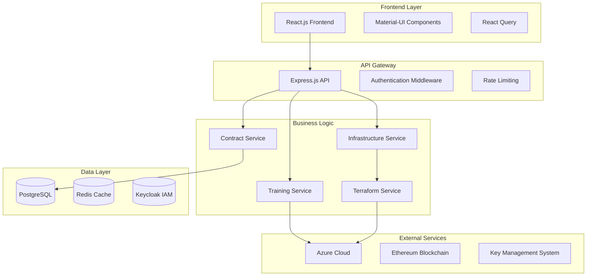

# Contract Management System - Comprehensive Project Documentation

**Project Name:** Contract Management System with Ricardian Contracts  
**Version:** 2.0  
**Date:** December 2024  
**Technology Stack:** Full-Stack JavaScript, Blockchain, Cloud Infrastructure  

---

## Table of Contents

1. [Project Overview](#project-overview)
2. [System Architecture](#system-architecture)
3. [Technical Specifications](#technical-specifications)
4. [Design Patterns](#design-patterns)
5. [Security Implementation](#security-implementation)
6. [Cloud Infrastructure](#cloud-infrastructure)
7. [Deployment Strategy](#deployment-strategy)
8. [Testing Strategy](#testing-strategy)
9. [Performance Considerations](#performance-considerations)
10. [Monitoring & Observability](#monitoring--observability)

---

## 1. Project Overview

### 1.1 Business Context
The Contract Management System is an enterprise-grade platform that enables secure, legally enforceable contracts for AI training data exchange between multiple parties. It implements the **Ricardian Contract** pattern, combining human-readable legal documents with machine-executable smart contracts.

### 1.2 Key Stakeholders
- **TDP (Training Data Provider)**: Dataset and model owners
- **TDC (Training Data Consumer)**: Contract initiators and data consumers
- **CCRP (Confidential Clean Room Provider)**: Infrastructure and compliance providers
- **AppAdmin**: System administrators

### 1.3 Core Value Proposition
- **Legal Enforceability**: Human-readable terms that courts can interpret
- **Automated Execution**: Smart contracts for automated enforcement
- **Cryptographic Binding**: Digital signatures linking legal documents to smart contracts
- **Multi-Cloud Support**: Real infrastructure provisioning across Azure, AWS, GCP
- **Security & Compliance**: DPDP 2023 compliance with privacy-preserving training

---

## 2. System Architecture

### 2.1 High-Level Architecture



### 2.2 Technology Stack

#### Frontend
- **Framework**: React 18.2.0
- **UI Library**: Material-UI 5.14.20
- **State Management**: React Query 3.39.3
- **Routing**: React Router DOM 6.20.1
- **Forms**: React Hook Form 7.48.2
- **Testing**: Playwright 1.40.0

#### Backend
- **Runtime**: Node.js 18+
- **Framework**: Express.js 4.18.2
- **ORM**: Sequelize 6.35.0
- **Database**: PostgreSQL 13+
- **Authentication**: Keycloak 23.0.0
- **Blockchain**: Ethers.js 6.15.0

#### Cloud Infrastructure
- **Azure SDK**: @azure/arm-compute, @azure/arm-storage, @azure/identity
- **Containerization**: Docker & Docker Compose
- **Infrastructure as Code**: Terraform
- **Monitoring**: Azure Monitor

---

## 3. Technical Specifications

### 3.1 Database Schema

#### Core Entities
```sql
-- Users table with role-based access
CREATE TABLE users (
    id SERIAL PRIMARY KEY,
    name VARCHAR(255) NOT NULL,
    email VARCHAR(255) UNIQUE NOT NULL,
    partyType ENUM('TDP', 'TDC', 'CCRP', 'AppAdmin'),
    walletAddress VARCHAR(42),
    publicKey TEXT,
    did VARCHAR(255),
    cloudProviders JSON,
    isActive BOOLEAN DEFAULT true
);

-- Contracts with Ricardian contract fields
CREATE TABLE contracts (
    id SERIAL PRIMARY KEY,
    contractId VARCHAR(255) UNIQUE NOT NULL,
    legalDocumentHash VARCHAR(66),
    ricardianSignature VARCHAR(132),
    smartContractAddress VARCHAR(42),
    status ENUM('DRAFT', 'PENDING_TDP', 'SIGNED', 'EXECUTING', 'COMPLETED'),
    tdcId INTEGER REFERENCES users(id),
    ccrpId INTEGER REFERENCES users(id),
    environmentSpecs JSON,
    trainingParams JSON
);

-- Azure credentials per CCRP
CREATE TABLE ccrp_azure_credentials (
    id SERIAL PRIMARY KEY,
    ccrpUserId INTEGER REFERENCES users(id),
    subscriptionId VARCHAR(255),
    tenantId VARCHAR(255),
    clientId VARCHAR(255),
    clientSecret TEXT, -- Encrypted
    authMethod VARCHAR(50)
);
```

### 3.2 API Endpoints

#### Authentication
```javascript
POST /api/auth/login          // Keycloak-based authentication
POST /api/auth/refresh        // Token refresh
GET  /api/auth/profile        // User profile
POST /api/auth/logout         // Logout
```

#### Contract Management
```javascript
GET    /api/contracts         // List contracts
POST   /api/contracts         // Create contract
GET    /api/contracts/:id     // Get contract details
PUT    /api/contracts/:id     // Update contract
POST   /api/contracts/:id/sign // Sign contract
```

#### Infrastructure Management
```javascript
POST   /api/ccrp/infrastructure/provision    // Provision infrastructure
DELETE /api/ccrp/infrastructure/environments/:id // Destroy environment
GET    /api/ccrp/infrastructure/environments/:id/logs // View logs
```

### 3.3 Security Implementation

#### Authentication Flow
1. **Keycloak Integration**: Centralized identity management
2. **JWT Tokens**: Stateless authentication with refresh tokens
3. **Role-Based Access**: Fine-grained permissions per user type
4. **Multi-Factor Authentication**: Support for 2FA

#### Data Protection
- **Encryption at Rest**: AES-256-CBC for sensitive data
- **Encryption in Transit**: TLS 1.3 for all communications
- **Key Management**: Azure Key Vault integration
- **Audit Logging**: Comprehensive audit trails

---

## 4. Design Patterns

### 4.1 Ricardian Contract Pattern
```javascript
// Legal document hash generation
const legalDocumentHash = ethers.utils.keccak256(
    ethers.utils.toUtf8Bytes(legalDocument)
);

// Cryptographic binding
const signature = await wallet.signMessage(legalDocumentHash);
```

### 4.2 Service Layer Pattern
```javascript
class ContractService {
    async createContract(contractData) {
        // Validate contract data
        // Generate Ricardian contract
        // Deploy smart contract
        // Store in database
    }
}
```

### 4.3 Repository Pattern
```javascript
class ContractRepository {
    async findByTdcId(tdcId) {
        return await Contract.findAll({
            where: { tdcId },
            include: [User]
        });
    }
}
```

---

## 5. Security Implementation

### 5.1 Authentication & Authorization
- **Keycloak Integration**: Enterprise-grade identity management
- **JWT Token Management**: Secure token handling with refresh
- **Role-Based Access Control**: Fine-grained permissions
- **Session Management**: Secure session handling

### 5.2 Data Protection
- **Encryption**: AES-256-CBC for sensitive data
- **Key Management**: Azure Key Vault for key storage
- **Audit Logging**: Comprehensive audit trails
- **Privacy Compliance**: DPDP 2023 compliance

### 5.3 Network Security
- **HTTPS**: TLS 1.3 encryption
- **Rate Limiting**: DDoS protection
- **CORS**: Cross-origin resource sharing
- **Helmet**: Security headers

---

## 6. Cloud Infrastructure

### 6.1 Azure Integration
```javascript
// Azure SDK integration
const { DefaultAzureCredential } = require('@azure/identity');
const { ComputeManagementClient } = require('@azure/arm-compute');

const credential = new DefaultAzureCredential();
const computeClient = new ComputeManagementClient(credential, subscriptionId);
```

### 6.2 Infrastructure as Code (Terraform)
```hcl
# Azure Resource Group
resource "azurerm_resource_group" "training" {
  name     = "training-rg-${var.environment}"
  location = var.location
}

# Virtual Machine
resource "azurerm_virtual_machine" "training" {
  name                  = "training-vm-${var.environment}"
  location              = azurerm_resource_group.training.location
  resource_group_name   = azurerm_resource_group.training.name
  network_interface_ids = [azurerm_network_interface.training.id]
  vm_size               = var.vm_size
}
```

### 6.3 Multi-Tenant Architecture
- **CCRP Isolation**: Independent Azure subscriptions per CCRP
- **Credential Management**: Encrypted storage of Azure credentials
- **Resource Quotas**: Per-tenant resource limits
- **Cost Tracking**: Per-CCRP cost monitoring

---

## 7. Deployment Strategy

### 7.1 Development Environment
```bash
# Local development setup
docker-compose up -d
npm run dev:backend
npm run dev:frontend
```

### 7.2 Production Deployment
```bash
# Kubernetes deployment
kubectl apply -f k8s/
kubectl apply -f k8s/azure/

# Terraform infrastructure
terraform init
terraform plan
terraform apply
```

### 7.3 CI/CD Pipeline
```yaml
# GitHub Actions workflow
name: Deploy to Production
on:
  push:
    branches: [main]
jobs:
  deploy:
    runs-on: ubuntu-latest
    steps:
      - uses: actions/checkout@v3
      - name: Deploy to Azure
        run: |
          az login --service-principal
          az aks get-credentials
          kubectl apply -f k8s/
```

---

## 8. Testing Strategy

### 8.1 Unit Testing
```javascript
// Jest test example
describe('ContractService', () => {
    test('should create contract with valid data', async () => {
        const contractData = { /* test data */ };
        const result = await contractService.createContract(contractData);
        expect(result).toBeDefined();
    });
});
```

### 8.2 Integration Testing
```javascript
// API integration test
describe('Contract API', () => {
    test('POST /api/contracts should create contract', async () => {
        const response = await request(app)
            .post('/api/contracts')
            .send(contractData);
        expect(response.status).toBe(201);
    });
});
```

### 8.3 End-to-End Testing
```javascript
// Playwright E2E test
test('user can create and sign contract', async ({ page }) => {
    await page.goto('/contracts');
    await page.click('[data-testid="create-contract"]');
    // Test contract creation flow
});
```

---

## 9. Performance Considerations

### 9.1 Database Optimization
- **Indexing**: Strategic database indexes
- **Connection Pooling**: Efficient database connections
- **Query Optimization**: Optimized SQL queries
- **Caching**: Redis for frequently accessed data

### 9.2 Application Performance
- **React Query**: Efficient data fetching and caching
- **Code Splitting**: Lazy loading of components
- **Bundle Optimization**: Webpack optimization
- **CDN**: Content delivery network

### 9.3 Infrastructure Scaling
- **Auto-scaling**: Kubernetes HPA
- **Load Balancing**: Azure Load Balancer
- **Database Scaling**: Read replicas
- **Caching**: Redis cluster

---

## 10. Monitoring & Observability

### 10.1 Application Monitoring
- **Logging**: Winston for structured logging
- **Metrics**: Prometheus metrics collection
- **Tracing**: Distributed tracing with Jaeger
- **Alerting**: Azure Monitor alerts

### 10.2 Infrastructure Monitoring
- **Azure Monitor**: Infrastructure metrics
- **Application Insights**: Application performance
- **Log Analytics**: Centralized logging
- **Cost Monitoring**: Azure Cost Management

### 10.3 Security Monitoring
- **Audit Logs**: Comprehensive audit trails
- **Security Alerts**: Azure Security Center
- **Compliance Monitoring**: Regulatory compliance
- **Vulnerability Scanning**: Regular security scans

---

## Conclusion

The Contract Management System represents a comprehensive solution for secure, legally enforceable contracts in the AI training data ecosystem. With its robust architecture, security-first design, and real cloud infrastructure integration, it provides a scalable foundation for enterprise-grade contract management.

**Key Achievements:**
- ✅ Real Azure infrastructure provisioning
- ✅ Multi-tenant CCRP credential management
- ✅ Ricardian contract implementation
- ✅ DPDP 2023 compliance
- ✅ Comprehensive security implementation
- ✅ Scalable microservices architecture 