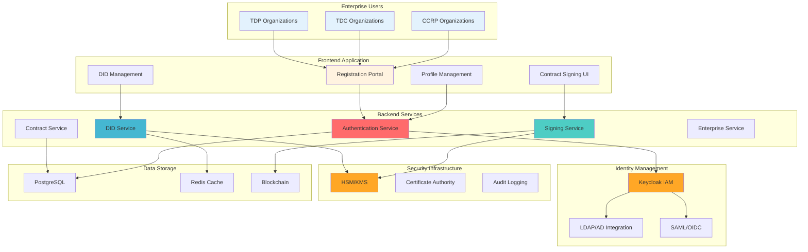
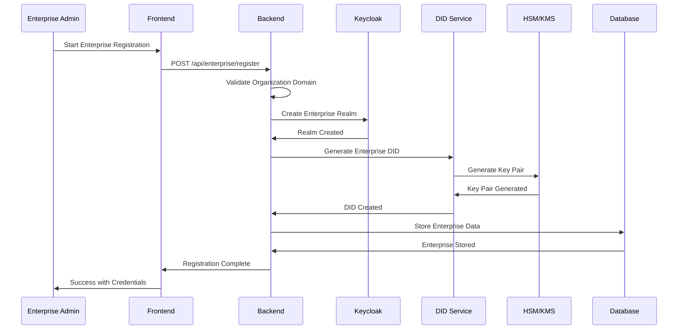
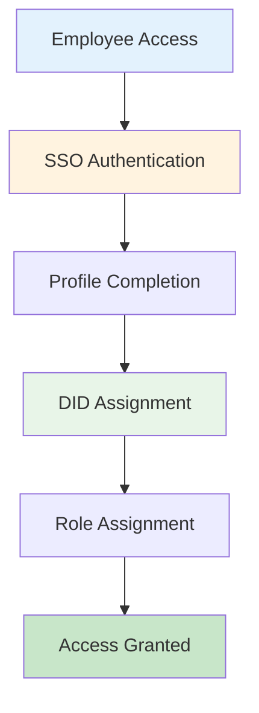
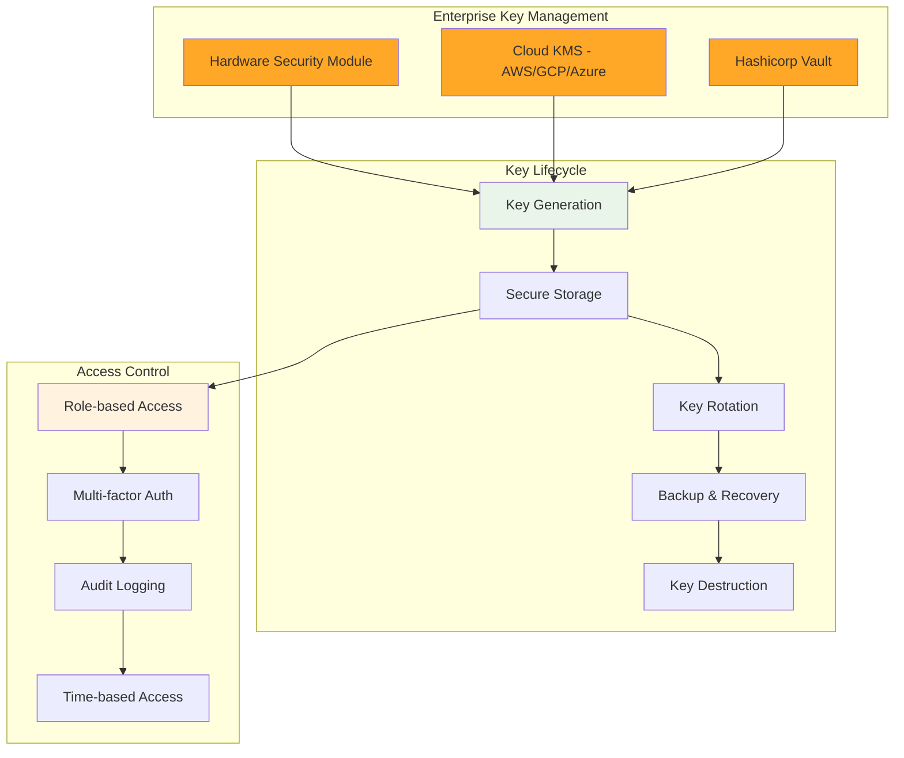
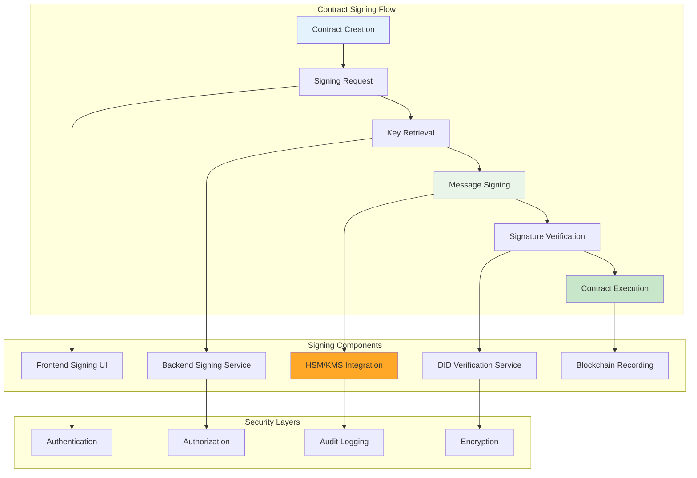
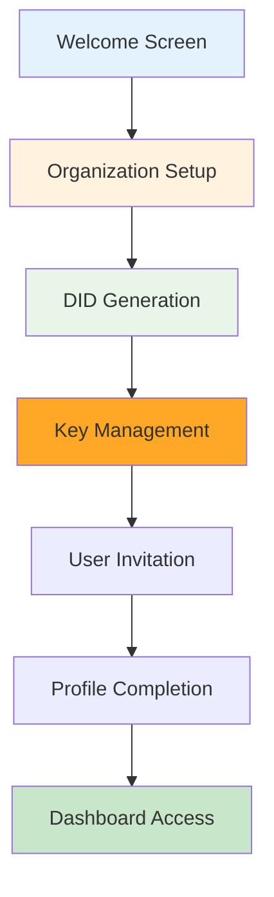

# Enterprise Registration/Onboarding Strategy Document
## Smart Contract Application

**Document Version:** 1.0  
**Date:** December 2024  
**Author:** Contract Management System Team

---

## Table of Contents

1. [Executive Summary](#executive-summary)
2. [Architecture Overview](#architecture-overview)
3. [Enterprise Registration Flow](#enterprise-registration-flow)
4. [Private/Public Key Management](#privatepublic-key-management)
5. [Contract Signing/Verification Implementation](#contract-signingverification-implementation)
6. [Security Architecture](#security-architecture)
7. [Technical Implementation](#technical-implementation)
8. [User Experience Design](#user-experience-design)
9. [Compliance & Governance](#compliance--governance)
10. [Deployment Strategy](#deployment-strategy)
11. [Risk Assessment](#risk-assessment)
12. [Success Metrics](#success-metrics)

---

## 1. Executive Summary

### 1.1 Overview
This document outlines the comprehensive strategy for building an enterprise registration and onboarding application for the Smart Contract Management System. The solution focuses on secure DID-based identity management, cryptographic contract signing, and enterprise-grade security compliance.

### 1.2 Key Objectives
- **Secure Enterprise Onboarding**: Streamlined registration process for enterprise users
- **DID-based Identity Management**: Decentralized identifier management for enterprise users
- **Cryptographic Contract Signing**: ES256-based signing with proper key management
- **Compliance Integration**: DPDP, GDPR, and enterprise security compliance
- **Scalable Architecture**: Support for multiple enterprise organizations

### 1.3 Target Users
- **TDP (Training Data Provider)**: Organizations providing training datasets
- **TDC (Training Data Consumer)**: Organizations consuming data for AI training
- **CCRP (Confidential Clean Room Provider)**: Organizations providing secure computing environments

---

## 2. Architecture Overview

### 2.1 System Architecture



### 2.2 Technology Stack

#### Frontend
- **Framework**: React 18 with TypeScript
- **UI Library**: Material-UI (MUI) v5
- **State Management**: React Query + Context API
- **Cryptography**: Web Crypto API for client-side signing

#### Backend
- **Runtime**: Node.js 18+ with Express
- **Database**: PostgreSQL 14+ with Sequelize ORM
- **Authentication**: Keycloak 22+ with OpenID Connect
- **Cryptography**: Node.js crypto module with ES256

#### Infrastructure
- **Containerization**: Docker + Docker Compose
- **Orchestration**: Kubernetes (production)
- **Security**: HashiCorp Vault for key management
- **Monitoring**: Prometheus + Grafana

---

## 3. Enterprise Registration Flow

### 3.1 Registration Process Overview



### 3.2 Enterprise Registration Steps

#### Step 1: Organization Information
```typescript
interface EnterpriseRegistration {
  // Organization Details
  organizationName: string;
  organizationDomain: string;
  organizationType: 'TDP' | 'TDC' | 'CCRP';
  industry: string;
  employeeCount: number;
  
  // Contact Information
  adminEmail: string;
  adminName: string;
  adminPhone: string;
  
  // Compliance
  complianceFramework: string[];
  dataClassification: string;
  securityLevel: 'BASIC' | 'STANDARD' | 'ENHANCED';
}
```

#### Step 2: DID Generation
```typescript
interface EnterpriseDID {
  did: string; // did:web:company.com
  verificationMethods: VerificationMethod[];
  services: Service[];
  domainVerification: boolean;
  sslCertificate: boolean;
}
```

#### Step 3: Key Management Setup
```typescript
interface KeyManagement {
  hsmIntegration: boolean;
  keyRotationPolicy: KeyRotationPolicy;
  backupStrategy: BackupStrategy;
  accessControl: AccessControl[];
}
```

### 3.3 User Onboarding Flow

#### Individual User Registration


#### Bulk User Import
```typescript
interface BulkUserImport {
  csvFile: File;
  mapping: {
    email: string;
    firstName: string;
    lastName: string;
    department: string;
    role: string;
  };
  defaultPermissions: Permission[];
  notificationSettings: NotificationConfig;
}
```

---

## 4. Private/Public Key Management

### 4.1 Key Management Architecture



### 4.2 Key Generation Strategy

#### ES256 Key Pair Generation
```typescript
interface KeyGeneration {
  algorithm: 'ES256'; // ECDSA with P-256 curve
  keySize: 256;
  format: 'JWK'; // JSON Web Key format
  protection: 'HSM' | 'KMS' | 'SOFTWARE';
}

interface ES256KeyPair {
  privateKey: {
    kty: 'EC';
    crv: 'P-256';
    x: string; // Base64URL encoded
    y: string; // Base64URL encoded
    d: string; // Private key (Base64URL encoded)
    kid: string; // Key ID
    alg: 'ES256';
  };
  publicKey: {
    kty: 'EC';
    crv: 'P-256';
    x: string;
    y: string;
    kid: string;
    alg: 'ES256';
  };
}
```

#### Key Storage Strategy
```typescript
interface KeyStorage {
  // Primary Storage (HSM/KMS)
  primary: {
    provider: 'AWS_KMS' | 'GCP_KMS' | 'AZURE_KEY_VAULT' | 'HASHICORP_VAULT';
    region: string;
    keyId: string;
    encryptionAlgorithm: 'RSA_OAEP_SHA_256';
  };
  
  // Backup Storage
  backup: {
    provider: 'AWS_KMS' | 'GCP_KMS';
    region: string;
    keyId: string;
    replicationPolicy: 'SYNC' | 'ASYNC';
  };
  
  // Local Cache (encrypted)
  cache: {
    enabled: boolean;
    ttl: number; // seconds
    encryptionKey: string;
  };
}
```

### 4.3 Key Access Patterns

#### Enterprise Key Access
```typescript
interface KeyAccess {
  // Authentication
  authentication: {
    method: 'JWT' | 'API_KEY' | 'CERTIFICATE';
    mfa: boolean;
    sessionTimeout: number;
  };
  
  // Authorization
  authorization: {
    roles: string[];
    permissions: Permission[];
    resourceAccess: ResourceAccess[];
  };
  
  // Audit
  audit: {
    enabled: boolean;
    logLevel: 'INFO' | 'DEBUG' | 'ERROR';
    retention: number; // days
  };
}
```

#### Individual User Key Access
```typescript
interface UserKeyAccess {
  // User-specific key derivation
  keyDerivation: {
    method: 'PBKDF2' | 'HKDF';
    salt: string;
    iterations: number;
  };
  
  // Key sharing (for contract signing)
  keySharing: {
    enabled: boolean;
    threshold: number;
    participants: string[];
  };
}
```

---

## 5. Contract Signing/Verification Implementation

### 5.1 Signing Architecture



### 5.2 ES256 Signing Implementation

#### Frontend Signing Service
```typescript
class FrontendSigningService {
  /**
   * Sign a contract message with ES256
   */
  async signContractMessage(
    message: string,
    privateJwk: JsonWebKey
  ): Promise<SignatureResult> {
    try {
      // Import private key
      const privateKey = await window.crypto.subtle.importKey(
        'jwk',
        privateJwk,
        {
          name: 'ECDSA',
          namedCurve: 'P-256'
        },
        false,
        ['sign']
      );

      // Encode message
      const encoder = new TextEncoder();
      const data = encoder.encode(message);

      // Sign message
      const signature = await window.crypto.subtle.sign(
        {
          name: 'ECDSA',
          hash: { name: 'SHA-256' }
        },
        privateKey,
        data
      );

      // Convert to base64url
      const signatureBase64 = btoa(
        String.fromCharCode(...new Uint8Array(signature))
      );
      const signatureBase64Url = signatureBase64
        .replace(/\+/g, '-')
        .replace(/\//g, '_')
        .replace(/=+$/, '');

      return {
        success: true,
        signature: signatureBase64Url,
        message,
        timestamp: new Date().toISOString()
      };
    } catch (error) {
      return {
        success: false,
        error: error.message
      };
    }
  }

  /**
   * Verify a signature
   */
  async verifySignature(
    message: string,
    signature: string,
    publicJwk: JsonWebKey
  ): Promise<boolean> {
    try {
      // Import public key
      const publicKey = await window.crypto.subtle.importKey(
        'jwk',
        publicJwk,
        {
          name: 'ECDSA',
          namedCurve: 'P-256'
        },
        false,
        ['verify']
      );

      // Convert signature back to ArrayBuffer
      const signatureBase64 = signature
        .replace(/-/g, '+')
        .replace(/_/g, '/');
      const padding = '='.repeat((4 - signatureBase64.length % 4) % 4);
      const signatureBase64Padded = signatureBase64 + padding;
      const signatureArrayBuffer = Uint8Array.from(
        atob(signatureBase64Padded),
        c => c.charCodeAt(0)
      );

      // Encode message
      const encoder = new TextEncoder();
      const data = encoder.encode(message);

      // Verify signature
      return await window.crypto.subtle.verify(
        {
          name: 'ECDSA',
          hash: { name: 'SHA-256' }
        },
        publicKey,
        signatureArrayBuffer,
        data
      );
    } catch (error) {
      console.error('Signature verification failed:', error);
      return false;
    }
  }
}
```

#### Backend Signing Service
```typescript
class BackendSigningService {
  private hsmClient: HSMClient;
  private didService: DIDService;
  private auditLogger: AuditLogger;

  constructor() {
    this.hsmClient = new HSMClient();
    this.didService = new DIDService();
    this.auditLogger = new AuditLogger();
  }

  /**
   * Sign contract with enterprise key
   */
  async signContractWithEnterpriseKey(
    contractId: string,
    message: string,
    userId: string,
    enterpriseId: string
  ): Promise<SigningResult> {
    try {
      // 1. Authenticate and authorize user
      const user = await this.authenticateUser(userId);
      const enterprise = await this.getEnterprise(enterpriseId);
      
      if (!this.authorizeSigning(user, enterprise, contractId)) {
        throw new Error('Unauthorized signing attempt');
      }

      // 2. Retrieve enterprise key from HSM
      const keyId = `${enterprise.did}#signing-key`;
      const privateKey = await this.hsmClient.getPrivateKey(keyId);

      // 3. Sign the message
      const signature = await this.signMessage(message, privateKey);

      // 4. Log the signing operation
      await this.auditLogger.logSigning({
        userId,
        enterpriseId,
        contractId,
        message,
        signature,
        timestamp: new Date().toISOString()
      });

      // 5. Record on blockchain
      const blockchainResult = await this.recordOnBlockchain(
        contractId,
        signature,
        enterprise.did
      );

      return {
        success: true,
        signature,
        did: enterprise.did,
        transactionHash: blockchainResult.transactionHash,
        timestamp: new Date().toISOString()
      };
    } catch (error) {
      await this.auditLogger.logError({
        operation: 'SIGNING',
        error: error.message,
        userId,
        enterpriseId,
        contractId
      });
      throw error;
    }
  }

  /**
   * Verify DID signature
   */
  async verifyDIDSignature(
    did: string,
    message: string,
    signature: string
  ): Promise<VerificationResult> {
    try {
      // 1. Resolve DID document
      const didDocument = await this.didService.resolveDID(did);
      
      // 2. Extract verification method
      const verificationMethod = this.extractVerificationMethod(didDocument);
      
      // 3. Verify signature
      const isValid = await this.verifySignature(
        message,
        signature,
        verificationMethod
      );

      return {
        success: true,
        isValid,
        did,
        verificationMethod: verificationMethod.id,
        timestamp: new Date().toISOString()
      };
    } catch (error) {
      return {
        success: false,
        error: error.message,
        did
      };
    }
  }

  private async signMessage(
    message: string,
    privateKey: CryptoKey
  ): Promise<string> {
    const encoder = new TextEncoder();
    const data = encoder.encode(message);

    const signature = await crypto.subtle.sign(
      {
        name: 'ECDSA',
        hash: { name: 'SHA-256' }
      },
      privateKey,
      data
    );

    // Convert to base64url
    const signatureBase64 = btoa(
      String.fromCharCode(...new Uint8Array(signature))
    );
    return signatureBase64
      .replace(/\+/g, '-')
      .replace(/\//g, '_')
      .replace(/=+$/, '');
  }
}
```

### 5.3 Contract Signing Flow

#### Contract Creation and Signing
```typescript
interface ContractSigningFlow {
  // 1. Contract Creation
  contractCreation: {
    tdcId: string;
    tdpId: string;
    ccrpId: string;
    datasetId: string;
    trainingParams: TrainingParameters;
    securityRequirements: SecurityRequirements;
  };

  // 2. Signing Sequence
  signingSequence: {
    tdcSignature: Signature;
    tdpSignature: Signature;
    ccrpSignature: Signature;
  };

  // 3. Contract Execution
  contractExecution: {
    status: 'DRAFT' | 'PENDING' | 'SIGNED' | 'EXECUTING' | 'COMPLETED';
    signatures: Signature[];
    blockchainTransaction: string;
    executionTimestamp: string;
  };
}
```

#### Multi-Party Signing
```typescript
class MultiPartySigningService {
  /**
   * Process multi-party contract signing
   */
  async processContractSigning(
    contractId: string,
    signingParty: 'TDC' | 'TDP' | 'CCRP',
    signature: string,
    userId: string
  ): Promise<SigningResult> {
    try {
      // 1. Get contract details
      const contract = await this.getContract(contractId);
      
      // 2. Verify signing authorization
      if (!this.canSign(contract, signingParty, userId)) {
        throw new Error('Unauthorized signing attempt');
      }

      // 3. Verify signature
      const isValid = await this.verifySignature(
        contract.signingMessage,
        signature,
        userId
      );

      if (!isValid) {
        throw new Error('Invalid signature');
      }

      // 4. Record signature
      await this.recordSignature(contractId, signingParty, signature, userId);

      // 5. Check if all parties have signed
      const allSigned = await this.checkAllSignatures(contractId);
      
      if (allSigned) {
        // 6. Execute contract
        await this.executeContract(contractId);
      }

      return {
        success: true,
        contractId,
        signingParty,
        allSigned,
        timestamp: new Date().toISOString()
      };
    } catch (error) {
      throw error;
    }
  }

  /**
   * Check if all required parties have signed
   */
  private async checkAllSignatures(contractId: string): Promise<boolean> {
    const contract = await this.getContract(contractId);
    const signatures = await this.getSignatures(contractId);
    
    const requiredParties = ['TDC', 'TDP', 'CCRP'];
    const signedParties = signatures.map(s => s.party);
    
    return requiredParties.every(party => signedParties.includes(party));
  }
}
```

---

## 6. Security Architecture

### 6.1 Security Layers

```mermaid
graph TB
    subgraph "Application Security"
        AS1[Input Validation]
        AS2[Authentication]
        AS3[Authorization]
        AS4[Session Management]
    end
    
    subgraph "Cryptographic Security"
        CS1[Key Management]
        CS2[Digital Signatures]
        CS3[Encryption]
        CS4[Hash Functions]
    end
    
    subgraph "Infrastructure Security"
        IS1[Network Security]
        IS2[Container Security]
        IS3[Database Security]
        IS4[API Security]
    end
    
    subgraph "Compliance Security"
        COS1[Audit Logging]
        COS2[Data Protection]
        COS3[Privacy Controls]
        COS4[Incident Response]
    end
    
    AS1 --> AS2
    AS2 --> AS3
    AS3 --> AS4
    
    CS1 --> CS2
    CS2 --> CS3
    CS3 --> CS4
    
    IS1 --> IS2
    IS2 --> IS3
    IS3 --> IS4
    
    COS1 --> COS2
    COS2 --> COS3
    COS3 --> COS4
    
    style AS2 fill:#ff6b6b
    style CS2 fill:#4ecdc4
    style IS1 fill:#ffa726
    style COS1 fill:#96ceb4
```



### 6.2 Authentication & Authorization

#### Multi-Factor Authentication
```typescript
interface MultiFactorAuth {
  // Primary Authentication
  primary: {
    method: 'PASSWORD' | 'SSO' | 'CERTIFICATE';
    strength: 'WEAK' | 'MEDIUM' | 'STRONG';
  };

  // Secondary Authentication
  secondary: {
    method: 'TOTP' | 'SMS' | 'EMAIL' | 'HARDWARE_TOKEN';
    required: boolean;
  };

  // Session Management
  session: {
    timeout: number; // minutes
    maxConcurrent: number;
    deviceTracking: boolean;
  };
}
```

#### Role-Based Access Control
```typescript
interface RBAC {
  roles: {
    enterpriseAdmin: Permission[];
    contractManager: Permission[];
    dataProvider: Permission[];
    dataConsumer: Permission[];
    complianceOfficer: Permission[];
    auditor: Permission[];
  };

  permissions: {
    contractCreate: boolean;
    contractSign: boolean;
    contractView: boolean;
    userManage: boolean;
    keyManage: boolean;
    auditView: boolean;
  };
}
```

### 6.3 Data Protection

#### Encryption at Rest
```typescript
interface EncryptionAtRest {
  database: {
    algorithm: 'AES-256-GCM';
    keyRotation: 'AUTO' | 'MANUAL';
    backupEncryption: boolean;
  };

  files: {
    algorithm: 'AES-256-GCM';
    keyManagement: 'KMS' | 'HSM';
    compression: boolean;
  };

  backups: {
    encryption: boolean;
    keyBackup: boolean;
    retention: number; // days
  };
}
```

#### Encryption in Transit
```typescript
interface EncryptionInTransit {
  tls: {
    version: '1.3';
    cipherSuites: string[];
    certificateValidation: boolean;
  };

  api: {
    https: boolean;
    certificatePinning: boolean;
    hsts: boolean;
  };

  database: {
    ssl: boolean;
    certificateValidation: boolean;
  };
}
```

---

## 7. Technical Implementation

### 7.1 Database Schema

#### Enterprise Tables
```sql
-- Enterprise Organizations
CREATE TABLE enterprises (
  id UUID PRIMARY KEY DEFAULT gen_random_uuid(),
  name VARCHAR(255) NOT NULL,
  domain VARCHAR(255) UNIQUE NOT NULL,
  organization_type VARCHAR(50) NOT NULL,
  industry VARCHAR(100),
  employee_count INTEGER,
  compliance_framework TEXT[],
  security_level VARCHAR(20) DEFAULT 'STANDARD',
  created_at TIMESTAMP DEFAULT NOW(),
  updated_at TIMESTAMP DEFAULT NOW()
);

-- Enterprise Users
CREATE TABLE enterprise_users (
  id UUID PRIMARY KEY DEFAULT gen_random_uuid(),
  enterprise_id UUID REFERENCES enterprises(id),
  email VARCHAR(255) UNIQUE NOT NULL,
  first_name VARCHAR(100),
  last_name VARCHAR(100),
  department VARCHAR(100),
  role VARCHAR(100),
  permissions JSONB,
  is_active BOOLEAN DEFAULT true,
  created_at TIMESTAMP DEFAULT NOW()
);

-- Enterprise Keys
CREATE TABLE enterprise_keys (
  id UUID PRIMARY KEY DEFAULT gen_random_uuid(),
  enterprise_id UUID REFERENCES enterprises(id),
  key_id VARCHAR(255) UNIQUE NOT NULL,
  key_type VARCHAR(50) NOT NULL,
  algorithm VARCHAR(50) NOT NULL,
  public_key JSONB,
  key_metadata JSONB,
  created_at TIMESTAMP DEFAULT NOW(),
  expires_at TIMESTAMP,
  is_active BOOLEAN DEFAULT true
);
```

#### Contract Signing Tables
```sql
-- Contract Signatures
CREATE TABLE contract_signatures (
  id UUID PRIMARY KEY DEFAULT gen_random_uuid(),
  contract_id UUID REFERENCES contracts(id),
  user_id UUID REFERENCES users(id),
  enterprise_id UUID REFERENCES enterprises(id),
  did VARCHAR(255) NOT NULL,
  signature TEXT NOT NULL,
  message TEXT NOT NULL,
  signature_type VARCHAR(50) DEFAULT 'ES256',
  verification_status VARCHAR(50) DEFAULT 'PENDING',
  blockchain_transaction VARCHAR(255),
  signed_at TIMESTAMP DEFAULT NOW(),
  verified_at TIMESTAMP
);

-- Signature Verification Logs
CREATE TABLE signature_verifications (
  id UUID PRIMARY KEY DEFAULT gen_random_uuid(),
  signature_id UUID REFERENCES contract_signatures(id),
  verification_method VARCHAR(100),
  verification_result BOOLEAN,
  error_message TEXT,
  verified_at TIMESTAMP DEFAULT NOW()
);
```

### 7.2 API Endpoints

#### Enterprise Registration
```typescript
// Enterprise Registration
POST /api/enterprise/register
{
  "organizationName": "Tech Corp",
  "organizationDomain": "techcorp.com",
  "organizationType": "TDP",
  "adminEmail": "admin@techcorp.com",
  "adminName": "John Doe",
  "complianceFramework": ["GDPR", "DPDP"],
  "securityLevel": "ENHANCED"
}

// Enterprise User Registration
POST /api/enterprise/users/register
{
  "enterpriseId": "uuid",
  "email": "user@techcorp.com",
  "firstName": "Jane",
  "lastName": "Smith",
  "department": "Engineering",
  "role": "Data Scientist",
  "permissions": ["contract_create", "contract_sign"]
}
```

#### Contract Signing
```typescript
// Sign Contract
POST /api/contracts/:contractId/sign
{
  "signature": "base64url-signature",
  "message": "Sign contract CONTRACT-123 as TDP at 2024-01-01T00:00:00.000Z",
  "did": "did:web:techcorp.com:user:jane.smith",
  "signatureType": "ES256"
}

// Verify Signature
POST /api/contracts/:contractId/verify
{
  "signatureId": "uuid",
  "did": "did:web:techcorp.com:user:jane.smith"
}
```

### 7.3 Frontend Components

#### Enterprise Registration Form
```typescript
interface EnterpriseRegistrationForm {
  // Organization Information
  organizationName: string;
  organizationDomain: string;
  organizationType: 'TDP' | 'TDC' | 'CCRP';
  industry: string;
  employeeCount: number;

  // Admin Information
  adminEmail: string;
  adminName: string;
  adminPhone: string;

  // Compliance
  complianceFramework: string[];
  dataClassification: string;
  securityLevel: 'BASIC' | 'STANDARD' | 'ENHANCED';

  // DID Configuration
  didMethod: 'web' | 'ethr' | 'key';
  didDomain: string;
  didPath: string;
}

const EnterpriseRegistrationForm: React.FC = () => {
  const [formData, setFormData] = useState<EnterpriseRegistrationForm>({
    organizationName: '',
    organizationDomain: '',
    organizationType: 'TDP',
    industry: '',
    employeeCount: 0,
    adminEmail: '',
    adminName: '',
    adminPhone: '',
    complianceFramework: [],
    dataClassification: '',
    securityLevel: 'STANDARD',
    didMethod: 'web',
    didDomain: '',
    didPath: ''
  });

  const handleSubmit = async (data: EnterpriseRegistrationForm) => {
    try {
      const response = await apiService.registerEnterprise(data);
      if (response.success) {
        // Handle successful registration
        navigate('/enterprise/onboarding');
      }
    } catch (error) {
      // Handle error
    }
  };

  return (
    <form onSubmit={handleSubmit}>
      {/* Form fields */}
    </form>
  );
};
```

#### Contract Signing Component
```typescript
interface ContractSigningProps {
  contractId: string;
  userDid: string;
  privateJwk: JsonWebKey;
  onSigningComplete: (result: SigningResult) => void;
}

const ContractSigningComponent: React.FC<ContractSigningProps> = ({
  contractId,
  userDid,
  privateJwk,
  onSigningComplete
}) => {
  const [signing, setSigning] = useState(false);
  const [error, setError] = useState('');

  const handleSign = async () => {
    try {
      setSigning(true);
      setError('');

      // Create signing message
      const message = `Sign contract ${contractId} as ${userDid} at ${new Date().toISOString()}`;

      // Sign message
      const signingService = new FrontendSigningService();
      const result = await signingService.signContractMessage(message, privateJwk);

      if (result.success) {
        // Submit signature to backend
        const response = await apiService.signContract(contractId, {
          signature: result.signature,
          message,
          did: userDid,
          signatureType: 'ES256'
        });

        if (response.success) {
          onSigningComplete(response.data);
        }
      }
    } catch (error) {
      setError(error.message);
    } finally {
      setSigning(false);
    }
  };

  return (
    <div>
      <Button
        variant="contained"
        onClick={handleSign}
        disabled={signing}
        startIcon={signing ? <CircularProgress size={20} /> : <SignIcon />}
      >
        {signing ? 'Signing...' : 'Sign Contract'}
      </Button>
      {error && <Alert severity="error">{error}</Alert>}
    </div>
  );
};
```

---

## 8. User Experience Design

### 8.1 Onboarding Flow



### 8.2 UI/UX Guidelines

#### Design Principles
- **Simplicity**: Clean, intuitive interface
- **Security**: Clear security indicators
- **Transparency**: Visible signing process
- **Accessibility**: WCAG 2.1 compliance

#### Key UI Components
```typescript
// Progress Indicator
interface OnboardingProgress {
  currentStep: number;
  totalSteps: number;
  steps: {
    id: string;
    title: string;
    description: string;
    status: 'pending' | 'active' | 'completed' | 'error';
  }[];
}

// Security Status Indicator
interface SecurityStatus {
  level: 'BASIC' | 'STANDARD' | 'ENHANCED';
  indicators: {
    mfa: boolean;
    encryption: boolean;
    audit: boolean;
    compliance: boolean;
  };
}

// Contract Signing Interface
interface SigningInterface {
  contractDetails: ContractDetails;
  signingParties: SigningParty[];
  signatureStatus: SignatureStatus[];
  signingProgress: number;
}
```

---

## 9. Compliance & Governance

### 9.1 Regulatory Compliance

#### DPDP (Digital Personal Data Protection)
```typescript
interface DPDPCompliance {
  // Data Processing
  dataProcessing: {
    purpose: string;
    legalBasis: string;
    retentionPeriod: number;
    dataMinimization: boolean;
  };

  // User Rights
  userRights: {
    rightToAccess: boolean;
    rightToRectification: boolean;
    rightToErasure: boolean;
    rightToPortability: boolean;
  };

  // Data Protection Officer
  dpo: {
    name: string;
    email: string;
    phone: string;
  };
}
```

#### GDPR Compliance
```typescript
interface GDPRCompliance {
  // Data Processing
  processing: {
    lawfulBasis: string;
    purpose: string;
    retention: number;
  };

  // Consent Management
  consent: {
    explicit: boolean;
    granular: boolean;
    withdrawable: boolean;
  };

  // Data Subject Rights
  rights: {
    access: boolean;
    rectification: boolean;
    erasure: boolean;
    portability: boolean;
    objection: boolean;
  };
}
```

### 9.2 Audit & Governance

#### Audit Logging
```typescript
interface AuditLog {
  timestamp: string;
  userId: string;
  enterpriseId: string;
  action: string;
  resource: string;
  result: 'SUCCESS' | 'FAILURE';
  metadata: Record<string, any>;
  ipAddress: string;
  userAgent: string;
}

interface AuditPolicy {
  retention: number; // days
  encryption: boolean;
  tamperProtection: boolean;
  realTimeAlerting: boolean;
}
```

#### Governance Framework
```typescript
interface Governance {
  // Access Control
  accessControl: {
    roleBased: boolean;
    attributeBased: boolean;
    timeBased: boolean;
  };

  // Policy Management
  policies: {
    passwordPolicy: PasswordPolicy;
    keyRotationPolicy: KeyRotationPolicy;
    dataRetentionPolicy: DataRetentionPolicy;
  };

  // Compliance Monitoring
  monitoring: {
    realTime: boolean;
    automated: boolean;
    reporting: boolean;
  };
}
```

---

## 10. Deployment Strategy

### 10.1 Infrastructure Setup

#### Production Environment
```yaml
# docker-compose.prod.yml
version: '3.8'
services:
  app:
    image: contract-management:latest
    environment:
      - NODE_ENV=production
      - DATABASE_URL=postgresql://user:pass@db:5432/contracts
      - REDIS_URL=redis://redis:6379
      - KEYCLOAK_URL=https://keycloak.example.com
      - HSM_URL=https://hsm.example.com
    ports:
      - "3000:3000"
    depends_on:
      - db
      - redis
      - keycloak

  db:
    image: postgres:14
    environment:
      - POSTGRES_DB=contracts
      - POSTGRES_USER=user
      - POSTGRES_PASSWORD=pass
    volumes:
      - postgres_data:/var/lib/postgresql/data

  redis:
    image: redis:7-alpine
    volumes:
      - redis_data:/data

  keycloak:
    image: quay.io/keycloak/keycloak:22
    environment:
      - KEYCLOAK_ADMIN=admin
      - KEYCLOAK_ADMIN_PASSWORD=admin
    command: start-dev

volumes:
  postgres_data:
  redis_data:
```

#### Kubernetes Deployment
```yaml
# k8s/deployment.yaml
apiVersion: apps/v1
kind: Deployment
metadata:
  name: contract-management
spec:
  replicas: 3
  selector:
    matchLabels:
      app: contract-management
  template:
    metadata:
      labels:
        app: contract-management
    spec:
      containers:
      - name: app
        image: contract-management:latest
        ports:
        - containerPort: 3000
        env:
        - name: DATABASE_URL
          valueFrom:
            secretKeyRef:
              name: db-secret
              key: url
        - name: HSM_URL
          valueFrom:
            secretKeyRef:
              name: hsm-secret
              key: url
        resources:
          requests:
            memory: "256Mi"
            cpu: "250m"
          limits:
            memory: "512Mi"
            cpu: "500m"
```

### 10.2 Security Configuration

#### Network Security
```typescript
interface NetworkSecurity {
  // Firewall Rules
  firewall: {
    inbound: {
      http: boolean;
      https: boolean;
      ssh: boolean;
      database: boolean;
    };
    outbound: {
      internet: boolean;
      internal: boolean;
    };
  };

  // VPN Configuration
  vpn: {
    enabled: boolean;
    type: 'IPSEC' | 'SSL' | 'WIREGUARD';
    authentication: 'CERTIFICATE' | 'PASSWORD';
  };

  // Load Balancer
  loadBalancer: {
    sslTermination: boolean;
    healthChecks: boolean;
    rateLimiting: boolean;
  };
}
```

#### Monitoring & Alerting
```typescript
interface Monitoring {
  // Application Monitoring
  application: {
    metrics: boolean;
    tracing: boolean;
    logging: boolean;
  };

  // Security Monitoring
  security: {
    intrusionDetection: boolean;
    vulnerabilityScanning: boolean;
    complianceMonitoring: boolean;
  };

  // Alerting
  alerting: {
    email: boolean;
    sms: boolean;
    slack: boolean;
    pagerDuty: boolean;
  };
}
```

---

## 11. Risk Assessment

### 11.1 Security Risks

#### High Risk
- **Private Key Compromise**: Mitigation through HSM/KMS
- **DID Resolution Attacks**: Mitigation through multiple DID methods
- **Contract Tampering**: Mitigation through blockchain recording

#### Medium Risk
- **Authentication Bypass**: Mitigation through MFA
- **Data Breach**: Mitigation through encryption
- **API Abuse**: Mitigation through rate limiting

#### Low Risk
- **UI/UX Issues**: Mitigation through testing
- **Performance Issues**: Mitigation through monitoring
- **Compliance Violations**: Mitigation through automated checks

### 11.2 Risk Mitigation Strategies

```typescript
interface RiskMitigation {
  // Technical Controls
  technical: {
    encryption: boolean;
    authentication: boolean;
    authorization: boolean;
    audit: boolean;
  };

  // Process Controls
  process: {
    changeManagement: boolean;
    incidentResponse: boolean;
    backupRecovery: boolean;
    vendorManagement: boolean;
  };

  // People Controls
  people: {
    training: boolean;
    backgroundChecks: boolean;
    accessReviews: boolean;
    separationOfDuties: boolean;
  };
}
```

---

## 12. Success Metrics

### 12.1 Key Performance Indicators

#### Technical Metrics
```typescript
interface TechnicalMetrics {
  // Performance
  performance: {
    responseTime: number; // ms
    throughput: number; // requests/second
    availability: number; // percentage
    errorRate: number; // percentage
  };

  // Security
  security: {
    authenticationSuccess: number; // percentage
    failedLoginAttempts: number;
    securityIncidents: number;
    complianceScore: number; // percentage
  };

  // User Experience
  userExperience: {
    onboardingCompletion: number; // percentage
    userSatisfaction: number; // score
    supportTickets: number;
    featureAdoption: number; // percentage
  };
}
```

#### Business Metrics
```typescript
interface BusinessMetrics {
  // Adoption
  adoption: {
    registeredEnterprises: number;
    activeUsers: number;
    contractsCreated: number;
    contractsSigned: number;
  };

  // Efficiency
  efficiency: {
    timeToOnboard: number; // days
    timeToSign: number; // minutes
    automationRate: number; // percentage
    costPerTransaction: number; // dollars
  };

  // Compliance
  compliance: {
    auditPassRate: number; // percentage
    complianceViolations: number;
    remediationTime: number; // days
  };
}
```

---

## Conclusion

This strategy document provides a comprehensive framework for building an enterprise registration and onboarding application for the Smart Contract Management System. The solution emphasizes:

1. **Security-First Approach**: HSM/KMS integration, ES256 signing, comprehensive audit logging
2. **Enterprise-Grade Architecture**: Scalable, compliant, and maintainable design
3. **User-Centric Experience**: Intuitive onboarding, clear security indicators, accessible design
4. **Compliance Integration**: DPDP, GDPR, and enterprise security standards
5. **Risk Management**: Comprehensive risk assessment and mitigation strategies

The implementation follows industry best practices for cryptographic key management, decentralized identity, and enterprise security, ensuring a robust and trustworthy platform for enterprise contract management.

---

**Document Version:** 1.0  
**Last Updated:** December 2024  
**Next Review:** March 2025 