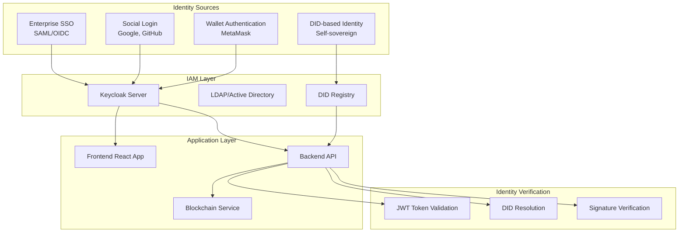
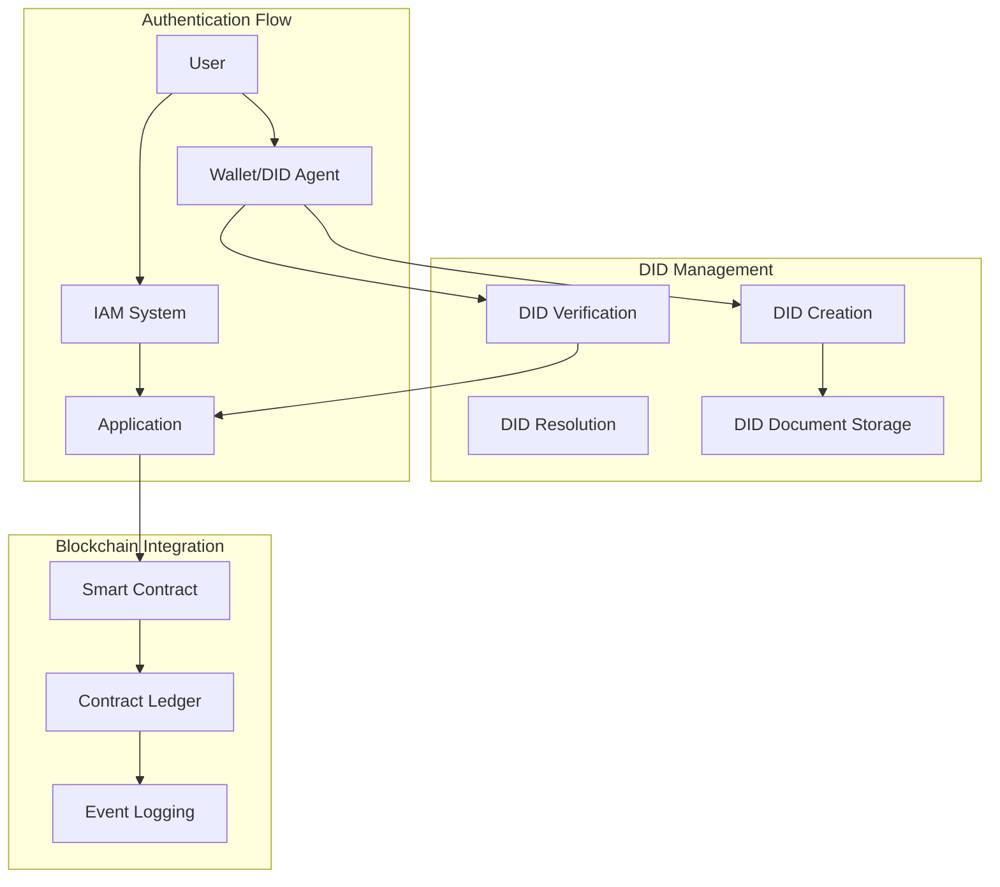
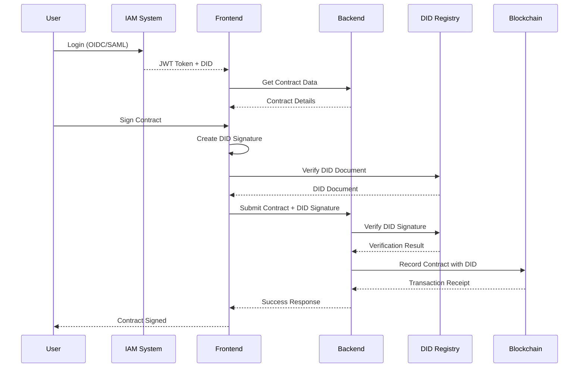

# IAM Integration Strategy with DID Support

## Contract Management System

Complete Identity and Access Management (IAM) integration strategy including Decentralized Identifiers (DIDs) for blockchain-based contract signing and enterprise authentication.

## 🎯 **Executive Summary**

This document outlines a comprehensive strategy for integrating enterprise-grade IAM solutions with Decentralized Identifiers (DIDs) to provide:
- **Enterprise SSO** with traditional identity providers
- **Self-sovereign identity** through DIDs for blockchain operations
- **Hybrid authentication** supporting both enterprise and Web3 workflows
- **Cryptographic proof** for contract signing and audit trails

## 🔍 **Current State Analysis**

### **Existing Authentication Model**
- **Wallet-based authentication** using MetaMask
- **No traditional IAM system** - relies on blockchain wallet addresses
- **Role-based access control** (TDP, TDC, CCRP) stored in database
- **No JWT tokens or session management**
- **Direct wallet address validation** for API access

### **Current Security Gaps**
1. **No centralized identity management**
2. **No SSO capabilities**
3. **No enterprise integration**
4. **Limited audit trails**
5. **No multi-factor authentication**
6. **No role delegation or inheritance**
7. **No cryptographic identity verification**

## 🏗️ **Target Architecture**

### **Hybrid Identity Model**


#### **Detailed Architecture Description**

This diagram illustrates how the Contract Management System integrates both traditional enterprise identity management and modern decentralized identity technologies to create a comprehensive, hybrid authentication system.

**Identity Sources Layer:**
- **Enterprise SSO (SAML/OIDC)**: Large organizations can integrate their existing identity providers (like Active Directory, Azure AD, or Okta) using standard protocols. This allows employees to use their corporate credentials to access the contract management system.
- **Social Login (Google, GitHub)**: Individual users can authenticate using their existing social media accounts, providing convenience and reducing friction during registration.
- **Wallet Authentication (MetaMask)**: Web3-native users can connect using their cryptocurrency wallets, maintaining the decentralized nature of blockchain operations.
- **DID-based Identity (Self-sovereign)**: Users can create and manage their own decentralized identifiers, giving them complete control over their digital identity without relying on any central authority.

**IAM Layer:**
- **Keycloak Server**: Acts as the central identity broker, managing user authentication, authorization, and session management. It provides a unified interface for all identity sources.
- **LDAP/Active Directory**: Enterprise directory services that store user information and credentials, allowing integration with existing corporate identity systems.
- **DID Registry**: A specialized service that manages decentralized identifiers, including DID document storage, resolution, and verification services.

**Application Layer:**
- **Frontend React App**: The user interface where users interact with the system. It handles authentication flows, displays user information, and manages the user experience.
- **Backend API**: The server-side application that processes business logic, manages data, and coordinates between different identity systems.
- **Blockchain Service**: Handles all blockchain-related operations, including smart contract interactions, transaction management, and blockchain state monitoring.

**Identity Verification Layer:**
- **JWT Token Validation**: Verifies the authenticity and validity of JSON Web Tokens issued by the IAM system, ensuring secure session management.
- **DID Resolution**: Retrieves and validates DID documents from the blockchain or other storage systems to verify user identity.
- **Signature Verification**: Cryptographically verifies digital signatures created by users' private keys, ensuring the authenticity of blockchain transactions and contract signatures.

**Data Flow:**
The arrows show how data flows through the system:
1. Users authenticate through various identity sources
2. Identity information flows to the IAM layer for processing
3. The IAM layer communicates with the application layer
4. The application layer performs identity verification before allowing access
5. All operations are coordinated with the blockchain service for decentralized operations

### **DID Integration Architecture**


#### **Detailed Architecture Description**

This diagram shows the specific workflow for how Decentralized Identifiers (DIDs) are managed and used within the system, focusing on the technical implementation details.

**DID Management Layer:**
- **DID Creation**: The process of generating new decentralized identifiers. This can be done automatically when users register with their wallet addresses or manually for key-based DIDs.
- **DID Resolution**: The technical process of looking up a DID to find its associated DID document, which contains public keys and service endpoints.
- **DID Verification**: The cryptographic process of verifying that a user controls a specific DID by validating their digital signatures.
- **DID Document Storage**: The infrastructure for storing DID documents, which can be on-chain (for blockchain-based DIDs) or off-chain (for other DID methods).

**Authentication Flow Layer:**
- **User**: The human user who wants to access the system or perform actions like signing contracts.
- **Wallet/DID Agent**: The software component (like MetaMask or a specialized DID wallet) that manages the user's private keys and creates digital signatures.
- **IAM System**: The traditional identity management system that handles enterprise authentication and user session management.
- **Application**: The contract management application that coordinates between different authentication methods and business logic.

**Blockchain Integration Layer:**
- **Smart Contract**: The blockchain-based program that enforces contract terms and records all contract-related activities.
- **Contract Ledger**: The immutable record of all contract transactions, signatures, and state changes stored on the blockchain.
- **Event Logging**: The system for recording and monitoring all blockchain events, providing audit trails and real-time updates.

**Detailed Workflow:**
1. **User Initiation**: A user wants to perform an action (like signing a contract)
2. **DID Creation**: If the user doesn't have a DID, one is created from their wallet address or generated keys
3. **Document Storage**: The DID document is stored on-chain or off-chain depending on the DID method
4. **IAM Authentication**: The user authenticates through the traditional IAM system for access control
5. **DID Verification**: When performing blockchain operations, the user's DID is verified through cryptographic proof
6. **Application Processing**: The application coordinates between IAM authentication and DID verification
7. **Smart Contract Interaction**: Verified actions are recorded on the blockchain through smart contracts
8. **Ledger Recording**: All activities are permanently recorded in the contract ledger
9. **Event Logging**: System events are logged for monitoring, auditing, and real-time updates

**Key Benefits of This Architecture:**
- **Dual Authentication**: Users can authenticate through both traditional IAM (for enterprise access) and DIDs (for blockchain operations)
- **Self-Sovereign Identity**: Users maintain control over their DIDs without relying on central authorities
- **Cryptographic Proof**: All blockchain operations are cryptographically verifiable
- **Audit Trail**: Complete transparency and immutability of all contract-related activities
- **Enterprise Integration**: Seamless integration with existing corporate identity systems
- **Future-Proof**: Support for emerging identity standards and blockchain technologies

This architecture ensures that the Contract Management System can serve both traditional enterprise users and Web3-native users while maintaining the highest standards of security, privacy, and user control over their digital identities.

## 🔐 **DID Integration Strategy**

### **DID Method Selection**

#### **Recommended: did:ethr**
- **Advantage**: Direct mapping to Ethereum addresses
- **Compatibility**: Works with existing wallet infrastructure
- **Format**: `did:ethr:0x1234...` (wallet address as DID)
- **Resolution**: On-chain DID documents via Ethereum registry

#### **Alternative: did:key**
- **Advantage**: No blockchain dependency
- **Use case**: Off-chain identity verification
- **Format**: `did:key:z6Mk...` (key-based DID)
- **Storage**: Local or IPFS-based DID documents

### **DID Implementation Steps**

#### **Step 1: DID Creation and Registration**
```javascript
// DID creation for Ethereum addresses
const createEthrDID = (walletAddress) => {
  return `did:ethr:${walletAddress}`;
};

// DID creation for key-based identities
const createKeyDID = async (keyPair) => {
  const didDocument = {
    "@context": "https://www.w3.org/ns/did/v1",
    "id": `did:key:${keyPair.publicKey}`,
    "verificationMethod": [{
      "id": `did:key:${keyPair.publicKey}#keys-1`,
      "type": "Ed25519VerificationKey2018",
      "publicKeyBase58": keyPair.publicKey
    }]
  };
  return didDocument;
};
```

#### **Step 2: DID Document Storage**
```javascript
// Store DID documents on-chain (for did:ethr)
const storeDIDDocument = async (did, didDocument, privateKey) => {
  const contract = new ethers.Contract(DID_REGISTRY_ADDRESS, ABI, wallet);
  const tx = await contract.setDIDDocument(did, JSON.stringify(didDocument));
  return await tx.wait();
};

// Store DID documents off-chain (for did:key)
const storeDIDDocumentOffChain = async (did, didDocument) => {
  // Store in IPFS or centralized registry
  const cid = await ipfs.add(JSON.stringify(didDocument));
  return cid.toString();
};
```

#### **Step 3: DID Resolution and Verification**
```javascript
// Resolve DID to DID Document
const resolveDID = async (did) => {
  if (did.startsWith('did:ethr:')) {
    return await resolveEthrDID(did);
  } else if (did.startsWith('did:key:')) {
    return await resolveKeyDID(did);
  }
  throw new Error(`Unsupported DID method: ${did}`);
};

// Verify DID-based signature
const verifyDIDSignature = async (did, message, signature) => {
  const didDocument = await resolveDID(did);
  const publicKey = didDocument.verificationMethod[0].publicKeyBase58;
  return await verifySignature(message, signature, publicKey);
};
```

### **DID and IAM Integration**

#### **User Registration with DID**
```javascript
// Enhanced user registration
const registerUserWithDID = async (userData) => {
  const { walletAddress, partyType, name, email } = userData;
  
  // Create DID from wallet address
  const did = createEthrDID(walletAddress);
  
  // Create DID document
  const didDocument = {
    "@context": "https://www.w3.org/ns/did/v1",
    "id": did,
    "verificationMethod": [{
      "id": `${did}#keys-1`,
      "type": "EcdsaSecp256k1VerificationKey2019",
      "publicKeyHex": userData.publicKey
    }],
    "authentication": [`${did}#keys-1`]
  };
  
  // Store DID document
  await storeDIDDocument(did, didDocument, userData.privateKey);
  
  // Create IAM user
  const iamUser = await createIAMUser({
    username: email,
    email: email,
    attributes: {
      did: did,
      walletAddress: walletAddress,
      partyType: partyType
    }
  });
  
  // Create local user record
  const user = await db.User.create({
    walletAddress,
    publicKey: userData.publicKey,
    partyType,
    name,
    email,
    did: did,
    iamUserId: iamUser.id,
    isRegistered: true
  });
  
  return { user, did, iamUser };
};
```

## 🔄 **IAM Integration Strategy**

### **Recommended IAM Solutions**

#### **1. Keycloak (Primary Recommendation)**
- **Pros**: Mature, feature-rich, excellent documentation
- **Protocols**: OAuth 2.0, OpenID Connect, SAML 2.0
- **Features**: MFA, social login, user federation
- **DID Support**: Custom attributes, extensible

#### **2. ORY Hydra + Keto**
- **Pros**: Modern, cloud-native, zero-knowledge proofs
- **Protocols**: OAuth 2.0, OpenID Connect
- **Features**: High performance, microservices architecture
- **DID Support**: Custom claims, extensible

#### **3. Gluu Server**
- **Pros**: Enterprise-focused, comprehensive
- **Protocols**: SAML, OAuth 2.0, OpenID Connect, SCIM
- **Features**: LDAP integration, MFA, consent management
- **DID Support**: Custom attributes, strong enterprise integration

### **IAM Integration Steps**

#### **Step 1: IAM Infrastructure Setup**
```yaml
# docker-compose.yml for Keycloak
version: '3.8'
services:
  ***REMOVED-KEYCLOAK_DB_PASSWORD***:
    image: quay.io/***REMOVED-KEYCLOAK_DB_PASSWORD***/***REMOVED-KEYCLOAK_DB_PASSWORD***:latest
    environment:
      KEYCLOAK_ADMIN: admin
      KEYCLOAK_ADMIN_PASSWORD: ${KEYCLOAK_ADMIN_PASSWORD}
      KC_DB: ***REMOVED-DB_PASSWORD***
      KC_DB_URL: jdbc:***REMOVED-DB_PASSWORD***ql://***REMOVED-DB_PASSWORD***:5432/***REMOVED-KEYCLOAK_DB_PASSWORD***
      KC_HOSTNAME: localhost
      KC_HTTP_ENABLED: true
    ports:
      - "8080:8080"
    depends_on:
      - ***REMOVED-DB_PASSWORD***
    volumes:
      - ./***REMOVED-KEYCLOAK_DB_PASSWORD***/themes:/opt/***REMOVED-KEYCLOAK_DB_PASSWORD***/themes
      - ./***REMOVED-KEYCLOAK_DB_PASSWORD***/providers:/opt/***REMOVED-KEYCLOAK_DB_PASSWORD***/providers
  
  ***REMOVED-DB_PASSWORD***:
    image: ***REMOVED-DB_PASSWORD***:13
    environment:
      POSTGRES_DB: ***REMOVED-KEYCLOAK_DB_PASSWORD***
      POSTGRES_USER: ***REMOVED-KEYCLOAK_DB_PASSWORD***
      POSTGRES_PASSWORD: ${POSTGRES_PASSWORD}
    volumes:
      - ***REMOVED-DB_PASSWORD***_data:/var/lib/***REMOVED-DB_PASSWORD***ql/data

volumes:
  ***REMOVED-DB_PASSWORD***_data:
```

#### **Step 2: Keycloak Configuration**
```javascript
// Keycloak configuration
const ***REMOVED-KEYCLOAK_DB_PASSWORD***Config = {
  realm: 'contract-management',
  'auth-server-url': process.env.KEYCLOAK_URL || 'http://localhost:8080',
  'ssl-required': 'external',
  resource: 'contract-management-frontend',
  'public-client': true,
  'confidential-port': 0,
  'verify-token-audience': true,
  'use-resource-role-mappings': true,
  'bearer-only': false
};

// Custom attributes for DID support
const customAttributes = {
  'did': 'string',
  'walletAddress': 'string',
  'partyType': 'string',
  'blockchainNetwork': 'string'
};
```

#### **Step 3: Backend Authentication Middleware**
```javascript
const jwt = require('jsonwebtoken');
const jwksClient = require('jwks-rsa');
const { resolveDID, verifyDIDSignature } = require('./didService');

const client = jwksClient({
  jwksUri: `${process.env.KEYCLOAK_URL}/realms/contract-management/protocol/openid-connect/certs`
});

const authenticateToken = async (req, res, next) => {
  const authHeader = req.headers['authorization'];
  const token = authHeader && authHeader.split(' ')[1];

  if (!token) {
    return res.status(401).json({ error: 'Access token required' });
  }

  try {
    // Verify JWT token with Keycloak
    const decoded = jwt.verify(token, client.getSigningKey, {
      algorithms: ['RS256'],
      audience: 'contract-management-backend'
    });

    // Extract DID from token claims
    const did = decoded.did || decoded.walletAddress;
    
    // Map Keycloak user to local user
    const user = await mapKeycloakUserToLocalUser(decoded, did);
    req.user = user;
    req.did = did;
    next();
  } catch (error) {
    return res.status(403).json({ error: 'Invalid token' });
  }
};

// DID-based authentication for blockchain operations
const authenticateDID = async (req, res, next) => {
  const { did, signature, message } = req.body;
  
  if (!did || !signature || !message) {
    return res.status(400).json({ error: 'DID, signature, and message required' });
  }

  try {
    // Verify DID signature
    const isValid = await verifyDIDSignature(did, message, signature);
    if (!isValid) {
      return res.status(401).json({ error: 'Invalid DID signature' });
    }

    // Resolve DID to user
    const user = await getUserByDID(did);
    if (!user) {
      return res.status(404).json({ error: 'User not found for DID' });
    }

    req.user = user;
    req.did = did;
    next();
  } catch (error) {
    return res.status(500).json({ error: 'DID verification failed' });
  }
};
```

#### **Step 4: Frontend Integration**
```javascript
import Keycloak from '***REMOVED-KEYCLOAK_DB_PASSWORD***-js';
import { createDID, signWithDID } from './didService';

const ***REMOVED-KEYCLOAK_DB_PASSWORD*** = new Keycloak({
  url: process.env.REACT_APP_KEYCLOAK_URL,
  realm: 'contract-management',
  clientId: 'contract-management-frontend'
});

export const UserProvider = ({ children }) => {
  const [authenticated, setAuthenticated] = useState(false);
  const [user, setUser] = useState(null);
  const [did, setDid] = useState(null);

  useEffect(() => {
    ***REMOVED-KEYCLOAK_DB_PASSWORD***.init({
      onLoad: 'check-sso',
      silentCheckSsoRedirectUri: window.location.origin + '/silent-check-sso.html'
    }).then((authenticated) => {
      setAuthenticated(authenticated);
      if (authenticated) {
        loadUserProfile();
      }
    });
  }, []);

  const loadUserProfile = async () => {
    try {
      const profile = await ***REMOVED-KEYCLOAK_DB_PASSWORD***.loadUserProfile();
      const user = await mapKeycloakProfileToUser(profile);
      setUser(user);
      
      // Extract DID from profile
      const userDid = profile.attributes?.did?.[0];
      if (userDid) {
        setDid(userDid);
      }
    } catch (error) {
      console.error('Error loading user profile:', error);
    }
  };

  const signContractWithDID = async (contractData) => {
    if (!did) {
      throw new Error('DID not available');
    }

    const message = JSON.stringify(contractData);
    const signature = await signWithDID(did, message);
    
    return {
      did,
      signature,
      message
    };
  };

  return (
    <UserContext.Provider value={{
      authenticated,
      user,
      did,
      signContractWithDID,
      login: ***REMOVED-KEYCLOAK_DB_PASSWORD***.login,
      logout: ***REMOVED-KEYCLOAK_DB_PASSWORD***.logout
    }}>
      {children}
    </UserContext.Provider>
  );
};
```

## 📊 **Database Schema Updates**

### **Enhanced User Model**
```sql
-- Add DID and IAM integration fields
ALTER TABLE users ADD COLUMN did VARCHAR(255);
ALTER TABLE users ADD COLUMN iam_user_id VARCHAR(255);
ALTER TABLE users ADD COLUMN identity_provider VARCHAR(50) DEFAULT '***REMOVED-KEYCLOAK_DB_PASSWORD***';
ALTER TABLE users ADD COLUMN external_id VARCHAR(255);
ALTER TABLE users ADD COLUMN last_sso_login TIMESTAMP;
ALTER TABLE users ADD COLUMN sso_enabled BOOLEAN DEFAULT false;
ALTER TABLE users ADD COLUMN did_verified BOOLEAN DEFAULT false;
ALTER TABLE users ADD COLUMN did_document JSONB;

-- Create indexes for DID and IAM lookups
CREATE INDEX idx_users_did ON users(did);
CREATE INDEX idx_users_iam_id ON users(iam_user_id);
CREATE INDEX idx_users_identity_provider ON users(identity_provider);

-- Add DID verification table
CREATE TABLE did_verifications (
  id SERIAL PRIMARY KEY,
  user_id INTEGER REFERENCES users(id),
  did VARCHAR(255) NOT NULL,
  verification_method VARCHAR(100),
  verification_date TIMESTAMP DEFAULT NOW(),
  verification_status VARCHAR(50) DEFAULT 'pending',
  signature_data JSONB,
  created_at TIMESTAMP DEFAULT NOW()
);

-- Add contract signatures with DID
CREATE TABLE contract_signatures (
  id SERIAL PRIMARY KEY,
  contract_id INTEGER REFERENCES contracts(id),
  user_id INTEGER REFERENCES users(id),
  did VARCHAR(255) NOT NULL,
  signature VARCHAR(255) NOT NULL,
  signature_type VARCHAR(50) DEFAULT 'did',
  signed_at TIMESTAMP DEFAULT NOW(),
  verification_status VARCHAR(50) DEFAULT 'pending'
);
```

## 🔄 **Contract Signing Flow with DID**

### **Enhanced Contract Signing Process**


#### **Detailed Contract Signing Flow Description**

This sequence diagram illustrates the complete contract signing process that combines traditional IAM authentication with DID-based cryptographic proof, ensuring both enterprise security and blockchain verifiability.

**Phase 1: User Authentication**
1. **User Login (OIDC/SAML)**: The user authenticates through the IAM system using enterprise credentials (OIDC/SAML)
2. **JWT Token + DID**: The IAM system returns a JWT token for session management and the user's DID for blockchain operations
3. **Get Contract Data**: The frontend requests contract details from the backend
4. **Contract Details**: The backend returns the contract information that needs to be signed

**Phase 2: Contract Signing**
5. **Sign Contract**: The user initiates the contract signing process
6. **Create DID Signature**: The frontend creates a cryptographic signature using the user's DID private key
7. **Verify DID Document**: The frontend requests the DID document from the DID registry to verify the DID
8. **DID Document**: The DID registry returns the user's DID document containing public keys
9. **Submit Contract + DID Signature**: The frontend submits the contract data along with the DID signature to the backend

**Phase 3: Verification and Recording**
10. **Verify DID Signature**: The backend verifies the DID signature using the public key from the DID document
11. **Verification Result**: The DID registry confirms the signature is valid
12. **Record Contract with DID**: The backend records the contract signature on the blockchain using the verified DID
13. **Transaction Receipt**: The blockchain returns a transaction receipt confirming the recording
14. **Success Response**: The backend returns a success response to the frontend
15. **Contract Signed**: The user receives confirmation that the contract has been successfully signed

**Key Security Features:**
- **Dual Authentication**: Users must authenticate through both IAM (enterprise) and DID (blockchain)
- **Cryptographic Proof**: All signatures are cryptographically verifiable
- **Immutable Recording**: Contract signatures are permanently recorded on the blockchain
- **Audit Trail**: Complete transparency of all signing activities
- **Non-repudiation**: Users cannot deny their signatures due to cryptographic proof

**Benefits of This Flow:**
- **Enterprise Compliance**: Meets corporate security and audit requirements
- **Blockchain Verifiability**: Provides cryptographic proof of contract signing
- **User Control**: Users maintain control over their digital identity
- **Interoperability**: Works with existing enterprise systems and emerging Web3 standards

### **DID-based Contract Signing Implementation**
```javascript
// Contract signing with DID verification
router.post('/:contractId/sign', authenticateDID, async (req, res) => {
  try {
    const { contractId } = req.params;
    const { did, signature, message } = req.body;
    const user = req.user;

    // Verify contract exists and user is authorized
    const contract = await db.Contract.findOne({
      where: { contractId },
      include: [
        { model: db.User, as: 'tdp' },
        { model: db.User, as: 'tdc' },
        { model: db.User, as: 'ccrp' }
      ]
    });

    if (!contract) {
      return res.status(404).json({ error: 'Contract not found' });
    }

    // Verify user is a party to the contract
    const isParty = user.id === contract.tdpId || 
                   user.id === contract.tdcId || 
                   (contract.ccrpId && user.id === contract.ccrpId);

    if (!isParty) {
      return res.status(403).json({ error: 'Not authorized to sign this contract' });
    }

    // Verify DID signature
    const isValidSignature = await verifyDIDSignature(did, message, signature);
    if (!isValidSignature) {
      return res.status(401).json({ error: 'Invalid DID signature' });
    }

    // Record signature in database
    await db.ContractSignature.create({
      contractId: contract.id,
      userId: user.id,
      did: did,
      signature: signature,
      signatureType: 'did',
      verificationStatus: 'verified'
    });

    // Update contract status
    await updateContractStatus(contract, user.partyType);

    // Record on blockchain
    const blockchainResult = await blockchainService.recordContractSignature(
      contractId,
      did,
      signature,
      user.partyType
    );

    res.json({
      success: true,
      contractId,
      did,
      blockchainTx: blockchainResult.transactionHash
    });

  } catch (error) {
    console.error('Error signing contract:', error);
    res.status(500).json({ error: 'Internal server error' });
  }
});
```

## 🚀 **Migration Strategy**

### **Phase 1: DID Infrastructure (4-6 weeks)**
- Deploy DID registry and resolution services
- Implement DID creation and verification
- Add DID fields to database schema
- Test DID-based authentication

### **Phase 2: IAM Integration (6-8 weeks)**
- Deploy Keycloak or chosen IAM solution
- Implement OIDC/SAML authentication
- Create user federation with existing data
- Test hybrid authentication flows

### **Phase 3: Contract Integration (4-6 weeks)**
- Update smart contracts to support DIDs
- Implement DID-based contract signing
- Add DID verification to blockchain operations
- Test end-to-end contract workflows

### **Phase 4: Production Rollout (4-6 weeks)**
- Gradual migration of existing users
- Enable MFA and advanced security features
- Performance optimization and monitoring
- Documentation and training

## 🔒 **Security Considerations**

### **DID Security**
- **Private Key Management**: Keys must be stored securely (hardware wallets, secure enclaves)
- **DID Document Integrity**: Ensure tamper-proof storage and resolution
- **Signature Verification**: Implement robust signature verification algorithms
- **Key Rotation**: Support for key rotation and DID document updates

### **IAM Security**
- **Token Security**: Secure JWT token handling and validation
- **Session Management**: Proper session timeout and management
- **MFA Integration**: Multi-factor authentication for sensitive operations
- **Audit Logging**: Comprehensive audit trails for all authentication events

### **Integration Security**
- **DID-IAM Mapping**: Secure mapping between DIDs and IAM users
- **Cross-Protocol Security**: Ensure security across OIDC, SAML, and DID protocols
- **Data Privacy**: Implement privacy-preserving identity verification

## 📈 **Benefits**

### **Enterprise Benefits**
- **SSO Integration**: Seamless integration with existing enterprise identity systems
- **Compliance**: Meet regulatory requirements for identity verification
- **Scalability**: Support for large enterprise deployments
- **Audit Trails**: Comprehensive logging and audit capabilities

### **Blockchain Benefits**
- **Self-Sovereign Identity**: Users control their own identity
- **Cryptographic Proof**: Verifiable proof of identity and actions
- **Interoperability**: Cross-blockchain and cross-platform identity
- **Privacy**: Selective disclosure of identity attributes

### **Technical Benefits**
- **Standards Compliance**: Use of established identity standards
- **Future-Proof**: Support for emerging identity technologies
- **Flexibility**: Support for multiple authentication methods
- **Performance**: Optimized identity resolution and verification

## 🧪 **Testing Strategy**

### **Unit Testing**
```javascript
describe('DID Integration', () => {
  test('should create DID from wallet address', () => {
    const walletAddress = '0x1234567890123456789012345678901234567890';
    const did = createEthrDID(walletAddress);
    expect(did).toBe('did:ethr:0x1234567890123456789012345678901234567890');
  });

  test('should verify DID signature', async () => {
    const did = 'did:ethr:0x1234567890123456789012345678901234567890';
    const message = 'Test message';
    const signature = '0x...'; // Valid signature
    
    const isValid = await verifyDIDSignature(did, message, signature);
    expect(isValid).toBe(true);
  });
});

describe('IAM Integration', () => {
  test('should authenticate with JWT token', async () => {
    const token = await generateValidToken();
    const user = await authenticateToken(token);
    expect(user).toBeDefined();
    expect(user.did).toBeDefined();
  });
});
```

### **Integration Testing**
```javascript
describe('Contract Signing Flow', () => {
  test('should sign contract with DID', async () => {
    // Setup test contract and user
    const contract = await createTestContract();
    const user = await createTestUserWithDID();
    
    // Sign contract
    const signature = await signContractWithDID(contract.id, user.did);
    
    // Verify signature
    const isValid = await verifyContractSignature(contract.id, signature);
    expect(isValid).toBe(true);
  });
});
```

## 📚 **References**

### **Standards and Specifications**
- [W3C DID Core Specification](https://www.w3.org/TR/did-core/)
- [OAuth 2.0 Authorization Framework](https://tools.ietf.org/html/rfc6749)
- [OpenID Connect Core](https://openid.net/specs/openid-connect-core-1_0.html)
- [SAML 2.0 Core](http://docs.oasis-open.org/security/saml/Post2.0/sstc-saml-tech-overview-2.0.html)

### **DID Methods**
- [did:ethr Method Specification](https://github.com/decentralized-identity/ethr-did-resolver)
- [did:key Method Specification](https://w3c-ccg.github.io/did-method-key/)
- [did:web Method Specification](https://w3c-ccg.github.io/did-method-web/)

### **Tools and Libraries**
- [Veramo Framework](https://veramo.io/)
- [DIDKit](https://github.com/spruceid/didkit)
- [Keycloak Documentation](https://www.***REMOVED-KEYCLOAK_DB_PASSWORD***.org/docs/latest/)
- [did-jwt Library](https://github.com/decentralized-identity/did-jwt)

## 🆘 **Support and Maintenance**

### **Monitoring and Alerting**
- Monitor DID resolution performance
- Track IAM authentication success/failure rates
- Alert on security events and anomalies
- Monitor blockchain transaction success rates

### **Documentation**
- User guides for DID management
- Developer documentation for integration
- Security best practices
- Troubleshooting guides

### **Training**
- Admin training for IAM management
- Developer training for DID integration
- User training for new authentication flows
- Security awareness training

---

**This document provides a comprehensive roadmap for integrating both traditional IAM and DID technologies into your Contract Management System, enabling enterprise-grade identity management while maintaining the benefits of self-sovereign identity for blockchain operations.** 