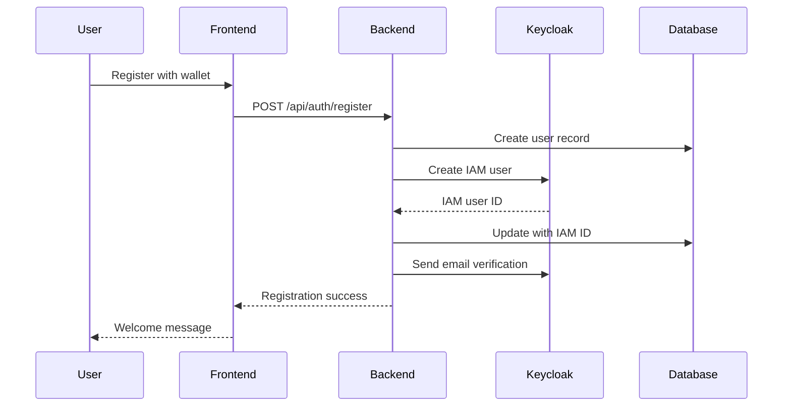
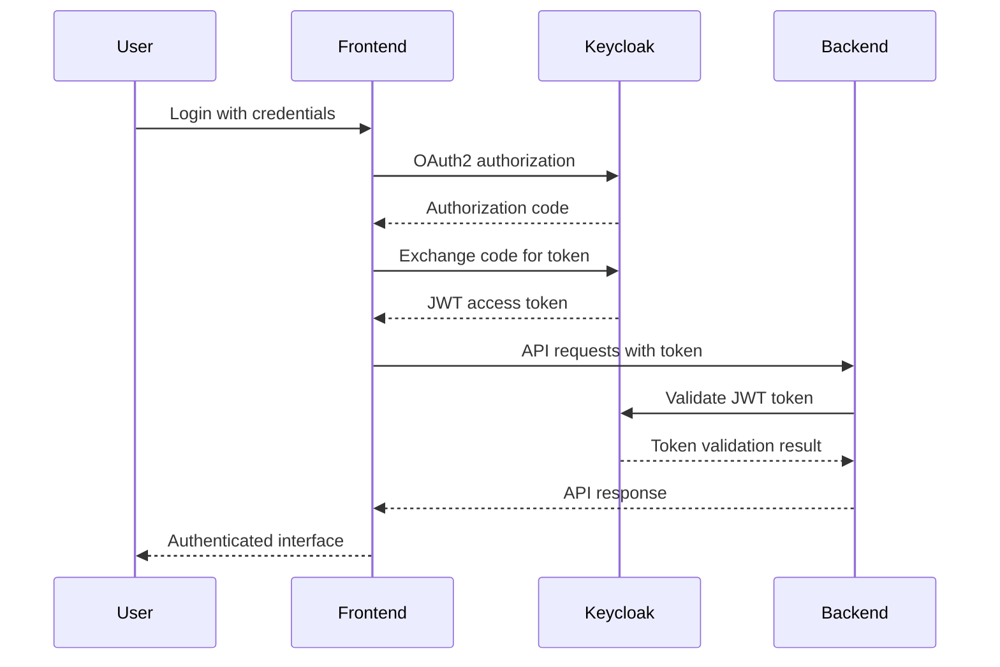
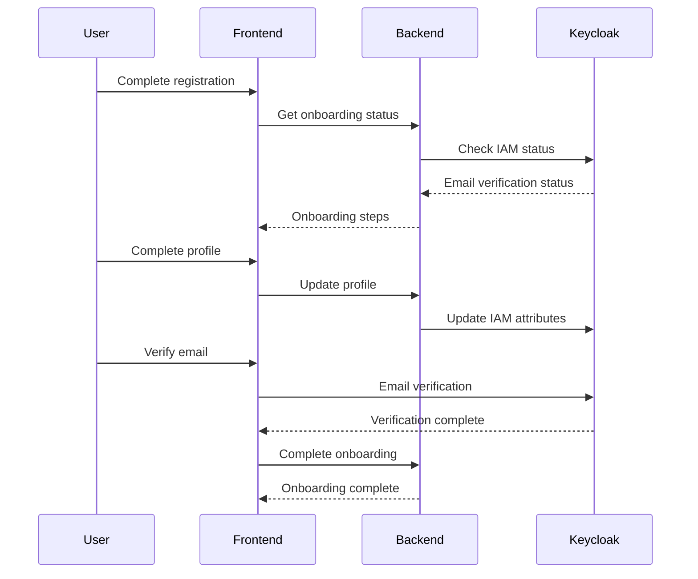

# IAM Integration Setup Guide

## Contract Management System with Keycloak IAM

Complete setup guide for implementing Keycloak IAM integration with user onboarding features.

## 🎯 **Overview**

This guide walks you through setting up a complete IAM (Identity and Access Management) solution using Keycloak for the Contract Management System. The implementation includes:

- **Keycloak IAM Server** with PostgreSQL database
- **Enhanced User Model** with IAM integration fields
- **Authentication Middleware** with JWT validation
- **User Onboarding Workflow** with multi-step registration
- **Email Verification** and profile completion
- **Role-Based Access Control** (TDP, TDC, CCRP, ADMIN)

## 📋 **Prerequisites**

### **System Requirements**
- Docker and Docker Compose
- Node.js 18+ and npm
- PostgreSQL database
- Git

### **Ports Required**
- **8080**: Keycloak Admin Console
- **8081**: Keycloak API
- **5433**: Keycloak Database (PostgreSQL)
- **5001**: Backend API
- **3000**: Frontend Application
- **8545**: Blockchain Node

## 🚀 **Step-by-Step Setup**

### **Step 1: Start Keycloak Infrastructure**

```bash
# Start Keycloak and PostgreSQL
docker-compose -f docker-compose.iam.yml up -d

# Verify services are running
docker ps
```

**Expected Output:**
```
CONTAINER ID   IMAGE                    PORTS                    NAMES
abc123...      quay.io/***REMOVED-KEYCLOAK_DB_PASSWORD***/***REMOVED-KEYCLOAK_DB_PASSWORD***:23.0   0.0.0.0:8080-8081->8080-8081/tcp   ***REMOVED-KEYCLOAK_DB_PASSWORD***
def456...      ***REMOVED-DB_PASSWORD***:15             0.0.0.0:5433->5432/tcp   ***REMOVED-KEYCLOAK_DB_PASSWORD***-db
ghi789...      redis:7-alpine          0.0.0.0:6379->6379/tcp   iam-redis
```

### **Step 2: Configure Keycloak**

```bash
# Wait for Keycloak to be ready (check logs)
docker logs ***REMOVED-KEYCLOAK_DB_PASSWORD***

# Run Keycloak setup script
cd backend
npm run setup-***REMOVED-KEYCLOAK_DB_PASSWORD***
```

**Expected Output:**
```
🚀 Starting Keycloak setup...
📋 Configuration:
   Keycloak URL: http://localhost:8080
   Realm: contract-management
   Admin: admin/***REMOVED-KEYCLOAK_ADMIN_PASSWORD***

🔐 Getting admin access token...
✅ Admin token obtained successfully
🏗️ Creating realm...
✅ Realm created successfully
👥 Creating roles...
✅ Role 'TDP' created
✅ Role 'TDC' created
✅ Role 'CCRP' created
✅ Role 'ADMIN' created
👥 Creating groups...
✅ Group 'Data Providers' created
✅ Group 'Data Consumers' created
✅ Group 'Compliance Reviewers' created
🔧 Creating client 'contract-management-frontend'...
✅ Client 'contract-management-frontend' created successfully
🔧 Creating client 'contract-management-backend'...
✅ Client 'contract-management-backend' created successfully
🔧 Adding protocol mappers to frontend client...
✅ Protocol mapper 'walletAddress' added
✅ Protocol mapper 'partyType' added
✅ Protocol mapper 'publicKey' added
👤 Creating admin user...
✅ Admin user created successfully
🔑 Getting backend client secret...
✅ Backend client secret obtained

🎉 Keycloak setup completed successfully!

📋 Access Information:
   Admin Console: http://localhost:8080/admin
   Realm: contract-management
   Admin User: admin/***REMOVED-KEYCLOAK_ADMIN_PASSWORD***
   Backend Client Secret: abc123def456...

💾 Configuration saved to: ***REMOVED-KEYCLOAK_DB_PASSWORD***-config/***REMOVED-KEYCLOAK_DB_PASSWORD***-config.json
```

### **Step 3: Update Database Schema**

```bash
# Install new dependencies
cd backend
npm install

# Run database migration
npm run migrate-iam
```

**Expected Output:**
```
🚀 Starting IAM fields migration...
✅ Database connection established
📋 Existing columns: [id, walletAddress, publicKey, partyType, name, email, description, isRegistered, registrationDate, isActive, createdAt, updatedAt]
➕ Adding column 'iamUserId'...
✅ Column 'iamUserId' added successfully
➕ Adding column 'iamUsername'...
✅ Column 'iamUsername' added successfully
➕ Adding column 'did'...
✅ Column 'did' added successfully
➕ Adding column 'onboardingStatus'...
✅ Column 'onboardingStatus' added successfully
➕ Adding column 'profileCompleted'...
✅ Column 'profileCompleted' added successfully
➕ Adding column 'emailVerified'...
✅ Column 'emailVerified' added successfully
➕ Adding column 'lastLoginAt'...
✅ Column 'lastLoginAt' added successfully
➕ Adding column 'organization'...
✅ Column 'organization' added successfully
➕ Adding column 'phoneNumber'...
✅ Column 'phoneNumber' added successfully
➕ Adding column 'website'...
✅ Column 'website' added successfully
➕ Adding column 'location'...
✅ Column 'location' added successfully
🔍 Creating indexes for new columns...
✅ Index 'idx_users_iam_user_id' created successfully
✅ Index 'idx_users_did' created successfully
✅ Index 'idx_users_onboarding_status' created successfully
✅ Index 'idx_users_profile_completed' created successfully
✅ Index 'idx_users_last_login_at' created successfully
🔄 Updating existing users with default values...
✅ Updated 15 existing users with default values
🔍 Verifying migration...
📋 Final columns: [id, walletAddress, publicKey, partyType, name, email, description, isRegistered, registrationDate, isActive, createdAt, updatedAt, iamUserId, iamUsername, did, onboardingStatus, profileCompleted, emailVerified, lastLoginAt, organization, phoneNumber, website, location]

🎉 IAM fields migration completed successfully!
📊 Summary:
   ✅ Added columns: 10
   ℹ️  Skipped columns: 0
   📋 Total columns: 21
```

### **Step 4: Start All Services**

```bash
# Terminal 1: Start blockchain node
cd blockchain
npx hardhat node

# Terminal 2: Start backend with IAM integration
cd backend
npm run dev

# Terminal 3: Start frontend (will be updated in next step)
cd frontend
npm start
```

### **Step 5: Verify IAM Integration**

```bash
# Test Keycloak admin console
open http://localhost:8080/admin
# Login with: admin/***REMOVED-KEYCLOAK_ADMIN_PASSWORD***

# Test backend health
curl http://localhost:5001/health

# Test IAM endpoints
curl http://localhost:5001/api/auth/onboarding-status
```

## 🔧 **Configuration Files**

### **Keycloak Configuration**
Location: `***REMOVED-KEYCLOAK_DB_PASSWORD***-config/***REMOVED-KEYCLOAK_DB_PASSWORD***-config.json`

```json
{
  "***REMOVED-KEYCLOAK_DB_PASSWORD***Url": "http://localhost:8080",
  "realm": "contract-management",
  "frontendClient": "contract-management-frontend",
  "backendClient": "contract-management-backend",
  "backendClientSecret": "your-secret-here",
  "adminUser": {
    "username": "admin",
    "password": "***REMOVED-KEYCLOAK_ADMIN_PASSWORD***"
  }
}
```

### **Environment Variables**
Add to `backend/config.env`:

```env
# Keycloak IAM Configuration
KEYCLOAK_URL=http://localhost:8080
KEYCLOAK_REALM=contract-management
KEYCLOAK_FRONTEND_CLIENT=contract-management-frontend
KEYCLOAK_BACKEND_CLIENT=contract-management-backend
KEYCLOAK_BACKEND_CLIENT_SECRET=your-secret-here
KEYCLOAK_ADMIN_USERNAME=admin
KEYCLOAK_ADMIN_PASSWORD=***REMOVED-KEYCLOAK_ADMIN_PASSWORD***
```

## 🔐 **Authentication Flow**

### **1. User Registration Flow**


### **2. User Login Flow**


### **3. User Onboarding Flow**


## 👥 **User Roles and Permissions**

### **Role Definitions**
- **TDP (Training Data Provider)**: Can create and manage datasets
- **TDC (Training Data Consumer)**: Can create contracts
- **CCRP (Confidential Clean Room Provider)**: Can review and sign contracts
- **ADMIN**: Full system access

### **Permission Matrix**
| Feature | TDP | TDC | CCRP | ADMIN |
|---------|-----|-----|------|-------|
| View Datasets | ✅ | ✅ | ✅ | ✅ |
| Create Datasets | ✅ | ❌ | ❌ | ✅ |
| Create Contracts | ❌ | ✅ | ❌ | ✅ |
| Sign Contracts | ✅ | ✅ | ✅ | ✅ |
| User Management | ❌ | ❌ | ❌ | ✅ |
| System Settings | ❌ | ❌ | ❌ | ✅ |

## 🔍 **Testing the Integration**

### **1. Test User Registration**
```bash
curl -X POST http://localhost:5001/api/auth/register \
  -H "Content-Type: application/json" \
  -d '{
    "walletAddress": "0x1234567890123456789012345678901234567890",
    "publicKey": "0x12345678901234567890123456789012345678901234567890123456789012345678901234567890123456789012345678901234567890123456789012345678",
    "partyType": "TDC",
    "name": "Test User",
    "email": "test@example.com",
    "organization": "Test Corp",
    "phoneNumber": "+1-555-0123",
    "website": "https://test.com",
    "location": "Test City"
  }'
```

### **2. Test Authentication**
```bash
# Get access token from Keycloak
curl -X POST http://localhost:8080/realms/contract-management/protocol/openid-connect/token \
  -H "Content-Type: application/x-www-form-urlencoded" \
  -d "grant_type=password&client_id=contract-management-frontend&username=test@example.com&password=temp123"

# Use token to access protected endpoint
curl -H "Authorization: Bearer YOUR_TOKEN" \
  http://localhost:5001/api/auth/profile
```

### **3. Test Onboarding Status**
```bash
curl -H "Authorization: Bearer YOUR_TOKEN" \
  http://localhost:5001/api/auth/onboarding-status
```

## 🛠️ **Troubleshooting**

### **Common Issues**

#### **1. Keycloak Connection Failed**
```bash
# Check if Keycloak is running
docker ps | grep ***REMOVED-KEYCLOAK_DB_PASSWORD***

# Check Keycloak logs
docker logs ***REMOVED-KEYCLOAK_DB_PASSWORD***

# Restart Keycloak
docker-compose -f docker-compose.iam.yml restart ***REMOVED-KEYCLOAK_DB_PASSWORD***
```

#### **2. Database Migration Failed**
```bash
# Check database connection
psql -h localhost -p 5432 -U ***REMOVED-DB_PASSWORD*** -d contract_management

# Run migration manually
cd backend
node scripts/migrateIAMFields.js
```

#### **3. JWT Token Validation Failed**
```bash
# Check Keycloak public keys
curl http://localhost:8080/realms/contract-management/protocol/openid-connect/certs

# Verify client configuration
curl -H "Authorization: Bearer ADMIN_TOKEN" \
  http://localhost:8080/admin/realms/contract-management/clients
```

#### **4. Email Verification Not Working**
```bash
# Check Keycloak email settings
# In Keycloak Admin Console: Realm Settings > Email

# Test email sending
curl -X POST http://localhost:5001/api/auth/verify-email \
  -H "Authorization: Bearer USER_TOKEN"
```

### **Debug Mode**
Enable debug logging by setting environment variables:

```env
DEBUG=***REMOVED-KEYCLOAK_DB_PASSWORD***:*
LOG_LEVEL=debug
```

## 📚 **Next Steps**

### **Phase 2: Frontend Integration**
1. **Install Keycloak React Client**
2. **Update User Context** for IAM integration
3. **Enhanced Registration Flow** with onboarding
4. **Profile Management** interface
5. **Email Verification** UI

### **Phase 3: Advanced Features**
1. **DID Integration** for decentralized identity
2. **Multi-Factor Authentication** (MFA)
3. **Social Login** integration
4. **Enterprise SSO** with SAML
5. **Audit Logging** and compliance

### **Phase 4: Production Deployment**
1. **SSL/TLS Configuration**
2. **High Availability** setup
3. **Backup and Recovery** procedures
4. **Monitoring and Alerting**
5. **Security Hardening**

## 🔗 **Useful Links**

- **Keycloak Documentation**: https://www.***REMOVED-KEYCLOAK_DB_PASSWORD***.org/documentation
- **OpenID Connect**: https://openid.net/connect/
- **OAuth 2.0**: https://oauth.net/2/
- **JWT**: https://jwt.io/
- **Docker Compose**: https://docs.docker.com/compose/

## 📞 **Support**

For issues and questions:
1. Check the troubleshooting section above
2. Review Keycloak logs: `docker logs ***REMOVED-KEYCLOAK_DB_PASSWORD***`
3. Check backend logs: `npm run dev`
4. Verify database connectivity
5. Test individual components

---

**🎉 Congratulations!** You have successfully set up Keycloak IAM integration with user onboarding features for your Contract Management System. 