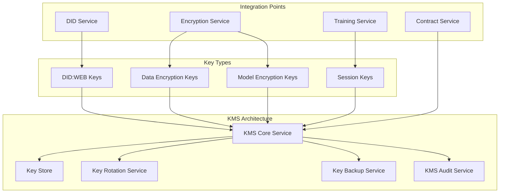
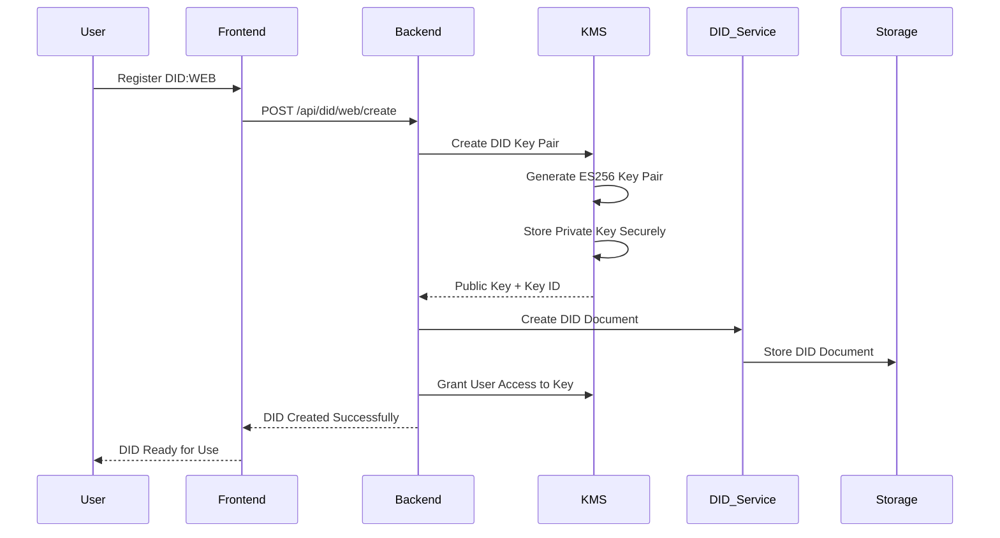
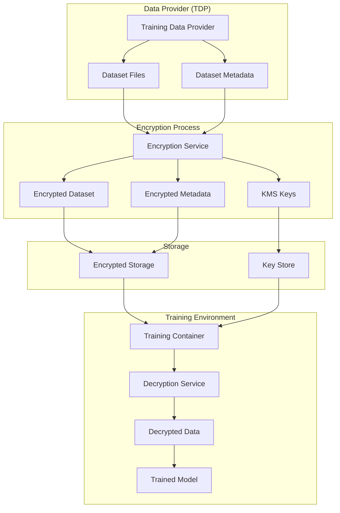
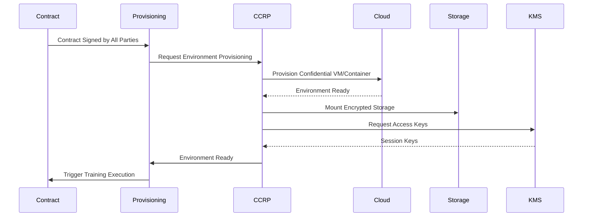
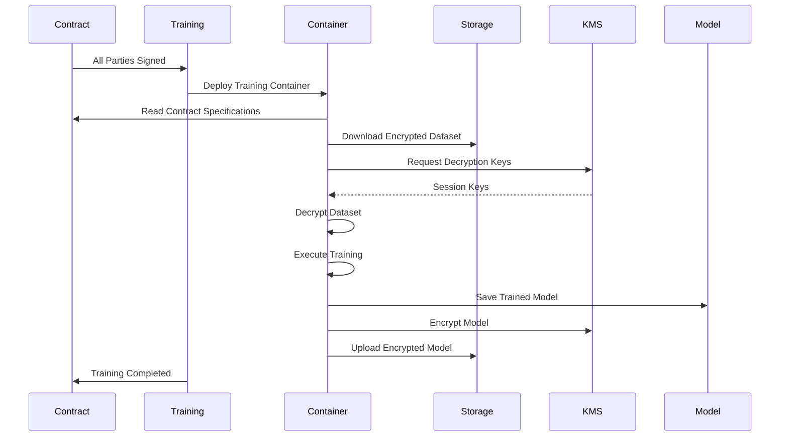
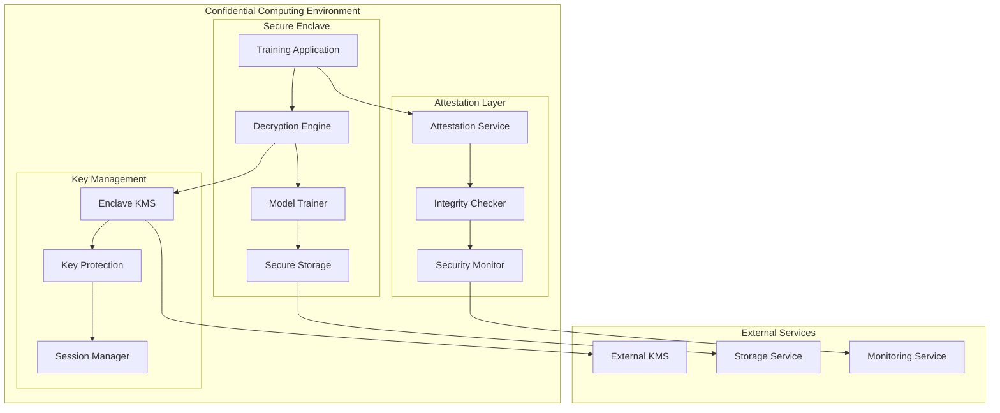
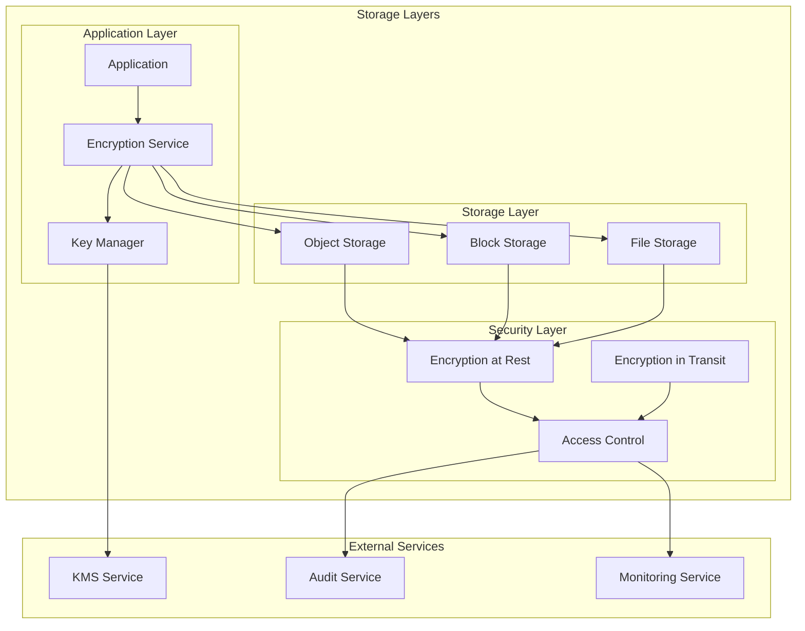
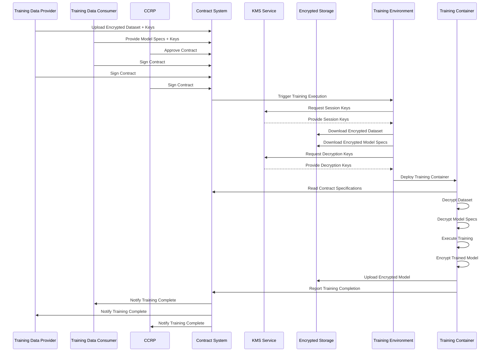

# KMS and Training Environment Architecture
## Contract Management System

**Document Version:** 1.0  
**Date:** December 2024  
**Author:** Contract Management System Team

---

## Table of Contents

1. [Executive Summary](#executive-summary)
2. [KMS Architecture Overview](#kms-architecture-overview)
3. [DID:WEB Key Management](#didweb-key-management)
4. [Data Encryption/Decryption System](#data-encryptiondecryption-system)
5. [Training Environment Provisioning](#training-environment-provisioning)
6. [Automated Training Execution](#automated-training-execution)
7. [Confidential Computing Infrastructure](#confidential-computing-infrastructure)
8. [Encrypted Storage Architecture](#encrypted-storage-architecture)
9. [Contract-Driven Training Flow](#contract-driven-training-flow)
10. [Security and Compliance](#security-and-compliance)
11. [Implementation Roadmap](#implementation-roadmap)

---

## 1. Executive Summary

### 1.1 Overview
This document outlines the comprehensive KMS (Key Management Service) architecture and automated training environment provisioning system for the Contract Management System. The solution provides end-to-end encryption, secure key management, and automated training execution in confidential computing environments.

### 1.2 Key Features
- **KMS Integration**: Centralized key management for DID:web, data encryption, and model encryption
- **Data Encryption**: Encrypted storage and transmission of datasets and models
- **Automatic Provisioning**: Training environments provisioned based on contract specifications
- **Automated Training**: Training execution triggered when all parties sign contracts
- **Confidential Computing**: Secure processing in encrypted VMs/containers
- **Contract-Driven**: Training containers interpret contracts and execute accordingly

### 1.3 Target Use Cases
- **TDP**: Upload encrypted datasets with encryption keys
- **TDC**: Provide model specifications and encryption keys
- **CCRP**: Provision confidential computing environments
- **System**: Automatically execute training when contracts are signed

---

## 2. KMS Architecture Overview

### 2.1 KMS Components



### 2.2 KMS Service Architecture

```typescript
interface KMSService {
  // Key Management
  createKey(keyType: KeyType, metadata: KeyMetadata): Promise<KeyInfo>;
  getKey(keyId: string): Promise<KeyInfo>;
  rotateKey(keyId: string): Promise<KeyInfo>;
  deleteKey(keyId: string): Promise<boolean>;
  
  // Encryption/Decryption
  encryptData(data: Buffer, keyId: string): Promise<EncryptedData>;
  decryptData(encryptedData: EncryptedData, keyId: string): Promise<Buffer>;
  
  // Key Access Control
  grantAccess(keyId: string, principal: string, permissions: Permission[]): Promise<boolean>;
  revokeAccess(keyId: string, principal: string): Promise<boolean>;
  
  // Audit and Compliance
  getKeyUsage(keyId: string, dateRange: DateRange): Promise<KeyUsageReport>;
  exportAuditLogs(dateRange: DateRange): Promise<AuditLog[]>;
}

enum KeyType {
  DID_WEB = 'did_web',
  DATA_ENCRYPTION = 'data_encryption',
  MODEL_ENCRYPTION = 'model_encryption',
  SESSION = 'session'
}

interface KeyInfo {
  keyId: string;
  keyType: KeyType;
  algorithm: string;
  keySize: number;
  createdAt: Date;
  expiresAt?: Date;
  metadata: KeyMetadata;
  status: KeyStatus;
}

interface KeyMetadata {
  owner: string;
  purpose: string;
  contractId?: string;
  datasetId?: string;
  modelId?: string;
  encryptionLevel: 'BASIC' | 'STANDARD' | 'ENHANCED';
}
```

---

## 3. DID:WEB Key Management

### 3.1 DID:WEB Key Creation Process



### 3.2 DID:WEB Key Management Service

```typescript
interface DIDWebKeyService {
  // DID Key Creation
  createDIDKeyPair(domain: string, path: string): Promise<DIDKeyPair>;
  createEnterpriseDIDKey(organization: string, user: string): Promise<DIDKeyPair>;
  
  // DID Document Management
  createDIDDocument(did: string, publicKey: string): Promise<DIDDocument>;
  updateDIDDocument(did: string, updates: DIDDocumentUpdate): Promise<DIDDocument>;
  
  // Key Access Management
  grantDIDKeyAccess(did: string, principal: string): Promise<boolean>;
  revokeDIDKeyAccess(did: string, principal: string): Promise<boolean>;
  
  // Signing Operations
  signWithDIDKey(did: string, message: string): Promise<Signature>;
  verifyDIDSignature(did: string, message: string, signature: string): Promise<boolean>;
}

interface DIDKeyPair {
  did: string;
  keyId: string;
  publicKey: string;
  keyType: 'ES256' | 'Ed25519' | 'RSA';
  createdAt: Date;
  expiresAt?: Date;
}

interface DIDDocument {
  '@context': string[];
  id: string;
  verificationMethod: VerificationMethod[];
  authentication: string[];
  assertionMethod: string[];
  service: Service[];
}
```

---

## 4. Data Encryption/Decryption System

### 4.1 Data Encryption Flow



### 4.2 Encryption Service Architecture

```typescript
interface EncryptionService {
  // Dataset Encryption
  encryptDataset(dataset: Dataset, encryptionKey: string): Promise<EncryptedDataset>;
  decryptDataset(encryptedDataset: EncryptedDataset, decryptionKey: string): Promise<Dataset>;
  
  // Model Encryption
  encryptModel(model: AIModel, encryptionKey: string): Promise<EncryptedModel>;
  decryptModel(encryptedModel: EncryptedModel, decryptionKey: string): Promise<AIModel>;
  
  // Metadata Encryption
  encryptMetadata(metadata: any, encryptionKey: string): Promise<EncryptedMetadata>;
  decryptMetadata(encryptedMetadata: EncryptedMetadata, decryptionKey: string): Promise<any>;
  
  // Streaming Encryption
  createEncryptionStream(key: string): Promise<EncryptionStream>;
  createDecryptionStream(key: string): Promise<DecryptionStream>;
}

interface EncryptedDataset {
  id: string;
  encryptedDataUrl: string;
  encryptedMetadataUrl: string;
  encryptionKeyId: string;
  encryptionAlgorithm: string;
  iv: string;
  checksum: string;
  size: number;
  createdAt: Date;
}

interface EncryptionStream {
  encrypt(chunk: Buffer): Promise<Buffer>;
  finalize(): Promise<Buffer>;
}

interface DecryptionStream {
  decrypt(chunk: Buffer): Promise<Buffer>;
  finalize(): Promise<Buffer>;
}
```

---

## 5. Training Environment Provisioning

### 5.1 Automatic Provisioning Flow



### 5.2 Environment Provisioning Service

```typescript
interface EnvironmentProvisioningService {
  // Environment Provisioning
  provisionTrainingEnvironment(contract: Contract): Promise<TrainingEnvironment>;
  deprovisionEnvironment(environmentId: string): Promise<boolean>;
  
  // Resource Management
  allocateResources(requirements: ResourceRequirements): Promise<ResourceAllocation>;
  monitorEnvironment(environmentId: string): Promise<EnvironmentStatus>;
  
  // Security Configuration
  configureSecurity(environment: TrainingEnvironment, contract: Contract): Promise<SecurityConfig>;
  setupEncryption(environment: TrainingEnvironment, keys: KeySet): Promise<EncryptionConfig>;
}

interface TrainingEnvironment {
  id: string;
  contractId: string;
  status: 'PROVISIONING' | 'READY' | 'RUNNING' | 'COMPLETED' | 'FAILED';
  resources: ResourceAllocation;
  security: SecurityConfig;
  encryption: EncryptionConfig;
  createdAt: Date;
  expiresAt: Date;
}

interface ResourceRequirements {
  cpu: number;
  memory: number;
  gpu?: number;
  storage: number;
  network: NetworkConfig;
  security: SecurityLevel;
}

interface SecurityConfig {
  confidentialComputing: boolean;
  encryptionAtRest: boolean;
  encryptionInTransit: boolean;
  accessControl: AccessControlConfig;
  auditLogging: boolean;
}
```

---

## 6. Automated Training Execution

### 6.1 Training Execution Flow



### 6.2 Training Container Architecture

```typescript
interface TrainingContainer {
  // Contract Interpretation
  parseContract(contract: Contract): Promise<TrainingSpecification>;
  validateRequirements(spec: TrainingSpecification): Promise<ValidationResult>;
  
  // Data Management
  downloadEncryptedData(dataUrls: string[]): Promise<EncryptedData[]>;
  decryptData(encryptedData: EncryptedData[], keys: KeySet): Promise<Dataset[]>;
  
  // Training Execution
  executeTraining(spec: TrainingSpecification, data: Dataset[]): Promise<TrainingResult>;
  saveModel(model: TrainedModel, encryptionKey: string): Promise<EncryptedModel>;
  
  // Monitoring and Logging
  logTrainingProgress(progress: TrainingProgress): Promise<void>;
  reportTrainingMetrics(metrics: TrainingMetrics): Promise<void>;
}

interface TrainingSpecification {
  modelType: string;
  architecture: string;
  hyperparameters: Hyperparameters;
  trainingParams: TrainingParameters;
  dataRequirements: DataRequirements;
  securityRequirements: SecurityRequirements;
}

interface TrainingResult {
  modelId: string;
  modelUrl: string;
  encryptionKeyId: string;
  trainingMetrics: TrainingMetrics;
  trainingTime: number;
  status: 'SUCCESS' | 'FAILED';
  errorMessage?: string;
}

interface TrainingMetrics {
  accuracy: number;
  loss: number;
  epochs: number;
  trainingTime: number;
  validationMetrics: ValidationMetrics;
}
```

---

## 7. Confidential Computing Infrastructure

### 7.1 Confidential Computing Architecture



### 7.2 Confidential Computing Service

```typescript
interface ConfidentialComputingService {
  // Enclave Management
  createSecureEnclave(config: EnclaveConfig): Promise<SecureEnclave>;
  attestEnclave(enclaveId: string): Promise<AttestationResult>;
  
  // Secure Execution
  executeSecureTraining(enclave: SecureEnclave, contract: Contract): Promise<TrainingResult>;
  secureDataProcessing(enclave: SecureEnclave, data: EncryptedData): Promise<ProcessedData>;
  
  // Key Protection
  protectKeys(enclave: SecureEnclave, keys: KeySet): Promise<ProtectedKeys>;
  releaseKeys(enclave: SecureEnclave, keyIds: string[]): Promise<boolean>;
}

interface SecureEnclave {
  id: string;
  type: 'SGX' | 'SEV' | 'CCv3';
  status: 'CREATING' | 'READY' | 'RUNNING' | 'TERMINATED';
  attestation: AttestationResult;
  securityLevel: SecurityLevel;
  resources: EnclaveResources;
}

interface AttestationResult {
  isValid: boolean;
  attestationReport: string;
  publicKey: string;
  measurement: string;
  timestamp: Date;
}

interface EnclaveConfig {
  cpuCount: number;
  memorySize: number;
  securityLevel: SecurityLevel;
  attestationRequired: boolean;
  encryptionRequired: boolean;
}
```

---

## 8. Encrypted Storage Architecture

### 8.1 Storage Architecture



### 8.2 Storage Service Architecture

```typescript
interface EncryptedStorageService {
  // Dataset Storage
  storeEncryptedDataset(dataset: EncryptedDataset): Promise<StorageLocation>;
  retrieveEncryptedDataset(location: StorageLocation): Promise<EncryptedDataset>;
  
  // Model Storage
  storeEncryptedModel(model: EncryptedModel): Promise<StorageLocation>;
  retrieveEncryptedModel(location: StorageLocation): Promise<EncryptedModel>;
  
  // Key Storage
  storeEncryptionKeys(keys: KeySet): Promise<KeyStorageLocation>;
  retrieveEncryptionKeys(location: KeyStorageLocation): Promise<KeySet>;
  
  // Access Control
  grantAccess(location: StorageLocation, principal: string, permissions: Permission[]): Promise<boolean>;
  revokeAccess(location: StorageLocation, principal: string): Promise<boolean>;
}

interface StorageLocation {
  id: string;
  type: 'DATASET' | 'MODEL' | 'KEYS';
  url: string;
  bucket: string;
  path: string;
  encryptionKeyId: string;
  accessControl: AccessControlConfig;
  metadata: StorageMetadata;
}

interface KeySet {
  datasetKey: string;
  modelKey: string;
  sessionKey: string;
  metadata: KeyMetadata;
  expiresAt: Date;
}
```

---

## 9. Contract-Driven Training Flow

### 9.1 Complete Training Flow



### 9.2 Contract Interpretation Service

```typescript
interface ContractInterpretationService {
  // Contract Analysis
  parseTrainingRequirements(contract: Contract): Promise<TrainingRequirements>;
  extractSecurityRequirements(contract: Contract): Promise<SecurityRequirements>;
  validateContractCompleteness(contract: Contract): Promise<ValidationResult>;
  
  // Resource Planning
  calculateResourceRequirements(requirements: TrainingRequirements): Promise<ResourcePlan>;
  estimateTrainingTime(requirements: TrainingRequirements): Promise<TimeEstimate>;
  
  // Execution Planning
  createExecutionPlan(contract: Contract): Promise<ExecutionPlan>;
  validateExecutionPlan(plan: ExecutionPlan): Promise<ValidationResult>;
}

interface TrainingRequirements {
  datasetRequirements: DatasetRequirements;
  modelRequirements: ModelRequirements;
  trainingParameters: TrainingParameters;
  securityRequirements: SecurityRequirements;
  resourceRequirements: ResourceRequirements;
}

interface ExecutionPlan {
  steps: ExecutionStep[];
  dependencies: Dependency[];
  estimatedDuration: number;
  resourceAllocation: ResourceAllocation;
  securityConfig: SecurityConfig;
}

interface ExecutionStep {
  id: string;
  name: string;
  type: 'PROVISION' | 'DOWNLOAD' | 'DECRYPT' | 'TRAIN' | 'ENCRYPT' | 'UPLOAD';
  dependencies: string[];
  estimatedDuration: number;
  resourceRequirements: ResourceRequirements;
}
```

---

## 10. Security and Compliance

### 10.1 Security Architecture

```typescript
interface SecurityArchitecture {
  // Encryption Standards
  encryptionAlgorithms: {
    dataEncryption: 'AES-256-GCM';
    keyEncryption: 'RSA-OAEP';
    signature: 'ES256';
  };
  
  // Key Management
  keyRotationPolicy: {
    dataKeys: '30_DAYS';
    modelKeys: '90_DAYS';
    sessionKeys: '1_DAY';
  };
  
  // Access Control
  accessControl: {
    roleBased: boolean;
    attributeBased: boolean;
    timeBased: boolean;
    locationBased: boolean;
  };
  
  // Audit and Compliance
  auditRequirements: {
    keyUsage: boolean;
    dataAccess: boolean;
    trainingExecution: boolean;
    complianceReporting: boolean;
  };
}
```

### 10.2 Compliance Framework

```typescript
interface ComplianceFramework {
  // Data Protection
  dataProtection: {
    encryptionAtRest: boolean;
    encryptionInTransit: boolean;
    dataMinimization: boolean;
    retentionPolicy: RetentionPolicy;
  };
  
  // Privacy Compliance
  privacyCompliance: {
    gdpr: boolean;
    dpdp: boolean;
    ccpa: boolean;
    dataSubjectRights: DataSubjectRights;
  };
  
  // Security Standards
  securityStandards: {
    iso27001: boolean;
    soc2: boolean;
    pciDss: boolean;
    securityAudit: SecurityAudit;
  };
}
```

---

## 11. Implementation Roadmap

### 11.1 Phase 1: KMS Foundation (Weeks 1-4)
- [ ] Implement KMS core service
- [ ] Create DID:WEB key management
- [ ] Set up encryption/decryption services
- [ ] Implement key rotation and backup

### 11.2 Phase 2: Data Encryption (Weeks 5-8)
- [ ] Implement dataset encryption
- [ ] Implement model encryption
- [ ] Create encrypted storage service
- [ ] Set up access control mechanisms

### 11.3 Phase 3: Training Environment (Weeks 9-12)
- [ ] Implement environment provisioning
- [ ] Create confidential computing setup
- [ ] Develop training container framework
- [ ] Set up monitoring and logging

### 11.4 Phase 4: Automation (Weeks 13-16)
- [ ] Implement contract interpretation
- [ ] Create automated training execution
- [ ] Set up end-to-end testing
- [ ] Deploy to production

### 11.5 Phase 5: Security & Compliance (Weeks 17-20)
- [ ] Implement security hardening
- [ ] Set up compliance monitoring
- [ ] Create audit reporting
- [ ] Final security review

---

## 12. Conclusion

This KMS and Training Environment Architecture provides a comprehensive framework for secure, automated training execution in confidential computing environments. The system ensures:

- **End-to-End Encryption**: All data encrypted at rest and in transit
- **Secure Key Management**: Centralized KMS with proper key rotation
- **Automated Provisioning**: Training environments created automatically
- **Confidential Computing**: Secure execution in encrypted environments
- **Contract-Driven**: Training execution based on contract specifications
- **Compliance Ready**: Built-in support for GDPR, DPDP, and security standards

The architecture supports enterprise-grade security while maintaining usability and automation for training data providers, consumers, and clean room providers.

---

**Document Version:** 1.0  
**Last Updated:** December 2024  
**Next Review:** March 2025 