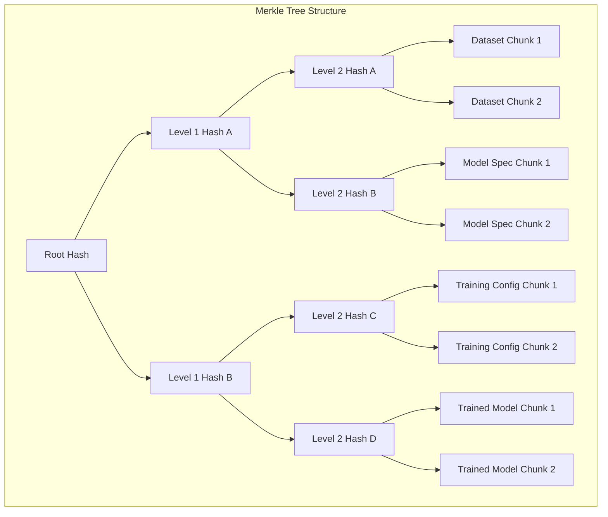
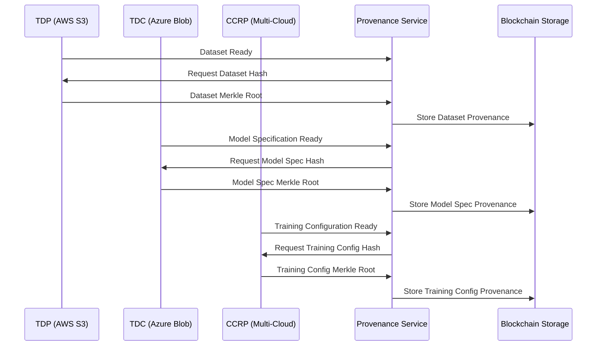
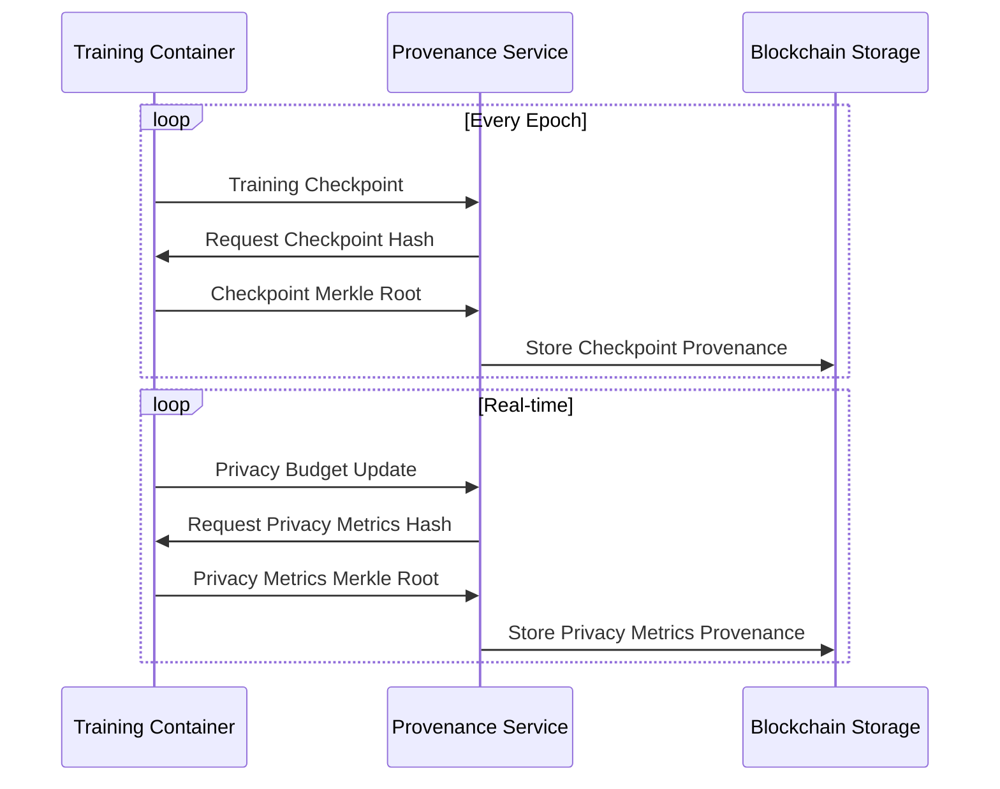
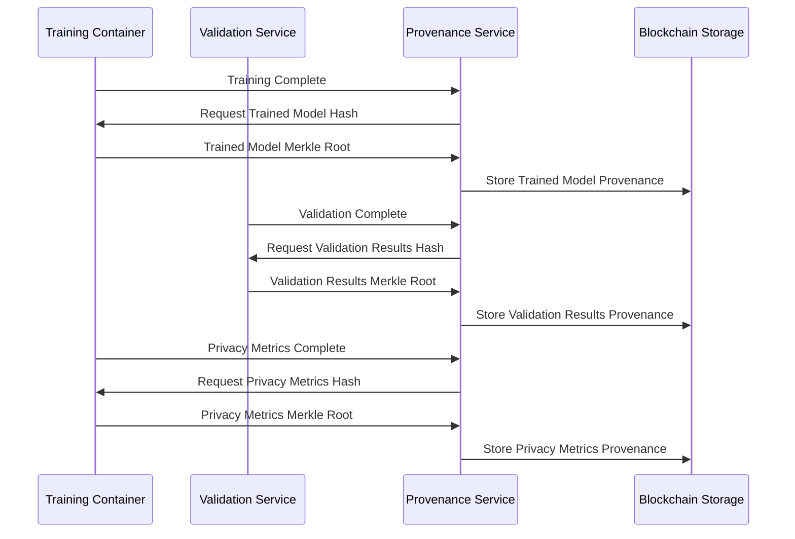

# Merkle Tree Provenance Implementation for Model Auditing
## Contract Management System

**Document Version:** 1.0  
**Date:** December 2024  
**Author:** Contract Management System Team

---

## Table of Contents

1. [Executive Summary](#executive-summary)
2. [Merkle Tree Provenance Overview](#merkle-tree-provenance-overview)
3. [Provenance Node Types](#provenance-node-types)
4. [Provenance Capture Process](#provenance-capture-process)
5. [Provenance Verification](#provenance-verification)
6. [Model Audit Capabilities](#model-audit-capabilities)
7. [Implementation Details](#implementation-details)

---

## 1. Executive Summary

### 1.1 Overview
The Merkle Tree Provenance system captures and verifies the complete lineage of AI model training data, configurations, and outputs using cryptographic hashing. This enables comprehensive model auditing, explainability, and governance across multi-cloud environments.

### 1.2 Key Features
- **Complete Data Lineage**: Track all data transformations from source to trained model
- **Cryptographic Verification**: Use Merkle trees for tamper-proof provenance
- **Cross-Cloud Consistency**: Verify provenance across multiple cloud environments
- **Model Governance**: Enable comprehensive model auditing and explainability
- **Compliance Support**: Meet regulatory requirements for model transparency

### 1.3 Use Cases
- **Model Auditing**: Verify model training process and data lineage
- **Compliance Verification**: Ensure regulatory compliance across clouds
- **Model Explainability**: Provide transparent model development history
- **Bias Detection**: Track data lineage for bias identification
- **Governance**: Enable comprehensive model governance and oversight

---

## 2. Merkle Tree Provenance Overview

### 2.1 Merkle Tree Structure



### 2.2 Provenance Tracking Architecture

```typescript
interface MerkleTreeProvenance {
  // Tree Configuration
  treeType: 'BINARY_MERKLE_TREE';
  hashAlgorithm: 'SHA256';
  maxDepth: number;
  nodeCompression: boolean;
  
  // Node Types
  primaryNodes: ProvenanceNode[];
  secondaryNodes: ProvenanceNode[];
  
  // Capture Process
  beforeTraining: ProvenanceCapture;
  duringTraining: ProvenanceCapture;
  afterTraining: ProvenanceCapture;
  
  // Verification
  verificationMethods: VerificationMethod[];
  auditVerification: AuditVerification;
  
  // Storage
  storageConfiguration: ProvenanceStorage;
  crossCloudReplication: CrossCloudReplication;
}

interface ProvenanceNode {
  nodeType: string;
  description: string;
  captureFrequency: string;
  verificationRequired: boolean;
  auditTrail: boolean;
  crossCloudReplication: boolean;
}
```

---

## 3. Provenance Node Types

### 3.1 Primary Nodes (Critical for Model Auditing)

#### 3.1.1 Dataset Root Node
```json
{
  "nodeType": "DATASET_ROOT",
  "description": "Root hash of complete dataset before training",
  "captureFrequency": "BEFORE_TRAINING",
  "verificationRequired": true,
  "auditTrail": true,
  "crossCloudReplication": true,
  "dataSource": "TDP_AWS_S3",
  "encryptionKeyId": "tdp-dataset-key-001",
  "hashAlgorithm": "SHA256"
}
```

#### 3.1.2 Model Specification Root Node
```json
{
  "nodeType": "MODEL_SPECIFICATION_ROOT",
  "description": "Root hash of model architecture and hyperparameters",
  "captureFrequency": "BEFORE_TRAINING",
  "verificationRequired": true,
  "auditTrail": true,
  "crossCloudReplication": true,
  "dataSource": "TDC_AZURE_BLOB",
  "encryptionKeyId": "tdc-model-spec-key-001",
  "hashAlgorithm": "SHA256"
}
```

#### 3.1.3 Training Configuration Root Node
```json
{
  "nodeType": "TRAINING_CONFIGURATION_ROOT",
  "description": "Root hash of training configuration and privacy parameters",
  "captureFrequency": "BEFORE_TRAINING",
  "verificationRequired": true,
  "auditTrail": true,
  "crossCloudReplication": true,
  "dataSource": "CCRP_MULTI_CLOUD",
  "encryptionKeyId": "ccrp-training-config-key-001",
  "hashAlgorithm": "SHA256"
}
```

#### 3.1.4 Trained Model Root Node
```json
{
  "nodeType": "TRAINED_MODEL_ROOT",
  "description": "Root hash of trained model weights and architecture",
  "captureFrequency": "AFTER_TRAINING",
  "verificationRequired": true,
  "auditTrail": true,
  "crossCloudReplication": true,
  "dataSource": "CCRP_MULTI_CLOUD",
  "encryptionKeyId": "ccrp-trained-model-key-001",
  "hashAlgorithm": "SHA256"
}
```

#### 3.1.5 Validation Results Root Node
```json
{
  "nodeType": "VALIDATION_RESULTS_ROOT",
  "description": "Root hash of model validation metrics and performance",
  "captureFrequency": "AFTER_VALIDATION",
  "verificationRequired": true,
  "auditTrail": true,
  "crossCloudReplication": true,
  "dataSource": "CCRP_MULTI_CLOUD",
  "encryptionKeyId": "ccrp-validation-key-001",
  "hashAlgorithm": "SHA256"
}
```

#### 3.1.6 Privacy Metrics Root Node
```json
{
  "nodeType": "PRIVACY_METRICS_ROOT",
  "description": "Root hash of privacy-preserving metrics and compliance",
  "captureFrequency": "AFTER_TRAINING",
  "verificationRequired": true,
  "auditTrail": true,
  "crossCloudReplication": true,
  "dataSource": "CCRP_MULTI_CLOUD",
  "encryptionKeyId": "ccrp-privacy-metrics-key-001",
  "hashAlgorithm": "SHA256"
}
```

### 3.2 Secondary Nodes (Supporting Information)

#### 3.2.1 Data Preprocessing Root Node
```json
{
  "nodeType": "DATA_PREPROCESSING_ROOT",
  "description": "Root hash of data preprocessing steps and transformations",
  "captureFrequency": "DURING_TRAINING",
  "verificationRequired": false,
  "auditTrail": true,
  "crossCloudReplication": true
}
```

#### 3.2.2 Training Checkpoints Root Node
```json
{
  "nodeType": "TRAINING_CHECKPOINTS_ROOT",
  "description": "Root hash of training checkpoints and intermediate models",
  "captureFrequency": "DURING_TRAINING",
  "verificationRequired": false,
  "auditTrail": true,
  "crossCloudReplication": true
}
```

#### 3.2.3 Privacy Budget Root Node
```json
{
  "nodeType": "PRIVACY_BUDGET_ROOT",
  "description": "Root hash of privacy budget consumption and tracking",
  "captureFrequency": "DURING_TRAINING",
  "verificationRequired": false,
  "auditTrail": true,
  "crossCloudReplication": true
}
```

#### 3.2.4 Compliance Metrics Root Node
```json
{
  "nodeType": "COMPLIANCE_METRICS_ROOT",
  "description": "Root hash of regulatory compliance metrics and evidence",
  "captureFrequency": "AFTER_TRAINING",
  "verificationRequired": false,
  "auditTrail": true,
  "crossCloudReplication": true
}
```

---

## 4. Provenance Capture Process

### 4.1 Before Training Capture



### 4.2 During Training Capture



### 4.3 After Training Capture



---

## 5. Provenance Verification

### 5.1 Verification Methods

#### 5.1.1 Merkle Proof Verification
```typescript
interface MerkleProofVerification {
  method: 'MERKLE_PROOF_VERIFICATION';
  description: 'Verify data integrity using Merkle proofs';
  enabled: boolean;
  crossCloudVerification: boolean;
  
  verificationProcess: {
    step1: 'Generate Merkle proof for specific data chunk';
    step2: 'Verify proof against stored root hash';
    step3: 'Cross-verify across multiple cloud environments';
    step4: 'Validate temporal consistency';
  };
}
```

#### 5.1.2 Digital Signature Verification
```typescript
interface DigitalSignatureVerification {
  method: 'DIGITAL_SIGNATURE_VERIFICATION';
  description: 'Verify provenance authenticity using digital signatures';
  enabled: boolean;
  crossCloudVerification: boolean;
  
  signatureProcess: {
    step1: 'Sign provenance data with private key';
    step2: 'Verify signature with public key';
    step3: 'Cross-verify signatures across clouds';
    step4: 'Validate signature timestamps';
  };
}
```

#### 5.1.3 Timestamp Verification
```typescript
interface TimestampVerification {
  method: 'TIMESTAMP_VERIFICATION';
  description: 'Verify temporal consistency of provenance data';
  enabled: boolean;
  crossCloudVerification: boolean;
  
  timestampProcess: {
    step1: 'Verify timestamp consistency across nodes';
    step2: 'Validate temporal ordering of events';
    step3: 'Cross-verify timestamps across clouds';
    step4: 'Ensure no temporal anomalies';
  };
}
```

#### 5.1.4 Cross-Cloud Consistency Check
```typescript
interface CrossCloudConsistencyCheck {
  method: 'CROSS_CLOUD_CONSISTENCY_CHECK';
  description: 'Verify consistency across multiple cloud environments';
  enabled: boolean;
  crossCloudVerification: boolean;
  
  consistencyProcess: {
    step1: 'Compare hashes across all cloud environments';
    step2: 'Verify replication consistency';
    step3: 'Validate cross-cloud audit trails';
    step4: 'Ensure no data divergence';
  };
}
```

### 5.2 Audit Verification

```typescript
interface AuditVerification {
  automatedVerification: boolean;
  manualVerification: boolean;
  verificationFrequency: 'REAL_TIME';
  verificationRetention: 'PERMANENT';
  crossCloudAuditTrail: boolean;
  
  verificationSchedule: {
    realTime: 'Continuous verification during training';
    hourly: 'Comprehensive verification every hour';
    daily: 'Full audit verification daily';
    weekly: 'Complete provenance audit weekly';
  };
}
```

---

## 6. Model Audit Capabilities

### 6.1 Data Lineage Tracking

```typescript
interface DataLineage {
  enabled: boolean;
  trackingMethod: 'MERKLE_TREE_LINEAGE';
  verificationRequired: boolean;
  crossCloudTracking: boolean;
  
  lineageCapabilities: {
    dataSource: 'Track original data sources';
    transformations: 'Track all data transformations';
    preprocessing: 'Track preprocessing steps';
    training: 'Track training process';
    validation: 'Track validation process';
    output: 'Track final model output';
  };
}
```

### 6.2 Model Explainability

```typescript
interface ModelExplainability {
  enabled: boolean;
  explanationMethod: 'PROVENANCE_BASED_EXPLANATION';
  auditTrail: boolean;
  crossCloudExplanation: boolean;
  
  explanationCapabilities: {
    dataInfluence: 'Explain data influence on model';
    featureImportance: 'Track feature importance changes';
    decisionPath: 'Explain model decision paths';
    biasDetection: 'Detect and explain bias';
    fairnessMetrics: 'Track fairness metrics';
  };
}
```

### 6.3 Compliance Verification

```typescript
interface ComplianceVerification {
  enabled: boolean;
  verificationMethod: 'PROVENANCE_BASED_COMPLIANCE';
  regulatoryStandards: ['DPDP_2023', 'GDPR', 'HIPAA'];
  crossCloudCompliance: boolean;
  
  complianceCapabilities: {
    dataProtection: 'Verify data protection compliance';
    privacyPreservation: 'Verify privacy preservation';
    consentManagement: 'Verify consent management';
    auditTrail: 'Verify audit trail compliance';
    regulatoryReporting: 'Generate regulatory reports';
  };
}
```

### 6.4 Bias Detection

```typescript
interface BiasDetection {
  enabled: boolean;
  detectionMethod: 'PROVENANCE_BASED_BIAS_DETECTION';
  auditTrail: boolean;
  crossCloudDetection: boolean;
  
  biasDetectionCapabilities: {
    dataBias: 'Detect bias in training data';
    modelBias: 'Detect bias in model predictions';
    featureBias: 'Detect bias in feature selection';
    demographicBias: 'Detect demographic bias';
    temporalBias: 'Detect temporal bias';
  };
}
```

---

## 7. Implementation Details

### 7.1 Smart Contract Functions

#### 7.1.1 Capture Provenance
```solidity
function captureProvenance(
    uint256 contractId,
    string memory nodeType,
    bytes32 dataHash,
    uint256 timestamp,
    bool crossCloudVerified
) external returns (bool);
```

#### 7.1.2 Verify Provenance
```solidity
function verifyProvenance(
    uint256 contractId,
    string memory nodeType,
    bytes32[] memory merkleProof,
    bytes32 expectedHash
) external returns (bool);
```

#### 7.1.3 Audit Model Provenance
```solidity
function auditModelProvenance(
    uint256 contractId,
    string memory auditType,
    bytes memory provenanceData
) external returns (bool);
```

#### 7.1.4 Generate Provenance Report
```solidity
function generateProvenanceReport(
    uint256 contractId,
    string memory reportType,
    uint256 startDate,
    uint256 endDate
) external returns (bytes memory);
```

### 7.2 Automated Actions

#### 7.2.1 Provenance Capture Actions
- **DATASET_READY** → **CAPTURE_DATASET_PROVENANCE**
- **MODEL_SPECIFICATION_READY** → **CAPTURE_MODEL_SPECIFICATION_PROVENANCE**
- **TRAINING_CONFIGURATION_READY** → **CAPTURE_TRAINING_CONFIGURATION_PROVENANCE**
- **CROSS_CLOUD_TRAINING_COMPLETE** → **CAPTURE_TRAINED_MODEL_PROVENANCE**
- **CROSS_CLOUD_MODEL_VALIDATED** → **CAPTURE_VALIDATION_RESULTS_PROVENANCE**
- **PRIVACY_METRICS_COMPLETE** → **CAPTURE_PRIVACY_METRICS_PROVENANCE**

#### 7.2.2 Provenance Verification Actions
- **ALL_PROVENANCE_CAPTURED** → **VERIFY_ALL_PROVENANCE**
- **ALL_PROVENANCE_VERIFIED** → **GENERATE_PROVENANCE_REPORT**

### 7.3 Storage Configuration

#### 7.3.1 Primary Storage
```json
{
  "primaryStorage": "IMMUTABLE_BLOCKCHAIN",
  "secondaryStorage": "DISTRIBUTED_STORAGE",
  "backupStorage": "CROSS_CLOUD_BACKUP",
  "retentionPolicy": "PERMANENT",
  "encryptionAtRest": true,
  "encryptionInTransit": true
}
```

#### 7.3.2 Cross-Cloud Replication
```json
{
  "enabled": true,
  "replicationMethod": "SYNCHRONOUS_REPLICATION",
  "verificationRequired": true,
  "auditTrail": true
}
```

#### 7.3.3 Access Control
```json
{
  "roleBasedAccess": true,
  "auditLogging": true,
  "immutableAuditTrail": true,
  "crossCloudAccess": true
}
```

---

## 8. Benefits

### 8.1 Model Governance
- **Complete Audit Trail**: Track every step of model development
- **Tamper-Proof Records**: Cryptographic verification prevents tampering
- **Cross-Cloud Consistency**: Verify consistency across multiple environments
- **Regulatory Compliance**: Meet audit requirements for model governance

### 8.2 Model Explainability
- **Data Lineage**: Complete trace of data from source to model
- **Decision Transparency**: Explain model decisions based on provenance
- **Bias Detection**: Identify and track bias through data lineage
- **Fairness Verification**: Verify model fairness using provenance data

### 8.3 Compliance Support
- **Regulatory Audits**: Support comprehensive regulatory audits
- **Privacy Verification**: Verify privacy preservation throughout training
- **Consent Tracking**: Track data consent through provenance
- **Compliance Reporting**: Generate compliance reports from provenance

### 8.4 Risk Management
- **Data Quality**: Verify data quality through provenance tracking
- **Model Reliability**: Ensure model reliability through verification
- **Security Validation**: Validate security through cryptographic proofs
- **Incident Response**: Support incident response with complete audit trail

---

## 9. Conclusion

The Merkle Tree Provenance system provides comprehensive model auditing capabilities that enable:

- **Complete Data Lineage**: Track all data transformations from source to trained model
- **Cryptographic Verification**: Use Merkle trees for tamper-proof provenance
- **Cross-Cloud Consistency**: Verify provenance across multiple cloud environments
- **Model Governance**: Enable comprehensive model auditing and explainability
- **Compliance Support**: Meet regulatory requirements for model transparency

This implementation ensures that every aspect of the model training process is captured, verified, and auditable, providing the foundation for trustworthy AI model governance.

---

**Document Version:** 1.0  
**Last Updated:** December 2024  
**Next Review:** March 2025 