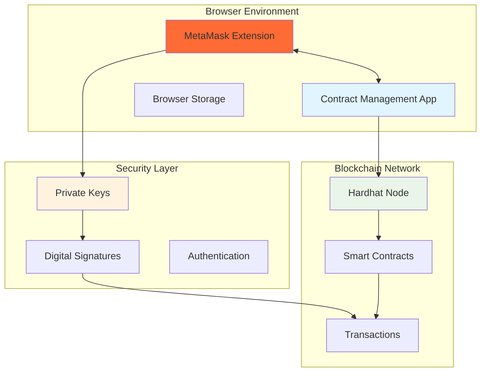
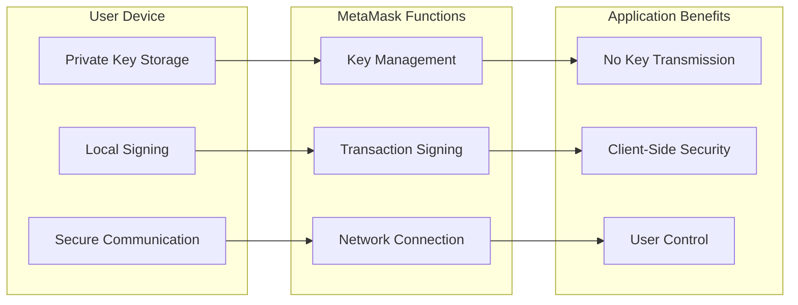
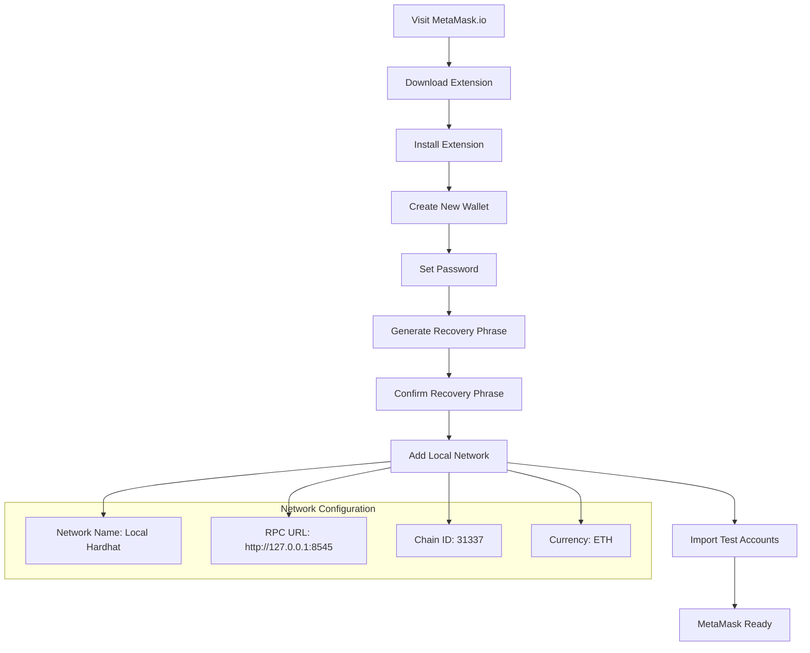
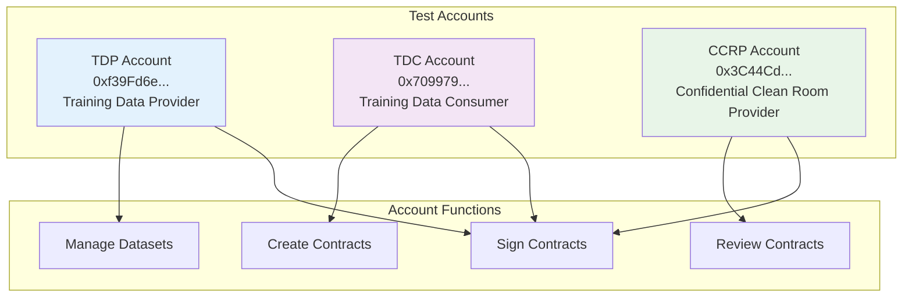
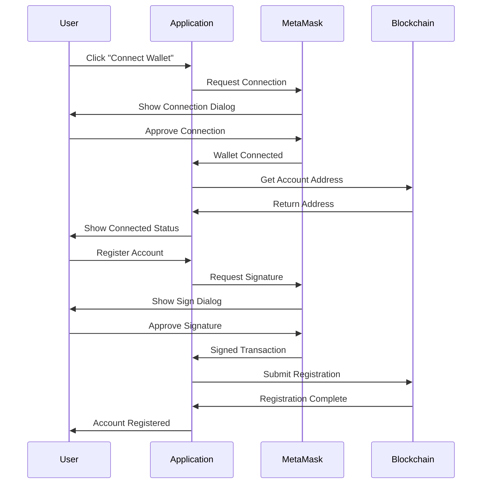
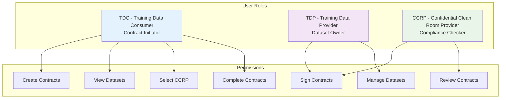
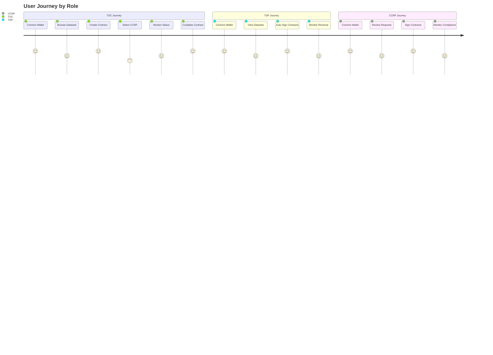
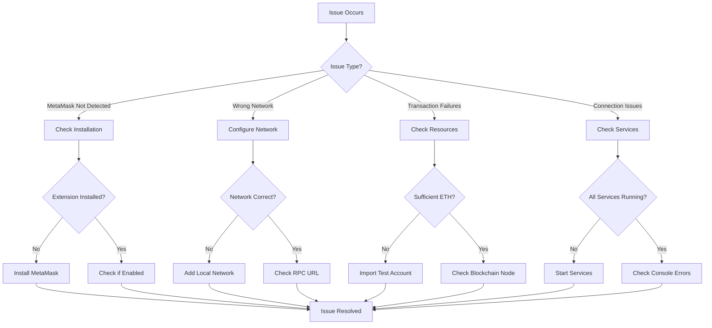
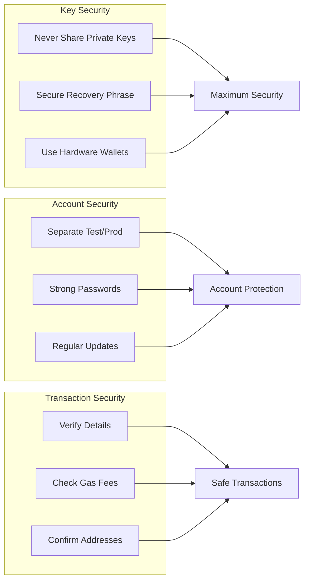
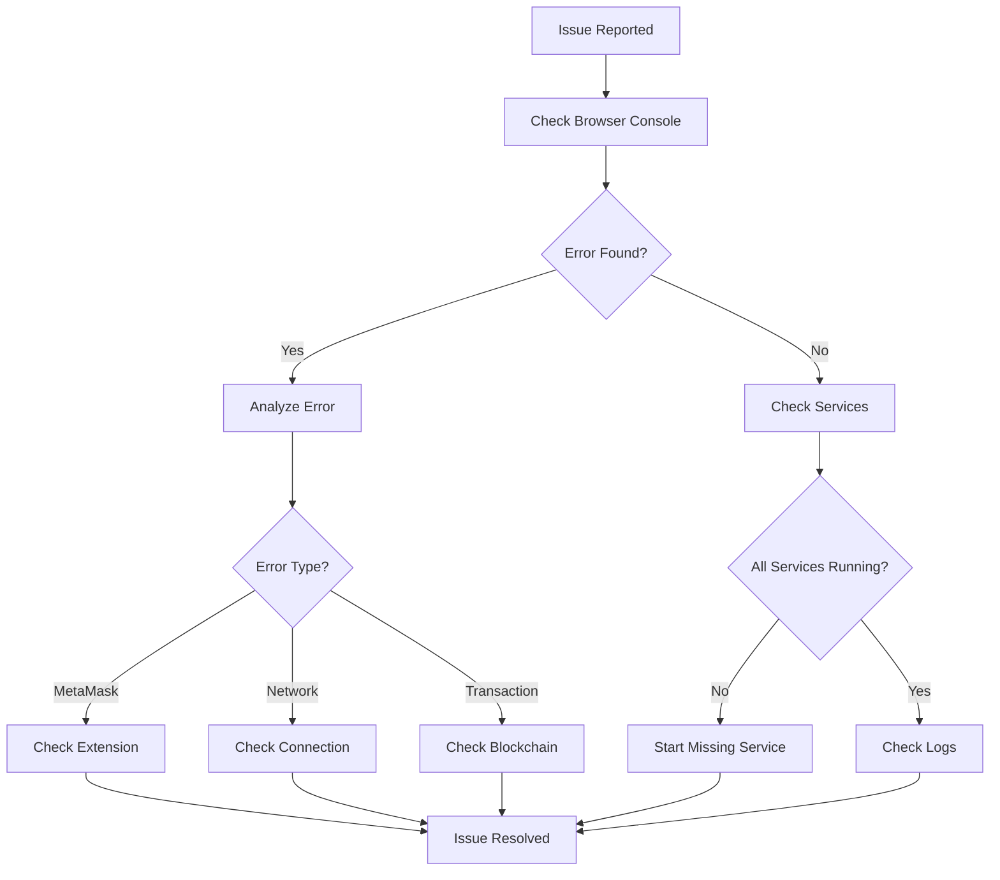

# MetaMask Setup Guide

## Overview
This Contract Management application requires MetaMask to connect to the blockchain and manage your digital identity securely. MetaMask is a browser extension that acts as your digital wallet.

### MetaMask Integration Overview


## Why MetaMask is Required

1. **Digital Identity Management**: MetaMask securely stores your private keys and manages your blockchain identity
2. **Contract Signing**: You need to sign contracts and transactions with your digital signature
3. **Security**: Your private keys never leave your device, ensuring maximum security
4. **Blockchain Interaction**: MetaMask connects you to the Ethereum blockchain where smart contracts are deployed

### MetaMask Security Model


## Installation Steps

### Step 1: Install MetaMask
1. Visit [metamask.io](https://metamask.io/download/)
2. Click "Download" for your browser (Chrome, Firefox, Edge, or Brave)
3. Follow the installation prompts

### Step 2: Create or Import a Wallet
1. Open MetaMask extension
2. Click "Create a new wallet" or "Import wallet" if you have existing keys
3. Set up a strong password
4. Write down your 12-word recovery phrase and store it securely
5. Confirm your recovery phrase

### Step 3: Connect to Local Network
1. In MetaMask, click the network dropdown (usually shows "Ethereum Mainnet")
2. Click "Add network"
3. Add the following details:
   - **Network Name**: Local Hardhat
   - **New RPC URL**: http://127.0.0.1:8545
   - **Chain ID**: 31337
   - **Currency Symbol**: ETH
4. Click "Save"

### Installation Flow


### Step 4: Import Test Accounts
The application comes with pre-configured test accounts. You can import them using their private keys:

**TDP Account (Training Data Provider):**
- Address: `0xf39Fd6e51aad88F6F4ce6aB8827279cffFb92266`
- Private Key: `0xac0974bec39a17e36ba4a6b4d238ff944bacb478cbed5efcae784d7bf4f2ff80`

**TDC Account (Training Data Consumer):**
- Address: `0x70997970C51812dc3A010C7d01b50e0d17dc79C8`
- Private Key: `0x59c6995e998f97a5a0044966f0945389dc9e86dae88c7a8412f4603b6b78690d`

**CCRP Account (Confidential Clean Room Provider):**
- Address: `0x3C44CdDdB6a900fa2b585dd299e03d12FA4293BC`
- Private Key: `0x5de4111afa1a4b94908f83103eb1f1706367c2e68ca870fc3fb9a804cdab365a`

To import:
1. In MetaMask, click the account icon
2. Click "Import account"
3. Paste the private key
4. Click "Import"

### Test Account Setup


## Using the Application

### Step 1: Start the Services
Make sure all services are running:
```bash
# Terminal 1: Blockchain node
cd blockchain && npx hardhat node

# Terminal 2: Backend server
cd backend && npm run dev

# Terminal 3: Frontend
cd frontend && npm start
```

### Step 2: Connect Your Wallet
1. Open the application in your browser (http://localhost:3000)
2. Click "Connect Wallet" in the top-right corner
3. MetaMask will prompt you to connect - click "Connect"
4. Select the account you want to use

### Step 3: Register Your Account
1. If this is your first time, you'll need to register
2. Click "User Registration" in the navigation
3. Fill in your details and click "Register"
4. MetaMask will prompt you to sign the registration transaction

### Wallet Connection Flow


## Role-Based Access

The application has three user roles:

### TDC (Training Data Consumer)
- Can create contracts
- Select datasets and CCRP parties
- Manage contract lifecycle

### TDP (Training Data Provider)
- Can sign contracts as data provider
- View contracts they're involved in
- Receive notifications

### CCRP (Confidential Clean Room Provider)
- Can sign contracts as compliance reviewer
- Review contract terms
- Approve or reject contracts

### Role-Based Access Control


### User Journey by Role


## Troubleshooting

### MetaMask Not Detected
- Make sure MetaMask is installed and enabled
- Refresh the page
- Check if MetaMask is unlocked

### Wrong Network
- Ensure you're connected to the Local Hardhat network
- Check that the RPC URL is correct: http://127.0.0.1:8545

### Transaction Failures
- Make sure you have enough ETH in your test account
- Check that the blockchain node is running
- Verify the contract is deployed

### Connection Issues
- Ensure all services are running (blockchain, backend, frontend)
- Check browser console for errors
- Try refreshing the page

### Troubleshooting Decision Tree


## Security Notes

- **Never share your private keys** with anyone
- **Store your recovery phrase** in a secure location
- **Use different accounts** for testing and production
- **Keep MetaMask updated** for security patches

### Security Best Practices


## Support

If you encounter issues:
1. Check the browser console for error messages
2. Verify all services are running
3. Ensure MetaMask is properly configured
4. Check the application logs for backend errors

### Support Flow


For development issues, refer to the main README.md file for technical setup instructions. 