# MetaMask and Web3 Technologies: A Comprehensive Guide

## Table of Contents
1. [What is MetaMask?](#what-is-metamask)
2. [MetaMask's Role in Web3](#metamasks-role-in-web3)
3. [How MetaMask Works](#how-metamask-works)
4. [Security Model](#security-model)
5. [Real-World Use Cases](#real-world-use-cases)
6. [Technical Architecture](#technical-architecture)
7. [Integration Patterns](#integration-patterns)
8. [Best Practices](#best-practices)
9. [Common Challenges](#common-challenges)
10. [Future of MetaMask](#future-of-metamask)

## What is MetaMask?

MetaMask is a cryptocurrency wallet and gateway to blockchain applications (dApps). It serves as a bridge between traditional web browsers and the decentralized web (Web3). MetaMask allows users to:

- **Store and manage cryptocurrencies** (ETH, ERC-20 tokens, NFTs)
- **Connect to decentralized applications** (dApps)
- **Sign transactions** securely
- **Manage multiple accounts** and networks
- **Interact with smart contracts**

### Key Features

- **Browser Extension**: Available for Chrome, Firefox, Brave, and Edge
- **Mobile App**: iOS and Android versions available
- **Hardware Wallet Support**: Integration with Ledger, Trezor, etc.
- **Multi-Network Support**: Ethereum, Polygon, BSC, Arbitrum, etc.
- **Token Management**: View and manage ERC-20 tokens and NFTs
- **Transaction History**: Complete history of all transactions
- **Gas Fee Management**: Customizable gas fees for transactions

## MetaMask's Role in Web3

### Web3 Ecosystem Components

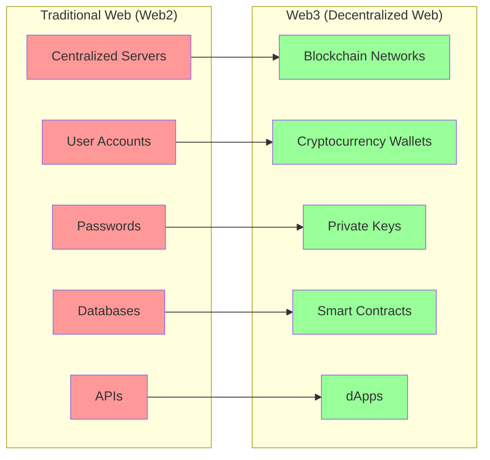
```mermaid
graph LR
    subgraph "Traditional Web (Web2)"
        A[Centralized Servers]
        B[User Accounts]
        C[Passwords]
        D[Databases]
        E[APIs]
    end
    
    subgraph "Web3 (Decentralized Web)"
        F[Blockchain Networks]
        G[Cryptocurrency Wallets]
        H[Private Keys]
        I[Smart Contracts]
        J[dApps]
    end
    
    A --> F
    B --> G
    C --> H
    D --> I
    E --> J
    
    style A fill:#ff9999
    style B fill:#ff9999
    style C fill:#ff9999
    style D fill:#ff9999
    style E fill:#ff9999
    style F fill:#99ff99
    style G fill:#99ff99
    style H fill:#99ff99
    style I fill:#99ff99
    style J fill:#99ff99
```

### MetaMask as the Web3 Gateway

MetaMask serves as the **identity layer** of Web3:

1. **Digital Identity**: Your wallet address becomes your digital identity
2. **Authentication**: Sign messages to prove ownership
3. **Authorization**: Approve transactions and smart contract interactions
4. **Asset Management**: Store and manage digital assets
5. **Network Access**: Connect to different blockchain networks

### Web3 Stack with MetaMask

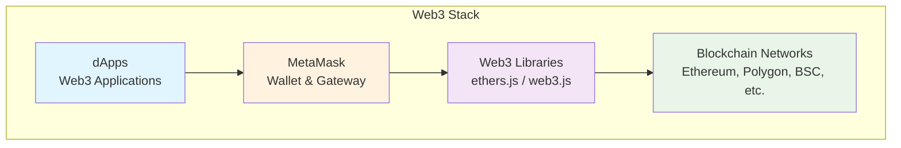
```mermaid
graph TB
    subgraph "Web3 Stack"
        A[dApps<br/>Web3 Applications]
        B[MetaMask<br/>Wallet & Gateway]
        C[Web3 Libraries<br/>ethers.js / web3.js]
        D[Blockchain Networks<br/>Ethereum, Polygon, BSC, etc.]
    end
    
    A --> B
    B --> C
    C --> D
    
    style A fill:#e1f5fe
    style B fill:#fff3e0
    style C fill:#f3e5f5
    style D fill:#e8f5e8
```

## How MetaMask Works

### 1. Wallet Creation and Management

**Account Generation Process:**

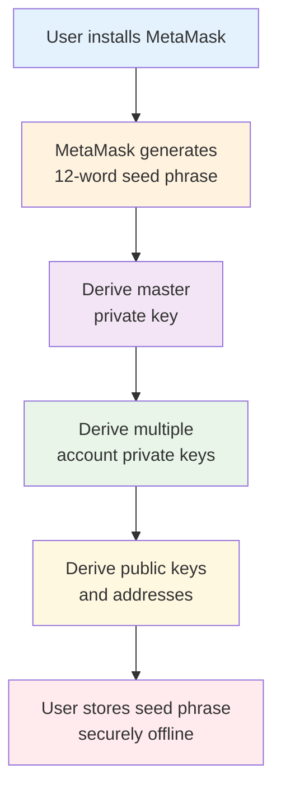
```mermaid
flowchart TD
    A[User installs MetaMask] --> B[MetaMask generates<br/>12-word seed phrase]
    B --> C[Derive master<br/>private key]
    C --> D[Derive multiple<br/>account private keys]
    D --> E[Derive public keys<br/>and addresses]
    E --> F[User stores seed phrase<br/>securely offline]
    
    style A fill:#e3f2fd
    style B fill:#fff3e0
    style C fill:#f3e5f5
    style D fill:#e8f5e8
    style E fill:#fff8e1
    style F fill:#ffebee
```

**Key Derivation:**

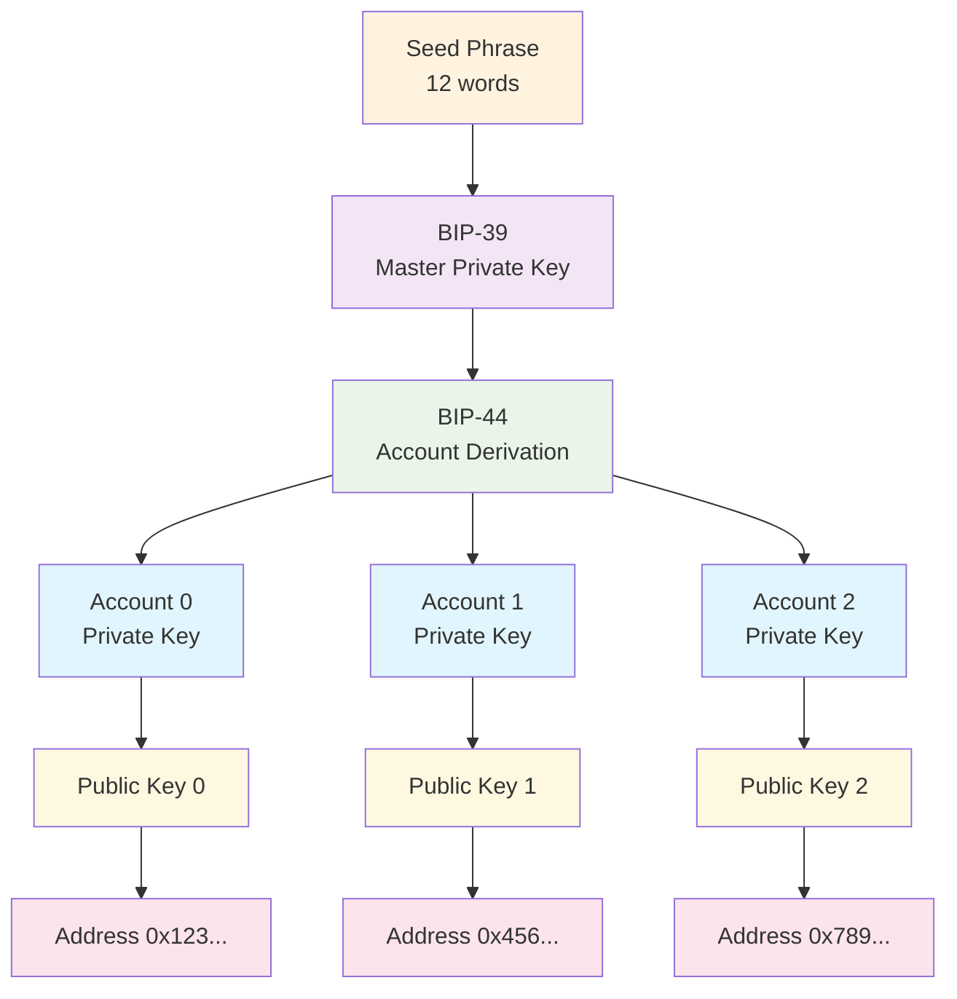
```mermaid
graph TD
    A[Seed Phrase<br/>12 words] --> B[BIP-39<br/>Master Private Key]
    B --> C[BIP-44<br/>Account Derivation]
    
    C --> D[Account 0<br/>Private Key]
    C --> E[Account 1<br/>Private Key]
    C --> F[Account 2<br/>Private Key]
    
    D --> G[Public Key 0]
    E --> H[Public Key 1]
    F --> I[Public Key 2]
    
    G --> J[Address 0x123...]
    H --> K[Address 0x456...]
    I --> L[Address 0x789...]
    
    style A fill:#fff3e0
    style B fill:#f3e5f5
    style C fill:#e8f5e8
    style D fill:#e1f5fe
    style E fill:#e1f5fe
    style F fill:#e1f5fe
    style G fill:#fff8e1
    style H fill:#fff8e1
    style I fill:#fff8e1
    style J fill:#fce4ec
    style K fill:#fce4ec
    style L fill:#fce4ec
```

### 2. Connection Flow

**Standard dApp Connection:**

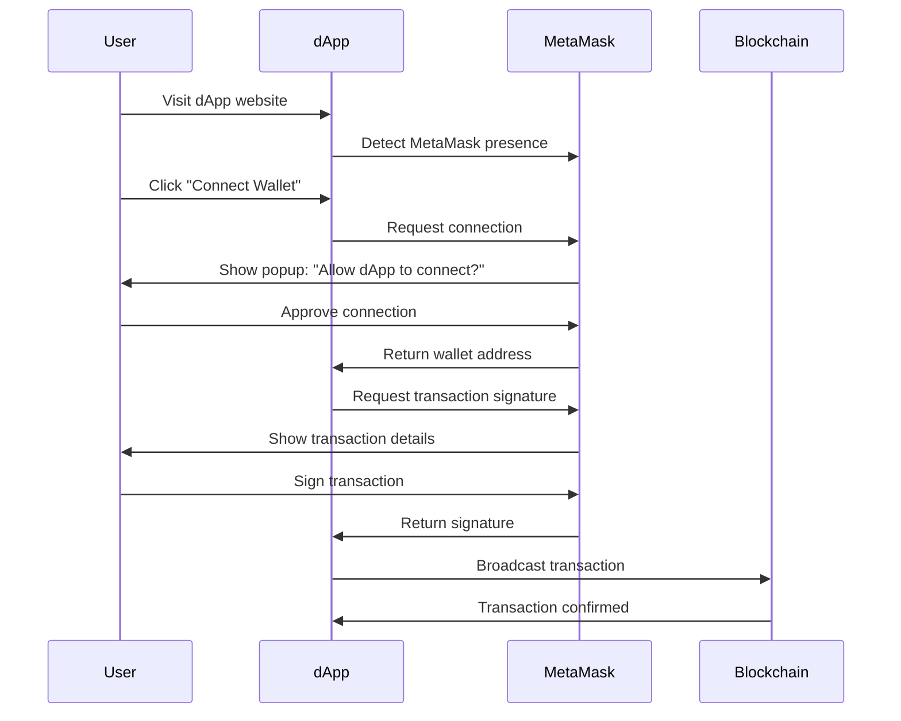
```mermaid
sequenceDiagram
    participant U as User
    participant D as dApp
    participant M as MetaMask
    participant B as Blockchain
    
    U->>D: Visit dApp website
    D->>M: Detect MetaMask presence
    U->>D: Click "Connect Wallet"
    D->>M: Request connection
    M->>U: Show popup: "Allow dApp to connect?"
    U->>M: Approve connection
    M->>D: Return wallet address
    D->>M: Request transaction signature
    M->>U: Show transaction details
    U->>M: Sign transaction
    M->>D: Return signature
    D->>B: Broadcast transaction
    B->>D: Transaction confirmed
```

### 3. Transaction Signing Process

**Detailed Transaction Flow:**

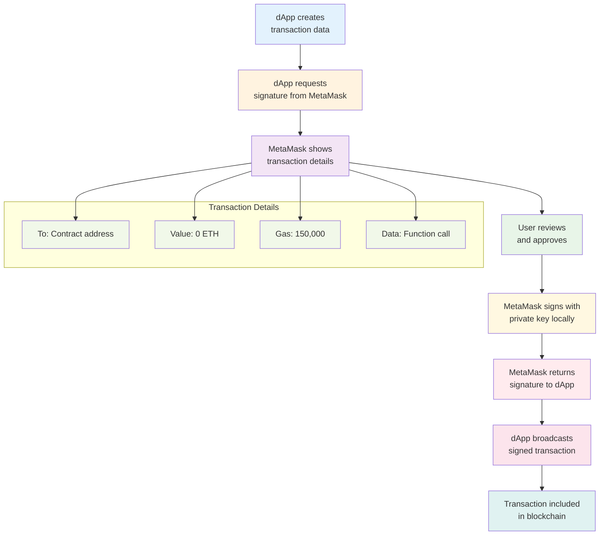
```mermaid
flowchart TD
    A[dApp creates<br/>transaction data] --> B[dApp requests<br/>signature from MetaMask]
    B --> C[MetaMask shows<br/>transaction details]
    C --> D[User reviews<br/>and approves]
    D --> E[MetaMask signs with<br/>private key locally]
    E --> F[MetaMask returns<br/>signature to dApp]
    F --> G[dApp broadcasts<br/>signed transaction]
    G --> H[Transaction included<br/>in blockchain]
    
    subgraph "Transaction Details"
        I[To: Contract address]
        J[Value: 0 ETH]
        K[Gas: 150,000]
        L[Data: Function call]
    end
    
    C --> I
    C --> J
    C --> K
    C --> L
    
    style A fill:#e3f2fd
    style B fill:#fff3e0
    style C fill:#f3e5f5
    style D fill:#e8f5e8
    style E fill:#fff8e1
    style F fill:#ffebee
    style G fill:#fce4ec
    style H fill:#e0f2f1
    style I fill:#f1f8e9
    style J fill:#f1f8e9
    style K fill:#f1f8e9
    style L fill:#f1f8e9
```

## Security Model

### 1. Private Key Security

**Core Security Principles:**
- **Never transmitted**: Private keys never leave the user's device
- **Local signing**: All signatures created locally
- **Secure storage**: Encrypted storage with user password
- **Backup required**: 12-word seed phrase for recovery

**Security Layers:**

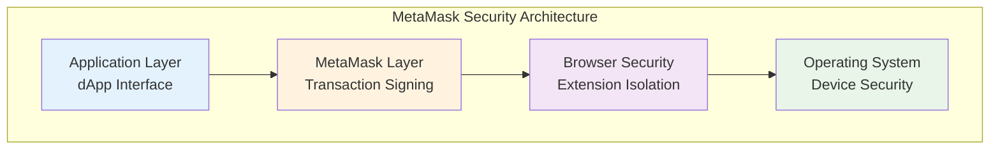
```mermaid
graph TB
    subgraph "MetaMask Security Architecture"
        A[Application Layer<br/>dApp Interface]
        B[MetaMask Layer<br/>Transaction Signing]
        C[Browser Security<br/>Extension Isolation]
        D[Operating System<br/>Device Security]
    end
    
    A --> B
    B --> C
    C --> D
    
    style A fill:#e3f2fd
    style B fill:#fff3e0
    style C fill:#f3e5f5
    style D fill:#e8f5e8
```

### 2. Permission Model

**Connection Permissions:**

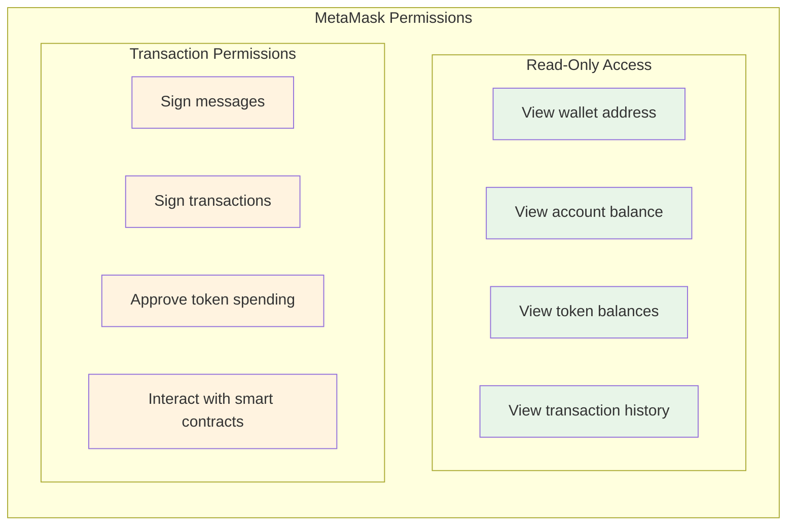
```mermaid
graph LR
    subgraph "MetaMask Permissions"
        subgraph "Read-Only Access"
            A[View wallet address]
            B[View account balance]
            C[View token balances]
            D[View transaction history]
        end
        
        subgraph "Transaction Permissions"
            E[Sign messages]
            F[Sign transactions]
            G[Approve token spending]
            H[Interact with smart contracts]
        end
    end
    
    style A fill:#e8f5e8
    style B fill:#e8f5e8
    style C fill:#e8f5e8
    style D fill:#e8f5e8
    style E fill:#fff3e0
    style F fill:#fff3e0
    style G fill:#fff3e0
    style H fill:#fff3e0
```

### 3. Network Security

**Network Validation:**
- **Chain ID verification**: Ensures correct network
- **RPC endpoint validation**: Secure connection to nodes
- **Transaction simulation**: Preview transaction effects
- **Gas estimation**: Accurate gas fee calculation

## Real-World Use Cases

### 1. DeFi Lending Platform (Aave)

**Complete User Journey:**

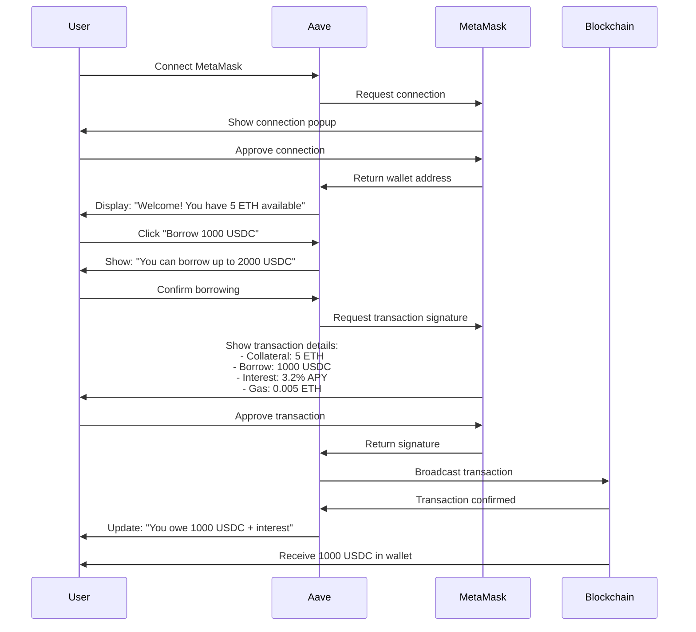
```mermaid
sequenceDiagram
    participant U as User
    participant A as Aave
    participant M as MetaMask
    participant B as Blockchain
    
    U->>A: Connect MetaMask
    A->>M: Request connection
    M->>U: Show connection popup
    U->>M: Approve connection
    M->>A: Return wallet address
    A->>U: Display: "Welcome! You have 5 ETH available"
    
    U->>A: Click "Borrow 1000 USDC"
    A->>U: Show: "You can borrow up to 2000 USDC"
    U->>A: Confirm borrowing
    A->>M: Request transaction signature
    M->>U: Show transaction details:<br/>- Collateral: 5 ETH<br/>- Borrow: 1000 USDC<br/>- Interest: 3.2% APY<br/>- Gas: 0.005 ETH
    U->>M: Approve transaction
    M->>A: Return signature
    A->>B: Broadcast transaction
    B->>A: Transaction confirmed
    A->>U: Update: "You owe 1000 USDC + interest"
    B->>U: Receive 1000 USDC in wallet
```

### 2. NFT Marketplace (OpenSea)

**NFT Trading Flow:**

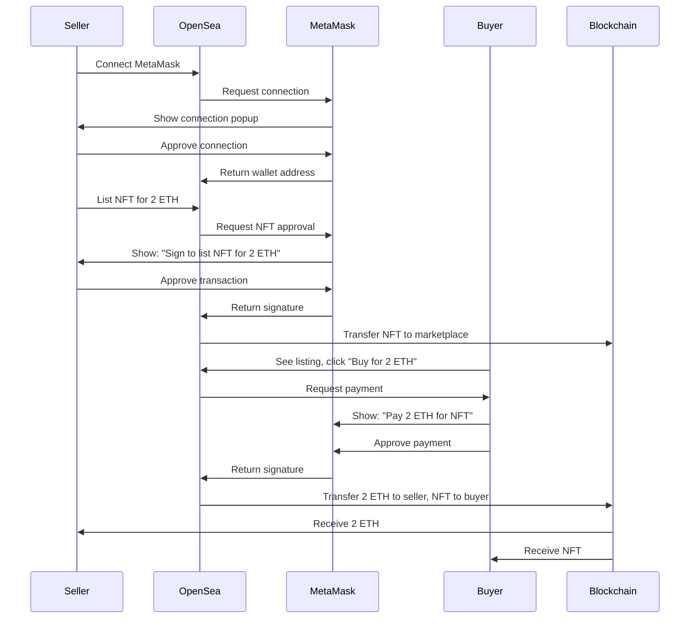
```mermaid
sequenceDiagram
    participant S as Seller
    participant O as OpenSea
    participant M as MetaMask
    participant B as Buyer
    participant BC as Blockchain
    
    S->>O: Connect MetaMask
    O->>M: Request connection
    M->>S: Show connection popup
    S->>M: Approve connection
    M->>O: Return wallet address
    
    S->>O: List NFT for 2 ETH
    O->>M: Request NFT approval
    M->>S: Show: "Sign to list NFT for 2 ETH"
    S->>M: Approve transaction
    M->>O: Return signature
    O->>BC: Transfer NFT to marketplace
    
    B->>O: See listing, click "Buy for 2 ETH"
    O->>B: Request payment
    B->>M: Show: "Pay 2 ETH for NFT"
    B->>M: Approve payment
    M->>O: Return signature
    O->>BC: Transfer 2 ETH to seller, NFT to buyer
    
    BC->>S: Receive 2 ETH
    BC->>B: Receive NFT
```

### 3. Decentralized Exchange (Uniswap)

**Token Swapping Process:**

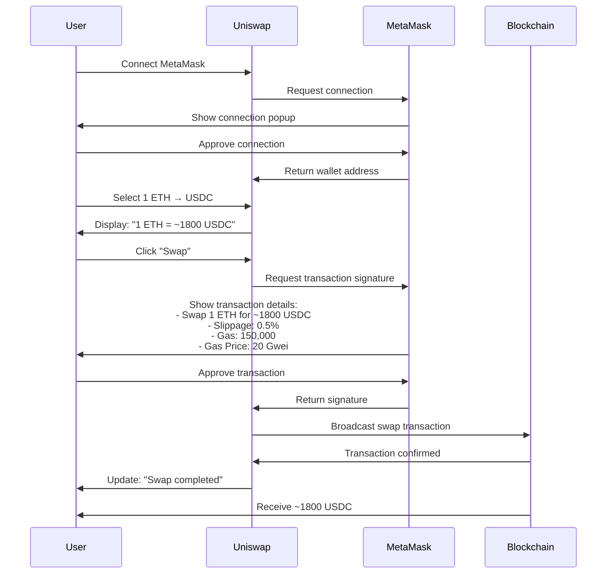
```mermaid
sequenceDiagram
    participant U as User
    participant UNI as Uniswap
    participant M as MetaMask
    participant B as Blockchain
    
    U->>UNI: Connect MetaMask
    UNI->>M: Request connection
    M->>U: Show connection popup
    U->>M: Approve connection
    M->>UNI: Return wallet address
    
    U->>UNI: Select 1 ETH → USDC
    UNI->>U: Display: "1 ETH = ~1800 USDC"
    U->>UNI: Click "Swap"
    UNI->>M: Request transaction signature
    M->>U: Show transaction details:<br/>- Swap 1 ETH for ~1800 USDC<br/>- Slippage: 0.5%<br/>- Gas: 150,000<br/>- Gas Price: 20 Gwei
    U->>M: Approve transaction
    M->>UNI: Return signature
    UNI->>B: Broadcast swap transaction
    B->>UNI: Transaction confirmed
    UNI->>U: Update: "Swap completed"
    B->>U: Receive ~1800 USDC
```

### 4. DAO Governance (Compound)

**Voting Process:**

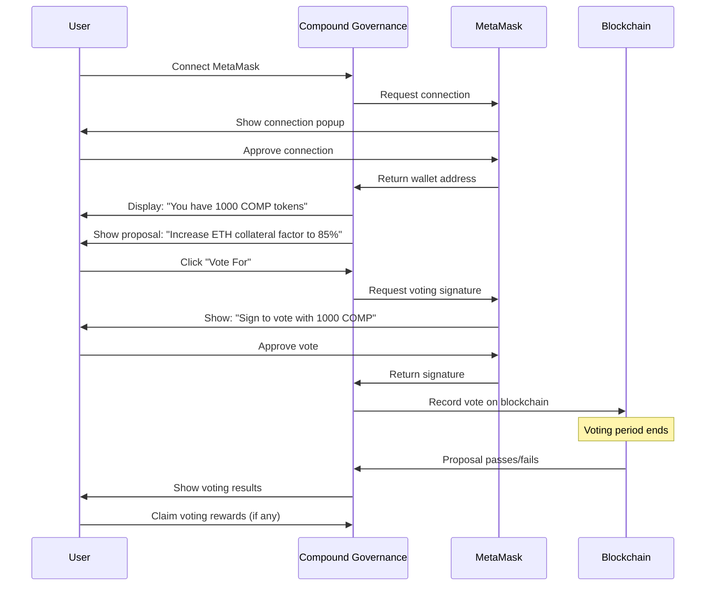
```mermaid
sequenceDiagram
    participant U as User
    participant C as Compound Governance
    participant M as MetaMask
    participant B as Blockchain
    
    U->>C: Connect MetaMask
    C->>M: Request connection
    M->>U: Show connection popup
    U->>M: Approve connection
    M->>C: Return wallet address
    
    C->>U: Display: "You have 1000 COMP tokens"
    C->>U: Show proposal: "Increase ETH collateral factor to 85%"
    U->>C: Click "Vote For"
    C->>M: Request voting signature
    M->>U: Show: "Sign to vote with 1000 COMP"
    U->>M: Approve vote
    M->>C: Return signature
    C->>B: Record vote on blockchain
    
    Note over B: Voting period ends
    B->>C: Proposal passes/fails
    C->>U: Show voting results
    U->>C: Claim voting rewards (if any)
```

### 5. Social Media dApp (Lens Protocol)

**Content Creation and Monetization:**

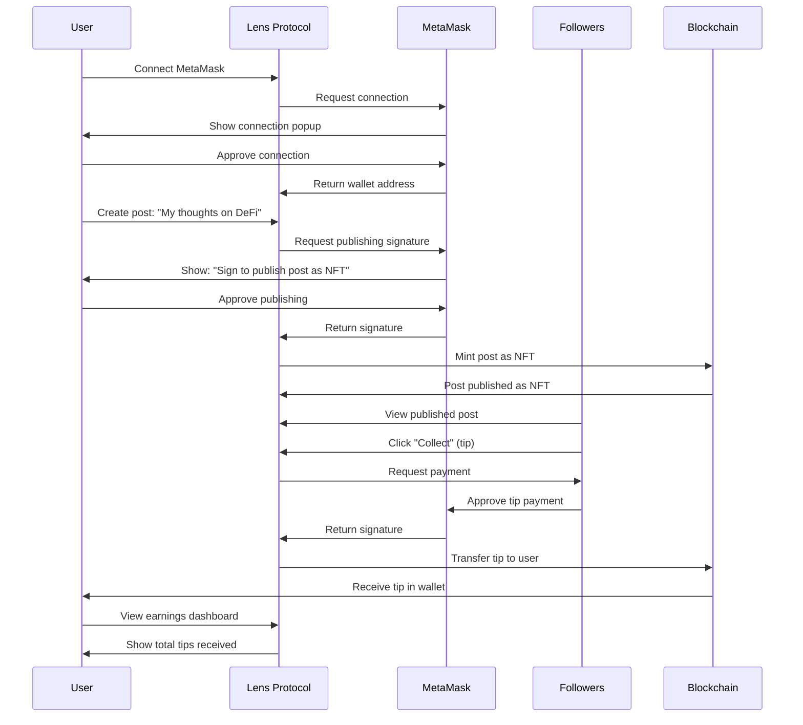
```mermaid
sequenceDiagram
    participant U as User
    participant L as Lens Protocol
    participant M as MetaMask
    participant F as Followers
    participant B as Blockchain
    
    U->>L: Connect MetaMask
    L->>M: Request connection
    M->>U: Show connection popup
    U->>M: Approve connection
    M->>L: Return wallet address
    
    U->>L: Create post: "My thoughts on DeFi"
    L->>M: Request publishing signature
    M->>U: Show: "Sign to publish post as NFT"
    U->>M: Approve publishing
    M->>L: Return signature
    L->>B: Mint post as NFT
    B->>L: Post published as NFT
    
    F->>L: View published post
    F->>L: Click "Collect" (tip)
    L->>F: Request payment
    F->>M: Approve tip payment
    M->>L: Return signature
    L->>B: Transfer tip to user
    B->>U: Receive tip in wallet
    
    U->>L: View earnings dashboard
    L->>U: Show total tips received
```

## Technical Architecture

### 1. MetaMask Architecture

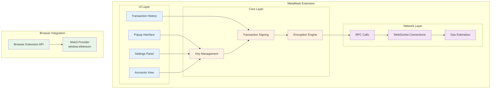
```mermaid
graph TB
    subgraph "MetaMask Extension"
        subgraph "UI Layer"
            A[Popup Interface]
            B[Settings Panel]
            C[Accounts View]
            D[Transaction History]
        end
        
        subgraph "Core Layer"
            E[Key Management]
            F[Transaction Signing]
            G[Encryption Engine]
        end
        
        subgraph "Network Layer"
            H[RPC Calls]
            I[WebSocket Connections]
            J[Gas Estimation]
        end
    end
    
    subgraph "Browser Integration"
        K[Browser Extension API]
        L[Web3 Provider<br/>window.ethereum]
    end
    
    A --> E
    B --> E
    C --> E
    D --> F
    E --> F
    F --> G
    G --> H
    H --> I
    I --> J
    
    K --> L
    
    style A fill:#e3f2fd
    style B fill:#e3f2fd
    style C fill:#e3f2fd
    style D fill:#e3f2fd
    style E fill:#fff3e0
    style F fill:#fff3e0
    style G fill:#fff3e0
    style H fill:#f3e5f5
    style I fill:#f3e5f5
    style J fill:#f3e5f5
    style K fill:#e8f5e8
    style L fill:#e8f5e8
```

### 2. dApp Integration Architecture

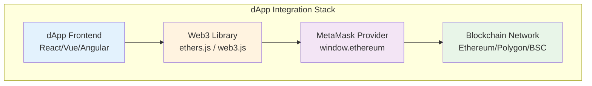
```mermaid
graph TB
    subgraph "dApp Integration Stack"
        A[dApp Frontend<br/>React/Vue/Angular]
        B[Web3 Library<br/>ethers.js / web3.js]
        C[MetaMask Provider<br/>window.ethereum]
        D[Blockchain Network<br/>Ethereum/Polygon/BSC]
    end
    
    A --> B
    B --> C
    C --> D
    
    style A fill:#e3f2fd
    style B fill:#fff3e0
    style C fill:#f3e5f5
    style D fill:#e8f5e8
```

### 3. Transaction Flow Architecture

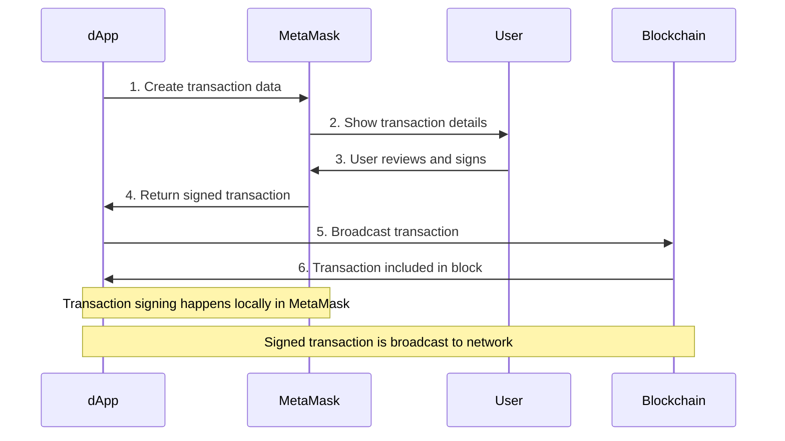
```mermaid
sequenceDiagram
    participant D as dApp
    participant M as MetaMask
    participant U as User
    participant B as Blockchain
    
    D->>M: 1. Create transaction data
    M->>U: 2. Show transaction details
    U->>M: 3. User reviews and signs
    M->>D: 4. Return signed transaction
    D->>B: 5. Broadcast transaction
    B->>D: 6. Transaction included in block
    
    Note over D,M: Transaction signing happens locally in MetaMask
    Note over D,B: Signed transaction is broadcast to network
```

## Integration Patterns

### 1. Basic Connection Pattern

```javascript
// Check if MetaMask is installed
if (typeof window.ethereum !== 'undefined') {
  // Request account access
  const accounts = await window.ethereum.request({
    method: 'eth_requestAccounts'
  });
  
  const account = accounts[0];
  console.log('Connected:', account);
} else {
  console.log('Please install MetaMask');
}
```

### 2. Transaction Signing Pattern

```javascript
// Create transaction
const transaction = {
  to: contractAddress,
  value: ethers.utils.parseEther('0.1'),
  gas: 150000,
  data: contractInterface.encodeFunctionData('functionName', [param1, param2])
};

// Request signature
const signature = await window.ethereum.request({
  method: 'eth_sendTransaction',
  params: [transaction]
});
```

### 3. Message Signing Pattern

```javascript
// Sign message for authentication
const message = 'Sign this message to authenticate with dApp';
const account = await window.ethereum.request({
  method: 'eth_requestAccounts'
});

const signature = await window.ethereum.request({
  method: 'personal_sign',
  params: [message, account[0]]
});
```

### 4. Event Listening Pattern

```javascript
// Listen for account changes
window.ethereum.on('accountsChanged', (accounts) => {
  if (accounts.length === 0) {
    // User disconnected
    console.log('Wallet disconnected');
  } else {
    // User switched accounts
    console.log('Account changed:', accounts[0]);
  }
});

// Listen for network changes
window.ethereum.on('chainChanged', (chainId) => {
  console.log('Network changed:', chainId);
  window.location.reload();
});
```

## Best Practices

### 1. Security Best Practices

**For Users:**
- ✅ Store seed phrase securely (offline, multiple locations)
- ✅ Use hardware wallets for large amounts
- ✅ Verify transaction details before signing
- ✅ Keep MetaMask updated
- ✅ Use different accounts for different purposes
- ❌ Never share private keys or seed phrases
- ❌ Don't connect to untrusted dApps
- ❌ Don't approve unlimited token spending

**For Developers:**
- ✅ Always verify network and contract addresses
- ✅ Implement proper error handling
- ✅ Use transaction simulation before broadcasting
- ✅ Provide clear transaction descriptions
- ✅ Implement proper connection state management
- ❌ Never request private keys
- ❌ Don't store sensitive data in localStorage
- ❌ Don't assume MetaMask is always available

### 2. UX Best Practices

**Connection Flow:**

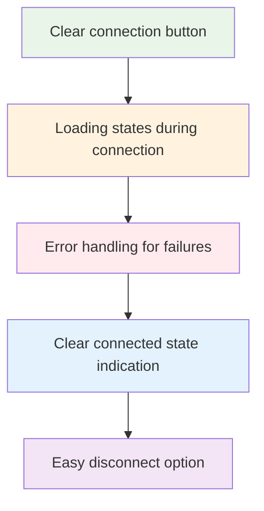
```mermaid
flowchart TD
    A[Clear connection button] --> B[Loading states during connection]
    B --> C[Error handling for failures]
    C --> D[Clear connected state indication]
    D --> E[Easy disconnect option]
    
    style A fill:#e8f5e8
    style B fill:#fff3e0
    style C fill:#ffebee
    style D fill:#e3f2fd
    style E fill:#f3e5f5
```

**Transaction Flow:**

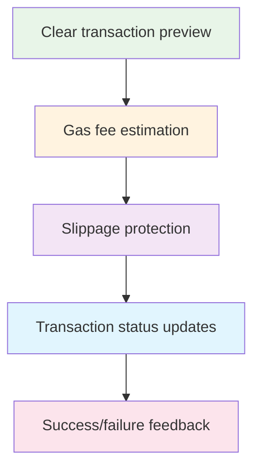
```mermaid
flowchart TD
    F[Clear transaction preview] --> G[Gas fee estimation]
    G --> H[Slippage protection]
    H --> I[Transaction status updates]
    I --> J[Success/failure feedback]
    
    style F fill:#e8f5e8
    style G fill:#fff3e0
    style H fill:#f3e5f5
    style I fill:#e1f5fe
    style J fill:#fce4ec
```

### 3. Error Handling

**Common Error Scenarios:**
```javascript
// Handle connection errors
try {
  const accounts = await window.ethereum.request({
    method: 'eth_requestAccounts'
  });
} catch (error) {
  if (error.code === 4001) {
    // User rejected connection
    console.log('User rejected connection');
  } else if (error.code === -32002) {
    // Request already pending
    console.log('Request already pending');
  }
}

// Handle transaction errors
try {
  const tx = await contract.function();
} catch (error) {
  if (error.code === 4001) {
    // User rejected transaction
  } else if (error.message.includes('insufficient funds')) {
    // Insufficient balance
  } else if (error.message.includes('gas')) {
    // Gas estimation failed
  }
}
```

## Common Challenges

### 1. Network Issues

**Problem**: User on wrong network
**Solution**: Detect and prompt network switching

```javascript
const targetChainId = '0x1'; // Ethereum mainnet
const currentChainId = await window.ethereum.request({
  method: 'eth_chainId'
});

if (currentChainId !== targetChainId) {
  await window.ethereum.request({
    method: 'wallet_switchEthereumChain',
    params: [{ chainId: targetChainId }]
  });
}
```

### 2. Account Switching

**Problem**: App doesn't detect account changes
**Solution**: Listen for account change events

```javascript
window.ethereum.on('accountsChanged', (accounts) => {
  if (accounts.length === 0) {
    // Handle disconnection
    setUser(null);
  } else {
    // Handle account switch
    setUser(accounts[0]);
  }
});
```

### 3. Transaction Failures

**Problem**: Transactions fail due to various reasons
**Solution**: Comprehensive error handling

```javascript
const sendTransaction = async () => {
  try {
    // Estimate gas first
    const gasEstimate = await contract.estimateGas.function();
    
    // Send with buffer
    const tx = await contract.function({
      gasLimit: gasEstimate.mul(120).div(100) // 20% buffer
    });
    
    // Wait for confirmation
    await tx.wait();
  } catch (error) {
    handleTransactionError(error);
  }
};
```

### 4. Performance Issues

**Problem**: Slow transaction processing
**Solution**: Optimize gas usage and provide feedback

```javascript
// Use batch transactions
const batchTx = await contract.batchFunction([param1, param2, param3]);

// Provide progress updates
const provider = new ethers.providers.Web3Provider(window.ethereum);
provider.on('pending', (tx) => {
  console.log('Pending transaction:', tx);
});
```

## Future of MetaMask

### 1. Upcoming Features

**Snaps (Plugin System):**
- Custom functionality through plugins
- Enhanced security features
- Integration with external services

**Account Abstraction:**
- Smart contract wallets
- Social recovery
- Gasless transactions

**Multi-Chain Support:**
- Seamless cross-chain transactions
- Unified interface for all networks
- Cross-chain asset management

### 2. Industry Trends

**Wallet as a Service (WaaS):**
- Embedded wallets in dApps
- Simplified onboarding
- Enterprise wallet solutions

**Social Wallets:**
- Recovery through social connections
- Shared wallets for families/teams
- Simplified key management

**Hardware Integration:**
- Better hardware wallet support
- Mobile hardware wallets
- Biometric authentication

### 3. Regulatory Considerations

**KYC/AML Integration:**
- Optional identity verification
- Compliance with regulations
- Privacy-preserving solutions

**Tax Reporting:**
- Transaction categorization
- Tax calculation tools
- Export capabilities

**Consumer Protection:**
- Transaction limits
- Fraud detection
- Insurance integration

## Conclusion

MetaMask has become the de facto standard for Web3 wallet integration, serving as the bridge between traditional web applications and the decentralized web. Its security model, user-friendly interface, and extensive ecosystem support make it essential for any Web3 application.

As the Web3 ecosystem continues to evolve, MetaMask will likely play an even more central role in enabling mainstream adoption of decentralized applications. Understanding how to properly integrate with MetaMask is crucial for any developer building in the Web3 space.

### Key Takeaways

1. **Security First**: Private keys never leave the user's device
2. **User Control**: Users always approve transactions
3. **Network Agnostic**: Works across multiple blockchain networks
4. **Developer Friendly**: Comprehensive APIs and documentation
5. **Evolving Platform**: Continuous improvements and new features

### Resources

- [MetaMask Documentation](https://docs.metamask.io/)
- [Web3.js Documentation](https://web3js.org/)
- [Ethers.js Documentation](https://docs.ethers.io/)
- [Ethereum Developer Resources](https://ethereum.org/developers/)
- [MetaMask GitHub](https://github.com/MetaMask/metamask-extension)

---

*This guide provides a comprehensive overview of MetaMask and its role in Web3 technologies. For specific implementation details, always refer to the official documentation and stay updated with the latest developments in the Web3 ecosystem.* 