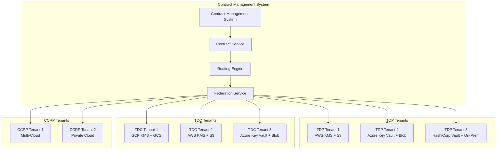
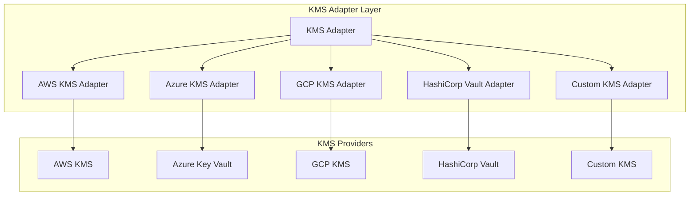
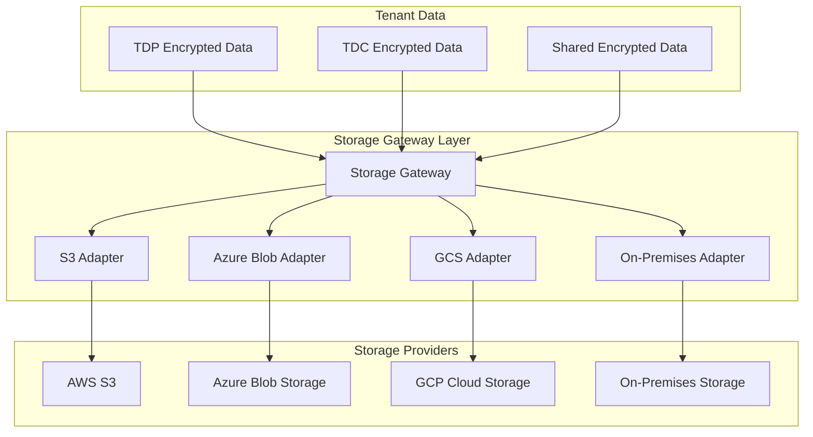
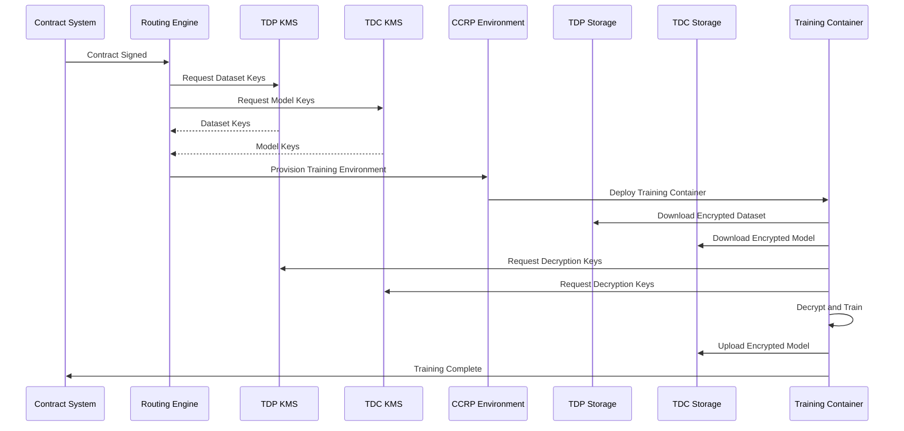
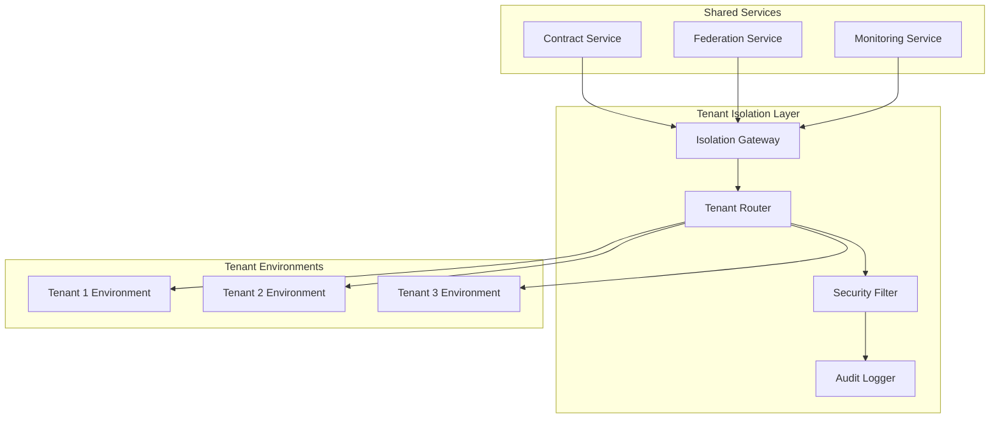

# Multi-Tenant KMS and Training Environment Architecture
## Contract Management System

**Document Version:** 2.0  
**Date:** December 2024  
**Author:** Contract Management System Team

---

## Table of Contents

1. [Executive Summary](#executive-summary)
2. [Multi-Tenant Architecture Overview](#multi-tenant-architecture-overview)
3. [Tenant-Specific KMS Integration](#tenant-specific-kms-integration)
4. [Multi-Cloud Storage Architecture](#multi-cloud-storage-architecture)
5. [Cross-Cloud Training Environment](#cross-cloud-training-environment)
6. [Tenant Isolation and Security](#tenant-isolation-and-security)
7. [Implementation Strategy](#implementation-strategy)

---

## 1. Executive Summary

### 1.1 Multi-Tenant Reality
Each TDP and TDC operates with their own enterprise infrastructure:
- **Private Clouds**: On-premises or dedicated cloud environments
- **Public Clouds**: AWS, Azure, GCP, or other cloud providers
- **Hybrid Deployments**: Combination of private and public infrastructure
- **Different KMS Solutions**: AWS KMS, Azure Key Vault, HashiCorp Vault, etc.
- **Different Storage Solutions**: S3, Azure Blob, GCS, on-premises storage

### 1.2 Architecture Challenges
- **KMS Integration**: Connect to multiple KMS providers
- **Storage Abstraction**: Unified access to different storage systems
- **Cross-Cloud Training**: Execute training across different cloud environments
- **Security Isolation**: Ensure tenant data isolation
- **Compliance**: Meet different regulatory requirements per tenant

### 1.3 Solution Approach
- **KMS Adapter Pattern**: Abstract different KMS providers
- **Storage Gateway**: Unified storage access layer
- **Federated Identity**: Cross-cloud identity management
- **Encrypted Bridges**: Secure data transfer between clouds
- **Contract-Driven Routing**: Route to appropriate tenant infrastructure

---

## 2. Multi-Tenant Architecture Overview

### 2.1 System Architecture



### 2.2 Tenant Configuration

```typescript
interface TenantConfiguration {
  tenantId: string;
  tenantType: 'TDP' | 'TDC' | 'CCRP';
  organization: string;
  
  // KMS Configuration
  kmsProvider: KMSProvider;
  kmsConfig: KMSConfiguration;
  
  // Storage Configuration
  storageProvider: StorageProvider;
  storageConfig: StorageConfiguration;
  
  // Security Configuration
  securityConfig: SecurityConfiguration;
  
  // Compliance Configuration
  complianceConfig: ComplianceConfiguration;
}

enum KMSProvider {
  AWS_KMS = 'aws_kms',
  AZURE_KEY_VAULT = 'azure_key_vault',
  GCP_KMS = 'gcp_kms',
  HASHICORP_VAULT = 'hashicorp_vault',
  CUSTOM_KMS = 'custom_kms'
}

enum StorageProvider {
  AWS_S3 = 'aws_s3',
  AZURE_BLOB = 'azure_blob',
  GCP_GCS = 'gcp_gcs',
  ON_PREMISES = 'on_premises',
  HYBRID = 'hybrid'
}

interface KMSConfiguration {
  endpoint: string;
  region?: string;
  credentials: Credentials;
  keyPrefix: string;
  encryptionAlgorithm: string;
  keyRotationPolicy: KeyRotationPolicy;
}

interface StorageConfiguration {
  endpoint: string;
  bucket: string;
  region?: string;
  credentials: Credentials;
  encryptionAtRest: boolean;
  accessControl: AccessControlConfig;
}
```

---

## 3. Tenant-Specific KMS Integration

### 3.1 KMS Adapter Pattern



### 3.2 KMS Adapter Interface

```typescript
interface KMSAdapter {
  // Key Management
  createKey(tenantId: string, keyType: KeyType, metadata: KeyMetadata): Promise<KeyInfo>;
  getKey(tenantId: string, keyId: string): Promise<KeyInfo>;
  rotateKey(tenantId: string, keyId: string): Promise<KeyInfo>;
  deleteKey(tenantId: string, keyId: string): Promise<boolean>;
  
  // Encryption/Decryption
  encryptData(tenantId: string, data: Buffer, keyId: string): Promise<EncryptedData>;
  decryptData(tenantId: string, encryptedData: EncryptedData, keyId: string): Promise<Buffer>;
  
  // Key Access Control
  grantAccess(tenantId: string, keyId: string, principal: string, permissions: Permission[]): Promise<boolean>;
  revokeAccess(tenantId: string, keyId: string, principal: string): Promise<boolean>;
  
  // Audit and Compliance
  getKeyUsage(tenantId: string, keyId: string, dateRange: DateRange): Promise<KeyUsageReport>;
  exportAuditLogs(tenantId: string, dateRange: DateRange): Promise<AuditLog[]>;
}

class AWSKMSAdapter implements KMSAdapter {
  private awsKMS: AWS.KMS;
  
  constructor(config: AWSKMSConfiguration) {
    this.awsKMS = new AWS.KMS(config);
  }
  
  async createKey(tenantId: string, keyType: KeyType, metadata: KeyMetadata): Promise<KeyInfo> {
    const params = {
      KeyUsage: 'ENCRYPT_DECRYPT',
      KeySpec: 'AES_256',
      Description: `Tenant: ${tenantId}, Type: ${keyType}`,
      Tags: [
        { TagKey: 'TenantId', TagValue: tenantId },
        { TagKey: 'KeyType', TagValue: keyType },
        { TagKey: 'Purpose', TagValue: metadata.purpose }
      ]
    };
    
    const result = await this.awsKMS.createKey(params).promise();
    return this.mapToKeyInfo(result.KeyMetadata!, tenantId, keyType, metadata);
  }
  
  async encryptData(tenantId: string, data: Buffer, keyId: string): Promise<EncryptedData> {
    const params = {
      KeyId: keyId,
      Plaintext: data,
      EncryptionAlgorithm: 'SYMMETRIC_DEFAULT'
    };
    
    const result = await this.awsKMS.encrypt(params).promise();
    return {
      encryptedData: result.CiphertextBlob!,
      keyId: keyId,
      algorithm: 'AES_256_GCM',
      iv: result.CiphertextBlob!.slice(0, 12)
    };
  }
  
  // ... other methods
}

class AzureKeyVaultAdapter implements KMSAdapter {
  private keyClient: KeyClient;
  
  constructor(config: AzureKeyVaultConfiguration) {
    const credential = new DefaultAzureCredential();
    this.keyClient = new KeyClient(config.vaultUrl, credential);
  }
  
  async createKey(tenantId: string, keyType: KeyType, metadata: KeyMetadata): Promise<KeyInfo> {
    const keyName = `${tenantId}-${keyType}-${Date.now()}`;
    const result = await this.keyClient.createKey(keyName, 'AES', {
      keySize: 256,
      tags: {
        tenantId: tenantId,
        keyType: keyType,
        purpose: metadata.purpose
      }
    });
    
    return this.mapToKeyInfo(result, tenantId, keyType, metadata);
  }
  
  // ... other methods
}
```

### 3.3 KMS Factory Pattern

```typescript
class KMSAdapterFactory {
  static createAdapter(tenantConfig: TenantConfiguration): KMSAdapter {
    switch (tenantConfig.kmsProvider) {
      case KMSProvider.AWS_KMS:
        return new AWSKMSAdapter(tenantConfig.kmsConfig as AWSKMSConfiguration);
      
      case KMSProvider.AZURE_KEY_VAULT:
        return new AzureKeyVaultAdapter(tenantConfig.kmsConfig as AzureKeyVaultConfiguration);
      
      case KMSProvider.GCP_KMS:
        return new GCPKMSAdapter(tenantConfig.kmsConfig as GCPKMSConfiguration);
      
      case KMSProvider.HASHICORP_VAULT:
        return new HashiCorpVaultAdapter(tenantConfig.kmsConfig as HashiCorpVaultConfiguration);
      
      case KMSProvider.CUSTOM_KMS:
        return new CustomKMSAdapter(tenantConfig.kmsConfig as CustomKMSConfiguration);
      
      default:
        throw new Error(`Unsupported KMS provider: ${tenantConfig.kmsProvider}`);
    }
  }
}
```

---

## 4. Multi-Cloud Storage Architecture

### 4.1 Storage Gateway Architecture



### 4.2 Storage Gateway Interface

```typescript
interface StorageGateway {
  // Dataset Storage
  storeEncryptedDataset(tenantId: string, dataset: EncryptedDataset): Promise<StorageLocation>;
  retrieveEncryptedDataset(tenantId: string, location: StorageLocation): Promise<EncryptedDataset>;
  
  // Model Storage
  storeEncryptedModel(tenantId: string, model: EncryptedModel): Promise<StorageLocation>;
  retrieveEncryptedModel(tenantId: string, location: StorageLocation): Promise<EncryptedModel>;
  
  // Cross-Tenant Data Sharing
  shareEncryptedData(sourceTenantId: string, targetTenantId: string, data: EncryptedData): Promise<SharedDataLocation>;
  accessSharedData(tenantId: string, sharedLocation: SharedDataLocation): Promise<EncryptedData>;
  
  // Access Control
  grantAccess(tenantId: string, location: StorageLocation, principal: string, permissions: Permission[]): Promise<boolean>;
  revokeAccess(tenantId: string, location: StorageLocation, principal: string): Promise<boolean>;
}

class S3StorageAdapter implements StorageAdapter {
  private s3Client: AWS.S3;
  
  constructor(config: S3Configuration) {
    this.s3Client = new AWS.S3(config);
  }
  
  async storeEncryptedDataset(tenantId: string, dataset: EncryptedDataset): Promise<StorageLocation> {
    const key = `tenants/${tenantId}/datasets/${dataset.id}/data`;
    const metadataKey = `tenants/${tenantId}/datasets/${dataset.id}/metadata`;
    
    await this.s3Client.putObject({
      Bucket: this.config.bucket,
      Key: key,
      Body: dataset.encryptedData,
      Metadata: {
        'encryption-key-id': dataset.encryptionKeyId,
        'encryption-algorithm': dataset.encryptionAlgorithm,
        'tenant-id': tenantId
      }
    }).promise();
    
    await this.s3Client.putObject({
      Bucket: this.config.bucket,
      Key: metadataKey,
      Body: JSON.stringify(dataset.metadata),
      Metadata: {
        'tenant-id': tenantId
      }
    }).promise();
    
    return {
      id: dataset.id,
      type: 'DATASET',
      url: `s3://${this.config.bucket}/${key}`,
      bucket: this.config.bucket,
      path: key,
      encryptionKeyId: dataset.encryptionKeyId,
      tenantId: tenantId
    };
  }
  
  // ... other methods
}
```

### 4.3 Cross-Cloud Data Transfer

```typescript
interface CrossCloudDataTransfer {
  // Secure Data Transfer
  transferEncryptedData(
    sourceTenantId: string,
    targetTenantId: string,
    data: EncryptedData,
    transferMethod: TransferMethod
  ): Promise<TransferResult>;
  
  // Bridge Configuration
  configureBridge(sourceConfig: TenantConfiguration, targetConfig: TenantConfiguration): Promise<BridgeConfig>;
  
  // Transfer Monitoring
  monitorTransfer(transferId: string): Promise<TransferStatus>;
}

enum TransferMethod {
  DIRECT_TRANSFER = 'direct_transfer',
  ENCRYPTED_BRIDGE = 'encrypted_bridge',
  INTERMEDIATE_STORAGE = 'intermediate_storage'
}

interface BridgeConfig {
  bridgeId: string;
  sourceTenantId: string;
  targetTenantId: string;
  encryptionKey: string;
  transferEndpoint: string;
  securityConfig: SecurityConfig;
}
```

---

## 5. Cross-Cloud Training Environment

### 5.1 Multi-Cloud Training Architecture



### 5.2 Cross-Cloud Training Service

```typescript
interface CrossCloudTrainingService {
  // Environment Provisioning
  provisionCrossCloudEnvironment(contract: Contract): Promise<CrossCloudEnvironment>;
  
  // Key Coordination
  coordinateKeys(contract: Contract): Promise<CoordinatedKeys>;
  
  // Data Access
  setupDataAccess(environment: CrossCloudEnvironment, contract: Contract): Promise<DataAccessConfig>;
  
  // Training Execution
  executeCrossCloudTraining(environment: CrossCloudEnvironment, contract: Contract): Promise<TrainingResult>;
}

interface CrossCloudEnvironment {
  id: string;
  contractId: string;
  status: 'PROVISIONING' | 'READY' | 'RUNNING' | 'COMPLETED' | 'FAILED';
  
  // Tenant Configurations
  tdpConfig: TenantConfiguration;
  tdcConfig: TenantConfiguration;
  ccrpConfig: TenantConfiguration;
  
  // Resource Allocation
  resources: CrossCloudResources;
  security: CrossCloudSecurity;
  
  // Network Configuration
  networkConfig: NetworkConfiguration;
  dataAccess: DataAccessConfig;
}

interface CoordinatedKeys {
  datasetKeys: { [tenantId: string]: string };
  modelKeys: { [tenantId: string]: string };
  sessionKeys: { [tenantId: string]: string };
  bridgeKeys: { [bridgeId: string]: string };
}
```

### 5.3 Training Container Multi-Cloud Support

```typescript
interface MultiCloudTrainingContainer {
  // Multi-Cloud Data Access
  downloadFromMultipleSources(sources: DataSource[]): Promise<EncryptedData[]>;
  uploadToMultipleTargets(data: EncryptedData, targets: DataTarget[]): Promise<UploadResult[]>;
  
  // Key Management
  coordinateDecryptionKeys(encryptedData: EncryptedData[], keySources: KeySource[]): Promise<DecryptionKeys>;
  
  // Cross-Cloud Training
  executeMultiCloudTraining(spec: TrainingSpecification, data: EncryptedData[]): Promise<TrainingResult>;
  
  // Monitoring
  monitorCrossCloudProgress(progress: CrossCloudProgress): Promise<void>;
}

interface DataSource {
  tenantId: string;
  storageProvider: StorageProvider;
  location: StorageLocation;
  accessCredentials: Credentials;
}

interface KeySource {
  tenantId: string;
  kmsProvider: KMSProvider;
  keyId: string;
  accessCredentials: Credentials;
}
```

---

## 6. Tenant Isolation and Security

### 6.1 Tenant Isolation Architecture



### 6.2 Security Isolation Service

```typescript
interface TenantIsolationService {
  // Tenant Routing
  routeToTenant(tenantId: string, request: Request): Promise<Response>;
  
  // Data Isolation
  isolateTenantData(tenantId: string, data: any): Promise<IsolatedData>;
  deisolateTenantData(tenantId: string, isolatedData: IsolatedData): Promise<any>;
  
  // Security Filtering
  applySecurityFilters(tenantId: string, request: Request): Promise<FilteredRequest>;
  validateTenantAccess(tenantId: string, principal: string, resource: string): Promise<boolean>;
  
  // Audit Logging
  logTenantActivity(tenantId: string, activity: TenantActivity): Promise<void>;
  generateTenantAuditReport(tenantId: string, dateRange: DateRange): Promise<AuditReport>;
}

interface TenantActivity {
  tenantId: string;
  principal: string;
  action: string;
  resource: string;
  timestamp: Date;
  result: 'SUCCESS' | 'FAILED';
  metadata: any;
}

interface IsolatedData {
  tenantId: string;
  encryptedData: Buffer;
  encryptionKeyId: string;
  isolationLevel: 'BASIC' | 'ENHANCED' | 'MAXIMUM';
}
```

### 6.3 Compliance and Governance

```typescript
interface TenantComplianceService {
  // Compliance Validation
  validateTenantCompliance(tenantId: string, complianceFramework: ComplianceFramework): Promise<ComplianceResult>;
  
  // Data Governance
  applyDataGovernance(tenantId: string, data: any, governanceRules: GovernanceRules): Promise<GovernedData>;
  
  // Regulatory Reporting
  generateComplianceReport(tenantId: string, regulations: Regulation[]): Promise<ComplianceReport>;
  
  // Audit Trail
  maintainAuditTrail(tenantId: string, activities: Activity[]): Promise<AuditTrail>;
}

interface ComplianceFramework {
  gdpr: GDPRCompliance;
  dpdp: DPDPCompliance;
  ccpa: CCPACompliance;
  iso27001: ISO27001Compliance;
  soc2: SOC2Compliance;
}

interface GovernanceRules {
  dataRetention: RetentionPolicy;
  dataClassification: ClassificationPolicy;
  accessControl: AccessControlPolicy;
  encryptionRequirements: EncryptionPolicy;
}
```

---

## 7. Implementation Strategy

### 7.1 Phase 1: Multi-Tenant Foundation (Weeks 1-4)
- [ ] Implement tenant configuration management
- [ ] Create KMS adapter framework
- [ ] Implement storage gateway
- [ ] Set up tenant isolation layer

### 7.2 Phase 2: KMS Integration (Weeks 5-8)
- [ ] Implement AWS KMS adapter
- [ ] Implement Azure Key Vault adapter
- [ ] Implement GCP KMS adapter
- [ ] Implement HashiCorp Vault adapter
- [ ] Create custom KMS adapter framework

### 7.3 Phase 3: Storage Integration (Weeks 9-12)
- [ ] Implement S3 storage adapter
- [ ] Implement Azure Blob storage adapter
- [ ] Implement GCS storage adapter
- [ ] Implement on-premises storage adapter
- [ ] Create cross-cloud data transfer

### 7.4 Phase 4: Cross-Cloud Training (Weeks 13-16)
- [ ] Implement cross-cloud environment provisioning
- [ ] Create multi-cloud training container
- [ ] Implement key coordination service
- [ ] Set up cross-cloud monitoring

### 7.5 Phase 5: Security and Compliance (Weeks 17-20)
- [ ] Implement tenant isolation security
- [ ] Set up compliance monitoring
- [ ] Create audit and governance framework
- [ ] Final security review and testing

### 7.6 Implementation Example

```typescript
// Tenant Configuration Example
const tdpTenantConfig: TenantConfiguration = {
  tenantId: 'tdp-enterprise-1',
  tenantType: 'TDP',
  organization: 'Enterprise TDP Corp',
  
  kmsProvider: KMSProvider.AWS_KMS,
  kmsConfig: {
    endpoint: 'https://kms.us-east-1.amazonaws.com',
    region: 'us-east-1',
    credentials: {
      accessKeyId: process.env.AWS_ACCESS_KEY_ID,
      secretAccessKey: process.env.AWS_SECRET_ACCESS_KEY
    },
    keyPrefix: 'tdp-enterprise-1',
    encryptionAlgorithm: 'AES_256_GCM',
    keyRotationPolicy: {
      automaticRotation: true,
      rotationPeriod: '30_DAYS'
    }
  },
  
  storageProvider: StorageProvider.AWS_S3,
  storageConfig: {
    endpoint: 'https://s3.us-east-1.amazonaws.com',
    bucket: 'tdp-enterprise-1-datasets',
    region: 'us-east-1',
    credentials: {
      accessKeyId: process.env.AWS_ACCESS_KEY_ID,
      secretAccessKey: process.env.AWS_SECRET_ACCESS_KEY
    },
    encryptionAtRest: true,
    accessControl: {
      bucketPolicy: 'private',
      corsEnabled: false
    }
  },
  
  securityConfig: {
    encryptionAtRest: true,
    encryptionInTransit: true,
    accessControl: 'role-based',
    auditLogging: true
  },
  
  complianceConfig: {
    gdpr: true,
    dpdp: true,
    dataRetention: '7_YEARS',
    auditTrail: true
  }
};

// Usage Example
const kmsAdapter = KMSAdapterFactory.createAdapter(tdpTenantConfig);
const storageAdapter = StorageAdapterFactory.createAdapter(tdpTenantConfig);

// Create encrypted dataset
const datasetKey = await kmsAdapter.createKey(
  tdpTenantConfig.tenantId,
  KeyType.DATA_ENCRYPTION,
  { purpose: 'dataset-encryption', datasetId: 'dataset-1' }
);

const encryptedDataset = await kmsAdapter.encryptData(
  tdpTenantConfig.tenantId,
  datasetBuffer,
  datasetKey.keyId
);

const storageLocation = await storageAdapter.storeEncryptedDataset(
  tdpTenantConfig.tenantId,
  {
    id: 'dataset-1',
    encryptedData: encryptedDataset.encryptedData,
    encryptionKeyId: datasetKey.keyId,
    encryptionAlgorithm: 'AES_256_GCM',
    metadata: { name: 'Training Dataset 1', size: datasetBuffer.length }
  }
);
```

---

## 8. Conclusion

This Multi-Tenant KMS and Training Environment Architecture addresses the reality that each TDP and TDC operates with their own enterprise infrastructure. The solution provides:

- **Multi-Cloud Support**: Integration with AWS, Azure, GCP, and on-premises infrastructure
- **KMS Abstraction**: Unified interface for different KMS providers
- **Storage Gateway**: Consistent access to different storage systems
- **Cross-Cloud Training**: Secure training execution across different cloud environments
- **Tenant Isolation**: Complete security isolation between tenants
- **Compliance Ready**: Support for different regulatory requirements per tenant

The architecture ensures that each organization can use their preferred cloud infrastructure and KMS solutions while maintaining security, compliance, and interoperability across the contract management ecosystem.

---

**Document Version:** 2.0  
**Last Updated:** December 2024  
**Next Review:** March 2025 