# 🚀 **Confidential AI Training Platform**
## *Secure, Privacy-Preserving Machine Learning at Scale*

---

## **Executive Summary**

Our platform revolutionizes AI training by enabling **confidential data sharing** between Training Data Providers (TDPs) and Training Data Consumers (TDCs) through **automated smart contracts** and **confidential computing environments**. We solve the critical problem of data privacy in AI training while maintaining model performance through **differential privacy** and **secure enclaves**.

---

## **🎯 The Problem We Solve**

### **Current Pain Points:**
- **Data Silos**: Valuable training data locked in organizational silos
- **Privacy Concerns**: Companies can't share sensitive data for AI training
- **Manual Processes**: Complex, slow contract negotiations and execution
- **Trust Issues**: No verifiable way to ensure data privacy and model integrity
- **Compliance Risk**: Regulatory challenges with data sharing

### **Market Opportunity:**
- **$180B** AI/ML market growing at 40% CAGR
- **$50B** data privacy market by 2025
- **$12B** confidential computing market by 2026
- **70%** of enterprises cite data privacy as top AI adoption barrier

---

## **🔧 How Our System Works**

### **End-to-End Workflow**

#### **Phase 1: Data Preparation & Discovery**
**Training Data Providers (TDPs)** begin by uploading their confidential datasets to the platform, where they immediately set **privacy specifications** and **data classification levels**. TDPs define **usage terms, pricing models, and access restrictions** for their data. The platform performs **automated content safety validation** using AI-powered filtering to detect sensitive content, age-inappropriate material, and compliance issues. **Provenance tracking is automatically set up** to create an immutable audit trail of data lineage. Once validated, the dataset becomes available in the **secure marketplace** for discovery by potential consumers.

#### **Phase 2: Contract Negotiation & Setup**
**Training Data Consumers (TDCs)** browse available datasets in the marketplace, filtering by domain, data type, privacy level, and pricing. When a TDC finds suitable data, they create a **detailed training contract** specifying model requirements, training duration, and success criteria. TDCs select their preferred **Confidential Clean Room Provider (CCRP)** environment based on performance, cost, and compliance requirements. **Smart contracts automatically validate** the contract terms, pricing, and technical feasibility. The TDP reviews and **approves the contract terms**, after which the CCRP provisions a **secure enclave** with hardware-level isolation and attestation capabilities.

#### **Phase 3: Secure Training Execution**
The CCRP performs **hardware attestation** to cryptographically prove the Trusted Execution Environment (TEE) is secure and isolated. The platform **transfers encrypted data** to the verified TEE, where it's decrypted only within the secure enclave. The **differential privacy engine** applies mathematical privacy guarantees to ensure individual records cannot be identified during training. **Secure model training** proceeds within the hardware-protected environment, with **real-time safety metrics monitoring** to ensure content compliance and data protection. The platform provides **comprehensive training progress tracking** with detailed logs and performance metrics.

#### **Phase 4: Model Delivery & Settlement**
The TEE generates an **encrypted model output** with cryptographic attestation proving secure training. **Smart contracts automatically verify** the training results and attestation to ensure compliance with contract terms. The platform creates **comprehensive provenance documentation** showing the complete data lineage and training process. The TDC receives the **encrypted trained model** with full documentation and attestation. **Automated payment settlement** occurs through smart contracts, with **revenue distribution** to the TDP based on the agreed pricing model.

#### **Phase 5: Compliance & Audit**
The platform generates a **complete audit trail** documenting every step of the process for regulatory compliance. **Automated compliance reports** are generated for regulators, including data usage statistics, privacy protection measures, and security attestations. **Auditors can verify data lineage** through cryptographic proofs and immutable blockchain records. The platform provides **detailed usage analytics** for all stakeholders, enabling continuous improvement and optimization.

#### **Key System Benefits:**
- **Automated Workflow**: Minimal manual intervention required
- **Cryptographic Security**: Every step is cryptographically verified
- **Regulatory Compliance**: Built-in audit trails and reporting
- **Revenue Generation**: Automated payment and revenue distribution
- **Complete Transparency**: Full visibility into data usage and processing

```mermaid
graph TB
    subgraph "Phase 1: Data Preparation & Discovery"
        A1[TDP: Upload Confidential Dataset] --> A2[TDP: Set Privacy Specifications]
        A2 --> A3[TDP: Define Usage Terms & Pricing]
        A3 --> A4[Platform: Content Safety Validation]
        A4 --> A5[Platform: Provenance Tracking Setup]
        A5 --> A6[Dataset Available in Marketplace]
    end
    
    subgraph "Phase 2: Contract Negotiation & Setup"
        B1[TDC: Browse Available Datasets] --> B2[TDC: Create Training Contract]
        B2 --> B3[TDC: Select CCRP Environment]
        B3 --> B4[Smart Contract: Terms Validation]
        B4 --> B5[TDP: Approve Contract Terms]
        B5 --> B6[CCRP: Provision Secure Enclave]
    end
    
    subgraph "Phase 3: Secure Training Execution"
        C1[CCRP: TEE Attestation & Verification] --> C2[Platform: Data Transfer to TEE]
        C2 --> C3[Platform: Differential Privacy Engine]
        C3 --> C4[Platform: Secure Model Training]
        C4 --> C5[Platform: Safety Metrics Monitoring]
        C5 --> C6[Platform: Training Progress Tracking]
    end
    
    subgraph "Phase 4: Model Delivery & Settlement"
        D1[Platform: Encrypted Model Output] --> D2[Smart Contract: Results Verification]
        D2 --> D3[Platform: Provenance Documentation]
        D3 --> D4[TDC: Receive Trained Model]
        D4 --> D5[Smart Contract: Automated Payment]
        D5 --> D6[TDP: Revenue Distribution]
    end
    
    subgraph "Phase 5: Compliance & Audit"
        E1[Platform: Complete Audit Trail] --> E2[Regulators: Compliance Reports]
        E2 --> E3[Auditors: Data Lineage Verification]
        E3 --> E4[Platform: Usage Analytics]
    end
    
    A6 --> B1
    B6 --> C1
    C6 --> D1
    D6 --> E1
    
    style A1 fill:#e1f5fe
    style B1 fill:#f3e5f5
    style C1 fill:#e8f5e8
    style D1 fill:#fff3e0
    style E1 fill:#fce4ec
```



---

## **👥 User Roles & Responsibilities**

### **1. Training Data Provider (TDP)**
**Who:** Healthcare systems, financial institutions, government agencies, research organizations

**What They Do:**
- Upload confidential datasets with privacy specifications
- Set data usage terms and pricing
- Approve training contracts
- Monitor data usage and compliance
- Receive revenue from data sharing

**Value Proposition:**
- **Monetize** previously unused confidential data
- **Maintain control** over data access and usage
- **Ensure compliance** with privacy regulations
- **Generate revenue** without data exposure

### **2. Training Data Consumer (TDC)**
**Who:** AI companies, research institutions, enterprises building ML models

**What They Do:**
- Browse available datasets
- Create training contracts with specific requirements
- Select confidential computing environments
- Monitor training progress
- Receive trained models

**Value Proposition:**
- **Access** high-quality confidential datasets
- **Train models** on sensitive data without exposure
- **Accelerate** AI development with diverse data
- **Ensure compliance** with data privacy regulations

### **3. Confidential Clean Room Provider (CCRP)**
**Who:** Cloud providers (Azure, AWS, GCP), specialized confidential computing providers

**What They Do:**
- Provision secure enclaves (TEEs)
- Provide attestation and verification
- Manage confidential computing infrastructure
- Ensure secure execution environments
- Monitor resource usage and costs

**Value Proposition:**
- **Monetize** confidential computing infrastructure
- **Scale** secure computing services
- **Provide** enterprise-grade security
- **Generate revenue** from compute resources

### **4. Application Administrator (AppAdmin)**
**Who:** Platform operators, compliance officers, system administrators

**What They Do:**
- Manage platform operations
- Monitor system health and security
- Handle compliance and auditing
- Manage user access and permissions
- Oversee contract execution

---

## **🔐 Encryption & Data Protection Workflow**

### **End-to-End Encryption Process**

#### **Phase 1: Data Preparation & Encryption (TDP Side)**
When a Training Data Provider uploads confidential data, the platform immediately encrypts it using **AES-256-GCM encryption** with platform-managed keys stored in a Hardware Security Module (HSM). The raw data never exists in unencrypted form on the platform. The system generates metadata tags for data classification and creates a **data access token** that will be required for any future access to this dataset.

#### **Phase 2: Contract Negotiation & Access Control**
When a Training Data Consumer requests access to a dataset, the **smart contract validates** the contract terms, pricing, and usage requirements. The TDP reviews and approves the access request, after which the platform issues an **encrypted access token** with specific permissions and time-limited validity. The CCRP provisions a **Trusted Execution Environment (TEE)** with hardware-level security isolation.

#### **Phase 3: Secure Processing in Confidential Computing Environment**
The CCRP performs **hardware attestation** to cryptographically prove the TEE environment is secure and isolated. The platform transfers the encrypted data to the verified TEE, where it's **decrypted only within the secure enclave**. The data is processed using **differential privacy techniques** to ensure individual records cannot be identified. The TEE generates an **encrypted model output** and creates a **provenance attestation** proving the training was performed securely.

#### **Phase 4: Model Delivery & Verification**
The encrypted model and attestation are stored on the platform. The **smart contract verifies the TEE attestation** to ensure the training was performed in a secure environment. The TDC receives the encrypted model, and the platform generates a **complete audit trail** documenting every step of the process for compliance and regulatory reporting.

#### **Key Security Guarantees:**
- **Data Never Exposed**: Raw data remains encrypted except within verified TEE environments
- **Hardware-Level Protection**: Intel SGX/AMD SEV provides hardware isolation
- **Cryptographic Proof**: Every step is cryptographically verified and attested
- **Complete Audit Trail**: Full visibility into data usage and processing
- **Automatic Compliance**: Built-in regulatory compliance and reporting

```mermaid
graph TB
    subgraph "TDP Data Preparation"
        A1[TDP: Raw Confidential Data] --> A2[TDP: Encrypt with AES-256-GCM]
        A2 --> A3[Platform: Store Encrypted Data + Metadata]
        A3 --> A4[Platform: Generate Data Access Token]
    end
    
    subgraph "Contract & Access Control"
        B1[TDC: Request Dataset Access] --> B2[Smart Contract: Validate Contract Terms]
        B2 --> B3[TDP: Approve Access Request]
        B3 --> B4[Platform: Issue Encrypted Access Token]
        B4 --> B5[CCRP: Provision TEE Environment]
    end
    
    subgraph "Confidential Computing Environment"
        C1[CCRP: TEE Attestation & Verification] --> C2[Platform: Transfer Encrypted Data to TEE]
        C2 --> C3[TEE: Decrypt Data in Secure Enclave]
        C3 --> C4[TEE: Process Data with Differential Privacy]
        C4 --> C5[TEE: Generate Encrypted Model Output]
        C5 --> C6[TEE: Create Provenance Attestation]
    end
    
    subgraph "Model Delivery & Verification"
        D1[TEE: Encrypted Model + Attestation] --> D2[Platform: Store Encrypted Model]
        D2 --> D3[Smart Contract: Verify TEE Attestation]
        D3 --> D4[TDC: Receive Encrypted Model]
        D4 --> D5[Platform: Generate Audit Trail]
    end
    
    A4 --> B1
    B5 --> C1
    C6 --> D1
    D5 --> E1[Complete Compliance Report]
    
    style A1 fill:#e1f5fe
    style B1 fill:#f3e5f5
    style C1 fill:#e8f5e8
    style D1 fill:#fff3e0
```



### **Encryption Layers & Key Management**

#### **1. Data Encryption (TDP Side)**
- **AES-256-GCM**: Industry-standard symmetric encryption for data at rest
- **Platform-Managed Keys**: Keys generated and managed by the platform's HSM
- **Data Classification**: Automatic tagging based on sensitivity levels
- **Encrypted Storage**: Data stored with platform-managed encryption keys

#### **2. Access Control & Token Management**
- **JWT Tokens**: Secure access tokens with role-based permissions
- **Smart Contract Validation**: Contract terms verified before access
- **Time-Limited Access**: Tokens expire after training completion
- **Audit Logging**: All access attempts logged and monitored

#### **3. TEE Attestation & Secure Processing**
- **Hardware Attestation**: Intel SGX/AMD SEV attestation for TEE verification
- **Remote Attestation**: Cryptographic proof of secure environment
- **In-Enclave Decryption**: Data decrypted only within verified TEE
- **Memory Protection**: Hardware-level isolation prevents data leakage

#### **4. Model Output & Verification**
- **Encrypted Model Output**: Models encrypted with platform keys
- **TEE Attestation**: Cryptographic proof of secure training
- **Integrity Verification**: SHA-256 hash for model authenticity
- **Provenance Chain**: Complete audit trail with cryptographic signatures

### **Security Guarantees**

#### **For TDPs:**
- ✅ **Data Never Exposed**: Raw data never leaves encrypted state
- ✅ **Access Control**: Granular control over who can access data
- ✅ **Audit Trail**: Complete visibility into data usage and access
- ✅ **Revocation**: Ability to revoke access through token invalidation

#### **For TDCs:**
- ✅ **Secure Access**: Data only accessible in verified TEE environments
- ✅ **Model Protection**: Trained models encrypted and attested
- ✅ **Privacy Guarantees**: No access to raw data outside TEE
- ✅ **Attestation**: Cryptographic proof of secure execution

#### **For CCRPs:**
- ✅ **Hardware Security**: TEE provides hardware-level isolation
- ✅ **Attestation**: Verifiable proof of secure environment
- ✅ **Compliance**: Meets highest security standards
- ✅ **Resource Control**: Full control over TEE provisioning and management

---

## **🔐 Security & Privacy Architecture**

### **Confidential Computing**
- **Trusted Execution Environments (TEEs)**: Intel SGX, AMD SEV, ARM TrustZone
- **Hardware-based isolation**: Data encrypted in memory, CPU, and storage
- **Attestation**: Cryptographic proof of secure execution
- **Zero-trust architecture**: No access to raw data by any party

### **Differential Privacy**
- **Mathematical privacy guarantees**: Provable privacy protection
- **Configurable privacy budget**: Balance between privacy and utility
- **Noise injection**: Statistical noise added to protect individual records
- **Privacy accounting**: Track and limit privacy loss

### **Safety & Content Protection**
- **Age rating checks**: Automatic content appropriateness validation
- **Content filtering**: AI-powered sensitive content detection
- **Sensitive topic detection**: Identify and flag problematic content
- **Content warnings**: Proactive user notifications for sensitive data
- **Safety metrics tracking**: Real-time monitoring of content safety
- **Compliance validation**: Ensure adherence to industry standards

### **Provenance Tracking**
- **Complete audit trail**: Track data lineage from source to model
- **Immutable records**: Blockchain-based provenance verification
- **Model transparency**: Full visibility into training data sources
- **Compliance reporting**: Automated audit reports for regulators
- **Data governance**: Track data usage and transformations
- **Attribution**: Clear data source attribution for models

### **Smart Contract Automation**
- **Automated execution**: No manual intervention required
- **Immutable records**: All actions recorded on blockchain
- **Conditional logic**: Execute based on predefined conditions
- **Payment automation**: Automatic settlement upon completion

---

## **💡 Key Features & Benefits**

### **For TDPs:**
- ✅ **Secure data monetization** without exposure
- ✅ **Granular access controls** and usage tracking
- ✅ **Compliance automation** with privacy regulations
- ✅ **Revenue generation** from unused data assets
- ✅ **Content safety validation** and risk mitigation
- ✅ **Complete provenance tracking** for audit compliance

### **For TDCs:**
- ✅ **Access to premium datasets** previously unavailable
- ✅ **Privacy-preserving training** with mathematical guarantees
- ✅ **Faster model development** with diverse data sources
- ✅ **Regulatory compliance** built-in
- ✅ **Safety-guaranteed models** with content filtering
- ✅ **Transparent model lineage** and data attribution

### **For CCRPs:**
- ✅ **New revenue streams** from confidential computing
- ✅ **Scalable infrastructure** for secure AI training
- ✅ **Enterprise-grade security** and compliance
- ✅ **Automated resource management**
- ✅ **Safety monitoring** and content validation
- ✅ **Audit-ready infrastructure** with full provenance

### **For Regulators & Auditors:**
- ✅ **Complete audit trails** for compliance verification
- ✅ **Automated safety reporting** and risk assessment
- ✅ **Transparent data governance** and usage tracking
- ✅ **Regulatory compliance** automation

---

## **🏗️ Technical Architecture**

### **Smart Contract Layer**
```solidity
contract AITrainingContract {
    struct TrainingJob {
        address tdp;
        address tdc;
        address ccrp;
        string datasetId;
        string modelId;
        uint256 price;
        bool completed;
        bool paid;
    }
    
    function executeTraining() public {
        // Automated execution logic
        // Payment settlement
        // Result verification
    }
}
```

### **Confidential Computing Stack**
- **Hardware**: Intel SGX, AMD SEV, ARM TrustZone
- **Runtime**: Enarx, Gramine, Occlum
- **Orchestration**: Kubernetes with TEE support
- **Monitoring**: Secure logging and attestation

### **Privacy-Preserving ML**
- **Differential Privacy**: Google's TensorFlow Privacy
- **Federated Learning**: PySyft, OpenMined
- **Secure Multi-Party Computation**: MP-SPDZ
- **Homomorphic Encryption**: Microsoft SEAL

### **Safety & Content Protection**
- **AI Content Filtering**: OpenAI Moderation API, Google Perspective API
- **Sensitive Data Detection**: Named Entity Recognition (NER)
- **Age Rating Systems**: COPPA, PEGI compliance
- **Content Classification**: Multi-label content categorization
- **Risk Assessment**: Automated safety scoring

### **Provenance & Audit**
- **Blockchain Integration**: Ethereum, Hyperledger Fabric
- **Data Lineage Tracking**: Apache Airflow, MLflow
- **Audit Logging**: Structured logging with tamper-proof storage
- **Compliance Reporting**: Automated regulatory report generation
- **Model Cards**: Comprehensive model documentation

---

## **📊 Business Model**

### **Revenue Streams:**
1. **Transaction Fees**: 2-5% of contract value
2. **Subscription Fees**: $10K-50K/month per enterprise
3. **Infrastructure Fees**: Pay-per-use confidential computing
4. **Data Licensing**: Revenue sharing with TDPs
5. **Professional Services**: Implementation and support
6. **Safety & Compliance**: Premium safety features and audit services
7. **Provenance Services**: Advanced tracking and reporting tools

### **Pricing Strategy:**
- **Freemium**: Basic features for small users
- **Enterprise**: Full features for large organizations
- **Usage-based**: Pay for actual compute and data usage
- **Value-based**: Pricing based on data value and outcomes

---

## **🎯 Market Positioning**

### **Competitive Advantages:**
- **First-mover advantage** in confidential AI training
- **End-to-end solution** vs. point solutions
- **Smart contract automation** vs. manual processes
- **Mathematical privacy guarantees** vs. policy-based approaches
- **Multi-cloud support** vs. single provider lock-in
- **Built-in safety features** vs. afterthought compliance
- **Complete provenance tracking** vs. limited audit trails
- **Regulatory-ready platform** vs. compliance add-ons

### **Target Market:**
- **Primary**: Healthcare, Finance, Government, Research
- **Secondary**: Enterprise AI teams, Data science consultancies
- **Tertiary**: Academic institutions, AI startups

---

## **📈 Go-to-Market Strategy**

### **Phase 1: Pilot Program (Months 1-6)**
- Partner with 5-10 enterprise TDPs
- Deploy with 2-3 CCRPs (Azure, AWS)
- Focus on healthcare and finance verticals
- Build case studies and testimonials

### **Phase 2: Market Expansion (Months 7-18)**
- Scale to 100+ enterprise customers
- Add more CCRP partners
- Expand to government and research
- Launch self-service platform

### **Phase 3: Platform Scale (Months 19-36)**
- 1000+ enterprise customers
- Global CCRP network
- Advanced AI/ML features
- International expansion

---

## **💰 Financial Projections**

### **Year 1:**
- **Revenue**: $2M (pilot customers)
- **Customers**: 25 enterprise
- **Team**: 15 people

### **Year 2:**
- **Revenue**: $15M (market expansion)
- **Customers**: 150 enterprise
- **Team**: 50 people

### **Year 3:**
- **Revenue**: $75M (platform scale)
- **Customers**: 750 enterprise
- **Team**: 150 people

---

## **🚀 Technology Roadmap**

### **Q1 2024:**
- Core platform MVP
- Basic smart contract integration
- Azure confidential computing support
- Basic safety content filtering

### **Q2 2024:**
- AWS and GCP support
- Advanced differential privacy
- Mobile applications
- Provenance tracking system

### **Q3 2024:**
- Federated learning support
- Advanced analytics dashboard
- API marketplace
- Advanced safety features (age rating, sensitive topic detection)

### **Q4 2024:**
- Multi-cloud orchestration
- Advanced AI/ML features
- International compliance
- Complete audit and reporting suite

---

## **🎯 Call to Action**

### **Investment Opportunity:**
- **Series A**: $15M for market expansion
- **Use of funds**: Engineering, sales, marketing
- **Expected return**: 10x within 3 years

### **Partnership Opportunities:**
- **CCRPs**: Cloud providers, confidential computing vendors
- **TDPs**: Healthcare systems, financial institutions
- **TDCs**: AI companies, research institutions
- **Integrators**: System integrators, consultants

### **Next Steps:**
1. **Demo**: Live platform demonstration
2. **Pilot**: 30-day pilot program
3. **Partnership**: Strategic partnership agreement
4. **Investment**: Series A funding round

---

## **📞 Contact Information**

**CEO**: [Your Name]  
**Email**: [email@company.com]  
**Phone**: [phone number]  
**Website**: [company.com]  
**LinkedIn**: [linkedin.com/company/your-company]

---

*"Unlocking the value of confidential data through privacy-preserving AI training"*
