# Quick Start Guide
## Secure Contract Management System

### 🚀 Getting Started in 5 Minutes

This guide will help you get the Contract Management System up and running quickly.

---

## System Overview

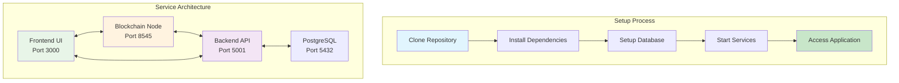

---

## Prerequisites

Before starting, ensure you have:
- **Node.js** (v18 or higher)
- **PostgreSQL** (v12 or higher)
- **Git** (for cloning the repository)

---

## Step 1: Clone and Setup

```bash
# Clone the repository
git clone <repository-url>
cd ContractManagement

# Install dependencies for all components
npm install
cd backend && npm install
cd ../frontend && npm install
cd ../blockchain && npm install
cd ..
```

### Dependency Installation Flow
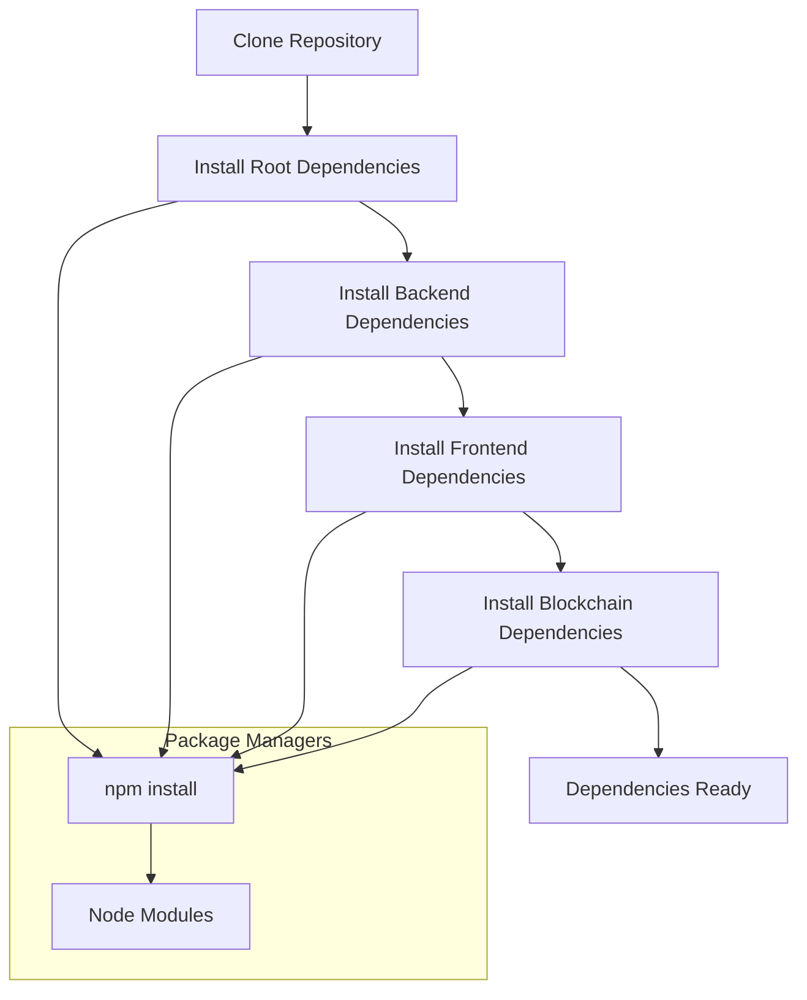

---

## Step 2: Database Setup

```bash
# Start PostgreSQL (if not already running)
# On macOS with Homebrew:
brew services start postgresql

# On Ubuntu/Debian:
sudo systemctl start postgresql

# Create database
createdb contract_management

# Run database setup
cd backend
npm run setup-db
```

### Database Setup Process
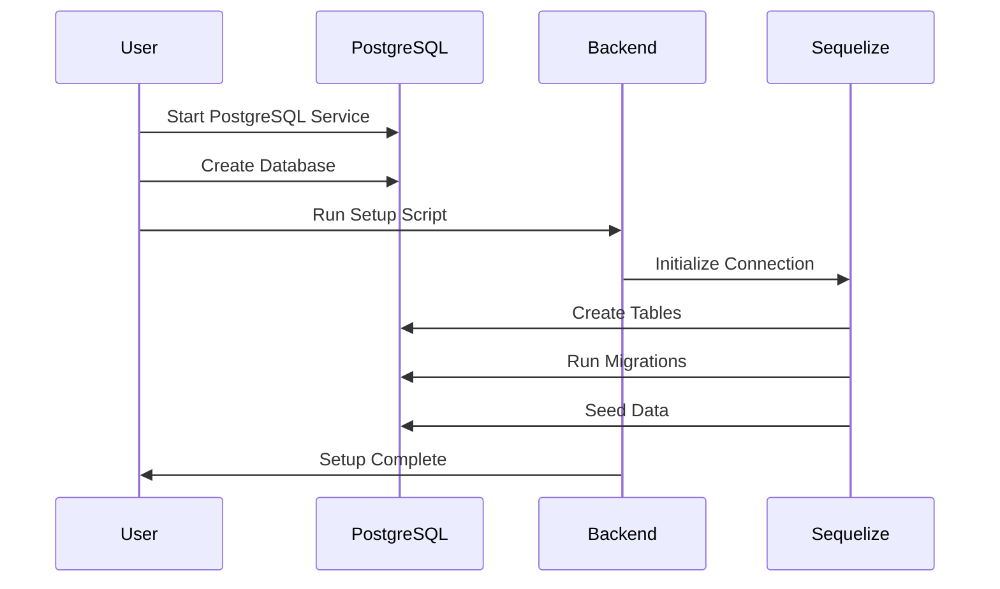

---

## Step 3: Start Services

Open **3 terminal windows** and run these commands:

### Terminal 1: Blockchain Node
```bash
cd blockchain
npx hardhat node
```
**Expected Output:**
```
Started HTTP and WebSocket JSON-RPC server at http://127.0.0.1:8545/
Accounts
========
Account #0: 0xf39Fd6e51aad88F6F4ce6aB8827279cffFb92266 (10000 ETH)
Private Key: 0xac0974bec39a17e36ba4a6b4d238ff944bacb478cbed5efcae784d7bf4f2ff80
...
```

### Terminal 2: Backend Server
```bash
cd backend
npm run dev
```
**Expected Output:**
```
Database connection established successfully.
Blockchain connection test successful. Current block: 0
Blockchain service initialized successfully
Server is running on port 5001
```

### Terminal 3: Frontend
```bash
cd frontend
npm start
```
**Expected Output:**
```
Compiled successfully!
You can now view contract-management-frontend in the browser.
Local: http://localhost:3000
```

### Service Startup Sequence
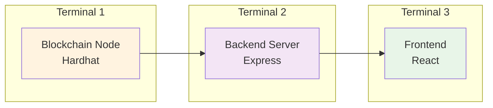

---

## Step 4: Access the Application

1. Open your browser and go to: **http://localhost:3000**
2. You should see the Contract Management dashboard

### Application Access Flow
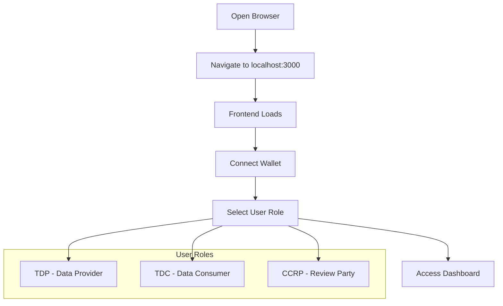

---

## Step 5: Create Test Data

The system comes with pre-configured test users and datasets:

### Test Users
- **TDP User**: `0xf39Fd6e51aad88F6F4ce6aB8827279cffFb92266`
- **TDC User**: `0x70997970C51812dc3A010C7d01b50e0d17dc79C8`
- **CCRP User**: `0x3C44CdDdB6a900fa2b585dd299e03d12FA4293BC`

### Test Datasets
- **Healthcare Dataset**: Medical records for research
- **Financial Dataset**: Transaction data for analysis
- **Environmental Dataset**: Climate data for studies
- **Social Media Dataset**: User behavior analytics
- **E-commerce Dataset**: Purchase patterns

### Test Data Structure
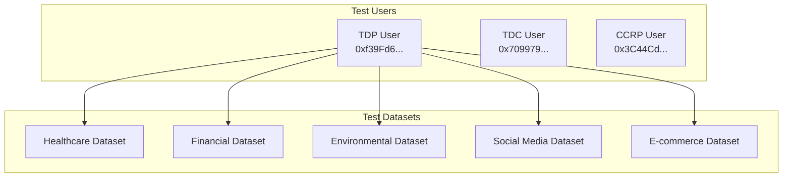

---

## Step 6: Create Your First Contract

### For TDC Users:

1. **Browse Datasets**
   - Go to "Datasets" page
   - Click on any available dataset
   - Review details and pricing

2. **Create Contract**
   - Click "Create Contract"
   - Fill in duration and terms
   - Select a CCRP user
   - Review and submit

3. **Sign Contract**
   - Go to "Contracts" page
   - Click on your contract
   - Click "Sign Contract"
   - Enter your private key when prompted

### For TDP Users:

1. **View Contracts**
   - Go to "Contracts" page
   - Find contracts where you're the TDP
   - Click to view details

2. **Sign Contract**
   - Click "Sign Contract" button
   - Enter your private key when prompted
   - Confirm the transaction

### For CCRP Users:

1. **Review Contracts**
   - Go to "Contracts" page
   - Find contracts assigned to you
   - Review terms and conditions

2. **Sign Contract**
   - Click "Sign Contract" button
   - Enter your private key when prompted
   - Contract becomes active

### Contract Creation Workflow
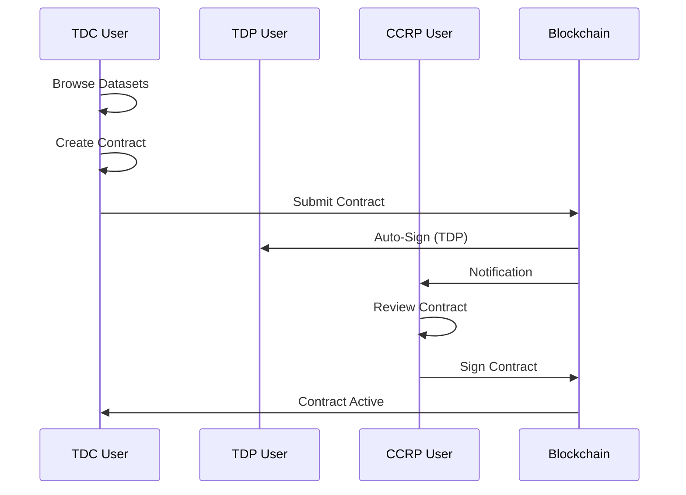

---

## 🔑 Private Keys for Testing

**⚠️ WARNING: These are test keys only! Never use in production!**

```
TDP Private Key: 0xac0974bec39a17e36ba4a6b4d238ff944bacb478cbed5efcae784d7bf4f2ff80
TDC Private Key: 0x59c6995e998f97a5a0044966f0945389dc9e86dae88c7a8412f4603b6b78690d
CCRP Private Key: 0x5de4111afa1a4b94908f83103eb1f1706367c2e68ca870fc3fb9a804cdab365a
```

### Key Management Flow
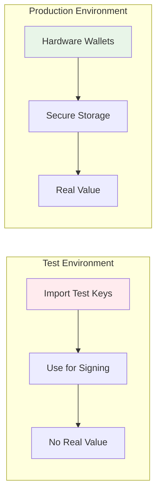

---

## 🛠️ Troubleshooting

### Common Issues:

#### 1. "Port already in use" Error
```bash
# Kill processes on specific ports
lsof -ti:8545 | xargs kill -9  # Blockchain
lsof -ti:5001 | xargs kill -9  # Backend
lsof -ti:3000 | xargs kill -9  # Frontend
```

#### 2. "Database connection failed"
```bash
# Check if PostgreSQL is running
brew services list | grep postgresql
# or
sudo systemctl status postgresql
```

#### 3. "Blockchain connection failed"
```bash
# Check if Hardhat node is running
curl -X POST http://localhost:8545 \
  -H "Content-Type: application/json" \
  -d '{"jsonrpc":"2.0","method":"eth_blockNumber","params":[],"id":1}'
```

#### 4. "Failed to create contract"
- Ensure all services are running
- Check browser console for errors
- Verify private key format (must start with 0x)

### Troubleshooting Flow
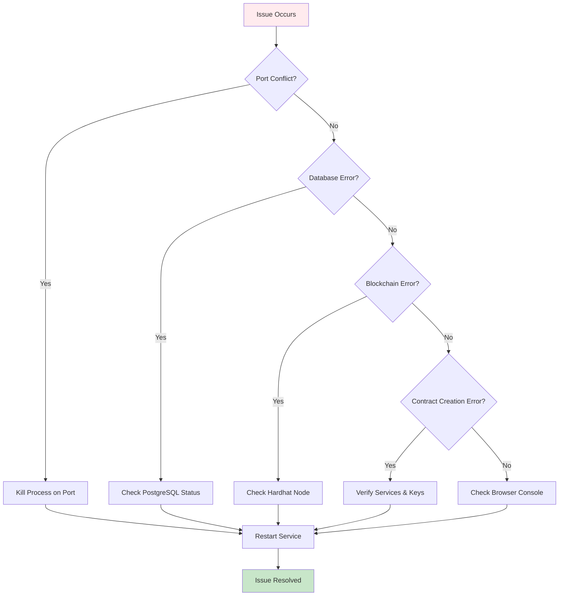

---

## 📱 Using the Application

### Navigation
- **Dashboard**: Overview of contracts and statistics
- **Contracts**: View and manage your contracts
- **Datasets**: Browse available datasets
- **Users**: View system users (admin only)
- **Notifications**: View system notifications

### Key Features
- **Secure Signing**: Private keys never leave your device
- **Real-time Updates**: Contract status updates automatically
- **Email Notifications**: Get notified of important events
- **Audit Trail**: Complete history of all actions

### Application Navigation Flow
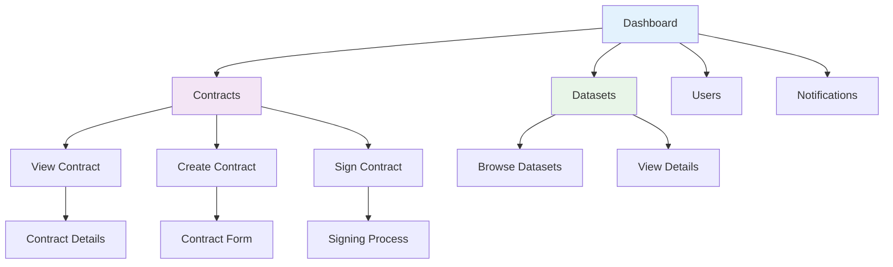

---

## 🔒 Security Best Practices

### For Testing:
1. Use the provided test private keys
2. Don't use real funds on test network
3. Keep test keys separate from production

### For Production:
1. **Never share private keys**
2. Use hardware wallets for large amounts
3. Verify all transaction details before signing
4. Use strong passwords and 2FA
5. Keep software updated

### Security Architecture
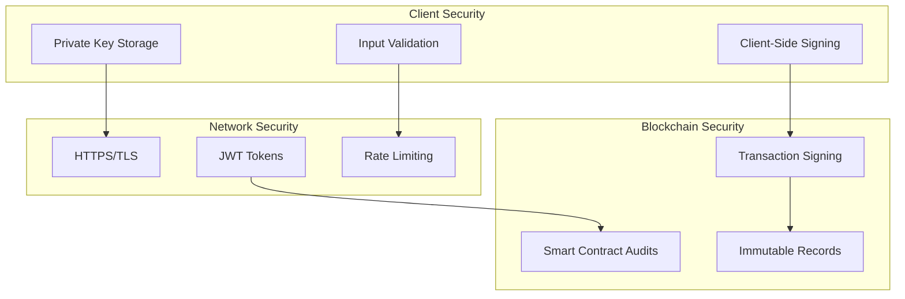

---

## 📞 Getting Help

### Documentation
- **Full Guide**: `SECURE_CONTRACT_MANAGEMENT_GUIDE.md`
- **API Docs**: Check backend routes for endpoints
- **Smart Contract**: See `blockchain/contracts/ContractManager.sol`

### Support
- Check the troubleshooting section
- Review error logs in terminal windows
- Verify all services are running correctly

---

## 🎉 You're Ready!

Your Contract Management System is now running! You can:
- ✅ Create and manage contracts
- ✅ Sign contracts securely
- ✅ Browse datasets
- ✅ Receive notifications
- ✅ Track contract status

**Next Steps:**
1. Explore the different user roles
2. Create test contracts
3. Try the signing workflow
4. Review the full documentation

Happy contracting! 🚀 