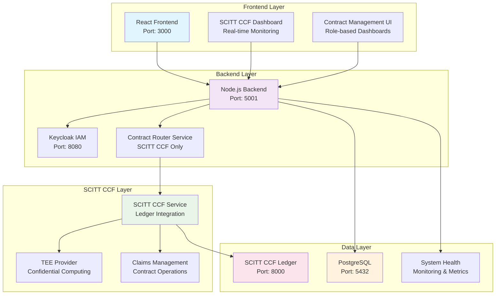

# 🚀 Contract Management System

A comprehensive contract management system with multi-party authentication, **SCITT CCF Ledger integration**, confidential computing capabilities, and **differential privacy implementation**.

## 🚀 Quick Start

### **Local Development**
```bash
# ✅ CURRENT - Start everything properly (SCITT CCF only)
./start-system.sh                    # Main system startup (replaces start-system-scitt-ccf.sh)

# ✅ CURRENT - Manage SCITT CCF services
./manage-scitt-ccf.sh start
./manage-scitt-ccf.sh status
./manage-scitt-ccf.sh test

# ✅ CURRENT - Check system health
npm run status

# ✅ CURRENT - Test authentication
npm run test:login
```

### **🔧 Configuration & Fixes**
```bash
# ✅ CURRENT - Unified authentication fix (NEW)
./scripts/fix-auth-unified.sh       # Fix authentication issues

# ✅ CURRENT - SSL configuration fix (NEW)
./scripts/fix-ssl-inconsistencies.sh # Fix SSL configuration issues

# ✅ CURRENT - Centralized configuration (NEW)
./scripts/config-loader.js           # Load configurations from config/system.env
```

### **Production Deployment**
```bash
# Ubuntu VM deployment (interactive)
./deployment/deploy-to-ubuntu-vm.sh

# Ubuntu VM deployment (quick)
./deployment/quick-deploy-ubuntu.sh yourdomain.com

# Local VM development environment
./deployment/deploy-to-local-vm.sh
```

## 🔐 LUKS Encryption for Large Files

The system implements **intelligent encryption** that automatically selects the optimal method based on file size:

- **Small Files (< 100MB)**: In-memory encryption for fast processing
- **Medium Files (100MB-1GB)**: Streaming encryption for memory efficiency  
- **Large Files (> 1GB)**: **LUKS encryption** with hardware acceleration

### **LUKS Benefits for Large Datasets**
- **Hardware Acceleration**: 10x+ performance using CPU AES-NI instructions
- **Memory Efficient**: 64KB blocks regardless of file size
- **Industry Standard**: Widely used, audited, and trusted
- **Training Integration**: Seamless decryption in TEE environments

### **Quick LUKS Setup**
```bash
# Test LUKS encryption capabilities
curl -X GET http://localhost:5001/api/enhanced-encryption/methods

# Encrypt large file (auto-selects LUKS for > 1GB)
curl -X POST http://localhost:5001/api/enhanced-encryption/encrypt-file \
  -H "Authorization: Bearer <token>" \
  -F "file=@large_dataset.zip" \
  -F "dataType=TRAINING_DATA"
```

## 🔗 SCITT CCF Integration

The system is built on **Microsoft's SCITT CCF Ledger** for high-performance, confidential computing contract management.

### **Key Features**
- **High Performance**: 10-100x throughput improvement over traditional blockchain systems
- **Confidential Computing**: Hardware-level TEE (Trusted Execution Environment) support
- **Standards Compliance**: IETF SCITT working group standards
- **Enterprise Ready**: Production-grade infrastructure and security
- **Zero Downtime**: Continuous service with automatic failover

### **Quick SCITT CCF Setup**

```bash
# Setup SCITT CCF integration
./manage-scitt-ccf.sh setup

# Start SCITT CCF services
./manage-scitt-ccf.sh start

# Test SCITT CCF integration
./manage-scitt-ccf.sh test

# Check SCITT CCF status
./manage-scitt-ccf.sh status
```

### **Migration Modes**

The system now operates in **SCITT CCF only** mode for simplified architecture:

- **`SCITT_CCF_ONLY`**: Use only SCITT CCF Ledger (Current)
- **Legacy Support**: Traditional blockchain support has been removed for cleaner SCITT CCF architecture

## ��️ Architecture



## 🧪 Testing

### **Frontend E2E (Playwright)**

From `frontend/`:

```bash
npm run test:e2e:install    # browsers (once)
npm run test:e2e:chromium   # fast single-browser run
```

The **backend must be up** (`http://localhost:5001/health` or `BACKEND_URL` in `config.env`). Global setup **fails fast** if the API is unreachable (no more silent runs against a dead server).

**Docs:** [frontend/tests/e2e/README.md](frontend/tests/e2e/README.md)

**Backend unit (TDC helpers):**

```bash
cd backend && npm run test:unit -- --testPathPattern=tdc-training-helpers
```

### **Updated Test Suites for SCITT CCF**

The backend test suites have been completely updated to include SCITT CCF integration:

```bash
# Run SCITT CCF integration tests
npm test -- --testPathPattern="scitt-ccf"

# Run all tests including SCITT CCF
npm test

# Run specific SCITT CCF tests
npm test -- scitt-ccf-integration.test.js
npm test -- scitt-ccf-api.test.js
```

**Test Coverage Includes:**
- **SCITT CCF Service Tests**: Service initialization, connection, contract creation
- **Contract Router Tests**: Simplified routing to SCITT CCF only
- **System Health Tests**: SCITT CCF health monitoring
- **API Endpoint Tests**: All SCITT CCF API endpoints

## 📚 Documentation

All documentation is organized under **[docs/README.md](docs/README.md)** (single index).

| Topic | Link |
|-------|------|
| Quick start | [docs/getting-started/QUICK_START.md](docs/getting-started/QUICK_START.md) |
| Developer guide | [docs/DEVELOPER_GUIDE.md](docs/DEVELOPER_GUIDE.md) |
| User / admin | [docs/USER_GUIDE.md](docs/USER_GUIDE.md) · [docs/ADMIN_GUIDE.md](docs/ADMIN_GUIDE.md) |
| Architecture | [docs/ARCHITECTURE.md](docs/ARCHITECTURE.md) |
| API | [docs/api/API_REFERENCE.md](docs/api/API_REFERENCE.md) |
| Contract signing | [docs/features/contract-signing/](docs/features/contract-signing/CONTRACT_SIGNING_INDEX.md) |
| SCITT CCF | [docs/features/scitt/](docs/features/scitt/SCITT_CCF_INTEGRATION_README.md) |
| Training | [docs/training/](docs/training/README.md) |
| Deploy (VM / OCI / K8s) | [docs/deployment/README.md](docs/deployment/README.md) |
| Production / OCI security | [docs/production/](docs/production/README.md) |
| Testing & E2E | [docs/testing/](docs/testing/TEST_DATA_FOR_TESTERS.md) · [frontend/tests/e2e/README.md](frontend/tests/e2e/README.md) |

Legacy paths at the repo root and under `docs/` redirect to the locations above.

## 🚀 Features

### **Core Contract Management**
- **Multi-Party Contracts**: TDP, TDC, CCRP workflow support
- **Ricardian Contracts**: Human-readable + machine-executable contracts
- **Contract Lifecycle**: Complete contract management from creation to completion
- **Role-Based Access**: Secure access control for all user types

### **SCITT CCF Integration**
- **High-Performance Ledger**: Microsoft's SCITT CCF implementation
- **Confidential Computing**: TEE support for secure data processing
- **Supply Chain Transparency**: Immutable audit trail for all operations
- **Enterprise Security**: Hardware-level security and attestation

### **Advanced Features**
- **TDC training jobs**: Start training from a **signed** contract (`/tdc/training`), simulated runs by default (`TRAINING_SIMULATION_MODE`), optional **register trained model** for inference (`POST /api/tdc/training/jobs/:jobId/register-model`). See **[docs/training/TDC_TRAINING_RUNTIME.md](docs/training/TDC_TRAINING_RUNTIME.md)**.
- **CCRP training console**: Deploy/monitor jobs via **`/api/ccrp/training/...`** and UI at **`/ccrp/training-environment`**.
- **Digital Contract Signing**: Secure digital signature generation and verification
- **Key Management**: Multi-algorithm key generation and management (ECDSA-P256, RSA-2048, RSA-4096)
- **SCITT CCF Integration**: Immutable signature storage and verification
- **Differential Privacy**: Privacy-preserving data analytics
- **Multi-Cloud Support**: AWS, Azure, GCP, OCI integration
- **Global Deployment**: Multi-jurisdiction deployment support
- **Real-Time Monitoring**: System health and performance monitoring

## 🚀 Deployment Options

### **Local Development Environment**
- **Quick Setup**: `./deployment/deploy-to-local-vm.sh` - Complete local environment
- **VirtualBox Guide**: `deployment/LOCAL_VM_QUICK_START.md` - 10-minute setup
- **Comprehensive Guide**: `deployment/LOCAL_VM_SETUP_GUIDE.md` - Detailed instructions

### **Production Ubuntu VM Deployment**
- **Interactive Setup**: `./deployment/deploy-to-ubuntu-vm.sh` - Step-by-step production deployment
- **Quick Deployment**: `./deployment/quick-deploy-ubuntu.sh` - One-command deployment
- **Manual Guide**: `deployment/UBUNTU_VM_DEPLOYMENT_GUIDE.md` - Complete production setup

### **Deployment Features**
- ✅ **HTTPS/SSL**: Let's Encrypt certificates with Nginx reverse proxy
- ✅ **Keycloak IAM**: Complete identity management with persistent configuration
- ✅ **SCITT CCF Integration**: High-performance ledger infrastructure for secure contracts
- ✅ **Firewall & Security**: UFW firewall with secure port configuration
- ✅ **Backup & Monitoring**: Automated backups and health checks
- ✅ **Local Development**: Full development environment in VM

## 🏗️ Technology Stack

### **Backend**
- **Runtime**: Node.js 18+ with Express.js
- **Database**: PostgreSQL 15+ with Sequelize ORM
- **Authentication**: Keycloak IAM integration
- **Ledger**: SCITT CCF Ledger (Microsoft)

### **Frontend**
- **Framework**: React.js 18+ with Material-UI
- **State Management**: React Context + Hooks
- **Routing**: React Router v6
- **HTTP Client**: Axios with interceptors

### **Infrastructure**
- **Containerization**: Docker + Docker Compose
- **Orchestration**: Kubernetes ready
- **Monitoring**: Built-in health monitoring
- **Security**: TEE integration, encryption, attestation

## 🔧 Development

### **Prerequisites**
- Node.js 18+ and npm
- PostgreSQL 15+
- Docker and Docker Compose
- SCITT CCF Ledger

### **Setup**
```bash
# Clone repository
git clone <repository-url>
cd ContractManagement

# Install dependencies
npm install

# ✅ CURRENT - Setup environment (NEW centralized config)
cp config/system.env.example config/system.env
# Edit config/system.env with your settings

# ✅ CURRENT - Start services
./start-system.sh                    # Main system startup

# ✅ CURRENT - Run tests
npm test
```

### **🔧 Configuration Management**
```bash
# ✅ CURRENT - Use centralized configuration
./scripts/config-loader.js           # Load from config/system.env

# ✅ CURRENT - Fix common issues
./scripts/fix-auth-unified.sh       # Authentication issues
./scripts/fix-ssl-inconsistencies.sh # SSL configuration issues

# ✅ CURRENT - Clean up outdated scripts
./scripts/cleanup-outdated-scripts.sh # Remove outdated files
```

## 📊 System Status

```bash
# Check system health
npm run status

# Check SCITT CCF status
./manage-scitt-ccf.sh status

# View logs
docker-compose logs -f
```

## 🤝 Contributing

1. Fork the repository
2. Create a feature branch (`git checkout -b feature/amazing-feature`)
3. Commit your changes (`git commit -m 'Add amazing feature'`)
4. Push to the branch (`git push origin feature/amazing-feature`)
5. Open a Pull Request

## 📄 License

This project is licensed under the MIT License - see the [LICENSE](LICENSE) file for details.

## 🆘 Support

- **Documentation**: Check the [docs folder](docs/README.md) for comprehensive guides
- **Issues**: Report bugs and feature requests via GitHub Issues
- **Discussions**: Join community discussions on GitHub Discussions

---

**Built with ❤️ using Microsoft's SCITT CCF Ledger technology** 