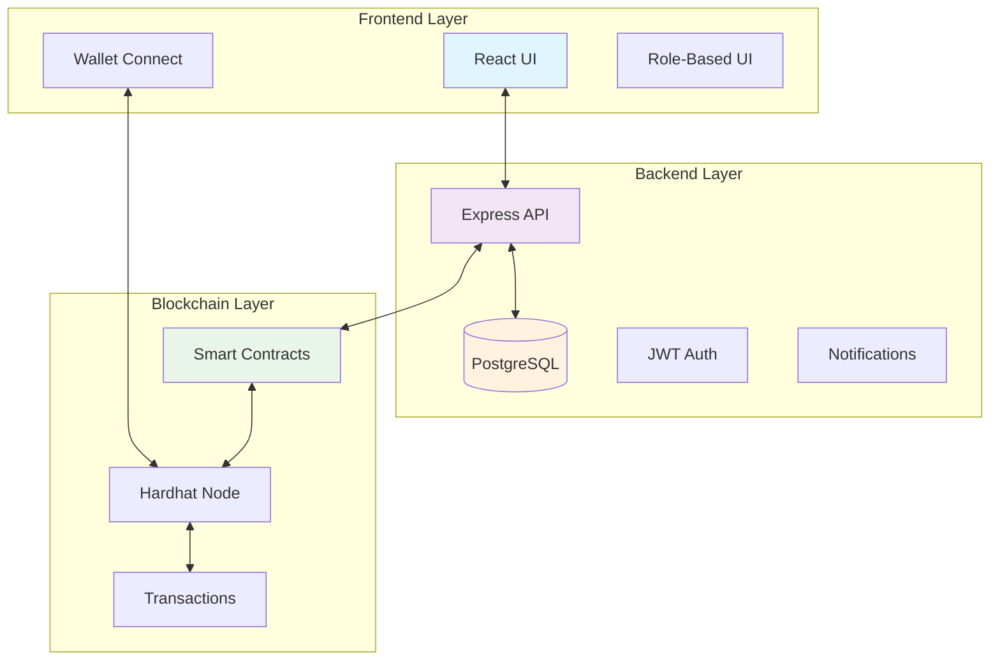
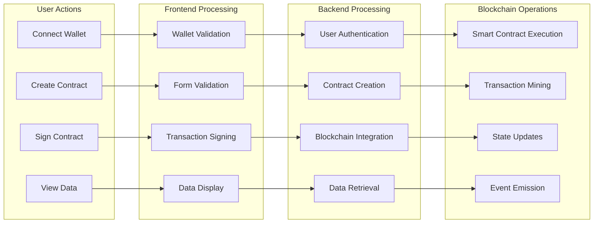
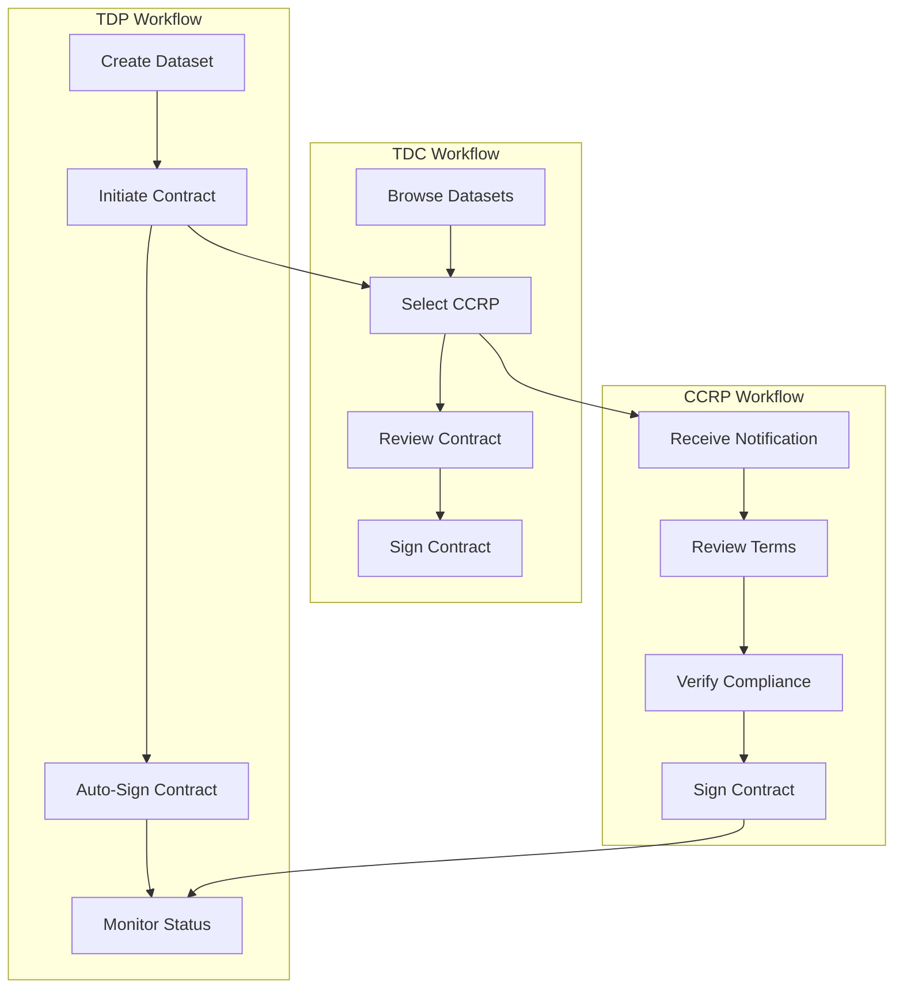
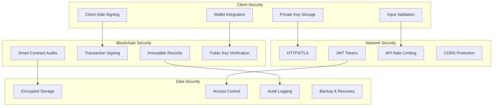

# Contract Management System

A comprehensive blockchain-based contract management system with role-based access control, secure wallet integration, and automated contract workflows.

## 🚀 Features

### Core Functionality
- **Multi-Role System**: TDP (Training Data Provider), TDC (Training Data Consumer), CCRP (Confidential Clean Room Provider)
- **Blockchain Integration**: Smart contracts for secure, immutable contract management
- **Wallet Integration**: MetaMask support for secure digital signatures
- **Role-Based UI**: Dynamic interfaces based on user roles
- **Automated Workflows**: Streamlined contract creation, signing, and management

### Security Features
- **Client-Side Signing**: Private keys never leave user devices
- **Public Key Validation**: Cryptographic verification of user identities
- **Secure Transactions**: Signed transactions for blockchain operations
- **Access Control**: Role-based permissions and authorization

### User Experience
- **Modern UI**: React-based interface with Material-UI components
- **Real-time Updates**: Live notifications and status updates
- **Wallet Switching**: Easy switching between different user roles
- **Comprehensive Documentation**: Detailed guides and tutorials

## 🏗️ Architecture

### System Architecture


### Data Flow Architecture


### User Role Workflow


### Security Architecture


## 🛠️ Technology Stack

### Frontend
- **React 18**: Modern UI framework
- **Material-UI**: Component library
- **Ethers.js**: Ethereum wallet integration
- **React Query**: Data fetching and caching
- **React Router**: Navigation

### Backend
- **Node.js**: Runtime environment
- **Express.js**: Web framework
- **Sequelize**: ORM for database
- **PostgreSQL**: Primary database
- **JWT**: Authentication

### Blockchain
- **Hardhat**: Development framework
- **Solidity**: Smart contract language
- **Ethers.js**: Blockchain interaction
- **OpenZeppelin**: Security libraries

## 📋 Prerequisites

- Node.js (v16 or higher)
- PostgreSQL (v12 or higher)
- MetaMask browser extension
- Git

## 🚀 Quick Start

### 1. Clone the Repository
```bash
git clone <repository-url>
cd ContractManagement
```

### 2. Install Dependencies
```bash
# Install root dependencies
npm install

# Install backend dependencies
cd backend
npm install

# Install frontend dependencies
cd ../frontend
npm install

# Install blockchain dependencies
cd ../blockchain
npm install
```

### 3. Database Setup
```bash
# Create PostgreSQL database
createdb contract_management

# Run database migrations
cd backend
npm run db:migrate

# Seed initial data
npm run db:seed
```

### 4. Environment Configuration
```bash
# Copy environment files
cp backend/config.env.example backend/config.env
cp blockchain/.env.example blockchain/.env

# Update configuration values
# See configuration section below
```

### 5. Start Services
```bash
# Terminal 1: Start blockchain node
cd blockchain
npx hardhat node

# Terminal 2: Start backend server
cd backend
npm start

# Terminal 3: Start frontend
cd frontend
npm start
```

### 6. Access the Application
- Frontend: http://localhost:3000
- Backend API: http://localhost:5001
- Blockchain: http://localhost:8545

## ⚙️ Configuration

### Backend Configuration (`backend/config.env`)
```env
DB_HOST=localhost
DB_PORT=5432
DB_NAME=contract_management
DB_USER=your_username
DB_PASSWORD=your_password
JWT_SECRET=your_jwt_secret
BLOCKCHAIN_URL=http://localhost:8545
CONTRACT_ADDRESS=your_deployed_contract_address
```

### Blockchain Configuration (`blockchain/.env`)
```env
PRIVATE_KEY=your_deployment_private_key
```

## 👥 User Roles

### TDP (Training Data Provider)
- Create and manage datasets
- Initiate contracts with TDC
- Auto-sign contracts at creation
- View contract status and history

### TDC (Training Data Consumer)
- Browse available datasets
- Select CCRP for contract review
- Sign contracts after TDP approval
- Access purchased data

### CCRP (Confidential Clean Room Provider)
- Review contract terms and conditions
- Sign contracts after thorough review
- Provide compliance verification
- Maintain audit trail

## 🔐 Security Features

### Wallet Integration
- **MetaMask Support**: Seamless wallet connection
- **Client-Side Signing**: Private keys never transmitted
- **Public Key Validation**: Cryptographic identity verification
- **Transaction Signing**: Secure blockchain operations

### Access Control
- **Role-Based Permissions**: Granular access control
- **Session Management**: Secure user sessions
- **API Protection**: JWT-based authentication
- **Input Validation**: Comprehensive data validation

## 📚 Documentation

- [MetaMask Setup Guide](METAMASK_SETUP_GUIDE.md)
- [Web3 Integration Guide](METAMASK_WEB3_GUIDE.md)
- [Role-Based UI Guide](ROLE_BASED_UI_GUIDE.md)
- [Secure Contract Management](SECURE_CONTRACT_MANAGEMENT_GUIDE.md)
- [Quick Start Guide](QUICK_START_GUIDE.md)
- [Test Wallets](TEST_WALLETS.md)
- [Hardhat Wallets](HARDHAT_WALLETS.md)

## 🧪 Testing

### Run Tests
```bash
# Backend tests
cd backend
npm test

# Blockchain tests
cd blockchain
npx hardhat test
```

### Test Coverage
```bash
# Backend coverage
cd backend
npm run test:coverage
```

## 🚀 Deployment

### Production Setup
1. Configure production environment variables
2. Set up production database
3. Deploy smart contracts to target network
4. Configure reverse proxy (nginx)
5. Set up SSL certificates
6. Configure monitoring and logging

### Docker Deployment
```bash
# Build and run with Docker Compose
docker-compose up -d
```

## 🤝 Contributing

1. Fork the repository
2. Create a feature branch
3. Make your changes
4. Add tests for new functionality
5. Submit a pull request

## 📄 License

This project is licensed under the MIT License - see the [LICENSE](LICENSE) file for details.

## 🆘 Support

For support and questions:
- Check the documentation in the `/docs` folder
- Review the troubleshooting guides
- Open an issue on GitHub

## 🔄 Version History

- **v1.0.0**: Initial release with core functionality
- **v1.1.0**: Added wallet integration and security features
- **v1.2.0**: Enhanced role-based UI and workflows
- **v1.3.0**: Comprehensive documentation and guides

---

**Note**: This is a development system. For production use, ensure proper security audits, testing, and compliance with relevant regulations. 