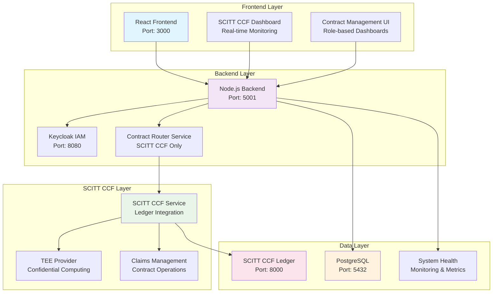

# 🚀 Contract Management System

A comprehensive contract management system with multi-party authentication, **SCITT CCF Ledger integration**, confidential computing capabilities, and **differential privacy implementation**.

## 🚀 Quick Start

### **Local Development**
```bash
# ✅ CURRENT - Start everything properly (SCITT CCF only)
./start-system.sh                    # Main system startup (replaces start-system-scitt-ccf.sh)

# ✅ CURRENT - Manage SCITT CCF services
./manage-scitt-ccf.sh start
./manage-scitt-ccf.sh status
./manage-scitt-ccf.sh test

# ✅ CURRENT - Check system health
npm run status

# ✅ CURRENT - Test authentication
npm run test:login
```

### **🔧 Configuration & Fixes**
```bash
# ✅ CURRENT - Unified authentication fix (NEW)
./scripts/fix-auth-unified.sh       # Fix authentication issues

# ✅ CURRENT - SSL configuration fix (NEW)
./scripts/fix-ssl-inconsistencies.sh # Fix SSL configuration issues

# ✅ CURRENT - Centralized configuration (NEW)
./scripts/config-loader.js           # Load configurations from config/system.env
```

### **Production Deployment**
```bash
# Ubuntu VM deployment (interactive)
./deployment/deploy-to-ubuntu-vm.sh

# Ubuntu VM deployment (quick)
./deployment/quick-deploy-ubuntu.sh yourdomain.com

# Local VM development environment
./deployment/deploy-to-local-vm.sh
```

## 🔗 SCITT CCF Integration

The system is built on **Microsoft's SCITT CCF Ledger** for high-performance, confidential computing contract management.

### **Key Features**
- **High Performance**: 10-100x throughput improvement over traditional blockchain systems
- **Confidential Computing**: Hardware-level TEE (Trusted Execution Environment) support
- **Standards Compliance**: IETF SCITT working group standards
- **Enterprise Ready**: Production-grade infrastructure and security
- **Zero Downtime**: Continuous service with automatic failover

### **Quick SCITT CCF Setup**

```bash
# Setup SCITT CCF integration
./manage-scitt-ccf.sh setup

# Start SCITT CCF services
./manage-scitt-ccf.sh start

# Test SCITT CCF integration
./manage-scitt-ccf.sh test

# Check SCITT CCF status
./manage-scitt-ccf.sh status
```

### **Migration Modes**

The system now operates in **SCITT CCF only** mode for simplified architecture:

- **`SCITT_CCF_ONLY`**: Use only SCITT CCF Ledger (Current)
- **Legacy Support**: Traditional blockchain support has been removed for cleaner SCITT CCF architecture

## ��️ Architecture



## 🧪 Testing

### **Updated Test Suites for SCITT CCF**

The backend test suites have been completely updated to include SCITT CCF integration:

```bash
# Run SCITT CCF integration tests
npm test -- --testPathPattern="scitt-ccf"

# Run all tests including SCITT CCF
npm test

# Run specific SCITT CCF tests
npm test -- scitt-ccf-integration.test.js
npm test -- scitt-ccf-api.test.js
```

**Test Coverage Includes:**
- **SCITT CCF Service Tests**: Service initialization, connection, contract creation
- **Contract Router Tests**: Simplified routing to SCITT CCF only
- **System Health Tests**: SCITT CCF health monitoring
- **API Endpoint Tests**: All SCITT CCF API endpoints

## 📚 Documentation

### **Core Documentation**
- **[Quick Start Guide](docs/QUICK_START.md)** - Get up and running quickly
- **[Developer Guide](docs/DEVELOPER_GUIDE.md)** - Development setup and guidelines
- **[API Reference](docs/API_REFERENCE.md)** - Complete API documentation
- **[Architecture Guide](docs/ARCHITECTURE.md)** - System architecture overview

### **SCITT CCF Documentation**
- **[SCITT CCF Integration Guide](SCITT_CCF_INTEGRATION_README.md)** - Complete integration guide
- **[SCITT CCF Migration Design](SCITT_CCF_MIGRATION_DESIGN.md)** - Technical design document
- **[SCITT CCF Management Script](manage-scitt-ccf.sh)** - Service management script

### **Contract Signing Documentation**
- **[Contract Signing Strategy](docs/CONTRACT_SIGNING_STRATEGY.md)** - Complete contract signing strategy and implementation plan
- **[Contract Signing Architecture](docs/contract-signing-architecture.md)** - Technical architecture for contract signing
- **[Contract Signing SCITT Integration](docs/CONTRACT_SIGNING_SCITT_INTEGRATION.md)** - SCITT CCF integration for signatures
- **[Contract Signing User Guide](docs/CONTRACT_SIGNING_USER_GUIDE.md)** - User guide for contract signing features

### **User Guides**
- **[Test Data Reference](TEST_DATA_FOR_TESTERS.md)** - Complete test data guide
- **[Setup Troubleshooting](SETUP_TROUBLESHOOTING_GUIDE.md)** - Common issues and solutions

## 🚀 Features

### **Core Contract Management**
- **Multi-Party Contracts**: TDP, TDC, CCRP workflow support
- **Ricardian Contracts**: Human-readable + machine-executable contracts
- **Contract Lifecycle**: Complete contract management from creation to completion
- **Role-Based Access**: Secure access control for all user types

### **SCITT CCF Integration**
- **High-Performance Ledger**: Microsoft's SCITT CCF implementation
- **Confidential Computing**: TEE support for secure data processing
- **Supply Chain Transparency**: Immutable audit trail for all operations
- **Enterprise Security**: Hardware-level security and attestation

### **Advanced Features**
- **Digital Contract Signing**: Secure digital signature generation and verification
- **Key Management**: Multi-algorithm key generation and management (ECDSA-P256, RSA-2048, RSA-4096)
- **SCITT CCF Integration**: Immutable signature storage and verification
- **Differential Privacy**: Privacy-preserving data analytics
- **Multi-Cloud Support**: AWS, Azure, GCP, OCI integration
- **Global Deployment**: Multi-jurisdiction deployment support
- **Real-Time Monitoring**: System health and performance monitoring

## 🚀 Deployment Options

### **Local Development Environment**
- **Quick Setup**: `./deployment/deploy-to-local-vm.sh` - Complete local environment
- **VirtualBox Guide**: `deployment/LOCAL_VM_QUICK_START.md` - 10-minute setup
- **Comprehensive Guide**: `deployment/LOCAL_VM_SETUP_GUIDE.md` - Detailed instructions

### **Production Ubuntu VM Deployment**
- **Interactive Setup**: `./deployment/deploy-to-ubuntu-vm.sh` - Step-by-step production deployment
- **Quick Deployment**: `./deployment/quick-deploy-ubuntu.sh` - One-command deployment
- **Manual Guide**: `deployment/UBUNTU_VM_DEPLOYMENT_GUIDE.md` - Complete production setup

### **Deployment Features**
- ✅ **HTTPS/SSL**: Let's Encrypt certificates with Nginx reverse proxy
- ✅ **Keycloak IAM**: Complete identity management with persistent configuration
- ✅ **SCITT CCF Integration**: High-performance ledger infrastructure for secure contracts
- ✅ **Firewall & Security**: UFW firewall with secure port configuration
- ✅ **Backup & Monitoring**: Automated backups and health checks
- ✅ **Local Development**: Full development environment in VM

## 🏗️ Technology Stack

### **Backend**
- **Runtime**: Node.js 18+ with Express.js
- **Database**: PostgreSQL 15+ with Sequelize ORM
- **Authentication**: Keycloak IAM integration
- **Ledger**: SCITT CCF Ledger (Microsoft)

### **Frontend**
- **Framework**: React.js 18+ with Material-UI
- **State Management**: React Context + Hooks
- **Routing**: React Router v6
- **HTTP Client**: Axios with interceptors

### **Infrastructure**
- **Containerization**: Docker + Docker Compose
- **Orchestration**: Kubernetes ready
- **Monitoring**: Built-in health monitoring
- **Security**: TEE integration, encryption, attestation

## 🔧 Development

### **Prerequisites**
- Node.js 18+ and npm
- PostgreSQL 15+
- Docker and Docker Compose
- SCITT CCF Ledger

### **Setup**
```bash
# Clone repository
git clone <repository-url>
cd ContractManagement

# Install dependencies
npm install

# ✅ CURRENT - Setup environment (NEW centralized config)
cp config/system.env.example config/system.env
# Edit config/system.env with your settings

# ✅ CURRENT - Start services
./start-system.sh                    # Main system startup

# ✅ CURRENT - Run tests
npm test
```

### **🔧 Configuration Management**
```bash
# ✅ CURRENT - Use centralized configuration
./scripts/config-loader.js           # Load from config/system.env

# ✅ CURRENT - Fix common issues
./scripts/fix-auth-unified.sh       # Authentication issues
./scripts/fix-ssl-inconsistencies.sh # SSL configuration issues

# ✅ CURRENT - Clean up outdated scripts
./scripts/cleanup-outdated-scripts.sh # Remove outdated files
```

## 📊 System Status

```bash
# Check system health
npm run status

# Check SCITT CCF status
./manage-scitt-ccf.sh status

# View logs
docker-compose logs -f
```

## 🤝 Contributing

1. Fork the repository
2. Create a feature branch (`git checkout -b feature/amazing-feature`)
3. Commit your changes (`git commit -m 'Add amazing feature'`)
4. Push to the branch (`git push origin feature/amazing-feature`)
5. Open a Pull Request

## 📄 License

This project is licensed under the MIT License - see the [LICENSE](LICENSE) file for details.

## 📚 Documentation

Comprehensive documentation is organized in the `docs/` directory:

### 🏗️ Architecture & Design
- **[AI/ML Training Solution Roadmap](docs/architecture/AI_ML_TRAINING_COMPLETE_SOLUTION_ROADMAP.md)** - Complete solution analysis and roadmap
- **[Data Model Reference](docs/architecture/DATA_MODEL_REFERENCE.md)** - Database schema and data models
- **[Decentralized KMS Architecture](docs/architecture/DECENTRALIZED_KMS_ARCHITECTURE.md)** - Key management system design
- **[Multi-Tenant KMS Architecture](docs/architecture/MULTI_TENANT_KMS_ARCHITECTURE.md)** - Multi-tenant key management
- **[Current vs Outdated Scripts](docs/architecture/CURRENT_VS_OUTDATED_SCRIPTS.md)** - Script analysis and recommendations
- **[Centralized Configuration Architecture](docs/architecture/CENTRALIZED_CONFIGURATION_ARCHITECTURE.md)** - Configuration management design

### 🔌 API & Integration
- **[Complete API Specifications](docs/api/COMPLETE_API_SPECIFICATIONS.md)** - Comprehensive API documentation
- **[API Endpoint Reference](docs/api/API_ENDPOINT_REFERENCE.md)** - Complete API endpoint reference
- **[Cloud API Specifications](docs/api/CLOUD_API_SPECIFICATIONS.md)** - Cloud provider API specifications
- **[SCITT CCF API Specifications](docs/api/SCITT_CCF_API_SPECIFICATIONS.md)** - SCITT CCF integration APIs

### 🔄 Data Flows & Processes
- **[TDP Encrypted Dataset TEE Flow](docs/flows/TDP_ENCRYPTED_DATASET_TEE_FLOW.md)** - TDP dataset upload and TEE decryption
- **[TDC Encrypted AI Model TEE Flow](docs/flows/TDC_ENCRYPTED_AI_MODEL_TEE_FLOW.md)** - TDC AI model upload and TEE decryption
- **[CCRP Environment Offerings Flow](docs/flows/CCRP_ENVIRONMENT_OFFERINGS_CONFIGURATION_FLOW.md)** - CCRP environment setup and configuration

### 🛠️ Implementation Details
- **[Backend Services Documentation](docs/implementation/BACKEND_SERVICES_DOCUMENTATION.md)** - Complete backend services documentation
- **[Frontend Components Documentation](docs/implementation/FRONTEND_COMPONENTS_DOCUMENTATION.md)** - Frontend components and architecture
- **[Contract Management System PRD](docs/implementation/CONTRACT_MANAGEMENT_SYSTEM_PRD.md)** - Product requirements document
- **[Current System Status](docs/implementation/CURRENT_SYSTEM_STATUS.md)** - Current system status and capabilities

### 📖 Guides & Tutorials
- **[Developer Guide](docs/guides/DEVELOPER_GUIDE.md)** - Complete developer setup and workflow guide
- **[Contract Template Guide](docs/guides/CONTRACT_TEMPLATE_GUIDE.md)** - Contract template creation and management
- **[DEPA Integration Guide](docs/guides/DEPA_INTEGRATION_GUIDE.md)** - DEPA integration procedures
- **[Setup Troubleshooting Guide](docs/guides/SETUP_TROUBLESHOOTING_GUIDE.md)** - Common setup issues and solutions
- **[Training Course](docs/guides/TRAINING_COURSE.md)** - Training materials and courses

### 🧪 Testing & Quality Assurance
- **[Integration Testing Guide](docs/testing/INTEGRATION_TESTING_GUIDE.md)** - Comprehensive testing procedures
- **[Test Data for Testers](docs/testing/TEST_DATA_FOR_TESTERS.md)** - Test data and user accounts
- **[Tester Guide for Confidential Computing](docs/testing/TESTER_GUIDE_CONFIDENTIAL_COMPUTING.md)** - Confidential computing testing guide

### 🔒 Security & Compliance
- **[Security Integration Guide](docs/security/SECURITY_INTEGRATION_GUIDE.md)** - Security implementation and best practices
- **[Identity and Access Management](docs/security/IDENTITY_AND_ACCESS_MANAGEMENT_DOCUMENTATION.md)** - IAM documentation
- **[IAM Integration Design](docs/IAM_INTEGRATION_DESIGN.md)** - Complete Keycloak IAM integration design with contract signing
- **[Key Management Design](docs/KEY_MANAGEMENT_DESIGN.md)** - Digital signing key management system design
- **[DPDP Compliance Implementation](docs/compliance/DPDP_COMPLIANCE_IMPLEMENTATION.md)** - DPDP 2023 compliance implementation

### 📋 Quick Reference
- **[Documentation Index](docs/README.md)** - Complete documentation index
- **[Developer Guide](docs/DEVELOPER_GUIDE.md)** - Development setup and guidelines
- **[Setup Guide](docs/SETUP.md)** - Detailed setup instructions
- **[Testing Guide](docs/TESTING.md)** - Testing procedures and guidelines
- **[Troubleshooting](docs/TROUBLESHOOTING.md)** - Common issues and solutions

## 🆘 Support

- **Documentation**: Check the [docs folder](docs/README.md) for comprehensive guides
- **Issues**: Report bugs and feature requests via GitHub Issues
- **Discussions**: Join community discussions on GitHub Discussions

---

**Built with ❤️ using Microsoft's SCITT CCF Ledger technology** 