# 🚀 Confidential AI Network

A comprehensive contract management system with multi-party authentication, **SCITT CCF Ledger integration**, confidential computing capabilities, and **differential privacy implementation**.

## 🏗️ Architecture

### Application Architecture

**Overview** — four layers, left to right:

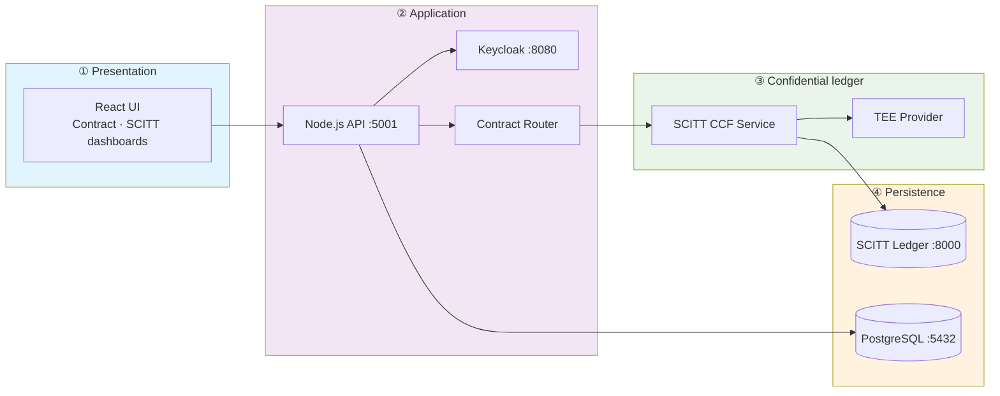

**Request flow** — how a contract operation travels through the stack:

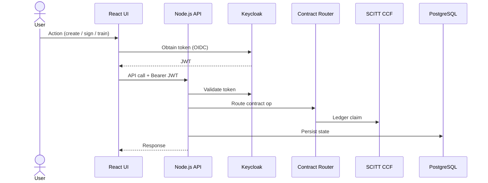

### OCI Deployment Architecture

For production on **Oracle Cloud Infrastructure (OCI)**, the system deploys across compartment-isolated environments (dev, test, staging, prod) with defense-in-depth edge security:

- **Edge**: WAF → API Gateway / Cloud Gate → Flexible Load Balancer
- **Compute**: OKE (Kubernetes) with private worker nodes and ingress
- **Data**: Autonomous Database (private endpoint), OCI Vault, Object Storage
- **Shared services**: OCIR, Cloud Guard, Bastion, centralized logging

**Overview** — major blocks:

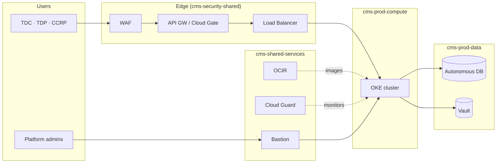

**Traffic routing** — hostname-based split at the WAF:

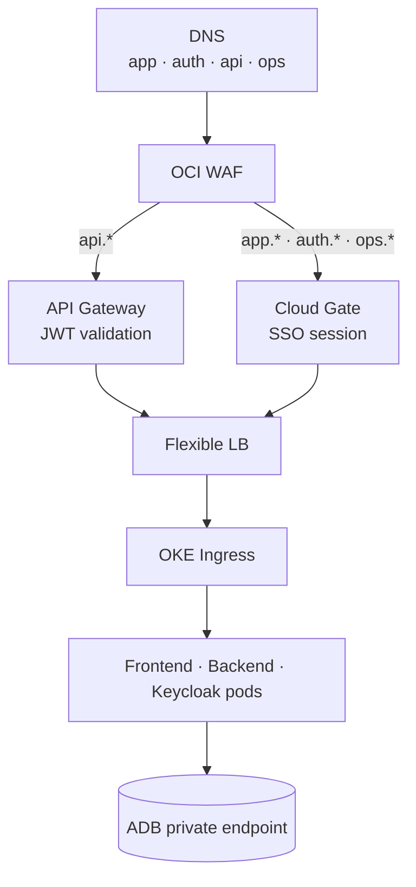

**Traffic path (production):** DNS → WAF → API Gateway (`api.{env}`) or Cloud Gate (`app.{env}`, `auth.{env}`) → Load Balancer → OKE ingress → application pods. Database access uses Autonomous DB private endpoints only.

#### Compartments

Three-level compartment tree under a dedicated tenancy — one subtree per environment, never mixed in a single compartment.

**Level 1** — tenancy root and shared compartments:

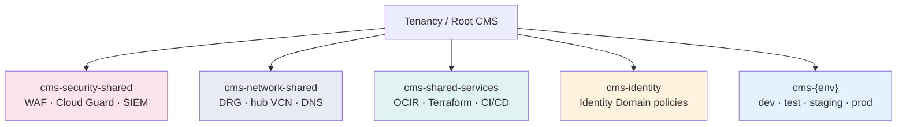

**Level 2** — repeated pattern inside each environment (`cms-dev`, `cms-test`, …):

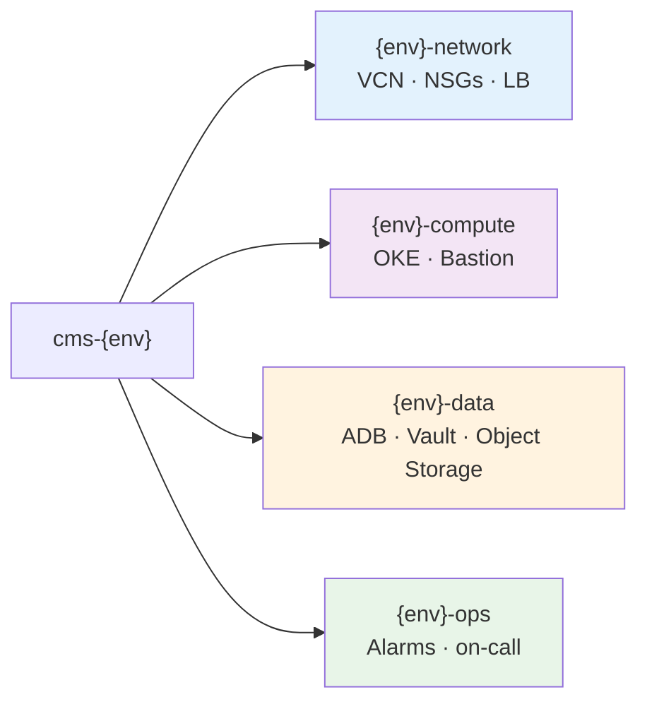

| Compartment | Resources |
|-------------|-----------|
| `cms-{env}-network` | VCN, subnets, NSGs, load balancer, service gateway |
| `cms-{env}-compute` | OKE cluster, node pools, Bastion |
| `cms-{env}-data` | Autonomous DB, Object Storage, Vault (Security Zone enforced in staging/prod) |
| `cms-{env}-ops` | Alarms, notifications, on-call integrations |

#### Identity Domains

Separate Identity Domain per environment (`cms-dev-id`, `cms-test-id`, `cms-staging-id`, `cms-prod-id`). Keycloak remains the application authorization source; Identity Domain provides enterprise SSO and MFA.

**Enterprise SSO** — workforce login to browser apps:

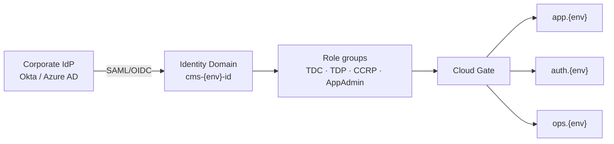

**Application tokens** — API access after SSO:

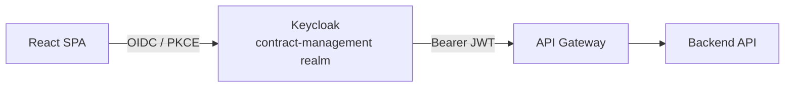

| Environment | Identity Domain | Purpose |
|-------------|-----------------|---------|
| dev | `cms-dev-id` | Developer SSO, Keycloak sync testing |
| test | `cms-test-id` | QA automation, Playwright service accounts |
| staging | `cms-staging-id` | Pre-prod UAT, partner demos |
| prod | `cms-prod-id` | Production TDC / TDP / CCRP / AppAdmin users |

#### Network

One isolated VCN per environment with non-overlapping CIDRs. Private worker nodes; no compute in public subnets.

**Subnet tiers** — top to bottom inside each VCN:

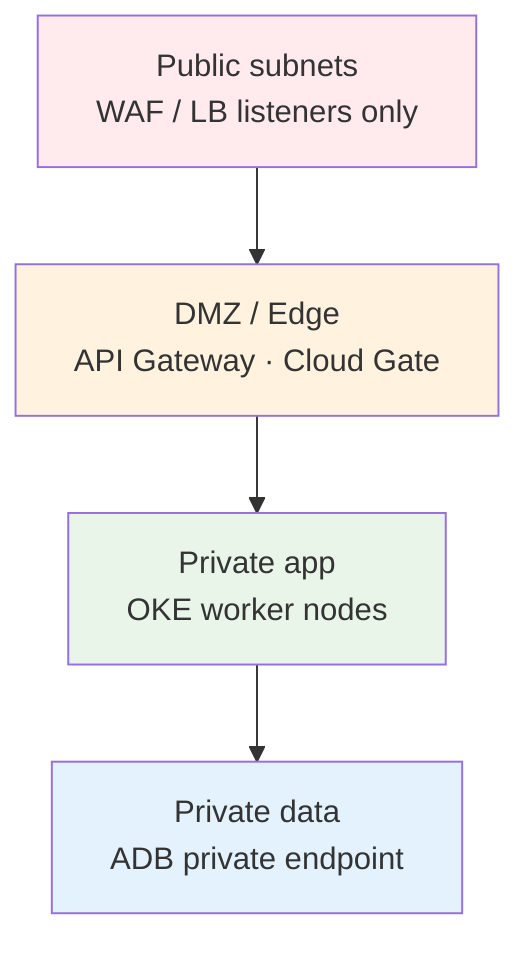

**Egress paths** — how private subnets reach the outside world:

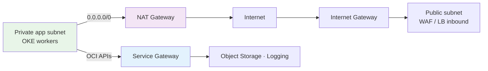

| Environment | VCN CIDR | OKE pod CIDR | Service CIDR |
|-------------|----------|--------------|--------------|
| dev | `10.10.0.0/16` | `10.244.0.0/16` | `10.96.0.0/16` |
| test | `10.20.0.0/16` | `10.245.0.0/16` | `10.97.0.0/16` |
| staging | `10.30.0.0/16` | `10.246.0.0/16` | `10.98.0.0/16` |
| prod | `10.40.0.0/16` | `10.247.0.0/16` | `10.99.0.0/16` |

NSGs (`nsg-lb-ingress`, `nsg-oke-workers`, `nsg-adb`) use default-deny with explicit allow rules. Admin access via OCI Bastion only — no SSH from the internet.

#### Security Zones

Security Zones apply to `cms-prod-data` and `cms-staging-data` compartments to enforce guardrails at the infrastructure layer.

**Infrastructure guardrails** (Security Zone on data compartment):

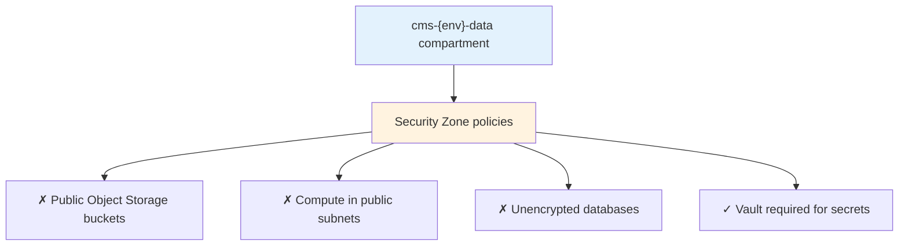

**Threat detection** (Cloud Guard, all environments):

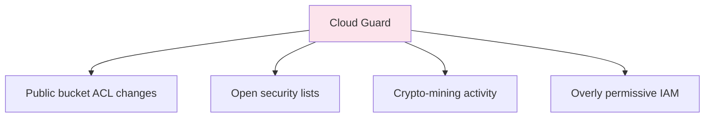

| Environment | Security Zone | WAF mode | MFA |
|-------------|---------------|----------|-----|
| dev | Optional | Log only | Off |
| test | Optional | Block | Optional |
| staging | **Required** on data compartment | Block | Admins |
| prod | **Required** on data compartment | Block + bot mgmt | All users |

| Topic | Documentation |
|-------|---------------|
| OCI security architecture & setup runbook | [docs/production/OCI_SECURITY_ARCHITECTURE.md](docs/production/OCI_SECURITY_ARCHITECTURE.md) |
| IAM, Cloud Gate, API Gateway, WAF | [docs/deployment/OCI_IAM_AND_EDGE_CONFIG.md](docs/deployment/OCI_IAM_AND_EDGE_CONFIG.md) |
| Terraform (OKE, ADB, LB, OCIR) | [deployment/oci/terraform/README.md](deployment/oci/terraform/README.md) |
| OCI readiness & rollout phases | [docs/deployment/OCI_READINESS.md](docs/deployment/OCI_READINESS.md) |

### Azure Deployment Architecture

For production on **Microsoft Azure**, the system deploys across resource-group-isolated environments (dev, test, staging, prod) with defense-in-depth edge security:

- **Edge**: Azure Front Door WAF → API Management → Application Gateway
- **Compute**: AKS (Kubernetes) with private worker nodes and ingress
- **Data**: PostgreSQL Flexible Server (private endpoint), Key Vault, Blob Storage
- **Shared services**: ACR, Defender for Cloud, Bastion, Log Analytics

**Overview** — major blocks:

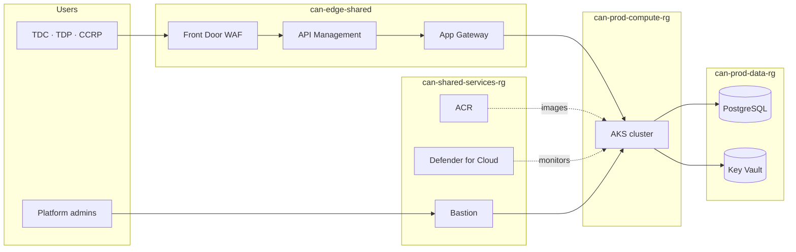

**Traffic routing** — hostname-based split at Front Door:

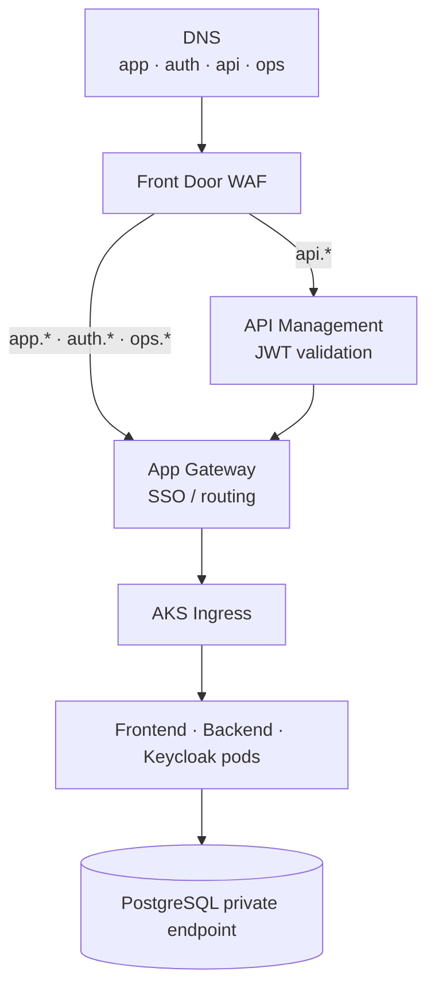

**Traffic path (production):** DNS → Front Door WAF → APIM (`api.{env}`) or App Gateway (`app.{env}`, `auth.{env}`) → AKS ingress → application pods. Database access uses PostgreSQL private endpoints only.

#### Resource groups

**Level 1** — management groups and shared services:

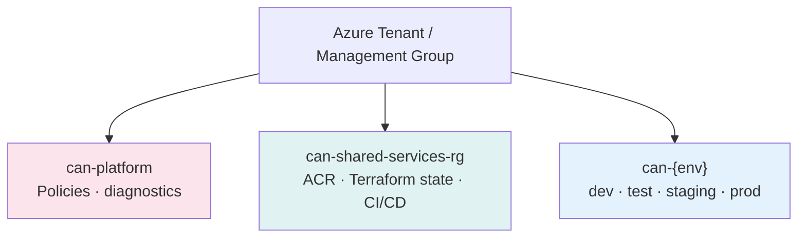

**Level 2** — repeated pattern per environment:

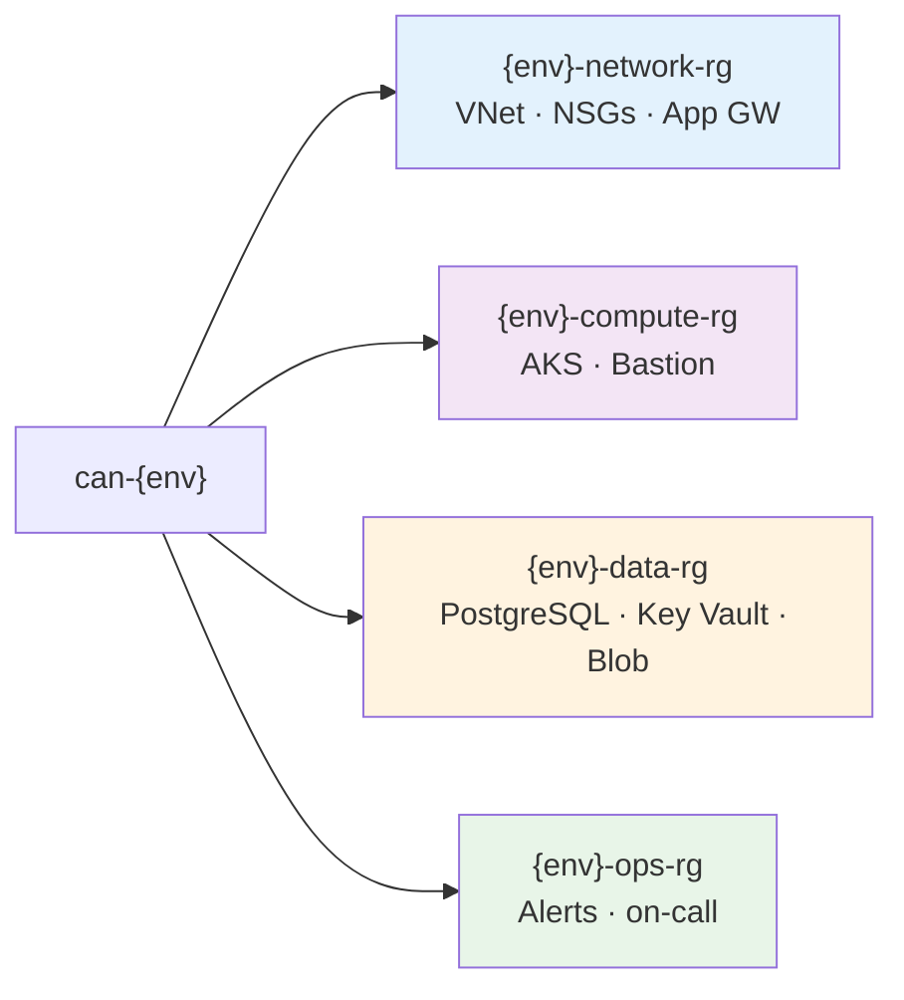

#### Identity (Entra ID)

**Enterprise SSO** — workforce login to browser apps:

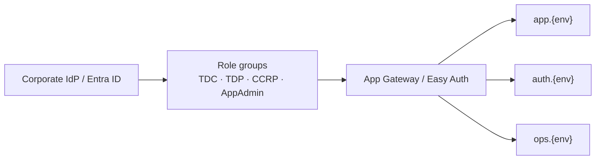

**Application tokens** — API access after SSO:

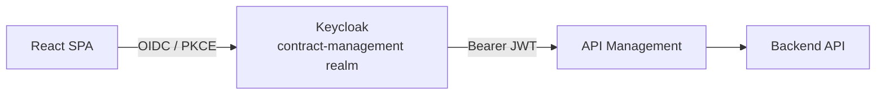

#### Network

**Subnet tiers** — top to bottom inside each VNet:

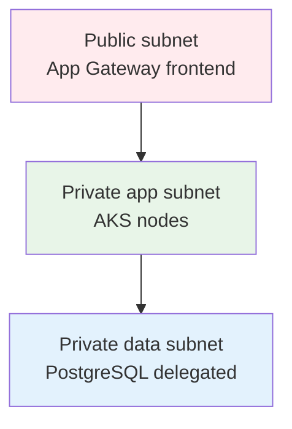

| Environment | VNet CIDR | AKS service CIDR |
|-------------|-----------|------------------|
| dev | `10.10.0.0/16` | `10.96.0.0/16` |
| test | `10.20.0.0/16` | `10.97.0.0/16` |
| staging | `10.30.0.0/16` | `10.98.0.0/16` |
| prod | `10.40.0.0/16` | `10.99.0.0/16` |

#### Azure Policy (data guardrails)

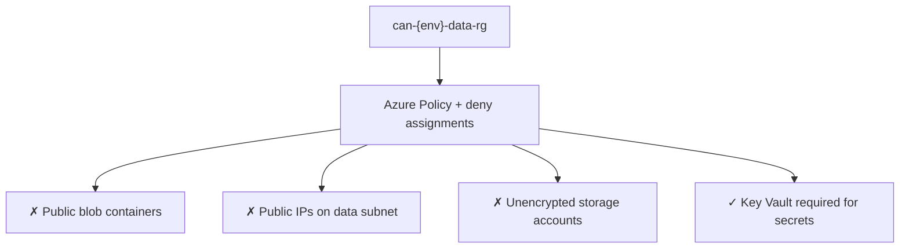

| Topic | Documentation |
|-------|---------------|
| Azure security architecture & setup runbook | [docs/production/AZURE_SECURITY_ARCHITECTURE.md](docs/production/AZURE_SECURITY_ARCHITECTURE.md) |
| Entra ID, Front Door, APIM, WAF | [docs/deployment/AZURE_IAM_AND_EDGE_CONFIG.md](docs/deployment/AZURE_IAM_AND_EDGE_CONFIG.md) |
| Terraform (AKS, PostgreSQL, ACR) | [deployment/azure/terraform/README.md](deployment/azure/terraform/README.md) |
| Azure readiness & rollout phases | [docs/deployment/AZURE_READINESS.md](docs/deployment/AZURE_READINESS.md) |
| Single-VM deploy (simpler) | [deploy/azure/deploy-azure.sh](deploy/azure/deploy-azure.sh) |

## 🚀 Quick Start

### **Local Development**
```bash
# ✅ CURRENT - Start everything properly (SCITT CCF only)
./start-system.sh                    # Main system startup (replaces start-system-scitt-ccf.sh)

# ✅ CURRENT - Manage SCITT CCF services
./manage-scitt-ccf.sh start
./manage-scitt-ccf.sh status
./manage-scitt-ccf.sh test

# ✅ CURRENT - Check system health
npm run status

# ✅ CURRENT - Test authentication
npm run test:login
```

### **🔧 Configuration & Fixes**
```bash
# ✅ CURRENT - Unified authentication fix
./fix-auth.sh                       # or ./scripts/fix-auth-unified.sh

# ✅ CURRENT - SSL configuration fix (NEW)
./scripts/fix-ssl-inconsistencies.sh # Fix SSL configuration issues

# ✅ CURRENT - Centralized configuration (NEW)
./scripts/config-loader.js           # Load configurations from config/system.env
```

### **Production Deployment**
```bash
# Ubuntu VM deployment (interactive)
./deployment/deploy-to-ubuntu-vm.sh

# Ubuntu VM deployment (quick)
./deployment/quick-deploy-ubuntu.sh yourdomain.com

# Local VM development environment
./deployment/deploy-to-local-vm.sh
```

## 📁 Repository layout

| Path | Purpose |
|------|---------|
| `docker/` | Docker Compose stacks and Dockerfiles |
| `scripts/` | Startup, deploy, SCITT, dev, and utility scripts — see [scripts/README.md](scripts/README.md) |
| `fixtures/` | Contract templates and test-data JSON samples |
| `config/examples/` | Example env files (copy to repo root as `config.env`, `.env`, etc.) |
| `docs/` | Documentation index — [docs/README.md](docs/README.md) |

Root wrappers (`start-system.sh`, `manage-scitt-ccf.sh`, `dev-start.sh`, `fix-auth.sh`) call into `scripts/`.

## 🔐 LUKS Encryption for Large Files

The system implements **intelligent encryption** that automatically selects the optimal method based on file size:

- **Small Files (< 100MB)**: In-memory encryption for fast processing
- **Medium Files (100MB-1GB)**: Streaming encryption for memory efficiency  
- **Large Files (> 1GB)**: **LUKS encryption** with hardware acceleration

### **LUKS Benefits for Large Datasets**
- **Hardware Acceleration**: 10x+ performance using CPU AES-NI instructions
- **Memory Efficient**: 64KB blocks regardless of file size
- **Industry Standard**: Widely used, audited, and trusted
- **Training Integration**: Seamless decryption in TEE environments

### **Quick LUKS Setup**
```bash
# Test LUKS encryption capabilities
curl -X GET http://localhost:5001/api/enhanced-encryption/methods

# Encrypt large file (auto-selects LUKS for > 1GB)
curl -X POST http://localhost:5001/api/enhanced-encryption/encrypt-file \
  -H "Authorization: Bearer <token>" \
  -F "file=@large_dataset.zip" \
  -F "dataType=TRAINING_DATA"
```

## 🔗 SCITT CCF Integration

The system is built on **Microsoft's SCITT CCF Ledger** for high-performance, confidential computing contract management.

### **Key Features**
- **High Performance**: 10-100x throughput improvement over traditional blockchain systems
- **Confidential Computing**: Hardware-level TEE (Trusted Execution Environment) support
- **Standards Compliance**: IETF SCITT working group standards
- **Enterprise Ready**: Production-grade infrastructure and security
- **Zero Downtime**: Continuous service with automatic failover

### **Quick SCITT CCF Setup**

```bash
# Setup SCITT CCF integration
./manage-scitt-ccf.sh setup

# Start SCITT CCF services
./manage-scitt-ccf.sh start

# Test SCITT CCF integration
./manage-scitt-ccf.sh test

# Check SCITT CCF status
./manage-scitt-ccf.sh status
```

### **Migration Modes**

The system now operates in **SCITT CCF only** mode for simplified architecture:

- **`SCITT_CCF_ONLY`**: Use only SCITT CCF Ledger (Current)
- **Legacy Support**: Traditional blockchain support has been removed for cleaner SCITT CCF architecture


## 🧪 Testing

### **Frontend E2E (Playwright)**

From `frontend/`:

```bash
npm run test:e2e:install    # browsers (once)
npm run test:e2e:chromium   # fast single-browser run
```

The **backend must be up** (`http://localhost:5001/health` or `BACKEND_URL` in `config.env`). Global setup **fails fast** if the API is unreachable (no more silent runs against a dead server).

**Docs:** [frontend/tests/e2e/README.md](frontend/tests/e2e/README.md)

**Backend unit (TDC helpers):**

```bash
cd backend && npm run test:unit -- --testPathPattern=tdc-training-helpers
```

### **Updated Test Suites for SCITT CCF**

The backend test suites have been completely updated to include SCITT CCF integration:

```bash
# Run SCITT CCF integration tests
npm test -- --testPathPattern="scitt-ccf"

# Run all tests including SCITT CCF
npm test

# Run specific SCITT CCF tests
npm test -- scitt-ccf-integration.test.js
npm test -- scitt-ccf-api.test.js
```

**Test Coverage Includes:**
- **SCITT CCF Service Tests**: Service initialization, connection, contract creation
- **Contract Router Tests**: Simplified routing to SCITT CCF only
- **System Health Tests**: SCITT CCF health monitoring
- **API Endpoint Tests**: All SCITT CCF API endpoints

## 📚 Documentation

All documentation is organized under **[docs/README.md](docs/README.md)** (single index).

| Topic | Link |
|-------|------|
| Quick start | [docs/getting-started/QUICK_START.md](docs/getting-started/QUICK_START.md) |
| Developer guide | [docs/DEVELOPER_GUIDE.md](docs/DEVELOPER_GUIDE.md) |
| User / admin | [docs/USER_GUIDE.md](docs/USER_GUIDE.md) · [docs/ADMIN_GUIDE.md](docs/ADMIN_GUIDE.md) |
| Architecture | [docs/ARCHITECTURE.md](docs/ARCHITECTURE.md) |
| API | [docs/api/API_REFERENCE.md](docs/api/API_REFERENCE.md) |
| Contract signing | [docs/features/contract-signing/](docs/features/contract-signing/CONTRACT_SIGNING_INDEX.md) |
| SCITT CCF | [docs/features/scitt/](docs/features/scitt/SCITT_CCF_INTEGRATION_README.md) |
| Training | [docs/training/](docs/training/README.md) |
| Deploy (VM / OCI / K8s) | [docs/deployment/README.md](docs/deployment/README.md) |
| Production / OCI security | [docs/production/](docs/production/README.md) |
| SIEM integration | [docs/production/SIEM_INTEGRATION_FRAMEWORK.md](docs/production/SIEM_INTEGRATION_FRAMEWORK.md) |
| Testing & E2E | [docs/testing/](docs/testing/TEST_DATA_FOR_TESTERS.md) · [frontend/tests/e2e/README.md](frontend/tests/e2e/README.md) |

Legacy paths at the repo root and under `docs/` redirect to the locations above.

## 🚀 Features

### **Core Contract Management**
- **Multi-Party Contracts**: TDP, TDC, CCRP workflow support
- **Ricardian Contracts**: Human-readable + machine-executable contracts
- **Contract Lifecycle**: Complete contract management from creation to completion
- **Role-Based Access**: Secure access control for all user types

### **SCITT CCF Integration**
- **High-Performance Ledger**: Microsoft's SCITT CCF implementation
- **Confidential Computing**: TEE support for secure data processing
- **Supply Chain Transparency**: Immutable audit trail for all operations
- **Enterprise Security**: Hardware-level security and attestation

### **Advanced Features**
- **TDC training jobs**: Start training from a **signed** contract (`/tdc/training`), simulated runs by default (`TRAINING_SIMULATION_MODE`), optional **register trained model** for inference (`POST /api/tdc/training/jobs/:jobId/register-model`). See **[docs/training/TDC_TRAINING_RUNTIME.md](docs/training/TDC_TRAINING_RUNTIME.md)**.
- **CCRP training console**: Deploy/monitor jobs via **`/api/ccrp/training/...`** and UI at **`/ccrp/training-environment`**.
- **Digital Contract Signing**: Secure digital signature generation and verification
- **Key Management**: Multi-algorithm key generation and management (ECDSA-P256, RSA-2048, RSA-4096)
- **SCITT CCF Integration**: Immutable signature storage and verification
- **Differential Privacy**: Privacy-preserving data analytics
- **Multi-Cloud Support**: AWS, Azure, GCP, OCI integration
- **Global Deployment**: Multi-jurisdiction deployment support
- **Real-Time Monitoring**: System health and performance monitoring

## 🚀 Deployment Options

### **Local Development Environment**
- **Quick Setup**: `./deployment/deploy-to-local-vm.sh` - Complete local environment
- **VirtualBox Guide**: `deployment/LOCAL_VM_QUICK_START.md` - 10-minute setup
- **Comprehensive Guide**: `deployment/LOCAL_VM_SETUP_GUIDE.md` - Detailed instructions

### **Production Ubuntu VM Deployment**
- **Interactive Setup**: `./deployment/deploy-to-ubuntu-vm.sh` - Step-by-step production deployment
- **Quick Deployment**: `./deployment/quick-deploy-ubuntu.sh` - One-command deployment
- **Manual Guide**: `deployment/UBUNTU_VM_DEPLOYMENT_GUIDE.md` - Complete production setup

### **Production Azure Deployment**
- **AKS + Terraform**: `deployment/azure/terraform/` — Full platform (VNet, AKS, PostgreSQL, ACR)
- **Quick VM deploy**: `./deploy/azure/deploy-azure.sh` — Single-VM docker-compose via Azure CLI
- **Security runbook**: [docs/production/AZURE_SECURITY_ARCHITECTURE.md](docs/production/AZURE_SECURITY_ARCHITECTURE.md)

### **Deployment Features**
- ✅ **HTTPS/SSL**: Let's Encrypt certificates with Nginx reverse proxy
- ✅ **Keycloak IAM**: Complete identity management with persistent configuration
- ✅ **SCITT CCF Integration**: High-performance ledger infrastructure for secure contracts
- ✅ **Firewall & Security**: UFW firewall with secure port configuration
- ✅ **Backup & Monitoring**: Automated backups and health checks
- ✅ **Local Development**: Full development environment in VM

## 🏗️ Technology Stack

### **Backend**
- **Runtime**: Node.js 18+ with Express.js
- **Database**: PostgreSQL 15+ with Sequelize ORM
- **Authentication**: Keycloak IAM integration
- **Ledger**: SCITT CCF Ledger (Microsoft)

### **Frontend**
- **Framework**: React.js 18+ with Material-UI
- **State Management**: React Context + Hooks
- **Routing**: React Router v6
- **HTTP Client**: Axios with interceptors

### **Infrastructure**
- **Containerization**: Docker + Docker Compose
- **Orchestration**: Kubernetes ready
- **Monitoring**: Built-in health monitoring
- **Security**: TEE integration, encryption, attestation

## 🔧 Development

### **Prerequisites**
- Node.js 18+ and npm
- PostgreSQL 15+
- Docker and Docker Compose
- SCITT CCF Ledger

### **Setup**
```bash
# Clone repository
git clone <repository-url>
cd ContractManagement

# Install dependencies
npm install

# ✅ CURRENT - Setup environment (NEW centralized config)
cp config/system.env.example config/system.env
# Edit config/system.env with your settings

# ✅ CURRENT - Start services
./start-system.sh                    # Main system startup

# ✅ CURRENT - Run tests
npm test
```

### **🔧 Configuration Management**
```bash
# ✅ CURRENT - Use centralized configuration
./scripts/config-loader.js           # Load from config/system.env

# ✅ CURRENT - Fix common issues
./scripts/fix-auth-unified.sh       # Authentication issues
./scripts/fix-ssl-inconsistencies.sh # SSL configuration issues

# ✅ CURRENT - Clean up outdated scripts
./scripts/cleanup-outdated-scripts.sh # Remove outdated files
```

## 📊 System Status

```bash
# Check system health
npm run status

# Check SCITT CCF status
./manage-scitt-ccf.sh status

# View logs
docker-compose logs -f
```

## 🤝 Contributing

1. Fork the repository
2. Create a feature branch (`git checkout -b feature/amazing-feature`)
3. Commit your changes (`git commit -m 'Add amazing feature'`)
4. Push to the branch (`git push origin feature/amazing-feature`)
5. Open a Pull Request

## 📄 License

This project is licensed under the MIT License - see the [LICENSE](LICENSE) file for details.

## 📖 Glossary

Terms and acronyms used throughout this README.

### Roles & parties

| Term | Definition |
|------|------------|
| **AppAdmin** | Application administrator role with elevated access to system configuration and user management. |
| **CCRP** | **Confidential Clean Room Provider** — supplies secure compute environments where training runs under contract terms. |
| **Platform Admins** | Operations staff who manage OCI infrastructure (OKE, networking, Bastion access). |
| **TDC** | **Training Data Consumer** — organization that requests AI model training on shared datasets under contract. |
| **TDP** | **Training Data Provider** — organization that owns and provisions training datasets for contracted use. |

### Application & contracts

| Term | Definition |
|------|------------|
| **Claims Management** | SCITT CCF component that records and verifies contract-related claims on the ledger. |
| **Confidential AI Network** | This platform — contract management, confidential computing, and model training orchestration across trusted parties. |
| **Contract Lifecycle** | End-to-end flow from contract creation, multi-party signing, training execution, to completion. |
| **Contract Router Service** | Backend service that routes contract operations exclusively to the SCITT CCF ledger. |
| **Differential Privacy** | Statistical technique that adds controlled noise so analytics and training outputs do not expose individual records. |
| **Digital Contract Signing** | Cryptographic signing of contracts by TDP, TDC, and CCRP parties before training or data access. |
| **Ricardian Contract** | Contract that is both human-readable (legal prose) and machine-executable (structured terms the system enforces). |
| **Role-Based Access** | Authorization model where capabilities depend on assigned roles (TDC, TDP, CCRP, AppAdmin). |
| **SCITT CCF** | **Supply Chain Integrity, Transparency and Trust — Confidential Consortium Framework** — Microsoft's high-performance confidential ledger used for immutable contract and signature storage. |
| **SCITT CCF Dashboard** | Frontend view for real-time monitoring of SCITT CCF ledger health and operations. |
| **SCITT CCF Ledger** | The ledger service (port 8000 locally) that stores tamper-evident contract and attestation records. |
| **SCITT_CCF_ONLY** | Current deployment mode — all ledger traffic goes to SCITT CCF; legacy blockchain paths are removed. |
| **Supply Chain Transparency** | Immutable audit trail of contract events, signatures, and training operations on the ledger. |
| **TEE** | **Trusted Execution Environment** — hardware-isolated enclave (e.g. Intel SGX, AMD SEV) for confidential data processing and decryption during training. |
| **TRAINING_SIMULATION_MODE** | Default setting that runs training jobs in simulation without provisioning real compute. |

### Standards & frameworks

| Term | Definition |
|------|------------|
| **DEPA** | **Data Empowerment and Protection Architecture** — iSPIRT framework for consent-based, accountable data sharing ([depa.world](https://depa.world)). |
| **IETF SCITT** | Internet Engineering Task Force working group defining standards for supply-chain integrity and transparency ledgers. |
| **iSPIRT** | Indian Software Products Industry Round Table — policy and architecture body behind DEPA and India Stack. |

### Authentication & identity

| Term | Definition |
|------|------------|
| **Bearer JWT** | HTTP `Authorization: Bearer <token>` header carrying a signed JSON Web Token from Keycloak. |
| **Cloud Gate** | Oracle reverse proxy and SSO layer protecting browser-facing URLs (`app`, `auth`, `ops` hostnames). |
| **Identity Domain** | OCI IAM service providing per-environment enterprise SSO, MFA, and user lifecycle (`cms-{env}-id`). |
| **IdP** | **Identity Provider** — corporate directory (Okta, Azure AD) federated into OCI Identity Domains. |
| **IAM** | **Identity and Access Management** — authentication, authorization, groups, policies, and dynamic groups. |
| **JWT** | **JSON Web Token** — signed token validated by API Gateway and backend middleware before API access. |
| **Keycloak** | Open-source IAM server (port 8080 locally) issuing application tokens and managing realm roles. |
| **MFA** | **Multi-Factor Authentication** — required for staging admins and all production users. |
| **OIDC** | **OpenID Connect** — protocol used by the SPA to obtain tokens from Keycloak. |
| **PKCE** | **Proof Key for Code Exchange** — OAuth extension securing public SPA clients without a client secret. |
| **SAML** | **Security Assertion Markup Language** — federation protocol between corporate IdP and OCI Identity Domain. |
| **SSO** | **Single Sign-On** — one login session across Cloud Gate–protected applications. |

### Cryptography & encryption

| Term | Definition |
|------|------------|
| **AES-NI** | CPU instruction set for hardware-accelerated AES encryption used by LUKS on large files. |
| **Attestation** | Cryptographic proof that code runs inside a genuine, unmodified TEE before secrets are released. |
| **ECDSA-P256** | Elliptic-curve digital signature algorithm (NIST P-256) supported for contract and key signing. |
| **LUKS** | **Linux Unified Key Setup** — disk-encryption format used for files larger than 1 GB with streaming decryption in TEE. |
| **RSA-2048 / RSA-4096** | RSA key sizes supported for digital signatures and key management. |

### Microsoft Azure

| Term | Definition |
|------|------------|
| **ACR** | **Azure Container Registry** — private Docker image repository in `can-shared-services-rg`. |
| **AKS** | **Azure Kubernetes Service** — managed Kubernetes cluster running application workloads in private subnets. |
| **APIM** | **API Management** — managed API gateway (`api.{env}`) with JWT validation and rate limits. |
| **App Gateway** | **Application Gateway** — Layer-7 load balancer with optional WAF for path-based routing to AKS. |
| **Azure Bastion** | Managed jump host for admin kubectl/SSH — no direct SSH from the internet. |
| **Azure Policy** | Governance service enforcing guardrails (deny public blobs, require Key Vault) on data resource groups. |
| **Defender for Cloud** | Microsoft's threat-detection and posture-management service (equivalent to OCI Cloud Guard). |
| **Entra ID** | **Microsoft Entra ID** (formerly Azure AD) — enterprise SSO, MFA, and conditional access. |
| **Front Door** | **Azure Front Door** — global CDN and WAF entry point for public hostnames. |
| **Key Vault** | Azure secrets and key store; HSM-backed in production; integrated via External Secrets Operator. |
| **Log Analytics** | Centralized log workspace for audit, WAF, APIM, and AKS diagnostics. |
| **RBAC** | **Role-Based Access Control** — Azure IAM assignments at management group, subscription, or resource group scope. |
| **Resource group** | Azure resource container for isolation (`can-dev-compute-rg`, `can-prod-data-rg`, etc.). |
| **VNet** | **Virtual Network** — isolated network per environment with public, app, and data subnet tiers. |

### Oracle Cloud Infrastructure (OCI)

| Term | Definition |
|------|------------|
| **ADB** | **Autonomous Database** — managed Oracle DB with private endpoint, automatic patching, and TDE. |
| **API Gateway** | OCI managed service (`api.{env}`) validating JWTs and routing API traffic to the load balancer. |
| **Autonomous DB** | See **ADB**. |
| **Bastion** | OCI managed jump host for admin access — no direct SSH/RDP from the internet to nodes. |
| **CIDR** | **Classless Inter-Domain Routing** notation (e.g. `10.40.0.0/16`) defining IP address ranges per VCN/subnet. |
| **Cloud Guard** | OCI threat-detection service monitoring compartments for misconfigurations and suspicious activity. |
| **Compartment** | OCI resource container for isolation and IAM policy scope (`cms-dev`, `cms-prod-data`, etc.). |
| **DRG** | **Dynamic Routing Gateway** — hub for auditable cross-VCN routing (e.g. staging → shared OCIR). |
| **Flexible Load Balancer** | OCI LB distributing HTTPS traffic from WAF/Cloud Gate to OKE ingress backends. |
| **Identity Domain** | See authentication section — OCI-managed SSO domain per environment. |
| **NAT Gateway** | Allows private subnets to reach the internet for egress (updates, external APIs) without inbound exposure. |
| **NSG** | **Network Security Group** — stateful virtual firewall (default-deny) attached to subnets or VNICs. |
| **OCI** | **Oracle Cloud Infrastructure** — cloud platform for production deployment (OKE, ADB, WAF, Vault, etc.). |
| **OCIR** | **OCI Container Registry** — private Docker image repository in `cms-shared-services`. |
| **OKE** | **Oracle Kubernetes Engine** — managed Kubernetes cluster running application workloads in private subnets. |
| **Security Zone** | OCI policy bundle on data compartments that denies public buckets, public compute, and unencrypted DBs. |
| **Service Gateway** | Private route to OCI services (Object Storage, Logging) without traversing the public internet. |
| **Tenancy** | Top-level OCI account boundary containing all compartments and resources. |
| **VCN** | **Virtual Cloud Network** — isolated network per environment with public, DMZ, app, and data subnet tiers. |
| **Vault** | **OCI Vault** — HSM-backed key and secret store; required for secret creation in Security Zones. |
| **WAF** | **Web Application Firewall** — edge filter with OWASP CRS, rate limits, and bot management. |

### Networking

| Term | Definition |
|------|------------|
| **AD** | **Availability Domain** — isolated data center within an OCI region; subnets span 2+ ADs for resilience. |
| **DMZ** | **Demilitarized Zone** — optional edge subnet hosting API Gateway and Cloud Gate connectors. |
| **DNS** | **Domain Name System** — maps `app.{env}`, `auth.{env}`, `api.{env}` hostnames to WAF/LB endpoints. |
| **Internet Gateway** | VCN component allowing inbound traffic to public subnets (WAF/LB listeners only). |
| **Ingress** | Kubernetes entry point routing external LB traffic to frontend, backend, and Keycloak pods. |
| **Pod CIDR** | IP range assigned to Kubernetes pods within an OKE cluster (e.g. `10.247.0.0/16` for prod). |
| **Private endpoint** | Database network interface reachable only from within the VCN — no public internet access. |
| **Service CIDR** | Internal Kubernetes service IP range (e.g. `10.99.0.0/16` for prod). |
| **Subnet** | Subdivision of a VCN CIDR into public, DMZ, private app, or private data tiers. |

### DevOps, infrastructure & tooling

| Term | Definition |
|------|------------|
| **Axios** | HTTP client library used by the React frontend with request/response interceptors. |
| **CI/CD** | **Continuous Integration / Continuous Delivery** — automated build, test, and deploy pipelines pushing images to OCIR. |
| **Docker / Docker Compose** | Container runtime and multi-service orchestration for local development and VM deployments. |
| **E2E** | **End-to-end** — browser-level tests (Playwright) exercising full user workflows against a live backend. |
| **Express.js** | Node.js web framework powering the backend API (port 5001). |
| **HTTPS / SSL** | Encrypted HTTP; production uses Let's Encrypt certificates terminated at Nginx or WAF. |
| **IaC** | **Infrastructure as Code** — Terraform modules under `deployment/oci/terraform/`. |
| **K8s / Kubernetes** | Container orchestration platform; OKE is Oracle's managed Kubernetes offering. |
| **Let's Encrypt** | Free certificate authority used for HTTPS in Ubuntu VM deployments. |
| **Material-UI** | React component library used for the frontend UI. |
| **Nginx** | Reverse proxy serving the React frontend and terminating TLS in VM deployments. |
| **Node.js** | JavaScript runtime (18+) for the backend server. |
| **Object Storage** | OCI durable storage for datasets, training artifacts, and Terraform remote state. |
| **npm** | Node package manager for installing dependencies and running scripts (`npm run status`, etc.). |
| **Playwright** | Browser automation framework for frontend E2E tests. |
| **PostgreSQL** | Relational database (port 5432 locally; Autonomous DB in OCI production). |
| **React** | JavaScript UI framework for the SPA frontend (port 3000). |
| **React Router** | Client-side routing library (v6) for navigation within the SPA. |
| **Sequelize ORM** | Object-relational mapper used by the Node.js backend for PostgreSQL access. |
| **SIEM** | **Security Information and Event Management** — centralized log aggregation and alerting; see [SIEM Integration Framework](docs/production/SIEM_INTEGRATION_FRAMEWORK.md). |
| **SPA** | **Single Page Application** — React frontend loaded once; navigates client-side and obtains tokens via OIDC/PKCE. |
| **Terraform** | IaC tool provisioning OCI VCN, OKE, ADB, load balancer, and OCIR resources. |
| **UFW** | **Uncomplicated Firewall** — host-level firewall configured during Ubuntu VM deployment. |
| **VirtualBox** | Hypervisor option for running a local VM development environment. |

### Cloud providers & environments

| Term | Definition |
|------|------------|
| **AWS** | Amazon Web Services — supported cloud provider for training and infrastructure integration. |
| **Azure** | Microsoft Azure — supported cloud provider; also a common corporate IdP (Azure AD). |
| **dev / test / staging / prod** | Four isolated OCI environment tiers with progressively stricter security posture. |
| **GCP** | Google Cloud Platform — supported cloud provider for multi-cloud deployments. |
| **Multi-Cloud Support** | Ability to provision training and storage across AWS, Azure, GCP, and OCI. |

### Testing & monitoring

| Term | Definition |
|------|------------|
| **Health check** | Endpoint (`/health`, `/api/health`) confirming a service is running and reachable. |
| **Real-Time Monitoring** | Live dashboards and metrics for system health, SCITT CCF status, and training jobs. |
| **UAT** | **User Acceptance Testing** — pre-production validation in the staging environment. |

## 🆘 Support

- **Documentation**: Check the [docs folder](docs/README.md) for comprehensive guides
- **Issues**: Report bugs and feature requests via GitHub Issues
- **Discussions**: Join community discussions on GitHub Discussions

---

**Inspired by ISPIRT's DEPA** ([https://depa.world](https://depa.world)) 