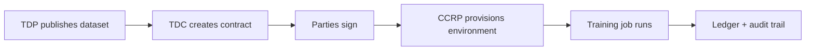
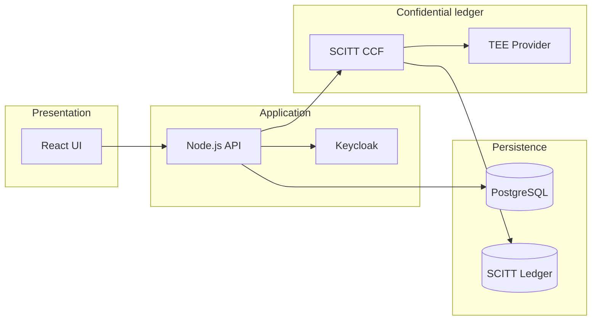

# Confidential AI Network

**CAN** is a multi-party platform for governed AI training: Training Data Providers (TDPs), Training Data Consumers (TDCs), and Confidential Clean Room Providers (CCRPs) negotiate **Ricardian contracts**, run training in protected environments, and retain an **auditable trail** on a confidential ledger (SCITT CCF).

Inspired by [iSPIRT DEPA](https://depa.world) — consent-based, accountable data sharing for the AI era.

---

## Business use cases

### Governed data sharing for AI training

A **TDC** needs another party’s data to train a model but cannot accept a bulk export or a handshake deal. CAN publishes **dataset metadata and policies** in a catalog; the TDC creates a contract with explicit terms (use, duration, geography, price). All parties sign before training starts.

**Outcome:** No training without agreement; contract state and signatures are recorded for audit.

### Confidential clean room execution

A **CCRP** offers **isolated compute** — confidential VMs, enclaves, or segmented Kubernetes — where data and models are used only inside attested environments.

**Outcome:** TDP data and TDC model IP stay protected; execution happens where policy allows.

### Regulated and cross-border collaboration

Healthcare, finance, and public-sector teams must prove **who accessed what, when, and under which policy**. CAN combines Keycloak role-based access, dataset classification, residency controls, differential privacy options, and ledger-backed provenance.

**Outcome:** Evidence for GDPR, HIPAA, SOX, and emerging AI governance without ad-hoc approvals.

### Federated catalog without a central data lake

**TDPs** retain sovereignty over data; **TDCs** discover and contract for governed access paths instead of copying entire corpora into a shared warehouse. Optional training artifacts or dev-time Hub references point trainers at the right source.

**Outcome:** Monetize and share data safely without building a monolithic lake.

### Enterprise security operations

Platform and security teams need **defense in depth** (WAF, API gateway, private networking, vault-backed secrets) and **SIEM export** to Splunk, Sentinel, OCI Logging, or webhooks.

**Outcome:** CAN fits existing SOC workflows — alerts, investigations, retention — not a siloed training tool.

### Who uses CAN

| Role | What they do | Start here |
|------|----------------|------------|
| **TDC** | Browse datasets, create/sign contracts, run training | [User guide](docs/USER_GUIDE.md) · [Training](docs/training/README.md) |
| **TDP** | Publish datasets, approve contracts, monitor usage | [User guide](docs/USER_GUIDE.md) |
| **CCRP** | Host compliant environments, monitor jobs | [User guide](docs/USER_GUIDE.md) · [CCRP training](docs/training/README.md) |
| **AppAdmin** | Users, health, audit | [Admin guide](docs/ADMIN_GUIDE.md) |
| **Platform / SRE** | Deploy and operate in cloud | [Production docs](docs/production/README.md) |
| **Security / GRC** | Controls and evidence | [Security](docs/production/README.md) · [SIEM](docs/production/SIEM_INTEGRATION_FRAMEWORK.md) |
| **Developers** | Extend APIs and integrations | [Developer guide](docs/DEVELOPER_GUIDE.md) |

### Typical workflow



---

## Documentation

Full index: **[docs/README.md](docs/README.md)**

### Get started

| I want to… | Document |
|------------|----------|
| Run locally | [Quick start](docs/getting-started/QUICK_START.md) |
| Fix setup / auth | [Troubleshooting](docs/getting-started/TROUBLESHOOTING.md) · `./fix-auth.sh` |
| Demo to stakeholders | [Local demo runbook](docs/training/LOCAL_DEMO_RUNBOOK.md) |
| Use the product (roles) | [User guide](docs/USER_GUIDE.md) |

### Architecture and implementation

| Topic | Document |
|-------|----------|
| System architecture | [ARCHITECTURE.md](docs/ARCHITECTURE.md) |
| Backend services | [BACKEND_SERVICES_DOCUMENTATION.md](docs/implementation/BACKEND_SERVICES_DOCUMENTATION.md) |
| SCITT CCF integration | [SCITT CCF README](docs/features/scitt/SCITT_CCF_INTEGRATION_README.md) |
| Contract signing | [Contract signing index](docs/features/contract-signing/CONTRACT_SIGNING_INDEX.md) |
| API reference | [API_REFERENCE.md](docs/api/API_REFERENCE.md) |
| Developer workflow | [DEVELOPER_GUIDE.md](docs/DEVELOPER_GUIDE.md) |

### Training and integrations

| Topic | Document |
|-------|----------|
| Training overview | [training/README.md](docs/training/README.md) |
| TDC training runtime | [TDC_TRAINING_RUNTIME.md](docs/training/TDC_TRAINING_RUNTIME.md) |
| Hugging Face Hub (dev catalog) | [HUGGINGFACE.md](docs/integrations/HUGGINGFACE.md) |
| CAN vs Samyog comparison | [SAMYOG_CAN_COMPARISON.md](docs/integrations/SAMYOG_CAN_COMPARISON.md) |

### Production and cloud

| Topic | Document |
|-------|----------|
| Production overview (business + ops) | [production/README.md](docs/production/README.md) |
| Production deployment | [PRODUCTION_DEPLOYMENT_GUIDE.md](docs/production/PRODUCTION_DEPLOYMENT_GUIDE.md) |
| Production architecture | [PRODUCTION_ARCHITECTURE.md](docs/production/PRODUCTION_ARCHITECTURE.md) |
| OCI security & new-env runbook | [OCI_SECURITY_ARCHITECTURE.md](docs/production/OCI_SECURITY_ARCHITECTURE.md) |
| Azure security & new-env runbook | [AZURE_SECURITY_ARCHITECTURE.md](docs/production/AZURE_SECURITY_ARCHITECTURE.md) |
| OCI IAM, WAF, API Gateway | [OCI_IAM_AND_EDGE_CONFIG.md](docs/deployment/OCI_IAM_AND_EDGE_CONFIG.md) |
| Azure IAM, Front Door, APIM | [AZURE_IAM_AND_EDGE_CONFIG.md](docs/deployment/AZURE_IAM_AND_EDGE_CONFIG.md) |
| OCI / Azure readiness | [OCI_READINESS.md](docs/deployment/OCI_READINESS.md) · [AZURE_READINESS.md](docs/deployment/AZURE_READINESS.md) |
| Deployment scripts & Terraform | [deployment/README.md](docs/deployment/README.md) |
| SIEM integration | [SIEM_INTEGRATION_FRAMEWORK.md](docs/production/SIEM_INTEGRATION_FRAMEWORK.md) |

### Testing

| Topic | Document |
|-------|----------|
| Testing guide | [TESTING_GUIDE.md](docs/development/TESTING_GUIDE.md) |
| E2E (Playwright) | [frontend/tests/e2e/README.md](frontend/tests/e2e/README.md) |

---

## Quick start (local development)

```bash
# Start the full stack (API, UI, Keycloak, SCITT CCF, PostgreSQL)
./start-system.sh

# Health and auth checks
npm run status
npm run test:login

# SCITT CCF management
./manage-scitt-ccf.sh status
./manage-scitt-ccf.sh test

# Fix common auth issues
./fix-auth.sh
```

**Configuration:** copy `config/examples/` env files to repo root (`config.env`, `.env`, `secrets.env`) — see [Developer guide](docs/DEVELOPER_GUIDE.md).

**Repository layout**

| Path | Purpose |
|------|---------|
| `frontend/` | React UI |
| `backend/` | Node.js API |
| `docker/` | Compose stacks and Dockerfiles |
| `scripts/` | Startup, deploy, utilities — [scripts/README.md](scripts/README.md) |
| `deployment/` | OCI/Azure Terraform and deploy scripts |
| `docs/` | Documentation index |

---

## Application architecture (summary)

Four layers: **React UI** → **Node.js API + Keycloak** → **SCITT CCF / TEE** → **PostgreSQL + ledger**.



**Production on OCI or Azure** uses compartment/resource-group isolation, WAF → API gateway → Kubernetes (OKE/AKS), private database endpoints, and vault-backed secrets. Detailed diagrams, CIDR tables, IAM runbooks, and Terraform modules are in the [OCI](docs/production/OCI_SECURITY_ARCHITECTURE.md) and [Azure](docs/production/AZURE_SECURITY_ARCHITECTURE.md) security architecture guides — not duplicated here.

---

## Key capabilities

- **Multi-party Ricardian contracts** — TDP, TDC, CCRP workflows with digital signing
- **SCITT CCF ledger** — high-throughput, confidential-computing-friendly audit trail
- **TDC training jobs** — contract-bound training; `local-docker`, `local-native` (Mac MPS), or `local-mlx`; optional model registration; NLP jobs can return **Opacus DP-SGD** `privacyMetrics` ([runtime doc](docs/training/TDC_TRAINING_RUNTIME.md) · [glossary](docs/GLOSSARY.md))
- **CCRP training console** — deploy and monitor jobs via API and `/ccrp/training-environment`
- **Encryption** — LUKS for large files, TEE decryption paths, differential privacy support
- **Multi-cloud** — AWS, Azure, GCP, OCI deployment paths
- **SIEM export** — canonical audit events to enterprise security tools

---

## Testing

**Frontend E2E** (from `frontend/`):

```bash
npm run test:e2e:install
npm run test:e2e:chromium
npm run test:e2e:api    # CAN JCS + Hugging Face + NLP DP API (latter skips unless E2E_WAIT_FOR_LOCAL_TRAINING=true)
# Opt-in full NLP DP path (API + /tdc/training UI panel):
E2E_WAIT_FOR_LOCAL_TRAINING=true npm run test:e2e:nlp-dp
```

Backend must be healthy at `http://localhost:5001/health`.

**Backend** (from `backend/`):

```bash
npm run test:unit
npm run test:integration
```

See [TESTING_GUIDE.md](docs/development/TESTING_GUIDE.md) for CI, HF env flags, and SCITT CCF test patterns.

---

## Technology stack

| Layer | Technologies |
|-------|----------------|
| Frontend | React 18, Material-UI, React Router, Axios |
| Backend | Node.js 18+, Express, Sequelize, PostgreSQL 15+ |
| Identity | Keycloak (OIDC / JWT) |
| Ledger | SCITT CCF (Microsoft) |
| Infrastructure | Docker Compose (dev), Kubernetes (prod), Terraform (OCI/Azure) |

---

## Contributing

1. Fork the repository  
2. Create a feature branch (`git checkout -b feature/your-feature`)  
3. Commit with a clear message  
4. Open a Pull Request  

Run `npm run status` and relevant tests before submitting.

---

## Glossary (essential terms)

| Term | Meaning |
|------|---------|
| **CAN** | Confidential AI Network — this platform |
| **TDC** | Training Data Consumer — requests training on contracted data |
| **TDP** | Training Data Provider — owns and publishes datasets |
| **CCRP** | Confidential Clean Room Provider — hosts secure training environments |
| **Ricardian contract** | Human-readable legal terms plus machine-enforceable structure |
| **SCITT CCF** | Confidential consortium ledger for tamper-evident contract records |
| **TEE** | Trusted Execution Environment — hardware-isolated enclave for confidential processing |
| **DEPA** | Data Empowerment and Protection Architecture ([depa.world](https://depa.world)) |
| **PET** | Privacy-Enhancing Technology (DP, federated learning, secure MPC, etc.) |
| **Differential privacy (DP)** | Privacy guarantee via ε (epsilon) and δ (delta) budgets on training outputs |
| **DP-SGD** | Differentially Private SGD — clipped noisy gradients during training |
| **Opacus** | PyTorch library implementing DP-SGD in our NLP trainer (`train.py`) |
| **privacyMetrics** | Spent ε, δ, mechanism on completed jobs — TDC **Privacy metrics** panel |
| **Hugging Face (HF) Hub** | External model/dataset registry; dev catalog references Hub repos |
| **local-docker** | `TRAINING_EXECUTION_MODE` — `train.py` in Docker (cross-platform, Opacus DP) |
| **local-native** | Host `train.py` on Apple Silicon — PyTorch **MPS** + same HF/Opacus stack as Docker |
| **local-mlx** | Host **Apple MLX** trainer on Mac — fast GPU dev, no DP |
| **MLX** | Apple’s ML framework for Apple Silicon GPU |
| **MPS** | Metal Performance Shaders — PyTorch GPU backend on macOS |
| **SIEM** | Security analytics export (Splunk, Sentinel, OCI Logging, webhooks) |

**Full glossary** (training modes, LoRA, CAN JCS, KMS, …): [docs/GLOSSARY.md](docs/GLOSSARY.md).

Extended cloud/IAM/networking tables: [ARCHITECTURE.md](docs/ARCHITECTURE.md), [OCI](docs/production/OCI_SECURITY_ARCHITECTURE.md) / [Azure](docs/production/AZURE_SECURITY_ARCHITECTURE.md) security docs.

---

## License and support

- **License:** [MIT](LICENSE)  
- **Docs:** [docs/README.md](docs/README.md)  
- **Issues:** GitHub Issues  

---

*Last updated: 2026-06-18*
