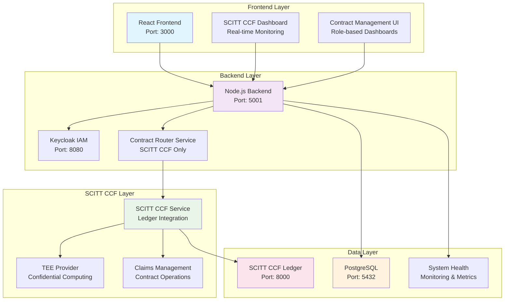

# 🚀 Contract Management System

A comprehensive contract management system with multi-party authentication, **SCITT CCF Ledger integration**, confidential computing capabilities, and **differential privacy implementation**.

## 🚀 Quick Start

```bash
# Start everything properly (SCITT CCF only)
./start-system-scitt-ccf.sh

# Manage SCITT CCF services
./manage-scitt-ccf.sh start
./manage-scitt-ccf.sh status
./manage-scitt-ccf.sh test

# Check system health
npm run status

# Test authentication
npm run test:login
```

## 🔗 SCITT CCF Integration

The system is built on **Microsoft's SCITT CCF Ledger** for high-performance, confidential computing contract management.

### **Key Features**
- **High Performance**: 10-100x throughput improvement over traditional blockchain
- **Confidential Computing**: Hardware-level TEE (Trusted Execution Environment) support
- **Standards Compliance**: IETF SCITT working group standards
- **Enterprise Ready**: Production-grade infrastructure and security
- **Zero Downtime**: Continuous service with automatic failover

### **Quick SCITT CCF Setup**

```bash
# Setup SCITT CCF integration
./manage-scitt-ccf.sh setup

# Start SCITT CCF services
./manage-scitt-ccf.sh start

# Test SCITT CCF integration
./manage-scitt-ccf.sh test

# Check SCITT CCF status
./manage-scitt-ccf.sh status
```

### **Migration Modes**

The system now operates in **SCITT CCF only** mode for simplified architecture:

- **`SCITT_CCF_ONLY`**: Use only SCITT CCF Ledger (Current)
- **Legacy Support**: Ethereum blockchain support has been removed for cleaner architecture

## ��️ Architecture



## 🧪 Testing

### **Updated Test Suites for SCITT CCF**

The backend test suites have been completely updated to include SCITT CCF integration:

```bash
# Run SCITT CCF integration tests
npm test -- --testPathPattern="scitt-ccf"

# Run all tests including SCITT CCF
npm test

# Run specific SCITT CCF tests
npm test -- scitt-ccf-integration.test.js
npm test -- scitt-ccf-api.test.js
```

**Test Coverage Includes:**
- **SCITT CCF Service Tests**: Service initialization, connection, contract creation
- **Contract Router Tests**: Simplified routing to SCITT CCF only
- **System Health Tests**: SCITT CCF health monitoring
- **API Endpoint Tests**: All SCITT CCF API endpoints

## 📚 Documentation

### **Core Documentation**
- **[Quick Start Guide](docs/QUICK_START.md)** - Get up and running quickly
- **[Developer Guide](docs/DEVELOPER_GUIDE.md)** - Development setup and guidelines
- **[API Reference](docs/API_REFERENCE.md)** - Complete API documentation
- **[Architecture Guide](docs/ARCHITECTURE.md)** - System architecture overview

### **SCITT CCF Documentation**
- **[SCITT CCF Integration Guide](SCITT_CCF_INTEGRATION_README.md)** - Complete integration guide
- **[SCITT CCF Migration Design](SCITT_CCF_MIGRATION_DESIGN.md)** - Technical design document
- **[SCITT CCF Management Script](manage-scitt-ccf.sh)** - Service management script

### **User Guides**
- **[Test Data Reference](TEST_DATA_FOR_TESTERS.md)** - Complete test data guide
- **[Setup Troubleshooting](SETUP_TROUBLESHOOTING_GUIDE.md)** - Common issues and solutions

## 🚀 Features

### **Core Contract Management**
- **Multi-Party Contracts**: TDP, TDC, CCRP workflow support
- **Ricardian Contracts**: Human-readable + machine-executable contracts
- **Contract Lifecycle**: Complete contract management from creation to completion
- **Role-Based Access**: Secure access control for all user types

### **SCITT CCF Integration**
- **High-Performance Ledger**: Microsoft's SCITT CCF implementation
- **Confidential Computing**: TEE support for secure data processing
- **Supply Chain Transparency**: Immutable audit trail for all operations
- **Enterprise Security**: Hardware-level security and attestation

### **Advanced Features**
- **Differential Privacy**: Privacy-preserving data analytics
- **Multi-Cloud Support**: AWS, Azure, GCP, OCI integration
- **Global Deployment**: Multi-jurisdiction deployment support
- **Real-Time Monitoring**: System health and performance monitoring

## 🏗️ Technology Stack

### **Backend**
- **Runtime**: Node.js 18+ with Express.js
- **Database**: PostgreSQL 15+ with Sequelize ORM
- **Authentication**: Keycloak IAM integration
- **Ledger**: SCITT CCF Ledger (Microsoft)

### **Frontend**
- **Framework**: React.js 18+ with Material-UI
- **State Management**: React Context + Hooks
- **Routing**: React Router v6
- **HTTP Client**: Axios with interceptors

### **Infrastructure**
- **Containerization**: Docker + Docker Compose
- **Orchestration**: Kubernetes ready
- **Monitoring**: Built-in health monitoring
- **Security**: TEE integration, encryption, attestation

## 🔧 Development

### **Prerequisites**
- Node.js 18+ and npm
- PostgreSQL 15+
- Docker and Docker Compose
- SCITT CCF Ledger

### **Setup**
```bash
# Clone repository
git clone <repository-url>
cd ContractManagement

# Install dependencies
npm install

# Setup environment
cp config.env.example config.env
# Edit config.env with your settings

# Start services
./start-system-scitt-ccf.sh

# Run tests
npm test
```

## 📊 System Status

```bash
# Check system health
npm run status

# Check SCITT CCF status
./manage-scitt-ccf.sh status

# View logs
docker-compose logs -f
```

## 🤝 Contributing

1. Fork the repository
2. Create a feature branch (`git checkout -b feature/amazing-feature`)
3. Commit your changes (`git commit -m 'Add amazing feature'`)
4. Push to the branch (`git push origin feature/amazing-feature`)
5. Open a Pull Request

## 📄 License

This project is licensed under the MIT License - see the [LICENSE](LICENSE) file for details.

## 🆘 Support

- **Documentation**: Check the docs folder for comprehensive guides
- **Issues**: Report bugs and feature requests via GitHub Issues
- **Discussions**: Join community discussions on GitHub Discussions

---

**Built with ❤️ using Microsoft's SCITT CCF Ledger technology** 