# Role-Based UI Implementation Guide

## Overview

The Contract Management System now implements role-based user interfaces that customize the experience based on user types: TDC (Training Data Consumer), TDP (Training Data Provider), and CCRP (Confidential Clean Room Provider).

### System Architecture Overview
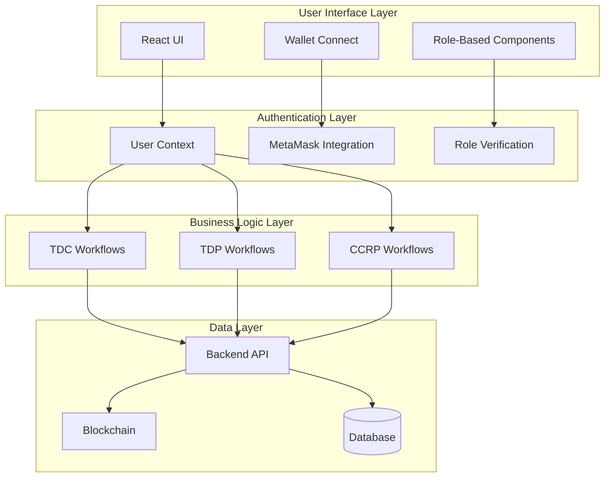

## User Roles and Responsibilities

### TDC (Training Data Consumer)
- **Primary Role**: Initiates contracts by selecting datasets and CCRP providers
- **UI Features**:
  - Can access "Create Contract" functionality
  - Views datasets available for purchase
  - Manages their initiated contracts
  - Selects CCRP providers for contracts
  - Completes contracts when training is finished

### TDP (Training Data Provider)
- **Primary Role**: Provides datasets and automatically signs contracts
- **UI Features**:
  - Views their owned datasets
  - Automatically signs contracts when created (no manual action needed)
  - Reviews contract requests
  - Manages dataset listings

### CCRP (Confidential Clean Room Provider)
- **Primary Role**: Provides secure environments and signs contracts
- **UI Features**:
  - Reviews contract requests where they are selected
  - Signs contracts to approve participation
  - Views contracts they are involved in

### Role Hierarchy and Permissions
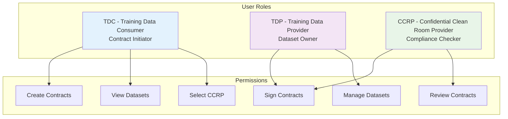

## Implementation Details

### 1. User Authentication & Context

**File**: `frontend/src/contexts/UserContext.js`

- Manages wallet connection and user authentication
- Provides role-based helper functions (`isTDC`, `isTDP`, `isCCRP`)
- Handles user data fetching based on wallet address

```javascript
const { currentUser, isTDC, isTDP, isCCRP, isAuthenticated } = useUser();
```

### Authentication Flow
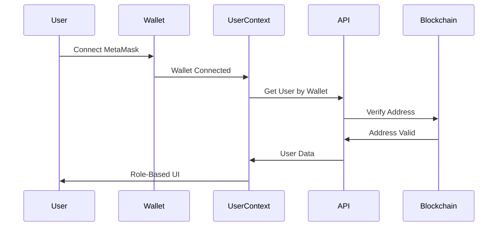

### 2. Role-Based Navigation

**File**: `frontend/src/components/Layout.js`

- Dynamic menu items based on user role
- Only TDC users see "Create Contract" option
- Wallet connection status displayed in sidebar
- User role and wallet address shown in navigation

### Navigation Structure
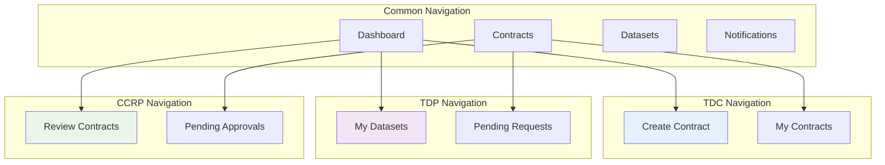

### 3. Contract Creation Flow

**File**: `frontend/src/pages/CreateContract.js`

- **Access Control**: Only TDC users can access
- **Process**:
  1. TDC selects a dataset
  2. TDC configures contract details (price, duration, terms)
  3. TDC optionally selects a CCRP
  4. Contract is created with TDP automatically signed
  5. CCRP is notified if selected

### Contract Creation Workflow
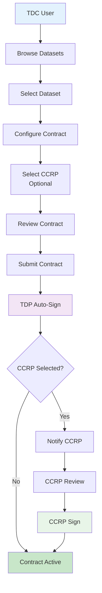

### 4. Contract Management

**File**: `frontend/src/pages/ContractDetail.js`

- **Role-Based Actions**:
  - **TDP**: Can sign contracts (automatically done at creation)
  - **TDC**: Can select CCRP, complete contracts
  - **CCRP**: Can sign contracts when selected
  - **All**: Can cancel contracts if not completed

### Contract Management Flow
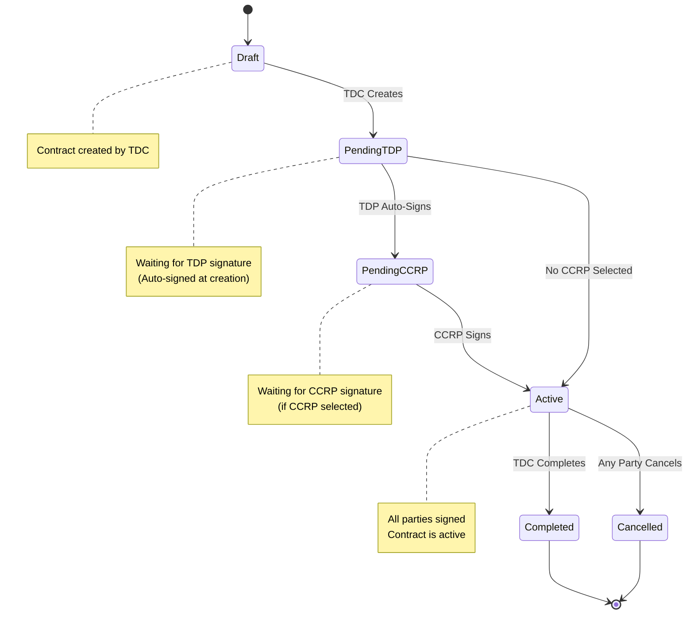

### 5. Dashboard Customization

**File**: `frontend/src/pages/Dashboard.js`

- **Role-Based Welcome Messages**:
  - TDC: "As a Training Data Consumer, you can browse datasets and create contracts"
  - TDP: "As a Training Data Provider, you can manage your datasets and review contract requests"
  - CCRP: "As a Confidential Clean Room Provider, you can review and sign contracts"

- **Role-Based Statistics**:
  - TDC: Shows "My Contracts" count
  - TDP: Shows "My Datasets" count
  - CCRP: Shows "Pending Approvals" count

### Dashboard Components
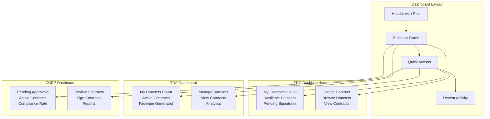

## Contract Workflow

### 1. Contract Initiation (TDC)
```
TDC → Selects Dataset → Configures Contract → (Optional) Selects CCRP → Creates Contract
```

### 2. Contract Signing Flow
```
Contract Created → TDP Auto-Signed → (If CCRP selected) CCRP Signs → Contract Active
```

### 3. Contract Completion
```
Contract Active → TDC Completes Training → Contract Completed
```

### Complete Contract Lifecycle
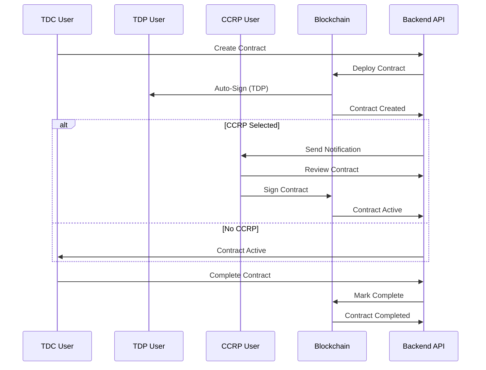

## Security Features

### Wallet-Based Authentication
- All actions require connected wallet
- User identity verified through blockchain
- No manual private key input required
- MetaMask integration for secure signing

### Role Verification
- Backend validates user roles before allowing actions
- Frontend shows/hides features based on user role
- Contract parties verified against blockchain records

### Security Architecture
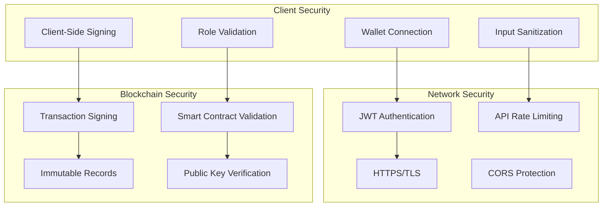

## API Endpoints

### User Management
- `GET /api/users/wallet/:walletAddress` - Get user by wallet address
- `GET /api/users` - Get all users
- `POST /api/users/register` - Register new user

### Contract Management
- `POST /api/contracts` - Create contract (TDC only)
- `GET /api/contracts/:contractId` - Get contract details
- `POST /api/contracts/:contractId/sign` - Sign contract
- `POST /api/contracts/:contractId/select-ccrp` - Select CCRP (TDC only)

### API Architecture
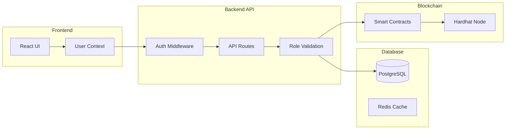

## Frontend Components

### Core Components
- `UserContext` - Manages authentication and user state
- `Layout` - Role-based navigation and wallet connection
- `CreateContract` - Contract creation (TDC only)
- `ContractDetail` - Contract management with role-based actions
- `Dashboard` - Role-based statistics and welcome messages

### Component Architecture
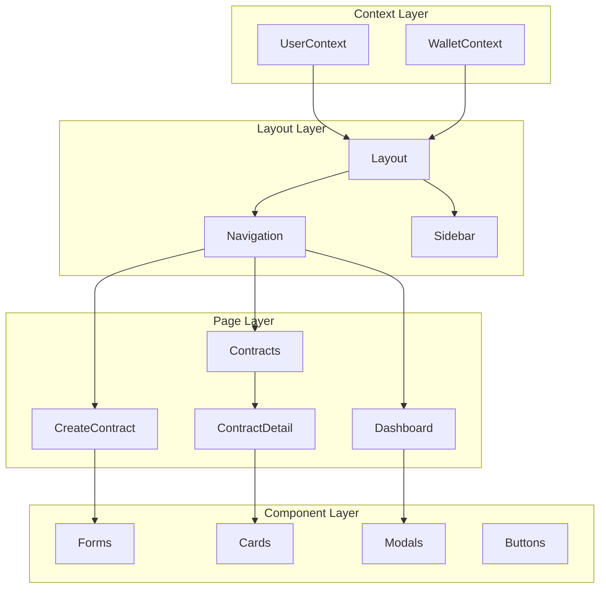

### Key Features
- **Wallet Connection**: MetaMask integration with automatic user detection
- **Role-Based UI**: Different interfaces for different user types
- **Real-time Updates**: Contract status updates and notifications
- **Secure Signing**: Client-side transaction signing with MetaMask

## Usage Examples

### For TDC Users
1. Connect wallet (MetaMask)
2. Browse available datasets
3. Create new contract
4. Select CCRP (optional)
5. Monitor contract status
6. Complete contract when training is done

### For TDP Users
1. Connect wallet (MetaMask)
2. View owned datasets
3. Review incoming contract requests
4. Contracts are automatically signed at creation
5. Monitor contract status

### For CCRP Users
1. Connect wallet (MetaMask)
2. Review contract requests where selected
3. Sign contracts to approve participation
4. Monitor active contracts

### User Journey Flow
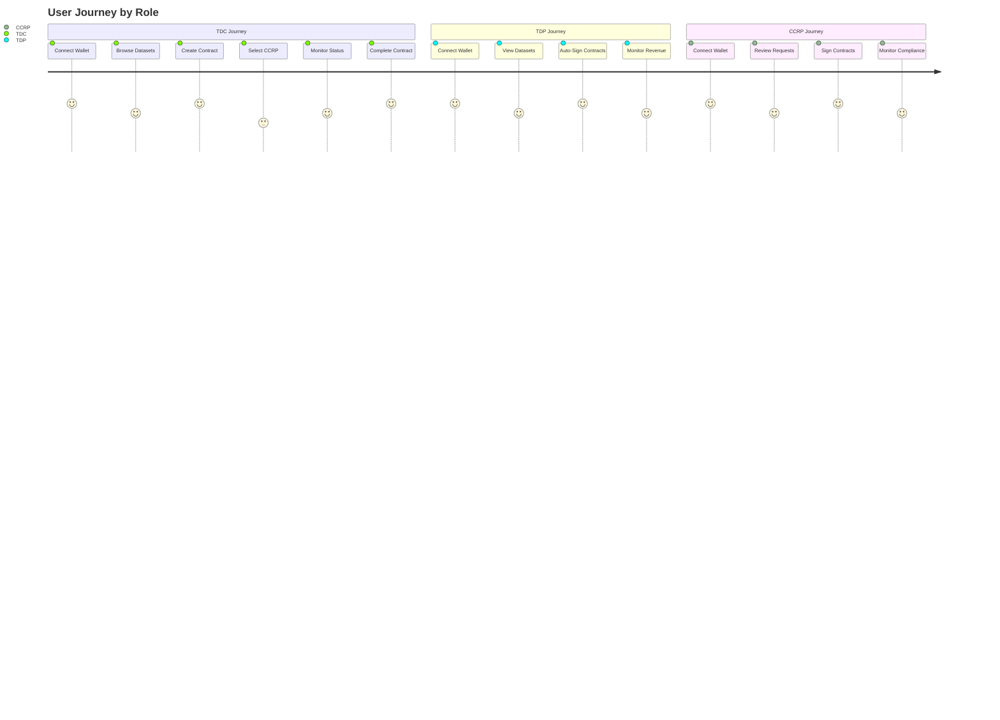

## Technical Implementation

### State Management
- React Context for user authentication
- React Query for data fetching and caching
- Local state for UI interactions

### Blockchain Integration
- Ethers.js for blockchain interactions
- MetaMask for wallet connection
- Smart contract integration for contract management

### Error Handling
- Wallet connection errors
- Contract creation failures
- Network connectivity issues
- Role-based access violations

### Error Handling Flow
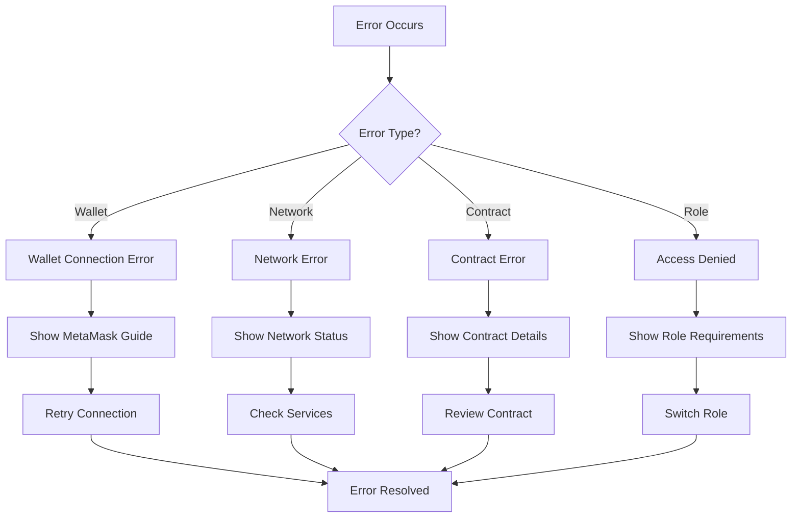

## Future Enhancements

1. **Advanced Role Management**: Sub-roles and permissions
2. **Multi-Signature Support**: Multiple signers per role
3. **Contract Templates**: Predefined contract structures
4. **Audit Trail**: Complete action history
5. **Mobile Support**: Mobile wallet integration
6. **Off-chain Storage**: IPFS integration for large datasets

### Enhancement Roadmap
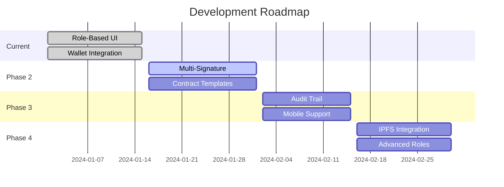

## Troubleshooting

### Common Issues
1. **Wallet Not Connected**: Ensure MetaMask is installed and connected
2. **Role Not Recognized**: Verify user registration with correct party type
3. **Contract Creation Failed**: Check blockchain connection and gas fees
4. **Signing Failed**: Ensure wallet has sufficient funds for gas

### Debug Information
- Check browser console for detailed error messages
- Verify blockchain node is running on port 8545
- Ensure backend server is running on port 5001
- Check user registration in database

### Troubleshooting Decision Tree
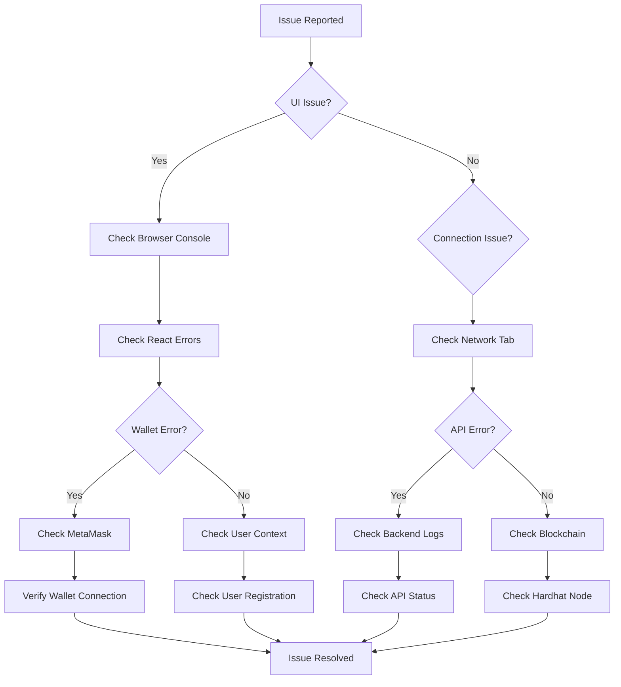