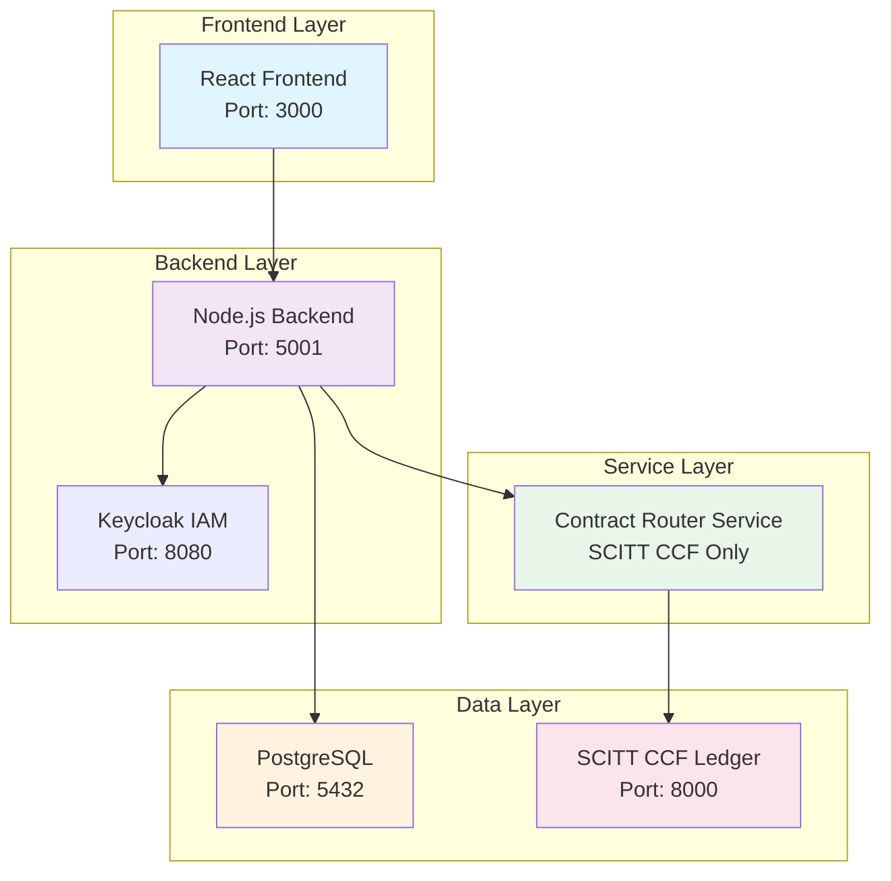
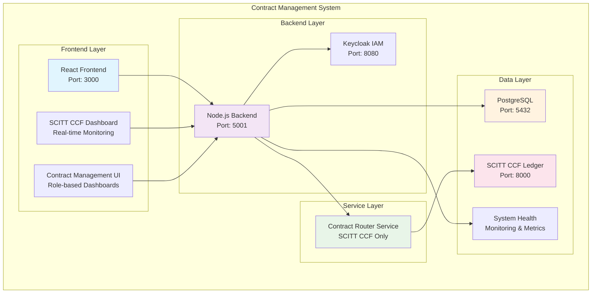

# 🚀 SCITT CCF Ledger Migration Design Document

## 📋 Document Information
- **Version**: 1.0.0
- **Status**: Design Phase
- **Created**: 2025-01-08
- **Last Updated**: 2025-01-08
- **Author**: Contract Management System Team
- **Reviewers**: Architecture Team, Security Team

## 🎯 Executive Summary

This document outlines the comprehensive design for migrating the Contract Management System from Ethereum blockchain to Microsoft's SCITT CCF Ledger. The migration will provide enhanced performance, security through confidential computing, and compliance with emerging supply chain integrity standards.

### **Key Benefits**
- **Performance**: 10-100x throughput improvement over Ethereum
- **Security**: Hardware-level TEE (Trusted Execution Environment) support
- **Compliance**: IETF SCITT working group standards compliance
- **Scalability**: Enterprise-grade infrastructure
- **Future-Proofing**: Microsoft-backed technology

### **Migration Strategy**
- **Simplified Approach**: Direct SCITT CCF implementation
- **Single Backend**: No hybrid modes or blockchain fallbacks
- **Risk Mitigation**: Simplified architecture reduces complexity
- **Zero Downtime**: Continuous service with SCITT CCF only

## 🏗️ Architecture Overview

### **Current Architecture**
```
┌─────────────────┐    ┌─────────────────┐    ┌─────────────────┐
│   Frontend      │    │    Backend      │    │   Keycloak      │
│   (React)       │◄──►│   (Node.js)     │◄──►│   (IAM)         │
│   Port: 3000    │    │   Port: 5001    │    │   Port: 8080    │
└─────────────────┘    └─────────────────┘    └─────────────────┘
                                │
                                ▼
                       ┌─────────────────┐
                       │   PostgreSQL    │
                       │   Port: 5432    │
                       └─────────────────┘
                                │
                                ▼
                       ┌─────────────────┐
                       │   Blockchain    │
                       │   (Ethereum)    │
                       └─────────────────┘
```

### **Target Architecture**


### **Simplified SCITT CCF Architecture**


## 🔧 Technical Design

### **1. Contract Router Service**

#### **Purpose**
The Contract Router Service acts as the central orchestrator, routing all contract operations directly to SCITT CCF for simplified architecture.

#### **Key Responsibilities**
- Route all contract operations to SCITT CCF
- Maintain data consistency
- Provide unified API interface
- Monitor SCITT CCF system health and performance

#### **Implementation Details**
```javascript
class ContractRouterService {
  constructor() {
    this.scittCcfService = new ScittCcfService();
    this.healthMonitor = new SystemHealthMonitor();
    this.isInitialized = false;
  }

  async createContract(contractData) {
    // All operations route directly to SCITT CCF
    return await this.scittCcfService.createContract(contractData);
  }

  async getSystemHealth() {
    const scittHealth = await this.healthMonitor.checkScittCcfHealth();
    
    return {
      overall: scittHealth.isHealthy,
      scittCcf: scittHealth,
      timestamp: new Date().toISOString(),
      backend: 'SCITT_CCF_ONLY'
    };
  }
}
```

### **2. SCITT CCF Service Layer**

#### **Purpose**
The SCITT CCF Service Layer provides a clean abstraction over the SCITT CCF Ledger, mapping our contract operations to SCITT claims and receipts.

#### **Key Responsibilities**
- Submit claims to SCITT CCF Ledger
- Retrieve claim status and receipts
- Handle confidential computing operations
- Manage TEE attestation
- Provide local claim storage and tracking

#### **Implementation Details**
```javascript
class ScittCcfService {
  constructor() {
    this.ccfNodeUrl = process.env.CCF_NODE_URL || 'https://127.0.0.1:8000';
    this.client = new ScittCcfClient(this.ccfNodeUrl);
    this.teeProvider = this.detectTeeProvider();
  }

  async createContract(contractData) {
    const claim = this.buildContractClaim(contractData);
    
    try {
      const result = await this.client.submitClaim(claim);
      
      // Store claim in local database for tracking
      await this.storeClaimLocally(result.claimId, claim, contractData);
      
      return {
        success: true,
        claimId: result.claimId,
        receipt: result.receipt,
        contractId: contractData.contractId,
        message: 'Contract created successfully in SCITT CCF',
        source: 'SCITT_CCF'
      };
    } catch (error) {
      console.error('SCITT CCF contract creation failed:', error);
      throw new Error(`SCITT CCF operation failed: ${error.message}`);
    }
  }

  buildContractClaim(contractData) {
    return {
      type: 'contract_creation',
      data: {
        contractId: contractData.contractId,
        tdc: contractData.tdcAddress,
        tdp: contractData.tdpAddress,
        ccrp: contractData.ccrpAddress,
        datasetId: contractData.datasetId,
        price: contractData.price,
        duration: contractData.duration,
        terms: contractData.termsAndConditions,
        metadata: {
          timestamp: new Date().toISOString(),
          version: '1.0.0',
          system: 'ContractFlow Pro'
        }
      }
    };
  }

  async getContractStatus(contractId) {
    try {
      const claims = await this.client.getClaims({
        filter: { 
          contractId: contractId,
          type: { $in: ['contract_creation', 'contract_approval', 'contract_completion'] }
        }
      });
      
      return this.analyzeContractStatus(claims);
    } catch (error) {
      console.error('Failed to get SCITT CCF contract status:', error);
      throw error;
    }
  }

  analyzeContractStatus(claims) {
    const creationClaim = claims.find(c => c.type === 'contract_creation');
    const approvalClaims = claims.filter(c => c.type === 'contract_approval');
    const completionClaim = claims.find(c => c.type === 'contract_completion');
    
    if (!creationClaim) {
      return { status: 'NOT_FOUND', message: 'Contract not found in SCITT CCF' };
    }
    
    const tdpApproved = approvalClaims.some(c => c.data.partyType === 'TDP');
    const ccrpApproved = approvalClaims.some(c => c.data.partyType === 'CCRP');
    
    let status = 'PENDING_TDP_APPROVAL';
    if (tdpApproved) status = 'PENDING_CCRP_APPROVAL';
    if (tdpApproved && ccrpApproved) status = 'ACTIVE';
    if (completionClaim) status = 'COMPLETED';
    
    return {
      status: status,
      contractId: creationClaim.data.contractId,
      tdpApproved: tdpApproved,
      ccrpApproved: ccrpApproved,
      createdAt: creationClaim.data.metadata.timestamp,
      lastUpdated: new Date().toISOString()
    };
  }
}
```

### **3. Migration Orchestrator**

#### **Purpose**
The Migration Orchestrator manages the systematic migration of existing contracts from Ethereum to SCITT CCF, ensuring data integrity and minimal disruption.

#### **Key Responsibilities**
- Coordinate contract migration
- Validate migration results
- Handle migration failures
- Maintain audit trail
- Provide rollback capabilities

#### **Implementation Details**
```javascript
class MigrationOrchestrator {
  constructor() {
    this.ethereumService = new BlockchainService();
    this.scittCcfService = new ScittCcfService();
    this.db = require('../models');
    this.migrationQueue = [];
    this.isMigrationActive = false;
  }

  async migrateContract(contractId) {
    try {
      // 1. Validate contract exists in Ethereum
      const ethereumContract = await this.ethereumService.getContract(contractId);
      if (!ethereumContract) {
        throw new Error(`Contract ${contractId} not found in Ethereum`);
      }

      // 2. Check if already migrated
      const existingMigration = await this.db.ScittMigrationLog.findOne({
        where: { contractId: contractId, status: 'COMPLETED' }
      });
      
      if (existingMigration) {
        return {
          success: true,
          contractId: contractId,
          status: 'ALREADY_MIGRATED',
          message: 'Contract already migrated to SCITT CCF'
        };
      }

      // 3. Create migration log entry
      const migrationLog = await this.db.ScittMigrationLog.create({
        contractId: contractId,
        operation: 'MIGRATION',
        sourceSystem: 'ETHEREUM',
        targetSystem: 'SCITT_CCF',
        status: 'IN_PROGRESS'
      });

      // 4. Migrate contract to SCITT CCF
      const scittContract = await this.scittCcfService.createContract(ethereumContract);
      
      // 5. Update contract record
      await this.db.Contract.update({
        scitt_claim_id: scittContract.claimId,
        contract_source: 'HYBRID',
        migration_status: 'COMPLETED'
      }, { where: { id: contractId } });

      // 6. Update migration log
      await migrationLog.update({ status: 'COMPLETED' });

      // 7. Log success
      console.log(`Contract ${contractId} migrated successfully to SCITT CCF`);

      return {
        success: true,
        contractId: contractId,
        ethereumContract: ethereumContract,
        scittContract: scittContract,
        migrationLog: migrationLog.id,
        message: 'Contract migrated successfully'
      };

    } catch (error) {
      // Log migration failure
      if (migrationLog) {
        await migrationLog.update({ 
          status: 'FAILED',
          errorMessage: error.message
        });
      }
      
      console.error(`Contract ${contractId} migration failed:`, error);
      throw error;
    }
  }

  async migrateAllContracts(batchSize = 10) {
    const contracts = await this.db.Contract.findAll({
      where: { 
        contract_source: 'ETHEREUM',
        migration_status: { [Op.ne]: 'COMPLETED' }
      },
      limit: batchSize
    });

    const results = [];
    for (const contract of contracts) {
      try {
        const result = await this.migrateContract(contract.id);
        results.push({ contractId: contract.id, status: 'SUCCESS', result });
      } catch (error) {
        results.push({ contractId: contract.id, status: 'FAILED', error: error.message });
      }
    }

    return results;
  }

  async rollbackMigration(contractId) {
    try {
      // 1. Get migration log
      const migrationLog = await this.db.ScittMigrationLog.findOne({
        where: { contractId: contractId, status: 'COMPLETED' }
      });

      if (!migrationLog) {
        throw new Error(`No completed migration found for contract ${contractId}`);
      }

      // 2. Update contract record
      await this.db.Contract.update({
        contract_source: 'ETHEREUM',
        migration_status: 'ROLLED_BACK'
      }, { where: { id: contractId } });

      // 3. Create rollback log entry
      await this.db.ScittMigrationLog.create({
        contractId: contractId,
        operation: 'ROLLBACK',
        sourceSystem: 'SCITT_CCF',
        targetSystem: 'ETHEREUM',
        status: 'COMPLETED'
      });

      return {
        success: true,
        contractId: contractId,
        message: 'Migration rolled back successfully'
      };

    } catch (error) {
      console.error(`Rollback failed for contract ${contractId}:`, error);
      throw error;
    }
  }
}
```

### **4. System Health Monitor**

#### **Purpose**
The System Health Monitor continuously monitors the health and performance of both Ethereum and SCITT CCF systems, providing real-time status information for routing decisions.

#### **Key Responsibilities**
- Monitor system availability
- Track performance metrics
- Detect system failures
- Provide health status
- Alert on issues

#### **Implementation Details**
```javascript
class SystemHealthMonitor {
  constructor() {
    this.ethereumHealth = { isHealthy: false, lastCheck: null, metrics: {} };
    this.scittCcfHealth = { isHealthy: false, lastCheck: null, metrics: {} };
    this.checkInterval = 30000; // 30 seconds
    this.startMonitoring();
  }

  async startMonitoring() {
    setInterval(async () => {
      await this.checkEthereumHealth();
      await this.checkScittCcfHealth();
    }, this.checkInterval);
  }

  async checkEthereumHealth() {
    try {
      const startTime = Date.now();
      const isConnected = await this.ethereumService.isConnected();
      const responseTime = Date.now() - startTime;

      this.ethereumHealth = {
        isHealthy: isConnected,
        lastCheck: new Date(),
        metrics: {
          responseTime: responseTime,
          isConnected: isConnected,
          timestamp: new Date().toISOString()
        }
      };

      if (!isConnected) {
        console.warn('Ethereum system health check failed');
      }
    } catch (error) {
      this.ethereumHealth = {
        isHealthy: false,
        lastCheck: new Date(),
        error: error.message
      };
      console.error('Ethereum health check error:', error);
    }
  }

  async checkScittCcfHealth() {
    try {
      const startTime = Date.now();
      const response = await fetch(`${this.scittCcfService.ccfNodeUrl}/app/claims`, {
        method: 'GET',
        timeout: 5000
      });
      const responseTime = Date.now() - startTime;

      this.scittCcfHealth = {
        isHealthy: response.ok,
        lastCheck: new Date(),
        metrics: {
          responseTime: responseTime,
          statusCode: response.status,
          timestamp: new Date().toISOString()
        }
      };

      if (!response.ok) {
        console.warn('SCITT CCF system health check failed:', response.status);
      }
    } catch (error) {
      this.scittCcfHealth = {
        isHealthy: false,
        lastCheck: new Date(),
        error: error.message
      };
      console.error('SCITT CCF health check error:', error);
    }
  }

  getSystemHealth() {
    return {
      ethereum: this.ethereumHealth,
      scittCcf: this.scittCcfHealth,
      overall: this.ethereumHealth.isHealthy || this.scittCcfHealth.isHealthy,
      timestamp: new Date().toISOString()
    };
  }

  async getDetailedMetrics() {
    return {
      ethereum: {
        ...this.ethereumHealth,
        uptime: await this.calculateUptime('ethereum'),
        performance: await this.getPerformanceMetrics('ethereum')
      },
      scittCcf: {
        ...this.scittCcfHealth,
        uptime: await this.calculateUptime('scittCcf'),
        performance: await this.getPerformanceMetrics('scittCcf')
      }
    };
  }
}
```

## 🗄️ Database Design

### **New Tables**

#### **1. SCITT Claims Table**
```sql
CREATE TABLE scitt_claims (
  id SERIAL PRIMARY KEY,
  claim_id VARCHAR(255) UNIQUE NOT NULL,
  contract_id INTEGER REFERENCES contracts(id),
  claim_type VARCHAR(100) NOT NULL,
  claim_data JSONB NOT NULL,
  receipt TEXT,
  status VARCHAR(50) DEFAULT 'PENDING',
  created_at TIMESTAMP DEFAULT CURRENT_TIMESTAMP,
  updated_at TIMESTAMP DEFAULT CURRENT_TIMESTAMP,
  
  -- Indexes for performance
  INDEX idx_claim_id (claim_id),
  INDEX idx_contract_id (contract_id),
  INDEX idx_claim_type (claim_type),
  INDEX idx_status (status)
);
```

#### **2. SCITT Migration Log Table**
```sql
CREATE TABLE scitt_migration_log (
  id SERIAL PRIMARY KEY,
  contract_id INTEGER REFERENCES contracts(id),
  operation VARCHAR(100) NOT NULL,
  source_system VARCHAR(50) NOT NULL,
  target_system VARCHAR(50) NOT NULL,
  status VARCHAR(50) NOT NULL,
  error_message TEXT,
  metadata JSONB,
  created_at TIMESTAMP DEFAULT CURRENT_TIMESTAMP,
  updated_at TIMESTAMP DEFAULT CURRENT_TIMESTAMP,
  
  -- Indexes for performance
  INDEX idx_contract_id (contract_id),
  INDEX idx_operation (operation),
  INDEX idx_status (status),
  INDEX idx_created_at (created_at)
);
```

#### **3. System Health Log Table**
```sql
CREATE TABLE system_health_log (
  id SERIAL PRIMARY KEY,
  system_name VARCHAR(50) NOT NULL,
  health_status BOOLEAN NOT NULL,
  response_time INTEGER,
  error_message TEXT,
  metrics JSONB,
  created_at TIMESTAMP DEFAULT CURRENT_TIMESTAMP,
  
  -- Indexes for performance
  INDEX idx_system_name (system_name),
  INDEX idx_health_status (health_status),
  INDEX idx_created_at (created_at)
);
```

### **Updated Tables**

#### **1. Contracts Table Updates**
```sql
-- Add SCITT CCF integration fields
ALTER TABLE contracts ADD COLUMN scitt_claim_id VARCHAR(255);
ALTER TABLE contracts ADD COLUMN scitt_receipt TEXT;
ALTER TABLE contracts ADD COLUMN contract_source ENUM('ETHEREUM', 'SCITT_CCF', 'HYBRID') DEFAULT 'ETHEREUM';
ALTER TABLE contracts ADD COLUMN migration_status ENUM('PENDING', 'IN_PROGRESS', 'COMPLETED', 'FAILED', 'ROLLED_BACK') DEFAULT 'PENDING';
ALTER TABLE contracts ADD COLUMN last_migration_attempt TIMESTAMP;

-- Add indexes for new fields
CREATE INDEX idx_contract_source ON contracts(contract_source);
CREATE INDEX idx_migration_status ON contracts(migration_status);
CREATE INDEX idx_scitt_claim_id ON contracts(scitt_claim_id);
```

## 🔐 Security Design

### **1. Authentication & Authorization**
- **JWT Tokens**: Maintain existing Keycloak integration
- **Role-Based Access**: TDC, TDP, CCRP, AppAdmin roles
- **API Security**: Rate limiting and request validation
- **Audit Logging**: Complete operation tracking

### **2. Data Protection**
- **Encryption**: Data encrypted in transit and at rest
- **TEE Integration**: Hardware-level security for confidential computing
- **Access Control**: Principle of least privilege
- **Data Residency**: Compliance with regulatory requirements

### **3. Network Security**
- **HTTPS**: All communications encrypted
- **Network Isolation**: Separate networks for different components
- **Firewall Rules**: Restrict access to necessary ports only
- **VPN Access**: Secure remote access for administrators

## 🚀 Deployment Strategy

### **1. Development Environment**
```yaml
# docker-compose.scitt-ccf-dev.yml
version: '3.8'

services:
  scitt-ccf-node:
    image: scitt-ccf-ledger:latest
    container_name: scitt-ccf-node-dev
    environment:
      PLATFORM: virtual
      CCF_NETWORK: development
      CCF_NODE_PORT: 8000
      CCF_GOVERNANCE_PORT: 8001
    ports:
      - "8000:8000"
      - "8001:8001"
    volumes:
      - scitt_ccf_dev_data:/opt/ccf/data
      - ./ccf-config-dev:/opt/ccf/conf
    networks:
      - cms-network

  scitt-ccf-monitor:
    image: scitt-ccf-monitor:latest
    container_name: scitt-ccf-monitor-dev
    environment:
      CCF_NODE_URL: http://scitt-ccf-node-dev:8000
    depends_on:
      - scitt-ccf-node-dev
    networks:
      - cms-network

volumes:
  scitt_ccf_dev_data:
    driver: local

networks:
  cms-network:
    external: true
```

### **2. Staging Environment**
```yaml
# docker-compose.scitt-ccf-staging.yml
version: '3.8'

services:
  scitt-ccf-node:
    image: scitt-ccf-ledger:latest
    container_name: scitt-ccf-node-staging
    environment:
      PLATFORM: virtual  # Change to 'snp' when TEE available
      CCF_NETWORK: staging
      CCF_NODE_PORT: 8000
      CCF_GOVERNANCE_PORT: 8001
      CCF_NODE_COUNT: 2
    ports:
      - "8000:8000"
      - "8001:8001"
    volumes:
      - scitt_ccf_staging_data:/opt/ccf/data
      - ./ccf-config-staging:/opt/ccf/conf
    networks:
      - cms-network

volumes:
  scitt_ccf_staging_data:
    driver: local

networks:
  cms-network:
    external: true
```

### **3. Production Environment**
```yaml
# docker-compose.scitt-ccf-prod.yml
version: '3.8'

services:
  scitt-ccf-node-1:
    image: scitt-ccf-ledger:latest
    container_name: scitt-ccf-node-prod-1
    environment:
      PLATFORM: snp  # AMD SEV-SNP for production
      CCF_NETWORK: production
      CCF_NODE_PORT: 8000
      CCF_GOVERNANCE_PORT: 8001
      CCF_NODE_ID: 1
    ports:
      - "8000:8000"
      - "8001:8001"
    volumes:
      - scitt_ccf_prod_data_1:/opt/ccf/data
      - ./ccf-config-prod:/opt/ccf/conf
    networks:
      - cms-network

  scitt-ccf-node-2:
    image: scitt-ccf-ledger:latest
    container_name: scitt-ccf-node-prod-2
    environment:
      PLATFORM: snp
      CCF_NETWORK: production
      CCF_NODE_PORT: 8000
      CCF_GOVERNANCE_PORT: 8001
      CCF_NODE_ID: 2
    ports:
      - "8002:8000"
      - "8003:8001"
    volumes:
      - scitt_ccf_prod_data_2:/opt/ccf/data
      - ./ccf-config-prod:/opt/ccf/conf
    networks:
      - cms-network

  scitt-ccf-node-3:
    image: scitt-ccf-ledger:latest
    container_name: scitt-ccf-node-prod-3
    environment:
      PLATFORM: snp
      CCF_NETWORK: production
      CCF_NODE_PORT: 8000
      CCF_GOVERNANCE_PORT: 8001
      CCF_NODE_ID: 3
    ports:
      - "8004:8000"
      - "8005:8001"
    volumes:
      - scitt_ccf_prod_data_3:/opt/ccf/data
      - ./ccf-config-prod:/opt/ccf/conf
    networks:
      - cms-network

  scitt-ccf-load-balancer:
    image: nginx:alpine
    container_name: scitt-ccf-lb
    ports:
      - "8000:80"
    volumes:
      - ./nginx-scitt-ccf.conf:/etc/nginx/nginx.conf
    depends_on:
      - scitt-ccf-node-1
      - scitt-ccf-node-2
      - scitt-ccf-node-3
    networks:
      - cms-network

volumes:
  scitt_ccf_prod_data_1:
    driver: local
  scitt_ccf_prod_data_2:
    driver: local
  scitt_ccf_prod_data_3:
    driver: local

networks:
  cms-network:
    external: true
```

## 📊 Performance & Monitoring

### **1. Performance Metrics**
- **Throughput**: Claims per second
- **Latency**: Response time for operations
- **Availability**: System uptime percentage
- **Error Rate**: Failed operations percentage
- **Resource Usage**: CPU, memory, network utilization

### **2. Monitoring Tools**
- **Health Checks**: Automated system health monitoring
- **Performance Dashboards**: Real-time metrics visualization
- **Alerting**: Automated notifications for issues
- **Logging**: Comprehensive operation logging
- **Tracing**: Request flow tracking

### **3. Performance Benchmarks**
```javascript
// Performance testing script
class PerformanceBenchmark {
  async runBenchmark() {
    const results = {
      ethereum: await this.benchmarkEthereum(),
      scittCcf: await this.benchmarkScittCcf(),
      comparison: {}
    };

    // Calculate improvements
    results.comparison.throughputImprovement = 
      (results.scittCcf.throughput - results.ethereum.throughput) / results.ethereum.throughput * 100;
    
    results.comparison.latencyImprovement = 
      (results.ethereum.latency - results.scittCcf.latency) / results.ethereum.latency * 100;

    return results;
  }

  async benchmarkEthereum() {
    const startTime = Date.now();
    const operations = [];
    
    for (let i = 0; i < 100; i++) {
      const start = Date.now();
      await this.ethereumService.createContract(mockContractData);
      operations.push(Date.now() - start);
    }
    
    const totalTime = Date.now() - startTime;
    
    return {
      throughput: 100 / (totalTime / 1000), // operations per second
      latency: operations.reduce((a, b) => a + b, 0) / operations.length,
      totalTime: totalTime
    };
  }

  async benchmarkScittCcf() {
    const startTime = Date.now();
    const operations = [];
    
    for (let i = 0; i < 100; i++) {
      const start = Date.now();
      await this.scittCcfService.createContract(mockContractData);
      operations.push(Date.now() - start);
    }
    
    const totalTime = Date.now() - startTime;
    
    return {
      throughput: 100 / (totalTime / 1000), // operations per second
      latency: operations.reduce((a, b) => a + b, 0) / operations.length,
      totalTime: totalTime
    };
  }
}
```

## 🧪 Testing Strategy

### **1. Unit Testing**
- **Service Layer**: Test individual service methods
- **Business Logic**: Validate contract routing logic
- **Error Handling**: Test failure scenarios
- **Data Validation**: Verify input/output validation

### **2. Integration Testing**
- **API Endpoints**: Test complete request/response cycles
- **Database Operations**: Validate data persistence
- **External Services**: Test SCITT CCF integration
- **Fallback Mechanisms**: Test system failure scenarios

### **3. Performance Testing**
- **Load Testing**: High-volume operation testing
- **Stress Testing**: System limits testing
- **Endurance Testing**: Long-running operation testing
- **Scalability Testing**: Performance under load

### **4. Security Testing**
- **Authentication**: Test access control
- **Authorization**: Validate role-based permissions
- **Data Protection**: Verify encryption and security
- **Vulnerability Assessment**: Security scanning

## 📋 Implementation Plan

### **Phase 1: Foundation (Weeks 1-4)**
- [ ] Set up SCITT CCF development environment
- [ ] Create database schema updates
- [ ] Implement basic SCITT CCF service
- [ ] Set up development infrastructure

### **Phase 2: Core Services (Weeks 5-8)**
- [ ] Implement contract router service
- [ ] Create migration orchestrator
- [ ] Build system health monitor
- [ ] Develop basic integration tests

### **Phase 3: Advanced Features (Weeks 9-12)**
- [ ] Implement confidential computing
- [ ] Add performance monitoring
- [ ] Create migration tools
- [ ] Develop comprehensive tests

### **Phase 4: Testing & Validation (Weeks 13-16)**
- [ ] Run performance benchmarks
- [ ] Execute security tests
- [ ] Validate migration process
- [ ] User acceptance testing

### **Phase 5: Deployment (Weeks 17-20)**
- [ ] Deploy to staging environment
- [ ] Execute pilot migration
- [ ] Deploy to production
- [ ] Monitor and optimize

## 🚨 Risk Assessment & Mitigation

### **High Risks**
1. **SCITT CCF Maturity**: Research-grade technology
   - *Mitigation*: Hybrid approach with fallback
   - *Contingency*: Maintain Ethereum as primary system

2. **Learning Curve**: New technology stack
   - *Mitigation*: Parallel development, training
   - *Contingency*: Extended timeline, additional resources

3. **Integration Complexity**: Significant architectural changes
   - *Mitigation*: Phased approach, thorough testing
   - *Contingency*: Rollback plan, incremental deployment

### **Medium Risks**
1. **Performance Expectations**: Unproven in production
   - *Mitigation*: Performance testing, benchmarks
   - *Contingency*: Performance optimization, hardware upgrades

2. **Ecosystem Support**: Limited community and tools
   - *Mitigation*: Microsoft partnership, internal expertise
   - *Contingency*: Build internal tools, community contribution

### **Low Risks**
1. **Data Loss**: Maintained in both systems
2. **Service Disruption**: Gradual migration approach

## 💰 Cost-Benefit Analysis

### **Development Costs**
- **Development Time**: 20 weeks (5 months)
- **Team Size**: 3 developers + 1 architect
- **Infrastructure**: Additional cloud resources
- **Training**: Team skill development
- **Total Estimated Cost**: $200,000 - $400,000

### **Expected Benefits**
- **Performance**: 10-100x throughput improvement
- **Security**: Hardware-level TEE security
- **Compliance**: IETF SCITT standards compliance
- **Scalability**: Enterprise-grade infrastructure
- **Future-Proofing**: Microsoft-backed technology
- **Competitive Advantage**: Early adopter benefits

### **ROI Timeline**
- **Short-term (6 months)**: Development costs
- **Medium-term (12 months)**: Performance benefits
- **Long-term (18+ months)**: Competitive advantage

## 🎯 Success Criteria

### **Technical Success Criteria**
- [ ] SCITT CCF integration operational
- [ ] Contract routing working correctly
- [ ] Migration process validated
- [ ] Performance benchmarks met
- [ ] Security requirements satisfied

### **Business Success Criteria**
- [ ] Zero downtime during migration
- [ ] Performance improvements achieved
- [ ] Cost savings realized
- [ ] User satisfaction maintained
- [ ] Compliance requirements met

### **Operational Success Criteria**
- [ ] Monitoring and alerting operational
- [ ] Backup and recovery procedures tested
- [ ] Documentation complete and current
- [ ] Team trained and competent
- [ ] Support processes established

## 🔮 Future Enhancements

### **Technology Evolution**
- **SCITT CCF Maturity**: Production-ready status
- **TEE Technology**: Enhanced hardware security
- **Standards Development**: IETF SCITT finalization

### **Business Opportunities**
- **Market Position**: Early adopter advantage
- **Partnerships**: Microsoft collaboration opportunities
- **Compliance**: Regulatory advantage

### **Technical Enhancements**
- **Multi-Cloud TEE**: Cross-provider confidential computing
- **Advanced Attestation**: Enhanced security verification
- **Performance Optimization**: Continuous improvement

---

**Document Version**: 1.0.0  
**Status**: Design Complete - Ready for Implementation  
**Next Steps**: Create implementation branch and begin development  
**Review Schedule**: Weekly design reviews during implementation
