# Secure Contract Management System
## Design Document & User Guide

### Table of Contents
1. [System Overview](#system-overview)
2. [Architecture Design](#architecture-design)
3. [Security Implementation](#security-implementation)
4. [User Guide](#user-guide)
5. [Technical Documentation](#technical-documentation)
6. [Troubleshooting](#troubleshooting)

---

## System Overview

### Purpose
The Secure Contract Management System is a blockchain-based platform that enables secure, transparent, and legally binding contract creation and management between three parties:
- **TDP (Trusted Data Provider)**: Dataset owners who provide data
- **TDC (Trusted Data Consumer)**: Organizations that purchase and use data
- **CCRP (Certified Contract Review Party)**: Independent reviewers who validate contracts

### Key Features
- **Secure Private Key Management**: Client-side signing with private keys never transmitted
- **Blockchain Immutability**: All contracts stored on Ethereum-compatible blockchain
- **Multi-Party Workflow**: Sequential signing process with role-based permissions
- **Real-time Notifications**: Email and in-app notifications for contract events
- **Comprehensive Audit Trail**: Complete history of all contract actions

### System Overview Diagram
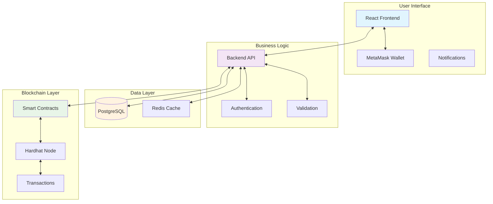

---

## Architecture Design

### System Components

### High-Level Architecture
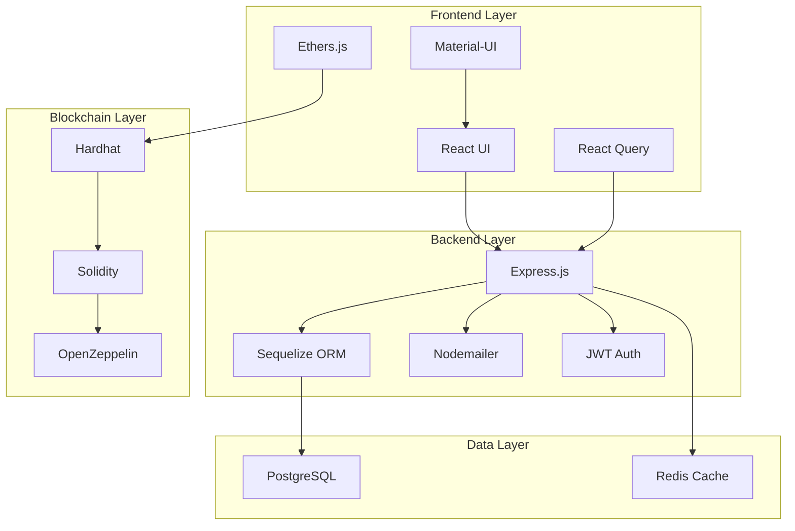

### Technology Stack

#### Frontend
- **React 18**: Modern UI framework
- **Material-UI**: Component library
- **React Query**: Data fetching and caching
- **Ethers.js**: Blockchain interaction
- **React Router**: Navigation

#### Backend
- **Node.js**: Runtime environment
- **Express.js**: Web framework
- **Sequelize**: ORM for PostgreSQL
- **Nodemailer**: Email notifications
- **JWT**: Authentication (planned)

#### Blockchain
- **Hardhat**: Development environment
- **Solidity**: Smart contract language
- **Ethers.js**: Ethereum library
- **OpenZeppelin**: Security contracts

#### Database
- **PostgreSQL**: Primary database
- **Redis**: Caching (planned)

### Data Flow Architecture
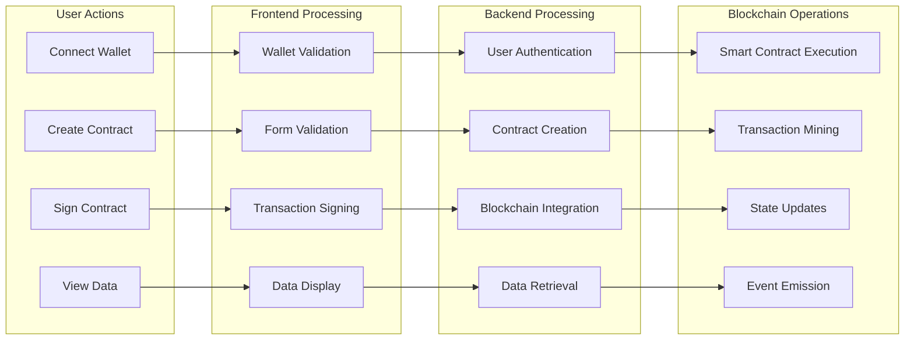

---

## Security Implementation

### Private Key Security Architecture

#### Problem Solved
Traditional blockchain applications often require users to send private keys to servers, creating major security vulnerabilities.

#### Secure Solution
Our system implements **client-side signing** where private keys never leave the user's device:

### Secure Signing Flow
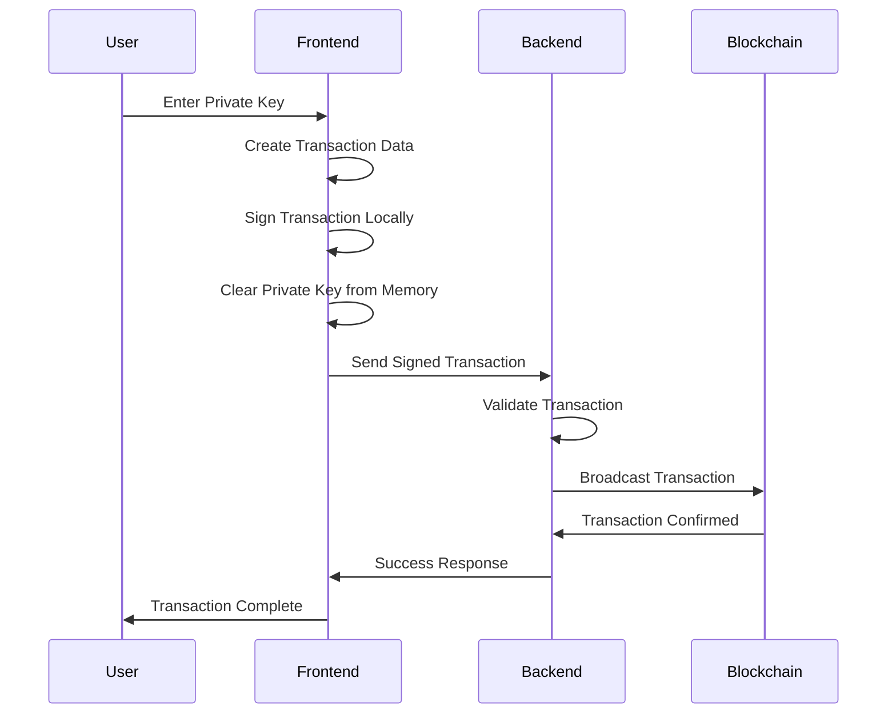

#### Security Features

1. **Client-Side Signing**
   - Private keys never transmitted over network
   - All cryptographic operations happen in browser
   - Memory is cleared after signing

2. **Transaction Broadcasting**
   - Backend only receives signed transactions
   - No access to private keys or signing process
   - Validates transaction before broadcasting

3. **Smart Contract Security**
   - Role-based access control
   - Multi-signature requirements
   - Immutable contract terms

4. **Network Security**
   - HTTPS encryption for all communications
   - Rate limiting on API endpoints
   - Input validation and sanitization

### Security Architecture
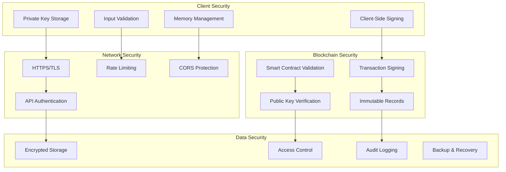

---

## User Guide

### Getting Started

#### Prerequisites
- Modern web browser (Chrome, Firefox, Safari, Edge)
- MetaMask or similar wallet (for production)
- Valid email address

#### System Requirements
- **Blockchain Node**: Running on port 8545
- **Backend Server**: Running on port 5001
- **Frontend**: Running on port 3000
- **Database**: PostgreSQL running

### User Roles & Permissions

#### TDP (Trusted Data Provider)
**Responsibilities:**
- Upload and manage datasets
- Create contract proposals
- Sign contracts as data provider
- Receive payments

**Permissions:**
- Create datasets
- Initiate contracts
- Sign contracts as TDP
- View own contracts and datasets

#### TDC (Trusted Data Consumer)
**Responsibilities:**
- Browse available datasets
- Accept contract proposals
- Sign contracts as consumer
- Pay for data access

**Permissions:**
- Browse public datasets
- Accept contracts
- Sign contracts as TDC
- Select CCRP for contracts
- View own contracts

#### CCRP (Certified Contract Review Party)
**Responsibilities:**
- Review contract terms
- Validate legal compliance
- Sign contracts as reviewer
- Provide oversight

**Permissions:**
- Review contract details
- Sign contracts as CCRP
- View assigned contracts
- Provide compliance feedback

### Role-Based Workflow
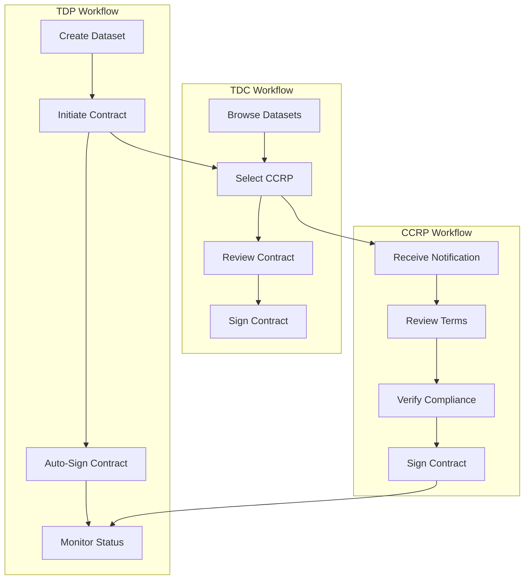

### Contract Creation Workflow

#### Step 1: Dataset Selection
1. Navigate to **Datasets** page
2. Browse available datasets
3. Click on desired dataset
4. Review dataset details and pricing

#### Step 2: Contract Creation
1. Click **"Create Contract"** button
2. Fill in contract details:
   - **Duration**: How long data access is needed
   - **Terms & Conditions**: Custom terms (optional)
   - **Price**: Agreed upon price
3. Click **"Next"** to proceed

#### Step 3: Party Selection
1. **TDP**: Automatically selected (dataset owner)
2. **TDC**: Automatically selected (current user)
3. **CCRP**: Select from available CCRP users
4. Review all party information
5. Click **"Next"** to proceed

#### Step 4: Contract Review
1. Review complete contract details:
   - Parties involved
   - Dataset information
   - Terms and conditions
   - Pricing
2. Verify all information is correct
3. Click **"Create Contract"** to submit

#### Step 5: Contract Signing
1. **TDP Signs First**:
   - Navigate to contract detail page
   - Click **"Sign Contract"** button
   - Enter private key when prompted
   - Confirm signing

2. **TDC Signs Second**:
   - Navigate to contract detail page
   - Click **"Sign Contract"** button
   - Enter private key when prompted
   - Confirm signing

3. **CCRP Signs Last**:
   - CCRP receives notification
   - Reviews contract terms
   - Signs with private key
   - Contract becomes active

### Contract Lifecycle
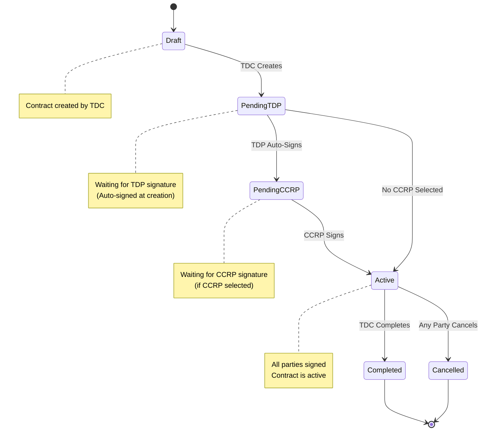

### Contract Management

#### Viewing Contracts
1. Navigate to **Contracts** page
2. View list of all contracts you're involved in
3. Filter by status: Draft, Pending, Active, Completed, Cancelled
4. Click on contract to view details

#### Contract Details Page
The contract detail page shows:
- **Contract Information**: ID, status, creation date
- **Parties**: TDP, TDC, CCRP details
- **Dataset**: Information about the data being shared
- **Terms**: Duration, price, conditions
- **Signing Status**: Who has signed and when
- **Actions**: Available actions based on your role

#### Contract Actions

**For TDP:**
- Sign contract (if not signed)
- View payment status
- Cancel contract (if in draft)

**For TDC:**
- Sign contract (if TDP has signed)
- Select CCRP (if not selected)
- Complete contract (if all parties signed)

**For CCRP:**
- Sign contract (if TDP and TDC have signed)
- Review contract terms
- Provide feedback

### Contract Management Interface
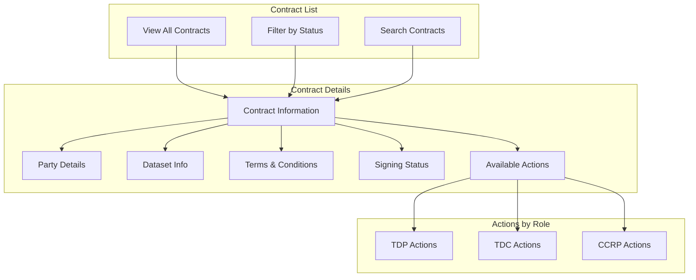

### Dataset Management

#### Creating Datasets (TDP Only)
1. Navigate to **Datasets** page
2. Click **"Create Dataset"** button
3. Fill in dataset information:
   - **Name**: Descriptive name
   - **Description**: Detailed description
   - **Category**: Data category
   - **Price**: Cost per access
   - **License**: Usage terms
   - **Tags**: Searchable keywords
4. Upload dataset file (if applicable)
5. Set visibility (public/private)
6. Click **"Create Dataset"**

#### Managing Datasets
- Edit dataset information
- Update pricing
- Change visibility settings
- View usage statistics
- Delete datasets (if no active contracts)

### Dataset Management Flow
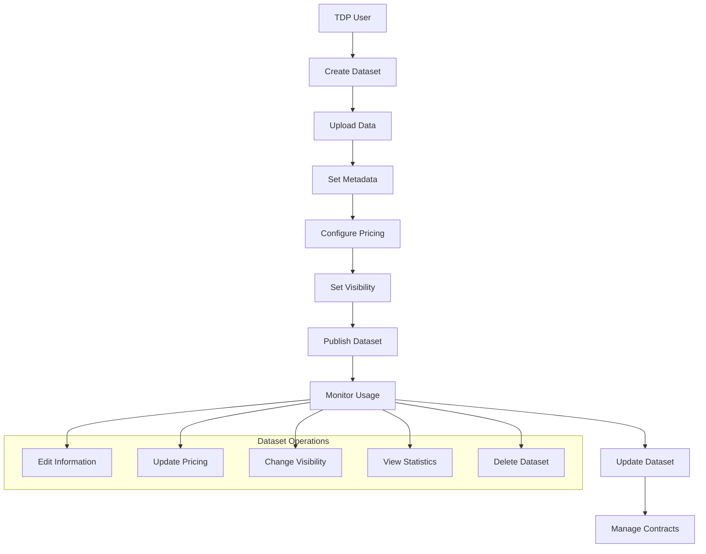

### Notifications

#### Email Notifications
The system sends email notifications for:
- Contract creation
- Contract signing events
- Contract completion
- Payment confirmations
- System updates

#### In-App Notifications
- Real-time notifications in the UI
- Notification counter in header
- Click to view notification details
- Mark as read functionality

### Notification System
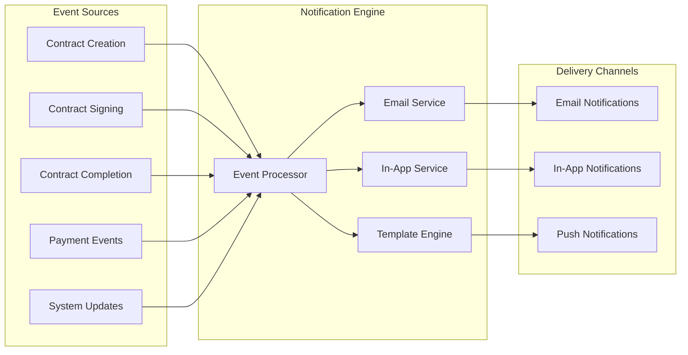

---

## Technical Documentation

### API Endpoints

#### Contract Endpoints
```
GET    /api/contracts/user/:userId     - Get user's contracts
GET    /api/contracts/:contractId      - Get contract details
POST   /api/contracts                  - Create new contract
GET    /api/contracts/:id/signing-data - Get signing transaction data
POST   /api/contracts/:id/sign         - Sign contract (secure)
POST   /api/contracts/:id/select-ccrp  - Select CCRP (secure)
POST   /api/contracts/:id/complete     - Complete contract
POST   /api/contracts/:id/cancel       - Cancel contract
```

#### Dataset Endpoints
```
GET    /api/datasets/public            - Get public datasets
GET    /api/datasets/:id               - Get dataset details
POST   /api/datasets                   - Create dataset
PUT    /api/datasets/:id               - Update dataset
DELETE /api/datasets/:id               - Delete dataset
```

#### User Endpoints
```
GET    /api/users                      - Get all users
GET    /api/users/:id                  - Get user details
POST   /api/users                      - Create user
PUT    /api/users/:id                  - Update user
```

### API Architecture
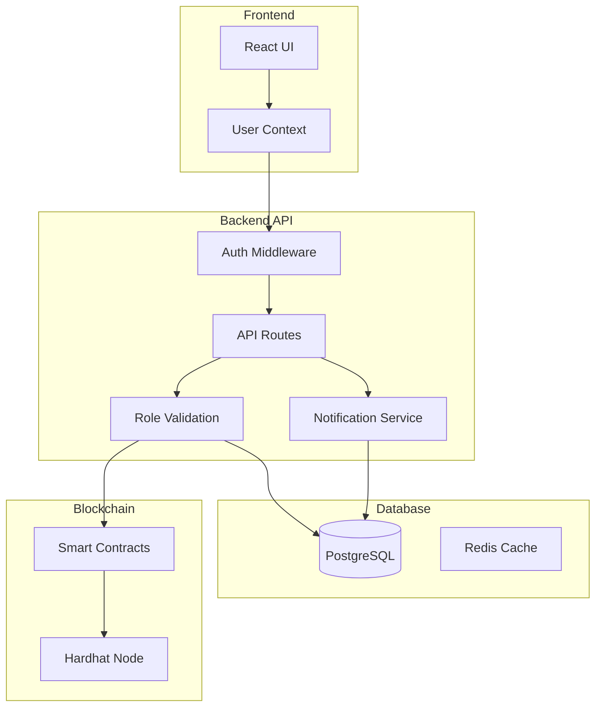

### Smart Contract Functions

#### ContractManager.sol
```solidity
// Contract Creation
function createContract(
    address tdp,
    address tdc,
    address ccrp,
    uint256 price,
    uint256 duration,
    string memory terms
) external returns (uint256 contractId)

// Contract Signing
function signContract(uint256 contractId) external

// Contract Management
function completeContract(uint256 contractId) external
function cancelContract(uint256 contractId) external

// Party Registration
function registerParty(address party, string memory partyType) external
function isRegisteredParty(address party) external view returns (bool)
```

### Smart Contract Architecture
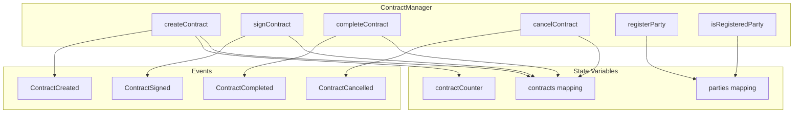

### Database Schema

#### Users Table
```sql
CREATE TABLE users (
    id SERIAL PRIMARY KEY,
    wallet_address VARCHAR(42) UNIQUE NOT NULL,
    party_type ENUM('TDP', 'TDC', 'CCRP') NOT NULL,
    name VARCHAR(255) NOT NULL,
    email VARCHAR(255) UNIQUE NOT NULL,
    description TEXT,
    is_registered BOOLEAN DEFAULT false,
    registration_date TIMESTAMP DEFAULT CURRENT_TIMESTAMP,
    is_active BOOLEAN DEFAULT true,
    created_at TIMESTAMP DEFAULT CURRENT_TIMESTAMP,
    updated_at TIMESTAMP DEFAULT CURRENT_TIMESTAMP
);
```

#### Contracts Table
```sql
CREATE TABLE contracts (
    id SERIAL PRIMARY KEY,
    contract_id VARCHAR(255) UNIQUE NOT NULL,
    blockchain_contract_id BIGINT,
    status ENUM('draft', 'pending', 'active', 'completed', 'cancelled') DEFAULT 'draft',
    price DECIMAL(10,2) NOT NULL,
    duration INTEGER NOT NULL,
    terms_and_conditions TEXT,
    model_id VARCHAR(255),
    tdp_signed BOOLEAN DEFAULT false,
    ccrp_signed BOOLEAN DEFAULT false,
    tdp_signed_at TIMESTAMP,
    ccrp_signed_at TIMESTAMP,
    tdp_id INTEGER REFERENCES users(id),
    tdc_id INTEGER REFERENCES users(id),
    ccrp_id INTEGER REFERENCES users(id),
    dataset_id INTEGER REFERENCES datasets(id),
    created_at TIMESTAMP DEFAULT CURRENT_TIMESTAMP,
    updated_at TIMESTAMP DEFAULT CURRENT_TIMESTAMP
);
```

#### Datasets Table
```sql
CREATE TABLE datasets (
    id SERIAL PRIMARY KEY,
    dataset_id VARCHAR(255) UNIQUE NOT NULL,
    name VARCHAR(255) NOT NULL,
    description TEXT,
    category VARCHAR(100),
    size BIGINT,
    record_count INTEGER,
    price DECIMAL(10,2) NOT NULL,
    license VARCHAR(255),
    tags TEXT[],
    metadata JSONB,
    is_public BOOLEAN DEFAULT true,
    is_active BOOLEAN DEFAULT true,
    owner_id INTEGER REFERENCES users(id),
    created_at TIMESTAMP DEFAULT CURRENT_TIMESTAMP,
    updated_at TIMESTAMP DEFAULT CURRENT_TIMESTAMP
);
```

### Database Schema Diagram
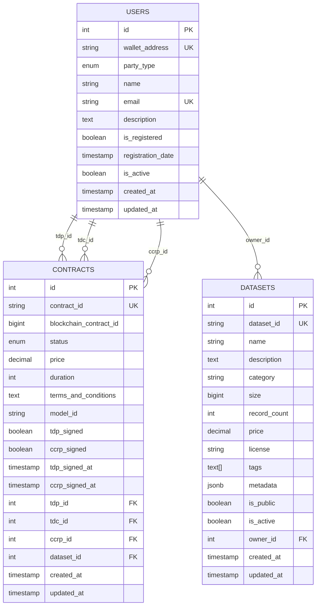

### Security Best Practices

#### For Users
1. **Private Key Management**
   - Never share private keys
   - Use hardware wallets for large amounts
   - Keep private keys in secure storage
   - Use different keys for different purposes

2. **Transaction Verification**
   - Always verify transaction details before signing
   - Check gas fees and network
   - Confirm recipient addresses
   - Review contract terms carefully

3. **Account Security**
   - Use strong passwords
   - Enable two-factor authentication
   - Regularly update software
   - Be cautious of phishing attempts

#### For Developers
1. **Code Security**
   - Input validation and sanitization
   - SQL injection prevention
   - XSS protection
   - CSRF protection

2. **Network Security**
   - HTTPS encryption
   - Rate limiting
   - DDoS protection
   - Firewall configuration

3. **Data Protection**
   - Encrypt sensitive data
   - Regular backups
   - Access logging
   - Data retention policies

### Security Best Practices Flow
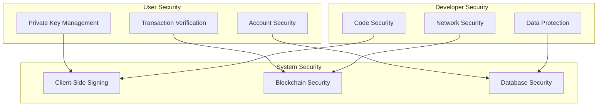

---

## Troubleshooting

### Common Issues

#### 1. "Failed to create contract" Error
**Symptoms:**
- Error message when creating contract
- Contract not appearing in list

**Causes:**
- Blockchain node not running
- Network connectivity issues
- Invalid contract parameters

**Solutions:**
1. Check if blockchain node is running on port 8545
2. Verify network connectivity
3. Check contract parameters
4. Restart blockchain node if needed

#### 2. "Private key is invalid" Error
**Symptoms:**
- Error when signing contracts
- Transaction fails

**Causes:**
- Incorrect private key format
- Private key doesn't match wallet address
- Network mismatch

**Solutions:**
1. Verify private key format (0x...)
2. Ensure private key matches wallet address
3. Check if using correct network
4. Try copying private key again

#### 3. "Transaction failed" Error
**Symptoms:**
- Transaction appears to fail
- Contract status doesn't update

**Causes:**
- Insufficient gas fees
- Network congestion
- Invalid transaction parameters

**Solutions:**
1. Increase gas limit
2. Wait for network congestion to clear
3. Verify transaction parameters
4. Check blockchain explorer for details

#### 4. "Connection refused" Error
**Symptoms:**
- Can't connect to backend
- API calls fail

**Causes:**
- Backend server not running
- Port conflicts
- Firewall blocking

**Solutions:**
1. Start backend server
2. Check for port conflicts
3. Verify firewall settings
4. Restart services

### Troubleshooting Decision Tree
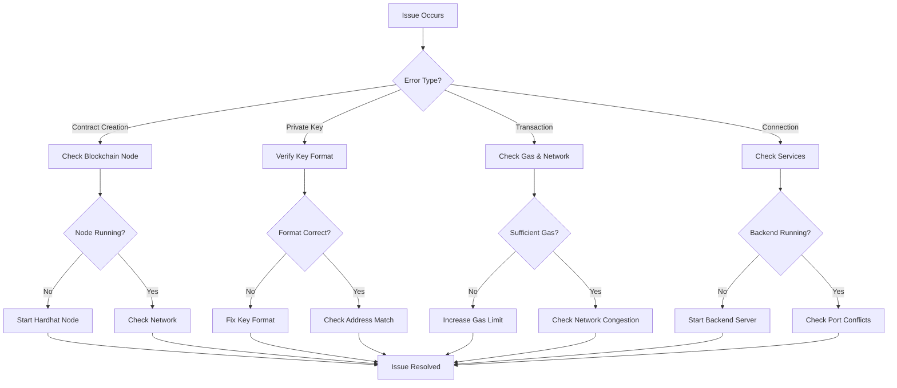

### Service Startup Order

For proper system operation, start services in this order:

1. **Database** (PostgreSQL)
2. **Blockchain Node** (Hardhat)
3. **Backend Server** (Node.js)
4. **Frontend** (React)

### Service Startup Sequence
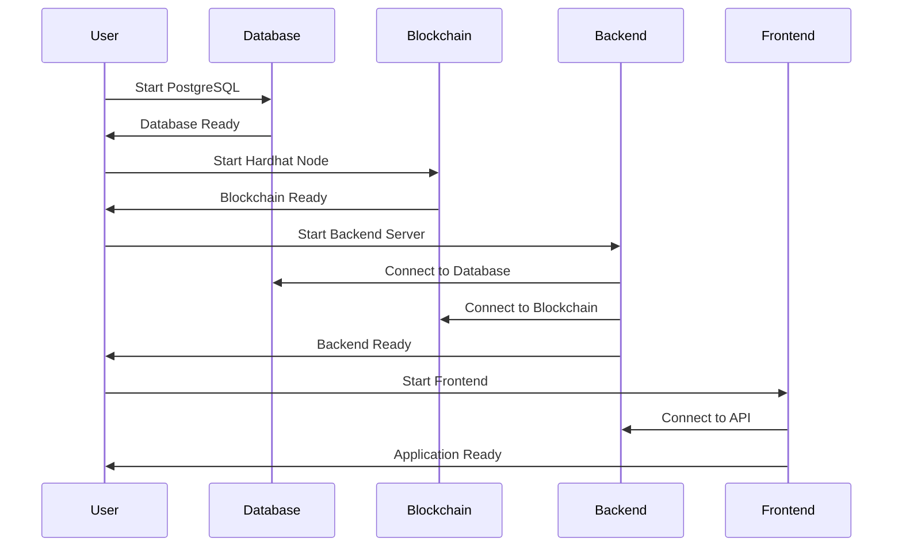

### Health Checks

#### Backend Health
```bash
curl http://localhost:5001/health
```

Expected response:
```json
{
  "status": "healthy",
  "database": "connected",
  "blockchain": "connected",
  "timestamp": "2024-01-01T00:00:00.000Z"
}
```

#### Blockchain Health
```bash
curl -X POST http://localhost:8545 \
  -H "Content-Type: application/json" \
  -d '{"jsonrpc":"2.0","method":"eth_blockNumber","params":[],"id":1}'
```

Expected response:
```json
{
  "jsonrpc": "2.0",
  "id": 1,
  "result": "0x1"
}
```

### Health Check Flow
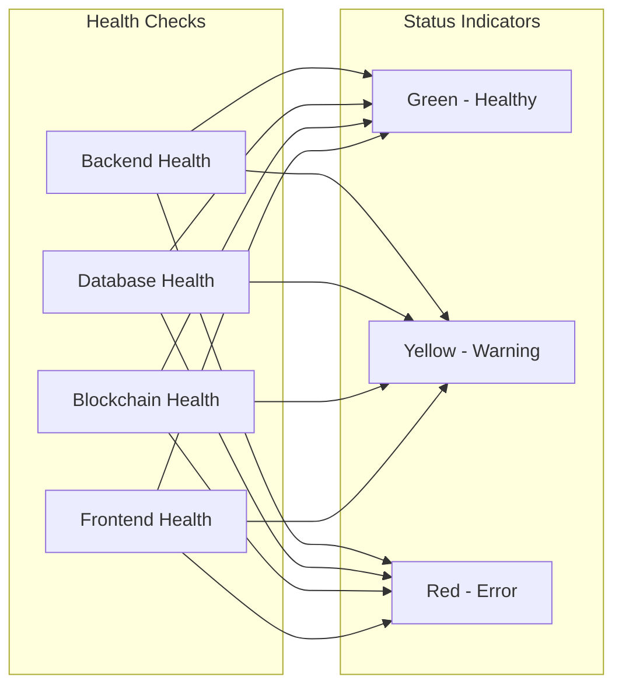

### Log Analysis

#### Backend Logs
Look for these key messages:
- `Database connection established successfully`
- `Blockchain connection test successful`
- `Server is running on port 5001`

#### Blockchain Logs
Look for these key messages:
- `Started HTTP and WebSocket JSON-RPC server`
- `Account #0: 0xf39Fd6e51aad88F6F4ce6aB8827279cffFb92266`

#### Frontend Logs
Look for these key messages:
- `Compiled successfully`
- `Local: http://localhost:3000`

### Performance Optimization

#### Database Optimization
1. **Indexing**
   - Add indexes on frequently queried columns
   - Use composite indexes for complex queries
   - Monitor query performance

2. **Connection Pooling**
   - Configure appropriate pool size
   - Monitor connection usage
   - Implement connection timeouts

#### Blockchain Optimization
1. **Gas Optimization**
   - Optimize smart contract functions
   - Use appropriate gas limits
   - Batch transactions when possible

2. **Network Optimization**
   - Use local Hardhat network for development
   - Configure appropriate block times
   - Monitor network performance

#### Frontend Optimization
1. **Caching**
   - Implement React Query caching
   - Use browser caching
   - Optimize bundle size

2. **Performance Monitoring**
   - Monitor page load times
   - Track API response times
   - Implement error tracking

### Performance Monitoring
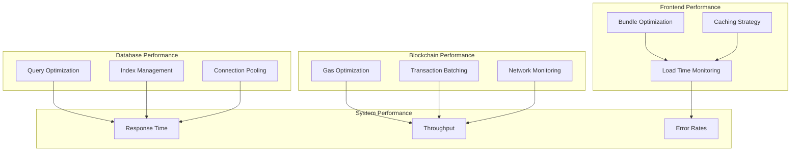

---

## Conclusion

The Secure Contract Management System provides a robust, secure, and user-friendly platform for managing blockchain-based contracts. The client-side signing architecture ensures maximum security while maintaining ease of use.

### Key Benefits
- **Security**: Private keys never leave user devices
- **Transparency**: All actions recorded on blockchain
- **Efficiency**: Streamlined contract workflow
- **Compliance**: Built-in audit trails and notifications
- **Scalability**: Modular architecture for future growth

### Future Enhancements
- **Multi-chain Support**: Support for multiple blockchain networks
- **Advanced Analytics**: Contract performance metrics
- **Mobile App**: Native mobile application

### System Benefits Overview
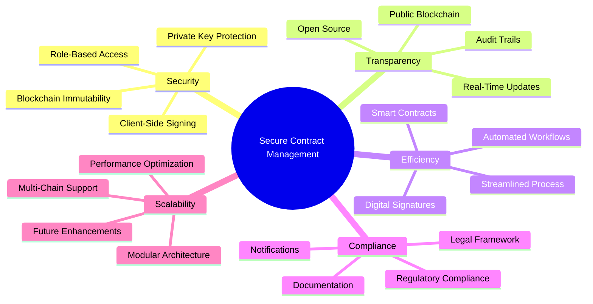

For technical support or questions, please refer to the troubleshooting section or contact the development team. 