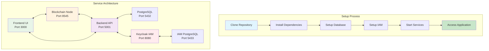
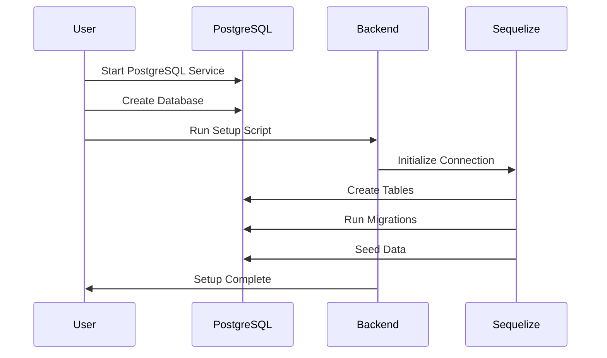
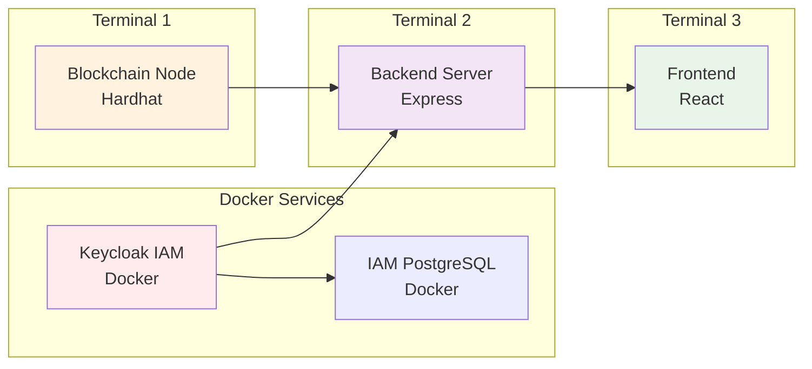

# Setup Guide
## Contract Management System

Complete installation and configuration guide for the Contract Management System.

## 📋 Prerequisites

Before starting, ensure you have:
- **Node.js** (v18 or higher)
- **PostgreSQL** (v12 or higher)
- **Docker** and **Docker Compose** (for IAM integration)
- **Git** (for cloning the repository)
- **MetaMask** browser extension (see [Wallet Guide](./WALLET_GUIDE.md))

## 🚀 Quick Setup (5 Minutes)

### Step 1: Clone and Install
```bash
# Clone the repository
git clone <repository-url>
cd ContractManagement

# Install all dependencies
npm install
cd backend && npm install
cd ../frontend && npm install
cd ../blockchain && npm install
cd ..
```

### Step 2: Database Setup
```bash
# Start PostgreSQL (if not already running)
# On macOS with Homebrew:
brew services start postgresql

# On Ubuntu/Debian:
sudo systemctl start postgresql

# Create database
createdb contract_management

# Run database setup
cd backend
npm run setup-db
```

### Step 3: IAM Setup (Keycloak)
```bash
# Start Keycloak and PostgreSQL for IAM
docker-compose -f docker-compose.iam.yml up -d

# Wait for services to be ready (about 30 seconds)
sleep 30

# Setup Keycloak realm and users
cd backend
npm run setup-keycloak

# Add IAM fields to database
npm run migrate-iam
```

**Expected Output:**
```
Creating keycloak_postgres_1 ... done
Creating keycloak_keycloak_1 ... done
Keycloak realm 'contract-management' created successfully
Keycloak client 'contract-management-client' created successfully
Keycloak roles created successfully
IAM migration completed successfully
```

### Step 4: Start Services
Open **3 terminal windows** and run:

**Terminal 1: Blockchain Node**
```bash
cd blockchain
npx hardhat node
```
**Expected Output:**
```
Started HTTP and WebSocket JSON-RPC server at http://127.0.0.1:8545/
Accounts
========
Account #0: 0xf39Fd6e51aad88F6F4ce6aB8827279cffFb92266 (10000 ETH)
Private Key: 0xac0974bec39a17e36ba4a6b4d238ff944bacb478cbed5efcae784d7bf4f2ff80
...
```

**Terminal 2: Backend Server**
```bash
cd backend
npm run dev
```
**Expected Output:**
```
Database connection established successfully.
Blockchain connection test successful. Current block: 0
Blockchain service initialized successfully
Server is running on port 5001
```

**Terminal 3: Frontend**
```bash
cd frontend
npm start
```
**Expected Output:**
```
Compiled successfully!
You can now view contract-management-frontend in the browser.
Local: http://localhost:3000
```

### Step 5: Access Application
1. Open browser: **http://localhost:3000**
2. Connect MetaMask (see [Wallet Guide](./WALLET_GUIDE.md))
3. Import test wallets (see [Test Wallets](./TEST_WALLETS.md))
4. **Keycloak Admin Console**: **http://localhost:8080/admin** (admin/admin123)

## 🔧 Detailed Setup

### System Architecture


### Database Setup Process


### Service Startup Sequence


## ⚙️ Configuration

### Environment Variables

**Backend Configuration** (`backend/.env`)
```env
# Database
DB_HOST=localhost
DB_PORT=5432
DB_NAME=contract_management
DB_USER=your_username
DB_PASSWORD=your_password

# IAM (Keycloak)
KEYCLOAK_URL=http://localhost:8080
KEYCLOAK_REALM=contract-management
KEYCLOAK_CLIENT_ID=contract-management-client
KEYCLOAK_CLIENT_SECRET=your_client_secret
KEYCLOAK_ADMIN_USERNAME=admin
KEYCLOAK_ADMIN_PASSWORD=admin123

# JWT
JWT_SECRET=your_jwt_secret_key_here

# Blockchain
BLOCKCHAIN_URL=http://localhost:8545
CONTRACT_ADDRESS=your_deployed_contract_address

# Email (optional)
SMTP_HOST=smtp.gmail.com
SMTP_PORT=587
SMTP_USER=your_email@gmail.com
SMTP_PASS=your_app_password
```

**Frontend Configuration** (`frontend/.env`)
```env
REACT_APP_API_URL=http://localhost:5001
REACT_APP_BLOCKCHAIN_URL=http://localhost:8545
REACT_APP_CONTRACT_ADDRESS=your_deployed_contract_address
```

**Blockchain Configuration** (`blockchain/.env`)
```env
PRIVATE_KEY=your_deployment_private_key
```

### Network Configuration

**MetaMask Network Settings:**
- **Network Name**: Local Hardhat
- **New RPC URL**: http://127.0.0.1:8545
- **Chain ID**: 31337
- **Currency Symbol**: ETH

## 🧪 Testing Setup

### Run All Tests
```bash
# Backend tests
cd backend
npm test

# Blockchain tests
cd blockchain
npx hardhat test

# Frontend tests
cd frontend
npm test
```

### Test Coverage
```bash
# Backend coverage
cd backend
npm run test:coverage

# Blockchain coverage
cd blockchain
npx hardhat coverage
```

## 🐳 Docker Setup (Optional)

### Docker Compose
```yaml
# docker-compose.yml
version: '3.8'
services:
  postgres:
    image: postgres:13
    environment:
      POSTGRES_DB: contract_management
      POSTGRES_USER: postgres
      POSTGRES_PASSWORD: password
    ports:
      - "5432:5432"
    volumes:
      - postgres_data:/var/lib/postgresql/data

  backend:
    build: ./backend
    ports:
      - "5001:5001"
    depends_on:
      - postgres
    environment:
      DB_HOST: postgres
      DB_USER: postgres
      DB_PASSWORD: password

  frontend:
    build: ./frontend
    ports:
      - "3000:3000"
    depends_on:
      - backend

volumes:
  postgres_data:
```

### Docker Commands
```bash
# Build and start
docker-compose up -d

# View logs
docker-compose logs -f

# Stop services
docker-compose down
```

## 🔍 Troubleshooting

### Common Issues

**Port Already in Use**
```bash
# Kill processes on ports
lsof -ti:3000 | xargs kill -9
lsof -ti:5001 | xargs kill -9
lsof -ti:8545 | xargs kill -9
```

**Database Connection Failed**
```bash
# Check PostgreSQL status
brew services list | grep postgresql
sudo systemctl status postgresql

# Restart PostgreSQL
brew services restart postgresql
sudo systemctl restart postgresql
```

**Blockchain Node Not Starting**
```bash
# Check if port is available
netstat -an | grep 8545

# Kill existing Hardhat processes
pkill -f "hardhat node"
```

**Frontend Build Errors**
```bash
# Clear cache and reinstall
cd frontend
rm -rf node_modules package-lock.json
npm install
```

### Verification Steps

1. **Database**: Check connection in backend logs
2. **Blockchain**: Verify Hardhat node is running on port 8545
3. **Backend**: Confirm API is accessible at http://localhost:5001
4. **Frontend**: Verify React app loads at http://localhost:3000
5. **MetaMask**: Ensure connected to local network (Chain ID: 31337)

## 📚 Next Steps

After setup:
1. **Import Test Wallets**: See [Test Wallets](./TEST_WALLETS.md)
2. **Connect MetaMask**: See [Wallet Guide](./WALLET_GUIDE.md)
3. **Learn the System**: See [User Guide](./USER_GUIDE.md)
4. **Understand Architecture**: See [Architecture Guide](./ARCHITECTURE_GUIDE.md)

## 🆘 Support

If you encounter issues:
1. Check the troubleshooting section above
2. Review the logs for error messages
3. Ensure all prerequisites are installed
4. Create an issue on GitHub with detailed error information 