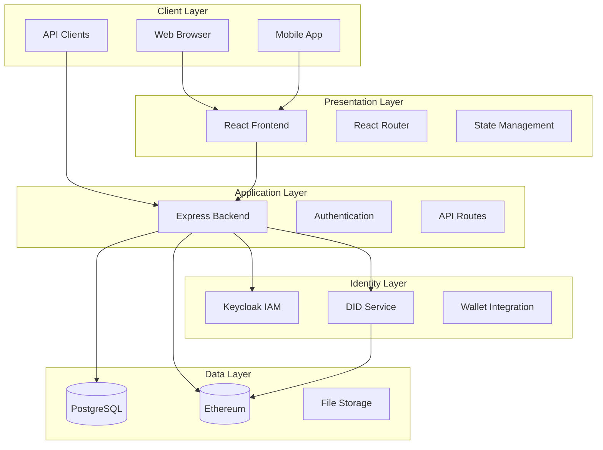

# Contract Management System - Comprehensive Training Course

## Course Overview

This training course covers the complete Contract Management System, a blockchain-based platform with DID support, IAM integration, and enterprise-grade security. The course is structured from fundamental concepts to advanced implementations.

**Duration**: 40-50 hours  
**Prerequisites**: Basic JavaScript, React, Node.js, and blockchain concepts  
**Target Audience**: Developers, DevOps engineers, and system architects

---

## Table of Contents

1. [Module 1: Fundamentals & Architecture](#module-1-fundamentals--architecture)
2. [Module 2: Backend Development](#module-2-backend-development)
3. [Module 3: Frontend Development](#module-3-frontend-development)
4. [Module 4: Blockchain Integration](#module-4-blockchain-integration)
5. [Module 5: Identity & Access Management](#module-5-identity--access-management)
6. [Module 6: Security & Testing](#module-6-security--testing)
7. [Module 7: Deployment & DevOps](#module-7-deployment--devops)
8. [Module 8: Advanced Topics](#module-8-advanced-topics)

---

## Module 1: Fundamentals & Architecture

### 1.1 System Overview

#### What is Contract Management?
Contract management involves the creation, execution, monitoring, and enforcement of agreements between parties. In the digital age, this includes:
- **Digital Signatures**: Cryptographic verification of document authenticity
- **Smart Contracts**: Self-executing agreements on blockchain
- **Multi-party Workflows**: Coordinated approval processes
- **Compliance Tracking**: Regulatory and audit requirements

#### Real-World Use Cases
1. **AI Training Data Contracts**: Managing data licensing agreements
2. **Supply Chain Agreements**: Multi-party procurement contracts
3. **Financial Services**: Loan agreements and derivatives
4. **Healthcare**: Patient data sharing agreements
5. **Real Estate**: Property transaction contracts

#### Key Technologies
- **Blockchain**: Ethereum for smart contract execution
- **DIDs**: Decentralized identifiers for identity management
- **IAM**: Keycloak for enterprise identity management
- **Web3**: Blockchain interaction protocols

### 1.2 System Architecture



### 1.3 Core Components

#### Frontend (React)
- **Technology Stack**: React 18, Material-UI, React Router
- **State Management**: React Context + Hooks
- **Web3 Integration**: Ethers.js
- **HTTP Client**: Axios

#### Backend (Node.js/Express)
- **Framework**: Express.js with middleware
- **Database**: PostgreSQL with Sequelize ORM
- **Authentication**: JWT with Keycloak
- **Blockchain**: Web3.js integration

#### Blockchain (Ethereum)
- **Smart Contracts**: Solidity with OpenZeppelin
- **Development**: Hardhat framework
- **Networks**: Local, Testnet, Mainnet

#### Identity Management
- **IAM**: Keycloak for enterprise users
- **DIDs**: Decentralized identifiers
- **Wallets**: MetaMask integration

---

## Module 2: Backend Development

### 2.1 Express.js Fundamentals

#### Project Structure
```
backend/
├── server.js              # Main application entry
├── middleware/            # Custom middleware
├── models/               # Database models
├── routes/               # API route handlers
├── services/             # Business logic
├── scripts/              # Database scripts
└── tests/                # Test files
```

#### Key Dependencies
```json
{
  "express": "^4.18.2",
  "sequelize": "^6.35.0",
  "pg": "^8.11.3",
  "jsonwebtoken": "^9.0.2",
  "bcryptjs": "^2.4.3",
  "ethers": "^6.15.0",
  "axios": "^1.6.0"
}
```

### 2.2 Database Design

#### Core Models

**User Model**
```javascript
{
  id: UUID (Primary Key),
  email: String (Unique),
  username: String,
  publicKey: String,
  did: String,
  didVerified: Boolean,
  role: Enum ['TDP', 'TDC', 'CCRP'],
  iamUserId: String,
  createdAt: Timestamp,
  updatedAt: Timestamp
}
```

**Contract Model**
```javascript
{
  id: UUID (Primary Key),
  title: String,
  description: Text,
  status: Enum ['DRAFT', 'PENDING', 'SIGNED', 'COMPLETED'],
  tdpId: UUID (Foreign Key),
  tdcId: UUID (Foreign Key),
  ccrpId: UUID (Foreign Key),
  blockchainHash: String,
  createdAt: Timestamp,
  updatedAt: Timestamp
}
```

**Dataset Model**
```javascript
{
  id: UUID (Primary Key),
  name: String,
  description: Text,
  ownerId: UUID (Foreign Key),
  metadata: JSON,
  status: Enum ['ACTIVE', 'INACTIVE'],
  createdAt: Timestamp,
  updatedAt: Timestamp
}
```

### 2.3 API Design

#### RESTful Endpoints

**Authentication**
- `POST /api/auth/register` - User registration
- `POST /api/auth/login` - User login
- `POST /api/auth/logout` - User logout
- `GET /api/auth/verify` - Token verification

**Contracts**
- `GET /api/contracts` - List contracts
- `POST /api/contracts` - Create contract
- `GET /api/contracts/:id` - Get contract details
- `PUT /api/contracts/:id` - Update contract
- `POST /api/contracts/:id/sign` - Sign contract

**Users**
- `GET /api/users` - List users
- `GET /api/users/:id` - Get user details
- `PUT /api/users/:id` - Update user
- `POST /api/users/wallet/connect` - Connect wallet

**Datasets**
- `GET /api/datasets` - List datasets
- `POST /api/datasets` - Create dataset
- `GET /api/datasets/:id` - Get dataset details
- `PUT /api/datasets/:id` - Update dataset

### 2.4 Authentication & Authorization

#### JWT Implementation
```javascript
// Token generation
const token = jwt.sign(
  { userId: user.id, role: user.role },
  process.env.JWT_SECRET,
  { expiresIn: '24h' }
);

// Token verification middleware
const verifyToken = (req, res, next) => {
  const token = req.headers.authorization?.split(' ')[1];
  if (!token) return res.status(401).json({ error: 'No token provided' });
  
  try {
    const decoded = jwt.verify(token, process.env.JWT_SECRET);
    req.user = decoded;
    next();
  } catch (error) {
    res.status(401).json({ error: 'Invalid token' });
  }
};
```

#### Role-Based Access Control
```javascript
const requireRole = (roles) => {
  return (req, res, next) => {
    if (!req.user) {
      return res.status(401).json({ error: 'Authentication required' });
    }
    
    if (!roles.includes(req.user.role)) {
      return res.status(403).json({ error: 'Insufficient permissions' });
    }
    
    next();
  };
};
```

### 2.5 Error Handling

#### Global Error Handler
```javascript
app.use((error, req, res, next) => {
  console.error(error.stack);
  
  if (error.name === 'SequelizeValidationError') {
    return res.status(400).json({
      error: 'Validation Error',
      details: error.errors.map(e => ({
        field: e.path,
        message: e.message
      }))
    });
  }
  
  res.status(500).json({
    error: 'Internal Server Error',
    message: process.env.NODE_ENV === 'development' ? error.message : 'Something went wrong'
  });
});
```

---

## Module 3: Frontend Development

### 3.1 React Fundamentals

#### Project Structure
```
frontend/src/
├── components/           # Reusable UI components
├── pages/               # Page components
├── contexts/            # React contexts
├── services/            # API services
├── utils/               # Utility functions
└── styles/              # CSS/styling
```

#### Key Dependencies
```json
{
  "react": "^18.2.0",
  "@mui/material": "^5.14.20",
  "@mui/icons-material": "^5.14.19",
  "react-router-dom": "^6.20.1",
  "ethers": "^6.15.0",
  "axios": "^1.6.2",
  "react-query": "^3.39.3"
}
```

### 3.2 Component Architecture

#### Layout Components
```javascript
// Layout.js - Main application layout
const Layout = ({ children }) => {
  return (
    <div className="app">
      <Header />
      <Sidebar />
      <main className="main-content">
        {children}
      </main>
      <Footer />
    </div>
  );
};
```

#### State Management
```javascript
// UserContext.js - Global user state
const UserContext = createContext();

export const UserProvider = ({ children }) => {
  const [user, setUser] = useState(null);
  const [loading, setLoading] = useState(true);
  
  const login = async (credentials) => {
    // Login logic
  };
  
  const logout = () => {
    // Logout logic
  };
  
  return (
    <UserContext.Provider value={{ user, login, logout, loading }}>
      {children}
    </UserContext.Provider>
  );
};
```

### 3.3 API Integration

#### API Service Layer
```javascript
// api.js - Centralized API calls
const api = axios.create({
  baseURL: process.env.REACT_APP_API_URL || 'http://localhost:5001/api',
  timeout: 10000,
});

// Request interceptor for authentication
api.interceptors.request.use((config) => {
  const token = localStorage.getItem('token');
  if (token) {
    config.headers.Authorization = `Bearer ${token}`;
  }
  return config;
});

// Response interceptor for error handling
api.interceptors.response.use(
  (response) => response,
  (error) => {
    if (error.response?.status === 401) {
      // Handle unauthorized access
      localStorage.removeItem('token');
      window.location.href = '/login';
    }
    return Promise.reject(error);
  }
);
```

### 3.4 Web3 Integration

#### Wallet Connection
```javascript
// WalletSwitcher.js - MetaMask integration
const WalletSwitcher = () => {
  const [account, setAccount] = useState(null);
  const [provider, setProvider] = useState(null);
  
  const connectWallet = async () => {
    if (typeof window.ethereum !== 'undefined') {
      try {
        const accounts = await window.ethereum.request({
          method: 'eth_requestAccounts'
        });
        setAccount(accounts[0]);
        
        const provider = new ethers.BrowserProvider(window.ethereum);
        setProvider(provider);
      } catch (error) {
        console.error('Error connecting wallet:', error);
      }
    }
  };
  
  return (
    <Button onClick={connectWallet}>
      {account ? `${account.slice(0, 6)}...${account.slice(-4)}` : 'Connect Wallet'}
    </Button>
  );
};
```

---

## Module 4: Blockchain Integration

### 4.1 Smart Contract Fundamentals

#### Solidity Basics
```solidity
// SPDX-License-Identifier: MIT
pragma solidity ^0.8.0;

import "@openzeppelin/contracts/access/Ownable.sol";
import "@openzeppelin/contracts/security/ReentrancyGuard.sol";

contract ContractManager is Ownable, ReentrancyGuard {
    struct Contract {
        string title;
        string description;
        address tdp;
        address tdc;
        address ccrp;
        ContractStatus status;
        uint256 createdAt;
        mapping(address => bool) signatures;
    }
    
    enum ContractStatus { DRAFT, PENDING, SIGNED, COMPLETED }
    
    mapping(uint256 => Contract) public contracts;
    uint256 public contractCount;
    
    event ContractCreated(uint256 indexed contractId, string title);
    event ContractSigned(uint256 indexed contractId, address signer);
}
```

### 4.2 Contract Lifecycle

#### Contract Creation
```solidity
function createContract(
    string memory _title,
    string memory _description,
    address _tdp,
    address _tdc,
    address _ccrp
) public returns (uint256) {
    contractCount++;
    Contract storage newContract = contracts[contractCount];
    
    newContract.title = _title;
    newContract.description = _description;
    newContract.tdp = _tdp;
    newContract.tdc = _tdc;
    newContract.ccrp = _ccrp;
    newContract.status = ContractStatus.DRAFT;
    newContract.createdAt = block.timestamp;
    
    emit ContractCreated(contractCount, _title);
    return contractCount;
}
```

#### Contract Signing
```solidity
function signContract(uint256 _contractId) public {
    Contract storage contract = contracts[_contractId];
    require(contract.status != ContractStatus.COMPLETED, "Contract already completed");
    require(
        msg.sender == contract.tdp ||
        msg.sender == contract.tdc ||
        msg.sender == contract.ccrp,
        "Not authorized to sign"
    );
    
    contract.signatures[msg.sender] = true;
    emit ContractSigned(_contractId, msg.sender);
    
    // Check if all parties have signed
    if (contract.signatures[contract.tdp] &&
        contract.signatures[contract.tdc] &&
        contract.signatures[contract.ccrp]) {
        contract.status = ContractStatus.SIGNED;
    }
}
```

### 4.3 Backend Integration

#### Web3 Service
```javascript
// blockchainService.js
const { ethers } = require('ethers');
const ContractManager = require('../blockchain/artifacts/contracts/ContractManager.sol/ContractManager.json');

class BlockchainService {
  constructor() {
    this.provider = new ethers.JsonRpcProvider(process.env.BLOCKCHAIN_RPC_URL);
    this.contract = new ethers.Contract(
      process.env.CONTRACT_ADDRESS,
      ContractManager.abi,
      this.provider
    );
  }
  
  async createContract(contractData) {
    const tx = await this.contract.createContract(
      contractData.title,
      contractData.description,
      contractData.tdp,
      contractData.tdc,
      contractData.ccrp
    );
    return await tx.wait();
  }
  
  async signContract(contractId, signerAddress) {
    const tx = await this.contract.signContract(contractId);
    return await tx.wait();
  }
}
```

---

## Module 5: Identity & Access Management

### 5.1 DID (Decentralized Identifiers)

#### DID Fundamentals
DIDs are self-sovereign identifiers that enable verifiable digital identity without centralized authorities.

**DID Format**: `did:method:identifier`

**Common DID Methods**:
- `did:web` - Web-based DIDs (GitHub Pages, etc.)
- `did:ethr` - Ethereum-based DIDs
- `did:key` - Simple key-based DIDs

#### DID Document Structure
```json
{
  "@context": ["https://www.w3.org/ns/did/v1"],
  "id": "did:web:github.com:username",
  "verificationMethod": [{
    "id": "did:web:github.com:username#owner",
    "type": "JsonWebKey2020",
    "controller": "did:web:github.com:username",
    "publicKeyJwk": {
      "kty": "EC",
      "crv": "secp256k1",
      "x": "...",
      "y": "..."
    }
  }],
  "assertionMethod": ["did:web:github.com:username#owner"]
}
```

### 5.2 DID Service Implementation

#### DID Resolution
```javascript
// didService.js
class DIDService {
  async resolveDID(did) {
    const [method, identifier] = did.split(':', 2);
    
    switch (method) {
      case 'web':
        return await this.resolveWebDID(identifier);
      case 'ethr':
        return await this.resolveEthrDID(identifier);
      default:
        throw new Error(`Unsupported DID method: ${method}`);
    }
  }
  
  async resolveWebDID(identifier) {
    const url = `https://${identifier}/.well-known/did.json`;
    const response = await axios.get(url);
    return response.data;
  }
  
  async extractPublicKey(didDocument) {
    const verificationMethod = didDocument.verificationMethod?.[0];
    if (!verificationMethod) {
      throw new Error('No verification method found');
    }
    
    return verificationMethod.publicKeyJwk;
  }
}
```

### 5.3 Keycloak Integration

#### Keycloak Configuration
```javascript
// keycloakService.js
const Keycloak = require('keycloak-connect');

class KeycloakService {
  constructor() {
    this.keycloak = new Keycloak({}, {
      realm: 'contract-management',
      'auth-server-url': process.env.KEYCLOAK_URL,
      'ssl-required': 'external',
      resource: 'contract-management-client',
      'public-client': true,
      'confidential-port': 0
    });
  }
  
  async createUser(userData) {
    const token = await this.getAdminToken();
    
    const response = await axios.post(
      `${process.env.KEYCLOAK_URL}/admin/realms/contract-management/users`,
      {
        username: userData.username,
        email: userData.email,
        enabled: true,
        credentials: [{
          type: 'password',
          value: userData.password,
          temporary: false
        }]
      },
      {
        headers: {
          'Authorization': `Bearer ${token}`,
          'Content-Type': 'application/json'
        }
      }
    );
    
    return response.data;
  }
  
  async getAdminToken() {
    const response = await axios.post(
      `${process.env.KEYCLOAK_URL}/realms/master/protocol/openid-connect/token`,
      new URLSearchParams({
        grant_type: 'password',
        client_id: 'admin-cli',
        username: process.env.KEYCLOAK_ADMIN,
        password: process.env.KEYCLOAK_ADMIN_PASSWORD
      }),
      {
        headers: {
          'Content-Type': 'application/x-www-form-urlencoded'
        }
      }
    );
    
    return response.data.access_token;
  }
}
```

---

## Module 6: Security & Testing

### 6.1 Security Best Practices

#### Input Validation
```javascript
const Joi = require('joi');

const userSchema = Joi.object({
  email: Joi.string().email().required(),
  username: Joi.string().alphanum().min(3).max(30).required(),
  password: Joi.string().min(8).pattern(new RegExp('^(?=.*[a-z])(?=.*[A-Z])(?=.*[0-9])')).required(),
  role: Joi.string().valid('TDP', 'TDC', 'CCRP').required()
});

const validateUser = (req, res, next) => {
  const { error } = userSchema.validate(req.body);
  if (error) {
    return res.status(400).json({
      error: 'Validation Error',
      details: error.details.map(d => d.message)
    });
  }
  next();
};
```

#### Rate Limiting
```javascript
const rateLimit = require('express-rate-limit');

const authLimiter = rateLimit({
  windowMs: 15 * 60 * 1000, // 15 minutes
  max: 5, // limit each IP to 5 requests per windowMs
  message: 'Too many authentication attempts, please try again later'
});

app.use('/api/auth', authLimiter);
```

#### CORS Configuration
```javascript
const cors = require('cors');

app.use(cors({
  origin: process.env.FRONTEND_URL || 'http://localhost:3000',
  credentials: true,
  methods: ['GET', 'POST', 'PUT', 'DELETE'],
  allowedHeaders: ['Content-Type', 'Authorization']
}));
```

### 6.2 Testing Strategy

#### Unit Testing
```javascript
// userService.test.js
const UserService = require('../services/userService');
const { User } = require('../models');

describe('UserService', () => {
  beforeEach(async () => {
    await User.destroy({ where: {} });
  });
  
  describe('createUser', () => {
    it('should create a new user successfully', async () => {
      const userData = {
        email: 'test@example.com',
        username: 'testuser',
        password: 'Password123',
        role: 'TDP'
      };
      
      const user = await UserService.createUser(userData);
      
      expect(user.email).toBe(userData.email);
      expect(user.username).toBe(userData.username);
      expect(user.role).toBe(userData.role);
      expect(user.password).not.toBe(userData.password); // Should be hashed
    });
    
    it('should throw error for duplicate email', async () => {
      const userData = {
        email: 'test@example.com',
        username: 'testuser',
        password: 'Password123',
        role: 'TDP'
      };
      
      await UserService.createUser(userData);
      
      await expect(UserService.createUser(userData))
        .rejects
        .toThrow('Email already exists');
    });
  });
});
```

#### Integration Testing
```javascript
// auth.test.js
const request = require('supertest');
const app = require('../server');
const { User } = require('../models');

describe('Authentication API', () => {
  beforeEach(async () => {
    await User.destroy({ where: {} });
  });
  
  describe('POST /api/auth/register', () => {
    it('should register a new user', async () => {
      const userData = {
        email: 'test@example.com',
        username: 'testuser',
        password: 'Password123',
        role: 'TDP'
      };
      
      const response = await request(app)
        .post('/api/auth/register')
        .send(userData)
        .expect(201);
      
      expect(response.body.user.email).toBe(userData.email);
      expect(response.body.token).toBeDefined();
    });
  });
  
  describe('POST /api/auth/login', () => {
    it('should login with valid credentials', async () => {
      // First register a user
      const userData = {
        email: 'test@example.com',
        username: 'testuser',
        password: 'Password123',
        role: 'TDP'
      };
      
      await request(app)
        .post('/api/auth/register')
        .send(userData);
      
      // Then login
      const response = await request(app)
        .post('/api/auth/login')
        .send({
          email: userData.email,
          password: userData.password
        })
        .expect(200);
      
      expect(response.body.token).toBeDefined();
    });
  });
});
```

---

## Module 7: Deployment & DevOps

### 7.1 Docker Configuration

#### Backend Dockerfile
```dockerfile
FROM node:18-alpine

WORKDIR /app

COPY package*.json ./
RUN npm ci --only=production

COPY . .

EXPOSE 5001

CMD ["npm", "start"]
```

#### Frontend Dockerfile
```dockerfile
FROM node:18-alpine as build

WORKDIR /app

COPY package*.json ./
RUN npm ci

COPY . .
RUN npm run build

FROM nginx:alpine
COPY --from=build /app/build /usr/share/nginx/html
COPY nginx.conf /etc/nginx/nginx.conf

EXPOSE 80

CMD ["nginx", "-g", "daemon off;"]
```

### 7.2 Kubernetes Deployment

#### Backend Deployment
```yaml
apiVersion: apps/v1
kind: Deployment
metadata:
  name: contract-management-backend
spec:
  replicas: 3
  selector:
    matchLabels:
      app: contract-management-backend
  template:
    metadata:
      labels:
        app: contract-management-backend
    spec:
      containers:
      - name: backend
        image: contract-management-backend:latest
        ports:
        - containerPort: 5001
        env:
        - name: DATABASE_URL
          valueFrom:
            secretKeyRef:
              name: db-secret
              key: url
        - name: JWT_SECRET
          valueFrom:
            secretKeyRef:
              name: jwt-secret
              key: secret
        resources:
          requests:
            memory: "256Mi"
            cpu: "250m"
          limits:
            memory: "512Mi"
            cpu: "500m"
```

#### Service Configuration
```yaml
apiVersion: v1
kind: Service
metadata:
  name: contract-management-backend-service
spec:
  selector:
    app: contract-management-backend
  ports:
  - protocol: TCP
    port: 80
    targetPort: 5001
  type: LoadBalancer
```

### 7.3 CI/CD Pipeline

#### GitHub Actions Workflow
```yaml
name: Deploy to Production

on:
  push:
    branches: [main]

jobs:
  test:
    runs-on: ubuntu-latest
    steps:
    - uses: actions/checkout@v3
    
    - name: Setup Node.js
      uses: actions/setup-node@v3
      with:
        node-version: '18'
        
    - name: Install dependencies
      run: |
        cd backend && npm ci
        cd ../frontend && npm ci
        
    - name: Run tests
      run: |
        cd backend && npm test
        cd ../frontend && npm test
        
  deploy:
    needs: test
    runs-on: ubuntu-latest
    steps:
    - name: Deploy to Kubernetes
      run: |
        kubectl apply -f k8s/
```

---

## Module 8: Advanced Topics

### 8.1 Performance Optimization

#### Database Optimization
```sql
-- Indexes for common queries
CREATE INDEX idx_users_email ON users(email);
CREATE INDEX idx_contracts_status ON contracts(status);
CREATE INDEX idx_contracts_created_at ON contracts(created_at);

-- Composite indexes
CREATE INDEX idx_contracts_party_status ON contracts(tdp_id, status);
CREATE INDEX idx_contracts_party_created ON contracts(tdc_id, created_at);
```

#### Caching Strategy
```javascript
const Redis = require('ioredis');
const redis = new Redis(process.env.REDIS_URL);

class CacheService {
  async get(key) {
    const value = await redis.get(key);
    return value ? JSON.parse(value) : null;
  }
  
  async set(key, value, ttl = 3600) {
    await redis.setex(key, ttl, JSON.stringify(value));
  }
  
  async invalidate(pattern) {
    const keys = await redis.keys(pattern);
    if (keys.length > 0) {
      await redis.del(...keys);
    }
  }
}
```

### 8.2 Monitoring & Logging

#### Application Monitoring
```javascript
const winston = require('winston');

const logger = winston.createLogger({
  level: 'info',
  format: winston.format.combine(
    winston.format.timestamp(),
    winston.format.errors({ stack: true }),
    winston.format.json()
  ),
  defaultMeta: { service: 'contract-management' },
  transports: [
    new winston.transports.File({ filename: 'logs/error.log', level: 'error' }),
    new winston.transports.File({ filename: 'logs/combined.log' })
  ]
});

if (process.env.NODE_ENV !== 'production') {
  logger.add(new winston.transports.Console({
    format: winston.format.simple()
  }));
}
```

#### Health Checks
```javascript
app.get('/health', async (req, res) => {
  try {
    // Check database connection
    await sequelize.authenticate();
    
    // Check blockchain connection
    const blockNumber = await web3.eth.getBlockNumber();
    
    res.json({
      status: 'healthy',
      timestamp: new Date().toISOString(),
      services: {
        database: 'connected',
        blockchain: 'connected',
        blockNumber: blockNumber
      }
    });
  } catch (error) {
    res.status(503).json({
      status: 'unhealthy',
      timestamp: new Date().toISOString(),
      error: error.message
    });
  }
});
```

### 8.3 Scalability Considerations

#### Horizontal Scaling
- **Load Balancing**: Multiple backend instances
- **Database Sharding**: Partition data by user/tenant
- **Microservices**: Split into domain-specific services
- **Event-Driven Architecture**: Use message queues for async processing

#### Vertical Scaling
- **Resource Optimization**: Memory and CPU tuning
- **Connection Pooling**: Database connection management
- **Caching Layers**: Redis for session and data caching
- **CDN Integration**: Static asset delivery

---

## Practical Exercises

### Exercise 1: User Registration Flow
1. Implement user registration with DID validation
2. Add Keycloak integration
3. Test the complete flow

### Exercise 2: Contract Creation & Signing
1. Create a smart contract
2. Implement multi-party signing
3. Add blockchain integration

### Exercise 3: Frontend Dashboard
1. Build a React dashboard
2. Integrate with backend APIs
3. Add real-time updates

### Exercise 4: Security Testing
1. Implement comprehensive test suite
2. Add security vulnerability testing
3. Performance testing

---

## Assessment & Certification

### Final Project
Build a complete contract management workflow including:
- User registration with DID
- Contract creation and management
- Multi-party signing process
- Blockchain integration
- Frontend dashboard
- Security implementation

### Certification Criteria
- Complete all modules
- Pass all practical exercises
- Submit final project
- Demonstrate understanding of all concepts

---

## Resources & References

### Documentation
- [React Documentation](https://reactjs.org/docs/)
- [Express.js Guide](https://expressjs.com/en/guide/)
- [Ethereum Development](https://ethereum.org/developers/)
- [DID Specification](https://www.w3.org/TR/did-core/)

### Tools & Libraries
- [Hardhat](https://hardhat.org/) - Ethereum development environment
- [Sequelize](https://sequelize.org/) - Database ORM
- [Material-UI](https://mui.com/) - React UI framework
- [Keycloak](https://www.keycloak.org/) - Identity management

### Community
- [Ethereum Stack Exchange](https://ethereum.stackexchange.com/)
- [React Community](https://reactjs.org/community/support.html)
- [Node.js Community](https://nodejs.org/en/community/)

---

*This training course provides comprehensive coverage of the Contract Management System. Each module builds upon previous knowledge, ensuring a solid foundation for building enterprise-grade blockchain applications.* 