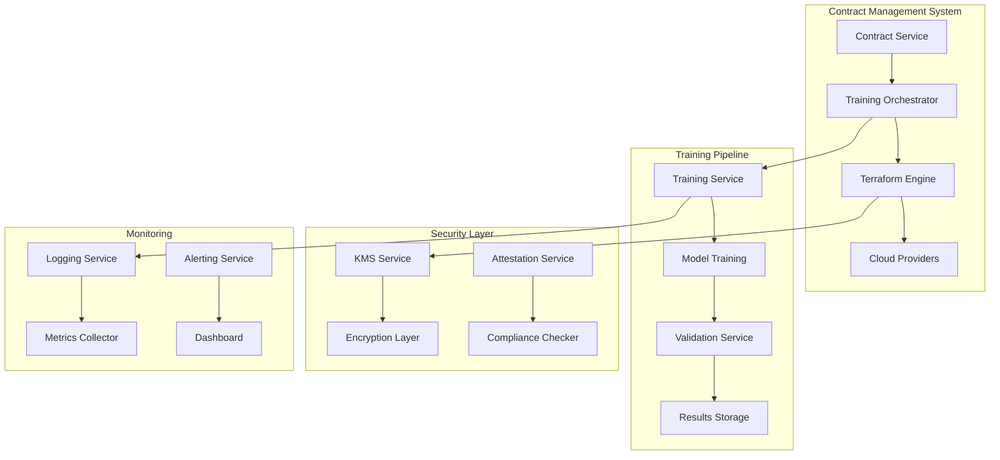

# 📋 **Product Requirements Document (PRD): Training Environment Integration**

## 🎯 **Executive Summary**

This PRD outlines the integration of automated training environment provisioning and execution within the existing Contract Management System. The solution leverages Terraform for infrastructure as code, enabling secure, reproducible training environments across multiple cloud providers.

---

## 📊 **1. Product Overview**

### **1.1 Problem Statement**
Currently, the Contract Management System lacks automated training execution capabilities. When contracts are signed, there's no automated mechanism to:
- Provision secure training environments
- Execute AI model training
- Monitor training progress
- Validate results
- Clean up resources

### **1.2 Solution Overview**
Integrate automated training orchestration that:
- **Triggers** training when contracts reach "SIGNED" status
- **Provisions** secure environments using Terraform
- **Executes** training with privacy-preserving techniques
- **Monitors** progress and validates results
- **Cleans up** resources automatically

### **1.3 Success Metrics**
- **Time to Training**: < 10 minutes from contract signing to training start
- **Environment Provisioning**: < 5 minutes for environment setup
- **Training Success Rate**: > 95% successful training completions
- **Resource Cleanup**: 100% automatic cleanup after training
- **Security Compliance**: 100% attestation verification

---

## 🏗️ **2. Technical Architecture**

### **2.1 System Architecture**



### **2.2 Technology Stack**

#### **Infrastructure as Code**
- **Terraform**: Infrastructure provisioning and management
- **Terraform Cloud**: State management and collaboration
- **Terraform Modules**: Reusable infrastructure components

#### **Cloud Providers**
- **AWS**: Nitro Enclaves, EKS, S3, KMS
- **Azure**: SGX Enclaves, AKS, Blob Storage, Key Vault
- **GCP**: Confidential VMs, GKE, Cloud Storage, KMS
- **OCI**: Confidential Computing, OKE, Object Storage, Vault

#### **Container Orchestration**
- **Kubernetes**: Container orchestration
- **Helm**: Package management for Kubernetes
- **Istio**: Service mesh for security

#### **Training Framework**
- **TensorFlow**: ML framework
- **PyTorch**: ML framework
- **Kubeflow**: ML workflow orchestration
- **Ray**: Distributed computing

#### **Security & Compliance**
- **Vault**: Secrets management
- **Cert-Manager**: SSL/TLS certificate management
- **Falco**: Runtime security monitoring
- **OPA**: Policy enforcement

#### **Monitoring & Observability**
- **Prometheus**: Metrics collection
- **Grafana**: Visualization
- **Jaeger**: Distributed tracing
- **ELK Stack**: Logging

---

## 📋 **3. Contract Requirements**

### **3.1 Required Contract Fields**

#### **Core Contract Data**
```json
{
  "contractId": "CONTRACT-123",
  "status": "SIGNED",
  "parties": {
    "tdpId": 43,
    "tdcId": 44,
    "ccrpId": 45
  },
  "datasets": [
    {
      "datasetId": "DATASET-905028b4-f721-4872-9025-839d2ec232c8",
      "tdpId": 43,
      "datasetName": "Product Reviews",
      "individualPrice": 1.75,
      "dataUrl": "s3://encrypted-datasets/product-reviews",
      "encryptionKeyId": "arn:aws:kms:us-east-1:123456789012:key/dataset-key"
    }
  ],
  "aiModelIds": ["MODEL-a5f0573f-b63c-4ff3-878d-472b6fe482ed"]
}
```

#### **Environment Specifications (Critical)**
```json
{
  "environmentSpecs": {
    "compute": {
      "type": "DEDICATED_SERVERS",
      "specifications": {
        "cpu": "64 cores (AMD EPYC 7763)",
        "memory": "512 GB DDR4 ECC",
        "gpu": "8x NVIDIA A100 (80GB each)",
        "storage": "10 TB NVMe SSD",
        "network": "100 Gbps dedicated"
      },
      "isolation": "PHYSICAL_SEPARATION",
      "location": "ON_PREMISE_SECURE_FACILITY"
    },
    "storage": {
      "type": "ENCRYPTED_STORAGE",
      "encryption": "AES-256-XTS",
      "keyManagement": "HSM_PROTECTED",
      "backup": "AIR_GAPPED_BACKUP",
      "redundancy": "3X_REPLICATION"
    },
    "network": {
      "type": "PRIVATE_NETWORK",
      "isolation": "VPN_ONLY_ACCESS",
      "firewall": "NEXT_GEN_FIREWALL",
      "monitoring": "24X7_SURVEILLANCE",
      "bandwidth": "100 Gbps dedicated"
    },
    "security": {
      "authentication": {
        "method": "MULTI_FACTOR_AUTH",
        "factors": ["SMART_CARD", "BIOMETRIC", "PIN"],
        "sessionTimeout": "4 hours",
        "maxAttempts": 3
      },
      "authorization": {
        "model": "ROLE_BASED_ACCESS",
        "roles": ["DATA_SCIENTIST", "SYSTEM_ADMIN", "AUDITOR"],
        "principle": "LEAST_PRIVILEGE"
      },
      "monitoring": {
        "logging": "COMPREHENSIVE_AUDIT_LOG",
        "alerting": "REAL_TIME_ALERTS",
        "analytics": "BEHAVIOR_ANALYTICS",
        "retention": "7 years"
      },
      "compliance": {
        "standards": ["ISO_27001", "SOC_2", "HIPAA", "GDPR", "DPDP_2023"],
        "certifications": ["FEDRAMP", "HITRUST"],
        "audits": "QUARTERLY_SECURITY_AUDITS"
      }
    }
  }
}
```

#### **Training Parameters**
```json
{
  "trainingParams": {
    "modelType": "transformer",
    "framework": "PyTorch",
    "privacyTechniques": ["FEDERATED_LEARNING", "DIFFERENTIAL_PRIVACY"],
    "targetAccuracy": 0.95,
    "maxEpochs": 100,
    "batchSize": 32,
    "validationSplit": 0.2,
    "earlyStopping": true,
    "hyperparameters": {
      "learningRate": 0.001,
      "optimizer": "Adam",
      "lossFunction": "CrossEntropyLoss",
      "scheduler": "ReduceLROnPlateau"
    },
    "privacyConfig": {
      "differentialPrivacy": {
        "epsilon": 0.1,
        "delta": 1e-5,
        "noiseType": "Gaussian"
      },
      "federatedLearning": {
        "rounds": 10,
        "localEpochs": 5,
        "aggregationMethod": "FedAvg"
      }
    }
  }
}
```

#### **Cloud Provider Configuration**
```json
{
  "ccrpCloudProvider": "AWS",
  "kmsConfigs": {
    "providers": ["AWS_KMS", "AZURE_KEY_VAULT"],
    "encryptionKeys": {
      "dataset": "arn:aws:kms:us-east-1:123456789012:key/dataset-key",
      "model": "arn:aws:kms:us-east-1:123456789012:key/model-key",
      "training": "arn:aws:kms:us-east-1:123456789012:key/training-key"
    }
  },
  "storageConfig": {
    "dataStorage": "s3://encrypted-datasets",
    "modelStorage": "s3://trained-models",
    "artifactStorage": "s3://training-artifacts"
  },
  "networkConfig": {
    "vpcId": "vpc-12345678",
    "subnetIds": ["subnet-12345678", "subnet-87654321"],
    "securityGroupIds": ["sg-12345678"]
  }
}
```

---

## 🚀 **4. Implementation Plan**

### **4.1 Phase 1: Core Infrastructure (Week 1-2)**

#### **4.1.1 Terraform Modules**
```hcl
# modules/kubernetes-cluster/main.tf
module "kubernetes_cluster" {
  source = "./modules/kubernetes-cluster"
  
  cloud_provider = var.cloud_provider
  cluster_name   = var.cluster_name
  region         = var.region
  
  node_pools = {
    training = {
      machine_type = "n1-standard-8"
      node_count   = 3
      gpu_type     = "nvidia-tesla-a100"
      gpu_count    = 8
    }
  }
  
  security_config = {
    enable_private_nodes = true
    enable_network_policy = true
    enable_pod_security_policy = true
  }
}
```

#### **4.1.2 Security Infrastructure**
```hcl
# modules/security/main.tf
module "security" {
  source = "./modules/security"
  
  kms_config = {
    provider = var.cloud_provider
    key_rotation = 90
    key_alias = "training-keys"
  }
  
  network_config = {
    vpc_cidr = "10.0.0.0/16"
    private_subnets = ["10.0.1.0/24", "10.0.2.0/24"]
    public_subnets = ["10.0.101.0/24", "10.0.102.0/24"]
  }
  
  monitoring_config = {
    enable_audit_logging = true
    enable_metrics = true
    enable_alerting = true
  }
}
```

### **4.2 Phase 2: Training Service (Week 3-4)**

#### **4.2.1 Training Service Architecture**
```javascript
// services/trainingService.js
class TrainingService {
  async triggerTrainingRun(contractId) {
    // 1. Validate contract
    const contract = await this.validateContract(contractId);
    
    // 2. Provision environment
    const environment = await this.provisionEnvironment(contract);
    
    // 3. Setup data access
    await this.setupDataAccess(environment, contract);
    
    // 4. Start training
    const trainingJob = await this.startTraining(environment, contract);
    
    // 5. Monitor progress
    await this.monitorTraining(trainingJob.id);
    
    return trainingJob;
  }
  
  async provisionEnvironment(contract) {
    const terraformConfig = this.buildTerraformConfig(contract);
    return await this.terraformService.provision(terraformConfig);
  }
}
```

#### **4.2.2 Terraform Service**
```javascript
// services/terraformService.js
class TerraformService {
  async provision(config) {
    // 1. Generate Terraform files
    await this.generateTerraformFiles(config);
    
    // 2. Initialize Terraform
    await this.initializeTerraform();
    
    // 3. Plan changes
    const plan = await this.planChanges();
    
    // 4. Apply changes
    const result = await this.applyChanges(plan);
    
    return result;
  }
  
  buildTerraformConfig(contract) {
    return {
      cloud_provider: contract.ccrpCloudProvider,
      region: this.getDefaultRegion(contract.ccrpCloudProvider),
      compute: contract.environmentSpecs.compute,
      storage: contract.environmentSpecs.storage,
      network: contract.environmentSpecs.network,
      security: contract.environmentSpecs.security
    };
  }
}
```

### **4.3 Phase 3: API Integration (Week 5)**

#### **4.3.1 New API Endpoints**
```javascript
// routes/training.js
router.post('/:contractId/trigger-training', authenticateToken, async (req, res) => {
  try {
    const { contractId } = req.params;
    const trainingJob = await trainingService.triggerTrainingRun(contractId);
    res.json({ success: true, trainingJob });
  } catch (error) {
    res.status(500).json({ error: error.message });
  }
});

router.get('/:contractId/training-status', authenticateToken, async (req, res) => {
  try {
    const { contractId } = req.params;
    const status = await trainingService.getTrainingStatus(contractId);
    res.json({ status });
  } catch (error) {
    res.status(500).json({ error: error.message });
  }
});

router.get('/:contractId/training-results', authenticateToken, async (req, res) => {
  try {
    const { contractId } = req.params;
    const results = await trainingService.getTrainingResults(contractId);
    res.json({ results });
  } catch (error) {
    res.status(500).json({ error: error.message });
  }
});
```

### **4.4 Phase 4: Frontend Integration (Week 6)**

#### **4.4.1 Training Dashboard Components**
```javascript
// components/TrainingDashboard.js
const TrainingDashboard = ({ contractId }) => {
  const { data: trainingStatus } = useQuery(
    ['trainingStatus', contractId],
    () => apiService.get(`/api/training/${contractId}/training-status`)
  );
  
  const triggerTraining = useMutation(
    () => apiService.post(`/api/training/${contractId}/trigger-training`),
    {
      onSuccess: () => {
        queryClient.invalidateQueries(['trainingStatus', contractId]);
        toast.success('Training started successfully!');
      }
    }
  );
  
  return (
    <Card>
      <CardContent>
        <Typography variant="h6">Training Status</Typography>
        <TrainingStatus status={trainingStatus} />
        <Button 
          onClick={() => triggerTraining.mutate()}
          disabled={trainingStatus?.status === 'RUNNING'}
        >
          Start Training
        </Button>
      </CardContent>
    </Card>
  );
};
```

---

## 🔒 **5. Security & Compliance**

### **5.1 Security Requirements**

#### **5.1.1 Data Protection**
- **Encryption**: End-to-end encryption (AES-256-XTS)
- **Key Management**: HSM-protected keys with rotation
- **Access Control**: Multi-factor authentication
- **Audit Logging**: Comprehensive access logs

#### **5.1.2 Environment Security**
- **Isolation**: Physical or logical separation
- **Network Security**: Private networks with VPN
- **Monitoring**: Real-time security monitoring
- **Incident Response**: Automated alerts and response

#### **5.1.3 Training Security**
- **Privacy Techniques**: Federated learning, differential privacy
- **Model Protection**: Encrypted model storage
- **Data Cleanup**: Automated secure deletion
- **Attestation**: Hardware attestation verification

### **5.2 Compliance Requirements**

#### **5.2.1 Standards**
- **ISO 27001**: Information security management
- **SOC 2**: Security, availability, processing integrity
- **HIPAA**: Healthcare data protection
- **GDPR**: European data protection
- **DPDP 2023**: Indian data protection

#### **5.2.2 Certifications**
- **FedRAMP**: Federal risk and authorization
- **HITRUST**: Healthcare industry security
- **PCI DSS**: Payment card industry security

---

## 📊 **6. Monitoring & Observability**

### **6.1 Metrics Collection**

#### **6.1.1 Infrastructure Metrics**
```yaml
# monitoring/infrastructure-metrics.yaml
apiVersion: v1
kind: ConfigMap
metadata:
  name: infrastructure-metrics
data:
  prometheus.yml: |
    global:
      scrape_interval: 15s
    scrape_configs:
      - job_name: 'kubernetes-pods'
        kubernetes_sd_configs:
          - role: pod
        relabel_configs:
          - source_labels: [__meta_kubernetes_pod_annotation_prometheus_io_scrape]
            action: keep
            regex: true
```

#### **6.1.2 Training Metrics**
```javascript
// services/metricsService.js
class MetricsService {
  async collectTrainingMetrics(trainingJobId) {
    return {
      accuracy: await this.getModelAccuracy(trainingJobId),
      loss: await this.getModelLoss(trainingJobId),
      epochs: await this.getCompletedEpochs(trainingJobId),
      privacyMetrics: await this.getPrivacyMetrics(trainingJobId),
      resourceUtilization: await this.getResourceUtilization(trainingJobId)
    };
  }
}
```

### **6.2 Alerting**

#### **6.2.1 Alert Rules**
```yaml
# monitoring/alert-rules.yaml
groups:
  - name: training-alerts
    rules:
      - alert: TrainingJobFailed
        expr: training_job_status{status="failed"} > 0
        for: 1m
        labels:
          severity: critical
        annotations:
          summary: "Training job failed"
          description: "Training job {{ $labels.job_id }} has failed"
      
      - alert: HighResourceUsage
        expr: container_cpu_usage_seconds_total > 0.8
        for: 5m
        labels:
          severity: warning
        annotations:
          summary: "High resource usage detected"
```

---

## 🧪 **7. Testing Strategy**

### **7.1 Unit Tests**
```javascript
// tests/services/trainingService.test.js
describe('TrainingService', () => {
  describe('triggerTrainingRun', () => {
    it('should validate contract before training', async () => {
      const mockContract = createMockContract();
      const result = await trainingService.triggerTrainingRun('CONTRACT-123');
      expect(result.status).toBe('RUNNING');
    });
    
    it('should provision environment with correct specs', async () => {
      const mockContract = createMockContract();
      const environment = await trainingService.provisionEnvironment(mockContract);
      expect(environment.cloudProvider).toBe('AWS');
      expect(environment.compute.gpu).toBe('8x NVIDIA A100');
    });
  });
});
```

### **7.2 Integration Tests**
```javascript
// tests/integration/training-workflow.test.js
describe('Training Workflow Integration', () => {
  it('should complete full training workflow', async () => {
    // 1. Create contract
    const contract = await createTestContract();
    
    // 2. Trigger training
    const trainingJob = await trainingService.triggerTrainingRun(contract.id);
    
    // 3. Monitor progress
    const status = await trainingService.getTrainingStatus(contract.id);
    expect(status.status).toBe('COMPLETED');
    
    // 4. Validate results
    const results = await trainingService.getTrainingResults(contract.id);
    expect(results.accuracy).toBeGreaterThan(0.95);
  });
});
```

### **7.3 E2E Tests**
```javascript
// tests/e2e/training-ui.test.js
describe('Training UI E2E', () => {
  it('should trigger training from UI', async () => {
    await page.goto('/contracts/CONTRACT-123');
    await page.click('[data-testid="start-training"]');
    await expect(page.locator('[data-testid="training-status"]')).toHaveText('RUNNING');
  });
});
```

---

## 📅 **8. Implementation Timeline**

### **Week 1-2: Infrastructure Setup**
- [ ] Terraform modules development
- [ ] Cloud provider integration
- [ ] Security infrastructure setup
- [ ] Monitoring and logging setup

### **Week 3-4: Training Service**
- [ ] Training service development
- [ ] Terraform service integration
- [ ] Data access setup
- [ ] Training orchestration

### **Week 5: API Integration**
- [ ] New API endpoints
- [ ] Contract validation
- [ ] Training status tracking
- [ ] Results validation

### **Week 6: Frontend Integration**
- [ ] Training dashboard components
- [ ] Status monitoring UI
- [ ] Results visualization
- [ ] User experience optimization

### **Week 7: Testing & Validation**
- [ ] Unit test coverage
- [ ] Integration testing
- [ ] E2E testing
- [ ] Performance testing

### **Week 8: Deployment & Documentation**
- [ ] Production deployment
- [ ] Documentation updates
- [ ] User training
- [ ] Monitoring setup

---

## 💰 **9. Resource Requirements**

### **9.1 Development Team**
- **1 Senior DevOps Engineer**: Terraform, Kubernetes, Cloud infrastructure
- **1 Senior Backend Engineer**: Training service, API development
- **1 Senior Frontend Engineer**: UI components, dashboard development
- **1 Security Engineer**: Security architecture, compliance
- **1 QA Engineer**: Testing strategy, automation

### **9.2 Infrastructure Costs**
- **Development Environment**: $2,000/month
- **Testing Environment**: $1,500/month
- **Production Environment**: $5,000/month
- **Monitoring & Logging**: $500/month

### **9.3 Tools & Services**
- **Terraform Cloud**: $20/user/month
- **Kubernetes Tools**: $200/month
- **Monitoring Stack**: $300/month
- **Security Tools**: $500/month

---

## 🎯 **10. Success Criteria**

### **10.1 Functional Requirements**
- ✅ Training environments provisioned automatically
- ✅ Training jobs executed successfully
- ✅ Results validated and stored securely
- ✅ Resources cleaned up automatically
- ✅ Security compliance maintained

### **10.2 Performance Requirements**
- ✅ Environment provisioning < 5 minutes
- ✅ Training start < 10 minutes from contract signing
- ✅ 99.9% uptime for training environments
- ✅ < 100ms API response times
- ✅ 95% training success rate

### **10.3 Security Requirements**
- ✅ 100% data encryption in transit and at rest
- ✅ Multi-factor authentication for all access
- ✅ Comprehensive audit logging
- ✅ Automated security monitoring
- ✅ Compliance with all required standards

---

## 📚 **11. Documentation**

### **11.1 Technical Documentation**
- Architecture diagrams
- API documentation
- Terraform module documentation
- Security configuration guide
- Deployment guide

### **11.2 User Documentation**
- Training workflow guide
- Dashboard user guide
- Troubleshooting guide
- Best practices guide

### **11.3 Operational Documentation**
- Monitoring guide
- Incident response procedures
- Backup and recovery procedures
- Maintenance procedures

---

**Summary:** This PRD provides a comprehensive plan for integrating automated training environment provisioning and execution into the Contract Management System using Terraform for infrastructure management. The solution ensures security, compliance, and scalability while maintaining the existing system architecture. 