# UI Design Document
## Contract Management System - Enterprise DID Integration

**Document Version:** 1.0  
**Date:** December 2024  
**Author:** Contract Management System Team

---

## Table of Contents

1. [Design System Overview](#design-system-overview)
2. [User Personas](#user-personas)
3. [User Flows](#user-flows)
4. [Page Designs](#page-designs)
5. [Component Library](#component-library)
6. [Responsive Design](#responsive-design)
7. [Accessibility](#accessibility)
8. [Design Specifications](#design-specifications)

---

## 1. Design System Overview

### Design Philosophy
The Contract Management System follows a **modern, enterprise-focused design** that prioritizes:
- **Clarity and Simplicity**: Clean interfaces that reduce cognitive load
- **Enterprise Trust**: Professional appearance that builds confidence
- **Accessibility**: Inclusive design for all users
- **Consistency**: Unified design language across all components
- **Efficiency**: Streamlined workflows for power users

### Color Palette

#### Primary Colors
- **Primary Blue**: `#1976d2` - Main brand color, used for primary actions
- **Secondary Purple**: `#9c27b0` - Used for secondary actions and highlights
- **Success Green**: `#2e7d32` - Success states and positive feedback
- **Warning Orange**: `#ed6c02` - Warnings and caution states
- **Error Red**: `#d32f2f` - Errors and destructive actions

#### Neutral Colors
- **Background**: `#fafafa` - Light background for content areas
- **Surface**: `#ffffff` - Card and component backgrounds
- **Border**: `#e0e0e0` - Subtle borders and dividers
- **Text Primary**: `#212121` - Main text color
- **Text Secondary**: `#757575` - Secondary text and labels

### Typography
- **Primary Font**: Inter (Google Fonts)
- **Monospace Font**: 'Roboto Mono' for code and DID addresses
- **Heading Weights**: 600 (Semi-bold) for h1-h4
- **Body Weight**: 400 (Regular) for body text
- **Caption Weight**: 500 (Medium) for labels and captions

### Spacing System
- **Base Unit**: 8px
- **Spacing Scale**: 8px, 16px, 24px, 32px, 48px, 64px
- **Container Padding**: 24px (desktop), 16px (tablet), 12px (mobile)

---

## 2. User Personas

### Enterprise Administrator (Admin)
- **Role**: Organization administrator managing enterprise DID infrastructure
- **Goals**: 
  - Register organization domain for DID management
  - Manage enterprise users and departments
  - Monitor system usage and compliance
- **Pain Points**: Complex DID setup, user management overhead
- **Tech Level**: High - familiar with enterprise systems

### Enterprise User (Employee)
- **Role**: Regular employee using the system for contract management
- **Goals**:
  - Register with enterprise DID
  - Create and manage contracts
  - Access datasets and notifications
- **Pain Points**: Understanding DID concepts, complex workflows
- **Tech Level**: Medium - familiar with web applications

### Individual User (Blockchain)
- **Role**: Individual user with Ethereum wallet
- **Goals**:
  - Register with personal DID
  - Participate in blockchain-based contracts
  - Maintain self-sovereign identity
- **Pain Points**: Wallet management, gas fees
- **Tech Level**: High - familiar with blockchain technology

### Data Provider (TDP)
- **Role**: Organization or individual providing training datasets
- **Goals**:
  - Upload and manage datasets
  - Set pricing and terms
  - Monitor contract usage
- **Pain Points**: Dataset management, pricing strategy
- **Tech Level**: Medium - familiar with data management

### Data Consumer (TDC)
- **Role**: Organization or individual consuming training data
- **Goals**:
  - Browse available datasets
  - Create contracts for data access
  - Manage model training
- **Pain Points**: Finding relevant data, contract negotiation
- **Tech Level**: Medium - familiar with AI/ML workflows

### Compliance Officer (CCRP)
- **Role**: Organization or individual providing compliance review
- **Goals**:
  - Review contract terms
  - Sign contracts for compliance
  - Monitor regulatory requirements
- **Pain Points**: Complex compliance requirements, audit trails
- **Tech Level**: Medium - familiar with legal/compliance processes

---

## 3. User Flows

### 3.1 Enterprise Organization Registration Flow

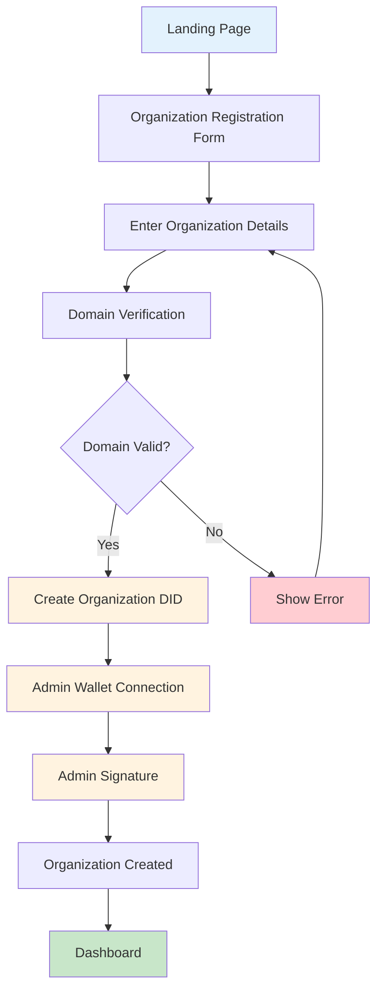

**Wireframe: Organization Registration**

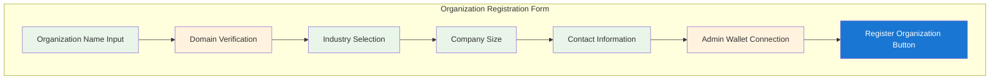

### 3.2 Enterprise User Registration Flow

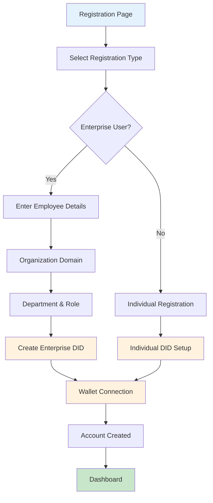

**Wireframe: Enterprise User Registration**

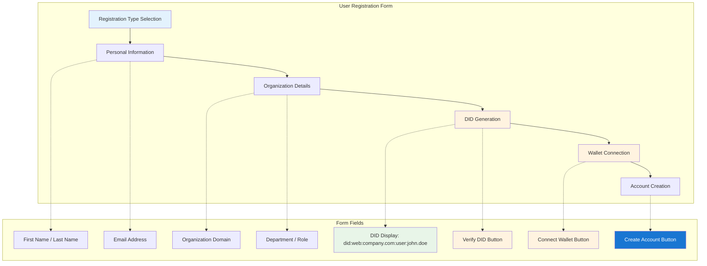

### 3.3 Contract Creation Flow

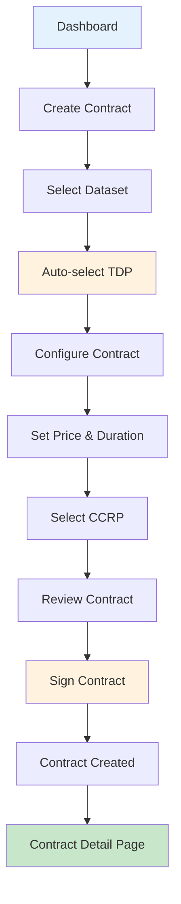

**Wireframe: Contract Creation Stepper**

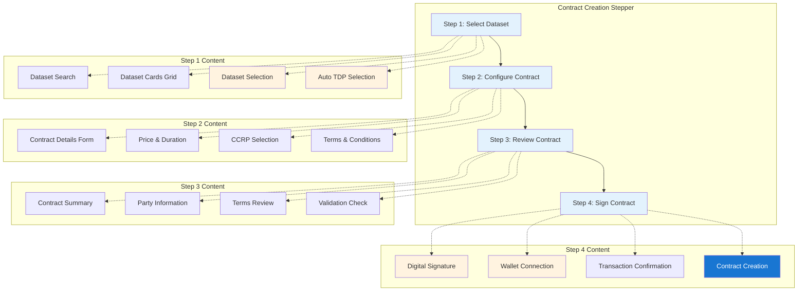

### 3.4 DID Management Flow

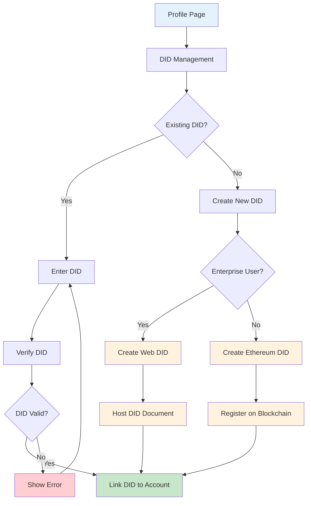

**Wireframe: DID Management**

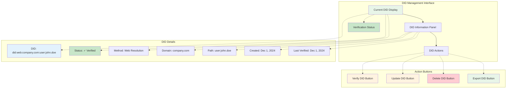

---

## 4. Page Designs

### 4.1 Dashboard Page

**Purpose**: Central hub showing system overview and quick actions

**Layout Structure**:

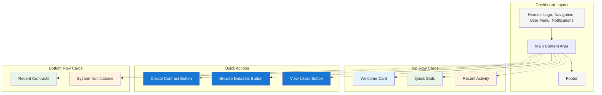

**Key Components**:
- **Welcome Card**: Personalized greeting with user info
- **Quick Stats**: Contract count, dataset count, user count
- **Recent Activity**: Latest contracts and notifications
- **Quick Actions**: Primary action buttons
- **System Status**: Performance and health indicators

### 4.2 User Registration Page

**Purpose**: Multi-step registration for different user types

**Layout Structure**:

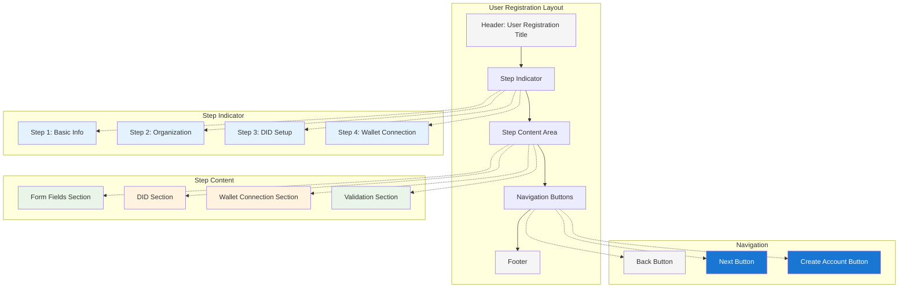

**Key Components**:
- **Step Indicator**: Visual progress through registration
- **User Type Selection**: Enterprise vs Individual
- **Form Fields**: Personal and organization information
- **DID Management**: DID creation or linking
- **Wallet Connection**: MetaMask integration
- **Validation**: Real-time form validation

### 4.3 Contract Management Page

**Purpose**: Browse, create, and manage contracts

**Layout Structure**:

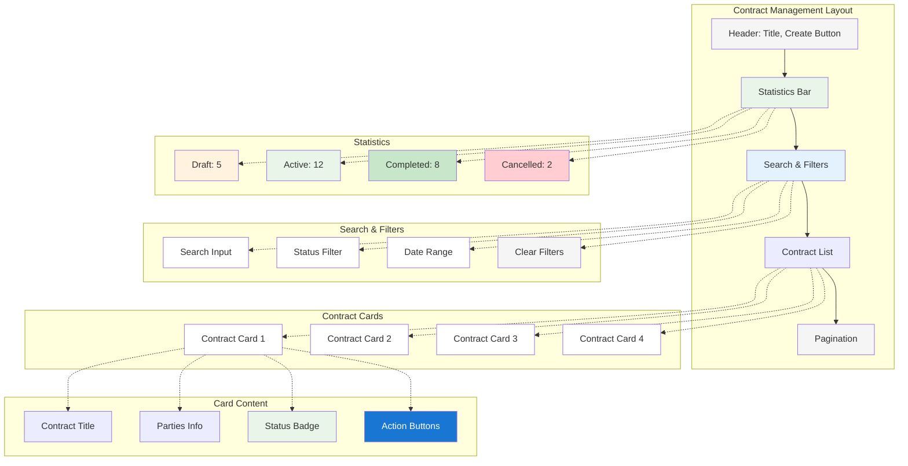

**Key Components**:
- **Contract Statistics**: Status-based counts
- **Search & Filters**: Advanced filtering options
- **Contract Cards**: Compact contract information
- **Action Buttons**: View, Edit, Delete actions
- **Pagination**: For large contract lists

### 4.4 DID Management Page

**Purpose**: Manage user's digital identity

**Layout Structure**:

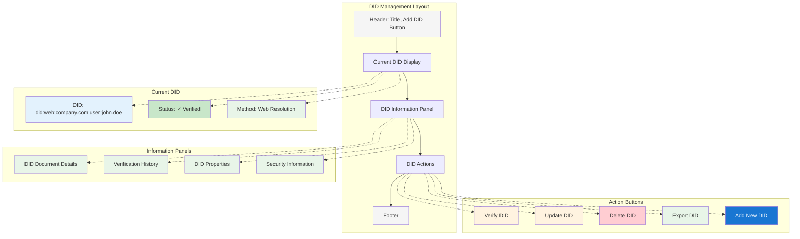

**Key Components**:
- **Current DID Display**: Primary DID with status
- **DID Information**: Detailed DID document
- **Verification History**: Past verification attempts
- **Action Buttons**: DID management actions
- **DID Method Info**: Information about DID method

---

## 5. Component Library

### 5.1 Navigation Components

#### Header Component Architecture

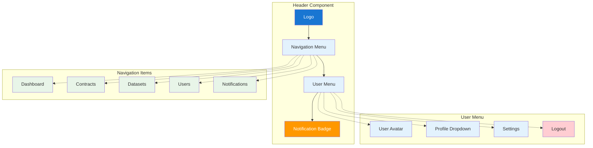

#### Header Component
```jsx
<Header>
  <Logo />
  <Navigation>
    <NavItem>Dashboard</NavItem>
    <NavItem>Contracts</NavItem>
    <NavItem>Datasets</NavItem>
    <NavItem>Users</NavItem>
  </Navigation>
  <UserMenu>
    <NotificationBadge />
    <UserAvatar />
    <DropdownMenu />
  </UserMenu>
</Header>
```

#### Sidebar Component Architecture

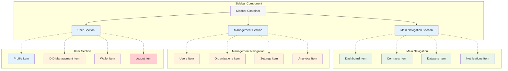

#### Sidebar Component
```jsx
<Sidebar>
  <NavSection title="Main">
    <NavItem icon={<Dashboard />}>Dashboard</NavItem>
    <NavItem icon={<Contracts />}>Contracts</NavItem>
    <NavItem icon={<Datasets />}>Datasets</NavItem>
  </NavSection>
  <NavSection title="Management">
    <NavItem icon={<Users />}>Users</NavItem>
    <NavItem icon={<Settings />}>Settings</NavItem>
  </NavSection>
</Sidebar>
```

### 5.2 Form Components

#### DID Input Component Architecture

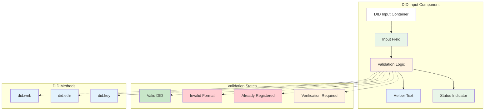

#### DID Input Component
```jsx
<DIDInput
  label="Digital Identifier"
  placeholder="did:web:company.com:user:alice"
  value={did}
  onChange={handleDIDChange}
  validation={didValidation}
  helperText="Enter your DID (did:web or did:ethr)"
/>
```

#### Wallet Connection Component
```jsx
<WalletConnection
  connected={walletConnected}
  address={walletAddress}
  onConnect={connectWallet}
  onDisconnect={disconnectWallet}
  onSwitchAccount={switchAccount}
/>
```

### 5.3 Data Display Components

#### Contract Card Component
```jsx
<ContractCard
  contract={contract}
  onView={handleView}
  onEdit={handleEdit}
  onDelete={handleDelete}
  showActions={userCanEdit}
/>
```

#### User Card Component
```jsx
<UserCard
  user={user}
  showDID={true}
  showActions={isAdmin}
  onView={handleViewUser}
  onEdit={handleEditUser}
/>
```

### 5.4 Feedback Components

#### Status Indicator Component
```jsx
<StatusIndicator
  status="verified"
  text="DID Verified"
  icon={<CheckCircle />}
  color="success"
/>
```

#### Progress Stepper Component
```jsx
<ProgressStepper
  steps={['Dataset', 'Configure', 'Review', 'Sign']}
  activeStep={currentStep}
  completed={completedSteps}
/>
```

---

## 6. System Architecture

### 6.1 Component Hierarchy

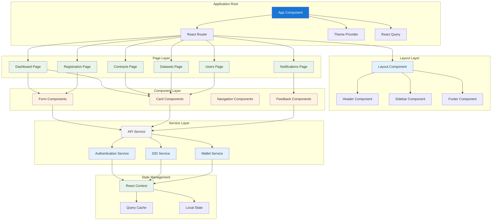

### 6.2 Data Flow Architecture

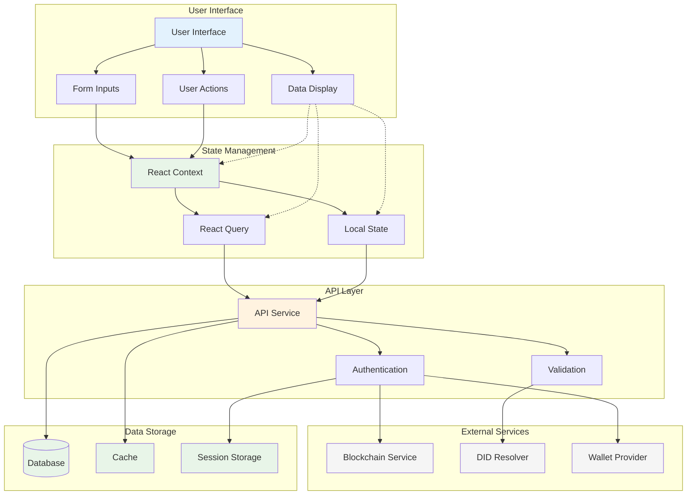

---

## 7. Responsive Design

### 7.1 Breakpoints
- **Mobile**: 320px - 768px
- **Tablet**: 768px - 1024px
- **Desktop**: 1024px - 1440px
- **Large Desktop**: 1440px+

### 7.2 Mobile Adaptations

#### Navigation
- **Header**: Collapsible hamburger menu
- **Sidebar**: Slide-out drawer
- **Actions**: Bottom sheet for mobile actions

#### Forms
- **Single Column**: All form fields stack vertically
- **Touch Targets**: Minimum 44px touch targets
- **Keyboard**: Optimized for mobile keyboards

#### Data Display
- **Cards**: Full-width cards on mobile
- **Tables**: Horizontal scroll or card view
- **Actions**: Swipe actions or action menus

### 7.3 Tablet Adaptations
- **Two-Column Layout**: Sidebar + main content
- **Responsive Grid**: Adaptive grid systems
- **Touch Optimization**: Larger touch targets

---

## 8. Accessibility

### 8.1 WCAG 2.1 AA Compliance

#### Color Contrast
- **Text**: Minimum 4.5:1 contrast ratio
- **Large Text**: Minimum 3:1 contrast ratio
- **UI Elements**: Minimum 3:1 contrast ratio

#### Keyboard Navigation
- **Tab Order**: Logical tab sequence
- **Focus Indicators**: Visible focus states
- **Skip Links**: Skip to main content

#### Screen Reader Support
- **ARIA Labels**: Proper ARIA attributes
- **Semantic HTML**: Correct HTML structure
- **Alt Text**: Descriptive alt text for images

### 8.2 Assistive Technology Support

#### Screen Readers
- **NVDA**: Windows screen reader
- **JAWS**: Windows screen reader
- **VoiceOver**: macOS screen reader
- **TalkBack**: Android screen reader

#### Keyboard Users
- **Tab Navigation**: Full keyboard accessibility
- **Shortcuts**: Keyboard shortcuts for power users
- **Focus Management**: Proper focus handling

---

## 9. Design Specifications

### 9.1 Component Specifications

#### Button Specifications
```css
/* Primary Button */
.primary-button {
  background-color: #1976d2;
  color: white;
  padding: 12px 24px;
  border-radius: 4px;
  font-weight: 500;
  text-transform: none;
  min-height: 44px;
}

/* Secondary Button */
.secondary-button {
  background-color: transparent;
  color: #1976d2;
  border: 1px solid #1976d2;
  padding: 12px 24px;
  border-radius: 4px;
  font-weight: 500;
  text-transform: none;
  min-height: 44px;
}
```

#### Card Specifications
```css
.card {
  background-color: #ffffff;
  border-radius: 8px;
  box-shadow: 0 2px 4px rgba(0, 0, 0, 0.1);
  padding: 24px;
  border: 1px solid #e0e0e0;
}

.card-header {
  border-bottom: 1px solid #e0e0e0;
  padding-bottom: 16px;
  margin-bottom: 16px;
}
```

#### Form Field Specifications
```css
.form-field {
  margin-bottom: 16px;
}

.form-field input {
  width: 100%;
  padding: 12px 16px;
  border: 1px solid #e0e0e0;
  border-radius: 4px;
  font-size: 16px;
  min-height: 44px;
}

.form-field input:focus {
  border-color: #1976d2;
  outline: none;
  box-shadow: 0 0 0 2px rgba(25, 118, 210, 0.2);
}
```

### 9.2 Animation Specifications

#### Transitions
```css
/* Standard Transition */
.standard-transition {
  transition: all 0.2s ease-in-out;
}

/* Hover Effects */
.hover-effect:hover {
  transform: translateY(-2px);
  box-shadow: 0 4px 8px rgba(0, 0, 0, 0.15);
}

/* Loading States */
.loading-spinner {
  animation: spin 1s linear infinite;
}

@keyframes spin {
  from { transform: rotate(0deg); }
  to { transform: rotate(360deg); }
}
```

### 9.3 Icon Specifications

#### Icon Sizes
- **Small**: 16px - Used in lists and compact spaces
- **Medium**: 24px - Standard icon size
- **Large**: 32px - Used in headers and prominent areas
- **Extra Large**: 48px - Used in empty states and hero sections

#### Icon Colors
- **Primary**: `#1976d2` - Main brand color
- **Secondary**: `#757575` - Secondary text color
- **Success**: `#2e7d32` - Success states
- **Warning**: `#ed6c02` - Warning states
- **Error**: `#d32f2f` - Error states

---

## 10. Implementation Guidelines

### 10.1 Development Standards

#### Code Organization
- **Component Structure**: Atomic design principles
- **File Naming**: PascalCase for components, camelCase for utilities
- **Folder Structure**: Feature-based organization

#### State Management
- **React Query**: For server state management
- **Context API**: For global UI state
- **Local State**: For component-specific state

#### Performance
- **Lazy Loading**: Code splitting for routes
- **Memoization**: React.memo for expensive components
- **Virtualization**: For large lists and tables

### 10.2 Testing Strategy

#### Unit Testing
- **Component Testing**: Test individual components
- **Utility Testing**: Test helper functions
- **Hook Testing**: Test custom React hooks

#### Integration Testing
- **User Flow Testing**: Test complete user journeys
- **API Integration**: Test API interactions
- **Error Handling**: Test error scenarios

#### Accessibility Testing
- **Automated Testing**: Use axe-core for automated checks
- **Manual Testing**: Keyboard navigation and screen reader testing
- **User Testing**: Testing with users who have disabilities

---

## 11. Future Enhancements

### 11.1 Planned Features

#### Advanced DID Management
- **DID Delegation**: Allow DID delegation to other keys
- **DID Recovery**: Implement DID recovery mechanisms
- **Multi-DID Support**: Support multiple DIDs per user

#### Enhanced User Experience
- **Onboarding Flow**: Guided onboarding for new users
- **Tutorial System**: Interactive tutorials and help
- **Personalization**: User preferences and customization

#### Analytics and Insights
- **Usage Analytics**: Track user behavior and system usage
- **Performance Metrics**: Monitor system performance
- **Business Intelligence**: Dashboard for business insights

### 11.2 Design System Evolution

#### Component Expansion
- **Data Visualization**: Charts and graphs components
- **Advanced Forms**: Multi-step forms and wizards
- **Notification System**: Toast notifications and alerts

#### Theme System
- **Dark Mode**: Dark theme support
- **Custom Themes**: Organization-specific themes
- **Branding**: Customizable branding options

---

**UI Design Document End** 