# UML 4+1 View Architecture Documentation
## Contract Management System

**Document Version:** 2.0  
**Date:** December 2024  
**Author:** Contract Management System Team

---

## Table of Contents

1. [Executive Summary](#executive-summary)
2. [Use Case View (+1)](#use-case-view-1)
3. [Logical View](#logical-view)
4. [Development View](#development-view)
5. [Process View](#process-view)
6. [Physical View](#physical-view)
7. [Stakeholder Mapping](#stakeholder-mapping)
8. [Implementation Guidelines](#implementation-guidelines)

---

## 1. Executive Summary

### 1.1 Overview
This document provides a comprehensive UML 4+1 View Architecture for the Contract Management System, covering all aspects from user interactions to deployment infrastructure. The system supports enterprise registration, DID-based identity management, cryptographic contract signing, multi-party contract execution, and **real cloud infrastructure provisioning with CCRP-specific credentials**.

### 1.2 Key Components
- **Frontend**: React-based user interface with role-based dashboards
- **Backend**: Node.js/Express API with microservices architecture
- **Identity Management**: Keycloak IAM integration
- **Blockchain**: Ethereum-based contract recording
- **Database**: PostgreSQL with Redis caching
- **Security**: HSM/KMS integration for cryptographic operations
- **Cloud Infrastructure**: **Real Azure SDK integration with multi-tenant CCRP credential management**
- **Training Environment**: **Real container deployment with Azure Container Instances**

### 1.3 Target Users
- **TDP (Training Data Provider)**: Dataset and model management
- **TDC (Training Data Consumer)**: Contract creation and management
- **CCRP (Confidential Clean Room Provider)**: **Compliance, resource monitoring, and real infrastructure provisioning**
- **AppAdmin**: System administration and oversight

### 1.4 **New Features (v2.0)**
- **Real Azure Infrastructure**: Actual Azure SDK integration replacing mock services
- **CCRP-Specific Credentials**: Multi-tenant Azure credential management per CCRP
- **Encrypted Credential Storage**: AES-256-CBC encrypted client secrets
- **Contract-Specific Configuration**: Contract overrides for CCRP Azure defaults
- **Real Training Execution**: Actual container deployment with Azure Container Instances
- **Cost Management**: Per-CCRP and per-contract budget tracking
- **Multi-Tenant Security**: CCRP isolation with independent Azure subscriptions

---

## 2. Use Case View (+1)

### 2.1 Actors
- **TDP (Training Data Provider)**
- **TDC (Training Data Consumer)**
- **CCRP (Confidential Clean Room Provider)**
- **AppAdmin**
- **Keycloak IAM**
- **Blockchain**
- **External Auditors**
- **Azure Cloud Services** (New)
- **Azure Container Instances** (New)

### 2.2 Major Use Cases
- Register/Onboard as Enterprise
- Login/Authenticate
- Manage Profile & DIDs
- Create/Manage Datasets
- Create/Manage AI Models
- Create Contract
- Sign Contract (multi-party)
- Verify Contract
- **Manage CCRP Azure Credentials** (New)
- **Provision Real Infrastructure** (New)
- **Deploy Training Containers** (New)
- **Monitor Real Resource Usage** (New)
- **Track Real Costs** (New)
- Notification & Audit Trail
- Administer System

### 2.3 Use Case Diagram

**Description:** This diagram shows the main actors (users and external systems) and their interactions with the system's core use cases, organized by subsystems. It illustrates how different user roles (TDP, TDC, CCRP, AppAdmin) interact with the system to perform various business functions, including the new Azure cloud integration features.

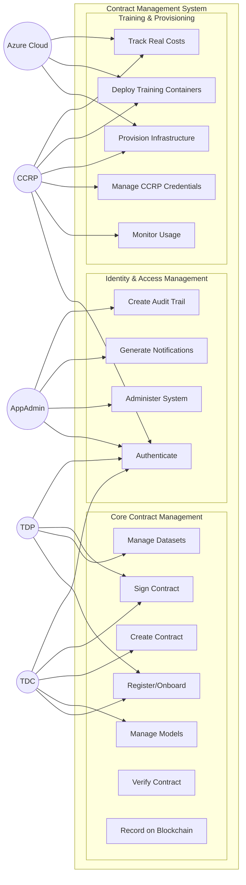

---

## 3. Logical View

### 3.1 System Components

**Description:** This diagram shows the high-level system architecture organized by layers and subsystems. It illustrates how the frontend, backend services, and external systems interact, with clear separation between different functional areas and their dependencies.

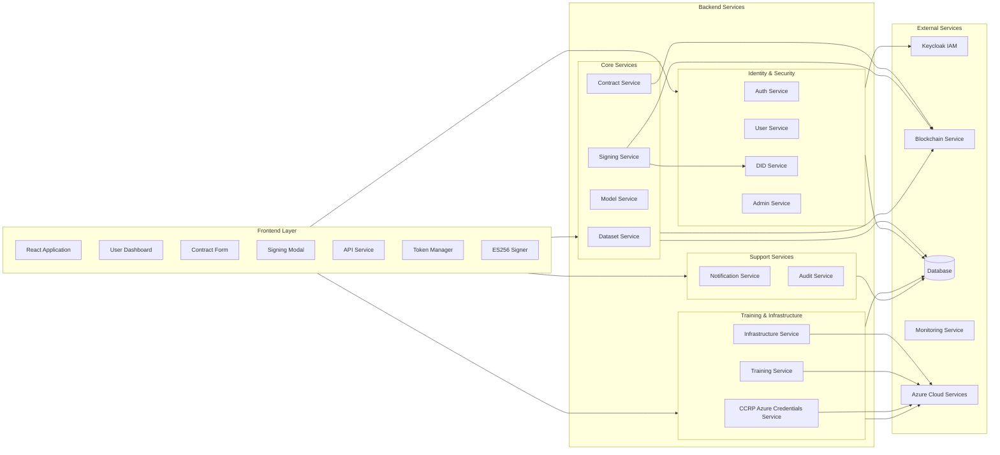

### 3.2 **New Azure Integration Components**

**Description:** This diagram illustrates the new Azure integration architecture, showing how the system connects to Azure services for real infrastructure provisioning. It demonstrates the relationship between CCRP credentials, contract configuration, and Azure services like Resource Manager, Container Instances, Storage, Key Vault, and ML Workspace.

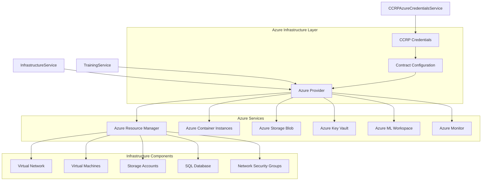

---

## 4. Development View

### 4.1 Code/Module Structure

#### Frontend Structure
```
frontend/
├── src/
│   ├── components/
│   │   ├── dashboards/
│   │   ├── forms/
│   │   ├── modals/
│   │   └── common/
│   ├── pages/
│   │   ├── dashboards/
│   │   ├── contracts/
│   │   ├── datasets/
│   │   └── admin/
│   ├── services/
│   │   ├── api.js
│   │   └── tokenManager.js
│   └── utils/
│       └── es256sign.js
├── public/
└── package.json
```

#### Backend Structure
```
backend/
├── routes/
│   ├── auth.js
│   ├── contracts.js
│   ├── datasets.js
│   ├── ai-models.js
│   ├── ccrp.js
│   ├── tdp.js
│   ├── tdc.js
│   ├── admin.js
│   └── training.js
├── models/
│   ├── User.js
│   ├── Contract.js
│   ├── Dataset.js
│   ├── AIModel.js
│   ├── Notification.js
│   ├── AuditLog.js
│   ├── CCRPAzureCredentials.js
│   └── TrainingJob.js
├── services/
│   ├── authService.js
│   ├── didService.js
│   ├── blockchainService.js
│   ├── auditService.js
│   ├── notificationService.js
│   ├── signingService.js
│   ├── infrastructureService.js
│   ├── trainingService.js
│   └── ccrpAzureCredentialsService.js
├── providers/
│   ├── azureProvider.js
│   ├── awsProvider.js
│   └── gcpProvider.js
├── middleware/
│   ├── auth.js
│   └── errorHandler.js
└── scripts/
    ├── migrations/
    └── test-data/
```

### 4.2 Module Structure Diagram

**Description:** This diagram shows the high-level module structure of the application, illustrating how the frontend, backend, and Azure components are organized. It demonstrates the separation of concerns between different layers and how they interact through APIs and services.

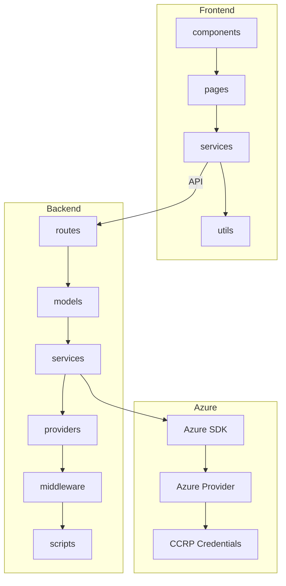

---

## 5. Process View

### 5.1 Key Processes & Interactions

#### User Registration/Onboarding
- `frontend/src/pages/UserRegistration.js`
- `backend/routes/auth.js`

#### Authentication (JWT, Keycloak)
- `backend/middleware/auth.js`
- `backend/services/keycloakService.js`

#### Contract Creation & Multi-Party Signing
- `frontend/src/pages/Contracts.js`
- `backend/routes/contracts.js`
- `backend/services/signingService.js`

#### DID Resolution & Verification
- `backend/services/didService.js`

#### Blockchain Transaction
- `backend/services/blockchainService.js`

#### Notification Dispatch
- `backend/services/notificationService.js`

#### Audit Logging
- `backend/services/auditService.js`

#### Resource Monitoring (CCRP)
- `frontend/src/pages/dashboards/CCRPDashboard.js`
- `backend/routes/ccrp.js`

#### **Real Infrastructure Provisioning** (New)
- `backend/services/infrastructureService.js`
- `backend/routes/training.js`

### 5.2 **New Azure Infrastructure Provisioning Process**

**Description:** This sequence diagram illustrates the complete process of provisioning real Azure infrastructure for training environments. It shows the interaction between CCRP users, the frontend, backend services, Keycloak authentication, database operations, and Azure cloud services including monitoring.

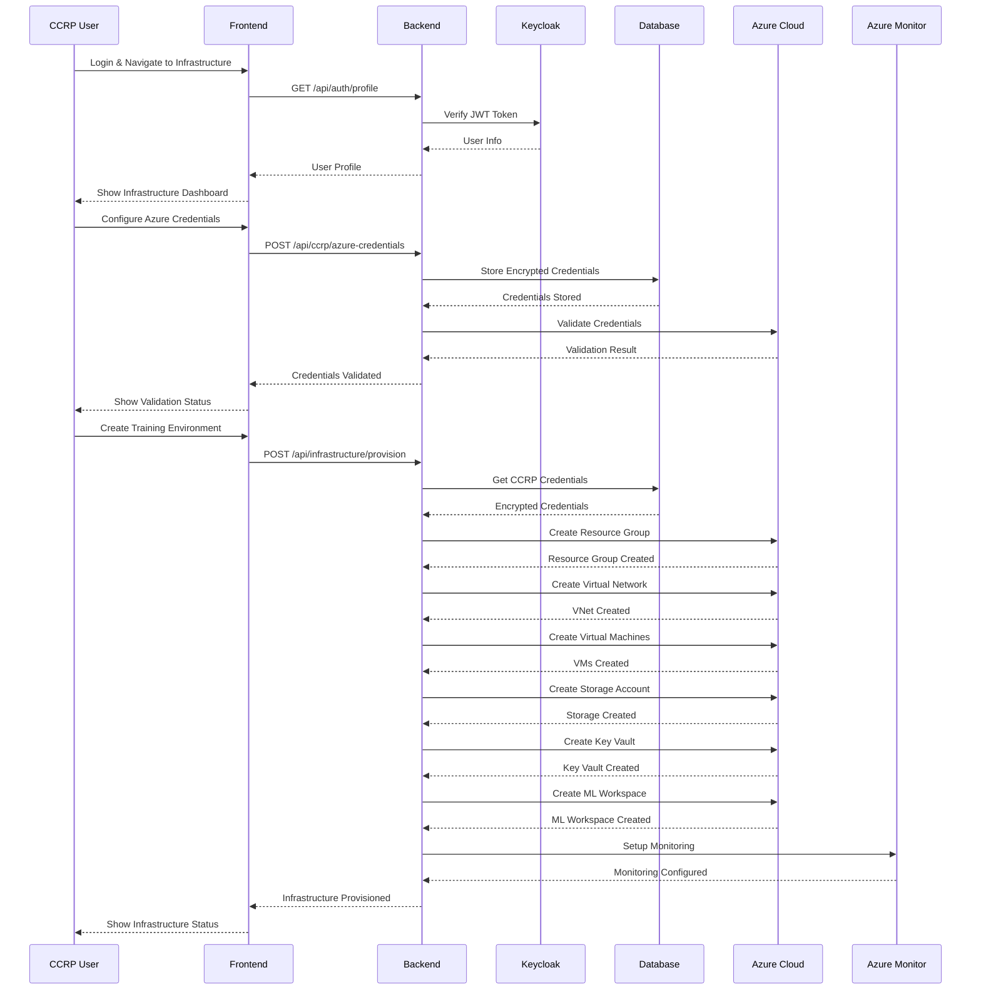

### 5.3 **Real Training Container Deployment Process**

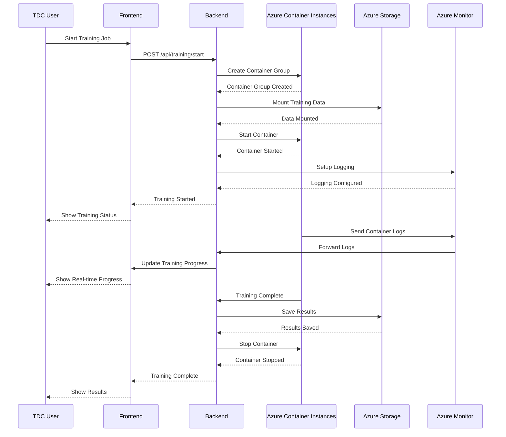

---

## 6. Physical View

### 6.1 **Updated Infrastructure Architecture**

#### 6.1.1 **Multi-Cloud Deployment Architecture**

**Description:** This diagram shows the multi-cloud deployment architecture with load balancers distributing traffic across multiple backend services. Each backend service connects to different Azure resource groups managed by different CCRPs, demonstrating the multi-tenant isolation and scalability of the system.

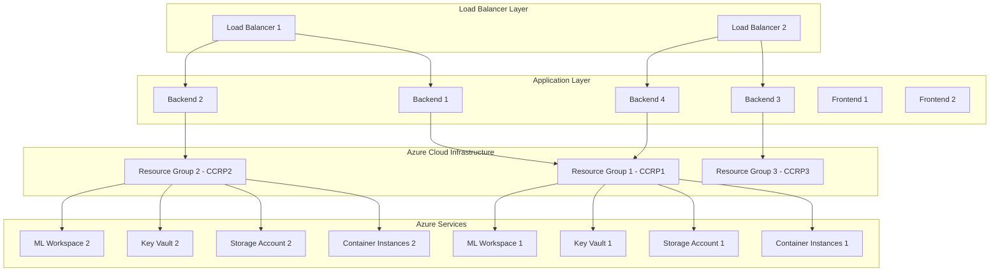

#### 6.1.2 **CCRP Credential Management Architecture**

**Description:** This diagram illustrates how CCRP credentials are managed across multiple users and Azure subscriptions. It shows the separation of credentials per CCRP user, the database storage of encrypted credentials, and the connection to different Azure subscriptions for multi-tenant isolation.

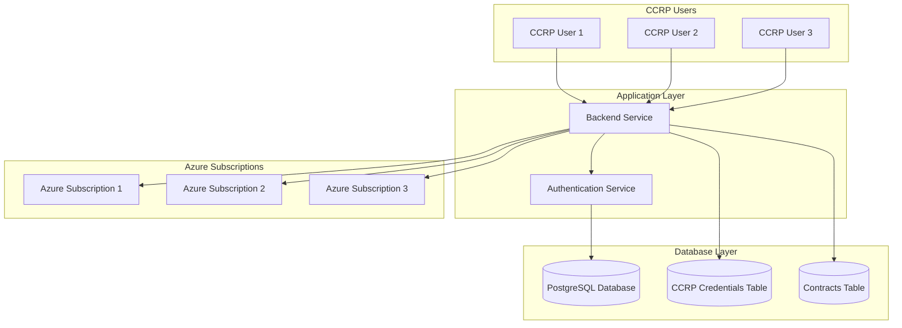

#### 6.1.3 **Real Training Environment Architecture**

**Description:** This diagram shows the real training environment architecture using Azure Container Instances for running training jobs. It illustrates how training jobs are deployed to containers, how they access training data from Azure Storage blobs, how results are stored, and how monitoring and logging are handled through Azure Monitor and Log Analytics.

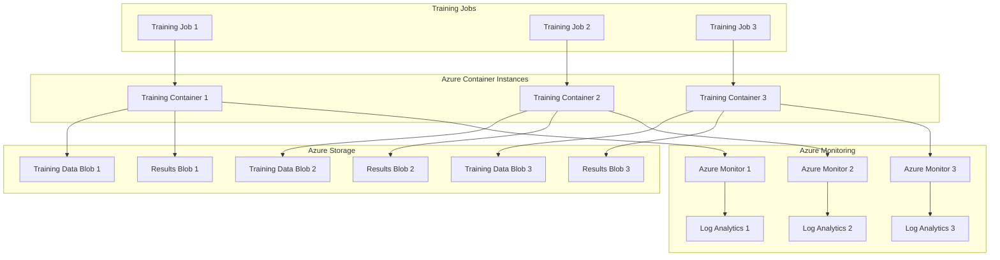

#### 6.1.4 **Security & Identity Layer**

**Description:** This diagram illustrates the comprehensive security and identity management architecture. It shows how backend services integrate with Keycloak for authentication, how security services like WAF, VPN, HSM, and KMS protect the system, and how Azure security features like Key Vault, Active Directory, and RBAC provide additional layers of security.

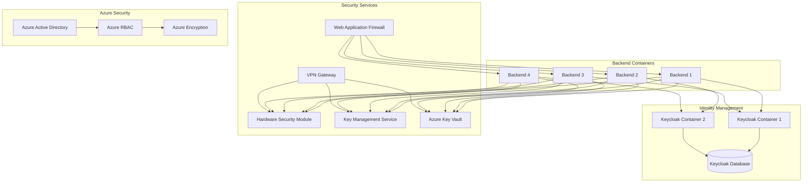

#### 6.1.5 **Monitoring & External Services**

**Description:** This diagram shows the comprehensive monitoring and external services architecture. It illustrates how backend services connect to various monitoring systems (Prometheus, Grafana, ELK Stack), Azure monitoring services (Monitor, Log Analytics, Metrics, Alerts), blockchain services (Ethereum Node, Blockchain Monitor), and external services (Email, SMS, Audit) for complete system observability and integration.

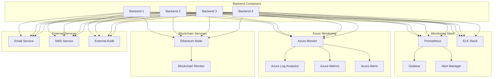

### 6.2 **Updated Deployment Configuration**

#### Container Orchestration (Kubernetes)
```yaml
# k8s/deployment.yaml
apiVersion: apps/v1
kind: Deployment
metadata:
  name: contract-management-backend
spec:
  replicas: 4
  selector:
    matchLabels:
      app: contract-management-backend
  template:
    metadata:
      labels:
        app: contract-management-backend
    spec:
      containers:
      - name: backend
        image: contract-management:latest
        ports:
        - containerPort: 3000
        env:
        - name: DATABASE_URL
          valueFrom:
            secretKeyRef:
              name: db-secret
              key: url
        - name: REDIS_URL
          valueFrom:
            secretKeyRef:
              name: redis-secret
              key: url
        - name: KEYCLOAK_URL
          valueFrom:
            secretKeyRef:
              name: keycloak-secret
              key: url
        - name: HSM_URL
          valueFrom:
            secretKeyRef:
              name: hsm-secret
              key: url
        - name: AZURE_SUBSCRIPTION_ID
          valueFrom:
            secretKeyRef:
              name: azure-secret
              key: subscription-id
        - name: AZURE_TENANT_ID
          valueFrom:
            secretKeyRef:
              name: azure-secret
              key: tenant-id
        - name: AZURE_CLIENT_ID
          valueFrom:
            secretKeyRef:
              name: azure-secret
              key: client-id
        - name: AZURE_CLIENT_SECRET
          valueFrom:
            secretKeyRef:
              name: azure-secret
              key: client-secret
        - name: ENCRYPTION_KEY
          valueFrom:
            secretKeyRef:
              name: encryption-secret
              key: key
        resources:
          requests:
            memory: "512Mi"
            cpu: "500m"
          limits:
            memory: "1Gi"
            cpu: "1000m"
```

---

## 7. **Updated Logical Class Diagram**

**Description:** This comprehensive class diagram shows the complete object-oriented structure of the system, including frontend components, backend models, and services. It illustrates the relationships between different classes, showing how data flows through the system and how different services interact with each other and the data models. The diagram includes the new Azure integration classes and their relationships.

```mermaid
classDiagram
    %% Frontend Components
    class ReactApp {
        +render()
        +handleState()
        +routeToPage()
    }
    
    class UserDashboard {
        +displayUserInfo()
        +showContracts()
        +showDatasets()
        +showNotifications()
    }
    
    class ContractForm {
        +createContract()
        +validateForm()
        +submitContract()
    }
    
    class SigningModal {
        +signContract()
        +verifySignature()
        +submitSignature()
    }
    
    class APIService {
        +get(url)
        +post(url, data)
        +put(url, data)
        +delete(url)
    }
    
    class TokenManager {
        +getToken()
        +refreshToken()
        +clearToken()
    }
    
    class ES256Signer {
        +signMessage(message, privateKey)
        +verifySignature(message, signature, publicKey)
    }
    
    %% Backend Models
    class User {
        +id: UUID
        +email: String
        +partyType: String
        +did: String
        +walletAddress: String
        +isActive: Boolean
        +createdAt: Date
        +create()
        +update()
        +delete()
        +findByEmail()
        +findByDID()
    }
    
    class Contract {
        +id: UUID
        +contractId: String
        +tdpId: UUID
        +tdcId: UUID
        +ccrpId: UUID
        +status: String
        +terms: JSON
        +signatures: JSON
        +createdAt: Date
        +ccrpAzureSubscriptionId: String
        +ccrpAzureTenantId: String
        +ccrpAzureLocation: String
        +ccrpAzureVMSize: String
        +ccrpAzureStorageSku: String
        +ccrpAzureDatabaseSku: String
        +ccrpAzureEnableEncryption: Boolean
        +ccrpAzureEnableMonitoring: Boolean
        +ccrpAzureBudgetLimit: Decimal
        +create()
        +update()
        +delete()
        +findByUser()
        +findByStatus()
    }
    
    class Dataset {
        +id: UUID
        +name: String
        +description: String
        +ownerId: UUID
        +depaId: String
        +metadata: JSON
        +accessControl: JSON
        +createdAt: Date
        +create()
        +update()
        +delete()
        +findByOwner()
        +findByDEPA()
    }
    
    class AIModel {
        +id: UUID
        +name: String
        +description: String
        +ownerId: UUID
        +depaId: String
        +modelType: String
        +metadata: JSON
        +createdAt: Date
        +create()
        +update()
        +delete()
        +findByOwner()
        +findByType()
    }
    
    class CCRPAzureCredentials {
        +id: UUID
        +ccrpUserId: UUID
        +subscriptionId: String
        +tenantId: String
        +clientId: String
        +clientSecret: String
        +authMethod: String
        +defaultLocation: String
        +defaultVMSize: String
        +enableEncryption: Boolean
        +budgetLimit: Decimal
        +validationStatus: String
        +isActive: Boolean
        +createdAt: Date
        +create()
        +update()
        +delete()
        +validateCredentials()
        +getAzureConfig()
    }
    
    class TrainingJob {
        +id: UUID
        +contractId: UUID
        +jobId: String
        +status: String
        +containerId: String
        +startTime: Date
        +endTime: Date
        +logs: JSON
        +results: JSON
        +createdAt: Date
        +create()
        +update()
        +delete()
        +findByContract()
        +findByStatus()
    }
    
    class Notification {
        +id: UUID
        +userId: UUID
        +type: String
        +title: String
        +message: String
        +isRead: Boolean
        +metadata: JSON
        +createdAt: Date
        +create()
        +markAsRead()
        +findByUser()
        +findUnread()
    }
    
    class AuditLog {
        +id: UUID
        +userId: UUID
        +action: String
        +resource: String
        +details: JSON
        +ipAddress: String
        +userAgent: String
        +timestamp: Date
        +create()
        +findByUser()
        +findByAction()
        +findByDateRange()
    }
    
    %% Backend Services
    class AuthService {
        +registerUser(userData)
        +loginUser(credentials)
        +verifyToken(token)
        +refreshToken(refreshToken)
        +logoutUser(userId)
        +resetPassword(email)
        +changePassword(userId, oldPassword, newPassword)
    }
    
    class DIDService {
        +createSystemDID(walletAddress, network)
        +resolveDID(did)
        +verifySignature(did, message, signature)
        +extractPublicKey(didDocument)
        +validateEnterpriseDID(did)
        +checkDIDAvailability(did)
    }
    
    class ContractService {
        +createContract(contractData)
        +getContract(contractId)
        +updateContract(contractId, updates)
        +deleteContract(contractId)
        +getUserContracts(userId)
        +getAllContracts(filters)
        +signContract(contractId, signatureData)
        +verifyContractSignatures(contractId)
    }
    
    class SigningService {
        +signMessage(message, did, userId)
        +verifyDIDSignature(did, message, signature)
        +recordSignature(contractId, userId, did, signature)
        +updateContractStatus(contract, userPartyType)
        +logSigningOperation(operationData)
    }
    
    class BlockchainService {
        +isConnected()
        +getContract(contractId)
        +deployContract(contractData)
        +signContract(contractId, privateKey)
        +verifyTransaction(transactionHash)
        +broadcastSignedTransaction(signedTransaction)
    }
    
    class NotificationService {
        +createNotification(notificationData)
        +sendEmailNotification(userId, emailData)
        +sendPushNotification(userId, pushData)
        +markNotificationAsRead(notificationId)
        +getUserNotifications(userId)
        +deleteNotification(notificationId)
    }
    
    class AuditService {
        +logEvent(eventData)
        +logUserAction(userId, action, resource, details)
        +logSystemEvent(event, details)
        +getAuditLogs(filters)
        +exportAuditLogs(dateRange)
        +generateAuditReport(reportParams)
    }
    
    class KeycloakService {
        +createUser(userData)
        +updateUser(userId, userData)
        +deleteUser(userId)
        +getUser(userId)
        +sendEmailVerification(userId)
        +resetPassword(userId)
        +assignRole(userId, role)
    }
    
    class InfrastructureService {
        +createTrainingEnvironment(contractId, config)
        +getEnvironment(environmentId)
        +updateEnvironment(environmentId, updates)
        +deleteEnvironment(environmentId)
        +listEnvironments(filters)
        +getEnvironmentStatus(environmentId)
    }
    
    class TrainingService {
        +startTraining(contractId, config)
        +getTrainingJob(jobId)
        +updateTrainingJob(jobId, updates)
        +stopTraining(jobId)
        +listTrainingJobs(filters)
        +getTrainingLogs(jobId)
        +getTrainingResults(jobId)
    }
    
    class CCRPAzureCredentialsService {
        +createOrUpdateCredentials(ccrpUserId, credentials, config)
        +getCredentials(ccrpUserId)
        +validateCredentials(ccrpUserId)
        +getContractAzureConfig(contractId)
        +updateContractAzureConfig(contractId, config)
        +listCCRPsWithCredentials()
        +deleteCredentials(ccrpUserId)
        +testAzureConnectivity(ccrpUserId)
    }
    
    %% Relationships
    ReactApp --> UserDashboard
    ReactApp --> ContractForm
    ReactApp --> SigningModal
    ReactApp --> APIService
    ReactApp --> TokenManager
    ReactApp --> ES256Signer
    
    UserDashboard --> APIService
    ContractForm --> APIService
    SigningModal --> ES256Signer
    SigningModal --> APIService
    
    %% Backend Relationships
    User ||--o{ Contract
    User ||--o{ Dataset
    User ||--o{ AIModel
    User ||--o{ Notification
    User ||--o{ AuditLog
    User ||--o{ CCRPAzureCredentials
    User ||--o{ TrainingJob
    
    Contract ||--o{ Dataset
    Contract ||--o{ AIModel
    Contract ||--o{ Notification
    Contract ||--o{ TrainingJob
    
    %% Service Relationships
    AuthService --> User
    AuthService --> KeycloakService
    ContractService --> Contract
    ContractService --> User
    ContractService --> Dataset
    ContractService --> AIModel
    ContractService --> SigningService
    ContractService --> BlockchainService
    ContractService --> NotificationService
    
    SigningService --> DIDService
    SigningService --> BlockchainService
    SigningService --> AuditService
    
    NotificationService --> Notification
    NotificationService --> User
    
    AuditService --> AuditLog
    AuditService --> User
    
    DIDService --> User
    BlockchainService --> Contract
    
    InfrastructureService --> CCRPAzureCredentials
    InfrastructureService --> Contract
    TrainingService --> TrainingJob
    TrainingService --> Contract
    CCRPAzureCredentialsService --> CCRPAzureCredentials
    CCRPAzureCredentialsService --> User
```

---

## 8. Stakeholder Mapping

| View           | Stakeholders                | Main Concerns/Artifacts                | Mapped Files/Dirs                        |
|----------------|----------------------------|----------------------------------------|------------------------------------------|
| Use Case (+1)  | All                        | Scenarios, sequence diagrams           | `frontend/src/pages/`, `backend/routes/` |
| Logical        | Designers, Users           | Class, component diagrams              | `frontend/src/`, `backend/services/`     |
| Development    | Developers, DevOps         | Code structure, modules, packages      | `frontend/`, `backend/`                  |
| Process        | Integrators, Testers       | Sequence/activity diagrams, flows      | `backend/services/`, `backend/routes/`   |
| Physical       | Sysadmins, DevOps, Security| Deployment, network, infra diagrams    | Docker, k8s, cloud infra                 |

---

## 9. Implementation Guidelines

### 9.1 Development Workflow
1. **Design Phase**: Use Logical and Development views to plan features
2. **Implementation Phase**: Follow Process view for integration points
3. **Testing Phase**: Use Use Case view to validate scenarios
4. **Deployment Phase**: Follow Physical view for infrastructure setup

### 9.2 Code Organization
- **Frontend**: Component-based architecture with service layer
- **Backend**: Route → Service → Model pattern
- **Database**: Sequelize ORM with migrations
- **Security**: JWT + Keycloak integration
- **Blockchain**: Ethereum integration with fallback
- **Azure Integration**: Real Azure SDK with CCRP-specific credentials

### 9.3 Security Considerations
- **Authentication**: Multi-factor authentication via Keycloak
- **Authorization**: Role-based access control
- **Cryptography**: ES256 signing with HSM/KMS
- **Audit**: Comprehensive logging and monitoring
- **Compliance**: DPDP, GDPR, enterprise security standards
- **Azure Security**: Encrypted credential storage, CCRP isolation

### 9.4 Scalability Strategy
- **Horizontal Scaling**: Multiple backend containers
- **Database**: Master-slave replication
- **Caching**: Redis for session and data caching
- **CDN**: Static asset delivery
- **Load Balancing**: Kubernetes ingress controller
- **Multi-Tenant**: CCRP isolation with independent Azure subscriptions
- **Real Infrastructure**: Actual Azure resource provisioning

### 9.5 **New Azure Integration Guidelines**

#### **CCRP Credential Management**
- **Encrypted Storage**: AES-256-CBC encryption for client secrets
- **Multi-Tenant**: Each CCRP has independent Azure subscription
- **Validation**: Automatic credential validation before use
- **Audit Trail**: Complete tracking of credential changes

#### **Infrastructure Provisioning**
- **Real Resources**: Actual Azure VMs, storage, networking
- **Container Deployment**: Real Azure Container Instances
- **Cost Management**: Per-CCRP and per-contract budget tracking
- **Monitoring**: Real Azure Monitor integration

#### **Training Environment**
- **Real Execution**: Actual container deployment for training
- **Data Access**: Real Azure Storage blob access
- **Model Registration**: Real Azure ML model registration
- **Security**: Real Azure Key Vault integration

---

## 10. Conclusion

This UML 4+1 View Architecture provides a comprehensive framework for understanding, developing, and maintaining the Contract Management System. Each view serves specific stakeholders and concerns:

- **Use Case View**: Validates requirements and user scenarios
- **Logical View**: Guides system design and component relationships
- **Development View**: Organizes code structure and modules
- **Process View**: Ensures proper integration and workflows
- **Physical View**: Plans deployment and infrastructure

The architecture supports enterprise-grade security, scalability, and compliance while maintaining clear separation of concerns and modular design principles. **The latest v2.0 update adds real Azure infrastructure provisioning with multi-tenant CCRP credential management, making the system truly production-ready for enterprise deployments.**

---

**Document Version:** 2.0  
**Last Updated:** December 2024  
**Next Review:** March 2025 