# UML 4+1 View Architecture Documentation
## Contract Management System

**Document Version:** 1.0  
**Date:** December 2024  
**Author:** Contract Management System Team

---

## Table of Contents

1. [Executive Summary](#executive-summary)
2. [Use Case View (+1)](#use-case-view-1)
3. [Logical View](#logical-view)
4. [Development View](#development-view)
5. [Process View](#process-view)
6. [Physical View](#physical-view)
7. [Stakeholder Mapping](#stakeholder-mapping)
8. [Implementation Guidelines](#implementation-guidelines)

---

## 1. Executive Summary

### 1.1 Overview
This document provides a comprehensive UML 4+1 View Architecture for the Contract Management System, covering all aspects from user interactions to deployment infrastructure. The system supports enterprise registration, DID-based identity management, cryptographic contract signing, and multi-party contract execution.

### 1.2 Key Components
- **Frontend**: React-based user interface with role-based dashboards
- **Backend**: Node.js/Express API with microservices architecture
- **Identity Management**: Keycloak IAM integration
- **Blockchain**: Ethereum-based contract recording
- **Database**: PostgreSQL with Redis caching
- **Security**: HSM/KMS integration for cryptographic operations

### 1.3 Target Users
- **TDP (Training Data Provider)**: Dataset and model management
- **TDC (Training Data Consumer)**: Contract creation and management
- **CCRP (Confidential Clean Room Provider)**: Compliance and resource monitoring
- **AppAdmin**: System administration and oversight

---

## 2. Use Case View (+1)

### 2.1 Actors
- **TDP (Training Data Provider)**
- **TDC (Training Data Consumer)**
- **CCRP (Confidential Clean Room Provider)**
- **AppAdmin**
- **Keycloak IAM**
- **Blockchain**
- **External Auditors**

### 2.2 Major Use Cases
- Register/Onboard as Enterprise
- Login/Authenticate
- Manage Profile & DIDs
- Create/Manage Datasets
- Create/Manage AI Models
- Create Contract
- Sign Contract (multi-party)
- Verify Contract
- Monitor Resource Usage (CCRP)
- Notification & Audit Trail
- Administer System

### 2.3 Use Case Diagram

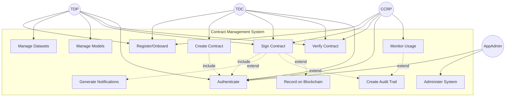

### 2.4 Key Scenarios

#### Scenario 1: Enterprise Registration
1. User accesses registration portal
2. Selects enterprise type (TDP/TDC/CCRP)
3. Provides organization details and domain
4. System generates DID:web identifier
5. Creates Keycloak user account
6. Sends verification email
7. User completes profile setup

#### Scenario 2: Contract Creation and Signing
1. TDC creates contract with dataset and AI model requirements
2. System notifies TDP and CCRP
3. TDP reviews and signs contract (DID-based)
4. TDC signs contract (wallet-based)
5. CCRP reviews compliance and signs contract (DID-based)
6. Contract is recorded on blockchain
7. All parties receive notifications

---

## 3. Logical View

### 3.1 Main Components
- **Frontend (React)**
- **Backend (Node.js/Express)**
  - Auth Service
  - User Service
  - DID Service
  - Dataset Service
  - Model Service
  - Contract Service
  - Signing Service
  - Notification Service
  - Audit Service
  - Admin Service
- **Keycloak IAM**
- **Blockchain Service**
- **Database (PostgreSQL)**
- **Monitoring/Logging**

### 3.2 Component Diagram

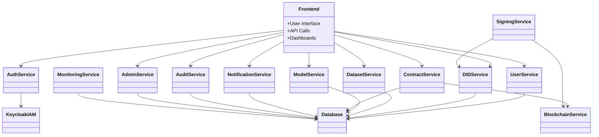

---

## 4. Development View

### 4.1 Code/Module Structure

#### Frontend Structure
```
frontend/
├── src/
│   ├── components/
│   │   ├── dashboards/
│   │   ├── forms/
│   │   ├── modals/
│   │   └── common/
│   ├── pages/
│   │   ├── dashboards/
│   │   ├── contracts/
│   │   ├── datasets/
│   │   └── admin/
│   ├── services/
│   │   ├── api.js
│   │   └── tokenManager.js
│   └── utils/
│       └── es256sign.js
├── public/
└── package.json
```

#### Backend Structure
```
backend/
├── routes/
│   ├── auth.js
│   ├── contracts.js
│   ├── datasets.js
│   ├── ai-models.js
│   ├── ccrp.js
│   ├── tdp.js
│   ├── tdc.js
│   └── admin.js
├── models/
│   ├── User.js
│   ├── Contract.js
│   ├── Dataset.js
│   ├── AIModel.js
│   ├── Notification.js
│   └── AuditLog.js
├── services/
│   ├── authService.js
│   ├── didService.js
│   ├── blockchainService.js
│   ├── auditService.js
│   ├── notificationService.js
│   └── signingService.js
├── middleware/
│   ├── auth.js
│   └── errorHandler.js
└── scripts/
    ├── migrations/
    └── test-data/
```

### 4.2 Module Structure Diagram

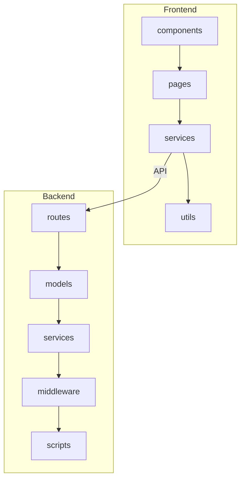

---

## 5. Process View

### 5.1 Key Processes & Interactions

#### User Registration/Onboarding
- `frontend/src/pages/UserRegistration.js`
- `backend/routes/auth.js`

#### Authentication (JWT, Keycloak)
- `backend/middleware/auth.js`
- `backend/services/***REMOVED-KEYCLOAK_DB_PASSWORD***Service.js`

#### Contract Creation & Multi-Party Signing
- `frontend/src/pages/Contracts.js`
- `backend/routes/contracts.js`
- `backend/services/signingService.js`

#### DID Resolution & Verification
- `backend/services/didService.js`

#### Blockchain Transaction
- `backend/services/blockchainService.js`

#### Notification Dispatch
- `backend/services/notificationService.js`

#### Audit Logging
- `backend/services/auditService.js`

#### Resource Monitoring (CCRP)
- `frontend/src/pages/dashboards/CCRPDashboard.js`
- `backend/routes/ccrp.js`

### 5.2 Contract Signing Process - Phased Sequence Diagrams

#### 5.2.1 Phase 1: Contract Creation by TDC

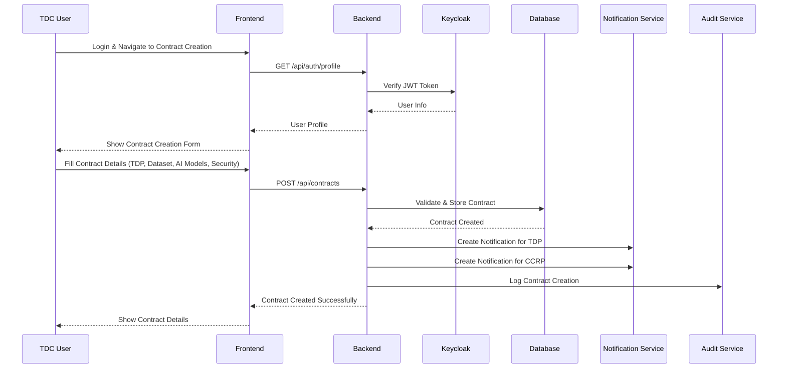

#### 5.2.2 Phase 2: TDP Signs Contract (DID-based)

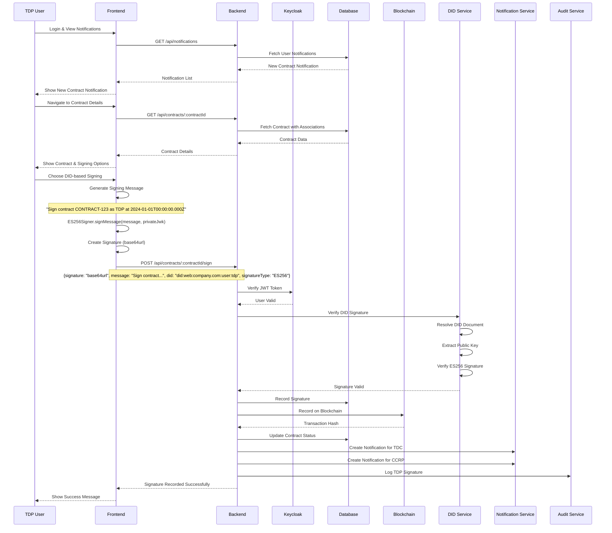

#### 5.2.3 Phase 3: TDC Signs Contract (Wallet-based)

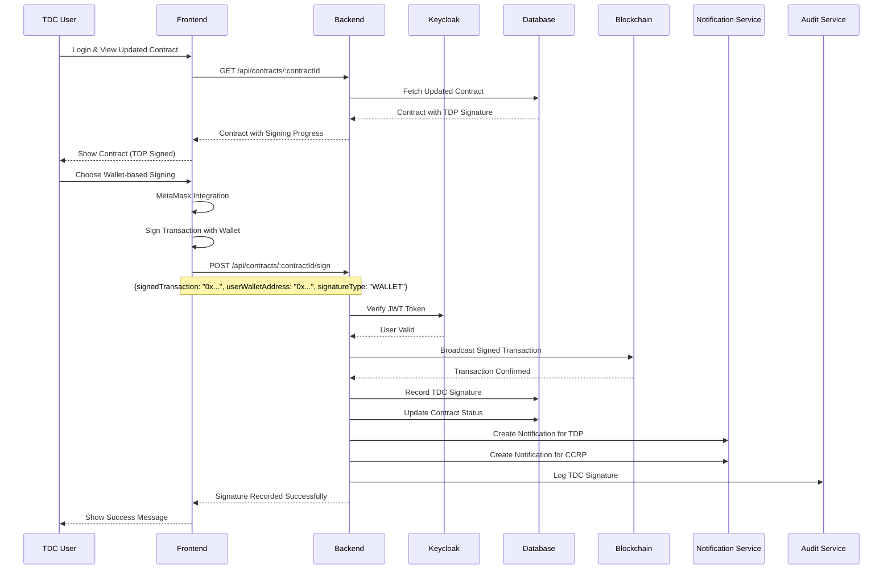

#### 5.2.4 Phase 4: CCRP Signs Contract (DID-based)

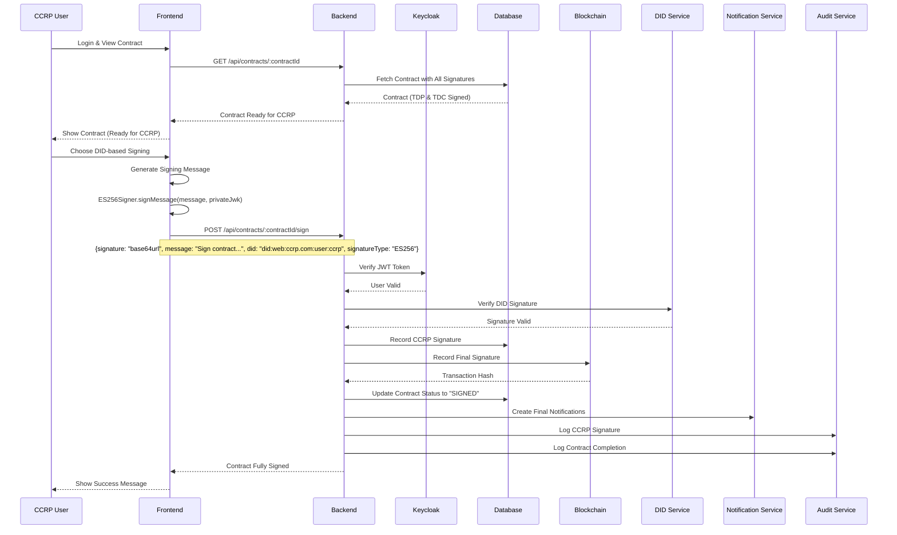

#### 5.2.5 Phase 5: Contract Execution

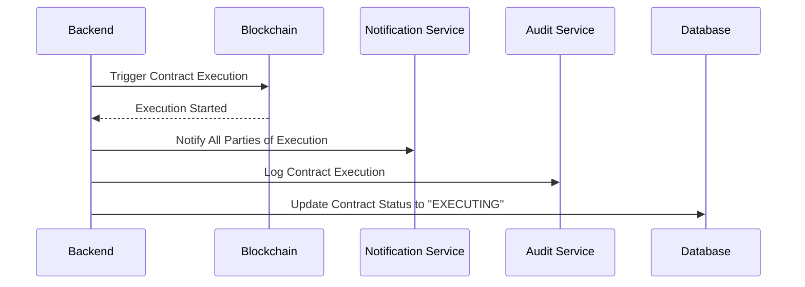

### 5.3 Contract Signing Activity Diagram (Swim Lanes)

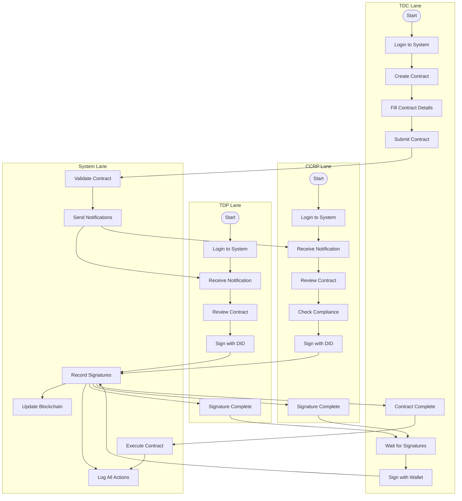

### 5.4 Contract State Diagram

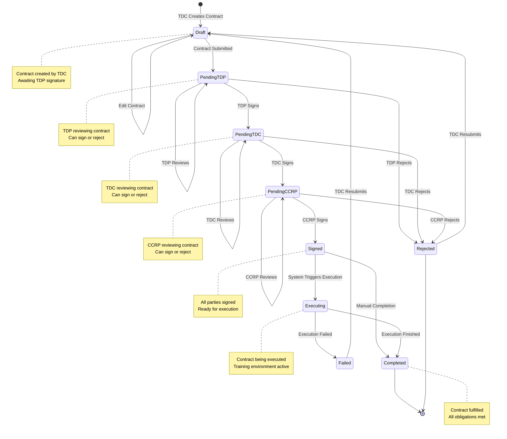

---

## 6. Physical View

### 6.1 Deployment/Infrastructure

#### 6.1.1 High-Level Architecture Overview

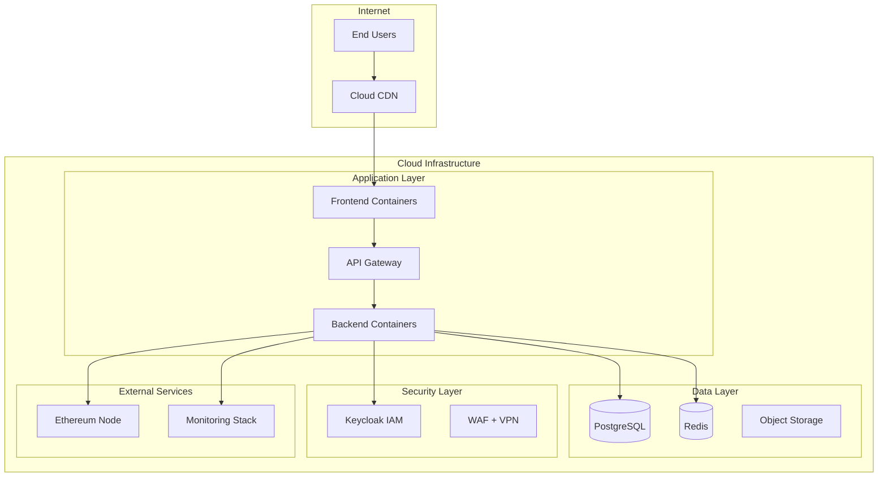

#### 6.1.2 Application Layer Detail

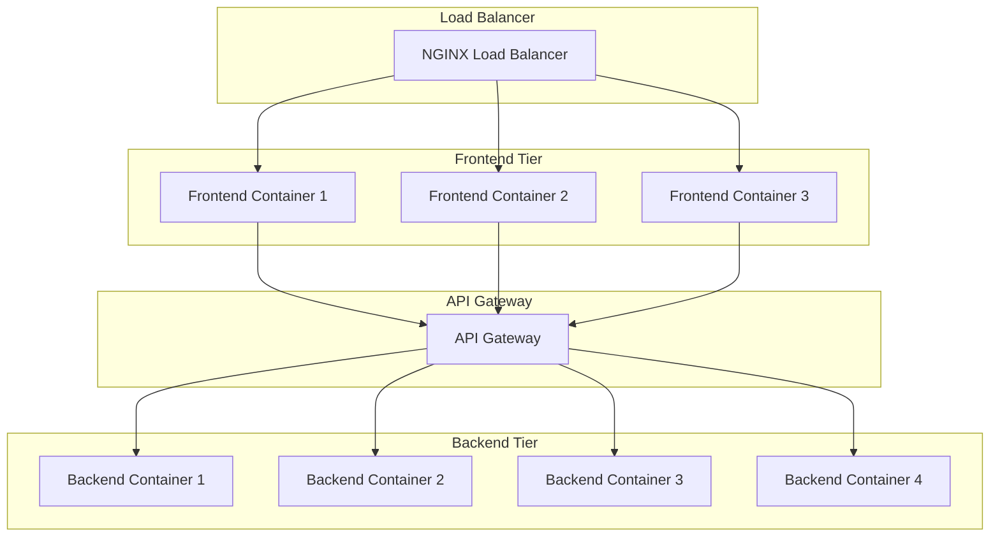

#### 6.1.3 Data Layer Architecture

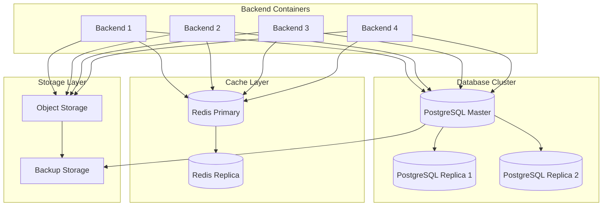

#### 6.1.4 Security & Identity Layer

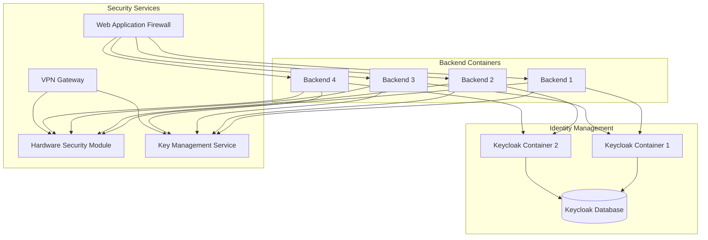

#### 6.1.5 Monitoring & External Services

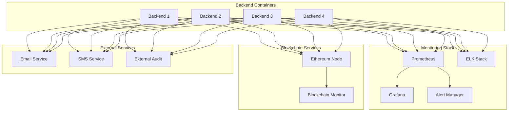

### 6.2 Deployment Configuration

#### Container Orchestration (Kubernetes)
```yaml
# k8s/deployment.yaml
apiVersion: apps/v1
kind: Deployment
metadata:
  name: contract-management-backend
spec:
  replicas: 4
  selector:
    matchLabels:
      app: contract-management-backend
  template:
    metadata:
      labels:
        app: contract-management-backend
    spec:
      containers:
      - name: backend
        image: contract-management:latest
        ports:
        - containerPort: 3000
        env:
        - name: DATABASE_URL
          valueFrom:
            secretKeyRef:
              name: db-secret
              key: url
        - name: REDIS_URL
          valueFrom:
            secretKeyRef:
              name: redis-secret
              key: url
        - name: KEYCLOAK_URL
          valueFrom:
            secretKeyRef:
              name: ***REMOVED-KEYCLOAK_DB_PASSWORD***-secret
              key: url
        - name: HSM_URL
          valueFrom:
            secretKeyRef:
              name: hsm-secret
              key: url
        resources:
          requests:
            memory: "512Mi"
            cpu: "500m"
          limits:
            memory: "1Gi"
            cpu: "1000m"
        livenessProbe:
          httpGet:
            path: /health
            port: 3000
          initialDelaySeconds: 30
          periodSeconds: 10
        readinessProbe:
          httpGet:
            path: /ready
            port: 3000
          initialDelaySeconds: 5
          periodSeconds: 5
```

#### Service Configuration
```yaml
# k8s/service.yaml
apiVersion: v1
kind: Service
metadata:
  name: contract-management-backend-service
spec:
  selector:
    app: contract-management-backend
  ports:
  - protocol: TCP
    port: 80
    targetPort: 3000
  type: LoadBalancer
```

#### Ingress Configuration
```yaml
# k8s/ingress.yaml
apiVersion: networking.k8s.io/v1
kind: Ingress
metadata:
  name: contract-management-ingress
  annotations:
    nginx.ingress.kubernetes.io/ssl-redirect: "true"
    nginx.ingress.kubernetes.io/force-ssl-redirect: "true"
spec:
  tls:
  - hosts:
    - api.contractmanagement.com
    secretName: tls-secret
  rules:
  - host: api.contractmanagement.com
    http:
      paths:
      - path: /
        pathType: Prefix
        backend:
          service:
            name: contract-management-backend-service
            port:
              number: 80
```

---

## 7. Full Class Diagram

### 7.1 Complete Class Structure with Relationships

```mermaid
classDiagram
    %% Frontend Classes
    class ReactApp {
        +render()
        +handleNavigation()
        +manageState()
    }
    
    class UserDashboard {
        +displayUserInfo()
        +showNotifications()
        +navigateToFeatures()
    }
    
    class ContractForm {
        +createContract()
        +validateForm()
        +submitContract()
    }
    
    class SigningModal {
        +showSigningOptions()
        +handleDIDSigning()
        +handleWalletSigning()
        +verifySignature()
    }
    
    class APIService {
        +get(endpoint)
        +post(endpoint, data)
        +put(endpoint, data)
        +delete(endpoint)
        +setAuthToken(token)
    }
    
    class TokenManager {
        +storeToken(token)
        +getToken()
        +refreshToken()
        +clearToken()
    }
    
    class ES256Signer {
        +signMessage(message, privateJwk)
        +verifySignature(message, signature, publicJwk)
        +importPrivateKey(jwk)
    }
    
    %% Backend Models
    class User {
        +id: UUID
        +name: String
        +email: String
        +partyType: String
        +did: String
        +walletAddress: String
        +publicKey: String
        +organization: String
        +isActive: Boolean
        +registrationDate: Date
        +onboardingStatus: String
        +profileCompleted: Boolean
        +emailVerified: Boolean
        +iamUserId: String
        +cloudProviders: Array
        +description: String
        +create()
        +update()
        +delete()
        +findByEmail()
        +findByDID()
    }
    
    class Contract {
        +contractId: String
        +tdpId: UUID
        +tdcId: UUID
        +ccrpId: UUID
        +datasetId: UUID
        +status: String
        +trainingParams: JSON
        +securityRequirements: JSON
        +aiModelIds: Array
        +ccrpCloudProvider: String
        +createdAt: Date
        +updatedAt: Date
        +create()
        +update()
        +delete()
        +findByContractId()
        +findByUser()
        +updateStatus()
    }
    
    class Dataset {
        +id: UUID
        +name: String
        +description: String
        +category: String
        +price: Decimal
        +ownerId: UUID
        +isActive: Boolean
        +metadata: JSON
        +create()
        +update()
        +delete()
        +findByOwner()
        +findByCategory()
    }
    
    class AIModel {
        +id: UUID
        +modelId: String
        +name: String
        +description: String
        +type: String
        +architecture: String
        +framework: String
        +parameters: JSON
        +privacyTechnique: String
        +validationMetrics: JSON
        +maxEpochs: Integer
        +batchSize: Integer
        +learningRate: Decimal
        +isActive: Boolean
        +create()
        +update()
        +delete()
        +findByType()
        +findByFramework()
    }
    
    class Notification {
        +id: UUID
        +userId: UUID
        +type: String
        +title: String
        +message: String
        +isRead: Boolean
        +metadata: JSON
        +createdAt: Date
        +create()
        +markAsRead()
        +findByUser()
        +findUnread()
    }
    
    class AuditLog {
        +id: UUID
        +userId: UUID
        +action: String
        +resource: String
        +details: JSON
        +ipAddress: String
        +userAgent: String
        +timestamp: Date
        +create()
        +findByUser()
        +findByAction()
        +findByDateRange()
    }
    
    %% Backend Services
    class AuthService {
        +registerUser(userData)
        +loginUser(credentials)
        +verifyToken(token)
        +refreshToken(refreshToken)
        +logoutUser(userId)
        +resetPassword(email)
        +changePassword(userId, oldPassword, newPassword)
    }
    
    class DIDService {
        +createSystemDID(walletAddress, network)
        +resolveDID(did)
        +verifySignature(did, message, signature)
        +extractPublicKey(didDocument)
        +validateEnterpriseDID(did)
        +checkDIDAvailability(did)
    }
    
    class ContractService {
        +createContract(contractData)
        +getContract(contractId)
        +updateContract(contractId, updates)
        +deleteContract(contractId)
        +getUserContracts(userId)
        +getAllContracts(filters)
        +signContract(contractId, signatureData)
        +verifyContractSignatures(contractId)
    }
    
    class SigningService {
        +signMessage(message, did, userId)
        +verifyDIDSignature(did, message, signature)
        +recordSignature(contractId, userId, did, signature)
        +updateContractStatus(contract, userPartyType)
        +logSigningOperation(operationData)
    }
    
    class BlockchainService {
        +isConnected()
        +getContract(contractId)
        +deployContract(contractData)
        +signContract(contractId, privateKey)
        +verifyTransaction(transactionHash)
        +broadcastSignedTransaction(signedTransaction)
    }
    
    class NotificationService {
        +createNotification(notificationData)
        +sendEmailNotification(userId, emailData)
        +sendPushNotification(userId, pushData)
        +markNotificationAsRead(notificationId)
        +getUserNotifications(userId)
        +deleteNotification(notificationId)
    }
    
    class AuditService {
        +logEvent(eventData)
        +logUserAction(userId, action, resource, details)
        +logSystemEvent(event, details)
        +getAuditLogs(filters)
        +exportAuditLogs(dateRange)
        +generateAuditReport(reportParams)
    }
    
    class KeycloakService {
        +createUser(userData)
        +updateUser(userId, userData)
        +deleteUser(userId)
        +getUser(userId)
        +sendEmailVerification(userId)
        +resetPassword(userId)
        +assignRole(userId, role)
    }
    
    %% Relationships
    ReactApp --> UserDashboard
    ReactApp --> ContractForm
    ReactApp --> SigningModal
    ReactApp --> APIService
    ReactApp --> TokenManager
    ReactApp --> ES256Signer
    
    UserDashboard --> APIService
    ContractForm --> APIService
    SigningModal --> ES256Signer
    SigningModal --> APIService
    
    %% Backend Relationships
    User ||--o{ Contract : "creates"
    User ||--o{ Dataset : "owns"
    User ||--o{ AIModel : "owns"
    User ||--o{ Notification : "receives"
    User ||--o{ AuditLog : "generates"
    
    Contract ||--o{ Dataset : "references"
    Contract ||--o{ AIModel : "references"
    Contract ||--o{ Notification : "triggers"
    
    %% Service Relationships
    AuthService --> User
    AuthService --> KeycloakService
    ContractService --> Contract
    ContractService --> User
    ContractService --> Dataset
    ContractService --> AIModel
    ContractService --> SigningService
    ContractService --> BlockchainService
    ContractService --> NotificationService
    
    SigningService --> DIDService
    SigningService --> BlockchainService
    SigningService --> AuditService
    
    NotificationService --> Notification
    NotificationService --> User
    
    AuditService --> AuditLog
    AuditService --> User
    
    DIDService --> User
    BlockchainService --> Contract
```

---

## 8. Stakeholder Mapping

| View           | Stakeholders                | Main Concerns/Artifacts                | Mapped Files/Dirs                        |
|----------------|----------------------------|----------------------------------------|------------------------------------------|
| Use Case (+1)  | All                        | Scenarios, sequence diagrams           | `frontend/src/pages/`, `backend/routes/` |
| Logical        | Designers, Users           | Class, component diagrams              | `frontend/src/`, `backend/services/`     |
| Development    | Developers, DevOps         | Code structure, modules, packages      | `frontend/`, `backend/`                  |
| Process        | Integrators, Testers       | Sequence/activity diagrams, flows      | `backend/services/`, `backend/routes/`   |
| Physical       | Sysadmins, DevOps, Security| Deployment, network, infra diagrams    | Docker, k8s, cloud infra                 |

---

## 9. Implementation Guidelines

### 9.1 Development Workflow
1. **Design Phase**: Use Logical and Development views to plan features
2. **Implementation Phase**: Follow Process view for integration points
3. **Testing Phase**: Use Use Case view to validate scenarios
4. **Deployment Phase**: Follow Physical view for infrastructure setup

### 9.2 Code Organization
- **Frontend**: Component-based architecture with service layer
- **Backend**: Route → Service → Model pattern
- **Database**: Sequelize ORM with migrations
- **Security**: JWT + Keycloak integration
- **Blockchain**: Ethereum integration with fallback

### 9.3 Security Considerations
- **Authentication**: Multi-factor authentication via Keycloak
- **Authorization**: Role-based access control
- **Cryptography**: ES256 signing with HSM/KMS
- **Audit**: Comprehensive logging and monitoring
- **Compliance**: DPDP, GDPR, enterprise security standards

### 9.4 Scalability Strategy
- **Horizontal Scaling**: Multiple backend containers
- **Database**: Master-slave replication
- **Caching**: Redis for session and data caching
- **CDN**: Static asset delivery
- **Load Balancing**: Kubernetes ingress controller

---

## 10. Conclusion

This UML 4+1 View Architecture provides a comprehensive framework for understanding, developing, and maintaining the Contract Management System. Each view serves specific stakeholders and concerns:

- **Use Case View**: Validates requirements and user scenarios
- **Logical View**: Guides system design and component relationships
- **Development View**: Organizes code structure and modules
- **Process View**: Ensures proper integration and workflows
- **Physical View**: Plans deployment and infrastructure

The architecture supports enterprise-grade security, scalability, and compliance while maintaining clear separation of concerns and modular design principles.

---

**Document Version:** 1.0  
**Last Updated:** December 2024  
**Next Review:** March 2025 