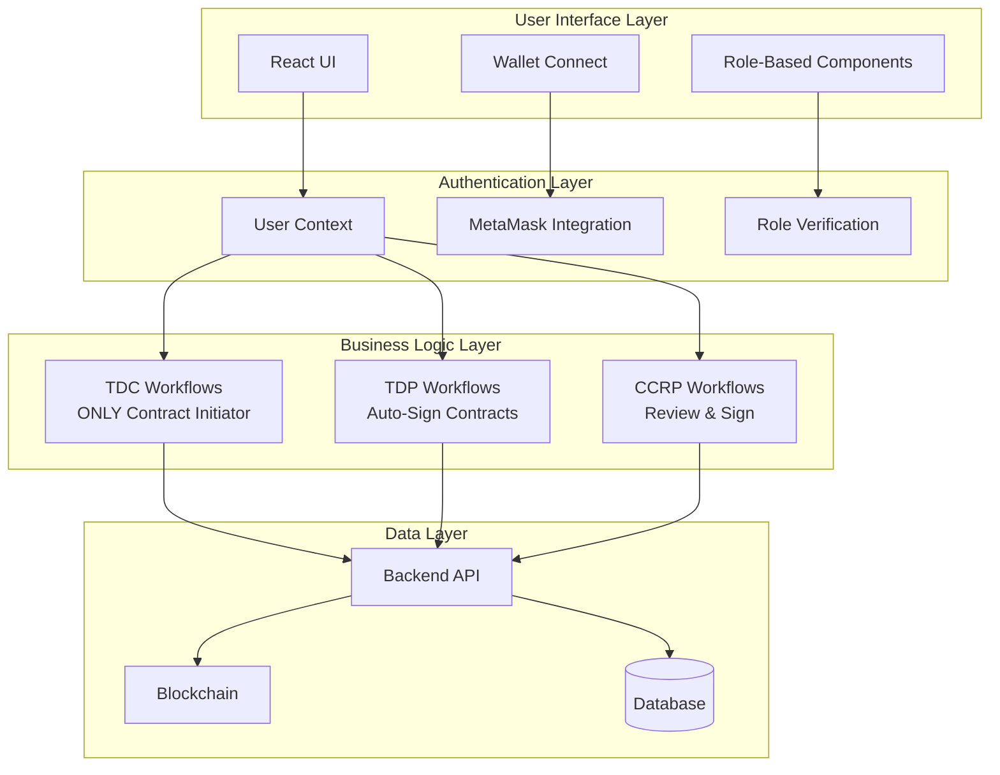
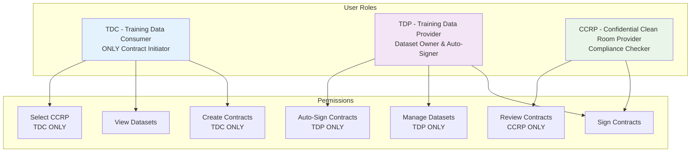
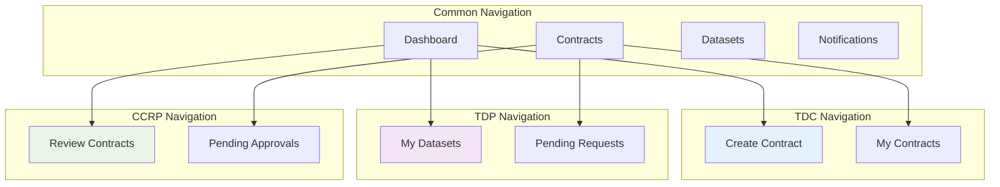
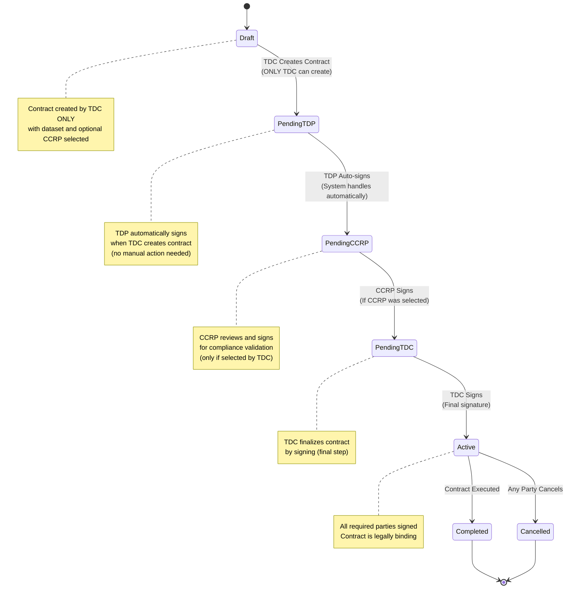

# User Guide
## Contract Management System

Complete guide for using the Contract Management System with role-based interfaces and workflows.

## 👥 User Roles Overview

The Contract Management System implements role-based user interfaces that customize the experience based on user types:

- **TDC (Training Data Consumer)**: ONLY role that can initiate contracts by selecting datasets and CCRP
- **TDP (Training Data Provider)**: Provides datasets and automatically signs contracts when created by TDC
- **CCRP (Confidential Clean Room Provider)**: Reviews and signs contracts for compliance validation

### System Architecture Overview


## 🎯 User Roles and Responsibilities

### TDC (Training Data Consumer) - CONTRACT INITIATOR
**Primary Role**: ONLY role that can initiate contracts by selecting datasets and CCRP providers

**Responsibilities**:
- Browse available datasets
- Select CCRP for contract review (optional)
- Create contracts with dataset and CCRP selection
- Sign contracts to finalize agreements
- Access purchased data after contract completion

**UI Features**:
- Can access "Create Contract" functionality (exclusive to TDC)
- Views datasets available for purchase
- Manages their initiated contracts
- Selects CCRP providers for contracts
- Completes contracts when training is finished

### TDP (Training Data Provider) - DATASET OWNER
**Primary Role**: Provides datasets and automatically signs contracts when created by TDC

**Responsibilities**:
- Upload and manage datasets
- Automatically sign contracts when created by TDC (no manual action needed)
- Monitor contract status and history
- Receive payments for data access

**UI Features**:
- Views their owned datasets
- Automatically signs contracts when created by TDC (system handles this)
- Reviews contract requests and status
- Manages dataset listings

### CCRP (Confidential Clean Room Provider) - COMPLIANCE REVIEWER
**Primary Role**: Reviews and signs contracts for compliance validation

**Responsibilities**:
- Review contract terms and conditions when selected by TDC
- Validate legal compliance
- Sign contracts after thorough review
- Provide oversight and maintain audit trail

**UI Features**:
- Reviews contract requests where they are selected by TDC
- Signs contracts to approve participation
- Views contracts they are involved in

### Role Hierarchy and Permissions


## 🚀 Getting Started

### Step 1: Connect Your Wallet
1. Open the application in your browser (http://localhost:3000)
2. Click "Connect Wallet" in the top-right corner
3. MetaMask will prompt you to connect - click "Connect"
4. Select the account you want to use

### Step 2: Register Your Account
1. If this is your first time, you'll need to register
2. Click "User Registration" in the navigation
3. Fill in your details and click "Register"

### Step 3: Switch Between Roles
1. Click the "Switch Wallet" button in the top navigation
2. Select the wallet for the role you want to use
3. Switch to that account in MetaMask
4. Click "Refresh App" to update the interface

## 📱 Role-Based Interface

### Navigation Structure


### Dashboard Views

#### TDC Dashboard
- **Quick Actions**: Create new contract, browse datasets
- **Recent Contracts**: View contracts you've initiated
- **Available Datasets**: Browse datasets for purchase
- **Notifications**: Contract status updates

#### TDP Dashboard
- **My Datasets**: Manage your dataset listings
- **Contract Requests**: View pending contract requests
- **Revenue Overview**: Track earnings from data sales
- **Notifications**: New contract notifications

#### CCRP Dashboard
- **Pending Reviews**: Contracts awaiting your review
- **Recent Approvals**: Contracts you've recently signed
- **Compliance Overview**: Track review statistics
- **Notifications**: New contract review requests

## 📋 Contract Workflows

### Contract Creation Workflow (TDC ONLY)
```mermaid
flowchart TD
    A[TDC User<br/>ONLY Role] --> B[Browse Datasets]
    B --> C[Select Dataset]
    C --> D[Configure Contract]
    D --> E[Select CCRP<br/>Optional]
    E --> F[Review Contract]
    F --> G[Create Contract]
    G --> H[TDP Auto-Signs<br/>System Handled]
    H --> I[CCRP Notified<br/>If Selected]
    I --> J[CCRP Reviews<br/>If Selected]
    J --> K[CCRP Signs<br/>If Selected]
    K --> L[TDC Signs<br/>Final Step]
    L --> M[Contract Active]
    
    style A fill:#e3f2fd
    style H fill:#f3e5f5
    style J fill:#e8f5e8
    style L fill:#e3f2fd
    
    note right of A
        ONLY TDC can initiate
        contract creation
    end note
    
    note right of H
        TDP automatically signs
        when TDC creates contract
        (no manual action needed)
    end note
```

### Contract Signing Workflow


## 🎯 Step-by-Step Workflows

### For TDC (Training Data Consumer) - CONTRACT INITIATOR

#### 1. Browse Datasets
1. Navigate to "Datasets" in the sidebar
2. Browse available datasets with descriptions and pricing
3. Click on a dataset to view detailed information
4. Note the dataset ID and owner information

#### 2. Create a Contract (TDC ONLY)
1. Click "Create Contract" in the navigation (only visible to TDC)
2. Select a dataset from the dropdown
3. Configure contract details:
   - **Price**: Set the contract price
   - **Duration**: Specify contract duration
   - **Terms**: Add any special terms or conditions
4. Optionally select a CCRP provider for compliance review
5. Review the contract summary
6. Click "Create Contract"

#### 3. Sign the Contract (Final Step)
1. Navigate to "Contracts" to view your contracts
2. Find the contract in "Pending TDC Approval" status
3. Click "Sign Contract" button (final signature)
4. MetaMask will prompt for signature
5. Confirm the transaction
6. Contract status updates to "Active"

### For TDP (Training Data Provider) - DATASET OWNER

#### 1. Manage Datasets
1. Navigate to "My Datasets" in the sidebar
2. View your existing datasets
3. Create new datasets with:
   - **Name**: Descriptive dataset name
   - **Description**: Detailed description
   - **Category**: Dataset category
   - **Price**: Pricing information
4. Edit or delete existing datasets as needed

#### 2. Monitor Contracts
1. Navigate to "Contracts" to view contract requests
2. Contracts are automatically signed when created by TDC (system handles this)
3. Monitor contract status and history
4. View revenue from completed contracts

#### 3. Review Notifications
1. Check the notifications panel for new contract requests
2. Review contract details and terms
3. Contracts are automatically approved and signed (no manual action needed)

### For CCRP (Confidential Clean Room Provider) - COMPLIANCE REVIEWER

#### 1. Review Contract Requests
1. Navigate to "Contracts" to view pending reviews (only if selected by TDC)
2. Click on a contract to view detailed information
3. Review:
   - Dataset information
   - Contract terms and conditions
   - TDC and TDP information
   - Pricing and duration

#### 2. Sign Contracts
1. After reviewing, click "Sign Contract"
2. MetaMask will prompt for signature
3. Confirm the transaction
4. Contract status updates to next stage

#### 3. Track Approvals
1. View signed contracts in "My Contracts"
2. Monitor compliance statistics
3. Maintain audit trail of approvals

## 🔔 Notifications System

### Notification Types
- **Contract Created**: New contract requests
- **Contract Signed**: Status updates when parties sign
- **Contract Completed**: When contracts are finalized
- **System Updates**: Important system notifications

### Managing Notifications
1. Click the notification bell icon in the top navigation
2. View unread notifications
3. Mark notifications as read
4. Click on notifications to navigate to relevant pages

## 🔍 Troubleshooting

### Common Issues

#### Issue: Can't See Expected Menu Items
**Cause**: Wrong role is active
**Solution**: 
1. Check your current wallet/role in the top navigation
2. Switch to the correct wallet using the wallet switcher
3. Refresh the application

#### Issue: Contract Creation Fails
**Cause**: Missing dataset or CCRP selection
**Solution**:
1. Ensure you've selected a valid dataset
2. Verify the CCRP selection (if required)
3. Check that all required fields are filled

#### Issue: Contract Signing Fails
**Cause**: MetaMask transaction issues
**Solution**:
1. Check MetaMask connection
2. Ensure you have sufficient ETH for gas fees
3. Verify you're on the correct network (localhost:8545)
4. Try refreshing the page and retrying

#### Issue: Notifications Not Appearing
**Cause**: Real-time updates may be delayed
**Solution**:
1. Refresh the page to get latest notifications
2. Check the notifications panel manually
3. Verify backend services are running

### Getting Help

#### Debug Information
1. Click the bug icon (🐛) in the top navigation
2. View detailed debug information including:
   - Current wallet address
   - User role and permissions
   - Connection status
   - Recent API calls

#### Manual Refresh
1. Use the "Refresh App" button in the wallet switcher
2. Force refresh the page (Ctrl+F5 or Cmd+Shift+R)
3. Restart the application services if needed

## 📊 Best Practices

### For TDC Users
- **Research Datasets**: Review dataset descriptions and pricing before creating contracts
- **Select Appropriate CCRP**: Choose CCRP providers based on your compliance needs
- **Review Contract Terms**: Carefully review all contract terms before signing
- **Monitor Contract Status**: Regularly check contract status and notifications

### For TDP Users
- **Maintain Dataset Quality**: Keep dataset descriptions and pricing up to date
- **Monitor Requests**: Regularly check for new contract requests
- **Track Revenue**: Monitor earnings from completed contracts
- **Update Information**: Keep your profile and dataset information current

### For CCRP Users
- **Thorough Reviews**: Carefully review all contract terms and conditions
- **Compliance Focus**: Ensure contracts meet compliance requirements
- **Timely Responses**: Respond to contract review requests promptly
- **Maintain Records**: Keep track of all contract reviews and approvals

## 🔐 Security Best Practices

### Wallet Security
- **Never share private keys** with anyone
- **Use test wallets only** for development and testing
- **Keep MetaMask updated** to the latest version
- **Be cautious of phishing attempts** - always verify URLs

### Application Security
- **Log out when finished** using the application
- **Clear browser cache** regularly
- **Use secure networks** when accessing the application
- **Report suspicious activity** immediately

## 📚 Additional Resources

- **Setup Guide**: See [Setup Guide](./SETUP_GUIDE.md) for installation
- **Wallet Guide**: See [Wallet Guide](./WALLET_GUIDE.md) for MetaMask setup
- **Test Wallets**: See [Test Wallets](./TEST_WALLETS.md) for development accounts
- **Architecture Guide**: See [Architecture Guide](./ARCHITECTURE_GUIDE.md) for technical details

## 🆘 Support

If you need help:
1. **Check this guide** for common solutions
2. **Review troubleshooting section** above
3. **Use debug information** to identify issues
4. **Create an issue** on GitHub with detailed information
5. **Contact support** through GitHub discussions 