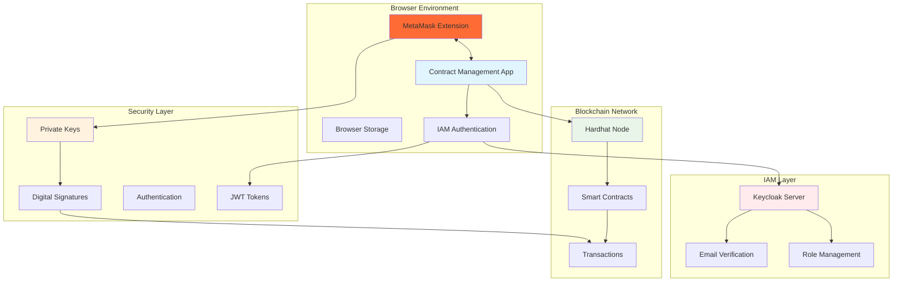
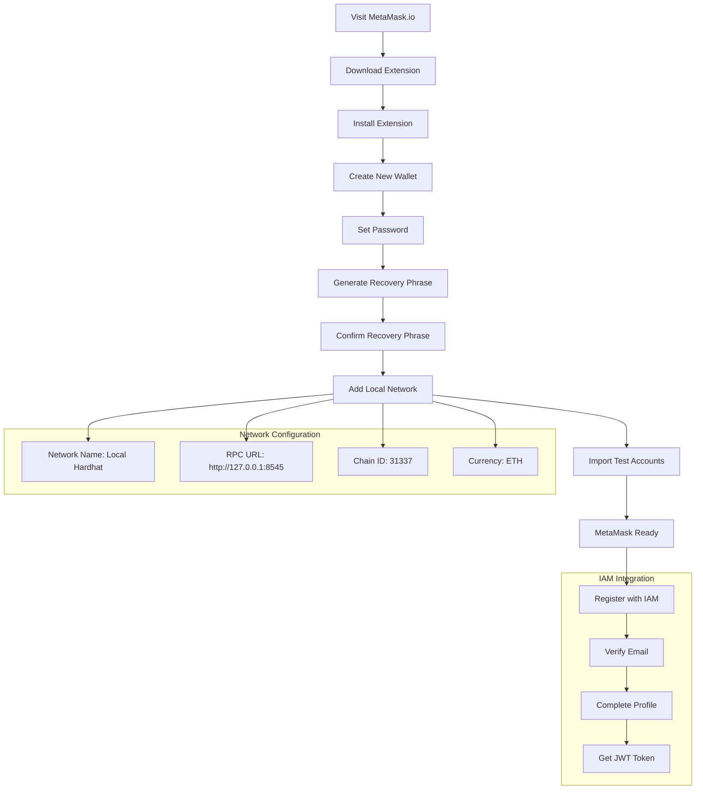
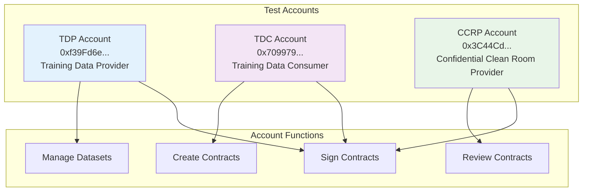
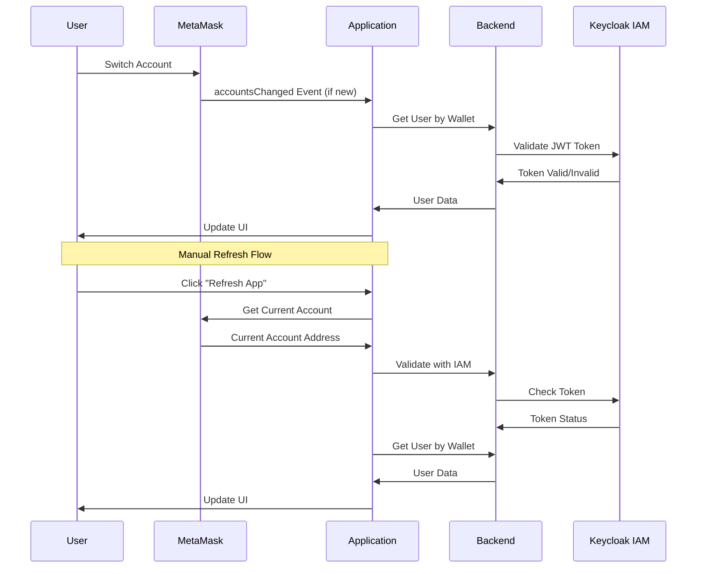
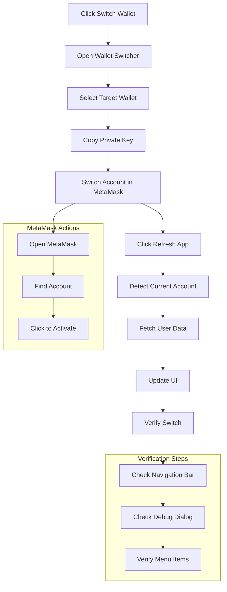
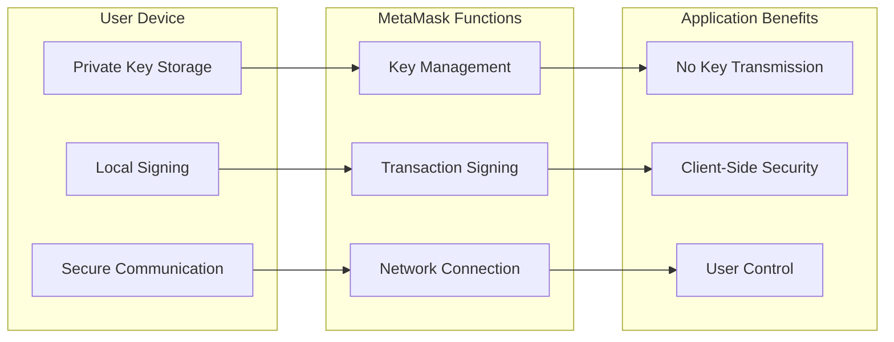
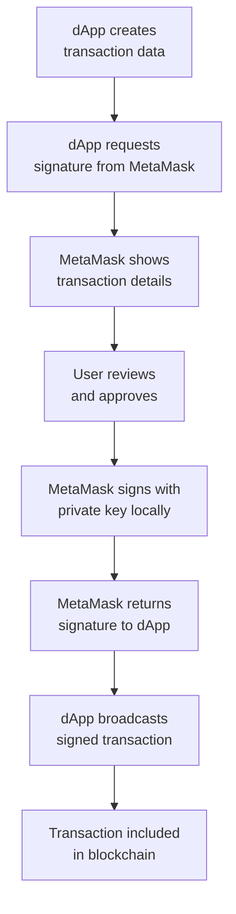

# Wallet Guide
## MetaMask Setup and Management

Complete guide for setting up and managing MetaMask wallets for the Contract Management System.

## 🦊 What is MetaMask?

MetaMask is a cryptocurrency wallet and gateway to blockchain applications (dApps). It serves as a bridge between traditional web browsers and the decentralized web (Web3).

### Key Features
- **Browser Extension**: Available for Chrome, Firefox, Brave, and Edge
- **Mobile App**: iOS and Android versions available
- **Hardware Wallet Support**: Integration with Ledger, Trezor, etc.
- **Multi-Network Support**: Ethereum, Polygon, BSC, Arbitrum, etc.
- **Token Management**: View and manage ERC-20 tokens and NFTs
- **Transaction History**: Complete history of all transactions
- **Gas Fee Management**: Customizable gas fees for transactions

### MetaMask Integration Overview


## 🔧 Installation and Setup

### Step 1: Install MetaMask
1. Visit [metamask.io](https://metamask.io/download/)
2. Click "Download" for your browser (Chrome, Firefox, Edge, or Brave)
3. Follow the installation prompts

### Step 2: Create or Import a Wallet
1. Open MetaMask extension
2. Click "Create a new wallet" or "Import wallet" if you have existing keys
3. Set up a strong password
4. Write down your 12-word recovery phrase and store it securely
5. Confirm your recovery phrase

### Step 3: Connect to Local Network
1. In MetaMask, click the network dropdown (usually shows "Ethereum Mainnet")
2. Click "Add network"
3. Add the following details:
   - **Network Name**: Local Hardhat
   - **New RPC URL**: http://127.0.0.1:8545
   - **Chain ID**: 31337
   - **Currency Symbol**: ETH
4. Click "Save"

### Installation Flow


## 👥 Test Wallets

The application comes with pre-configured test accounts. Import them using their private keys:

### Primary Test Accounts

**TDP Account (Training Data Provider):**
- Address: `0xf39Fd6e51aad88F6F4ce6aB8827279cffFb92266`
- Private Key: `0xac0974bec39a17e36ba4a6b4d238ff944bacb478cbed5efcae784d7bf4f2ff80`

**TDC Account (Training Data Consumer):**
- Address: `0x70997970C51812dc3A010C7d01b50e0d17dc79C8`
- Private Key: `0x59c6995e998f97a5a0044966f0945389dc9e86dae88c7a8412f4603b6b78690d`

**CCRP Account (Confidential Clean Room Provider):**
- Address: `0x3C44CdDdB6a900fa2b585dd299e03d12FA4293BC`
- Private Key: `0x5de4111afa1a4b94908f83103eb1f1706367c2e68ca870fc3fb9a804cdab365a`

### Import Test Accounts
1. In MetaMask, click the account icon
2. Click "Import account"
3. Paste the private key
4. Click "Import"

### Test Account Setup


## 🔄 Wallet Switching

The Contract Management system supports three different user roles, each with their own wallet:
- **TDP (Training Data Provider)**: Can create and manage datasets
- **TDC (Training Data Consumer)**: Can browse datasets and create contracts  
- **CCRP (Confidential Clean Room Provider)**: Can review and sign contracts

### How Wallet Switching Works

#### Technical Background
1. **MetaMask Account Management**: MetaMask maintains a list of imported accounts
2. **Active Account**: Only one account can be "active" at a time in MetaMask
3. **Event Limitations**: MetaMask's `accountsChanged` event only fires when:
   - User manually switches accounts in MetaMask
   - User connects/disconnects MetaMask
   - User adds/removes accounts
   - **It does NOT fire when clicking on already-imported accounts**

#### The Problem
When you click on an already-imported account in MetaMask to make it active, the application doesn't automatically detect this change because MetaMask doesn't fire the `accountsChanged` event.

#### The Solution
The application provides a manual refresh mechanism that:
1. Detects the current active MetaMask account
2. Fetches the corresponding user data from the backend
3. Updates the UI to reflect the new role

### Account Detection Flow


### Step-by-Step Wallet Switching Process

#### Prerequisites
1. **MetaMask Installed**: Make sure MetaMask is installed in your browser
2. **Test Wallets Imported**: The test wallets should already be imported in MetaMask
3. **Application Running**: The Contract Management app should be running

#### Step 1: Open Wallet Switcher
1. Click the **"Switch Wallet"** button in the top navigation bar
2. The wallet switcher dialog will open showing available test wallets

#### Step 2: Select Target Wallet
1. Click on the wallet you want to switch to (TDP, TDC, or CCRP)
2. The private key will be automatically copied to your clipboard
3. You'll see instructions for the next steps

#### Step 3: Switch Account in MetaMask
1. **Open MetaMask** (click the MetaMask extension icon)
2. **Look for the account** in your account list
3. **Click on the account** to make it the active one
4. **Note**: If you see a "duplicate account" error, that's normal - the account is already imported

#### Step 4: Refresh the Application
1. **Click the "Refresh App" button** in the wallet switcher dialog
2. The application will:
   - Detect the current MetaMask account
   - Fetch the corresponding user data
   - Update the UI to show the new role

#### Step 5: Verify the Switch
1. **Check the top navigation bar** - it should show the new user name and role
2. **Check the debug dialog** - click the bug icon (🐛) to see detailed information
3. **Verify menu items** - different roles have access to different features

### Wallet Switching Workflow


## 🔐 Security Model

### MetaMask Security Model


### Security Features
- **Private keys never transmitted over network**
- **All cryptographic operations in browser memory**
- **Memory cleared after signing operations**
- **Input validation and sanitization**
- **HTTPS encryption for all communications**

### Transaction Signing Process


## 🎯 Using the Application

### Step 1: Start the Services
Make sure all services are running:
```bash
# Terminal 1: Blockchain node
cd blockchain && npx hardhat node

# Terminal 2: Backend server
cd backend && npm run dev

# Terminal 3: Frontend
cd frontend && npm start
```

### Step 2: Register and Connect
1. Open the application in your browser (http://localhost:3000)
2. Click "Register" to start the onboarding process
3. Connect your MetaMask wallet when prompted
4. Fill in your basic information (name, email, organization)
5. Verify your email address (check your inbox)
6. Complete your profile with additional details

### Step 3: Connect Your Wallet
1. After registration, click "Connect Wallet" in the top-right corner
2. MetaMask will prompt you to connect - click "Connect"
3. Select the account you want to use
4. The system will verify your IAM credentials

### Step 4: Use Role-Specific Features

#### TDC (Training Data Consumer)
- Browse available datasets
- Create contracts by selecting datasets and CCRP
- Sign contracts to finalize agreements

#### TDP (Training Data Provider)
- View your owned datasets
- Automatically sign contracts when created
- Monitor contract status and history

#### CCRP (Confidential Clean Room Provider)
- Review contract requests where you're selected
- Sign contracts after compliance validation
- View contracts you're involved in

## 🔍 Troubleshooting

### Issue: App Still Shows Old Role After Switching

**Symptoms**: You switched accounts in MetaMask but the app still shows the previous role.

**Solutions**:
1. **Click "Refresh App"** in the wallet switcher dialog
2. **Check the debug dialog** to see what account is being detected
3. **Verify the account is active** in MetaMask (it should be highlighted)
4. **Try refreshing the page** if the manual refresh doesn't work

### Issue: "Duplicate Account" Error in MetaMask

**Symptoms**: When trying to import a wallet, MetaMask shows "KeyringController - The account you are trying to import is a duplicate"

**Solution**: This is normal! The account is already imported. Just click on it in MetaMask to make it active.

### Issue: No Accounts Found

**Symptoms**: The app shows "No accounts found" or similar error

**Solutions**:
1. **Unlock MetaMask** - Make sure MetaMask is unlocked
2. **Check network** - Ensure MetaMask is connected to the correct network (localhost:8545)
3. **Import accounts** - If no test accounts are imported, import them using the private keys

### Issue: Debug Dialog Shows Wrong Account

**Symptoms**: The debug dialog shows a different account than what's active in MetaMask

**Solutions**:
1. **Force refresh the page** (Ctrl+F5 or Cmd+Shift+R)
2. **Check MetaMask** - Ensure the correct account is active
3. **Clear browser cache** - Clear cache and cookies for localhost
4. **Restart services** - Restart the backend and frontend services

### Issue: MetaMask Not Detected

**Symptoms**: The app shows "MetaMask not detected" or similar error

**Solutions**:
1. **Install MetaMask** - Make sure MetaMask is installed in your browser
2. **Enable MetaMask** - Ensure the MetaMask extension is enabled
3. **Refresh page** - Refresh the page after installing MetaMask
4. **Check browser** - Make sure you're using a supported browser

## 📚 Additional Resources

- **MetaMask Official Documentation**: [docs.metamask.io](https://docs.metamask.io/)
- **Web3 Integration Guide**: See [Architecture Guide](./ARCHITECTURE_GUIDE.md)
- **Test Wallets**: See [Test Wallets](./TEST_WALLETS.md) for complete wallet list
- **User Guide**: See [User Guide](./USER_GUIDE.md) for application usage

## ⚠️ Security Warnings

- **Never share your private keys** with anyone
- **Store your recovery phrase securely** offline
- **Use test wallets only** for development and testing
- **Never use test wallets on mainnet** networks
- **Keep MetaMask updated** to the latest version
- **Be cautious of phishing attempts** - always verify URLs 