# Wallet Switching Guide

## Overview

The Contract Management system supports three different user roles, each with their own wallet:
- **TDP (Training Data Provider)**: Can create and manage datasets
- **TDC (Training Data Consumer)**: Can browse datasets and create contracts  
- **CCRP (Contract Compliance & Risk Provider)**: Can review and sign contracts

To switch between roles, you need to switch wallets in MetaMask and refresh the application.

### Wallet Switching Overview
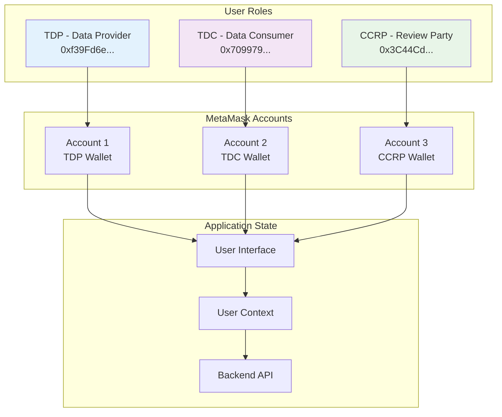

## How Wallet Switching Works

### Technical Background

1. **MetaMask Account Management**: MetaMask maintains a list of imported accounts
2. **Active Account**: Only one account can be "active" at a time in MetaMask
3. **Event Limitations**: MetaMask's `accountsChanged` event only fires when:
   - User manually switches accounts in MetaMask
   - User connects/disconnects MetaMask
   - User adds/removes accounts
   - **It does NOT fire when clicking on already-imported accounts**

### The Problem

When you click on an already-imported account in MetaMask to make it active, the application doesn't automatically detect this change because MetaMask doesn't fire the `accountsChanged` event.

### The Solution

The application provides a manual refresh mechanism that:
1. Detects the current active MetaMask account
2. Fetches the corresponding user data from the backend
3. Updates the UI to reflect the new role

### Account Detection Flow
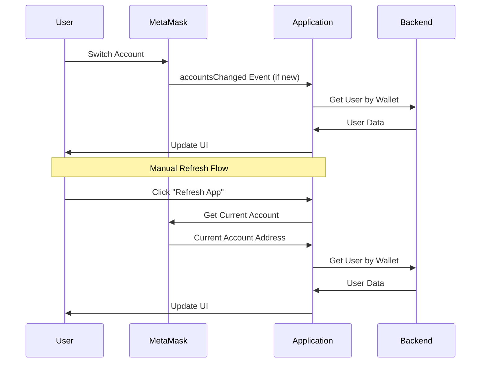

## Step-by-Step Wallet Switching Process

### Prerequisites

1. **MetaMask Installed**: Make sure MetaMask is installed in your browser
2. **Test Wallets Imported**: The test wallets should already be imported in MetaMask
3. **Application Running**: The Contract Management app should be running

### Step 1: Open Wallet Switcher

1. Click the **"Switch Wallet"** button in the top navigation bar
2. The wallet switcher dialog will open showing available test wallets

### Step 2: Select Target Wallet

1. Click on the wallet you want to switch to (TDP, TDC, or CCRP)
2. The private key will be automatically copied to your clipboard
3. You'll see instructions for the next steps

### Step 3: Switch Account in MetaMask

1. **Open MetaMask** (click the MetaMask extension icon)
2. **Look for the account** in your account list
3. **Click on the account** to make it the active one
4. **Note**: If you see a "duplicate account" error, that's normal - the account is already imported

### Step 4: Refresh the Application

1. **Click the "Refresh App" button** in the wallet switcher dialog
2. The application will:
   - Detect the current MetaMask account
   - Fetch the corresponding user data
   - Update the UI to show the new role

### Step 5: Verify the Switch

1. **Check the top navigation bar** - it should show the new user name and role
2. **Check the debug dialog** - click the bug icon (🐛) to see detailed information
3. **Verify menu items** - different roles have access to different features

### Wallet Switching Workflow
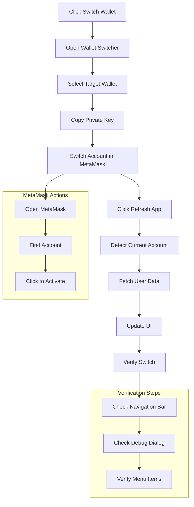

## Troubleshooting

### Issue: App Still Shows Old Role After Switching

**Symptoms**: You switched accounts in MetaMask but the app still shows the previous role.

**Solutions**:
1. **Click "Refresh App"** in the wallet switcher dialog
2. **Check the debug dialog** to see what account is being detected
3. **Verify the account is active** in MetaMask (it should be highlighted)
4. **Try refreshing the page** if the manual refresh doesn't work

### Issue: "Duplicate Account" Error in MetaMask

**Symptoms**: When trying to import a wallet, MetaMask shows "KeyringController - The account you are trying to import is a duplicate"

**Solution**: This is normal! The account is already imported. Just click on it in MetaMask to make it active.

### Issue: No Accounts Found

**Symptoms**: The app shows "No accounts found" or similar error

**Solutions**:
1. **Unlock MetaMask** - Make sure MetaMask is unlocked
2. **Check network** - Ensure MetaMask is connected to the correct network (localhost:8545)
3. **Import accounts** - If no test accounts are imported, import them using the private keys

### Issue: Debug Dialog Shows Wrong Account

**Symptoms**: The debug dialog shows a different account than what's active in MetaMask

**Solutions**:
1. **Refresh the app** using the "Refresh App" button
2. **Check MetaMask** - Ensure the correct account is active
3. **Clear browser cache** - Try clearing browser cache and refreshing

### Troubleshooting Decision Tree
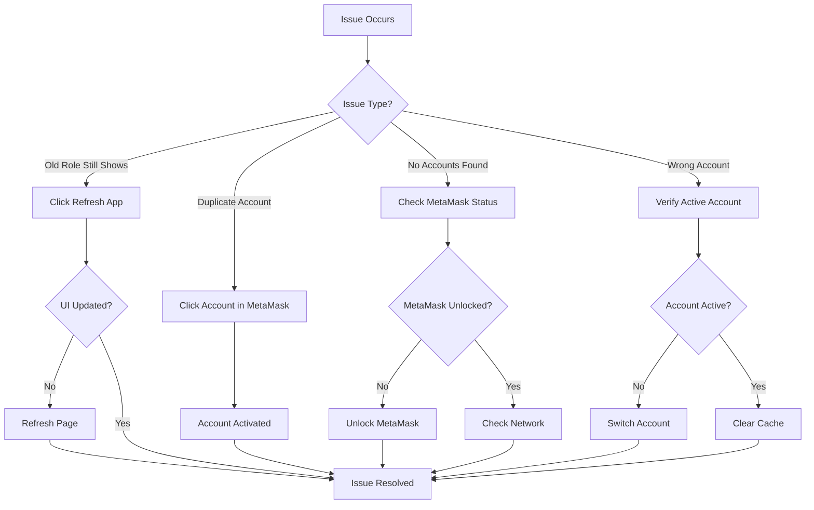

## Test Wallet Information

### Available Test Wallets

| Role | Name | Address | Private Key |
|------|------|---------|-------------|
| TDP | TDP Provider 1 | `0xf39Fd6e51aad88F6F4ce6aB8827279cffFb92266` | `0xac0974bec39a17e36ba4a6b4d238ff944bacb478cbed5efcae784d7bf4f2ff80` |
| TDC | TDC Consumer 1 | `0x70997970C51812dc3A010C7d01b50e0d17dc79C8` | `0x59c6995e998f97a5a0044966f0945389dc9e86dae88c7a8412f4603b6b78690d` |
| CCRP | CCRP Provider 1 | `0x3C44CdDdB6a900fa2b585dd299e03d12FA4293BC` | `0x5de4111afa1a4b94908f83103eb1f1706367c2e68ca870fc3fb9a804cdab365a` |

### Test Wallet Setup
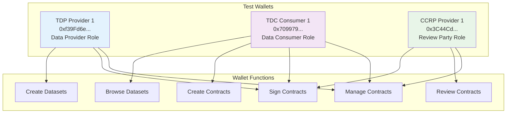

### Role-Specific Features

#### TDP (Training Data Provider)
- Create and manage datasets
- View contracts where you're the TDP
- Access to dataset management features

#### TDC (Training Data Consumer)
- Browse available datasets
- Create contracts with TDPs
- Select CCRP for contract review
- View contracts where you're the TDC

#### CCRP (Contract Compliance & Risk Provider)
- Review contracts assigned to you
- Sign contracts after review
- View contracts where you're the CCRP

### Role-Based Feature Matrix
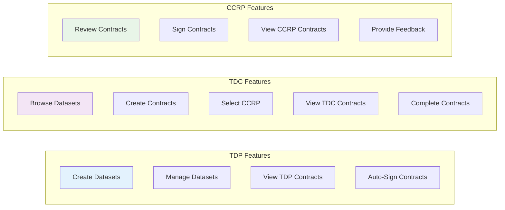

## Technical Implementation Details

### Account Detection Flow

1. **Initial Load**: App detects current MetaMask account on page load
2. **Event Listening**: App listens for MetaMask `accountsChanged` events
3. **Manual Refresh**: User can manually trigger account detection
4. **Data Fetching**: App fetches user data from backend based on wallet address
5. **UI Update**: App updates interface based on user role

### Technical Architecture
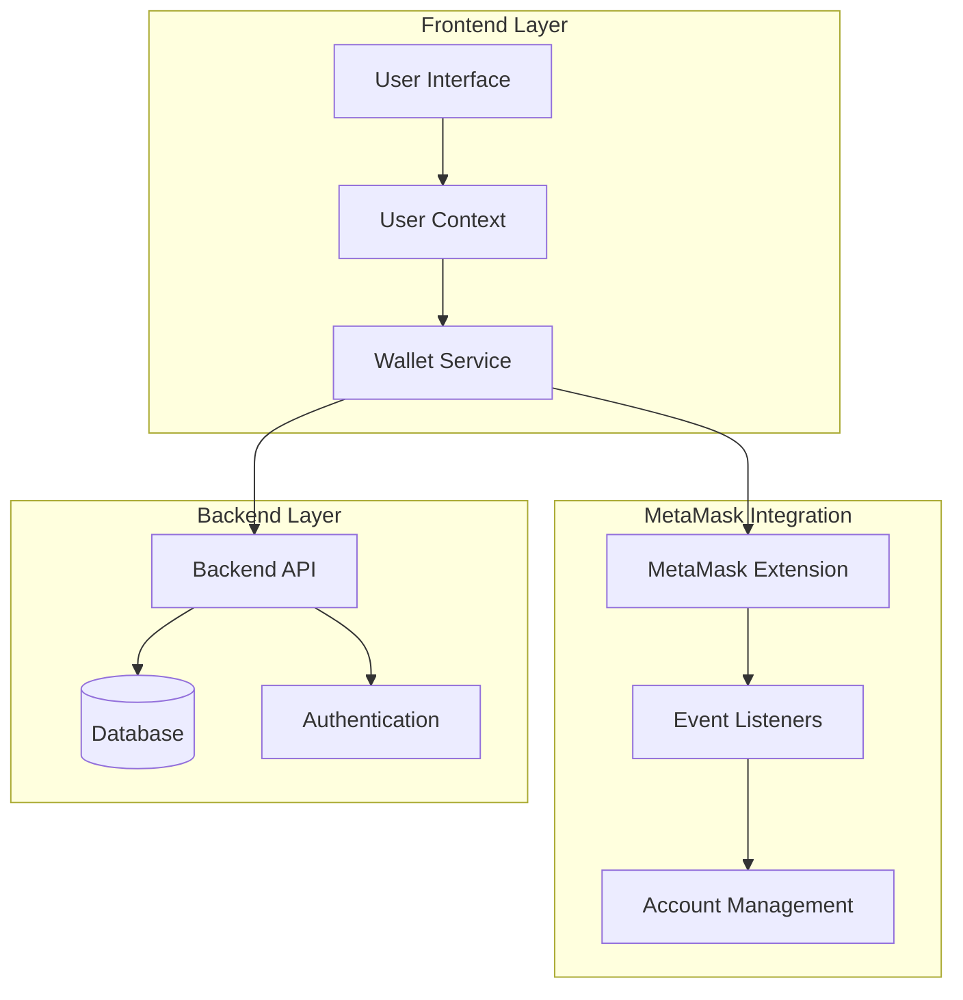

### Backend Integration

- **User Lookup**: Backend looks up users by wallet address (case-insensitive)
- **Role Validation**: Backend validates user roles and permissions
- **Data Caching**: Frontend caches user data to improve performance

### Backend Integration Flow
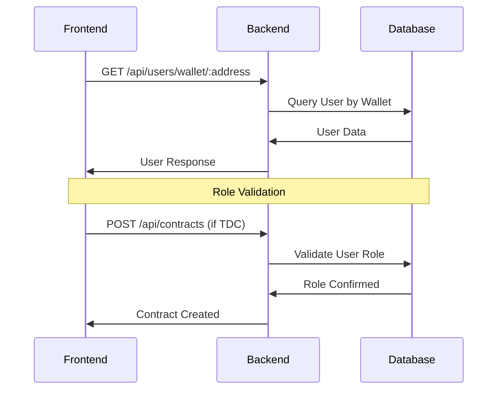

### Security Considerations

- **Private Keys**: Never share private keys - they're only used for importing accounts
- **Account Validation**: Backend validates wallet addresses and user permissions
- **Session Management**: User sessions are tied to wallet addresses

### Security Architecture
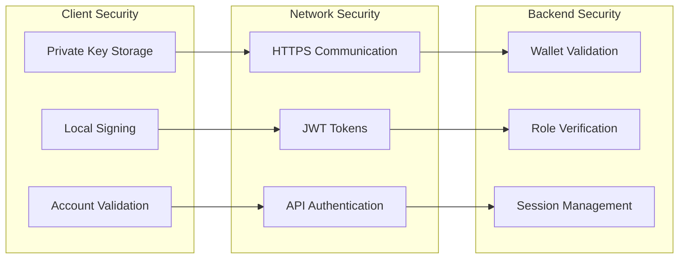

## Best Practices

1. **Always use the "Refresh App" button** after switching accounts in MetaMask
2. **Check the debug dialog** if you encounter issues
3. **Keep MetaMask unlocked** while using the application
4. **Use the correct network** (localhost:8545 for development)
5. **Don't share private keys** - they're for testing only

### Best Practices Flow
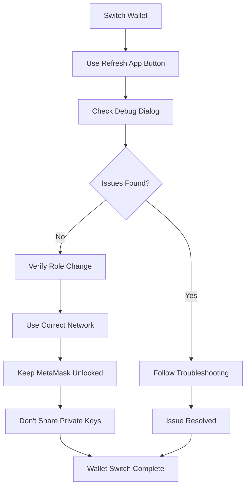

## Support

If you continue to experience issues:

1. **Check the browser console** for error messages
2. **Verify MetaMask connection** to the correct network
3. **Try refreshing the page** completely
4. **Check the debug dialog** for detailed information
5. **Ensure all services are running** (blockchain node, backend, frontend)

### Support Flow
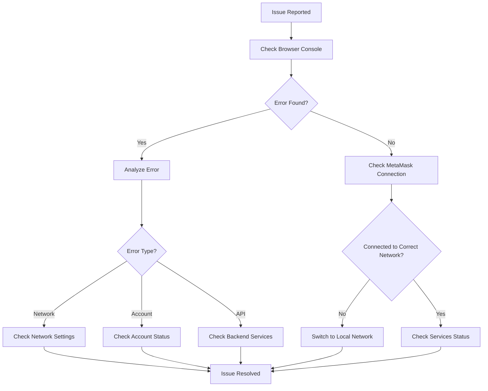