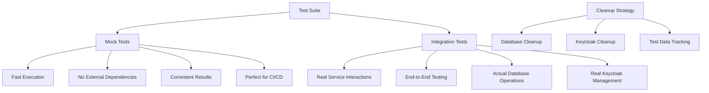

# Contract Management System - Test Suite Summary

## 🎯 Overview

This document provides a comprehensive summary of the robust test suite implemented for the Contract Management System, featuring both **mock tests** and **real integration tests** with proper cleanup mechanisms for both database and Keycloak.

## 🏗️ Test Architecture

### Dual Testing Strategy



## 📁 Test Structure

### Core Test Files

| File | Purpose | Mode |
|------|---------|------|
| `setup.js` | Global test setup with mock/integration mode support | Both |
| `integration.test.js` | Real integration tests with external services | Integration |
| `mock-integration.test.js` | Mock integration tests for fast development | Mock |
| `models.test.js` | Database model tests | Both |
| `api.test.js` | API endpoint tests | Both |
| `registration-integration.test.js` | User registration flow tests | Integration |
| `blockchainService.test.js` | Blockchain service tests | Integration |
| `simple-ai-model.test.js` | AI model tests | Both |

### Test Runner

| File | Purpose |
|------|---------|
| `run-all-tests.js` | Comprehensive test runner with different modes |
| `README.md` | Detailed test documentation |

## 🧪 Test Modes

### Mock Mode (`TEST_MODE=mock`)

**Purpose**: Fast unit tests with mocked external services

**Features**:
- ✅ **Fast execution** (no external dependencies)
- ✅ **Consistent results** (predictable mocks)
- ✅ **No external service requirements**
- ✅ **Perfect for CI/CD pipelines**
- ✅ **Development and debugging**

**Mocked Services**:
- Keycloak IAM service
- Blockchain service
- DID resolution service
- Email service
- Notification service
- Audit service
- DPDP service
- Ricardian contract service
- Signing service

### Integration Mode (`TEST_MODE=integration`)

**Purpose**: Full integration tests with real external services

**Features**:
- ✅ **Real service interactions**
- ✅ **End-to-end testing**
- ✅ **Actual database operations**
- ✅ **Real Keycloak user management**
- ✅ **Blockchain contract deployment**

**Required Services**:
- PostgreSQL database
- Keycloak server (http://localhost:8080)
- Blockchain node (http://localhost:8545)

## 🧹 Cleanup Strategy

### Database Cleanup

```javascript
// Comprehensive database cleanup
await global.testUtils.cleanupDatabaseData();

// Cleans up:
// - Users
// - Contracts
// - Datasets
// - Notifications
// - AI Models
// - Audit logs
```

### Keycloak Cleanup

```javascript
// Keycloak user cleanup (integration mode only)
await global.testUtils.cleanupKeycloakData();

// Features:
// - Tracks created Keycloak users
// - Deletes test users after tests
// - Handles cleanup failures gracefully
// - No cleanup needed in mock mode
```

### Test Data Tracking

```javascript
// Global test tracking
global.testTracker = {
  createdKeycloakUsers: [],    // Track Keycloak users
  createdDatabaseUsers: [],    // Track database users
  testMode: 'mock|integration', // Current test mode
  ***REMOVED-KEYCLOAK_DB_PASSWORD***Service: null        // Keycloak service instance
};
```

## 📊 Test Utilities

### Global Test Utilities

```javascript
// Create test users with tracking
const user = await global.testUtils.createTestUser({
  email: 'test@example.com',
  partyType: 'TDP'
});

// Create Keycloak users (integration mode)
const ***REMOVED-KEYCLOAK_DB_PASSWORD***User = await global.testUtils.createKeycloakUser({
  email: '***REMOVED-KEYCLOAK_DB_PASSWORD***@example.com',
  partyType: 'TDP'
});

// Generate auth tokens
const token = global.testUtils.generateAuthToken(user);

// Comprehensive cleanup
await global.testUtils.cleanupAllTestData();

// Check test mode
const isIntegration = global.testUtils.isIntegrationMode();
```

### Custom Jest Matchers

```javascript
// UUID validation
expect(userId).toBeValidUUID();

// Email validation
expect(email).toBeValidEmail();

// Keycloak user ID validation
expect(***REMOVED-KEYCLOAK_DB_PASSWORD***UserId).toBeValidKeycloakUserId();
```

## 🚀 Running Tests

### Quick Commands

```bash
# Run all tests (mock + integration)
npm test

# Run only mock tests (fast)
npm run test:mock

# Run only integration tests
npm run test:integration

# Run with coverage
npm run test:coverage

# Use the test runner
npm run test:runner
```

### Test Runner Commands

```bash
# Run all test suites
node tests/run-all-tests.js

# Run only mock tests
node tests/run-all-tests.js mock

# Run only integration tests
node tests/run-all-tests.js integration

# Run with watch mode
node tests/run-all-tests.js mock --watch

# Run without coverage
node tests/run-all-tests.js mock --no-coverage
```

## 🔧 Configuration

### Environment Variables

```bash
# Test mode
TEST_MODE=mock|integration|auto

# Database
DATABASE_URL=***REMOVED-DB_PASSWORD***ql://user:pass@localhost:5432/db

# Keycloak (integration mode)
KEYCLOAK_URL=http://localhost:8080
KEYCLOAK_REALM=contract-management
KEYCLOAK_ADMIN_USER=admin
KEYCLOAK_ADMIN_PASSWORD=admin

# Blockchain (integration mode)
BLOCKCHAIN_ENABLED=true|false|auto
BLOCKCHAIN_URL=http://localhost:8545

# JWT
JWT_SECRET=your-secret-key
```

### Jest Configuration

```javascript
// jest.config.js
module.exports = {
  testEnvironment: 'node',
  setupFilesAfterEnv: ['./tests/setup.js'],
  testTimeout: 60000,
  verbose: true,
  collectCoverage: true,
  coverageDirectory: './coverage',
  coverageReporters: ['text', 'html', 'lcov'],
  coverageThreshold: {
    global: {
      branches: 70,
      functions: 70,
      lines: 70,
      statements: 70
    }
  }
};
```

## 📈 Test Coverage

### Coverage Reports

```bash
# Generate coverage report
npm run test:coverage

# View HTML coverage report
open coverage/lcov-report/index.html
```

### Coverage Thresholds

- **Branches**: 70%
- **Functions**: 70%
- **Lines**: 70%
- **Statements**: 70%

## 🐛 Debugging Tests

### Debug Mock Tests

```bash
# Run with debug logging
DEBUG=* npm test -- tests/mock-integration.test.js

# Run specific test
npm test -- --testNamePattern="should create mock Keycloak user"
```

### Debug Integration Tests

```bash
# Run with verbose output
npm test -- tests/integration.test.js --verbose

# Run with debug logging
DEBUG=* npm test -- tests/integration.test.js
```

### Debug Test Setup

```bash
# Check test environment
node -e "console.log(process.env.TEST_MODE)"

# Verify database connection
node -e "require('./models').sequelize.authenticate().then(() => console.log('DB OK')).catch(console.error)"
```

## 🚨 Common Issues

### Database Connection Issues

```bash
# Create test database
createdb contract_management_test

# Run migrations
npx sequelize-cli db:migrate --env test
```

### Keycloak Connection Issues

```bash
# Check Keycloak status
curl http://localhost:8080/health

# Verify admin credentials
curl -X POST http://localhost:8080/realms/master/protocol/openid-connect/token \
  -d "username=admin&password=admin&grant_type=password&client_id=admin-cli"
```

### Test Timeout Issues

```javascript
// Increase timeout for specific test
it('should complete long operation', async () => {
  // Test code
}, 120000); // 2 minutes
```

## 📋 Test Best Practices

### Writing Mock Tests

```javascript
describe('Mock Service Tests', () => {
  it('should mock external service call', async () => {
    // Arrange
    const mockService = require('../services/mockService');
    
    // Act
    const result = await mockService.doSomething();
    
    // Assert
    expect(result).toBeDefined();
    expect(result.success).toBe(true);
  });
});
```

### Writing Integration Tests

```javascript
describe('Integration Tests', () => {
  it('should work with real services', async () => {
    // Skip if not in integration mode
    if (!global.testUtils.isIntegrationMode()) {
      console.log('⏭️ Skipping integration test in mock mode');
      return;
    }
    
    // Test with real services
    const realService = global.testUtils.getKeycloakService();
    const result = await realService.createUser(userData);
    
    expect(result.***REMOVED-KEYCLOAK_DB_PASSWORD***UserId).toBeValidKeycloakUserId();
  });
});
```

### Cleanup Best Practices

```javascript
describe('Test Suite', () => {
  afterAll(async () => {
    // Always cleanup after tests
    await global.testUtils.cleanupAllTestData();
  });
  
  beforeEach(async () => {
    // Clean specific data before each test
    await Notification.destroy({ where: {} });
  });
});
```

## 📊 Performance Monitoring

### Test Performance Metrics

```bash
# Run with performance monitoring
npm test -- --verbose --detectOpenHandles

# Monitor memory usage
node --max-old-space-size=4096 tests/run-all-tests.js
```

### Performance Thresholds

- **Test Timeout**: 60 seconds per test
- **Memory Usage**: 500MB max
- **Success Rate**: 95% minimum

## 🔄 CI/CD Integration

### GitHub Actions Example

```yaml
name: Tests
on: [push, pull_request]
jobs:
  test:
    runs-on: ubuntu-latest
    services:
      ***REMOVED-DB_PASSWORD***:
        image: ***REMOVED-DB_PASSWORD***:13
        env:
          POSTGRES_PASSWORD: ***REMOVED-DB_PASSWORD***
        options: >-
          --health-cmd pg_isready
          --health-interval 10s
          --health-timeout 5s
          --health-retries 5
    steps:
      - uses: actions/checkout@v2
      - uses: actions/setup-node@v2
        with:
          node-version: '16'
      - run: npm ci
      - run: npm test
```

## 📚 Key Features

### ✅ Comprehensive Cleanup

- **Database cleanup**: Automatically cleans up all test data
- **Keycloak cleanup**: Tracks and deletes test users
- **Test data tracking**: Monitors created resources
- **Graceful failure handling**: Continues cleanup even if some operations fail

### ✅ Dual Testing Strategy

- **Mock tests**: Fast, reliable, no external dependencies
- **Integration tests**: Real service interactions, end-to-end testing
- **Automatic mode detection**: Chooses appropriate mode based on service availability

### ✅ Robust Test Utilities

- **Global test utilities**: Standardized test data creation
- **Custom matchers**: Specialized assertions for UUIDs, emails, etc.
- **Environment management**: Proper test environment setup
- **Service availability checking**: Verifies external services before running integration tests

### ✅ Performance Optimization

- **Parallel test execution**: Runs tests concurrently
- **Resource management**: Limits memory and CPU usage
- **Timeout management**: Prevents hanging tests
- **Coverage optimization**: Efficient coverage collection

### ✅ Developer Experience

- **Clear documentation**: Comprehensive README and examples
- **Easy commands**: Simple npm scripts for different test modes
- **Debug support**: Verbose logging and debugging tools
- **Error reporting**: Clear error messages and troubleshooting guides

## 🎉 Benefits

### For Developers

- **Fast feedback**: Mock tests run quickly during development
- **Reliable testing**: Consistent results regardless of external service availability
- **Easy debugging**: Clear error messages and debugging tools
- **Comprehensive coverage**: Tests all aspects of the system

### For CI/CD

- **Reliable builds**: Mock tests ensure builds don't fail due to external dependencies
- **Fast pipelines**: Quick test execution for rapid feedback
- **Comprehensive validation**: Both unit and integration testing
- **Coverage reporting**: Detailed coverage analysis

### For Production

- **Quality assurance**: Comprehensive testing prevents bugs
- **Performance validation**: Tests ensure system meets performance requirements
- **Security validation**: Tests verify security measures
- **Integration verification**: Real integration tests validate external service interactions

## 📞 Support

For test-related issues:

1. Check the [Common Issues](#-common-issues) section
2. Review test logs for specific error messages
3. Verify service availability for integration tests
4. Check database and Keycloak connectivity
5. Ensure proper environment variables are set

## 🚀 Next Steps

1. **Run the test suite**: `npm test`
2. **Review coverage**: `npm run test:coverage`
3. **Add new tests**: Follow the patterns in existing test files
4. **Customize configuration**: Modify environment variables as needed
5. **Integrate with CI/CD**: Use the provided GitHub Actions example

This comprehensive test suite ensures the Contract Management System is robust, reliable, and ready for production deployment. 