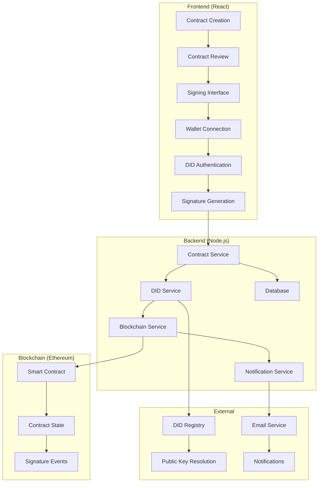

# Multi-Party Contract Signing Implementation

## Overview

The Contract Management System implements a sophisticated multi-party contract signing workflow that combines:
- **DID-based authentication** for cryptographic proof
- **Blockchain smart contracts** for immutable record-keeping
- **Traditional IAM** for enterprise security
- **Real-time notifications** for all parties

## 🏗️ Architecture



## 📋 Contract Signing Workflow

### 1. **Contract Creation Phase**
```javascript
// TDC creates contract
const contract = await contractService.createContract({
  tdpId: dataset.ownerId,
  datasetId: dataset.id,
  modelId: "model-123",
  price: 1000,
  duration: 30,
  termsAndConditions: "Data sharing agreement...",
  ccrpRequired: true
});

// TDP auto-signs (backend handles)
await contractService.autoSignTDP(contract.id);
```

### 2. **CCRP Selection Phase**
```javascript
// TDC selects CCRP
await contractService.selectCCRP(contract.id, ccrpUserId);

// Notify CCRP
await notificationService.notifyCCRPSelected(contract, ccrpUser);
```

### 3. **CCRP Review & Signing Phase**
```javascript
// CCRP reviews contract
const contractDetails = await contractService.getContractForSigning(contract.id);

// CCRP signs with DID
const signature = await didService.signWithDID(contractHash, userDID);
await contractService.signContract(contract.id, signature, 'CCRP');
```

### 4. **Contract Activation**
```javascript
// Contract becomes active when all parties sign
if (contract.tdpSigned && contract.ccrpSigned) {
  await contractService.activateContract(contract.id);
  await notificationService.notifyContractActivated(contract);
}
```

## 🔐 DID-Based Signing Implementation

### Frontend Signing Component
```javascript
// React component for contract signing
const ContractSigningInterface = ({ contract, user }) => {
  const [signingStatus, setSigningStatus] = useState('idle');
  const [signature, setSignature] = useState(null);
  
  const signContract = async () => {
    try {
      setSigningStatus('signing');
      
      // 1. Get contract data for signing
      const signingData = await api.getContractSigningData(contract.id);
      
      // 2. Create contract hash
      const contractHash = createContractHash(signingData.contract);
      
      // 3. Sign with DID
      const didSignature = await signWithDID(contractHash, user.did);
      
      // 4. Submit signature
      const result = await api.signContract(contract.id, {
        signature: didSignature,
        did: user.did,
        message: contractHash
      });
      
      setSignature(result);
      setSigningStatus('signed');
      
    } catch (error) {
      setSigningStatus('error');
      console.error('Signing failed:', error);
    }
  };
  
  return (
    <div className="contract-signing">
      <h3>Sign Contract: {contract.contractId}</h3>
      
      <div className="signing-status">
        <div className={`status ${contract.tdpSigned ? 'signed' : 'pending'}`}>
          TDP: {contract.tdpSigned ? '✅ Signed' : '⏳ Pending'}
        </div>
        <div className={`status ${contract.ccrpSigned ? 'signed' : 'pending'}`}>
          CCRP: {contract.ccrpSigned ? '✅ Signed' : '⏳ Pending'}
        </div>
      </div>
      
      {canSign && (
        <button 
          onClick={signContract}
          disabled={signingStatus === 'signing'}
        >
          {signingStatus === 'signing' ? 'Signing...' : 'Sign Contract'}
        </button>
      )}
      
      {signature && (
        <div className="signature-confirmation">
          <h4>✅ Contract Signed Successfully!</h4>
          <p>Transaction Hash: {signature.transactionHash}</p>
          <p>Signed At: {signature.signedAt}</p>
        </div>
      )}
    </div>
  );
};
```

### Backend Signing Service
```javascript
// Enhanced contract signing service
class ContractSigningService {
  
  /**
   * Sign contract with DID verification
   */
  async signContractWithDID(contractId, signatureData, user) {
    const { signature, did, message } = signatureData;
    
    // 1. Get contract
    const contract = await this.getContract(contractId);
    
    // 2. Verify user is authorized to sign
    this.verifySigningAuthorization(contract, user);
    
    // 3. Verify DID signature
    const isValidSignature = await this.verifyDIDSignature(did, message, signature);
    if (!isValidSignature) {
      throw new Error('Invalid DID signature');
    }
    
    // 4. Record signature in database
    await this.recordSignature(contractId, user.id, did, signature);
    
    // 5. Update contract status
    await this.updateContractStatus(contract, user.partyType);
    
    // 6. Record on blockchain
    const blockchainResult = await this.recordOnBlockchain(contractId, signature);
    
    // 7. Send notifications
    await this.notifyParties(contract, user);
    
    return {
      success: true,
      contractId,
      signerDID: did,
      transactionHash: blockchainResult.transactionHash,
      signedAt: new Date().toISOString()
    };
  }
  
  /**
   * Verify DID signature
   */
  async verifyDIDSignature(did, message, signature) {
    // Resolve DID to get public key
    const didDocument = await this.didService.resolveDID(did);
    const publicKey = this.didService.extractPublicKey(didDocument);
    
    // Verify signature
    return await this.didService.verifySignature(message, signature, publicKey);
  }
  
  /**
   * Record signature in database
   */
  async recordSignature(contractId, userId, did, signature) {
    await db.ContractSignature.create({
      contractId,
      userId,
      did,
      signature,
      signatureType: 'DID',
      verificationStatus: 'VERIFIED',
      signedAt: new Date()
    });
  }
  
  /**
   * Update contract status based on who signed
   */
  async updateContractStatus(contract, partyType) {
    if (partyType === 'TDP' && !contract.tdpSigned) {
      contract.tdpSigned = true;
      contract.tdpSignedAt = new Date();
      contract.status = 'PENDING_CCRP_APPROVAL';
    } else if (partyType === 'CCRP' && !contract.ccrpSigned) {
      contract.ccrpSigned = true;
      contract.ccrpSignedAt = new Date();
      contract.status = 'ACTIVE';
    }
    
    await contract.save();
  }
}
```

## 🗄️ Database Schema

### Contract Signatures Table
```sql
CREATE TABLE contract_signatures (
  id SERIAL PRIMARY KEY,
  contract_id INTEGER REFERENCES contracts(id),
  user_id INTEGER REFERENCES users(id),
  did VARCHAR(255) NOT NULL,
  signature TEXT NOT NULL,
  signature_type VARCHAR(50) DEFAULT 'DID',
  verification_status VARCHAR(50) DEFAULT 'PENDING',
  blockchain_transaction_hash VARCHAR(66),
  signed_at TIMESTAMP DEFAULT NOW(),
  verified_at TIMESTAMP,
  created_at TIMESTAMP DEFAULT NOW()
);

-- Indexes for performance
CREATE INDEX idx_contract_signatures_contract_id ON contract_signatures(contract_id);
CREATE INDEX idx_contract_signatures_user_id ON contract_signatures(user_id);
CREATE INDEX idx_contract_signatures_did ON contract_signatures(did);
```

### Enhanced Contract Model
```javascript
// Add to Contract model
Contract.associate = (models) => {
  // ... existing associations ...
  
  // Contract has many signatures
  Contract.hasMany(models.ContractSignature, { 
    foreignKey: 'contractId', 
    as: 'signatures' 
  });
};
```

## 🔄 Multi-Party Signing Flow

### 1. **TDP Auto-Signing**
```javascript
// When TDC creates contract, TDP automatically signs
async function autoSignTDP(contractId) {
  const contract = await getContract(contractId);
  const tdpUser = await getUser(contract.tdpId);
  
  // Create contract hash
  const contractHash = createContractHash(contract);
  
  // Sign with TDP's DID
  const signature = await signWithDID(contractHash, tdpUser.did);
  
  // Record signature
  await recordSignature(contractId, tdpUser.id, tdpUser.did, signature);
  
  // Update contract status
  contract.tdpSigned = true;
  contract.tdpSignedAt = new Date();
  contract.status = 'PENDING_CCRP_APPROVAL';
  await contract.save();
  
  // Notify parties
  await notifyContractSigned(contract, tdpUser, 'TDP');
}
```

### 2. **CCRP Manual Signing**
```javascript
// CCRP reviews and signs contract
async function ccrpSignContract(contractId, ccrpUserId) {
  const contract = await getContract(contractId);
  const ccrpUser = await getUser(ccrpUserId);
  
  // Verify CCRP is selected for this contract
  if (contract.ccrpId !== ccrpUserId) {
    throw new Error('CCRP not authorized for this contract');
  }
  
  // Create contract hash
  const contractHash = createContractHash(contract);
  
  // CCRP signs with their DID
  const signature = await signWithDID(contractHash, ccrpUser.did);
  
  // Record signature
  await recordSignature(contractId, ccrpUser.id, ccrpUser.did, signature);
  
  // Update contract status
  contract.ccrpSigned = true;
  contract.ccrpSignedAt = new Date();
  contract.status = 'ACTIVE';
  await contract.save();
  
  // Notify parties
  await notifyContractSigned(contract, ccrpUser, 'CCRP');
}
```

## 📱 User Interface Flow

### Contract Dashboard
```javascript
const ContractDashboard = ({ contract }) => {
  return (
    <div className="contract-dashboard">
      <h2>Contract: {contract.contractId}</h2>
      
      {/* Contract Status */}
      <div className="contract-status">
        <StatusBadge status={contract.status} />
      </div>
      
      {/* Signing Progress */}
      <div className="signing-progress">
        <div className="party-signature">
          <span>TDP (Data Provider)</span>
          <SignatureStatus 
            signed={contract.tdpSigned}
            signedAt={contract.tdpSignedAt}
            user={contract.tdp}
          />
        </div>
        
        {contract.ccrp && (
          <div className="party-signature">
            <span>CCRP (Compliance)</span>
            <SignatureStatus 
              signed={contract.ccrpSigned}
              signedAt={contract.ccrpSignedAt}
              user={contract.ccrp}
            />
          </div>
        )}
      </div>
      
      {/* Signing Actions */}
      {canSignContract(contract) && (
        <ContractSigningInterface contract={contract} />
      )}
      
      {/* Contract Details */}
      <ContractDetails contract={contract} />
      
      {/* Signature History */}
      <SignatureHistory contract={contract} />
    </div>
  );
};
```

## 🔔 Notification System

### Real-time Notifications
```javascript
// Notify all parties when contract is signed
async function notifyContractSigned(contract, signer, signerType) {
  const parties = [contract.tdp, contract.tdc];
  if (contract.ccrp) parties.push(contract.ccrp);
  
  for (const party of parties) {
    if (party.id !== signer.id) {
      // Database notification
      await createNotification(party.id, {
        type: 'CONTRACT_SIGNED',
        title: 'Contract Signed',
        message: `Contract ${contract.contractId} signed by ${signerType}`,
        data: { contractId: contract.contractId, signerType }
      });
      
      // Email notification
      await sendEmail(party.email, {
        subject: 'Contract Signed',
        template: 'contract-signed',
        data: { contract, signer, signerType }
      });
      
      // Real-time notification (WebSocket)
      await sendWebSocketNotification(party.id, {
        type: 'CONTRACT_SIGNED',
        contractId: contract.contractId
      });
    }
  }
}
```

## 🔍 Signature Verification

### Verification Service
```javascript
class SignatureVerificationService {
  
  /**
   * Verify all signatures on a contract
   */
  async verifyContractSignatures(contractId) {
    const contract = await getContract(contractId);
    const signatures = await getContractSignatures(contractId);
    
    const verificationResults = [];
    
    for (const signature of signatures) {
      const result = await this.verifySignature(signature);
      verificationResults.push(result);
    }
    
    return {
      contractId,
      totalSignatures: signatures.length,
      validSignatures: verificationResults.filter(r => r.isValid).length,
      results: verificationResults
    };
  }
  
  /**
   * Verify individual signature
   */
  async verifySignature(signature) {
    try {
      // Resolve DID to get public key
      const didDocument = await this.didService.resolveDID(signature.did);
      const publicKey = this.didService.extractPublicKey(didDocument);
      
      // Verify signature
      const isValid = await this.didService.verifySignature(
        signature.message,
        signature.signature,
        publicKey
      );
      
      return {
        signatureId: signature.id,
        did: signature.did,
        isValid,
        verifiedAt: new Date().toISOString()
      };
      
    } catch (error) {
      return {
        signatureId: signature.id,
        did: signature.did,
        isValid: false,
        error: error.message
      };
    }
  }
}
```

## 🚀 Benefits of This Implementation

### 1. **Security**
- **Cryptographic Proof**: Each signature is cryptographically verified
- **DID-based**: Public keys are always up-to-date from DID documents
- **Blockchain Immutability**: Signatures are recorded on blockchain
- **No Private Key Storage**: Private keys never leave user devices

### 2. **User Experience**
- **Real-time Updates**: Parties see signing progress in real-time
- **Clear Status**: Visual indicators show who has signed
- **Notifications**: Automatic notifications for all parties
- **Mobile Friendly**: Works on all devices

### 3. **Compliance**
- **Audit Trail**: Complete record of all signing activities
- **Legal Validity**: Cryptographically verifiable signatures
- **Timestamp Verification**: Precise timing of all signatures
- **Party Authentication**: Verified identity through DIDs

### 4. **Scalability**
- **Multi-party Support**: Handles any number of parties
- **Flexible Workflows**: Configurable signing sequences
- **Integration Ready**: Works with existing enterprise systems
- **Blockchain Agnostic**: Can work with multiple blockchains

This implementation provides a robust, secure, and user-friendly multi-party contract signing system that meets enterprise requirements while leveraging the power of blockchain and DID technology. 