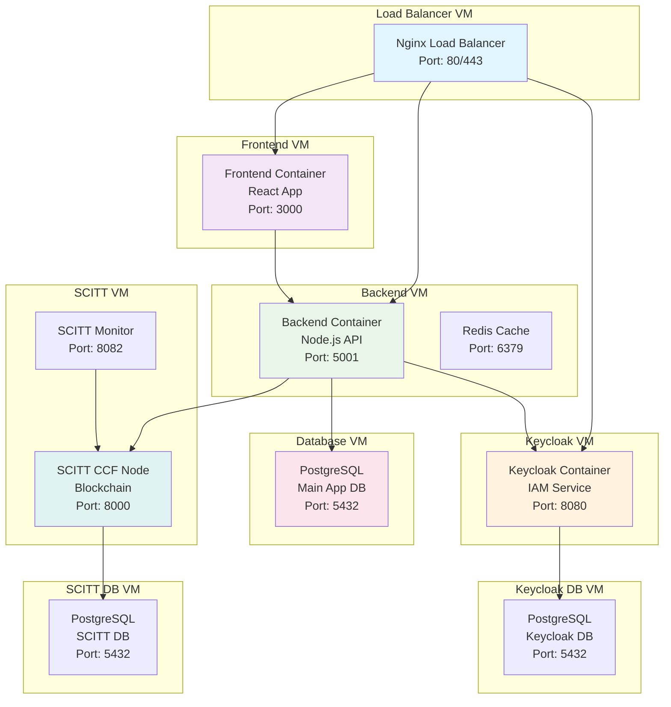

# Production Architecture - Multi-VM Deployment

## Overview

This document describes the production architecture for the Contract Management System deployed across multiple VMs for high availability, scalability, and security.

## Architecture Diagram



## VM Specifications

### 1. Load Balancer VM
- **Purpose**: SSL termination, load balancing, reverse proxy
- **Specs**: 2 vCPU, 4GB RAM, 20GB SSD
- **Services**: Nginx
- **Ports**: 80 (HTTP), 443 (HTTPS)

### 2. Frontend VM
- **Purpose**: React application serving
- **Specs**: 2 vCPU, 4GB RAM, 20GB SSD
- **Services**: Frontend container
- **Ports**: 3000 (internal)

### 3. Backend VM
- **Purpose**: API server and caching
- **Specs**: 4 vCPU, 8GB RAM, 50GB SSD
- **Services**: Backend container, Redis
- **Ports**: 5001 (API), 6379 (Redis)

### 4. Keycloak VM
- **Purpose**: Identity and Access Management
- **Specs**: 2 vCPU, 4GB RAM, 20GB SSD
- **Services**: Keycloak container
- **Ports**: 8080 (internal)

### 5. Database VM
- **Purpose**: Main application database
- **Specs**: 4 vCPU, 16GB RAM, 100GB SSD
- **Services**: PostgreSQL
- **Ports**: 5432 (internal)

### 6. Keycloak DB VM
- **Purpose**: Keycloak database
- **Specs**: 2 vCPU, 8GB RAM, 50GB SSD
- **Services**: PostgreSQL
- **Ports**: 5432 (internal)

### 7. SCITT VM
- **Purpose**: Blockchain/ledger services
- **Specs**: 4 vCPU, 8GB RAM, 50GB SSD
- **Services**: SCITT CCF Node, Monitor, Dashboard
- **Ports**: 8000 (Node), 8082 (Dashboard)

### 8. SCITT DB VM
- **Purpose**: SCITT CCF database
- **Specs**: 2 vCPU, 8GB RAM, 50GB SSD
- **Services**: PostgreSQL
- **Ports**: 5432 (internal)

## Network Configuration

### Internal Network
- **Subnet**: 172.20.0.0/16
- **Load Balancer**: 172.20.1.10
- **Frontend**: 172.20.1.20
- **Backend**: 172.20.1.30
- **Keycloak**: 172.20.1.40
- **Database**: 172.20.1.50
- **Keycloak DB**: 172.20.1.60
- **SCITT**: 172.20.1.70
- **SCITT DB**: 172.20.1.80

### Security Groups
- **Load Balancer**: Allow 80, 443 from internet
- **Frontend**: Allow 3000 from Load Balancer
- **Backend**: Allow 5001 from Frontend, Load Balancer
- **Keycloak**: Allow 8080 from Backend, Load Balancer
- **Databases**: Allow 5432 from respective services only
- **SCITT**: Allow 8000, 8082 from Backend

## Deployment Strategy

### Phase 1: Infrastructure
1. Create VMs with specified configurations
2. Configure networking and security groups
3. Install Docker and Docker Compose on each VM
4. Create SSL certificates

### Phase 2: Database Services
1. Deploy PostgreSQL containers on database VMs
2. Run database migrations
3. Configure database users and permissions

### Phase 3: Core Services
1. Deploy Keycloak on Keycloak VM
2. Deploy Backend on Backend VM
3. Deploy SCITT CCF on SCITT VM
4. Configure service discovery

### Phase 4: Application Services
1. Deploy Frontend on Frontend VM
2. Deploy Load Balancer on Load Balancer VM
3. Configure SSL termination
4. Test end-to-end connectivity

### Phase 5: Monitoring & Security
1. Deploy monitoring agents
2. Configure log aggregation
3. Set up backup procedures
4. Implement security hardening

## Environment Variables

### Load Balancer VM
```bash
# nginx configuration
SSL_CERT_PATH=/etc/nginx/ssl/cert.pem
SSL_KEY_PATH=/etc/nginx/ssl/key.pem
FRONTEND_UPSTREAM=172.20.1.20:3000
BACKEND_UPSTREAM=172.20.1.30:5001
KEYCLOAK_UPSTREAM=172.20.1.40:8080
```

### Frontend VM
```bash
NODE_ENV=production
REACT_APP_API_URL=https://api.yourdomain.com
REACT_APP_KEYCLOAK_URL=https://auth.yourdomain.com
REACT_APP_KEYCLOAK_REALM=contract-management
REACT_APP_KEYCLOAK_CLIENT_ID=contract-management-frontend
```

### Backend VM
```bash
NODE_ENV=production
DB_HOST=172.20.1.50
DB_PORT=5432
DB_NAME=contract_management
DB_USER=***REMOVED-DB_PASSWORD***
DB_PASSWORD=secure_password
KEYCLOAK_URL=http://172.20.1.40:8080
KEYCLOAK_REALM=contract-management
KEYCLOAK_CLIENT_ID=contract-management-client
KEYCLOAK_CLIENT_SECRET=client_secret
SCITT_CCF_NODE_URL=http://172.20.1.70:8000
REDIS_URL=redis://172.20.1.30:6379
```

### Keycloak VM
```bash
KEYCLOAK_ADMIN=admin
KEYCLOAK_ADMIN_PASSWORD=secure_admin_password
KC_DB_URL=jdbc:***REMOVED-DB_PASSWORD***ql://172.20.1.60:5432/***REMOVED-KEYCLOAK_DB_PASSWORD***
KC_DB_USERNAME=***REMOVED-KEYCLOAK_DB_PASSWORD***
KC_DB_PASSWORD=***REMOVED-KEYCLOAK_DB_PASSWORD***_password
```

### Database VMs
```bash
POSTGRES_DB=contract_management
POSTGRES_USER=***REMOVED-DB_PASSWORD***
POSTGRES_PASSWORD=secure_password
```

## High Availability Considerations

### Database Clustering
- Set up PostgreSQL streaming replication
- Configure automatic failover
- Implement backup and restore procedures

### Load Balancer Redundancy
- Deploy multiple load balancer instances
- Use cloud provider load balancer services
- Implement health checks and failover

### Service Monitoring
- Deploy monitoring agents on each VM
- Set up alerting for service failures
- Implement log aggregation and analysis

### Backup Strategy
- Daily database backups
- Configuration backup
- Container image backup
- Disaster recovery procedures

## Security Considerations

### Network Security
- Use private networks for internal communication
- Implement firewall rules
- Use VPN for administrative access

### Application Security
- Enable SSL/TLS everywhere
- Implement proper authentication
- Use secrets management
- Regular security updates

### Data Security
- Encrypt data at rest
- Encrypt data in transit
- Implement access controls
- Regular security audits

## Scaling Considerations

### Horizontal Scaling
- Add more backend instances
- Scale database with read replicas
- Use container orchestration (Kubernetes)

### Vertical Scaling
- Increase VM resources as needed
- Optimize database performance
- Implement caching strategies

## Cost Optimization

### Resource Right-sizing
- Monitor resource usage
- Scale down during low usage
- Use spot instances where appropriate

### Storage Optimization
- Use appropriate storage types
- Implement data lifecycle policies
- Regular cleanup of old data

## Monitoring and Logging

### Application Monitoring
- Health checks for all services
- Performance metrics
- Error tracking and alerting

### Infrastructure Monitoring
- VM resource usage
- Network performance
- Storage utilization

### Log Management
- Centralized logging
- Log rotation and retention
- Security event monitoring
