# 🏗️ System Architecture

Complete technical architecture documentation for the Contract Management System. This guide consolidates all architecture and technical design information.

## 📋 Table of Contents

1. [System Overview](#system-overview)
2. [Architecture Components](#architecture-components)
3. [SCITT CCF Integration Architecture](#scitt-ccf-integration-architecture)
4. [Authentication & Authorization](#authentication--authorization)
5. [Database Design](#database-design)
6. [API Architecture](#api-architecture)
7. [Frontend Architecture](#frontend-architecture)
8. [Legacy System Integration](#legacy-system-integration-deprecated)
9. [Secret Management](#secret-management)
10. [Differential Privacy Architecture](#differential-privacy-architecture)
11. [LUKS Encryption Architecture](#luks-encryption-architecture)
12. [Security Architecture](#security-architecture)
13. [Deployment Architecture](#deployment-architecture)
14. [Testing Architecture](#testing-architecture)

## 🎯 System Overview

### **High-Level Architecture**

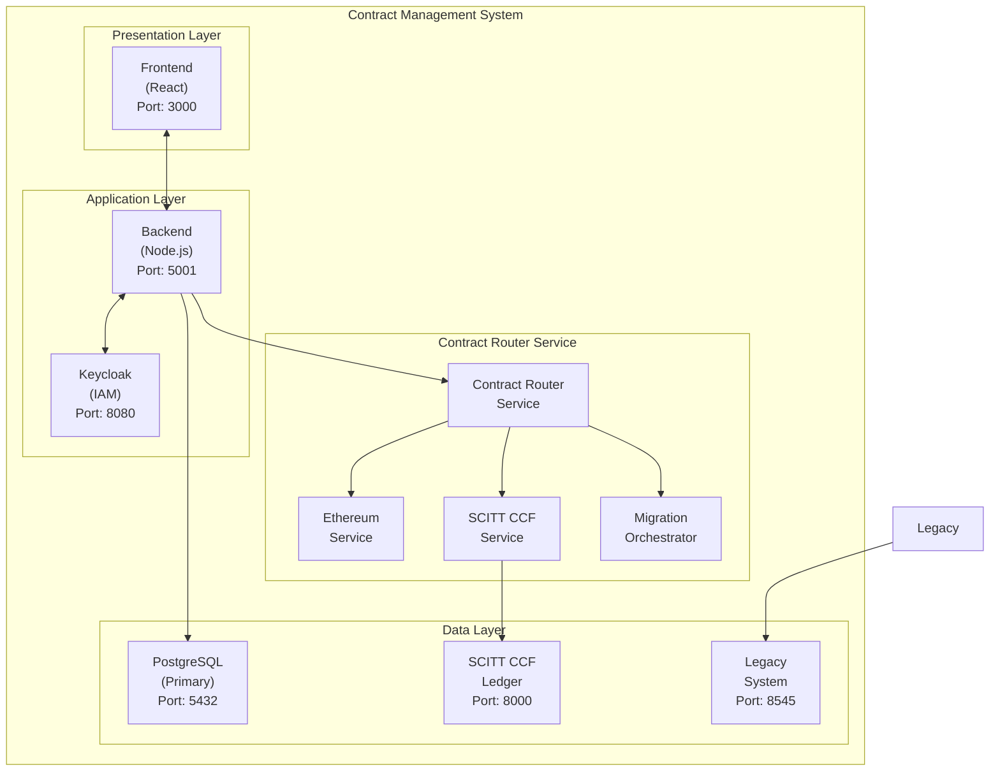

### **System Components**
- **Frontend**: React.js with Material-UI
- **Backend**: Node.js with Express.js
- **Database**: PostgreSQL with Sequelize ORM
- **Authentication**: Keycloak IAM
- **Legacy System**: Traditional blockchain (deprecated)
- **SCITT CCF**: High-performance confidential computing ledger
- **Secret Management**: HashiCorp Vault
- **Cloud Providers**: AWS, Azure, GCP, OCI

## 🧩 Architecture Components

### **Frontend Layer**
```
frontend/
├── src/
│   ├── components/          # Reusable UI components
│   ├── pages/               # Page-level components
│   ├── services/            # API service layer
│   ├── contexts/            # React context providers
│   ├── utils/               # Utility functions
│   └── styles/              # CSS and styling
├── public/                  # Static assets
└── tests/                   # Frontend tests
```

**Key Features**:
- **Component-Based Architecture**: Modular, reusable components
- **State Management**: React Context for global state
- **Routing**: React Router for navigation
- **API Integration**: Axios for HTTP requests
- **UI Framework**: Material-UI for consistent design

### **Backend Layer**
```
backend/
├── routes/                  # API route handlers
│   ├── contractSigning.js  # Unified contract signing API (includes enterprise signing)
│   ├── auth.js             # Authentication routes
│   ├── contracts.js        # Contract management routes
│   ├── datasets.js         # Dataset management routes
│   ├── users.js            # User management routes
│   ├── scitt-ccf.js        # SCITT CCF integration routes
│   └── [other routes...]   # Additional API routes
├── services/                # Business logic layer
│   ├── scittCcfService.js  # SCITT CCF integration service
│   ├── contractSigningService.js  # Traditional signing service
│   ├── enterpriseSigningService.js # Enterprise signing service
│   ├── cloudKmsService.js  # Cloud KMS integration service
│   ├── contractRouterService.js  # Contract routing service
│   ├── systemHealthMonitor.js   # Health monitoring service
│   └── legacyService.js         # Legacy system service (deprecated)
├── models/                  # Database models
│   ├── ScittClaim.js       # SCITT CCF claims model
│   ├── EnterpriseKey.js    # Enterprise key model
│   ├── SigningRequest.js   # Signing request model
│   ├── SystemHealthLog.js  # Health logging model
│   └── Contract.js         # Enhanced contract model
├── middleware/              # Express middleware
├── scripts/                 # Utility scripts
├── tests/                   # Backend tests
└── config/                  # Configuration files
```

**Key Features**:
- **RESTful API**: Standard HTTP endpoints
- **Service Layer**: Business logic separation
- **Database ORM**: Sequelize for database operations
- **Authentication**: JWT token validation
- **Validation**: Request/response validation
- **SCITT CCF Architecture**: Primary ledger with legacy system support

### **Database Layer**
```
Database Schema:
├── users                    # User accounts and profiles
├── contracts               # Contract management (enhanced with SCITT CCF)
├── datasets                # Dataset information
├── ai_models              # AI model metadata
├── ccrp_cloud_credentials # Cloud provider credentials
├── scitt_claims           # SCITT CCF claims storage
├── system_health_log      # System health monitoring
├── enterprise_keys        # Enterprise signing keys
├── signing_requests       # Contract signing requests
├── signatures             # Digital signatures
├── signing_events         # Signing event logs
├── user_keys              # User signing keys
├── audit_logs             # System audit logs
├── privacy_budgets        # Differential privacy budgets
├── privacy_budget_logs    # Privacy budget consumption logs
├── privacy_operations_logs # Privacy operations logs
├── provenance_captures    # Data provenance tracking
├── provenance_nodes       # Provenance graph nodes
├── provenance_verifications # Provenance verifications
├── merkle_trees           # Merkle tree structures
├── notifications          # System notifications
├── training_environments  # Training environment configurations
├── training_jobs          # Training job records
├── contract_templates     # Contract templates
├── constraint_categories  # Data constraint categories
├── constraint_fields      # Constraint field definitions
├── constraint_values      # Constraint values
├── consents               # User consent records
├── data_breaches          # Data breach records
├── data_processing_records # Data processing records
├── grievances             # User grievance records
├── environment_costs      # Environment cost tracking
└── environment_resources  # Environment resource tracking
```

## 🔗 SCITT CCF Integration Architecture

### **What is SCITT CCF?**

SCITT CCF (Supply Chain Integrity Transparency and Trust) is Microsoft's high-performance ledger application built on Confidential Consortium Framework (CCF). It provides:

- **10-100x Performance**: Massive throughput improvement over Ethereum
- **Confidential Computing**: Hardware-level TEE (Trusted Execution Environment) support
- **Standards Compliance**: IETF SCITT working group standards
- **Enterprise Ready**: Production-grade infrastructure

### **SCITT CCF Architecture Components**

#### **1. Contract Router Service**
The central orchestrator that intelligently routes contract operations:

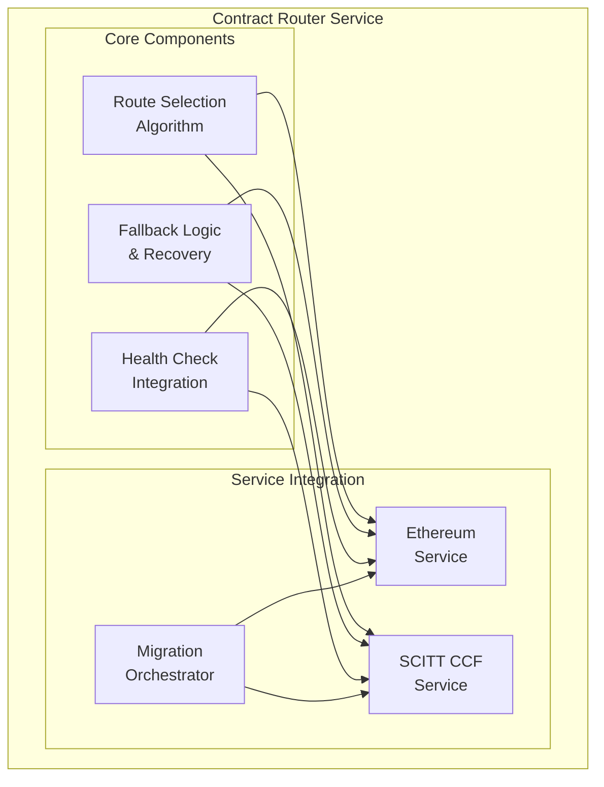

**Key Features**:
- **Intelligent Routing**: Automatically selects best system for each operation
- **Fallback Mechanisms**: Seamless fallback if primary system fails
- **Health Monitoring**: Real-time system health assessment
- **Migration Support**: Gradual migration from Ethereum to SCITT CCF

#### **2. SCITT CCF Service Layer**
Handles all interactions with the SCITT CCF Ledger:

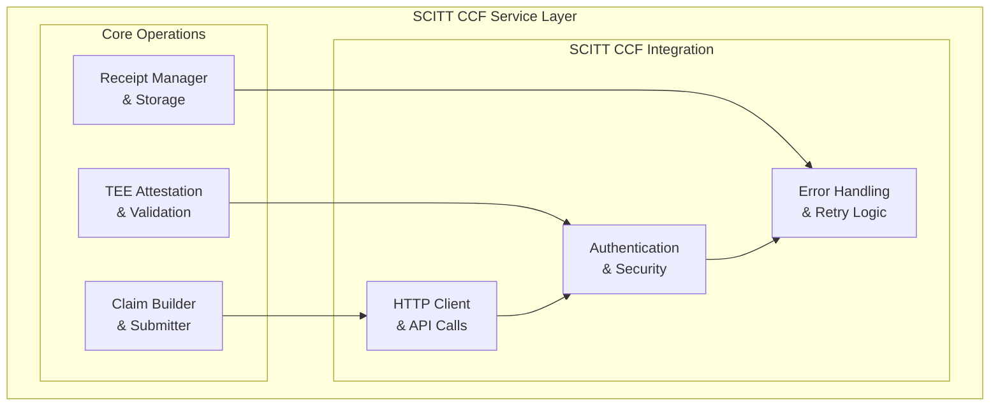

**Key Features**:
- **Claim Management**: Builds and submits SCITT CCF claims
- **TEE Integration**: Supports AMD SEV-SNP and virtual platforms
- **Receipt Handling**: Manages SCITT CCF receipts and verification
- **Local Storage**: Caches claims locally for fallback and auditing

#### **3. System Health Monitor**
Continuously monitors system health and performance:

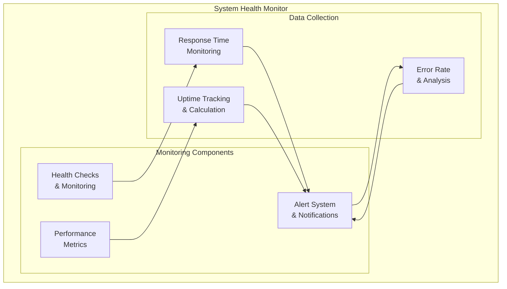

**Key Features**:
- **Real-time Monitoring**: Continuous health status tracking
- **Performance Metrics**: Response time, throughput, and error rate monitoring
- **Alert System**: Proactive notification of system issues
- **Historical Data**: Performance trend analysis and reporting

### **Migration Architecture**

#### **Hybrid Migration Strategy**
The system supports three migration modes:

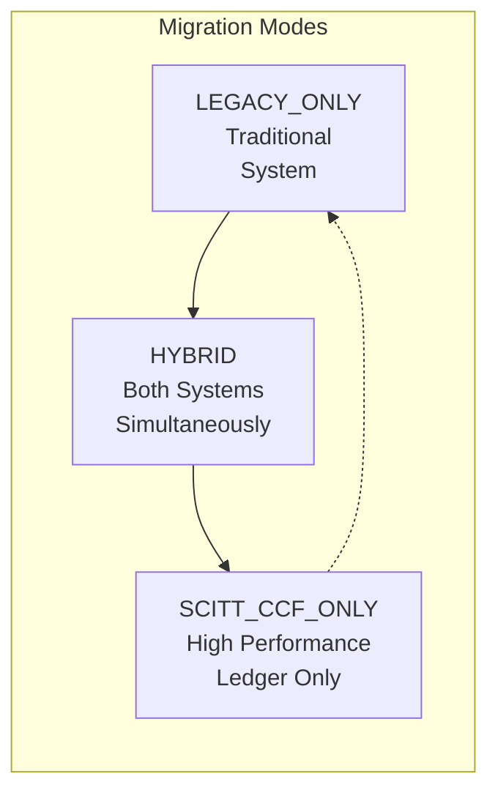

**Migration Modes**:

1. **LEGACY_ONLY**:
   - Traditional system operation
   - No SCITT CCF integration
   - Legacy mode for troubleshooting

2. **HYBRID** (Recommended):
   - New contracts go to SCITT CCF
   - Existing contracts remain on legacy system
   - Automatic fallback if SCITT CCF fails
   - Gradual migration path

3. **SCITT_CCF_ONLY**:
   - All contracts use SCITT CCF
   - No Ethereum fallback
   - Maximum performance
   - Requires SCITT CCF to be fully operational

#### **Migration Flow**

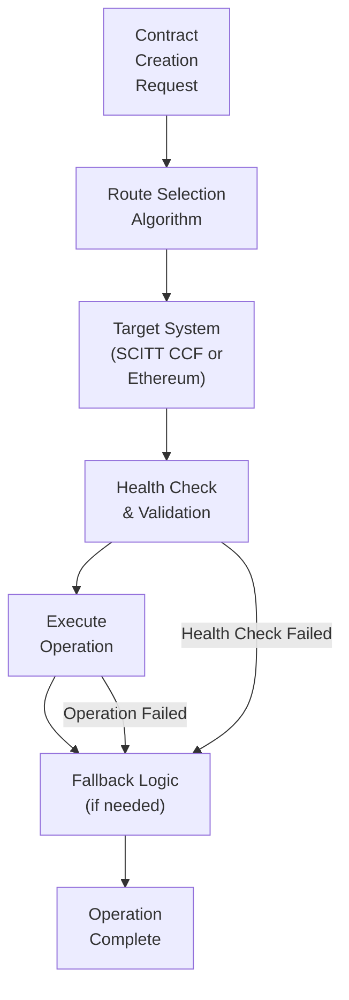

### **SCITT CCF Data Flow**

#### **Contract Creation Flow**

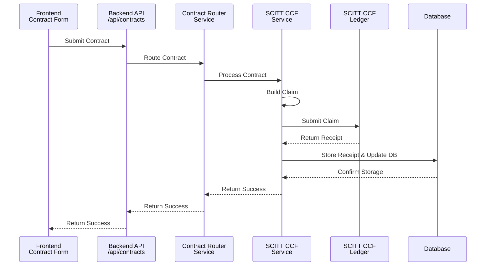

#### **Contract Retrieval Flow**

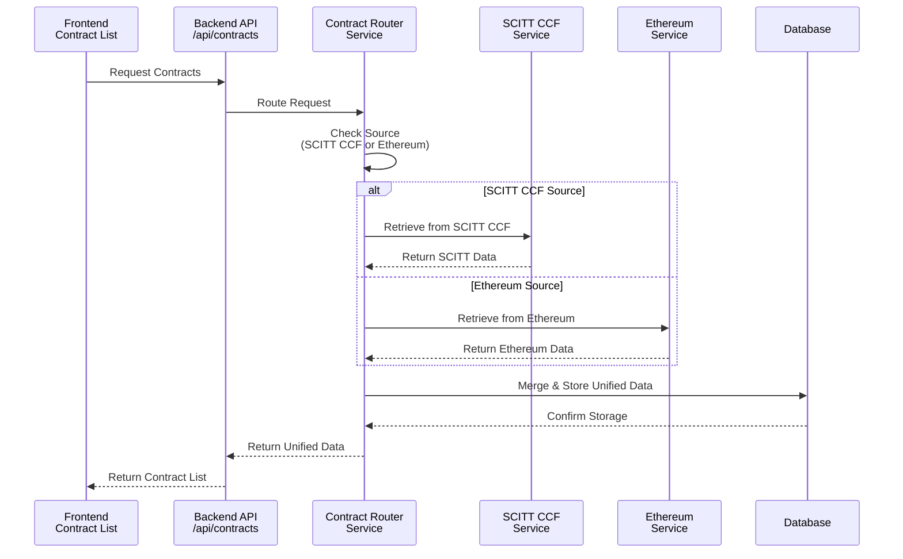

### **Performance Architecture**

#### **Performance Comparison**

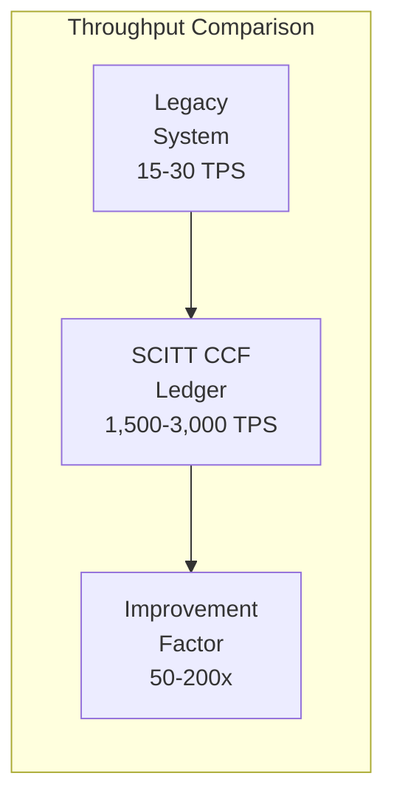

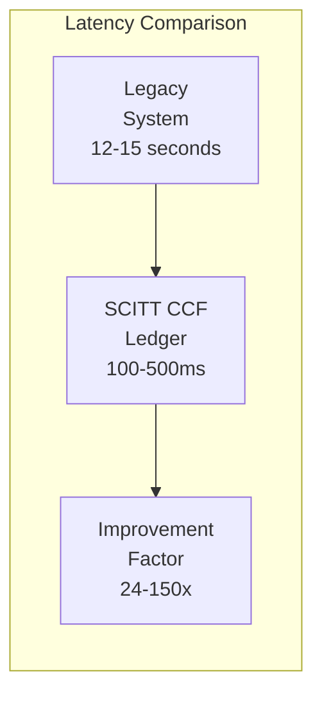

### **Security Architecture**

#### **TEE (Trusted Execution Environment) Support**

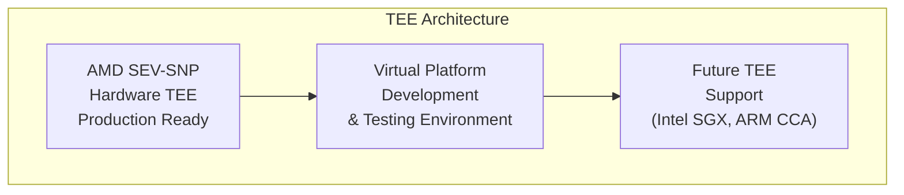

**TEE Features**:
- **Memory Encryption**: Hardware-level memory protection
- **Attestation**: Cryptographic proof of execution environment
- **Isolation**: Secure execution environment separation
- **Integrity**: Protection against tampering and attacks

#### **Confidential Computing Benefits**
- **Data Privacy**: Data remains encrypted during processing
- **Code Integrity**: Execution environment cannot be modified
- **Audit Trail**: Cryptographic proof of all operations
- **Compliance**: Meets regulatory requirements for data handling

## 🔐 Contract Signing Architecture

### **Unified Signing Services**

The system provides a comprehensive contract signing architecture that supports both traditional and enterprise signing workflows:

#### **1. Traditional Signing Service** (`contractSigningService.js`)
Handles standard contract signing operations:
- **Key Generation**: ECDSA-P256, RSA-2048, RSA-4096 algorithms
- **Key Management**: User key storage and lifecycle management
- **Contract Signing**: Direct signing with user's private keys
- **Signature Verification**: Cryptographic signature validation
- **SCITT CCF Integration**: Automatic signature storage in ledger

#### **2. Enterprise Signing Service** (`enterpriseSigningService.js`)
Manages enterprise-grade signing workflows:
- **Enterprise Key Registration**: Public key registration for external KMS
- **Cloud KMS Integration**: Azure Key Vault, AWS KMS, Google Cloud KMS, OCI KMS
- **Remote Signing**: Contract hash sent to enterprise KMS for signing
- **Signature Verification**: Verification using registered public keys
- **Audit Trail**: Complete signing request tracking

#### **3. Cloud KMS Service** (`cloudKmsService.js`)
Provides cloud provider integration:
- **Multi-Cloud Support**: Azure, AWS, GCP, OCI
- **Connection Testing**: Validate KMS credentials and connectivity
- **Remote Operations**: Sign and verify using cloud KMS
- **Security**: Encrypted credential storage and transmission

### **Signing Workflow Architecture**

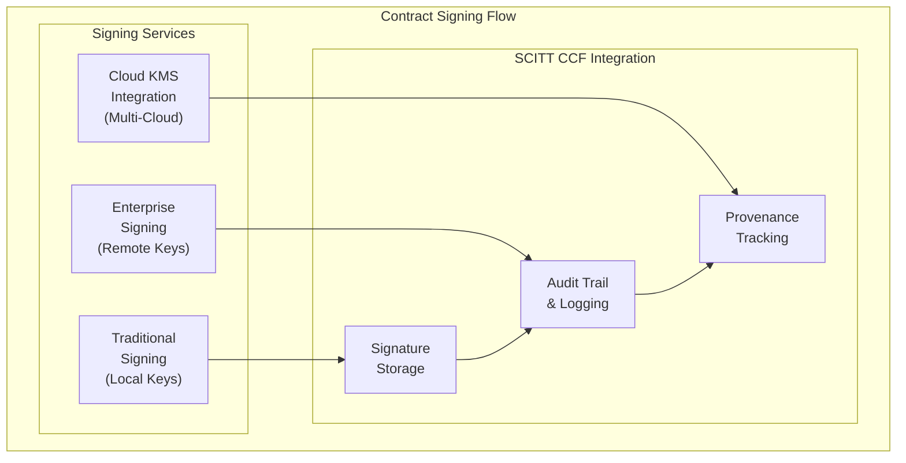

### **API Endpoints Structure**

#### **Traditional Signing** (`/api/signing/`)
- `GET /config` - Signing configuration
- `GET /keys` - User's signing keys
- `POST /keys/generate` - Generate new signing key
- `DELETE /keys/:keyId` - Revoke signing key
- `POST /sign` - Sign contract
- `POST /verify` - Verify signature
- `GET /contracts/:contractId/signatures` - Get contract signatures
- `GET /stats` - Signing statistics

#### **Enterprise Signing** (`/api/signing/enterprise/`)
- `POST /keys/register` - Register enterprise key
- `GET /keys` - Get enterprise keys
- `GET /keys/:keyId` - Get specific enterprise key
- `DELETE /keys/:keyId` - Deactivate enterprise key
- `GET /algorithms` - Supported algorithms
- `POST /sign` - Initiate enterprise signing
- `POST /verify` - Verify enterprise signature
- `GET /signing-requests` - Get signing requests

#### **KMS Configuration** (`/api/signing/enterprise/kms/`)
- `POST /test` - Test KMS connection
- `POST /save` - Save KMS configuration
- `GET /config` - Get KMS configuration

### **Security Model**

#### **Traditional Signing Security**
- **Key Storage**: Encrypted private keys in database
- **Key Generation**: Cryptographically secure key generation
- **Access Control**: User-based key access
- **Audit Logging**: Complete signing event tracking

#### **Enterprise Signing Security**
- **No Private Key Access**: Application never stores private keys
- **Credential Encryption**: KMS credentials encrypted in Vault
- **Public Key Registration**: Only public keys stored locally
- **Remote Signing**: Private keys remain in enterprise KMS
- **Audit Trail**: Complete enterprise signing tracking

### **Database Schema**

#### **Enterprise Key Management**
```sql
-- Enterprise Keys table
CREATE TABLE enterprise_keys (
  key_id VARCHAR(255) PRIMARY KEY,
  user_id INTEGER REFERENCES users(id),
  public_key TEXT NOT NULL,
  provider ENUM('azure', 'aws', 'gcp', 'oci') NOT NULL,
  algorithm VARCHAR(50) NOT NULL,
  status ENUM('ACTIVE', 'INACTIVE', 'REVOKED') DEFAULT 'ACTIVE',
  metadata JSONB,
  created_at TIMESTAMP DEFAULT CURRENT_TIMESTAMP
);

-- Signing Requests table
CREATE TABLE signing_requests (
  id SERIAL PRIMARY KEY,
  contract_id VARCHAR(255) NOT NULL,
  user_id INTEGER REFERENCES users(id),
  key_id VARCHAR(255) NOT NULL,
  contract_hash VARCHAR(64) NOT NULL,
  status ENUM('PENDING', 'COMPLETED', 'FAILED', 'CANCELLED') DEFAULT 'PENDING',
  signature TEXT,
  kms_config JSONB NOT NULL,
  error TEXT,
  completed_at TIMESTAMP,
  failed_at TIMESTAMP,
  created_at TIMESTAMP DEFAULT CURRENT_TIMESTAMP
);
```

## 🔐 Authentication & Authorization

### **Keycloak Integration**

#### **Realm Configuration**
- **Realm Name**: `contract-management`
- **Access Token Lifespan**: 5 minutes
- **SSO Session Idle**: 30 minutes
- **SSO Session Max**: 60 minutes
- **Direct Access Grants**: Enabled

#### **Client Configuration**
```json
{
  "frontend_client": {
    "clientId": "contract-management-frontend",
    "publicClient": true,
    "redirectUris": ["http://localhost:3000/*"],
    "webOrigins": ["http://localhost:3000"]
  },
  "backend_client": {
    "clientId": "contract-management-backend",
    "publicClient": false,
    "serviceAccountsEnabled": true
  }
}
```

#### **User Roles**
- **TDP**: Training Data Provider
- **TDC**: Training Data Consumer
- **CCRP**: Confidential Clean Room Provider
- **ADMIN**: System Administrator

### **Authentication Flow**
1. **User Login**: Frontend authenticates with Keycloak
2. **Token Generation**: Keycloak issues access and refresh tokens
3. **API Requests**: Backend validates tokens with Keycloak
4. **Role-Based Access**: System applies role-based permissions
5. **Token Refresh**: Automatic token refresh before expiration

### **Security Features**
- **JWT Tokens**: Secure token-based authentication
- **Role-Based Access**: Fine-grained permission control
- **Session Management**: Secure session handling
- **Token Blacklisting**: Support for token revocation
- **Audit Logging**: Comprehensive authentication logs

## 🗄️ Database Design

### **Core Tables**

#### **Users Table**
```sql
CREATE TABLE users (
  id SERIAL PRIMARY KEY,
  email VARCHAR(255) UNIQUE NOT NULL,
  password VARCHAR(255),
  partyType VARCHAR(50) NOT NULL,
  name VARCHAR(255),
  organization VARCHAR(255),
  depaId VARCHAR(255),
  iamUserId VARCHAR(255),
  iamUsername VARCHAR(255),
  isActive BOOLEAN DEFAULT true,
  createdAt TIMESTAMP DEFAULT CURRENT_TIMESTAMP,
  updatedAt TIMESTAMP DEFAULT CURRENT_TIMESTAMP
);
```

#### **Contracts Table**
```sql
CREATE TABLE contracts (
  id SERIAL PRIMARY KEY,
  contractId VARCHAR(255) UNIQUE NOT NULL,
  title VARCHAR(255) NOT NULL,
  description TEXT,
  status VARCHAR(50) DEFAULT 'draft',
  partyType VARCHAR(50) NOT NULL,
  datasetId INTEGER REFERENCES datasets(id),
  price DECIMAL(10,2),
  currency VARCHAR(10) DEFAULT 'USD',
  startDate TIMESTAMP,
  endDate TIMESTAMP,
  depaId VARCHAR(255),
  createdAt TIMESTAMP DEFAULT CURRENT_TIMESTAMP,
  updatedAt TIMESTAMP DEFAULT CURRENT_TIMESTAMP
);
```

#### **Datasets Table**
```sql
CREATE TABLE datasets (
  id SERIAL PRIMARY KEY,
  name VARCHAR(255) NOT NULL,
  description TEXT,
  type VARCHAR(100),
  size VARCHAR(50),
  format VARCHAR(50),
  price DECIMAL(10,2),
  currency VARCHAR(10) DEFAULT 'USD',
  provider VARCHAR(255),
  depaId VARCHAR(255),
  metadata JSONB,
  createdAt TIMESTAMP DEFAULT CURRENT_TIMESTAMP,
  updatedAt TIMESTAMP DEFAULT CURRENT_TIMESTAMP
);
```

#### **Cloud Credentials Table**
```sql
CREATE TABLE ccrp_cloud_credentials (
  id SERIAL PRIMARY KEY,
  ccrpId INTEGER REFERENCES users(id),
  cloudProvider VARCHAR(50) NOT NULL,
  projectId VARCHAR(255),
  compartmentId VARCHAR(255),
  secretName VARCHAR(255),
  secretManager VARCHAR(50),
  authMethod VARCHAR(50),
  isValid BOOLEAN DEFAULT false,
  createdAt TIMESTAMP DEFAULT CURRENT_TIMESTAMP,
  updatedAt TIMESTAMP DEFAULT CURRENT_TIMESTAMP
);
```

### **Relationships**
- **Users** → **Contracts** (One-to-Many)
- **Users** → **Datasets** (One-to-Many)
- **Users** → **Cloud Credentials** (One-to-Many)
- **Datasets** → **Contracts** (One-to-Many)

### **Indexes**
```sql
-- Performance indexes
CREATE INDEX idx_users_email ON users(email);
CREATE INDEX idx_users_party_type ON users(partyType);
CREATE INDEX idx_contracts_status ON contracts(status);
CREATE INDEX idx_contracts_party_type ON contracts(partyType);
CREATE INDEX idx_datasets_type ON datasets(type);
CREATE INDEX idx_datasets_provider ON datasets(provider);
```

## 🔌 API Architecture

### **RESTful API Design**

#### **Base URL**
```
http://localhost:5001/api
```

#### **Authentication Endpoints**
- `POST /auth/register` - User registration with IAM integration
- `POST /auth/login` - User authentication
- `POST /auth/logout` - User logout
- `POST /auth/refresh` - Token refresh
- `GET /auth/profile` - Get user profile
- `PUT /auth/profile` - Update user profile
- `POST /auth/verify-email` - Send email verification
- `GET /auth/verify-email/:token` - Verify email with token
- `GET /auth/onboarding-status` - Get user onboarding status
- `POST /auth/complete-onboarding` - Complete user onboarding
- `POST /auth/forgot-password` - Request password reset
- `POST /auth/reset-password` - Reset password with token
- `POST /auth/wallet` - Wallet-based authentication
- `GET /auth/nonce/:walletAddress` - Get nonce for wallet authentication

#### **Contract Endpoints**
- `GET /contracts` - List all contracts
- `GET /contracts/user/:userId` - Get contracts for specific user
- `GET /contracts/:contractId` - Get contract details by ID

#### **Contract Signing Endpoints**
- `GET /signing/config` - Get signing configuration
- `GET /signing/keys` - Get user's signing keys
- `POST /signing/keys/generate` - Generate new signing key
- `DELETE /signing/keys/:keyId` - Revoke signing key
- `POST /signing/sign` - Sign contract
- `POST /signing/verify` - Verify signature
- `GET /signing/contracts/:contractId/signatures` - Get contract signatures
- `GET /signing/stats` - Get signing statistics

#### **Enterprise Signing Endpoints**
- `POST /signing/enterprise/keys/register` - Register enterprise key
- `GET /signing/enterprise/keys` - Get enterprise keys
- `GET /signing/enterprise/keys/:keyId` - Get specific enterprise key
- `DELETE /signing/enterprise/keys/:keyId` - Deactivate enterprise key
- `GET /signing/enterprise/algorithms` - Get supported algorithms
- `POST /signing/enterprise/sign` - Initiate enterprise signing
- `POST /signing/enterprise/verify` - Verify enterprise signature
- `GET /signing/enterprise/signing-requests` - Get signing requests

#### **KMS Configuration Endpoints**
- `POST /signing/enterprise/kms/test` - Test KMS connection
- `POST /signing/enterprise/kms/save` - Save KMS configuration
- `GET /signing/enterprise/kms/config` - Get KMS configuration

#### **Dataset Endpoints**
- `GET /datasets/public` - List public datasets
- `GET /datasets/owner/:ownerId` - Get datasets by owner
- `GET /datasets/search` - Search datasets with filters

#### **Cloud Credentials Endpoints**
- `GET /ccrp/cloud-credentials` - List credentials
- `POST /ccrp/cloud-credentials` - Add credentials
- `PUT /ccrp/cloud-credentials/:id` - Update credentials
- `DELETE /ccrp/cloud-credentials/:id` - Delete credentials
- `POST /ccrp/cloud-credentials/:id/validate` - Validate credentials

### **API Design Patterns**

#### **Response Format**
```json
{
  "success": true,
  "data": {
    // Response data
  },
  "pagination": {
    "page": 1,
    "limit": 10,
    "total": 100,
    "pages": 10
  }
}
```

#### **Error Format**
```json
{
  "success": false,
  "error": {
    "code": "VALIDATION_ERROR",
    "message": "Validation failed",
    "details": {
      "field": ["Error message"]
    }
  }
}
```

#### **Pagination**
```json
{
  "pagination": {
    "page": 1,
    "limit": 10,
    "total": 100,
    "pages": 10,
    "hasNext": true,
    "hasPrev": false
  }
}
```

## 🎨 Frontend Architecture

### **Component Hierarchy**
```
App
├── Router
│   ├── Login
│   ├── Dashboard
│   │   ├── TDCDashboard
│   │   ├── TDPDashboard
│   │   ├── CCRPDashboard
│   │   └── AdminDashboard
│   ├── Contracts
│   ├── Datasets
│   ├── CloudCredentials
│   └── Profile
└── Context Providers
    ├── UserContext
    ├── AuthContext
    └── ThemeContext
```

### **State Management**
- **React Context**: Global state management
- **Local State**: Component-level state
- **Form State**: Controlled components
- **API State**: Loading, error, success states

### **Routing Strategy**
- **Protected Routes**: Role-based access control
- **Public Routes**: Login, registration
- **Dynamic Routes**: Contract details, dataset details
- **Nested Routes**: Dashboard with sub-navigation

## ⛓️ Legacy System Integration (Deprecated)

> **Note**: The system has migrated from traditional blockchain to SCITT CCF ledger for improved performance and security. The legacy system integration is maintained for backward compatibility and gradual migration.

### **Migration Status**
- **Primary Ledger**: SCITT CCF (High-performance confidential computing ledger)
- **Legacy Support**: Traditional blockchain system (for existing contracts)
- **Migration Mode**: Hybrid (supports both systems during transition)

### **Legacy Smart Contract Architecture**
```solidity
// ContractManager.sol (Legacy - maintained for backward compatibility)
contract ContractManager {
    struct Contract {
        string contractId;
        address[] parties;
        string terms;
        uint256 price;
        bool isActive;
        uint256 createdAt;
    }
    
    mapping(string => Contract) public contracts;
    
    function createContract(
        string memory contractId,
        address[] memory parties,
        string memory terms,
        uint256 price
    ) public returns (bool) {
        // Contract creation logic
    }
    
    function getContract(string memory contractId) 
        public view returns (Contract memory) {
        return contracts[contractId];
    }
}
```

### **Legacy Integration Points**
- **Contract Deployment**: Smart contract deployment (legacy)
- **Contract Storage**: On-chain contract data (legacy)
- **Event Logging**: Legacy system event tracking (deprecated)
- **Transaction Verification**: Payment verification (legacy)

### **Migration Features**
- **Hybrid Mode**: Supports both SCITT CCF and legacy system
- **Automatic Routing**: Contracts routed to appropriate system
- **Fallback Support**: Legacy system fallback if SCITT CCF unavailable
- **Gradual Migration**: Existing contracts remain on legacy system

## 🔐 Secret Management

### **Multi-Cloud Secret Management**

#### **Supported Secret Managers**
- **HashiCorp Vault**: Primary secret manager
- **AWS Secrets Manager**: AWS integration
- **Azure Key Vault**: Azure integration
- **Google Cloud Secret Manager**: GCP integration
- **OCI Vault**: Oracle Cloud integration

#### **Secret Management Architecture**
```
Application
    │
    ▼
Secret Manager Service
    │
    ├── HashiCorp Vault
    ├── AWS Secrets Manager
    ├── Azure Key Vault
    ├── GCP Secret Manager
    └── OCI Vault
```

#### **Secret Storage Strategy**
- **No Plain Text**: No secrets stored in database
- **Encrypted Storage**: All secrets encrypted at rest
- **Access Control**: Role-based secret access
- **Audit Trail**: Complete secret access logging
- **Rotation Support**: Automatic secret rotation

### **Cloud Provider Integration**

#### **AWS Integration**
```javascript
// AWS provider service
class AWSProvider {
  async validateCredentials(credentials) {
    // Validate AWS credentials
  }
  
  async createTrainingEnvironment(specs) {
    // Create AWS training environment
  }
  
  async estimateCosts(resources) {
    // Estimate AWS costs
  }
}
```

#### **Azure Integration**
```javascript
// Azure provider service
class AzureProvider {
  async validateCredentials(credentials) {
    // Validate Azure credentials
  }
  
  async createTrainingEnvironment(specs) {
    // Create Azure training environment
  }
  
  async estimateCosts(resources) {
    // Estimate Azure costs
  }
}
```

## 🔐 Differential Privacy Architecture

### **Overview**
The differential privacy system provides privacy-preserving data analysis with mathematical guarantees of privacy protection. It implements multiple noise mechanisms, budget tracking, and comprehensive audit logging.

### **High-Level DP Architecture**

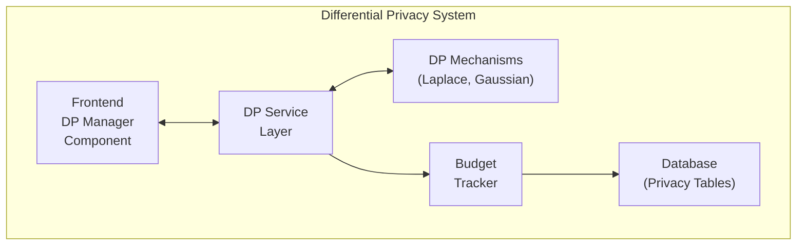

### **Core Components**

#### **1. Differential Privacy Service**
```javascript
// backend/services/differentialPrivacyService.js
class DifferentialPrivacyService {
  constructor() {
    this.mechanisms = {
      laplace: new LaplaceMechanism(),
      gaussian: new GaussianMechanism(),
      exponential: new ExponentialMechanism(),
      geometric: new GeometricMechanism()
    };
    this.budgetTracker = new PrivacyBudgetTracker();
    this.sensitivityAnalyzer = new SensitivityAnalyzer();
  }
}
```

**Responsibilities:**
- Orchestrates DP operations
- Selects appropriate mechanisms
- Manages privacy budget
- Analyzes data sensitivity
- Provides audit logging

#### **2. Noise Mechanisms**

**Laplace Mechanism**
```javascript
// backend/services/mechanisms/laplaceMechanism.js
class LaplaceMechanism {
  addNoise(value, epsilon, sensitivity) {
    const scale = sensitivity / epsilon;
    const noise = this.sampleLaplace(scale);
    return value + noise;
  }
}
```

**Gaussian Mechanism**
```javascript
// backend/services/mechanisms/gaussianMechanism.js
class GaussianMechanism {
  addNoise(value, epsilon, delta, sensitivity) {
    const scale = this.calculateGaussianScale(epsilon, delta, sensitivity);
    const noise = this.sampleGaussian(scale);
    return value + noise;
  }
}
```

#### **3. Privacy Budget Management**
```javascript
// backend/services/privacyBudgetTracker.js
class PrivacyBudgetTracker {
  async checkBudget(contractId, requiredEpsilon, requiredDelta) {
    const budget = await this.getCurrentBudget(contractId);
    return {
      hasBudget: budget.remainingEpsilon >= requiredEpsilon && 
                 budget.remainingDelta >= requiredDelta,
      currentBudget: budget
    };
  }
}
```

**Budget States:**
- `ACTIVE`: Budget available for operations
- `WARNING`: Budget running low (< 20%)
- `EXHAUSTED`: Budget fully consumed
- `RESET`: Budget has been reset

#### **4. Sensitivity Analysis**
```javascript
// backend/services/sensitivityAnalyzer.js
class SensitivityAnalyzer {
  calculateSensitivity(queryType, data, parameters) {
    switch(queryType) {
      case 'COUNT':
        return 1; // Adding/removing one record changes count by 1
      case 'SUM':
        return Math.max(...data.map(Math.abs)); // Max absolute value
      case 'AVERAGE':
        return this.calculateAverageSensitivity(data);
      case 'GRADIENT':
        return this.calculateGradientSensitivity(data, parameters);
    }
  }
}
```

### **Database Schema**

#### **Privacy Budget Tables**
```sql
-- PrivacyBudgets table
CREATE TABLE "PrivacyBudgets" (
  id SERIAL PRIMARY KEY,
  contractId VARCHAR(255) NOT NULL REFERENCES contracts(contractId),
  initialEpsilon DECIMAL(10,6) NOT NULL DEFAULT 1.0,
  initialDelta DECIMAL(20,15) NOT NULL DEFAULT 0.00001,
  remainingEpsilon DECIMAL(10,6) NOT NULL,
  remainingDelta DECIMAL(20,15) NOT NULL,
  totalEpsilonConsumed DECIMAL(10,6) NOT NULL DEFAULT 0,
  totalDeltaConsumed DECIMAL(20,15) NOT NULL DEFAULT 0,
  budgetStatus ENUM('ACTIVE', 'WARNING', 'EXHAUSTED', 'RESET') DEFAULT 'ACTIVE',
  lastResetAt TIMESTAMP WITH TIME ZONE,
  createdAt TIMESTAMP WITH TIME ZONE NOT NULL DEFAULT NOW(),
  updatedAt TIMESTAMP WITH TIME ZONE NOT NULL DEFAULT NOW()
);

-- PrivacyBudgetLogs table
CREATE TABLE "PrivacyBudgetLogs" (
  id SERIAL PRIMARY KEY,
  contractId VARCHAR(255) NOT NULL REFERENCES contracts(contractId),
  epsilonConsumed DECIMAL(10,6) NOT NULL,
  deltaConsumed DECIMAL(20,15) NOT NULL,
  operation VARCHAR(255) NOT NULL,
  operationId VARCHAR(255),
  userId INTEGER REFERENCES users(id),
  timestamp TIMESTAMP WITH TIME ZONE NOT NULL DEFAULT NOW(),
  metadata JSON,
  ipAddress VARCHAR(45),
  userAgent TEXT
);

-- PrivacyOperationsLogs table
CREATE TABLE "PrivacyOperationsLogs" (
  id SERIAL PRIMARY KEY,
  contractId VARCHAR(255) NOT NULL REFERENCES contracts(contractId),
  operationType VARCHAR(255) NOT NULL,
  epsilon DECIMAL(10,6) NOT NULL,
  delta DECIMAL(20,15) NOT NULL,
  mechanism VARCHAR(255) NOT NULL,
  sensitivity DECIMAL(15,6) NOT NULL,
  dataSize INTEGER,
  queryType VARCHAR(255),
  timestamp TIMESTAMP WITH TIME ZONE NOT NULL DEFAULT NOW(),
  userId INTEGER REFERENCES users(id),
  result JSON,
  executionTime INTEGER,
  success BOOLEAN NOT NULL DEFAULT true,
  errorMessage TEXT,
  ipAddress VARCHAR(45),
  userAgent TEXT,
  sessionId VARCHAR(255)
);
```

### **API Architecture**

#### **DP Endpoints Structure**
```
/api/dp/
├── GET  /mechanisms           # Available DP mechanisms
├── GET  /query-types          # Supported query types
├── POST /test                 # Test DP functionality
├── POST /apply                # Apply DP to data
├── GET  /budget/:contractId   # Privacy budget status
├── GET  /history/:contractId  # Operation history
└── GET  /analytics/:contractId # Privacy analytics
```

#### **Request/Response Flow**
```
1. Client Request → Authentication Middleware
2. Validation → DP Service
3. Budget Check → Privacy Budget Tracker
4. Sensitivity Analysis → Sensitivity Analyzer
5. Noise Addition → Selected Mechanism
6. Budget Update → Privacy Budget Tracker
7. Audit Logging → Privacy Operations Log
8. Response → Client
```

### **Privacy Mechanisms Implementation**

#### **Laplace Mechanism**
- **Use Case**: General-purpose noise addition
- **Parameters**: epsilon, sensitivity
- **Noise Distribution**: Laplace(0, sensitivity/epsilon)
- **Best For**: Counts, sums, gradients

#### **Gaussian Mechanism**
- **Use Case**: Better utility for continuous data
- **Parameters**: epsilon, delta, sensitivity
- **Noise Distribution**: Normal(0, σ²) where σ² = 2ln(1.25/δ) × (sensitivity/ε)²
- **Best For**: Averages, statistical measures

#### **Exponential Mechanism**
- **Use Case**: Discrete choice problems
- **Parameters**: epsilon, utility function
- **Best For**: Selection from discrete options

#### **Geometric Mechanism**
- **Use Case**: Integer count queries
- **Parameters**: epsilon
- **Best For**: Counting operations

### **Budget Management Strategy**

#### **Budget Allocation**
- **Initial Budget**: Epsilon = 1.0, Delta = 1e-5 per contract
- **Warning Threshold**: 20% remaining budget
- **Exhaustion Handling**: Graceful degradation or budget reset

#### **Budget Optimization**
- **Query Batching**: Combine multiple queries
- **Mechanism Selection**: Choose most efficient mechanism
- **Parameter Tuning**: Optimize epsilon/delta ratios

### **Security Considerations**

#### **Privacy Guarantees**
- **Mathematical Proofs**: All mechanisms provide proven privacy guarantees
- **Composition Theorems**: Multiple operations compose safely
- **Post-Processing Immunity**: Results remain private after additional processing

#### **Audit and Compliance**
- **Complete Logging**: All operations logged with metadata
- **Budget Tracking**: Real-time budget consumption monitoring
- **Compliance Reports**: Automated privacy compliance reporting

### **Performance Characteristics**

#### **Computational Complexity**
- **Laplace**: O(1) - Constant time noise generation
- **Gaussian**: O(1) - Constant time noise generation
- **Sensitivity Analysis**: O(n) - Linear in data size
- **Budget Management**: O(1) - Constant time database operations

#### **Scalability**
- **Horizontal Scaling**: Stateless service design
- **Database Optimization**: Indexed queries for budget operations
- **Caching**: Budget status caching for frequent checks

### **Integration Points**

#### **Training Service Integration**
```javascript
// backend/services/trainingService.js
async trainModelWithDP(trainingData, privacyParams) {
  const dpService = new DifferentialPrivacyService();
  
  // Apply DP to gradients
  const noisyGradients = await dpService.applyDifferentialPrivacy(
    trainingData.gradients,
    { type: 'GRADIENT' },
    privacyParams
  );
  
  // Continue training with noisy gradients
  return this.trainModel(noisyGradients);
}
```

#### **Contract Service Integration**
```javascript
// backend/services/contractService.js
async applyDPToContractData(contractId, data, query, privacyParams) {
  const dpService = new DifferentialPrivacyService();
  
  // Apply DP to contract-related data
  return await dpService.applyDifferentialPrivacy(
    data,
    query,
    { ...privacyParams, contractId }
  );
}
```

### **Monitoring and Analytics**

#### **Privacy Metrics Dashboard**
- **Budget Utilization**: Real-time budget consumption
- **Operation Success Rate**: Success/failure statistics
- **Performance Metrics**: Execution time analysis
- **Mechanism Usage**: Distribution of mechanism selection

#### **Alerting System**
- **Budget Warnings**: Low budget notifications
- **Performance Alerts**: Slow operation detection
- **Error Monitoring**: Failed operation tracking

### **Future Enhancements**

#### **Advanced Mechanisms**
- **Rényi Differential Privacy**: More flexible privacy definitions
- **Local Differential Privacy**: Client-side privacy
- **Federated Learning**: Distributed privacy-preserving training

#### **Automated Optimization**
- **Parameter Tuning**: ML-based epsilon/delta optimization
- **Mechanism Selection**: Automatic mechanism recommendation
- **Budget Planning**: Predictive budget allocation

## 🛡️ Security Architecture

### **Security Layers**

#### **Network Security**
- **HTTPS**: All communications encrypted
- **CORS**: Cross-origin resource sharing control
- **Rate Limiting**: API rate limiting
- **DDoS Protection**: Distributed denial-of-service protection

#### **Application Security**
- **Input Validation**: All inputs validated
- **SQL Injection Protection**: Parameterized queries
- **XSS Protection**: Cross-site scripting protection
- **CSRF Protection**: Cross-site request forgery protection

#### **Data Security**
- **Encryption at Rest**: Database encryption
- **Encryption in Transit**: TLS/SSL encryption
- **Data Masking**: Sensitive data masking
- **Audit Logging**: Comprehensive audit trails

### **Authentication Security**
- **Multi-Factor Authentication**: MFA support
- **Password Policies**: Strong password requirements
- **Session Management**: Secure session handling
- **Token Security**: JWT token security

### **Authorization Security**
- **Role-Based Access Control**: RBAC implementation
- **Permission Granularity**: Fine-grained permissions
- **Resource-Level Security**: Resource-specific access
- **Audit Logging**: Authorization audit trails

## 🚀 Deployment Architecture

### **Development Environment**

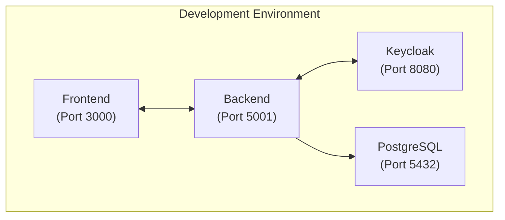

### **Production Environment**

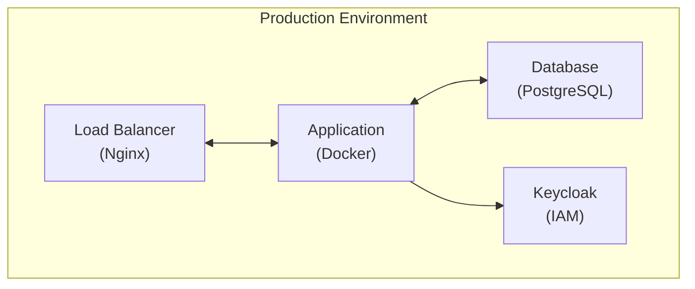

### **Container Architecture**
```yaml
# docker-compose.production.yml
version: '3.8'
services:
  frontend:
    image: contract-management-frontend
    ports:
      - "80:80"
    depends_on:
      - backend
  
  backend:
    image: contract-management-backend
    ports:
      - "5001:5001"
    environment:
      - NODE_ENV=production
    depends_on:
      - ***REMOVED-DB_PASSWORD***
      - ***REMOVED-KEYCLOAK_DB_PASSWORD***
  
  ***REMOVED-DB_PASSWORD***:
    image: ***REMOVED-DB_PASSWORD***:13
    environment:
      - POSTGRES_DB=contract_management
      - POSTGRES_USER=***REMOVED-DB_PASSWORD***
      - POSTGRES_PASSWORD=secure_password
    volumes:
      - ***REMOVED-DB_PASSWORD***_data:/var/lib/***REMOVED-DB_PASSWORD***ql/data
  
  ***REMOVED-KEYCLOAK_DB_PASSWORD***:
    image: quay.io/***REMOVED-KEYCLOAK_DB_PASSWORD***/***REMOVED-KEYCLOAK_DB_PASSWORD***:latest
    ports:
      - "8080:8080"
    environment:
      - KEYCLOAK_ADMIN=admin
      - KEYCLOAK_ADMIN_PASSWORD=secure_password
    volumes:
      - ***REMOVED-KEYCLOAK_DB_PASSWORD***_data:/opt/***REMOVED-KEYCLOAK_DB_PASSWORD***/data

volumes:
  ***REMOVED-DB_PASSWORD***_data:
  ***REMOVED-KEYCLOAK_DB_PASSWORD***_data:
```

### **Scaling Strategy**
- **Horizontal Scaling**: Multiple application instances
- **Load Balancing**: Nginx load balancer
- **Database Scaling**: Read replicas
- **Caching**: Redis for session storage
- **CDN**: Static asset delivery

## 📊 Performance Architecture

### **Performance Optimization**
- **Database Indexing**: Optimized query performance
- **Caching Strategy**: Multi-level caching
- **CDN Integration**: Static asset delivery
- **API Optimization**: Efficient API design
- **Frontend Optimization**: Code splitting and lazy loading

### **Monitoring and Observability**
- **Application Monitoring**: Performance metrics
- **Database Monitoring**: Query performance
- **Infrastructure Monitoring**: System resources
- **Error Tracking**: Comprehensive error logging
- **User Analytics**: Usage analytics

## 🔐 LUKS Encryption Architecture

### **Overview**

The system implements a multi-tier encryption architecture using LUKS (Linux Unified Key Setup) for large file encryption, providing hardware-accelerated encryption for datasets and AI models.

### **Encryption Method Selection**

The system automatically selects the optimal encryption method based on file size:

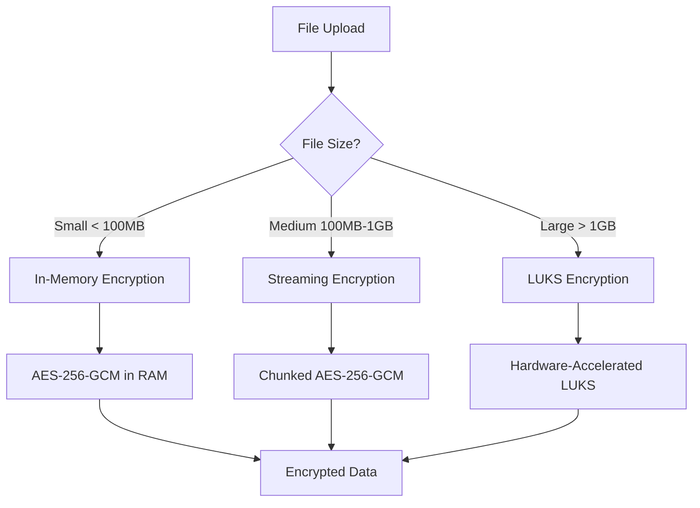

### **LUKS Architecture Components**

#### **1. Enhanced Platform Encryption Service**

```javascript
// Automatic method selection
const method = selectEncryptionMethod(fileSize, dataType);
// Returns: 'memory', 'streaming', or 'luks'

// LUKS encryption for large files
const result = await luksEncryptionService.createLUKSContainer(
    inputPath, outputPath, password, metadata
);
```

#### **2. LUKS Container Structure**

```
luks-container.luks
├── LUKS Header (512 bytes)
│   ├── Magic Number
│   ├── Version
│   ├── Cipher: aes-xts-plain64
│   ├── Hash: sha256
│   ├── Key Slots (8 slots)
│   └── Key Material
├── Encrypted Data Blocks
│   ├── Filesystem (ext4)
│   ├── Original File
│   └── Metadata (.luks-metadata.json)
└── Authentication Tag
```

#### **3. Training Environment Integration**

```python
# Training code automatically detects encrypted data
encrypted_data = self.config.get('encryptedData')
if encrypted_data:
    return self.load_encrypted_data(encrypted_data)

# LUKS decryption in TEE
decryptor = LUKSDecryptor(backend_url, access_token)
result = decryptor.decrypt_file(encrypted_data, output_path)
```

### **API Endpoints**

#### **Enhanced Encryption APIs**

```bash
# Encrypt large file (auto-selects LUKS for > 1GB)
POST /api/enhanced-encryption/encrypt-file
Content-Type: multipart/form-data
Authorization: Bearer <token>

# Decrypt data (auto-detects method)
POST /api/enhanced-encryption/decrypt-data
Content-Type: application/json
Authorization: Bearer <token>

# Get encryption methods and capabilities
GET /api/enhanced-encryption/methods
```

### **Performance Characteristics**

| Method | File Size | Throughput | Memory Usage | Use Case |
|--------|-----------|------------|--------------|----------|
| In-Memory | < 100MB | 500 MB/s | File size × 2 | JSON, config files |
| Streaming | 100MB-1GB | 200 MB/s | 64KB chunks | CSV, log files |
| **LUKS** | **> 1GB** | **1000+ MB/s** | **64KB blocks** | **Large datasets, models** |

### **Security Features**

#### **LUKS Security**
- **AES-256-XTS**: Industry-standard encryption
- **SHA-256**: Secure hash function
- **PBKDF2**: 100,000 iterations for key derivation
- **Hardware Acceleration**: CPU AES-NI instructions
- **Random IVs**: Unique per container

#### **Key Management**
- **Data Encryption Key (DEK)**: Random 256-bit key per container
- **Key Encryption Key (KEK)**: Platform-managed key
- **Key Rotation**: Automatic every 30 days
- **TEE Integration**: Keys only accessible in secure environment

### **Training Integration**

#### **TEE Container Requirements**

```dockerfile
# LUKS tools in training container
RUN apt-get install -y \
    cryptsetup \
    e2fsprogs \
    mount \
    umount

# Python dependencies
RUN pip install requests numpy pandas torch tensorflow
```

#### **Decryption Process in Training**

1. **Container Download**: Download LUKS container if remote
2. **Key Retrieval**: Get decryption key from backend
3. **LUKS Open**: `cryptsetup luksOpen` with key file
4. **Mount Container**: Mount decrypted filesystem
5. **Extract Data**: Copy data from mounted container
6. **Load Data**: Load data for training (NumPy, Pickle, JSON, CSV)
7. **Cleanup**: Unmount, close container, clean temp files

### **Error Handling and Fallbacks**

```python
# Automatic fallback chain
if luksAvailable && fileSize > 1GB:
    return await encryptWithLUKS(data, key, dataType, tdpId)
elif fileSize > 100MB:
    return await encryptWithStreaming(data, key, dataType, tdpId)
else:
    return await encryptInMemory(data, key, dataType, tdpId)
```

### **Monitoring and Logging**

#### **Performance Metrics**
- Encryption/decryption throughput
- Memory usage patterns
- Container creation time
- Key rotation events

#### **Security Events**
- Container access attempts
- Key derivation operations
- Authentication failures
- Cleanup operations

### **Future Enhancements**

#### **1. Hardware Security Modules (HSM)**
- HSM integration for key management
- Hardware-based key generation
- Tamper-resistant key storage

#### **2. Cloud Storage Integration**
- Direct encryption to cloud storage
- Streaming encryption to S3/Azure/GCP
- Server-side encryption with customer keys

#### **3. Parallel Processing**
- Multi-threaded encryption for very large files
- Chunked parallel processing
- Progress tracking and resumable operations

## 🧪 Testing Architecture

### **Updated Test Suite Structure**

The system now includes comprehensive testing for SCITT CCF integration:

```
backend/tests/
├── scitt-ccf-integration.test.js    # SCITT CCF service integration tests
├── scitt-ccf-api.test.js           # SCITT CCF API endpoint tests
├── api-test-suite.js               # General API tests
├── contract-state-machine.test.js  # Contract lifecycle tests
├── cloudProviders.test.js          # Cloud provider integration tests
├── differential-privacy.test.js    # Differential privacy tests
└── integration/                    # Integration test suites
    ├── cloudCredentials.test.js    # Cloud credentials workflow
    └── e2e/                       # End-to-end tests
        └── cloudCredentialsWorkflow.test.js
```

### **SCITT CCF Test Coverage**

#### **Integration Tests** (`scitt-ccf-integration.test.js`)
- **Service Tests**: Service initialization, connection, TEE detection
- **Contract Router Tests**: Migration modes, fallback scenarios, dual operations
- **Health Monitor Tests**: System health monitoring for both SCITT CCF and Ethereum
- **Migration Tests**: All migration modes (ETHEREUM_ONLY, SCITT_CCF_ONLY, HYBRID)
- **Error Handling**: Service unavailability, network issues, invalid data
- **Performance Tests**: Concurrent operations, response time validation

#### **API Tests** (`scitt-ccf-api.test.js`)
- **Health Endpoints**: SCITT CCF health status and metrics
- **Contract Operations**: Create, read, update contracts via SCITT CCF
- **Claims Management**: Submit, retrieve, and manage SCITT CCF claims
- **TEE Attestation**: Verify trusted execution environment attestations
- **Migration Endpoints**: Migration mode management and contract migration
- **Configuration**: SCITT CCF configuration management
- **Load Testing**: Concurrent operations and large data handling

### **Test Data Management**

The test suites use comprehensive test data created by `create-test-data.js`:
- **8 Users** with different roles (TDP, TDC, CCRP, Admin)
- **7 Datasets** with DEPA IDs and metadata
- **3 AI Models** with performance metrics
- **3 Contract Templates** for different use cases
- **3 Sample Contracts** in various states

### **Testing Workflows**

```bash
# Run all tests including SCITT CCF
cd backend
npm test

# Run SCITT CCF specific tests
npm test -- --testPathPattern="scitt-ccf"

# Run specific test suites
npm test -- scitt-ccf-integration.test.js
npm test -- scitt-ccf-api.test.js

# Run legacy integration tests
node scripts/test-scitt-ccf-integration.js
```

### **Test Environment Setup**

```yaml
# Test environment configuration
TEST_MODE: 'integration'
NODE_ENV: 'test'
SCITT_CCF_ENABLED: 'true'
MIGRATION_MODE: 'HYBRID'
LEGACY_SYSTEM_ENABLED: 'false'
KEYCLOAK_ENABLED: 'true'
```

## 📚 Related Documentation

---

*This architecture guide consolidates information from multiple technical and design documents.* 