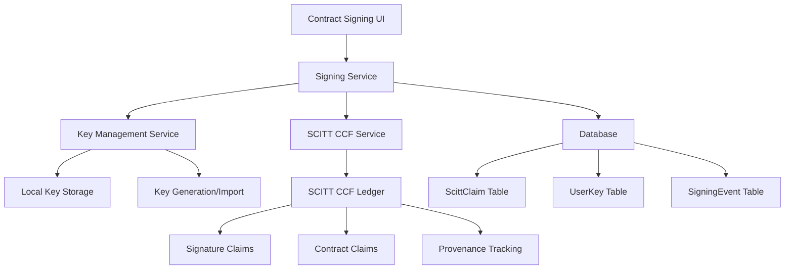

# Contract Signing with SCITT CCF Integration

## 🎯 Overview

This document explains how contract signing is integrated with the existing SCITT CCF (Supply Chain Integrity, Transparency, and Trust - Confidential Computing Framework) ledger system. Contract signatures are stored as immutable claims in the SCITT CCF ledger, providing cryptographic proof of signing alongside the contract itself.

## 🏗️ Architecture

### SCITT CCF Integration



### Key Components

1. **SCITT CCF Ledger**: Immutable storage for all contract signatures
2. **Signature Claims**: Each signature is stored as a `contract_signature` claim type
3. **Provenance Tracking**: Signatures are linked to contract provenance trees
4. **Local Database**: Tracking and fallback storage for claims
5. **Key Management**: Local storage of user signing keys

## 📝 Signature Storage Process

### 1. Signature Generation

When a user signs a contract:

1. **Generate Digital Signature**: Create cryptographic signature using user's private key
2. **Create SCITT CCF Claim**: Package signature as a `contract_signature` claim
3. **Submit to SCITT CCF**: Store signature claim in the immutable ledger
4. **Store Locally**: Save claim metadata in local database for tracking
5. **Log Event**: Record signing event for audit purposes

### 2. SCITT CCF Claim Structure

```javascript
{
  type: 'contract_signature',
  data: {
    contractId: 'CONTRACT-12345',
    signer: 'TDC-abc123-def456',
    signerRole: 'TDC',
    signature: [/* signature bytes */],
    algorithm: 'ECDSA-P256',
    timestamp: 1641234567890,
    contractHash: 'sha256-hash-of-contract',
    metadata: {
      system: 'Contract Management System',
      version: '1.0.0',
      teeProvider: 'virtual'
    }
  }
}
```

### 3. Database Schema

The system uses the existing `scitt_claims` table:

```sql
CREATE TABLE scitt_claims (
  id SERIAL PRIMARY KEY,
  claim_id VARCHAR(255) UNIQUE NOT NULL,
  contract_id VARCHAR(255) NOT NULL,
  claim_type VARCHAR(100) NOT NULL, -- 'contract_signature'
  claim_data JSONB NOT NULL,
  receipt TEXT,
  status VARCHAR(50) DEFAULT 'PENDING',
  provenance_tree_id VARCHAR(255),
  provenance_root VARCHAR(255),
  created_at TIMESTAMP DEFAULT CURRENT_TIMESTAMP,
  updated_at TIMESTAMP DEFAULT CURRENT_TIMESTAMP
);
```

## 🔐 Security Features

### 1. Cryptographic Security

- **Digital Signatures**: ECDSA-P256 or RSA-2048/4096
- **Hash Verification**: SHA-256 contract hashing
- **Key Management**: Secure local key storage with encryption
- **Non-repudiation**: Cryptographic proof of signing

### 2. SCITT CCF Security

- **Immutable Storage**: Signatures cannot be modified once stored
- **TEE Integration**: Hardware-level security through Trusted Execution Environments
- **Provenance Tracking**: Complete audit trail of signature creation
- **Receipt Verification**: Cryptographic receipts for signature verification

### 3. Access Control

- **Role-Based Signing**: Only authorized parties can sign contracts
- **Key Authentication**: Users must authenticate to access signing keys
- **Audit Logging**: All signing activities are logged
- **Authorization Checks**: Verify user permissions before signing

## 🔄 Signature Verification

### 1. Cryptographic Verification

```javascript
// Verify signature cryptographically
const cryptographicValid = await keyManagementService.verifySignature(
  contractHash,
  signatureData.signature,
  publicKey,
  signatureData.algorithm
);
```

### 2. SCITT CCF Verification

```javascript
// Verify signature exists in SCITT CCF ledger
const scittVerification = await scittCcfService.getClaim(scittClaimId);
const scittValid = scittVerification && scittVerification.status === 'verified';
```

### 3. Combined Verification

```javascript
// Overall verification result
const overallValid = cryptographicValid && scittValid;
```

## 📊 Benefits of SCITT CCF Integration

### 1. Immutable Proof

- **Tamper-Proof**: Signatures cannot be modified once stored
- **Cryptographic Receipts**: Verifiable proof of signature existence
- **Audit Trail**: Complete history of all signatures
- **Legal Compliance**: Meets e-signature legal requirements

### 2. Performance

- **High Throughput**: 10-100x faster than traditional blockchain
- **Low Latency**: Sub-second signature storage
- **Scalability**: Enterprise-grade performance
- **Efficiency**: Optimized for high-volume operations

### 3. Security

- **TEE Integration**: Hardware-level security
- **Confidential Computing**: Secure execution environment
- **Provenance Tracking**: Complete data lineage
- **Standards Compliance**: IETF SCITT working group standards

### 4. Integration

- **Existing Infrastructure**: Uses current SCITT CCF setup
- **Consistent Storage**: All contract data in one ledger
- **Unified API**: Single interface for all operations
- **Provenance Linking**: Signatures linked to contract provenance

## 🚀 Implementation Status

### ✅ Completed

- [x] SCITT CCF service integration
- [x] Signature claim structure definition
- [x] Database schema updates
- [x] API endpoints for signing
- [x] Signature verification logic
- [x] Key management service
- [x] Frontend signing components

### 🔄 In Progress

- [ ] SCITT CCF signature verification methods
- [ ] Enhanced error handling
- [ ] Performance optimization
- [ ] Security hardening

### 📋 Pending

- [ ] Hardware security module integration
- [ ] Advanced TEE features
- [ ] Compliance reporting
- [ ] Performance monitoring

## 🔧 API Endpoints

### Sign Contract

```http
POST /api/signing/sign
Content-Type: application/json

{
  "contractId": "CONTRACT-12345",
  "keyId": "KEY-abc123",
  "signatureData": {
    "contractHash": "sha256-hash"
  }
}
```

### Verify Signature

```http
POST /api/signing/verify
Content-Type: application/json

{
  "scittClaimId": "CLAIM-12345",
  "contractId": "CONTRACT-12345"
}
```

### Get Contract Signatures

```http
GET /api/signing/contracts/:contractId/signatures
```

## 📚 Usage Examples

### 1. Sign a Contract

```javascript
// Frontend signing process
const signContract = async (contractId, keyId) => {
  const signatureData = {
    contractHash: await generateContractHash(contractId)
  };
  
  const response = await apiService.signContract({
    contractId,
    keyId,
    signatureData
  });
  
  return response.signature;
};
```

### 2. Verify Signatures

```javascript
// Verify all signatures for a contract
const verifyContractSignatures = async (contractId) => {
  const signatures = await apiService.getContractSignatures(contractId);
  
  const verificationResults = await Promise.all(
    signatures.map(sig => 
      apiService.verifySignature({
        scittClaimId: sig.scittClaimId,
        contractId
      })
    )
  );
  
  return verificationResults;
};
```

## 🔍 Monitoring and Auditing

### 1. Signature Tracking

- **Claim Status**: Track signature claim status in SCITT CCF
- **Verification Status**: Monitor signature verification results
- **Error Logging**: Log all signing and verification errors
- **Performance Metrics**: Track signing and verification performance

### 2. Audit Reports

- **Signing History**: Complete history of all signatures
- **User Activity**: Track user signing activities
- **System Health**: Monitor SCITT CCF and signing service health
- **Compliance Reports**: Generate reports for legal compliance

## 🎯 Next Steps

1. **Complete SCITT CCF Integration**: Finish signature verification methods
2. **Enhance Security**: Add hardware security module support
3. **Performance Optimization**: Optimize for high-volume signing
4. **Compliance Features**: Add legal compliance reporting
5. **Monitoring**: Implement comprehensive monitoring and alerting

---

**Document Version**: 1.0  
**Last Updated**: 2024-01-XX  
**Owner**: Development Team  
**Stakeholders**: Product, Security, Legal, Engineering
