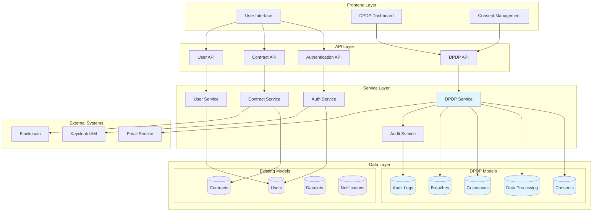
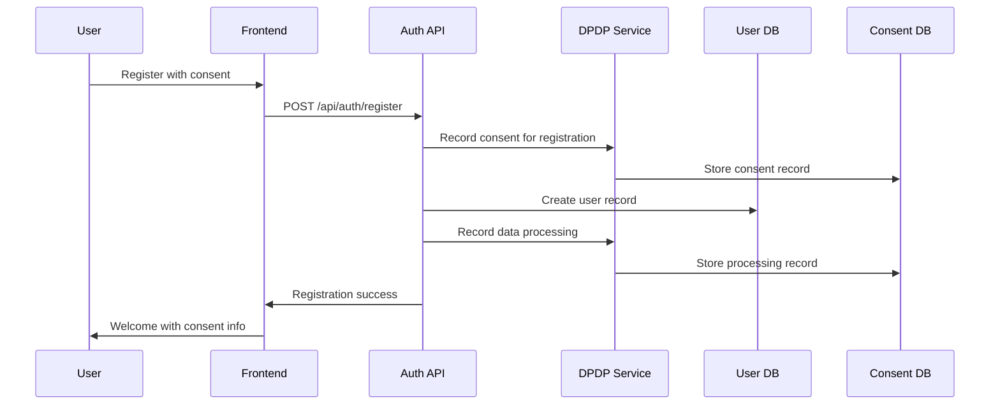
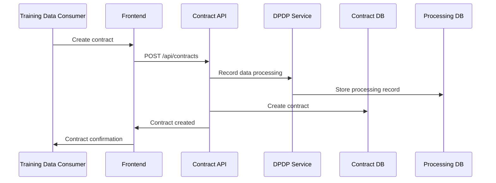
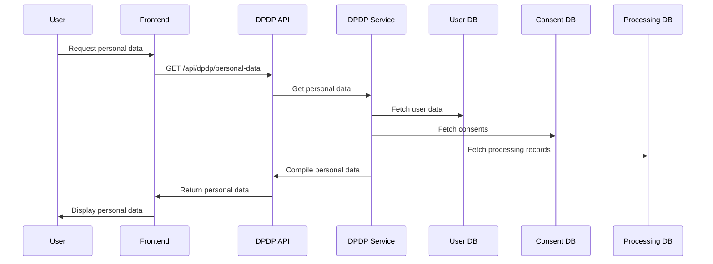

# DPDP Integration with Contract Management System

## Overview

The DPDP (Digital Personal Data Protection) Act 2023 implementation integrates seamlessly with your existing Contract Management System, adding comprehensive data protection compliance without disrupting current functionality. This document explains the integration architecture, data flows, and implementation details.

## Architecture Integration

## Data Flow Integration

### 1. User Registration Flow with DPDP

### 2. Contract Creation with Data Processing Tracking

### 3. Data Access Request Flow

## Integration Points

### 1. User Model Integration

The existing User model has been enhanced with DPDP-related fields to track consent versions, data retention preferences, marketing consent status, and the last time consent was updated. These fields are automatically populated during user registration and can be updated through the DPDP dashboard.

### 2. Contract Model Integration

Contracts now include additional fields to track data processing activities, including consent status for data processing, retention periods for contract data, and the specific purpose for which data is being processed. This ensures full compliance with DPDP requirements for contract-related data handling.

### 3. API Integration Points

#### Authentication API Integration

The registration process has been enhanced to automatically record user consent for data processing during account creation. The system captures explicit consent for personal information, contact details, and professional information. It also logs the data processing activity for audit purposes and sends a welcome email with privacy information.

#### Contract API Integration

When contracts are created, the system automatically records data processing activities for all parties involved. This includes tracking what data is being processed, the legal basis for processing, and the retention period for contract-related data. This ensures compliance with DPDP requirements for contract execution.

## Database Schema Integration

### New DPDP Tables

The system includes several new database tables to support DPDP compliance:

**Consent Management Table**: Stores all user consents with detailed information including the purpose of data processing, types of data being processed, consent type (explicit or implicit), consent text, timestamps for when consent was granted or withdrawn, and metadata about how consent was obtained.

**Data Processing Records Table**: Logs every data processing activity in the system, including the processing activity name, purpose, data types involved, legal basis for processing, associated consent records, processing timestamps, and retention periods.

**Grievance Management Table**: Handles user complaints and requests related to their data rights, including the type of grievance, description, status tracking, submission and resolution timestamps, and resolution details.

**Data Breach Records Table**: Tracks security incidents and data breaches, including incident type, description, number of affected users, severity level, discovery and reporting timestamps, and resolution status.

**Audit Logs Table**: Provides a complete audit trail for all DPDP-related activities, including event types, user information, event data, IP addresses, user agents, and timestamps.

### Enhanced Existing Tables

The Users table has been enhanced with DPDP-specific fields including consent version tracking, data retention consent status, marketing consent preferences, and timestamps for consent updates.

The Contracts table now includes fields for data processing consent, retention periods, and processing purposes to ensure compliance with DPDP requirements for contract-related data handling.

## Frontend Integration

### 1. Consent Management UI

The frontend includes a comprehensive consent management interface where users can view all their active consents, see when they were granted, understand what data is being processed, and withdraw consent for specific purposes. The interface provides clear information about the implications of withdrawing consent and guides users through the process.

### 2. Personal Data Dashboard

Users have access to a personal data dashboard that shows all their personal information stored in the system, including basic information, professional details, technical data, active consents, and data processing records. Users can request data corrections, export their data, and understand how their information is being used.

## Service Integration

### 1. DPDP Service Integration

The DPDP service integrates seamlessly with existing services to ensure compliance throughout the system. During user registration, it automatically records consent and data processing activities. For contract creation, it tracks data processing for all parties involved and ensures proper consent management.

### 2. Audit Service Integration

The audit service provides comprehensive logging for all DPDP-related activities, including user actions, contract operations, consent changes, and data access requests. This creates a complete audit trail for compliance reporting and security monitoring.

## Compliance Monitoring

### 1. Automated Compliance Checks

The system includes automated monitoring tools that check for users without required consents, identify data that exceeds retention periods, and generate comprehensive compliance reports. These checks run on scheduled intervals and automatically notify designated personnel of any compliance issues.

### 2. Real-time Monitoring

Real-time monitoring systems track consent compliance daily and data retention compliance weekly. The system automatically alerts designated personnel when compliance issues are detected, ensuring prompt resolution of any problems.

## Security Integration

### 1. Enhanced Data Protection

The system implements additional encryption for personal data using industry-standard algorithms. All personal data is encrypted at rest and in transit, with secure key management and access controls to protect sensitive information.

### 2. Access Control Integration

Enhanced access controls ensure that users can only access their own personal data. All DPDP data access is logged with detailed information including timestamps, IP addresses, and user agents for security monitoring and audit purposes.

## Testing Integration

### 1. DPDP Test Suite

The system includes comprehensive test suites that verify DPDP compliance throughout the application. Tests ensure that user registration properly records consent, contract creation tracks data processing, and personal data access is properly logged and secured.

## Deployment Integration

### 1. Environment Configuration

The system includes DPDP-specific environment variables for configuration, including retention periods, breach notification settings, compliance reporting options, audit logging preferences, and data encryption settings.

### 2. Database Migration

Comprehensive database migrations handle the creation of new DPDP tables and the enhancement of existing tables with DPDP-related fields. The migrations are designed to be safe for production environments and include rollback capabilities.

## Summary

The DPDP integration with your Contract Management System provides:

1. **Seamless Integration**: DPDP compliance is built into existing workflows without disrupting functionality
2. **Comprehensive Coverage**: All data processing activities are tracked and logged
3. **User Empowerment**: Users have full control over their personal data
4. **Compliance Monitoring**: Automated checks ensure ongoing compliance
5. **Security Enhancement**: Additional encryption and access controls
6. **Audit Trail**: Complete audit logging for compliance reporting

The integration maintains backward compatibility while adding robust data protection capabilities required by the DPDP Act 2023. 