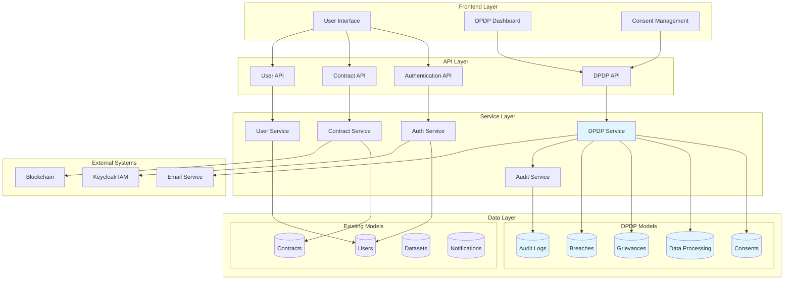
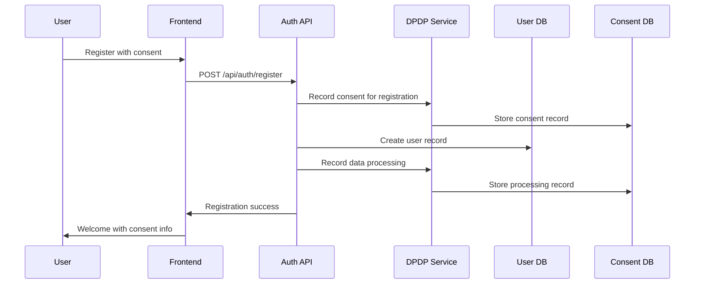
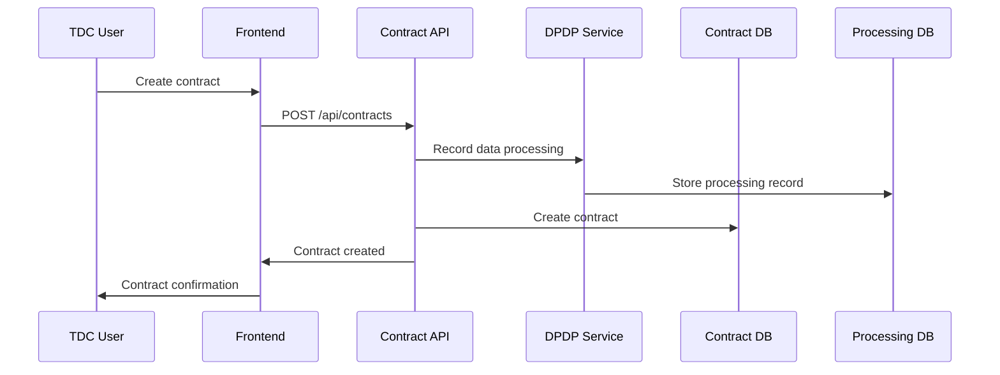
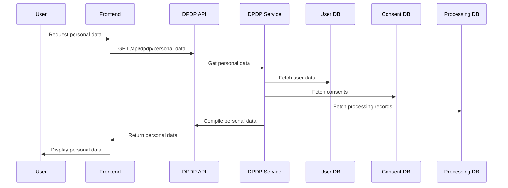

# DPDP Integration with Contract Management System

## Overview

The DPDP (Digital Personal Data Protection) Act 2023 implementation integrates seamlessly with your existing Contract Management System, adding comprehensive data protection compliance without disrupting current functionality. This document explains the integration architecture, data flows, and implementation details.

## Architecture Integration



## Data Flow Integration

### 1. User Registration Flow with DPDP



### 2. Contract Creation with Data Processing Tracking



### 3. Data Access Request Flow



## Integration Points

### 1. User Model Integration

The existing User model has been enhanced with DPDP-related fields:

```javascript
// Existing User model with DPDP additions
const User = sequelize.define('User', {
  // ... existing fields ...
  
  // DPDP Compliance Fields
  dpdpConsentVersion: {
    type: DataTypes.STRING,
    defaultValue: '1.0'
  },
  
  dataRetentionConsent: {
    type: DataTypes.BOOLEAN,
    defaultValue: false
  },
  
  marketingConsent: {
    type: DataTypes.BOOLEAN,
    defaultValue: false
  },
  
  lastConsentUpdate: {
    type: DataTypes.DATE,
    allowNull: true
  }
});
```

### 2. Contract Model Integration

Contracts now track data processing activities:

```javascript
// Contract model with DPDP tracking
const Contract = sequelize.define('Contract', {
  // ... existing fields ...
  
  // DPDP Compliance Fields
  dataProcessingConsent: {
    type: DataTypes.BOOLEAN,
    defaultValue: false
  },
  
  dataRetentionPeriod: {
    type: DataTypes.INTEGER, // Days
    defaultValue: 2555 // 7 years default
  },
  
  dataProcessingPurpose: {
    type: DataTypes.STRING,
    defaultValue: 'CONTRACT_EXECUTION'
  }
});
```

### 3. API Integration Points

#### Authentication API Integration

```javascript
// Enhanced registration with DPDP consent
router.post('/register', async (req, res) => {
  try {
    // ... existing registration logic ...
    
    // DPDP Integration
    const dpdpService = new DPDPService();
    
    // Record consent for registration
    await dpdpService.recordConsent(
      user.id,
      'USER_REGISTRATION',
      ['PERSONAL_INFO', 'CONTACT_INFO', 'PROFESSIONAL_INFO'],
      'EXPLICIT',
      req
    );
    
    // Record data processing
    await dpdpService.recordDataProcessing(
      user.id,
      'USER_REGISTRATION',
      'USER_REGISTRATION',
      ['PERSONAL_INFO', 'CONTACT_INFO', 'PROFESSIONAL_INFO'],
      'CONSENT',
      consent.id
    );
    
    // ... rest of registration logic ...
  } catch (error) {
    // ... error handling ...
  }
});
```

#### Contract API Integration

```javascript
// Enhanced contract creation with DPDP tracking
router.post('/', async (req, res) => {
  try {
    // ... existing contract creation logic ...
    
    // DPDP Integration
    const dpdpService = new DPDPService();
    
    // Record data processing for contract creation
    await dpdpService.recordDataProcessing(
      req.user.id,
      'CONTRACT_CREATION',
      'CONTRACT_EXECUTION',
      ['CONTRACT_DATA', 'PARTY_INFORMATION', 'DATASET_METADATA'],
      'CONTRACT_PERFORMANCE',
      null
    );
    
    // ... rest of contract creation logic ...
  } catch (error) {
    // ... error handling ...
  }
});
```

## Database Schema Integration

### New DPDP Tables

```sql
-- Consent Management
CREATE TABLE consents (
  id INT PRIMARY KEY AUTO_INCREMENT,
  userId INT NOT NULL,
  purpose VARCHAR(100) NOT NULL,
  dataTypes JSON NOT NULL,
  consentType ENUM('EXPLICIT', 'IMPLICIT') DEFAULT 'EXPLICIT',
  consentText TEXT NOT NULL,
  grantedAt TIMESTAMP DEFAULT CURRENT_TIMESTAMP,
  withdrawnAt TIMESTAMP NULL,
  isActive BOOLEAN DEFAULT TRUE,
  version VARCHAR(10) DEFAULT '1.0',
  withdrawalMethod VARCHAR(50),
  ipAddress VARCHAR(45),
  userAgent TEXT,
  FOREIGN KEY (userId) REFERENCES users(id)
);

-- Data Processing Records
CREATE TABLE data_processing_records (
  id INT PRIMARY KEY AUTO_INCREMENT,
  userId INT NOT NULL,
  processingActivity VARCHAR(100) NOT NULL,
  purpose VARCHAR(100) NOT NULL,
  dataTypes JSON NOT NULL,
  legalBasis ENUM('CONSENT', 'CONTRACT_PERFORMANCE', 'LEGAL_OBLIGATION', 'LEGITIMATE_INTEREST') NOT NULL,
  consentId INT NULL,
  processedAt TIMESTAMP DEFAULT CURRENT_TIMESTAMP,
  retentionPeriod INT DEFAULT 2555,
  FOREIGN KEY (userId) REFERENCES users(id),
  FOREIGN KEY (consentId) REFERENCES consents(id)
);

-- Grievance Management
CREATE TABLE grievances (
  id INT PRIMARY KEY AUTO_INCREMENT,
  userId INT NOT NULL,
  grievanceType ENUM('CONSENT', 'DATA_ACCESS', 'DATA_CORRECTION', 'DATA_ERASURE', 'DATA_PORTABILITY', 'BREACH') NOT NULL,
  description TEXT NOT NULL,
  status ENUM('PENDING', 'IN_PROGRESS', 'RESOLVED', 'REJECTED') DEFAULT 'PENDING',
  submittedAt TIMESTAMP DEFAULT CURRENT_TIMESTAMP,
  resolvedAt TIMESTAMP NULL,
  resolution TEXT NULL,
  FOREIGN KEY (userId) REFERENCES users(id)
);

-- Data Breach Records
CREATE TABLE data_breaches (
  id INT PRIMARY KEY AUTO_INCREMENT,
  incidentType ENUM('UNAUTHORIZED_ACCESS', 'DATA_LOSS', 'SYSTEM_BREACH', 'PHISHING') NOT NULL,
  description TEXT NOT NULL,
  affectedUsers INT DEFAULT 0,
  severity ENUM('LOW', 'MEDIUM', 'HIGH', 'CRITICAL') NOT NULL,
  discoveredAt TIMESTAMP DEFAULT CURRENT_TIMESTAMP,
  reportedAt TIMESTAMP NULL,
  resolvedAt TIMESTAMP NULL,
  status ENUM('DISCOVERED', 'INVESTIGATING', 'REPORTED', 'RESOLVED') DEFAULT 'DISCOVERED'
);

-- Audit Logs
CREATE TABLE audit_logs (
  id INT PRIMARY KEY AUTO_INCREMENT,
  eventType VARCHAR(100) NOT NULL,
  userId INT NULL,
  eventData JSON NOT NULL,
  ipAddress VARCHAR(45),
  userAgent TEXT,
  timestamp TIMESTAMP DEFAULT CURRENT_TIMESTAMP,
  FOREIGN KEY (userId) REFERENCES users(id)
);
```

### Enhanced Existing Tables

```sql
-- Enhanced Users table
ALTER TABLE users ADD COLUMN dpdpConsentVersion VARCHAR(10) DEFAULT '1.0';
ALTER TABLE users ADD COLUMN dataRetentionConsent BOOLEAN DEFAULT FALSE;
ALTER TABLE users ADD COLUMN marketingConsent BOOLEAN DEFAULT FALSE;
ALTER TABLE users ADD COLUMN lastConsentUpdate TIMESTAMP NULL;

-- Enhanced Contracts table
ALTER TABLE contracts ADD COLUMN dataProcessingConsent BOOLEAN DEFAULT FALSE;
ALTER TABLE contracts ADD COLUMN dataRetentionPeriod INT DEFAULT 2555;
ALTER TABLE contracts ADD COLUMN dataProcessingPurpose VARCHAR(100) DEFAULT 'CONTRACT_EXECUTION';
```

## Frontend Integration

### 1. Consent Management UI

```javascript
// Consent management component
const ConsentManagement = () => {
  const [consents, setConsents] = useState([]);
  const [loading, setLoading] = useState(false);

  useEffect(() => {
    fetchConsents();
  }, []);

  const fetchConsents = async () => {
    setLoading(true);
    try {
      const response = await apiService.get('/api/dpdp/consents');
      setConsents(response.data);
    } catch (error) {
      console.error('Error fetching consents:', error);
    } finally {
      setLoading(false);
    }
  };

  const withdrawConsent = async (purpose) => {
    try {
      await apiService.post(`/api/dpdp/consents/${purpose}/withdraw`);
      fetchConsents(); // Refresh list
    } catch (error) {
      console.error('Error withdrawing consent:', error);
    }
  };

  return (
    <div>
      <h2>Consent Management</h2>
      {consents.map(consent => (
        <ConsentCard
          key={consent.id}
          consent={consent}
          onWithdraw={() => withdrawConsent(consent.purpose)}
        />
      ))}
    </div>
  );
};
```

### 2. Personal Data Dashboard

```javascript
// Personal data dashboard component
const PersonalDataDashboard = () => {
  const [personalData, setPersonalData] = useState(null);
  const [loading, setLoading] = useState(false);

  const fetchPersonalData = async () => {
    setLoading(true);
    try {
      const response = await apiService.get('/api/dpdp/personal-data');
      setPersonalData(response.data);
    } catch (error) {
      console.error('Error fetching personal data:', error);
    } finally {
      setLoading(false);
    }
  };

  const exportData = async () => {
    try {
      const response = await apiService.get('/api/dpdp/export');
      // Handle data export
    } catch (error) {
      console.error('Error exporting data:', error);
    }
  };

  return (
    <div>
      <h2>Personal Data Dashboard</h2>
      <button onClick={fetchPersonalData}>Refresh Data</button>
      <button onClick={exportData}>Export Data</button>
      
      {personalData && (
        <div>
          <BasicInfo data={personalData.basicInfo} />
          <ProfessionalInfo data={personalData.professionalInfo} />
          <ConsentsList consents={personalData.consents} />
          <ProcessingRecords records={personalData.dataProcessing} />
        </div>
      )}
    </div>
  );
};
```

## Service Integration

### 1. DPDP Service Integration

The DPDP service integrates with existing services:

```javascript
class DPDPService {
  constructor() {
    this.auditService = require('./auditService');
    this.emailService = require('./emailService');
    this.userService = require('./userService');
    this.contractService = require('./contractService');
  }

  // Integrate with user registration
  async handleUserRegistration(userId, userData, req) {
    // Record consent
    await this.recordConsent(userId, 'USER_REGISTRATION', [
      'PERSONAL_INFO', 'CONTACT_INFO', 'PROFESSIONAL_INFO'
    ], 'EXPLICIT', req);

    // Record data processing
    await this.recordDataProcessing(userId, 'USER_REGISTRATION', 
      'USER_REGISTRATION', ['PERSONAL_INFO', 'CONTACT_INFO', 'PROFESSIONAL_INFO'], 
      'CONSENT');

    // Send welcome email with privacy notice
    await this.emailService.sendPrivacyNotice(userData.email);
  }

  // Integrate with contract creation
  async handleContractCreation(contractId, parties, req) {
    for (const party of parties) {
      await this.recordDataProcessing(party.userId, 'CONTRACT_CREATION',
        'CONTRACT_EXECUTION', ['CONTRACT_DATA', 'PARTY_INFORMATION'], 
        'CONTRACT_PERFORMANCE');
    }
  }
}
```

### 2. Audit Service Integration

```javascript
class AuditService {
  async logEvent(eventType, eventData) {
    await db.AuditLog.create({
      eventType,
      userId: eventData.userId || null,
      eventData: JSON.stringify(eventData),
      ipAddress: eventData.ipAddress,
      userAgent: eventData.userAgent,
      timestamp: new Date()
    });
  }

  // Integrate with existing operations
  async logUserAction(userId, action, details) {
    await this.logEvent('USER_ACTION', {
      userId,
      action,
      details,
      timestamp: new Date()
    });
  }

  async logContractAction(contractId, action, userId, details) {
    await this.logEvent('CONTRACT_ACTION', {
      contractId,
      action,
      userId,
      details,
      timestamp: new Date()
    });
  }
}
```

## Compliance Monitoring

### 1. Automated Compliance Checks

```javascript
class ComplianceMonitor {
  async checkConsentCompliance() {
    // Check for users without required consents
    const usersWithoutConsent = await db.User.findAll({
      include: [{
        model: db.Consent,
        where: { purpose: 'USER_REGISTRATION', isActive: true },
        required: false
      }],
      where: {
        '$Consents.id$': null
      }
    });

    return usersWithoutConsent;
  }

  async checkDataRetentionCompliance() {
    // Check for data exceeding retention periods
    const expiredData = await db.DataProcessingRecord.findAll({
      where: {
        processedAt: {
          [Op.lt]: new Date(Date.now() - (2555 * 24 * 60 * 60 * 1000)) // 7 years
        }
      }
    });

    return expiredData;
  }

  async generateComplianceReport() {
    const report = {
      totalUsers: await db.User.count(),
      usersWithConsent: await db.Consent.count({ where: { isActive: true } }),
      activeContracts: await db.Contract.count({ where: { status: 'ACTIVE' } }),
      pendingGrievances: await db.Grievance.count({ where: { status: 'PENDING' } }),
      dataBreaches: await db.DataBreach.count({ where: { status: 'DISCOVERED' } })
    };

    return report;
  }
}
```

### 2. Real-time Monitoring

```javascript
// Real-time compliance monitoring
const monitorCompliance = async () => {
  const monitor = new ComplianceMonitor();
  
  // Check consent compliance daily
  setInterval(async () => {
    const nonCompliantUsers = await monitor.checkConsentCompliance();
    if (nonCompliantUsers.length > 0) {
      await notifyDPO('CONSENT_COMPLIANCE_ALERT', {
        count: nonCompliantUsers.length,
        users: nonCompliantUsers.map(u => u.id)
      });
    }
  }, 24 * 60 * 60 * 1000); // Daily

  // Check data retention weekly
  setInterval(async () => {
    const expiredData = await monitor.checkDataRetentionCompliance();
    if (expiredData.length > 0) {
      await notifyDPO('RETENTION_COMPLIANCE_ALERT', {
        count: expiredData.length,
        records: expiredData.map(r => r.id)
      });
    }
  }, 7 * 24 * 60 * 60 * 1000); // Weekly
};
```

## Security Integration

### 1. Data Encryption

```javascript
// Enhanced data encryption for DPDP compliance
class DataEncryption {
  static encryptPersonalData(data) {
    const algorithm = 'aes-256-gcm';
    const key = crypto.scryptSync(process.env.ENCRYPTION_KEY, 'salt', 32);
    const iv = crypto.randomBytes(16);
    
    const cipher = crypto.createCipher(algorithm, key);
    let encrypted = cipher.update(JSON.stringify(data), 'utf8', 'hex');
    encrypted += cipher.final('hex');
    
    return {
      encrypted,
      iv: iv.toString('hex'),
      tag: cipher.getAuthTag().toString('hex')
    };
  }

  static decryptPersonalData(encryptedData) {
    const algorithm = 'aes-256-gcm';
    const key = crypto.scryptSync(process.env.ENCRYPTION_KEY, 'salt', 32);
    const iv = Buffer.from(encryptedData.iv, 'hex');
    const tag = Buffer.from(encryptedData.tag, 'hex');
    
    const decipher = crypto.createDecipher(algorithm, key);
    decipher.setAuthTag(tag);
    
    let decrypted = decipher.update(encryptedData.encrypted, 'hex', 'utf8');
    decrypted += decipher.final('utf8');
    
    return JSON.parse(decrypted);
  }
}
```

### 2. Access Control Integration

```javascript
// Enhanced access control for DPDP data
const dpdpAccessControl = (req, res, next) => {
  // Only allow users to access their own data
  if (req.params.userId && req.params.userId !== req.user.id) {
    return res.status(403).json({
      error: 'Access denied',
      code: 'ACCESS_DENIED'
    });
  }

  // Log all DPDP data access
  req.dpdpAccess = {
    timestamp: new Date(),
    ipAddress: req.ip,
    userAgent: req.get('User-Agent'),
    endpoint: req.originalUrl
  };

  next();
};
```

## Testing Integration

### 1. DPDP Test Suite

```javascript
// DPDP integration tests
describe('DPDP Integration Tests', () => {
  test('User registration should record consent', async () => {
    const userData = {
      name: 'Test User',
      email: 'test@example.com',
      partyType: 'TDC'
    };

    const response = await request(app)
      .post('/api/auth/register')
      .send(userData);

    expect(response.status).toBe(201);

    // Check consent was recorded
    const consents = await db.Consent.findAll({
      where: { userId: response.body.user.id }
    });

    expect(consents).toHaveLength(1);
    expect(consents[0].purpose).toBe('USER_REGISTRATION');
  });

  test('Contract creation should record data processing', async () => {
    // ... test implementation
  });

  test('Personal data access should be logged', async () => {
    // ... test implementation
  });
});
```

## Deployment Integration

### 1. Environment Configuration

```bash
# DPDP-specific environment variables
DPDP_ENABLED=true
DPDP_RETENTION_PERIOD=2555
DPDP_BREACH_NOTIFICATION_EMAIL=dpo@company.com
DPDP_COMPLIANCE_REPORTING_ENABLED=true
DPDP_AUDIT_LOGGING_ENABLED=true
DPDP_DATA_ENCRYPTION_ENABLED=true
```

### 2. Database Migration

```javascript
// DPDP database migration
module.exports = {
  up: async (queryInterface, Sequelize) => {
    // Create DPDP tables
    await queryInterface.createTable('consents', {
      // ... table definition
    });

    await queryInterface.createTable('data_processing_records', {
      // ... table definition
    });

    // Add DPDP columns to existing tables
    await queryInterface.addColumn('users', 'dpdpConsentVersion', {
      type: Sequelize.STRING(10),
      defaultValue: '1.0'
    });

    // ... other migrations
  },

  down: async (queryInterface, Sequelize) => {
    // Rollback migrations
    await queryInterface.dropTable('consents');
    await queryInterface.dropTable('data_processing_records');
    await queryInterface.removeColumn('users', 'dpdpConsentVersion');
  }
};
```

## Summary

The DPDP integration with your Contract Management System provides:

1. **Seamless Integration**: DPDP compliance is built into existing workflows without disrupting functionality
2. **Comprehensive Coverage**: All data processing activities are tracked and logged
3. **User Empowerment**: Users have full control over their personal data
4. **Compliance Monitoring**: Automated checks ensure ongoing compliance
5. **Security Enhancement**: Additional encryption and access controls
6. **Audit Trail**: Complete audit logging for compliance reporting

The integration maintains backward compatibility while adding robust data protection capabilities required by the DPDP Act 2023. 