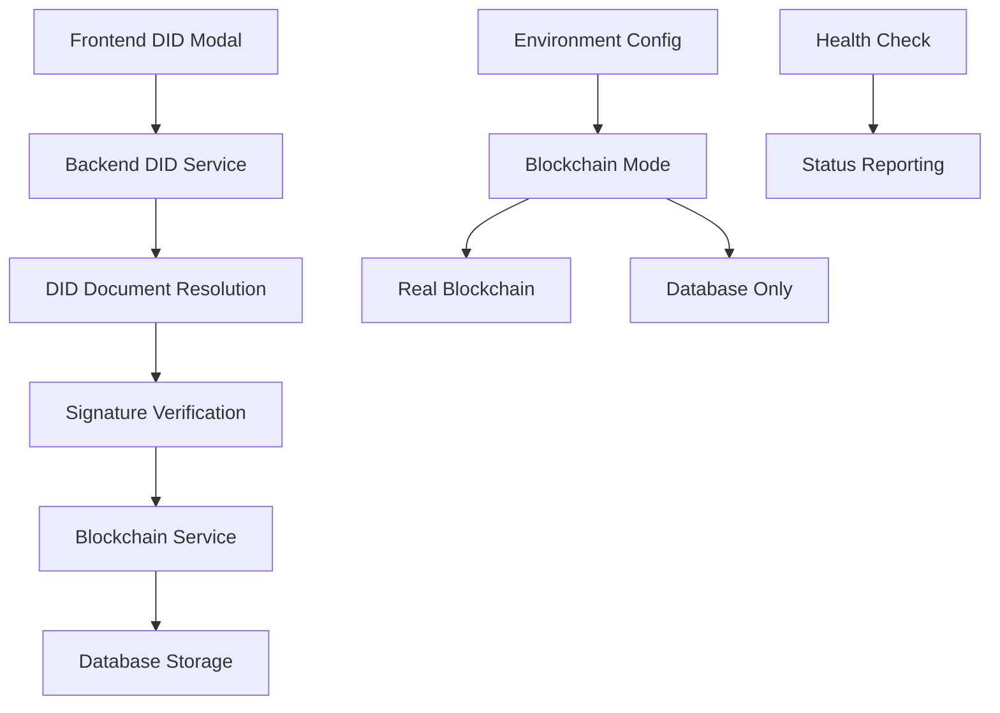

# Enhanced DID Signing Implementation Guide

## Overview

The Contract Management System now supports enhanced Decentralized Identifier (DID) based contract signing with cryptographic verification. This implementation provides secure, verifiable contract signatures using DIDs hosted on web servers (did:web), public key DIDs (did:key), and Ethereum-based DIDs (did:ethr).

## Key Features

### 1. Multi-Method DID Support
- **did:web**: Web-hosted DID documents (e.g., GitHub Pages)
- **did:key**: Public key-based DIDs
- **did:ethr**: Ethereum-based DIDs

### 2. Cryptographic Signature Verification
- Ed25519 signature verification
- ECDSA signature verification
- RSA signature verification
- Message integrity validation

### 3. Flexible Blockchain Mode
- **BLOCKCHAIN_ENABLED**: Real blockchain with fallback to database
- **DATABASE_ONLY**: Database-only mode with mock results
- Configurable via environment variables

### 4. Enhanced Security
- Timestamp-based message construction
- DID document validation
- Multiple verification method support
- Health monitoring and status reporting

## Architecture



## Backend Implementation

### DID Service (`backend/services/didService.js`)

The enhanced DID service provides comprehensive DID resolution and signature verification:

```javascript
/**
 * Enhanced DID (Decentralized Identifier) Service
 * 
 * This service provides comprehensive DID resolution, validation, and signature verification
 * for the Contract Management System. It supports multiple DID methods including did:web,
 * did:key, and did:ethr with cryptographic signature verification.
 * 
 * Key Features:
 * - DID document resolution from web servers
 * - Cryptographic signature verification (Ed25519, ECDSA, RSA)
 * - Message construction with timestamp-based security
 * - Health monitoring and status reporting
 * - Support for multiple verification methods
 */
```

#### Key Methods

1. **resolveDID(did)**: Resolves any supported DID to its document
2. **resolveWebDID(did)**: Fetches DID documents from web servers
3. **verifySignature(did, message, signature)**: Verifies cryptographic signatures
4. **getHealthStatus()**: Returns service health and status information

### Blockchain Service (`backend/services/blockchainService.js`)

The enhanced blockchain service supports flexible operation modes:

```javascript
/**
 * Enhanced Blockchain Service with Flexible Mode Support
 * 
 * This service provides blockchain integration for the Contract Management System
 * with the ability to operate in multiple modes:
 * 
 * - BLOCKCHAIN_ENABLED: Uses real blockchain when available, falls back to database
 * - DATABASE_ONLY: Operates entirely in database mode with mock blockchain results
 */
```

#### Operating Modes

1. **BLOCKCHAIN_ENABLED**: Attempts to use real blockchain, falls back to database
2. **DATABASE_ONLY**: Uses database-only mode with mock results

#### Configuration

Set environment variables to control blockchain behavior:

```bash
# Enable/disable blockchain mode
BLOCKCHAIN_ENABLED=true

# Blockchain node URL
BLOCKCHAIN_URL=http://localhost:8545

# Contract address
CONTRACT_ADDRESS=0x5FbDB2315678afecb367f032d93F642f64180aa3
```

## Frontend Implementation

### DID Signing Modal (`frontend/src/components/DIDSigningModal.js`)

The DID signing modal provides a user-friendly interface for DID-based contract signing:

```javascript
/**
 * DID Signing Modal Component
 * 
 * This component provides a user-friendly interface for DID-based contract signing.
 * It allows users to sign contracts using their Decentralized Identifiers (DIDs)
 * with cryptographic signature verification.
 * 
 * Features:
 * - DID document display and validation
 * - Automatic signing message construction
 * - Test signature generation for development
 * - Copy-to-clipboard functionality
 * - Real-time error handling and feedback
 */
```

#### Key Features

1. **Automatic Message Generation**: Creates timestamp-based signing messages
2. **DID Document Display**: Shows user's DID information
3. **Test Signature Generation**: Provides test signatures for development
4. **Copy-to-Clipboard**: Easy copying of messages and signatures
5. **Real-time Validation**: Immediate feedback on user actions

## API Endpoints

### Contract Signing

**POST** `/api/contracts/:contractId/sign`

Enhanced to support DID-based signing:

```json
{
  "signatureType": "DID",
  "did": "did:web:mukeshjoshidpi.github.io",
  "signature": "0x1234567890abcdef...",
  "message": "Sign contract CONTRACT-123 as TDP at 2024-01-01T00:00:00.000Z"
}
```

### Blockchain Health Check

**GET** `/api/blockchain/health`

Returns blockchain service status:

```json
{
  "status": "healthy",
  "mode": "BLOCKCHAIN_ENABLED",
  "blockchainAvailable": true,
  "blockchainEnabled": true,
  "contractAddress": "0x5FbDB2315678afecb367f032d93F642f64180aa3",
  "lastBlock": 12345
}
```

## Configuration

### Environment Variables

```bash
# Blockchain Configuration
BLOCKCHAIN_ENABLED=true
BLOCKCHAIN_URL=http://localhost:8545
CONTRACT_ADDRESS=0x5FbDB2315678afecb367f032d93F642f64180aa3

# DID Configuration
DID_RESOLUTION_TIMEOUT=10000
DID_VERIFICATION_ENABLED=true

# Security
JWT_SECRET=your_jwt_secret_here
SESSION_SECRET=your_session_secret_here
```

### Blockchain Mode Toggle

Use the provided script to toggle blockchain mode:

```bash
# Enable blockchain mode
node scripts/toggle-blockchain.js enable

# Disable blockchain mode
node scripts/toggle-blockchain.js disable

# Check current status
node scripts/toggle-blockchain.js status
```

## Testing

### Test Scripts

1. **Enhanced DID Signing Test** (`test-enhanced-did-signing.js`)
   - Tests DID resolution and signature verification
   - Validates multiple DID methods
   - Checks error handling

2. **Blockchain Fallback Test** (`test-blockchain-fallback.js`)
   - Tests blockchain mode switching
   - Validates fallback behavior
   - Checks mock result generation

3. **Complete Functionality Test** (`test-complete-functionality.js`)
   - End-to-end contract signing flow
   - DID-based signature verification
   - Blockchain integration testing

### Running Tests

```bash
# Run all enhanced tests
node test-enhanced-did-signing.js
node test-blockchain-fallback.js
node test-complete-functionality.js

# Run specific test scenarios
node test-enhanced-did-signing.js --method=did:web
node test-blockchain-fallback.js --mode=database-only
```

## Security Considerations

### DID Document Security

1. **HTTPS Only**: DID documents must be served over HTTPS
2. **Content Validation**: Documents are validated for structure and integrity
3. **Timeout Protection**: Requests timeout after 10 seconds
4. **Error Handling**: Graceful handling of resolution failures

### Signature Security

1. **Timestamp Validation**: Messages include timestamps to prevent replay attacks
2. **Message Integrity**: Cryptographic verification ensures message authenticity
3. **Multiple Algorithms**: Support for various cryptographic algorithms
4. **Verification Method Selection**: Flexible verification method selection

### Blockchain Security

1. **Private Key Protection**: Private keys are stored securely
2. **Transaction Validation**: All transactions are validated before submission
3. **Fallback Security**: Database-only mode maintains security standards
4. **Health Monitoring**: Continuous monitoring of blockchain availability

## Usage Examples

### 1. DID-Based Contract Signing

```javascript
// Frontend: Generate signing message
const message = `Sign contract ${contractId} as ${userRole} at ${timestamp}`;

// Frontend: User provides signature
const signature = await userWallet.signMessage(message);

// Backend: Verify signature
const isValid = await didService.verifySignature(did, message, signature);

// Backend: Update contract if valid
if (isValid) {
  await contractService.signContract(contractId, userId, 'DID', signature);
}
```

### 2. Blockchain Mode Switching

```javascript
// Check current mode
const health = await fetch('/api/blockchain/health');
const { mode } = await health.json();

// Toggle mode via script
const { exec } = require('child_process');
exec('node scripts/toggle-blockchain.js disable', (error, stdout, stderr) => {
  console.log('Blockchain mode disabled');
});
```

### 3. DID Document Resolution

```javascript
// Resolve a did:web DID
const didDocument = await didService.resolveDID('did:web:mukeshjoshidpi.github.io');

// Access verification methods
const verificationMethods = didDocument.verificationMethod;
console.log('Available verification methods:', verificationMethods);
```

## Troubleshooting

### Common Issues

1. **DID Resolution Fails**
   - Check if DID document is accessible via HTTPS
   - Verify document structure and format
   - Check network connectivity

2. **Blockchain Connection Issues**
   - Verify blockchain node is running
   - Check contract address configuration
   - Review private key configuration

3. **Signature Verification Fails**
   - Ensure correct message format
   - Verify signature algorithm compatibility
   - Check DID document verification methods

### Debug Mode

Enable debug logging by setting environment variables:

```bash
DEBUG=true
LOG_LEVEL=debug
```

### Health Checks

Use the health check endpoints to diagnose issues:

```bash
# Check DID service health
curl http://localhost:5001/api/did/health

# Check blockchain service health
curl http://localhost:5001/api/blockchain/health

# Check overall system health
curl http://localhost:5001/api/health
```

## Future Enhancements

### Planned Features

1. **DID Rotation**: Support for DID key rotation
2. **Advanced Verification**: Support for more cryptographic algorithms
3. **Caching**: DID document caching for improved performance
4. **Multi-Signature**: Support for multi-party signatures
5. **Audit Logging**: Enhanced audit trail for DID operations

### Integration Opportunities

1. **DIDComm**: Integration with DIDComm messaging
2. **VC Support**: Verifiable Credential integration
3. **SSI Wallet**: Integration with SSI wallets
4. **DID Registry**: Integration with DID registries

## Conclusion

The enhanced DID signing implementation provides a robust, secure, and flexible solution for contract signing in the Contract Management System. With support for multiple DID methods, cryptographic verification, and flexible blockchain integration, it offers a comprehensive foundation for decentralized identity-based contract management.

The implementation follows security best practices, provides comprehensive testing, and includes detailed documentation for easy maintenance and extension. 