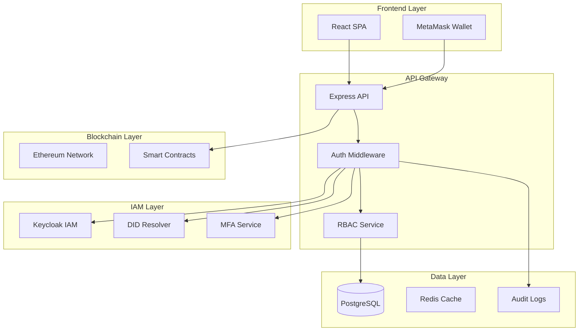
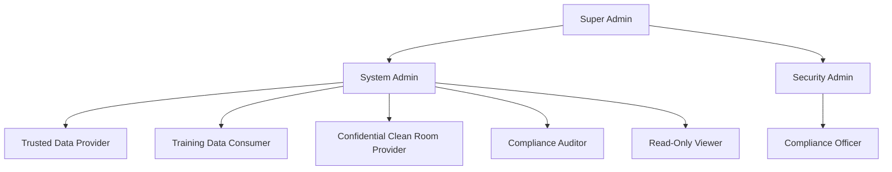
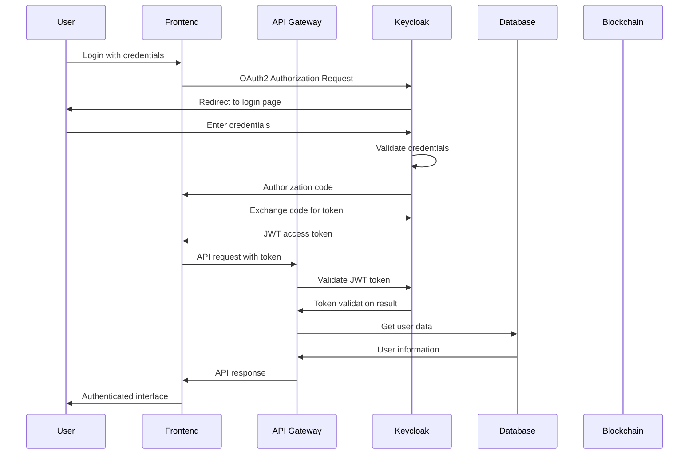
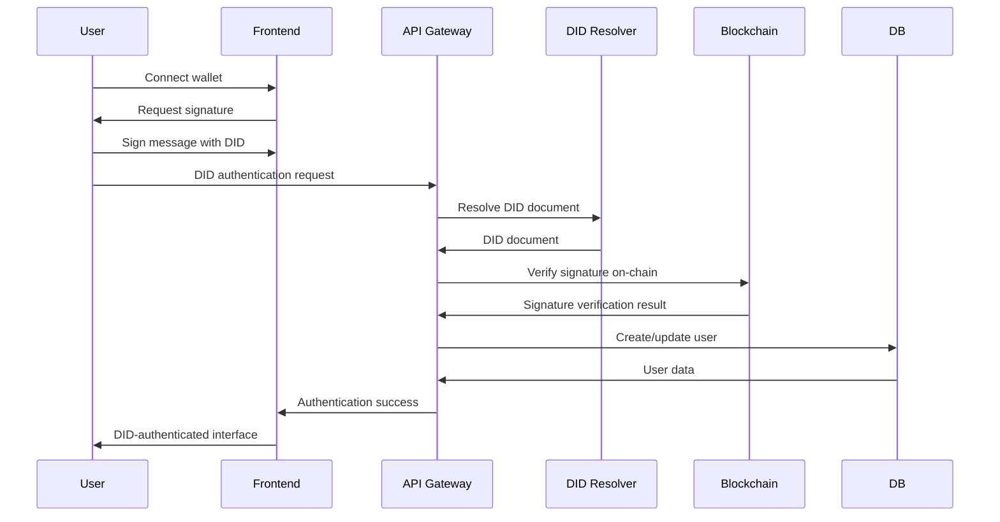
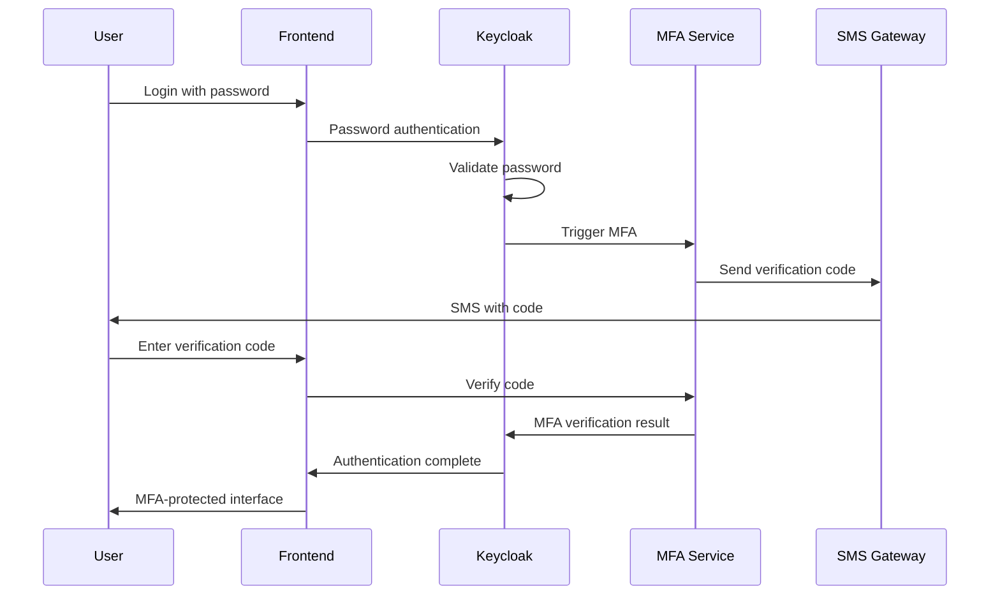
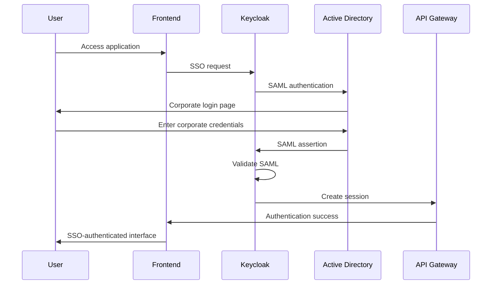

# Contract Management System - IAM Specifications

## Table of Contents

- [Overview](#overview)
- [IAM Architecture](#iam-architecture)
- [User Roles & Permissions](#user-roles--permissions)
- [Authentication Flows](#authentication-flows)
- [Security Policies](#security-policies)
- [DID Integration](#did-integration)
- [Enterprise Integration](#enterprise-integration)
- [Implementation Guidelines](#implementation-guidelines)
- [Compliance Requirements](#compliance-requirements)
- [Monitoring & Auditing](#monitoring--auditing)

---

## Overview

### Purpose
This document defines the Identity and Access Management (IAM) specifications for the Contract Management System (CMS), ensuring secure, scalable, and compliant user authentication and authorization.

### Scope
- User authentication and authorization
- Role-based access control (RBAC)
- DID:web integration for enterprise users
- Multi-factor authentication (MFA)
- Audit logging and compliance
- Enterprise SSO integration

### Key Principles
- **Zero Trust Security:** Verify every request, trust no one
- **Least Privilege:** Grant minimum necessary permissions
- **Separation of Duties:** Critical functions require multiple approvals
- **Audit Trail:** Complete logging of all access and changes
- **Compliance First:** Meet regulatory requirements by design

---

## IAM Architecture

### High-Level Architecture



### Component Responsibilities

| Component | Responsibility | Technology |
|-----------|----------------|------------|
| **Keycloak IAM** | User management, SSO, MFA | Keycloak 23.0+ |
| **DID Resolver** | DID:web resolution and verification | Custom service |
| **Auth Middleware** | JWT validation, session management | Express.js |
| **RBAC Service** | Role-based access control | Custom service |
| **MFA Service** | Multi-factor authentication | Keycloak + Custom |
| **Audit Service** | Access logging and compliance | Custom service |

---

## User Roles & Permissions

### Role Hierarchy



### Role Definitions

#### 1. Super Admin
**Purpose:** Complete system control and oversight
**Responsibilities:**
- System configuration and maintenance
- User role assignment and management
- Security policy enforcement
- Emergency access and recovery

**Permissions:**
```yaml
permissions:
  system:
    - system:configure
    - system:maintain
    - system:monitor
    - system:backup
    - system:restore
  
  users:
    - users:create
    - users:read
    - users:update
    - users:delete
    - users:assign_roles
  
  security:
    - security:policy:manage
    - security:audit:view
    - security:incident:manage
    - security:emergency:access
```

#### 2. System Admin
**Purpose:** Day-to-day system administration
**Responsibilities:**
- User management and onboarding
- Contract oversight and dispute resolution
- System monitoring and maintenance
- Compliance reporting

**Permissions:**
```yaml
permissions:
  users:
    - users:create
    - users:read
    - users:update
    - users:deactivate
  
  contracts:
    - contracts:read
    - contracts:update
    - contracts:cancel
    - contracts:dispute:resolve
  
  datasets:
    - datasets:read
    - datasets:approve
    - datasets:reject
  
  reports:
    - reports:generate
    - reports:export
    - reports:schedule
```

#### 3. Trusted Data Provider (TDP)
**Purpose:** Dataset owners and providers
**Responsibilities:**
- Dataset creation and management
- Contract signing and approval
- Data quality assurance
- Revenue management

**Permissions:**
```yaml
permissions:
  datasets:
    - datasets:create
    - datasets:read:own
    - datasets:update:own
    - datasets:delete:own
    - datasets:publish:own
  
  contracts:
    - contracts:read:own
    - contracts:sign:own
    - contracts:approve:own
    - contracts:cancel:own
  
  revenue:
    - revenue:view:own
    - revenue:withdraw:own
    - revenue:report:own
```

#### 4. Training Data Consumer (TDC)
**Purpose:** Contract initiators and data consumers
**Responsibilities:**
- Contract creation and negotiation
- Dataset browsing and selection
- Payment processing
- Model training coordination

**Permissions:**
```yaml
permissions:
  contracts:
    - contracts:create
    - contracts:read:own
    - contracts:sign:own
    - contracts:select_ccrp
    - contracts:cancel:own
  
  datasets:
    - datasets:browse
    - datasets:search
    - datasets:read:public
    - datasets:access:contracted
  
  payments:
    - payments:process
    - payments:view:own
    - payments:refund:request
```

#### 5. Confidential Clean Room Provider (CCRP)
**Purpose:** Compliance and security oversight
**Responsibilities:**
- Contract compliance review
- Security assessment
- Audit trail maintenance
- Regulatory reporting

**Permissions:**
```yaml
permissions:
  contracts:
    - contracts:read:assigned
    - contracts:review:compliance
    - contracts:sign:ccrp
    - contracts:approve:compliance
  
  compliance:
    - compliance:audit:conduct
    - compliance:report:generate
    - compliance:violation:report
    - compliance:policy:enforce
  
  security:
    - security:assessment:conduct
    - security:incident:report
    - security:access:monitor
```

#### 6. Compliance Auditor
**Purpose:** Independent compliance verification
**Responsibilities:**
- Regulatory compliance audits
- Security assessments
- Policy enforcement verification
- Incident investigation

**Permissions:**
```yaml
permissions:
  audit:
    - audit:conduct
    - audit:report:generate
    - audit:findings:document
    - audit:recommendations:make
  
  compliance:
    - compliance:verify
    - compliance:violation:investigate
    - compliance:policy:review
  
  security:
    - security:assessment:conduct
    - security:incident:investigate
    - security:access:review
```

#### 7. Read-Only Viewer
**Purpose:** Limited access for stakeholders
**Responsibilities:**
- View contract status
- Access public datasets
- Generate basic reports

**Permissions:**
```yaml
permissions:
  contracts:
    - contracts:read:public
    - contracts:status:view
  
  datasets:
    - datasets:read:public
    - datasets:browse
  
  reports:
    - reports:view:public
    - reports:generate:basic
```

### Permission Matrix

| Permission | Super Admin | System Admin | TDP | TDC | CCRP | Auditor | Viewer |
|------------|-------------|--------------|-----|-----|------|---------|--------|
| `system:configure` | ✅ | ❌ | ❌ | ❌ | ❌ | ❌ | ❌ |
| `users:create` | ✅ | ✅ | ❌ | ❌ | ❌ | ❌ | ❌ |
| `contracts:create` | ✅ | ✅ | ❌ | ✅ | ❌ | ❌ | ❌ |
| `contracts:sign` | ✅ | ✅ | ✅ | ✅ | ✅ | ❌ | ❌ |
| `datasets:create` | ✅ | ✅ | ✅ | ❌ | ❌ | ❌ | ❌ |
| `compliance:audit` | ✅ | ✅ | ❌ | ❌ | ✅ | ✅ | ❌ |
| `security:incident` | ✅ | ✅ | ❌ | ❌ | ✅ | ✅ | ❌ |
| `reports:generate` | ✅ | ✅ | ✅ | ✅ | ✅ | ✅ | ✅ |

---

## Authentication Flows

### 1. Standard User Authentication



### 2. DID:web Authentication



### 3. Multi-Factor Authentication



### 4. Enterprise SSO Integration



---

## Security Policies

### Password Policy

```yaml
password_policy:
  minimum_length: 12
  require_uppercase: true
  require_lowercase: true
  require_numbers: true
  require_special_chars: true
  prevent_common_passwords: true
  prevent_username_in_password: true
  maximum_age_days: 90
  prevent_reuse_count: 5
  lockout_threshold: 5
  lockout_duration_minutes: 30
```

### Session Management

```yaml
session_policy:
  session_timeout_minutes: 30
  idle_timeout_minutes: 15
  maximum_sessions_per_user: 3
  session_invalidation_on_logout: true
  secure_cookies: true
  http_only_cookies: true
  same_site_policy: "strict"
```

### MFA Policy

```yaml
mfa_policy:
  required_for_roles:
    - "Super Admin"
    - "System Admin"
    - "CCRP"
    - "Compliance Auditor"
  
  methods:
    - "SMS"
    - "TOTP"
    - "Email"
    - "Hardware Token"
  
  backup_codes: true
  remember_device_days: 30
```

### Access Control Policy

```yaml
access_control_policy:
  principle_of_least_privilege: true
  separation_of_duties: true
  time_based_access: true
  location_based_access: true
  device_based_access: true
  
  privileged_access_management:
    just_in_time_access: true
    approval_workflow: true
    session_recording: true
    access_review_frequency_days: 90
```

---

## DID Integration

### DID:web Implementation

```javascript
// DID:web Resolution Service
class DIDWebResolver {
  constructor() {
    this.cache = new Map();
    this.timeout = 5000;
    this.maxRetries = 3;
  }

  async resolveDID(did) {
    // Validate DID format
    if (!this.isValidDID(did)) {
      throw new Error('Invalid DID format');
    }

    // Check cache first
    const cached = this.cache.get(did);
    if (cached && Date.now() - cached.timestamp < 300000) { // 5 min cache
      return cached.document;
    }

    // Resolve DID document
    const didDocument = await this.fetchDIDDocument(did);
    
    // Validate DID document
    await this.validateDIDDocument(didDocument);
    
    // Cache result
    this.cache.set(did, {
      document: didDocument,
      timestamp: Date.now()
    });

    return didDocument;
  }

  async verifySignature(did, message, signature) {
    const didDocument = await this.resolveDID(did);
    const publicKey = this.extractPublicKey(didDocument);
    
    return await this.cryptoService.verify(message, signature, publicKey);
  }
}
```

### DID Authentication Flow

```javascript
// DID Authentication Middleware
const authenticateDID = async (req, res, next) => {
  const { did, signature, message, timestamp } = req.body;
  
  try {
    // Validate timestamp (prevent replay attacks)
    const now = Date.now();
    const timeDiff = Math.abs(now - timestamp);
    if (timeDiff > 300000) { // 5 minutes
      return res.status(401).json({ error: 'Timestamp expired' });
    }

    // Verify DID signature
    const isValid = await didResolver.verifySignature(did, message, signature);
    if (!isValid) {
      return res.status(401).json({ error: 'Invalid signature' });
    }

    // Get or create user
    let user = await User.findOne({ where: { did } });
    if (!user) {
      user = await User.create({
        did,
        partyType: 'TDC', // Default type
        onboardingStatus: 'PENDING'
      });
    }

    req.user = user;
    req.did = did;
    next();
  } catch (error) {
    return res.status(500).json({ error: 'DID authentication failed' });
  }
};
```

---

## Enterprise Integration

### Active Directory Integration

```yaml
ldap_configuration:
  provider: "ad"
  connection:
    url: "ldaps://ad.company.com:636"
    bind_dn: "CN=ServiceAccount,OU=ServiceAccounts,DC=company,DC=com"
    bind_credential: "${LDAP_BIND_PASSWORD}"
    search_base: "OU=Users,DC=company,DC=com"
    search_filter: "(sAMAccountName={0})"
  
  user_mapping:
    username: "sAMAccountName"
    email: "mail"
    first_name: "givenName"
    last_name: "sn"
    department: "department"
    employee_id: "employeeID"
  
  group_mapping:
    search_base: "OU=Groups,DC=company,DC=com"
    search_filter: "(member={0})"
    role_mapping:
      "CN=CMS-Admins,OU=Groups,DC=company,DC=com": "System Admin"
      "CN=CMS-TDP,OU=Groups,DC=company,DC=com": "TDP"
      "CN=CMS-TDC,OU=Groups,DC=company,DC=com": "TDC"
      "CN=CMS-CCRP,OU=Groups,DC=company,DC=com": "CCRP"
```

### SAML Configuration

```yaml
saml_configuration:
  entity_id: "https://cms.company.com"
  sso_service_url: "https://adfs.company.com/adfs/ls"
  certificate_file: "/etc/ssl/certs/saml.crt"
  private_key_file: "/etc/ssl/private/saml.key"
  
  attribute_mapping:
    name_id: "email"
    email: "email"
    first_name: "givenName"
    last_name: "sn"
    department: "department"
    employee_id: "employeeID"
  
  role_mapping:
    "CMS-Admins": "System Admin"
    "CMS-TDP": "TDP"
    "CMS-TDC": "TDC"
    "CMS-CCRP": "CCRP"
```

---

## Implementation Guidelines

### Keycloak Configuration

```json
{
  "realm": "contract-management",
  "enabled": true,
  "displayName": "Contract Management System",
  "displayNameHtml": "<div class=\"kc-logo-text\"><span>Contract Management</span></div>",
  
  "clients": [
    {
      "clientId": "contract-management-frontend",
      "enabled": true,
      "publicClient": true,
      "standardFlowEnabled": true,
      "directAccessGrantsEnabled": false,
      "serviceAccountsEnabled": false,
      "redirectUris": [
        "http://localhost:3000/*",
        "https://cms.company.com/*"
      ],
      "webOrigins": [
        "http://localhost:3000",
        "https://cms.company.com"
      ]
    },
    {
      "clientId": "contract-management-backend",
      "enabled": true,
      "publicClient": false,
      "standardFlowEnabled": false,
      "directAccessGrantsEnabled": false,
      "serviceAccountsEnabled": true,
      "secret": "${BACKEND_CLIENT_SECRET}"
    }
  ],
  
  "roles": {
    "realm": [
      {
        "name": "super-admin",
        "description": "Super Administrator with full system access"
      },
      {
        "name": "system-admin",
        "description": "System Administrator for day-to-day operations"
      },
      {
        "name": "tdp",
        "description": "Trusted Data Provider"
      },
      {
        "name": "tdc",
        "description": "Training Data Consumer"
      },
      {
        "name": "ccrp",
        "description": "Confidential Clean Room Provider"
      },
      {
        "name": "auditor",
        "description": "Compliance Auditor"
      },
      {
        "name": "viewer",
        "description": "Read-Only Viewer"
      }
    ]
  },
  
  "groups": [
    {
      "name": "Administrators",
      "subGroups": [
        {
          "name": "Super Admins",
          "realmRoles": ["super-admin"]
        },
        {
          "name": "System Admins",
          "realmRoles": ["system-admin"]
        }
      ]
    },
    {
      "name": "Data Providers",
      "subGroups": [
        {
          "name": "TDP Users",
          "realmRoles": ["tdp"]
        }
      ]
    },
    {
      "name": "Data Consumers",
      "subGroups": [
        {
          "name": "TDC Users",
          "realmRoles": ["tdc"]
        }
      ]
    },
    {
      "name": "Compliance",
      "subGroups": [
        {
          "name": "CCRP Users",
          "realmRoles": ["ccrp"]
        },
        {
          "name": "Auditors",
          "realmRoles": ["auditor"]
        }
      ]
    }
  ]
}
```

### Database Schema

```sql
-- Users table with IAM integration
CREATE TABLE users (
    id SERIAL PRIMARY KEY,
    email VARCHAR(255) UNIQUE NOT NULL,
    name VARCHAR(255) NOT NULL,
    
    -- IAM Integration
    iam_user_id VARCHAR(255) UNIQUE,
    iam_username VARCHAR(255),
    
    -- DID and Blockchain
    wallet_address VARCHAR(255) UNIQUE,
    public_key TEXT,
    did VARCHAR(255) UNIQUE,
    
    -- Role and Party
    party_type VARCHAR(50) NOT NULL CHECK (party_type IN ('TDP', 'TDC', 'CCRP', 'ADMIN')),
    
    -- Onboarding
    onboarding_status VARCHAR(50) DEFAULT 'PENDING' CHECK (onboarding_status IN ('PENDING', 'IN_PROGRESS', 'COMPLETED', 'VERIFIED')),
    profile_completed BOOLEAN DEFAULT FALSE,
    email_verified BOOLEAN DEFAULT FALSE,
    
    -- Organization
    organization VARCHAR(255),
    phone_number VARCHAR(50),
    website VARCHAR(255),
    location VARCHAR(255),
    
    -- Status
    is_active BOOLEAN DEFAULT TRUE,
    last_login_at TIMESTAMP,
    created_at TIMESTAMP DEFAULT CURRENT_TIMESTAMP,
    updated_at TIMESTAMP DEFAULT CURRENT_TIMESTAMP
);

-- User roles mapping
CREATE TABLE user_roles (
    id SERIAL PRIMARY KEY,
    user_id INTEGER REFERENCES users(id) ON DELETE CASCADE,
    role_name VARCHAR(100) NOT NULL,
    granted_by INTEGER REFERENCES users(id),
    granted_at TIMESTAMP DEFAULT CURRENT_TIMESTAMP,
    expires_at TIMESTAMP,
    is_active BOOLEAN DEFAULT TRUE
);

-- Audit logs
CREATE TABLE audit_logs (
    id SERIAL PRIMARY KEY,
    user_id INTEGER REFERENCES users(id),
    action VARCHAR(100) NOT NULL,
    resource_type VARCHAR(50),
    resource_id VARCHAR(255),
    details JSONB,
    ip_address INET,
    user_agent TEXT,
    timestamp TIMESTAMP DEFAULT CURRENT_TIMESTAMP
);

-- MFA configurations
CREATE TABLE mfa_configurations (
    id SERIAL PRIMARY KEY,
    user_id INTEGER REFERENCES users(id) ON DELETE CASCADE,
    mfa_type VARCHAR(50) NOT NULL, -- 'SMS', 'TOTP', 'EMAIL', 'HARDWARE'
    mfa_secret TEXT,
    phone_number VARCHAR(50),
    email VARCHAR(255),
    is_enabled BOOLEAN DEFAULT FALSE,
    created_at TIMESTAMP DEFAULT CURRENT_TIMESTAMP,
    updated_at TIMESTAMP DEFAULT CURRENT_TIMESTAMP
);

-- Session management
CREATE TABLE user_sessions (
    id SERIAL PRIMARY KEY,
    user_id INTEGER REFERENCES users(id) ON DELETE CASCADE,
    session_id VARCHAR(255) UNIQUE NOT NULL,
    token_hash TEXT NOT NULL,
    ip_address INET,
    user_agent TEXT,
    created_at TIMESTAMP DEFAULT CURRENT_TIMESTAMP,
    expires_at TIMESTAMP NOT NULL,
    is_active BOOLEAN DEFAULT TRUE
);
```

### API Security Middleware

```javascript
// Comprehensive authentication middleware
const authenticateRequest = async (req, res, next) => {
  try {
    const authHeader = req.headers['authorization'];
    const token = authHeader && authHeader.split(' ')[1];

    if (!token) {
      return res.status(401).json({ 
        error: 'Access token required',
        code: 'TOKEN_MISSING'
      });
    }

    // Validate JWT token with Keycloak
    const validationResult = await ***REMOVED-KEYCLOAK_DB_PASSWORD***Service.validateToken(token);
    
    if (!validationResult.valid) {
      return res.status(401).json({ 
        error: 'Invalid or expired token',
        code: 'TOKEN_INVALID'
      });
    }

    // Get user from database
    const user = await db.User.findOne({
      where: { 
        iamUserId: validationResult.payload.sub,
        isActive: true 
      },
      include: [{
        model: db.UserRole,
        where: { isActive: true },
        required: false
      }]
    });

    if (!user) {
      return res.status(404).json({ 
        error: 'User not found',
        code: 'USER_NOT_FOUND'
      });
    }

    // Check MFA if required
    if (await isMFARequired(user)) {
      const mfaToken = req.headers['x-mfa-token'];
      if (!mfaToken || !await validateMFAToken(user, mfaToken)) {
        return res.status(401).json({ 
          error: 'MFA required',
          code: 'MFA_REQUIRED'
        });
      }
    }

    // Update last login
    await user.update({ lastLoginAt: new Date() });

    // Attach user to request
    req.user = {
      ...validationResult.payload,
      localUser: user,
      roles: user.UserRoles.map(ur => ur.roleName)
    };

    // Log access
    await auditService.logAccess(req);

    next();
  } catch (error) {
    console.error('Authentication error:', error);
    return res.status(500).json({ 
      error: 'Authentication service error',
      code: 'AUTH_SERVICE_ERROR'
    });
  }
};

// Role-based access control middleware
const requireRole = (roles) => {
  return (req, res, next) => {
    if (!req.user) {
      return res.status(401).json({ 
        error: 'Authentication required',
        code: 'AUTH_REQUIRED'
      });
    }

    const userRoles = req.user.roles || [];
    const hasRole = Array.isArray(roles) 
      ? roles.some(role => userRoles.includes(role))
      : userRoles.includes(roles);

    if (!hasRole) {
      return res.status(403).json({ 
        error: 'Insufficient permissions',
        code: 'INSUFFICIENT_PERMISSIONS',
        required: roles,
        current: userRoles
      });
    }

    next();
  };
};
```

---

## Compliance Requirements

### GDPR Compliance

```yaml
gdpr_compliance:
  data_minimization:
    enabled: true
    required_fields_only: true
    purpose_limitation: true
  
  user_rights:
    right_to_access: true
    right_to_rectification: true
    right_to_erasure: true
    right_to_portability: true
    right_to_restriction: true
  
  consent_management:
    explicit_consent: true
    consent_tracking: true
    consent_withdrawal: true
  
  data_retention:
    retention_policy: "7 years for contracts, 3 years for user data"
    automated_deletion: true
    data_anonymization: true
```

### SOC 2 Type II

```yaml
soc2_compliance:
  security_controls:
    access_control:
      - role_based_access: true
      - multi_factor_authentication: true
      - session_management: true
      - privileged_access_management: true
    
    change_management:
      - version_control: true
      - deployment_tracking: true
      - change_approval: true
      - rollback_capability: true
    
    incident_response:
      - automated_detection: true
      - response_playbooks: true
      - notification_systems: true
      - post_incident_review: true
  
  availability_controls:
    backup_recovery: true
    disaster_recovery: true
    system_monitoring: true
    performance_monitoring: true
```

### HIPAA Compliance

```yaml
hipaa_compliance:
  privacy_rule:
    phi_encryption: true
    access_controls: true
    audit_logging: true
    minimum_necessary: true
  
  security_rule:
    technical_safeguards:
      - access_control: true
      - audit_controls: true
      - integrity: true
      - transmission_security: true
    
    physical_safeguards:
      - facility_access: true
      - workstation_security: true
      - device_controls: true
    
    administrative_safeguards:
      - security_officer: true
      - workforce_security: true
      - information_access: true
      - security_incident: true
```

---

## Monitoring & Auditing

### Audit Logging

```javascript
// Comprehensive audit service
class AuditService {
  async logAccess(req) {
    const auditEntry = {
      userId: req.user?.localUser?.id,
      action: 'API_ACCESS',
      resourceType: req.method,
      resourceId: req.path,
      details: {
        method: req.method,
        path: req.path,
        query: req.query,
        body: this.sanitizeBody(req.body),
        userAgent: req.get('User-Agent'),
        ipAddress: req.ip,
        timestamp: new Date().toISOString()
      }
    };

    await db.AuditLog.create(auditEntry);
  }

  async logSecurityEvent(event) {
    const securityEntry = {
      eventType: event.type,
      severity: event.severity,
      userId: event.userId,
      details: event.details,
      timestamp: new Date().toISOString()
    };

    await db.SecurityEvent.create(securityEntry);
    
    // Alert security team for high-severity events
    if (event.severity === 'HIGH' || event.severity === 'CRITICAL') {
      await this.alertSecurityTeam(securityEntry);
    }
  }

  async generateComplianceReport(startDate, endDate) {
    return {
      accessLogs: await this.getAccessLogs(startDate, endDate),
      securityEvents: await this.getSecurityEvents(startDate, endDate),
      userActivity: await this.getUserActivity(startDate, endDate),
      complianceMetrics: await this.getComplianceMetrics(startDate, endDate)
    };
  }
}
```

### Security Monitoring

```yaml
security_monitoring:
  real_time_alerts:
    failed_login_attempts:
      threshold: 5
      time_window: "5 minutes"
      action: "block_ip"
    
    suspicious_activity:
      - multiple_failed_logins
      - unusual_access_patterns
      - privilege_escalation_attempts
      - data_access_outside_hours
    
    security_events:
      - unauthorized_access_attempts
      - data_breach_indicators
      - system_configuration_changes
      - user_permission_changes
  
  automated_responses:
    ip_blocking:
      enabled: true
      duration: "1 hour"
      threshold: 10
    
    account_lockout:
      enabled: true
      duration: "30 minutes"
      threshold: 5
    
    session_termination:
      enabled: true
      conditions:
        - suspicious_activity
        - security_violation
        - policy_violation
```

### Performance Monitoring

```yaml
performance_monitoring:
  metrics:
    authentication_latency:
      threshold: "500ms"
      alert: true
    
    session_duration:
      average: "30 minutes"
      max: "8 hours"
    
    concurrent_users:
      current: "1,000"
      max: "10,000"
    
    api_response_time:
      p95: "200ms"
      p99: "500ms"
  
  health_checks:
    ***REMOVED-KEYCLOAK_DB_PASSWORD***_health:
      endpoint: "/health"
      interval: "30s"
      timeout: "5s"
    
    database_health:
      query: "SELECT 1"
      interval: "30s"
      timeout: "5s"
    
    redis_health:
      command: "PING"
      interval: "30s"
      timeout: "5s"
```

---

## Implementation Checklist

### Phase 1: Core IAM Setup
- [ ] Install and configure Keycloak
- [ ] Set up PostgreSQL database
- [ ] Configure realm and clients
- [ ] Create user roles and groups
- [ ] Implement authentication middleware
- [ ] Set up basic RBAC

### Phase 2: Advanced Features
- [ ] Implement MFA
- [ ] Set up DID:web integration
- [ ] Configure audit logging
- [ ] Implement session management
- [ ] Set up security monitoring

### Phase 3: Enterprise Integration
- [ ] Configure LDAP/Active Directory
- [ ] Set up SAML SSO
- [ ] Implement enterprise DID:web
- [ ] Configure compliance reporting
- [ ] Set up automated monitoring

### Phase 4: Security Hardening
- [ ] Implement security policies
- [ ] Set up automated security scanning
- [ ] Configure incident response
- [ ] Implement backup and recovery
- [ ] Conduct security audit

### Phase 5: Compliance & Monitoring
- [ ] Implement GDPR compliance
- [ ] Set up SOC 2 controls
- [ ] Configure HIPAA safeguards
- [ ] Set up compliance reporting
- [ ] Implement continuous monitoring

---

This IAM specification provides a comprehensive framework for implementing secure, scalable, and compliant identity and access management for the Contract Management System. The specification covers all aspects from basic authentication to enterprise integration and compliance requirements. 