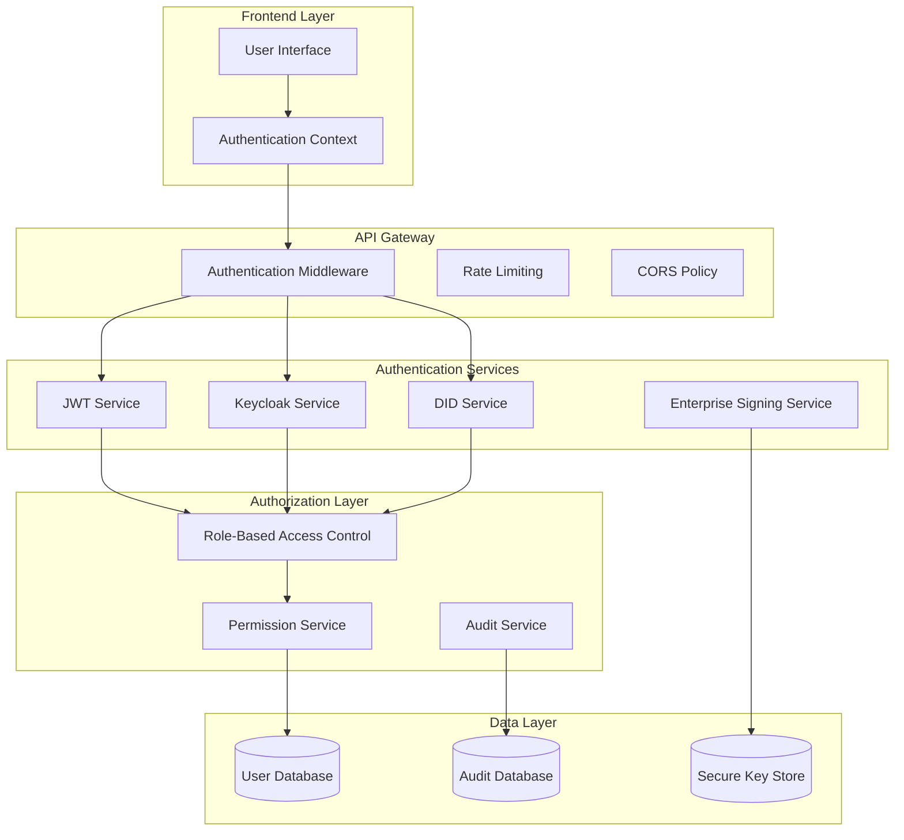
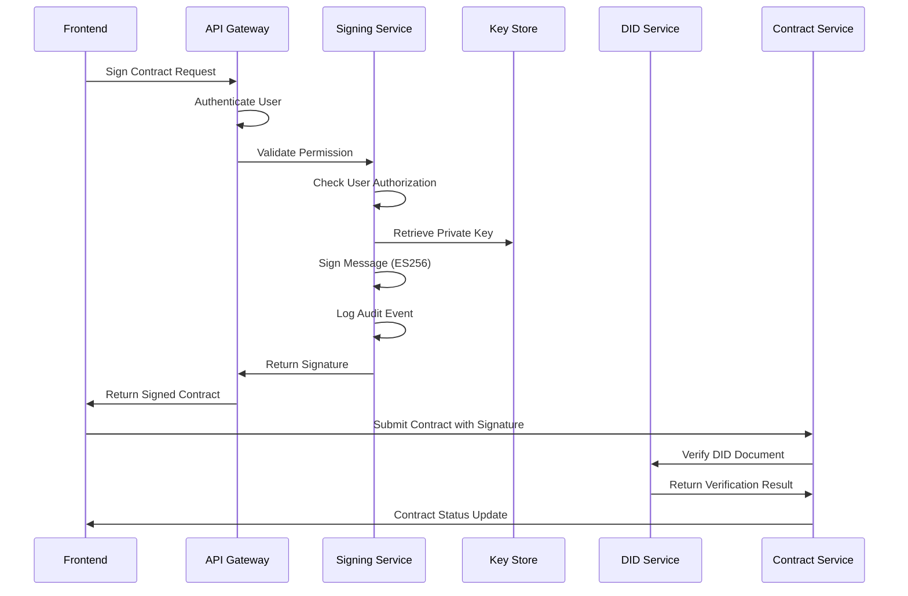

# Identity and Access Management (IAM) Specifications

## Table of Contents
1. [Overview](#overview)
2. [Architecture](#architecture)
3. [Authentication Methods](#authentication-methods)
4. [Authorization Framework](#authorization-framework)
5. [DID Integration](#did-integration)
6. [Enterprise Signing Service](#enterprise-signing-service)
7. [Security Controls](#security-controls)
8. [Audit and Compliance](#audit-and-compliance)
9. [Implementation Details](#implementation-details)
10. [API Specifications](#api-specifications)
11. [Deployment Considerations](#deployment-considerations)

## Overview

The Contract Management System implements a comprehensive IAM framework that supports multiple authentication methods, role-based access control, and decentralized identity (DID) integration. The system is designed for enterprise use with secure signing capabilities and audit trails.

### Key Features
- **Multi-Method Authentication**: JWT tokens, Keycloak integration, and DID-based authentication
- **Role-Based Access Control**: TDP, TDC, CCRP, and Admin roles with granular permissions
- **Enterprise Signing Service**: Secure cryptographic signing with private key management
- **DID Integration**: Support for did:web and did:ethr with verification
- **Audit Logging**: Comprehensive audit trails for all security events

## Architecture

### High-Level IAM Architecture



## Authentication Methods

### 1. JWT Token Authentication

**Implementation**: `backend/middleware/auth.js`

**Features**:
- Stateless authentication using JSON Web Tokens
- Configurable expiration times
- Fallback authentication when Keycloak is unavailable
- Token validation with signature verification

**Token Structure**:
```json
{
  "id": "user_id",
  "name": "User Name",
  "email": "user@example.com",
  "partyType": "TDP|TDC|CCRP|ADMIN",
  "iat": "issued_at_timestamp",
  "exp": "expiration_timestamp"
}
```

**Configuration**:
```env
JWT_SECRET=your-super-secret-jwt-key-here
JWT_EXPIRES_IN=24h
```

### 2. Keycloak Integration

**Implementation**: `backend/services/keycloakService.js`

**Features**:
- Enterprise SSO integration
- User federation
- Centralized user management
- Token introspection

**Configuration**:
```env
KEYCLOAK_URL=http://localhost:8080
KEYCLOAK_REALM=contract-management
KEYCLOAK_CLIENT_ID=contract-management-frontend
KEYCLOAK_CLIENT_SECRET=your_client_secret_here
```

### 3. DID-Based Authentication

**Implementation**: `backend/services/didService.js`

**Supported DID Methods**:
- `did:web`: Web-hosted DID documents
- `did:ethr`: Ethereum-based DIDs
- `did:key`: Simple key-based DIDs

**Verification Process**:
1. Resolve DID document from the specified method
2. Extract verification methods
3. Verify cryptographic signatures
4. Validate DID ownership

## Authorization Framework

### Role-Based Access Control (RBAC)

**Roles Defined**:

#### 1. Training Data Provider (TDP)
- **Permissions**:
  - Create and manage datasets
  - Sign contracts as TDP party
  - View own contracts and datasets
  - Update profile and DID information
- **Data Access**: Own datasets and contracts only

#### 2. Training Data Consumer (TDC)
- **Permissions**:
  - Browse available datasets
  - Create contracts
  - Sign contracts as TDC party
  - View own contracts
- **Data Access**: Public datasets and own contracts

#### 3. Confidential Clean Room Provider (CCRP)
- **Permissions**:
  - Manage clean room environments
  - Complete contracts
  - Cancel contracts
  - View contract execution status
- **Data Access**: Contract execution data and clean room configurations

#### 4. System Administrator (ADMIN)
- **Permissions**:
  - Manage all users
  - View system audit logs
  - Configure enterprise settings
  - Manage DID domains
  - Access all data
- **Data Access**: Full system access

### Permission Matrix

| Action | TDP | TDC | CCRP | ADMIN |
|--------|-----|-----|------|-------|
| Create Dataset | ✅ | ❌ | ❌ | ✅ |
| Browse Datasets | ✅ | ✅ | ❌ | ✅ |
| Create Contract | ❌ | ✅ | ❌ | ✅ |
| Sign Contract | ✅ | ✅ | ❌ | ✅ |
| Complete Contract | ❌ | ❌ | ✅ | ✅ |
| Cancel Contract | ❌ | ❌ | ✅ | ✅ |
| Manage Users | ❌ | ❌ | ❌ | ✅ |
| View Audit Logs | ❌ | ❌ | ❌ | ✅ |
| Configure System | ❌ | ❌ | ❌ | ✅ |

## DID Integration

### DID Resolution and Verification

**Implementation**: `backend/services/didService.js`

**Supported DID Methods**:

#### did:web
- **Resolution**: HTTP GET to `https://domain/.well-known/did.json`
- **Verification**: JsonWebKey2020 with ES256 signatures
- **Example**: `did:web:gitmujoshi.github.io`

#### did:ethr
- **Resolution**: Ethereum blockchain lookup
- **Verification**: ECDSA signatures with Ethereum addresses
- **Example**: `did:ethr:0x1234567890abcdef...`

#### did:key
- **Resolution**: Direct key derivation
- **Verification**: Direct cryptographic verification
- **Example**: `did:key:z6Mk...`

### DID Document Structure

```json
{
  "@context": [
    "https://www.w3.org/ns/did/v1",
    "https://w3id.org/security/suites/jws-2020/v1"
  ],
  "id": "did:web:gitmujoshi.github.io",
  "assertionMethod": [
    {
      "id": "did:web:gitmujoshi.github.io#120c453f6d39fe0b8dfecceba8b0e7992f9bc650c2bf4001d2e448907b140877",
      "type": "JsonWebKey2020",
      "controller": "did:web:gitmujoshi.github.io",
      "publicKeyJwk": {
        "kty": "EC",
        "crv": "P-256",
        "x": "FFQw_IJcWPr8qZrwq48azt1hVM8JNp3nnJ0367TxUyQ=",
        "y": "AkPYsoJhbJNqIRGwnUHQN2D3cq4MPtzlVPx8BVuzTAo=",
        "kid": "120c453f6d39fe0b8dfecceba8b0e7992f9bc650c2bf4001d2e448907b140877",
        "alg": "ES256"
      }
    }
  ]
}
```

## Enterprise Signing Service

### Architecture

**Implementation**: `backend/services/signingService.js`

**Key Features**:
- Secure private key management
- ES256 cryptographic signing
- Audit logging for all signing operations
- Multi-DID support
- Permission-based access control

### Signing Process Flow



### Security Controls

#### Private Key Management
- **Storage**: Secure key store (HSM/KMS in production)
- **Access**: Role-based permissions required
- **Rotation**: Configurable key rotation policies
- **Backup**: Secure backup and recovery procedures

#### Signing Operations
- **Algorithm**: ES256 (ECDSA with P-256 curve)
- **Format**: Base64URL encoded signatures
- **Validation**: Cryptographic verification against DID documents
- **Audit**: Complete audit trail for all operations

## Security Controls

### Authentication Security

#### JWT Security
- **Secret Management**: Environment-based secrets
- **Token Expiration**: Configurable expiration times
- **Signature Verification**: HMAC-SHA256 signatures
- **Token Refresh**: Automatic token refresh mechanism

#### Rate Limiting
```javascript
const limiter = rateLimit({
  windowMs: 15 * 60 * 1000, // 15 minutes
  max: 1000 // limit each IP to 1000 requests per windowMs
});
```

#### CORS Policy
```javascript
const corsOptions = {
  origin: [
    'http://localhost:3000',
    'http://localhost:3001',
    process.env.FRONTEND_URL
  ],
  credentials: true,
  methods: ['GET', 'POST', 'PUT', 'DELETE', 'OPTIONS'],
  allowedHeaders: ['Content-Type', 'Authorization', 'X-Requested-With']
};
```

### Authorization Security

#### Role Validation
- **Middleware**: `authenticateToken` middleware
- **Permission Checks**: Granular permission validation
- **Resource Access**: Role-based resource access control
- **Session Management**: Secure session handling

#### DID Security
- **Document Validation**: Cryptographic verification
- **Ownership Proof**: Signature-based ownership verification
- **Revocation**: DID document revocation support
- **Expiration**: DID document expiration handling

## Audit and Compliance

### Audit Logging

**Implementation**: `backend/services/auditService.js`

**Audited Events**:
- User authentication and authorization
- Contract signing operations
- DID verification attempts
- Permission changes
- System configuration changes
- Data access events

**Audit Log Structure**:
```json
{
  "timestamp": "2024-01-01T00:00:00.000Z",
  "userId": "user_id",
  "action": "CONTRACT_SIGNED",
  "resource": "contract_id",
  "details": {
    "did": "did:web:example.com",
    "signature": "signature_hash",
    "partyType": "TDP"
  },
  "ipAddress": "192.168.1.1",
  "userAgent": "Mozilla/5.0...",
  "sessionId": "session_id"
}
```

### Compliance Features

#### GDPR Compliance
- **Data Minimization**: Only necessary data collection
- **Right to Erasure**: User data deletion capabilities
- **Consent Management**: Explicit consent tracking
- **Data Portability**: Export capabilities

#### SOX Compliance
- **Access Controls**: Segregation of duties
- **Audit Trails**: Complete audit logging
- **Change Management**: Controlled system changes
- **Risk Assessment**: Regular security assessments

## Implementation Details

### Database Schema

#### Users Table
```sql
CREATE TABLE users (
  id SERIAL PRIMARY KEY,
  name VARCHAR(255) NOT NULL,
  email VARCHAR(255) UNIQUE NOT NULL,
  password VARCHAR(255),
  partyType ENUM('TDP', 'TDC', 'CCRP', 'ADMIN') NOT NULL,
  walletAddress VARCHAR(255),
  publicKey TEXT,
  did VARCHAR(255),
  didSource ENUM('SYSTEM_GENERATED', 'USER_PROVIDED'),
  didVerified BOOLEAN DEFAULT FALSE,
  didVerificationMethod VARCHAR(100),
  isActive BOOLEAN DEFAULT TRUE,
  isRegistered BOOLEAN DEFAULT FALSE,
  registrationDate TIMESTAMP,
  lastLoginAt TIMESTAMP,
  createdAt TIMESTAMP DEFAULT CURRENT_TIMESTAMP,
  updatedAt TIMESTAMP DEFAULT CURRENT_TIMESTAMP
);
```

#### Audit Logs Table
```sql
CREATE TABLE audit_logs (
  id SERIAL PRIMARY KEY,
  userId INTEGER REFERENCES users(id),
  action VARCHAR(100) NOT NULL,
  resource VARCHAR(255),
  details JSONB,
  ipAddress INET,
  userAgent TEXT,
  sessionId VARCHAR(255),
  timestamp TIMESTAMP DEFAULT CURRENT_TIMESTAMP
);
```

### Middleware Implementation

#### Authentication Middleware
```javascript
const authenticateToken = async (req, res, next) => {
  try {
    // Extract token from Authorization header
    const authHeader = req.headers['authorization'];
    const token = authHeader && authHeader.split(' ')[1];

    if (!token) {
      return res.status(401).json({ error: 'Access token required' });
    }

    // Verify token
    const decoded = jwt.verify(token, process.env.JWT_SECRET);
    req.user = decoded;
    next();
  } catch (error) {
    return res.status(403).json({ error: 'Invalid or expired token' });
  }
};
```

#### Authorization Middleware
```javascript
const authorizeRole = (allowedRoles) => {
  return (req, res, next) => {
    if (!req.user) {
      return res.status(401).json({ error: 'Authentication required' });
    }

    if (!allowedRoles.includes(req.user.partyType)) {
      return res.status(403).json({ error: 'Insufficient permissions' });
    }

    next();
  };
};
```

## API Specifications

### Authentication Endpoints

#### POST /api/auth/login
**Purpose**: User authentication
**Request**:
```json
{
  "email": "user@example.com",
  "password": "password123"
}
```
**Response**:
```json
{
  "success": true,
  "token": "jwt_token",
  "user": {
    "id": 1,
    "name": "User Name",
    "email": "user@example.com",
    "partyType": "TDP"
  }
}
```

#### POST /api/auth/register
**Purpose**: User registration
**Request**:
```json
{
  "name": "User Name",
  "email": "user@example.com",
  "password": "password123",
  "partyType": "TDP",
  "did": "did:web:example.com"
}
```

### DID Endpoints

#### POST /api/did/verify
**Purpose**: Verify DID ownership
**Request**:
```json
{
  "did": "did:web:example.com",
  "signature": "base64url_signature",
  "message": "message_to_verify"
}
```

#### GET /api/did/resolve/{did}
**Purpose**: Resolve DID document
**Response**:
```json
{
  "did": "did:web:example.com",
  "document": {
    "@context": ["https://www.w3.org/ns/did/v1"],
    "id": "did:web:example.com",
    "verificationMethod": [...]
  }
}
```

### Signing Endpoints

#### POST /api/signing/sign
**Purpose**: Enterprise signing service
**Request**:
```json
{
  "message": "Message to sign",
  "did": "did:web:example.com"
}
```
**Response**:
```json
{
  "success": true,
  "signature": "base64url_signature",
  "did": "did:web:example.com",
  "timestamp": "2024-01-01T00:00:00.000Z"
}
```

#### GET /api/signing/dids
**Purpose**: Get available enterprise DIDs
**Response**:
```json
{
  "success": true,
  "dids": [
    {
      "did": "did:web:example.com",
      "publicKey": {...},
      "available": true
    }
  ]
}
```

## Deployment Considerations

### Production Security

#### Environment Variables
```env
# Authentication
JWT_SECRET=your-super-secret-jwt-key-here
JWT_EXPIRES_IN=24h

# Keycloak
KEYCLOAK_URL=https://keycloak.company.com
KEYCLOAK_REALM=contract-management
KEYCLOAK_CLIENT_ID=contract-management-frontend
KEYCLOAK_CLIENT_SECRET=your_client_secret_here

# Security
CORS_ORIGIN=https://app.company.com
SESSION_SECRET=your-super-secret-session-key-here

# Enterprise Signing
ENTERPRISE_PRIVATE_KEYS=path/to/secure/key/store
SIGNING_AUDIT_LOG=path/to/audit/logs
```

#### Key Management
- **HSM Integration**: Hardware Security Module for private keys
- **Key Rotation**: Automated key rotation procedures
- **Backup Security**: Encrypted backup procedures
- **Access Controls**: Multi-factor authentication for key access

#### Network Security
- **HTTPS**: TLS 1.3 encryption
- **WAF**: Web Application Firewall
- **DDoS Protection**: Distributed Denial of Service protection
- **VPN Access**: Secure network access

### Monitoring and Alerting

#### Security Monitoring
- **Authentication Failures**: Alert on multiple failed attempts
- **Unusual Access Patterns**: Machine learning-based anomaly detection
- **DID Verification Failures**: Monitor for potential attacks
- **Signing Operation Anomalies**: Alert on unusual signing patterns

#### Performance Monitoring
- **Response Times**: API performance monitoring
- **Error Rates**: Error rate tracking
- **Resource Usage**: Memory and CPU monitoring
- **Database Performance**: Query performance monitoring

### Disaster Recovery

#### Backup Strategy
- **Database Backups**: Daily automated backups
- **Configuration Backups**: System configuration backups
- **Key Backups**: Secure key backup procedures
- **Audit Log Backups**: Audit trail preservation

#### Recovery Procedures
- **Service Recovery**: Automated service restart procedures
- **Data Recovery**: Database recovery procedures
- **Key Recovery**: Secure key recovery processes
- **Audit Recovery**: Audit log recovery procedures

## Conclusion

This IAM specification provides a comprehensive framework for secure identity and access management in the Contract Management System. The implementation supports enterprise-grade security requirements while maintaining flexibility for different deployment scenarios.

The system is designed to be:
- **Secure**: Multi-layered security controls
- **Scalable**: Support for enterprise deployments
- **Compliant**: Built-in audit and compliance features
- **Flexible**: Support for multiple authentication methods
- **Maintainable**: Clear separation of concerns and modular design

For production deployment, ensure all security controls are properly configured and regularly audited. 