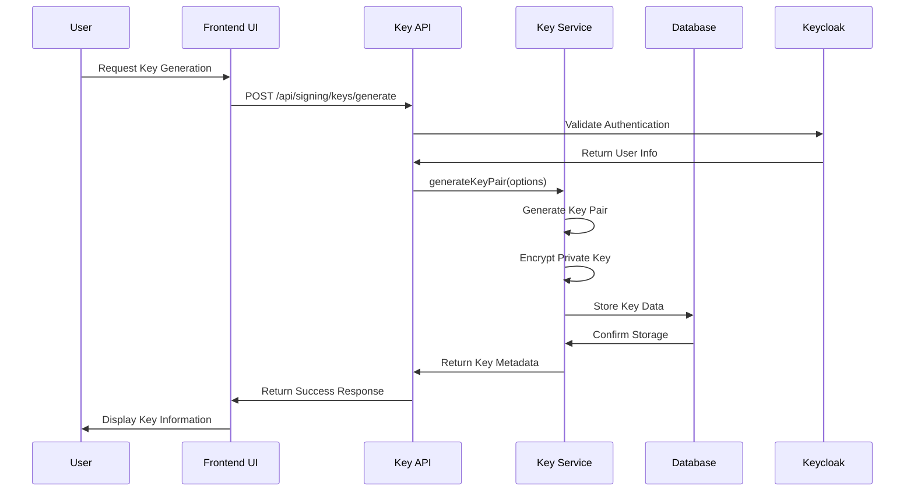
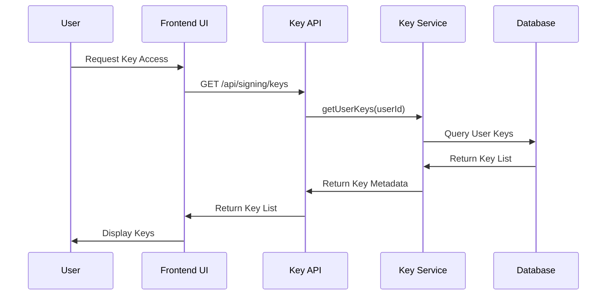
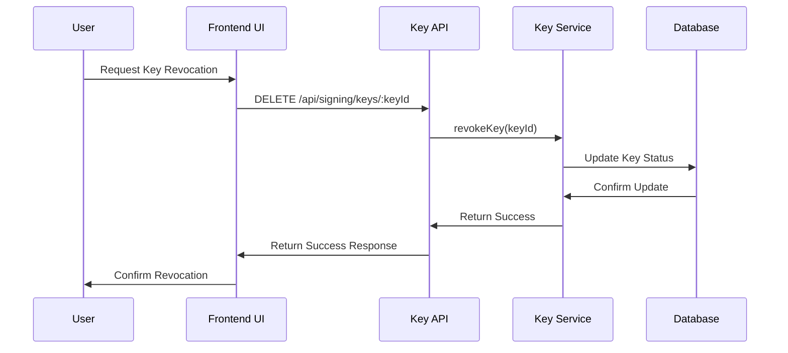

# Key Management Design Document
## Contract Management System - Digital Signing Key Management

### 📋 Table of Contents
1. [Overview](#overview)
2. [Architecture](#architecture)
3. [Key Lifecycle Management](#key-lifecycle-management)
4. [Supported Algorithms](#supported-algorithms)
5. [Configuration Management](#configuration-management)
6. [Security Model](#security-model)
7. [API Design](#api-design)
8. [Database Schema](#database-schema)
9. [Integration Points](#integration-points)
10. [Deployment Considerations](#deployment-considerations)
11. [Monitoring & Auditing](#monitoring--auditing)
12. [Troubleshooting](#troubleshooting)

---

## 🎯 Overview

The Key Management system provides secure generation, storage, and management of digital signing keys for the Contract Management System. It integrates with the IAM system (Keycloak) for authentication and authorization, and supports multiple cryptographic algorithms for different security requirements.

### Key Features
- **Multi-Algorithm Support**: ECDSA-P256, RSA-2048, RSA-4096
- **Environment-Based Configuration**: Configurable through environment variables
- **Secure Storage**: AES-256-GCM encryption for private keys
- **Role-Based Access**: Integrated with Keycloak authentication
- **Audit Logging**: Comprehensive logging of all key operations
- **SCITT CCF Integration**: Keys used for immutable signature storage

### Security Requirements
- **Encryption at Rest**: All private keys encrypted before storage
- **Access Control**: Only authenticated users can access their keys
- **Audit Trail**: All key operations logged for compliance
- **Key Rotation**: Support for regular key rotation
- **Secure Generation**: Cryptographically secure key generation

---

## 🏗️ Architecture

### System Components
```
┌─────────────────┐    ┌─────────────────┐    ┌─────────────────┐
│   Frontend      │    │   Backend       │    │   Database      │
│   Key UI        │◄──►│   Key Service   │◄──►│   User Keys     │
│                │    │                │    │                │
│ - Key Gen      │    │ - Key Gen      │    │ - Key Storage   │
│ - Key Import   │    │ - Key Import   │    │ - Key Metadata  │
│ - Key Export   │    │ - Key Export   │    │ - Key Status    │
│ - Key List     │    │ - Key List     │    │ - Key History   │
└─────────────────┘    └─────────────────┘    └─────────────────┘
                                │
                                ▼
                    ┌─────────────────┐
                    │   Keycloak      │
                    │   (Auth)        │
                    │                │
                    │ - User Auth    │
                    │ - Role Check   │
                    │ - Permission   │
                    │   Validation   │
                    └─────────────────┘
                                │
                                ▼
                    ┌─────────────────┐
                    │   SCITT CCF     │
                    │   (Ledger)      │
                    │                │
                    │ - Signature    │
                    │   Storage      │
                    │ - Receipts     │
                    │ - Verification │
                    └─────────────────┘
```

### Key Management Service Architecture
```javascript
class KeyManagementService {
  constructor() {
    this.loadConfiguration();
  }

  // Configuration Management
  loadConfiguration() { /* Load from environment variables */ }
  reloadConfiguration() { /* Hot-reload configuration */ }
  getConfiguration() { /* Get current configuration */ }

  // Key Generation
  generateKeyPair(options) { /* Generate new key pair */ }
  generateKeyPairAsync(algorithm) { /* Async key generation */ }

  // Key Management
  generateKeyId() { /* Generate unique key ID */ }
  validateKeyData(keyData) { /* Validate key format */ }

  // Encryption/Decryption
  encryptPrivateKey(privateKey, password) { /* Encrypt private key */ }
  decryptPrivateKey(encryptedData, password) { /* Decrypt private key */ }

  // Signing Operations
  generateSignature(data, privateKey, algorithm) { /* Generate signature */ }
  verifySignature(data, signature, publicKey, algorithm) { /* Verify signature */ }

  // Algorithm Support
  getSupportedAlgorithms() { /* Get supported algorithms */ }
  getAlgorithmInfo(algorithm) { /* Get algorithm information */ }
  getAlgorithmDescription(algorithm) { /* Get human-readable description */ }
}
```

---

## 🔄 Key Lifecycle Management

### 1. Key Generation


### 2. Key Access


### 3. Key Revocation


---

## 🔐 Supported Algorithms

### ECDSA-P256 (Recommended)
- **Type**: Elliptic Curve Digital Signature Algorithm
- **Curve**: P-256 (prime256v1)
- **Key Size**: 256 bits
- **Security Level**: 128 bits
- **Performance**: Fast
- **Use Case**: Most applications, mobile devices

```javascript
{
  "name": "ECDSA-P256",
  "cryptoConfig": {
    "name": "ec",
    "namedCurve": "prime256v1"
  },
  "description": "Elliptic Curve Digital Signature Algorithm with P-256 curve. Recommended for most use cases."
}
```

### RSA-2048
- **Type**: Rivest-Shamir-Adleman
- **Key Size**: 2048 bits
- **Security Level**: 112 bits
- **Performance**: Moderate
- **Use Case**: Legacy systems, moderate security requirements

```javascript
{
  "name": "RSA-2048",
  "cryptoConfig": {
    "name": "rsa",
    "modulusLength": 2048
  },
  "description": "RSA algorithm with 2048-bit key length. Good balance of security and performance."
}
```

### RSA-4096
- **Type**: Rivest-Shamir-Adleman
- **Key Size**: 4096 bits
- **Security Level**: 150 bits
- **Performance**: Slow
- **Use Case**: High-security applications, long-term storage

```javascript
{
  "name": "RSA-4096",
  "cryptoConfig": {
    "name": "rsa",
    "modulusLength": 4096
  },
  "description": "RSA algorithm with 4096-bit key length. Maximum security but slower performance."
}
```

---

## ⚙️ Configuration Management

### Environment Variables
The key management system is fully configurable through environment variables:

```bash
# Key Management Configuration
KEY_ALGORITHMS=ECDSA-P256,RSA-2048,RSA-4096
DEFAULT_KEY_ALGORITHM=ECDSA-P256
KEY_ID_PREFIX=KEY
KEY_EXPIRY_DAYS=365
KEY_ENCRYPTION_ALGORITHM=aes-256-gcm
KEY_ENCRYPTION_SALT=salt
```

### Configuration Loading
```javascript
loadConfiguration() {
  // Parse supported algorithms from environment
  const algorithmsEnv = process.env.KEY_ALGORITHMS || 'ECDSA-P256,RSA-2048,RSA-4096';
  const supportedAlgorithms = algorithmsEnv.split(',').map(alg => alg.trim());
  
  // Build key algorithms configuration
  this.keyAlgorithms = {};
  
  if (supportedAlgorithms.includes('ECDSA-P256')) {
    this.keyAlgorithms['ECDSA-P256'] = { name: 'ec', namedCurve: 'prime256v1' };
  }
  
  if (supportedAlgorithms.includes('RSA-2048')) {
    this.keyAlgorithms['RSA-2048'] = { name: 'rsa', modulusLength: 2048 };
  }
  
  if (supportedAlgorithms.includes('RSA-4096')) {
    this.keyAlgorithms['RSA-4096'] = { name: 'rsa', modulusLength: 4096 };
  }
  
  // Set other configuration
  this.defaultAlgorithm = process.env.DEFAULT_KEY_ALGORITHM || 'ECDSA-P256';
  this.keyIdPrefix = process.env.KEY_ID_PREFIX || 'KEY';
  this.keyExpiryDays = parseInt(process.env.KEY_EXPIRY_DAYS) || 365;
  this.encryptionAlgorithm = process.env.KEY_ENCRYPTION_ALGORITHM || 'aes-256-gcm';
  this.encryptionSalt = process.env.KEY_ENCRYPTION_SALT || 'salt';
}
```

### Hot Configuration Reload
The system supports hot-reloading of configuration without restart:

```javascript
// Reload configuration from environment variables
keyManagementService.reloadConfiguration();

// Get current configuration
const config = keyManagementService.getConfiguration();
```

---

## 🛡️ Security Model

### Encryption at Rest
Private keys are encrypted using AES-256-GCM before storage:

```javascript
encryptPrivateKey(privateKey, password) {
  const algorithm = this.encryptionAlgorithm;
  const key = crypto.scryptSync(password, this.encryptionSalt, 32);
  const iv = crypto.randomBytes(16);
  const cipher = crypto.createCipher(algorithm, key);
  
  let encrypted = cipher.update(privateKey, 'utf8', 'hex');
  encrypted += cipher.final('hex');
  
  const authTag = cipher.getAuthTag();
  
  return {
    encrypted,
    iv: iv.toString('hex'),
    authTag: authTag.toString('hex'),
    algorithm
  };
}
```

### Access Control
- **Authentication Required**: All key operations require valid JWT token
- **User Isolation**: Users can only access their own keys
- **Role-Based Permissions**: Key management permissions based on user role
- **Audit Logging**: All key access is logged

### Key Security Features
- **Secure Generation**: Uses Node.js crypto module for secure key generation
- **Unique Key IDs**: Each key has a unique identifier
- **Key Status Tracking**: Keys can be active, revoked, or expired
- **Last Used Tracking**: Track when keys were last used
- **Key Rotation Support**: Easy key rotation and replacement

---

## 🔌 API Design

### Key Management Endpoints

#### Get Configuration
```http
GET /api/signing/config
Authorization: Bearer <token>

Response:
{
  "success": true,
  "config": {
    "supportedAlgorithms": ["ECDSA-P256", "RSA-2048", "RSA-4096"],
    "defaultAlgorithm": "ECDSA-P256",
    "keyIdPrefix": "KEY",
    "keyExpiryDays": 365,
    "encryptionAlgorithm": "aes-256-gcm",
    "algorithms": [
      {
        "name": "ECDSA-P256",
        "description": "Elliptic Curve Digital Signature Algorithm with P-256 curve. Recommended for most use cases.",
        "info": {
          "name": "ec",
          "namedCurve": "prime256v1"
        }
      }
    ]
  }
}
```

#### List User Keys
```http
GET /api/signing/keys
Authorization: Bearer <token>

Response:
{
  "success": true,
  "keys": [
    {
      "id": 1,
      "keyId": "KEY-abc123-def456",
      "keyType": "ECDSA-P256",
      "keyStatus": "active",
      "createdAt": "2025-01-01T00:00:00Z",
      "lastUsedAt": "2025-01-01T12:00:00Z"
    }
  ]
}
```

#### Generate New Key
```http
POST /api/signing/keys/generate
Authorization: Bearer <token>
Content-Type: application/json

{
  "keyType": "ECDSA-P256"
}

Response:
{
  "success": true,
  "key": {
    "id": 1,
    "keyId": "KEY-abc123-def456",
    "keyType": "ECDSA-P256",
    "keyStatus": "active",
    "createdAt": "2025-01-01T00:00:00Z"
  }
}
```

#### Import Key
```http
POST /api/signing/keys/import
Authorization: Bearer <token>
Content-Type: application/json

{
  "keyData": {
    "keyId": "KEY-imported-123",
    "keyType": "ECDSA-P256",
    "publicKey": "-----BEGIN PUBLIC KEY-----\n...\n-----END PUBLIC KEY-----"
  }
}

Response:
{
  "success": true,
  "key": {
    "id": 2,
    "keyId": "KEY-imported-123",
    "keyType": "ECDSA-P256",
    "keyStatus": "active",
    "createdAt": "2025-01-01T00:00:00Z"
  }
}
```

#### Delete Key
```http
DELETE /api/signing/keys/:keyId
Authorization: Bearer <token>

Response:
{
  "success": true
}
```

#### Export Key
```http
GET /api/signing/keys/:keyId/export
Authorization: Bearer <token>

Response:
{
  "success": true,
  "keyData": {
    "keyId": "KEY-abc123-def456",
    "keyType": "ECDSA-P256",
    "publicKey": "-----BEGIN PUBLIC KEY-----\n...\n-----END PUBLIC KEY-----",
    "createdAt": "2025-01-01T00:00:00Z"
  }
}
```

---

## 🗄️ Database Schema

### User Keys Table
```sql
CREATE TABLE user_keys (
    id SERIAL PRIMARY KEY,
    user_id INTEGER NOT NULL REFERENCES users(id),
    key_id VARCHAR(255) NOT NULL UNIQUE,
    key_type VARCHAR(50) NOT NULL,
    public_key TEXT NOT NULL,
    private_key TEXT, -- Encrypted private key
    key_status VARCHAR(20) NOT NULL DEFAULT 'active',
    created_at TIMESTAMP NOT NULL DEFAULT NOW(),
    last_used_at TIMESTAMP,
    
    CONSTRAINT fk_user_keys_user_id FOREIGN KEY (user_id) REFERENCES users(id),
    CONSTRAINT chk_key_status CHECK (key_status IN ('active', 'revoked', 'expired')),
    CONSTRAINT chk_key_type CHECK (key_type IN ('ECDSA-P256', 'RSA-2048', 'RSA-4096'))
);

-- Indexes
CREATE INDEX idx_user_keys_user_id ON user_keys(user_id);
CREATE INDEX idx_user_keys_key_id ON user_keys(key_id);
CREATE INDEX idx_user_keys_key_status ON user_keys(key_status);
CREATE INDEX idx_user_keys_created_at ON user_keys(created_at);
```

### Signing Events Table
```sql
CREATE TABLE signing_events (
    id SERIAL PRIMARY KEY,
    user_id INTEGER NOT NULL REFERENCES users(id),
    contract_id INTEGER REFERENCES contracts(id),
    event_type VARCHAR(100) NOT NULL,
    event_data JSONB,
    ip_address INET,
    user_agent TEXT,
    created_at TIMESTAMP NOT NULL DEFAULT NOW(),
    
    CONSTRAINT fk_signing_events_user_id FOREIGN KEY (user_id) REFERENCES users(id),
    CONSTRAINT fk_signing_events_contract_id FOREIGN KEY (contract_id) REFERENCES contracts(id)
);

-- Indexes
CREATE INDEX idx_signing_events_user_id ON signing_events(user_id);
CREATE INDEX idx_signing_events_contract_id ON signing_events(contract_id);
CREATE INDEX idx_signing_events_event_type ON signing_events(event_type);
CREATE INDEX idx_signing_events_created_at ON signing_events(created_at);
```

---

## 🔗 Integration Points

### Keycloak Integration
```javascript
// Authentication middleware for key operations
const authenticateKeyAccess = async (req, res, next) => {
  try {
    const token = req.headers.authorization?.replace('Bearer ', '');
    const user = await keycloakService.validateToken(token);
    
    if (!user.valid) {
      return res.status(401).json({ error: 'Invalid token' });
    }
    
    req.user = user;
    next();
  } catch (error) {
    res.status(401).json({ error: 'Authentication required' });
  }
};
```

### SCITT CCF Integration
```javascript
// Key usage in signature generation
const generateSignature = async (contractData, keyId, userId) => {
  // Get user's key
  const userKey = await UserKey.findOne({
    where: { keyId, userId, keyStatus: 'active' }
  });
  
  if (!userKey) {
    throw new Error('Key not found or inactive');
  }
  
  // Generate signature
  const signature = await keyManagementService.generateSignature(
    contractData,
    userKey.privateKey, // In production, decrypt first
    userKey.keyType
  );
  
  // Submit to SCITT CCF
  const scittResult = await scittCcfService.submitClaim({
    type: 'contract_signature',
    data: {
      contractId: contractData.id,
      signer: userId,
      signature: signature.signature,
      algorithm: signature.algorithm,
      timestamp: signature.timestamp
    }
  });
  
  return scittResult;
};
```

---

## 🚀 Deployment Considerations

### Environment Configuration
```bash
# Production Environment Variables
KEY_ALGORITHMS=ECDSA-P256,RSA-4096
DEFAULT_KEY_ALGORITHM=ECDSA-P256
KEY_ID_PREFIX=PROD-KEY
KEY_EXPIRY_DAYS=730
KEY_ENCRYPTION_ALGORITHM=aes-256-gcm
KEY_ENCRYPTION_SALT=production-salt-value
```

### Security Considerations
- **Salt Management**: Use strong, unique salt values for encryption
- **Key Rotation**: Implement regular key rotation policies
- **Access Logging**: Enable comprehensive audit logging
- **Backup Security**: Secure backup of encrypted keys
- **HSM Integration**: Consider Hardware Security Module for production

### Performance Considerations
- **Key Caching**: Cache frequently used keys in memory
- **Database Indexing**: Proper indexing for key lookups
- **Algorithm Selection**: Choose appropriate algorithms for performance needs
- **Connection Pooling**: Use database connection pooling

---

## 📊 Monitoring & Auditing

### Key Operations Audit
```javascript
// Audit logging for key operations
const logKeyOperation = async (userId, operation, keyId, metadata = {}) => {
  await SigningEvent.create({
    userId,
    eventType: `key_${operation}`,
    eventData: {
      keyId,
      operation,
      timestamp: new Date(),
      ...metadata
    },
    ipAddress: req.ip,
    userAgent: req.get('User-Agent')
  });
};
```

### Monitoring Metrics
- **Key Generation Rate**: Number of keys generated per time period
- **Key Usage Rate**: Number of keys used for signing per time period
- **Key Revocation Rate**: Number of keys revoked per time period
- **Algorithm Distribution**: Distribution of key algorithms in use
- **Error Rates**: Key operation error rates

### Alerting
- **Failed Key Operations**: Alert on failed key generation or access
- **Suspicious Activity**: Alert on unusual key access patterns
- **Key Expiry**: Alert on keys approaching expiry
- **High Usage**: Alert on unusually high key usage

---

## 🔧 Troubleshooting

### Common Issues

#### Key Generation Failures
```bash
Error: Failed to generate key pair
Solution: Check algorithm configuration and Node.js crypto support
```

#### Key Access Denied
```bash
Error: Key not found or inactive
Solution: Verify key exists and user has access permissions
```

#### Encryption/Decryption Errors
```bash
Error: Invalid key format
Solution: Check encryption algorithm and salt configuration
```

#### Database Connection Issues
```bash
Error: Database connection failed
Solution: Check database connectivity and user permissions
```

### Debug Commands
```bash
# Test key generation
curl -X POST http://localhost:5001/api/signing/keys/generate \
  -H "Authorization: Bearer $TOKEN" \
  -H "Content-Type: application/json" \
  -d '{"keyType": "ECDSA-P256"}'

# List user keys
curl -X GET http://localhost:5001/api/signing/keys \
  -H "Authorization: Bearer $TOKEN"

# Get configuration
curl -X GET http://localhost:5001/api/signing/config
```

---

## 📚 References

### Documentation
- [Node.js Crypto Module](https://nodejs.org/api/crypto.html)
- [Web Crypto API](https://developer.mozilla.org/en-US/docs/Web/API/Web_Crypto_API)
- [ECDSA Specification](https://tools.ietf.org/html/rfc6090)
- [RSA Specification](https://tools.ietf.org/html/rfc8017)

### Standards
- [FIPS 186-4: Digital Signature Standard](https://csrc.nist.gov/publications/detail/fips/186/4/final)
- [RFC 7517: JSON Web Key (JWK)](https://tools.ietf.org/html/rfc7517)
- [RFC 7518: JSON Web Algorithms (JWA)](https://tools.ietf.org/html/rfc7518)

---

**Document Version**: 1.0  
**Last Updated**: 2025-01-11  
**Maintained By**: Contract Management System Team
