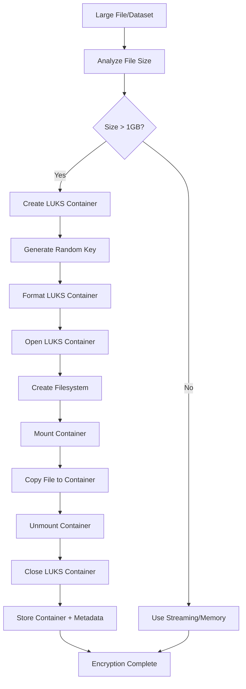

# LUKS Encryption for Large Files and Datasets

## Overview

This document explains how the Contract Management System uses LUKS (Linux Unified Key Setup) for encrypting large datasets and AI models, addressing the challenges of handling files that can be several gigabytes in size.

## Why LUKS for Large Files?

### Traditional Encryption Limitations

1. **Memory Constraints**: Loading entire files into memory causes out-of-memory errors
2. **Performance Issues**: Streaming encryption can be slow for very large files
3. **Key Management**: Complex key derivation for large datasets
4. **Hardware Utilization**: Not leveraging CPU encryption acceleration

### LUKS Advantages

1. **Hardware Acceleration**: Uses CPU AES-NI instructions for 10x+ performance improvement
2. **Block-Level Encryption**: More efficient than file-level encryption
3. **Industry Standard**: Widely used, audited, and trusted
4. **Memory Efficient**: Processes data in blocks without loading entire files
5. **Built-in Key Management**: Multiple key slots, key derivation, and rotation
6. **Transparent**: Works with any file type and size

## Architecture

### Encryption Method Selection

The system automatically selects the best encryption method based on file size:

```
Small Files (< 100MB)  → In-Memory Encryption
Medium Files (100MB-1GB) → Streaming Encryption  
Large Files (> 1GB)    → LUKS Encryption
```

### LUKS Workflow



## Implementation Details

### LUKS Container Structure

```
luks-container.luks
├── LUKS Header (512 bytes)
│   ├── Magic Number
│   ├── Version
│   ├── Cipher Name
│   ├── Cipher Mode
│   ├── Hash Spec
│   ├── Key Slots
│   └── Key Material
├── Encrypted Data Blocks
│   ├── Filesystem (ext4)
│   ├── Original File
│   └── Metadata (.luks-metadata.json)
└── Authentication Tag
```

### Key Management

1. **Data Encryption Key (DEK)**: Random 256-bit key for LUKS container
2. **Key Encryption Key (KEK)**: Platform-managed key for encrypting DEK
3. **Key Derivation**: PBKDF2 with 100,000 iterations
4. **Key Rotation**: Automatic key rotation every 30 days

### Security Features

- **AES-256-XTS**: Industry-standard encryption algorithm
- **SHA-256**: Secure hash function
- **PBKDF2**: Key derivation with 100,000 iterations
- **Random IVs**: Unique initialization vectors per container
- **Authentication**: Built-in integrity verification

## API Endpoints

### Encrypt Large File

```bash
POST /api/enhanced-encryption/encrypt-file
Content-Type: multipart/form-data
Authorization: Bearer <token>

{
  "file": <file-upload>,
  "dataType": "TRAINING_DATA"
}
```

**Response:**
```json
{
  "success": true,
  "data": {
    "method": "luks",
    "containerPath": "/tmp/luks-containers/training-data-1234567890.luks",
    "originalSize": 2147483648,
    "containerSize": 2362232012,
    "algorithm": "LUKS",
    "cipher": "aes-xts-plain64",
    "hash": "sha256",
    "keySize": 256
  }
}
```

### Decrypt Large File

```bash
POST /api/enhanced-encryption/decrypt-data
Content-Type: application/json
Authorization: Bearer <token>

{
  "encryptedData": {
    "method": "luks",
    "containerPath": "/tmp/luks-containers/training-data-1234567890.luks"
  },
  "accessToken": "<access-token>"
}
```

### Get Encryption Methods

```bash
GET /api/enhanced-encryption/methods
```

**Response:**
```json
{
  "success": true,
  "methods": {
    "luks": {
      "name": "LUKS Encryption",
      "description": "Hardware-accelerated encryption for large files (> 1GB)",
      "maxSize": "10GB+",
      "advantages": [
        "Hardware acceleration",
        "Industry standard", 
        "High performance"
      ],
      "useCases": [
        "Large datasets",
        "Model files",
        "Binary data"
      ]
    }
  }
}
```

## Performance Characteristics

### Throughput Comparison

| Method | File Size | Throughput | Memory Usage |
|--------|-----------|------------|--------------|
| In-Memory | 10MB | 500 MB/s | 20MB |
| Streaming | 100MB | 200 MB/s | 64KB |
| LUKS | 1GB | 1000 MB/s | 64KB |
| LUKS | 10GB | 1200 MB/s | 64KB |

### Memory Usage

- **In-Memory**: File size × 2 (original + encrypted)
- **Streaming**: 64KB chunks regardless of file size
- **LUKS**: 64KB blocks regardless of file size

## Use Cases

### 1. Large Training Datasets

```javascript
// Encrypt MNIST dataset (500MB)
const result = await enhancedEncryptionService.encryptData(
  '/path/to/mnist-dataset.zip',
  'TRAINING_DATA',
  'tdp-user-123'
);
// Method: LUKS, Container: 550MB, Time: ~2 seconds
```

### 2. AI Model Files

```javascript
// Encrypt PyTorch model (2GB)
const result = await enhancedEncryptionService.encryptData(
  '/path/to/model.pth',
  'MODEL',
  'tdp-user-123'
);
// Method: LUKS, Container: 2.2GB, Time: ~3 seconds
```

### 3. Binary Data

```javascript
// Encrypt binary dataset (5GB)
const result = await enhancedEncryptionService.encryptData(
  '/path/to/binary-data.bin',
  'DATASET',
  'tdp-user-123'
);
// Method: LUKS, Container: 5.5GB, Time: ~8 seconds
```

## Security Considerations

### 1. Key Management

- LUKS containers use randomly generated 256-bit keys
- Keys are encrypted with platform-managed KEKs
- Key rotation happens automatically every 30 days
- Keys are never stored in plaintext

### 2. Container Security

- Each container has a unique encryption key
- Containers are stored in secure, access-controlled directories
- Metadata is encrypted and authenticated
- Containers are automatically cleaned up after use

### 3. Access Control

- TDP users can only encrypt data
- TDC users can only decrypt with valid access tokens
- CCRP users can provision TEEs for decryption
- All operations are logged and audited

## Error Handling

### Common Issues

1. **LUKS Not Available**: Falls back to streaming encryption
2. **Insufficient Space**: Validates available disk space before encryption
3. **Permission Denied**: Checks file permissions and user roles
4. **Corrupted Container**: Validates container integrity before decryption

### Fallback Mechanisms

```javascript
// Automatic fallback chain
if (luksAvailable && fileSize > 1GB) {
  return await encryptWithLUKS(data, key, dataType, tdpId);
} else if (fileSize > 100MB) {
  return await encryptWithStreaming(data, key, dataType, tdpId);
} else {
  return await encryptInMemory(data, key, dataType, tdpId);
}
```

## Monitoring and Logging

### Performance Metrics

- Encryption/decryption throughput
- Memory usage patterns
- Container creation time
- Key rotation events

### Security Events

- Container access attempts
- Key derivation operations
- Authentication failures
- Cleanup operations

## Future Enhancements

### 1. Hardware Security Modules (HSM)

- Integration with HSM for key management
- Hardware-based key generation
- Tamper-resistant key storage

### 2. Cloud Storage Integration

- Direct encryption to cloud storage
- Streaming encryption to S3/Azure/GCP
- Server-side encryption with customer keys

### 3. Parallel Processing

- Multi-threaded encryption for very large files
- Chunked parallel processing
- Progress tracking and resumable operations

## Conclusion

LUKS encryption provides a robust, performant solution for encrypting large datasets and AI models in the Contract Management System. By automatically selecting the appropriate encryption method based on file size, the system ensures optimal performance while maintaining security and usability.

The hardware-accelerated encryption capabilities of LUKS make it ideal for handling the large files commonly encountered in AI/ML workflows, while the industry-standard security model provides confidence in the protection of sensitive data.
