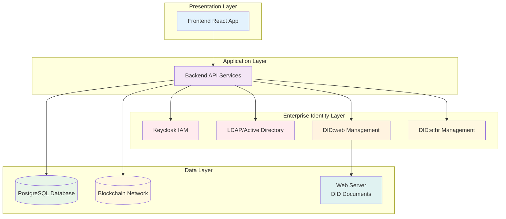

# Contract Management System
## Enterprise-Grade Contract Management with DID and IAM Integration

A comprehensive contract management system that combines blockchain technology, Decentralized Identifiers (DIDs), and enterprise Identity and Access Management (IAM) for secure, transparent, and efficient contract lifecycle management.

**Document Version:** 3.0  
**Date:** December 2024  
**Author:** Contract Management System Team

---

## 🌟 Key Features

### 🔐 **Identity Management**
- **Enterprise IAM Integration**: Full Keycloak integration for enterprise-grade authentication and authorization
- **Decentralized Identifiers (DIDs)**: Primary support for `did:web` with `did:ethr` for blockchain operations
- **Enterprise DID Strategy**: 
  - **did:web**: **Primary choice** for enterprise organizations (e.g., `did:web:company.com:employees:john.doe`)
  - **did:ethr**: For blockchain-specific operations and individual users (e.g., `did:ethr:goerli:0x1234567890abcdef...`)
- **Enterprise Benefits**:
  - **Cost-effective**: No blockchain gas fees for identity management
  - **Fast resolution**: HTTP-based DID resolution with caching
  - **Organization control**: Full control over identity infrastructure
  - **Compliance ready**: Meets enterprise security and audit requirements
- **Bring Your Own DID**: Users can integrate their existing DIDs for identity continuity
- **Multi-factor Authentication**: Enhanced security with IAM-based MFA
- **Role-based Access Control**: TDP, TDC, and CCRP roles with specific permissions

### 📋 **Contract Management**
- **Smart Contract Integration**: Ethereum-based smart contracts for immutable contract storage
- **Multi-party Signing**: Support for TDP, TDC, and CCRP parties
- **DID-based Signing**: Cryptographic contract signing using DIDs
- **Contract Lifecycle Management**: Complete workflow from creation to execution
- **Audit Trail**: Immutable blockchain records of all contract activities

### 🗄️ **Data Management**
- **Dataset Management**: Secure dataset creation and management for TDPs
- **Access Control**: Granular permissions for dataset access
- **Data Privacy**: Privacy-preserving data sharing mechanisms
- **Compliance Tracking**: Built-in compliance and audit features

### 🔒 **Security & Compliance**
- **Zero-trust Architecture**: Comprehensive security model
- **Cryptographic Verification**: All operations cryptographically verified
- **Audit Logging**: Complete audit trail for compliance
- **Data Encryption**: End-to-end encryption for sensitive data
- **Privacy by Design**: Privacy-preserving identity management

## 🏗️ Architecture

The system is built with a modern, scalable architecture:

- **Frontend**: React-based user interface with Material-UI
- **Backend**: Node.js/Express API with comprehensive IAM integration
- **Database**: PostgreSQL with advanced indexing and security
- **Blockchain**: Ethereum smart contracts for immutable storage
- **IAM**: Keycloak for enterprise identity management
- **DID**: Decentralized identifier support for self-sovereign identity

### System Layers


## 🚀 Getting Started

### Prerequisites
- Node.js (v16 or higher)
- PostgreSQL (v12 or higher)
- Docker and Docker Compose
- MetaMask or compatible Web3 wallet

### Quick Start
1. **Clone the repository**
2. **Set up environment variables** (see `.env.example`)
3. **Start the IAM services**: `docker-compose -f docker-compose.iam.yml up -d`
4. **Run database setup**: `cd backend && npm run setup`
5. **Start the backend**: `cd backend && npm start`
6. **Start the frontend**: `cd frontend && npm start`

### User Onboarding
1. **Register**: Create an account with your wallet and DID
2. **Verify Identity**: Complete IAM verification process
3. **Set Up Profile**: Configure your organization and role
4. **Start Managing Contracts**: Begin creating and managing contracts

## 🔧 DID Integration

### Enterprise DID Strategy

#### did:web (Primary Enterprise Choice)
**Best for**: Enterprise organizations with web domains
- **Format**: `did:web:[domain]:[path]`
- **Examples**:
  - `did:web:company.com` (organization main DID)
  - `did:web:company.com:legal` (department DID)
  - `did:web:company.com:employees:john.doe` (employee DID)
  - `did:web:company.com:roles:compliance-officer` (role-based DID)
- **Enterprise Benefits**:
  - **Cost-effective**: No blockchain gas fees
  - **Fast resolution**: HTTP-based with caching
  - **Organization control**: Full control over identity infrastructure
  - **Compliance ready**: Meets enterprise security requirements
  - **Scalable**: Easy to manage thousands of organizational DIDs
  - **Integration friendly**: Works with existing web infrastructure
- **Verification**: DID document resolution, domain validation, and SSL certificate verification

#### did:ethr (Blockchain Operations)
**Best for**: Blockchain-specific operations and individual users
- **Format**: `did:ethr:[network]:[ethereum-address]`
- **Examples**: 
  - `did:ethr:goerli:0x1234567890abcdef...` (testnet)
  - `did:ethr:mainnet:0x1234567890abcdef...` (mainnet)
- **Benefits**:
  - Fully decentralized
  - Works with existing MetaMask wallets
  - Built-in cryptographic verification
  - Cross-platform compatibility
- **Verification**: Wallet signature verification

### System-Generated DIDs (did:ethr)
When users register without providing an existing DID, the system automatically generates a new `did:ethr` based on their wallet address. This DID is:
- Created using the Ethereum DID method
- Linked to their wallet address
- Stored securely in the database
- Used for all cryptographic operations

### User-Provided DIDs
Users can bring their existing DIDs from other platforms or systems. This feature:
- Maintains identity continuity across platforms
- Supports both `did:ethr` and `did:web` methods
- Requires cryptographic proof of ownership
- Enables self-sovereign identity principles

### DID Verification Process
When users provide an existing DID, the system verifies ownership through:

#### For did:ethr:
1. **Format Validation**: Ensures the DID follows correct standards
2. **Uniqueness Check**: Confirms the DID isn't already registered
3. **Ownership Proof**: Requires wallet signature to prove control
4. **DID Resolution**: Verifies the DID exists on the blockchain
5. **Document Validation**: Checks the DID document structure

#### For did:web:
1. **Format Validation**: Ensures the DID follows correct standards
2. **Uniqueness Check**: Confirms the DID isn't already registered
3. **DID Resolution**: Fetches DID document from web server
4. **Document Validation**: Checks the DID document structure
5. **Domain Verification**: Validates domain ownership and SSL certificate

## 🎯 Use Cases

### Training Data Providers (TDP)
- Create and manage datasets
- Set access permissions and pricing
- Monitor dataset usage and analytics
- Sign contracts for data sharing

### Training Data Consumers (TDC)
- Browse available datasets
- Initiate contract requests
- Manage contract negotiations
- Access purchased datasets

### Confidential Clean Room Providers (CCRP)
- Review contract compliance
- Verify data privacy requirements
- Sign contracts as compliance authority
- Monitor contract execution

## 🔒 Security Features

### Identity Security
- **Multi-factor Authentication**: IAM-based MFA support
- **Session Management**: Secure session handling
- **Access Control**: Role-based permissions
- **Audit Logging**: Complete access logs

### Data Security
- **End-to-End Encryption**: All sensitive data encrypted
- **Blockchain Immutability**: Tamper-proof contract storage
- **Cryptographic Verification**: All operations verified
- **Privacy Protection**: Data minimization principles

### DID Security
- **Ownership Verification**: Cryptographic proof of DID control
- **Key Management**: Secure key storage and rotation
- **Delegation Support**: Controlled DID delegation
- **Recovery Mechanisms**: Secure DID recovery options

## 📚 Documentation Structure

This project documentation is organized into 5 comprehensive files:

1. **[MAIN_README.md](MAIN_README.md)** - This file: Complete project overview and getting started
2. **[TECHNICAL_DOCUMENTATION.md](TECHNICAL_DOCUMENTATION.md)** - Architecture, API, and technical details
3. **[SETUP_AND_DEPLOYMENT.md](SETUP_AND_DEPLOYMENT.md)** - All setup, deployment, and configuration guides
4. **[USER_AND_SECURITY_GUIDES.md](USER_AND_SECURITY_GUIDES.md)** - User guides, security, and best practices
5. **[DID_AND_IAM_GUIDES.md](DID_AND_IAM_GUIDES.md)** - All DID and IAM related documentation

## 🛠️ Development

### Project Structure
```
ContractManagement/
├── backend/           # Node.js/Express API
├── frontend/          # React application
├── blockchain/        # Smart contracts
├── scripts/           # Setup and utility scripts
├── docs/              # Documentation
└── docker-compose.iam.yml  # IAM services
```

### Key Scripts
- `npm run dev` - Start development environment
- `npm run setup` - Initial setup and configuration
- `npm run test` - Run test suite
- `npm run deploy` - Deploy smart contracts

### Environment Variables
Copy `.env.example` to `.env` and configure:
- Database connection
- JWT secrets
- Blockchain network settings
- IAM configuration
- Email settings

## 🤝 Contributing

1. Fork the repository
2. Create a feature branch
3. Make your changes
4. Add tests for new functionality
5. Submit a pull request

## 📄 License

This project is licensed under the MIT License - see the LICENSE file for details.

## 🆘 Support

For support and questions:
- Check the documentation files
- Review the troubleshooting guides
- Open an issue on GitHub
- Contact the development team

---

**Note**: This system is designed for enterprise use with comprehensive security features. Always follow security best practices and keep all dependencies updated. 