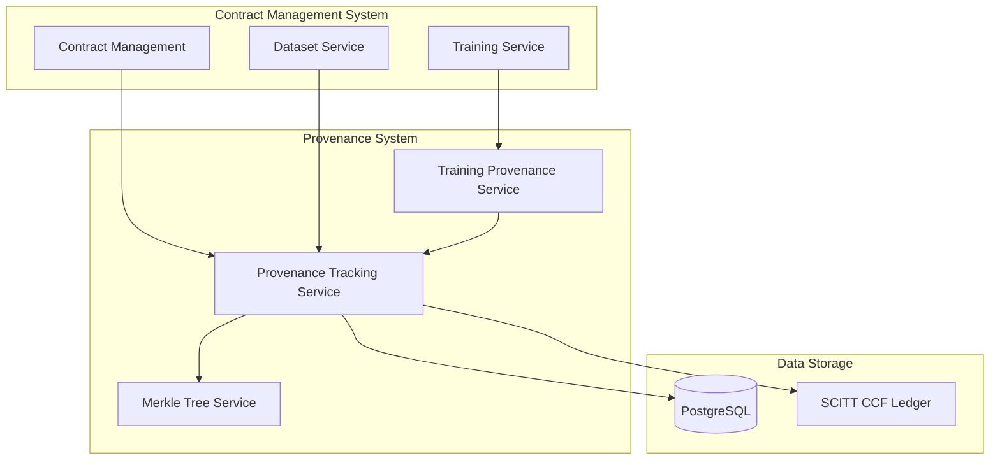
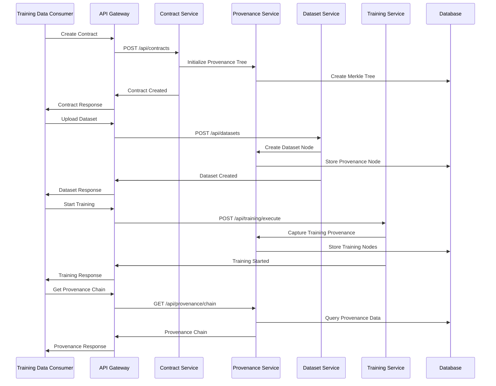

# 🔗 **Provenance Integration Guide**

## 📋 **Overview**

This guide explains how to integrate provenance tracking features with the existing Contract Management System. Provenance tracking provides complete auditability of AI model training processes, data lineage, and code execution.

## 🏗️ **Architecture Integration**

### **System Components**



### **Integration Points**

1. **Contract Creation** → Initialize Merkle tree
2. **Dataset Upload** → Create provenance nodes
3. **Training Execution** → Capture training provenance
4. **Model Delivery** → Complete provenance chain
5. **Audit & Compliance** → Generate audit reports

---

## 🔧 **Implementation Steps**

### **Step 1: Database Setup**

#### **1.1 Run Migration Scripts**
```bash
# Run provenance table migrations
cd backend
npm run migrate:provenance

# Verify tables created
psql -d contract_management -c "\dt *provenance*"
```

#### **1.2 Verify Database Schema**
```sql
-- Check Merkle trees table
SELECT table_name, column_name, data_type 
FROM information_schema.columns 
WHERE table_name = 'merkle_trees';

-- Check provenance nodes table
SELECT table_name, column_name, data_type 
FROM information_schema.columns 
WHERE table_name = 'provenance_nodes';
```

### **Step 2: Service Integration**

#### **2.1 Update Contract Service**
```javascript
// backend/services/contractService.js
const ProvenanceTrackingService = require('./provenanceTrackingService');

class ContractService {
  constructor() {
    this.provenanceService = new ProvenanceTrackingService();
  }
  
  async createContract(contractData) {
    // Create contract
    const contract = await this.createContractRecord(contractData);
    
    // Initialize provenance tracking
    await this.provenanceService.initializeProvenanceTracking({
      contractId: contract.contractId,
      treeType: 'BINARY_MERKLE_TREE',
      hashAlgorithm: 'SHA256'
    });
    
    return contract;
  }
}
```

#### **2.2 Update Dataset Service**
```javascript
// backend/services/datasetService.js
const ProvenanceTrackingService = require('./provenanceTrackingService');

class DatasetService {
  constructor() {
    this.provenanceService = new ProvenanceTrackingService();
  }
  
  async createDataset(datasetData) {
    // Create dataset
    const dataset = await this.createDatasetRecord(datasetData);
    
    // Create provenance node for dataset
    await this.provenanceService.createProvenanceNode({
      treeId: dataset.provenanceTreeId,
      nodeType: 'DATASET',
      content: dataset.name,
      metadata: {
        datasetName: dataset.name,
        size: dataset.size,
        recordCount: dataset.recordCount,
        dataSource: dataset.ownerId
      }
    });
    
    return dataset;
  }
}
```

#### **2.3 Update Training Service**
```javascript
// backend/services/trainingService.js
const TrainingProvenanceService = require('./trainingProvenanceService');

class TrainingService {
  constructor() {
    this.trainingProvenanceService = new TrainingProvenanceService();
  }
  
  async executeTraining(trainingJob) {
    // Start training
    const result = await this.startTraining(trainingJob);
    
    // Capture training provenance
    await this.trainingProvenanceService.captureTrainingProvenance({
      jobId: trainingJob.jobId,
      contractId: trainingJob.contractId,
      environmentId: trainingJob.environmentId,
      trainingConfig: trainingJob.config
    });
    
    return result;
  }
}
```

### **Step 3: API Endpoint Integration**

#### **3.1 Add Provenance Routes**
```javascript
// backend/routes/provenance.js
const express = require('express');
const router = express.Router();
const ProvenanceController = require('../controllers/provenanceController');
const auth = require('../middleware/auth');

// Merkle tree endpoints
router.post('/trees', auth, ProvenanceController.createTree);
router.get('/trees/:treeId', auth, ProvenanceController.getTree);
router.get('/trees', auth, ProvenanceController.listTrees);

// Provenance node endpoints
router.post('/nodes', auth, ProvenanceController.createNode);
router.get('/nodes/:nodeId', auth, ProvenanceController.getNode);
router.get('/nodes', auth, ProvenanceController.listNodes);

// Provenance capture endpoints
router.post('/captures', auth, ProvenanceController.createCapture);
router.get('/captures/:captureId', auth, ProvenanceController.getCapture);

// Verification endpoints
router.post('/verify', auth, ProvenanceController.verifyNode);
router.get('/verifications/:verificationId', auth, ProvenanceController.getVerification);

// Analytics endpoints
router.get('/chain/:contractId', auth, ProvenanceController.getProvenanceChain);
router.get('/lineage/:datasetId', auth, ProvenanceController.getDataLineage);
router.get('/stats', auth, ProvenanceController.getStats);
router.get('/audit/:contractId', auth, ProvenanceController.getAuditTrail);

module.exports = router;
```

#### **3.2 Register Routes in Main App**
```javascript
// backend/server.js
const provenanceRoutes = require('./routes/provenance');

// Register provenance routes
app.use('/api/provenance', provenanceRoutes);
```

### **Step 4: Frontend Integration**

#### **4.1 Create Provenance Components**
```javascript
// frontend/src/components/ProvenanceViewer.jsx
import React, { useState, useEffect } from 'react';
import { Card, CardContent, Typography, Box, Chip } from '@mui/material';

const ProvenanceViewer = ({ contractId }) => {
  const [provenanceData, setProvenanceData] = useState(null);
  const [loading, setLoading] = useState(true);

  useEffect(() => {
    fetchProvenanceChain();
  }, [contractId]);

  const fetchProvenanceChain = async () => {
    try {
      const response = await fetch(`/api/provenance/chain/${contractId}`, {
        headers: {
          'Authorization': `Bearer ${localStorage.getItem('token')}`
        }
      });
      const data = await response.json();
      setProvenanceData(data.data);
    } catch (error) {
      console.error('Error fetching provenance chain:', error);
    } finally {
      setLoading(false);
    }
  };

  if (loading) return <div>Loading provenance data...</div>;

  return (
    <Card>
      <CardContent>
        <Typography variant="h6" gutterBottom>
          Provenance Chain
        </Typography>
        <Box>
          {provenanceData?.chain.map((node, index) => (
            <Box key={node.nodeId} sx={{ mb: 2 }}>
              <Typography variant="subtitle2">
                {node.nodeType} - {node.nodeId}
              </Typography>
              <Chip 
                label={node.isVerified ? 'Verified' : 'Pending'} 
                color={node.isVerified ? 'success' : 'warning'}
                size="small"
              />
            </Box>
          ))}
        </Box>
      </CardContent>
    </Card>
  );
};

export default ProvenanceViewer;
```

#### **4.2 Integrate with Contract Details**
```javascript
// frontend/src/pages/ContractDetails.jsx
import ProvenanceViewer from '../components/ProvenanceViewer';

const ContractDetails = ({ contractId }) => {
  return (
    <div>
      {/* Existing contract details */}
      
      {/* Add provenance viewer */}
      <ProvenanceViewer contractId={contractId} />
    </div>
  );
};
```

---

## 🔄 **Workflow Integration**

### **Complete Provenance Workflow**



---

## 🧪 **Testing Integration**

### **Unit Tests**
```javascript
// backend/tests/provenance.test.js
const request = require('supertest');
const app = require('../server');
const { loadConfig } = require('../scripts/load-config');

describe('Provenance Integration', () => {
  let authToken;
  let contractId;
  let treeId;

  beforeAll(async () => {
    // Load test configuration
    loadConfig();
    
    // Get auth token
    const loginResponse = await request(app)
      .post('/api/auth/login')
      .send({
        email: 'test@example.com',
        password: 'password123'
      });
    authToken = loginResponse.body.accessToken;
  });

  test('Create Merkle Tree', async () => {
    const response = await request(app)
      .post('/api/provenance/trees')
      .set('Authorization', `Bearer ${authToken}`)
      .send({
        contractId: 'TEST-CONTRACT-001',
        treeType: 'BINARY_MERKLE_TREE',
        hashAlgorithm: 'SHA256'
      });

    expect(response.status).toBe(201);
    expect(response.body.success).toBe(true);
    expect(response.body.data.treeId).toBeDefined();
    treeId = response.body.data.treeId;
  });

  test('Create Provenance Node', async () => {
    const response = await request(app)
      .post('/api/provenance/nodes')
      .set('Authorization', `Bearer ${authToken}`)
      .send({
        treeId: treeId,
        nodeType: 'DATASET',
        content: 'Test Dataset',
        metadata: {
          datasetName: 'Test Dataset',
          size: '1MB'
        }
      });

    expect(response.status).toBe(201);
    expect(response.body.success).toBe(true);
    expect(response.body.data.nodeId).toBeDefined();
  });
});
```

### **Integration Tests**
```javascript
// backend/tests/integration/provenance-integration.test.js
describe('Provenance Integration Flow', () => {
  test('Complete Provenance Workflow', async () => {
    // 1. Create contract (should create Merkle tree)
    const contractResponse = await request(app)
      .post('/api/contracts')
      .set('Authorization', `Bearer ${authToken}`)
      .send(contractData);

    expect(contractResponse.status).toBe(201);
    const contractId = contractResponse.body.data.contractId;

    // 2. Upload dataset (should create provenance node)
    const datasetResponse = await request(app)
      .post('/api/datasets')
      .set('Authorization', `Bearer ${authToken}`)
      .send(datasetData);

    expect(datasetResponse.status).toBe(201);

    // 3. Start training (should capture training provenance)
    const trainingResponse = await request(app)
      .post('/api/training/execute')
      .set('Authorization', `Bearer ${authToken}`)
      .send({
        contractId: contractId,
        datasetId: datasetResponse.body.data.datasetId
      });

    expect(trainingResponse.status).toBe(201);

    // 4. Verify provenance chain exists
    const provenanceResponse = await request(app)
      .get(`/api/provenance/chain/${contractId}`)
      .set('Authorization', `Bearer ${authToken}`);

    expect(provenanceResponse.status).toBe(200);
    expect(provenanceResponse.body.data.chain.length).toBeGreaterThan(0);
  });
});
```

---

## 📊 **Monitoring & Observability**

### **Health Checks**
```javascript
// backend/services/provenanceHealthService.js
class ProvenanceHealthService {
  async checkProvenanceHealth() {
    const checks = {
      database: await this.checkDatabaseConnection(),
      merkleTrees: await this.checkMerkleTreeIntegrity(),
      nodes: await this.checkNodeIntegrity(),
      verifications: await this.checkVerificationStatus()
    };

    return {
      status: Object.values(checks).every(check => check.status === 'healthy') ? 'healthy' : 'unhealthy',
      checks
    };
  }
}
```

### **Metrics Collection**
```javascript
// backend/middleware/provenanceMetrics.js
const provenanceMetrics = {
  treesCreated: 0,
  nodesAdded: 0,
  verificationsCompleted: 0,
  verificationFailures: 0
};

const trackProvenanceMetrics = (req, res, next) => {
  const originalSend = res.send;
  
  res.send = function(data) {
    // Track metrics based on endpoint
    if (req.path.includes('/trees') && req.method === 'POST') {
      provenanceMetrics.treesCreated++;
    } else if (req.path.includes('/nodes') && req.method === 'POST') {
      provenanceMetrics.nodesAdded++;
    } else if (req.path.includes('/verify') && req.method === 'POST') {
      if (res.statusCode === 200) {
        provenanceMetrics.verificationsCompleted++;
      } else {
        provenanceMetrics.verificationFailures++;
      }
    }
    
    originalSend.call(this, data);
  };
  
  next();
};
```

---

## 🚀 **Deployment Checklist**

### **Pre-deployment**
- [ ] Database migrations run successfully
- [ ] All unit tests pass
- [ ] Integration tests pass
- [ ] API documentation updated
- [ ] Frontend components tested

### **Deployment**
- [ ] Deploy backend services
- [ ] Deploy database changes
- [ ] Deploy frontend updates
- [ ] Verify API endpoints accessible
- [ ] Test end-to-end workflow

### **Post-deployment**
- [ ] Monitor system health
- [ ] Verify provenance data integrity
- [ ] Check audit trail generation
- [ ] Validate compliance reporting
- [ ] Performance monitoring

---

## 🔧 **Troubleshooting**

### **Common Issues**

#### **1. Database Connection Issues**
```bash
# Check database connectivity
psql -h localhost -p 5432 -U postgres -d contract_management -c "SELECT 1;"

# Check provenance tables exist
psql -h localhost -p 5432 -U postgres -d contract_management -c "\dt *provenance*"
```

#### **2. Merkle Tree Integrity Issues**
```javascript
// Verify Merkle tree integrity
const verifyTreeIntegrity = async (treeId) => {
  const tree = await MerkleTree.findByPk(treeId);
  const nodes = await ProvenanceNode.findAll({ where: { treeId } });
  
  // Recalculate root hash
  const calculatedRoot = calculateMerkleRoot(nodes);
  
  if (calculatedRoot !== tree.rootHash) {
    throw new Error('Merkle tree integrity compromised');
  }
};
```

#### **3. Verification Failures**
```javascript
// Debug verification issues
const debugVerification = async (nodeId) => {
  const node = await ProvenanceNode.findByPk(nodeId);
  const tree = await MerkleTree.findByPk(node.treeId);
  
  console.log('Node:', node);
  console.log('Tree:', tree);
  console.log('Expected root:', tree.rootHash);
  
  // Generate proof
  const proof = generateMerkleProof(node, tree);
  console.log('Generated proof:', proof);
};
```

---

## 📚 **Additional Resources**

- [Provenance API Documentation](./API_PROVENANCE_ENDPOINTS.md)
- [Merkle Tree Implementation Guide](./MERKLE_TREE_PROVENANCE_IMPLEMENTATION.md)
- [Training Provenance Plan](./TRAINING_PROVENANCE_TRACKING_PLAN.md)
- [SCITT CCF Integration](./SCITT_CCF_ARCHITECTURE.md)
