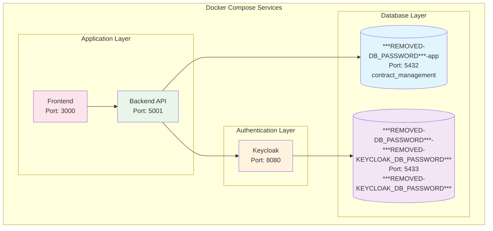

# Secrets Management Guide

This document explains how secrets and sensitive configuration are managed in the Contract Management System, following Docker Compose best practices.

## Overview

We use a **separation of concerns** approach where:
- **Public configuration** goes in `config.env` (tracked in git)
- **Sensitive data** goes in `secrets.env.local` (NOT tracked in git)
- **Docker Compose** automatically loads both files via `.env`

## Database Architecture

The system uses **two separate PostgreSQL instances**:

1. **`***REMOVED-DB_PASSWORD***-app`** (Application Database)
   - Port: 5432
   - Database: `contract_management`
   - User: `***REMOVED-DB_PASSWORD***`
   - Used by: Backend API, application data

2. **`***REMOVED-DB_PASSWORD***-***REMOVED-KEYCLOAK_DB_PASSWORD***`** (Keycloak Database)
   - Port: 5433
   - Database: `***REMOVED-KEYCLOAK_DB_PASSWORD***`
   - User: `***REMOVED-KEYCLOAK_DB_PASSWORD***`
   - Used by: Keycloak authentication service

This separation provides:
- **Security isolation** between application and authentication data
- **Independent scaling** of databases
- **Clear separation of concerns**
- **Easier backup and maintenance**

### Database Architecture Diagram



## File Structure

```
├── config.env              # Public configuration (tracked in git)
├── config.env.example      # Template for public configuration
├── secrets.env             # Template for secrets (tracked in git)
├── secrets.env.local       # Actual secrets (NOT tracked in git)
├── .env                    # Combined file for Docker Compose (NOT tracked in git)
└── setup-environment.sh    # Setup script
```

## Quick Start

1. **Run the setup script:**
   ```bash
   ./setup-environment.sh
   ```

2. **Edit your secrets:**
   ```bash
   nano secrets.env.local
   ```

3. **Test your configuration:**
   ```bash
   docker-compose -f docker-compose.dev.yml config
   ```

## Configuration Files

### `config.env` - Public Configuration
Contains non-sensitive configuration that can be safely committed to git:
- Database host/port/name
- Service URLs
- Feature flags
- Log levels
- Port mappings

### `secrets.env` - Secrets Template
Template file showing what secrets are needed:
- Database passwords
- JWT secrets
- API keys
- Admin passwords
- Vault tokens

### `secrets.env.local` - Actual Secrets
Your local secrets file (created by setup script):
- Contains actual secret values
- **NEVER commit this file to git**
- Used for local development

### `.env` - Combined Configuration
Auto-generated file that combines `config.env` and `secrets.env.local`:
- Used by Docker Compose
- **NEVER commit this file to git**
- Regenerated by setup script

## Security Best Practices

### ✅ DO:
- Use `secrets.env.local` for actual secrets
- Keep `config.env` for public configuration
- Run `./setup-environment.sh` to set up environment
- Test configuration with `docker-compose config`
- Use strong, unique secrets in production

### ❌ DON'T:
- Commit `secrets.env.local` to git
- Commit `.env` to git
- Put secrets in `config.env`
- Use default/example secrets in production
- Share `secrets.env.local` files

## Environment Variables

### Database Configuration
```bash
# Public (config.env)
# Application Database (***REMOVED-DB_PASSWORD***-app)
DB_HOST=localhost
DB_PORT=5432
DB_NAME=contract_management
DB_USER=***REMOVED-DB_PASSWORD***

# Keycloak Database (***REMOVED-DB_PASSWORD***-***REMOVED-KEYCLOAK_DB_PASSWORD***)
KEYCLOAK_DB_PORT=5433
KEYCLOAK_DB_NAME=***REMOVED-KEYCLOAK_DB_PASSWORD***
KEYCLOAK_DB_USER=***REMOVED-KEYCLOAK_DB_PASSWORD***

# Secrets (secrets.env.local)
DB_PASSWORD=your-app-db-password
KEYCLOAK_DB_PASSWORD=your-***REMOVED-KEYCLOAK_DB_PASSWORD***-db-password
```

### Keycloak Configuration
```bash
# Public (config.env)
KEYCLOAK_URL=https://localhost:8443
KEYCLOAK_REALM=contract-management
KEYCLOAK_CLIENT_ID=contract-management-frontend
KEYCLOAK_ADMIN_USER=admin

# Secret (secrets.env.local)
KEYCLOAK_CLIENT_SECRET=your-client-secret
KEYCLOAK_ADMIN_PASSWORD=your-admin-password
```

### JWT Configuration
```bash
# Public (config.env)
JWT_EXPIRES_IN=24h

# Secret (secrets.env.local)
JWT_SECRET=your-super-secure-jwt-secret
```

## Docker Compose Integration

Docker Compose automatically loads environment variables from:
1. `.env` file (auto-generated)
2. `env_file` directives in services
3. `environment` sections in services

### Service Configuration
```yaml
services:
  backend:
    env_file:
      - config.env
      - secrets.env
    environment:
      NODE_ENV: ${NODE_ENV}
      PORT: ${PORT}
      DB_PASSWORD: ${DB_PASSWORD}
      JWT_SECRET: ${JWT_SECRET}
```

## Production Deployment

For production, use proper secrets management:

### Option 1: Environment Variables
```bash
export DB_PASSWORD="production-password"
export JWT_SECRET="production-jwt-secret"
docker-compose -f docker-compose.prod.yml up -d
```

### Option 2: Docker Secrets
```yaml
services:
  backend:
    secrets:
      - db_password
      - jwt_secret
    environment:
      DB_PASSWORD_FILE: /run/secrets/db_password
      JWT_SECRET_FILE: /run/secrets/jwt_secret

secrets:
  db_password:
    external: true
  jwt_secret:
    external: true
```

### Option 3: External Secrets Manager
- HashiCorp Vault
- AWS Secrets Manager
- Azure Key Vault
- Kubernetes Secrets

## Troubleshooting

### Missing Environment Variables
```bash
# Check if .env file exists
ls -la .env

# Regenerate .env file
./setup-environment.sh

# Test configuration
docker-compose -f docker-compose.dev.yml config
```

### Secrets Not Loading
```bash
# Check secrets file exists
ls -la secrets.env.local

# Verify secrets are in .env
grep "DB_PASSWORD" .env

# Check Docker Compose logs
docker-compose -f docker-compose.dev.yml logs backend
```

### Configuration Validation
```bash
# Validate Docker Compose syntax
docker-compose -f docker-compose.dev.yml config

# Check for missing variables
docker-compose -f docker-compose.dev.yml config 2>&1 | grep "not set"
```

## Migration from Old Configuration

If you have existing configuration files:

1. **Backup existing config:**
   ```bash
   cp config.env config.env.backup
   ```

2. **Run setup script:**
   ```bash
   ./setup-environment.sh
   ```

3. **Move secrets to secrets.env.local:**
   ```bash
   # Edit secrets.env.local with your actual values
   nano secrets.env.local
   ```

4. **Remove secrets from config.env:**
   ```bash
   # Remove lines like:
   # DB_PASSWORD=***REMOVED-DB_PASSWORD***
   # JWT_SECRET=your-secret
   ```

5. **Test configuration:**
   ```bash
   docker-compose -f docker-compose.dev.yml config
   ```

## File Permissions

Ensure proper file permissions:
```bash
# Make setup script executable
chmod +x setup-environment.sh

# Secure secrets file
chmod 600 secrets.env.local
chmod 600 .env
```

## Git Integration

The following files are in `.gitignore`:
- `secrets.env.local` - Your local secrets
- `.env` - Combined configuration
- `*.secrets` - Any secrets files

The following files are tracked in git:
- `config.env` - Public configuration
- `config.env.example` - Configuration template
- `secrets.env` - Secrets template
- `setup-environment.sh` - Setup script

This ensures that:
- ✅ Configuration templates are shared
- ✅ Actual secrets stay local
- ✅ No sensitive data is committed
- ✅ Easy setup for new developers
