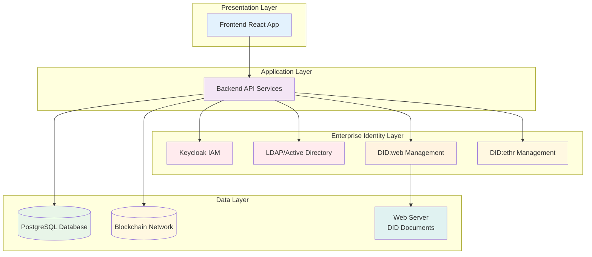
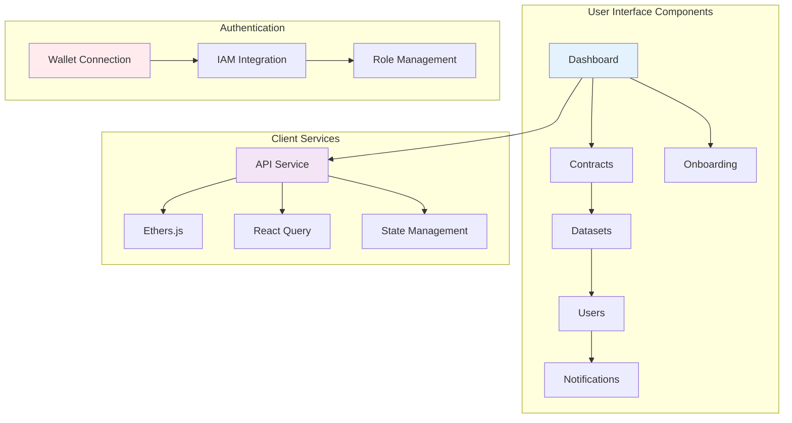
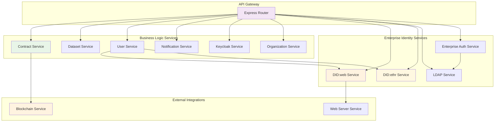
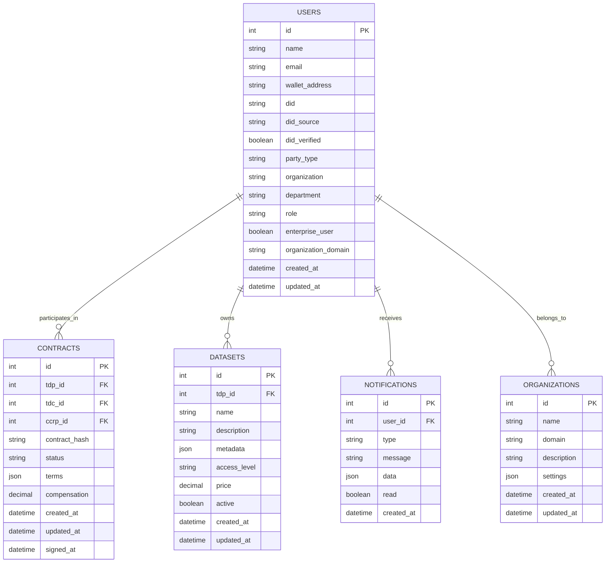

# Technical Documentation
## Contract Management System

Complete technical architecture, API documentation, and implementation details for the Contract Management System.

**Document Version:** 3.0  
**Date:** December 2024  
**Author:** Contract Management System Team

---

## Table of Contents

1. [System Architecture](#system-architecture)
2. [Frontend Architecture](#frontend-architecture)
3. [Backend Architecture](#backend-architecture)
4. [Database Design](#database-design)
5. [API Documentation](#api-documentation)
6. [Smart Contract Architecture](#smart-contract-architecture)
7. [Security Architecture](#security-architecture)
8. [Performance Considerations](#performance-considerations)
9. [Monitoring and Logging](#monitoring-and-logging)

---

## System Architecture

### Overview
The Contract Management System follows a **layered architecture** with clear separation of concerns. The system is designed for enterprise scalability with comprehensive security features.

### System Layers


### Key Components

#### Frontend (React)
- **Technology**: React 18 with Material-UI
- **State Management**: React Context + Hooks
- **Web3 Integration**: Ethers.js for blockchain interaction
- **HTTP Client**: Axios for API communication
- **Routing**: React Router for navigation

#### Backend (Node.js/Express)
- **Technology**: Node.js with Express.js
- **Authentication**: JWT with Keycloak integration
- **Database**: PostgreSQL with Sequelize ORM
- **Blockchain**: Web3.js for smart contract interaction
- **Validation**: Joi for request validation

#### Database (PostgreSQL)
- **Version**: PostgreSQL 13+
- **ORM**: Sequelize with migrations
- **Indexing**: Optimized for query performance
- **Backup**: Automated backup strategy

#### Blockchain (Ethereum)
- **Network**: Goerli testnet (development), Mainnet (production)
- **Smart Contracts**: Solidity with Hardhat framework
- **Gas Optimization**: Efficient contract design
- **Security**: Comprehensive testing and auditing

---

## Frontend Architecture

### React Application Structure


### Component Hierarchy
```
src/
├── components/
│   ├── Layout/
│   │   ├── Header.js
│   │   ├── Sidebar.js
│   │   └── Footer.js
│   ├── Contract/
│   │   ├── ContractList.js
│   │   ├── ContractDetail.js
│   │   └── ContractForm.js
│   ├── Dataset/
│   │   ├── DatasetList.js
│   │   ├── DatasetDetail.js
│   │   └── DatasetForm.js
│   ├── User/
│   │   ├── UserProfile.js
│   │   ├── UserList.js
│   │   └── UserForm.js
│   └── Common/
│       ├── Loading.js
│       ├── ErrorBoundary.js
│       └── Modal.js
├── pages/
│   ├── Dashboard.js
│   ├── Contracts.js
│   ├── Datasets.js
│   ├── Users.js
│   └── Profile.js
├── services/
│   ├── api.js
│   ├── web3.js
│   └── auth.js
├── contexts/
│   ├── UserContext.js
│   ├── ContractContext.js
│   └── Web3Context.js
└── utils/
    ├── constants.js
    ├── helpers.js
    └── validation.js
```

### State Management
- **User Context**: Global user state and authentication
- **Contract Context**: Contract-related state management
- **Web3 Context**: Blockchain connection and wallet state
- **Local State**: Component-specific state using React hooks

---

## Backend Architecture

### API Services Structure


### Service Layer Architecture
```
backend/
├── routes/
│   ├── auth.js
│   ├── contracts.js
│   ├── datasets.js
│   ├── users.js
│   ├── did.js
│   └── notifications.js
├── services/
│   ├── contractService.js
│   ├── datasetService.js
│   ├── userService.js
│   ├── notificationService.js
│   ├── blockchainService.js
│   ├── didService.js
│   ├── keycloakService.js
│   └── organizationService.js
├── models/
│   ├── Contract.js
│   ├── Dataset.js
│   ├── User.js
│   ├── Notification.js
│   └── Organization.js
├── middleware/
│   ├── auth.js
│   ├── validation.js
│   ├── errorHandler.js
│   └── rateLimiter.js
└── utils/
    ├── constants.js
    ├── helpers.js
    └── validation.js
```

### Authentication Flow
1. **User Registration**: Wallet connection + DID verification
2. **IAM Integration**: Keycloak authentication for enterprise users
3. **JWT Token**: Secure token-based session management
4. **Role-based Access**: TDP, TDC, CCRP permissions
5. **Session Management**: Secure session handling with refresh tokens

---

## Database Design

### Entity Relationship Diagram


### Database Schema

#### Users Table
```sql
CREATE TABLE users (
    id SERIAL PRIMARY KEY,
    name VARCHAR(255) NOT NULL,
    email VARCHAR(255) UNIQUE NOT NULL,
    wallet_address VARCHAR(42) UNIQUE NOT NULL,
    did VARCHAR(255) UNIQUE NOT NULL,
    did_source VARCHAR(50) DEFAULT 'SYSTEM_GENERATED',
    did_verified BOOLEAN DEFAULT FALSE,
    did_verification_method VARCHAR(50),
    party_type VARCHAR(10) CHECK (party_type IN ('TDP', 'TDC', 'CCRP')),
    organization VARCHAR(255),
    phone_number VARCHAR(20),
    website VARCHAR(255),
    location VARCHAR(255),
    description TEXT,
    public_key TEXT,
    onboarding_status VARCHAR(50) DEFAULT 'PENDING',
    profile_completed BOOLEAN DEFAULT FALSE,
    enterprise_user BOOLEAN DEFAULT FALSE,
    organization_domain VARCHAR(255),
    department VARCHAR(100),
    role VARCHAR(100),
    employee_id VARCHAR(50),
    created_at TIMESTAMP DEFAULT CURRENT_TIMESTAMP,
    updated_at TIMESTAMP DEFAULT CURRENT_TIMESTAMP,
    last_login_at TIMESTAMP
);
```

#### Contracts Table
```sql
CREATE TABLE contracts (
    id SERIAL PRIMARY KEY,
    tdp_id INTEGER REFERENCES users(id),
    tdc_id INTEGER REFERENCES users(id),
    ccrp_id INTEGER REFERENCES users(id),
    contract_hash VARCHAR(66) UNIQUE,
    status VARCHAR(20) DEFAULT 'DRAFT',
    terms JSONB,
    compensation DECIMAL(18,8),
    tdp_signed BOOLEAN DEFAULT FALSE,
    tdc_signed BOOLEAN DEFAULT FALSE,
    ccrp_signed BOOLEAN DEFAULT FALSE,
    tdp_signature TEXT,
    tdc_signature TEXT,
    ccrp_signature TEXT,
    created_at TIMESTAMP DEFAULT CURRENT_TIMESTAMP,
    updated_at TIMESTAMP DEFAULT CURRENT_TIMESTAMP,
    signed_at TIMESTAMP
);
```

#### Datasets Table
```sql
CREATE TABLE datasets (
    id SERIAL PRIMARY KEY,
    tdp_id INTEGER REFERENCES users(id),
    name VARCHAR(255) NOT NULL,
    description TEXT,
    metadata JSONB,
    access_level VARCHAR(20) DEFAULT 'PUBLIC',
    price DECIMAL(18,8) DEFAULT 0,
    active BOOLEAN DEFAULT TRUE,
    created_at TIMESTAMP DEFAULT CURRENT_TIMESTAMP,
    updated_at TIMESTAMP DEFAULT CURRENT_TIMESTAMP
);
```

### Indexing Strategy
- **Primary Keys**: Auto-incrementing integers
- **Foreign Keys**: Indexed for join performance
- **Search Fields**: Full-text search on descriptions
- **Status Fields**: Indexed for filtering
- **Timestamps**: Indexed for sorting and date range queries

---

## API Documentation

### Base Configuration
- **Base URL**: `http://localhost:3001/api`
- **Authentication**: Bearer token in Authorization header
- **Content-Type**: `application/json`
- **Rate Limiting**: 100 requests per minute per IP

### Authentication Endpoints

#### Register User
**POST** `/auth/register`

Register a new user with support for both `did:web` (primary for enterprise) and `did:ethr` (for blockchain operations).

**Request Body:**
```json
{
  "name": "John Doe",
  "email": "john@example.com",
  "partyType": "TDP",
  "walletAddress": "0x1234567890abcdef...",
  "publicKey": "0xabcdef123456...",
  "description": "Optional description",
  "organization": "Company Name",
  "phoneNumber": "+1234567890",
  "website": "https://example.com",
  "location": "New York, USA",
  "existingDID": "did:web:company.com:user:john.doe",
  "didVerificationSignature": "0xsignature...",
  "enterpriseUser": false,
  "organizationDomain": "company.com",
  "department": "Engineering",
  "role": "Developer",
  "employeeId": "EMP001"
}
```

**Response:**
```json
{
  "success": true,
  "message": "User registered successfully",
  "user": {
    "id": 1,
    "name": "John Doe",
    "email": "john@example.com",
    "partyType": "TDP",
    "walletAddress": "0x1234567890abcdef...",
    "did": "did:web:company.com:user:john.doe",
    "didSource": "USER_PROVIDED",
    "didVerified": true,
    "didVerificationMethod": "web_resolution",
    "onboardingStatus": "COMPLETED",
    "profileCompleted": true,
    "enterpriseUser": true,
    "organizationDomain": "company.com",
    "department": "Engineering",
    "role": "Developer",
    "employeeId": "EMP001",
    "createdAt": "2024-12-01T10:00:00.000Z"
  }
}
```

#### Login User
**POST** `/auth/login`

**Request Body:**
```json
{
  "walletAddress": "0x1234567890abcdef...",
  "signature": "0xsignature...",
  "message": "Login message to sign"
}
```

**Response:**
```json
{
  "success": true,
  "message": "Login successful",
  "token": "jwt_token_here",
  "user": {
    "id": 1,
    "name": "John Doe",
    "email": "john@example.com",
    "partyType": "TDP",
    "walletAddress": "0x1234567890abcdef...",
    "did": "did:web:company.com:user:john.doe",
    "didSource": "USER_PROVIDED",
    "didVerified": true,
    "onboardingStatus": "COMPLETED",
    "enterpriseUser": true,
    "organizationDomain": "company.com"
  }
}
```

### User Management Endpoints

#### Get User Profile
**GET** `/users/profile`

**Headers:** `Authorization: Bearer <token>`

**Response:**
```json
{
  "success": true,
  "user": {
    "id": 1,
    "name": "John Doe",
    "email": "john@example.com",
    "partyType": "TDP",
    "walletAddress": "0x1234567890abcdef...",
    "publicKey": "0xabcdef123456...",
    "did": "did:web:company.com:user:john.doe",
    "didSource": "USER_PROVIDED",
    "didVerified": true,
    "didVerificationMethod": "web_resolution",
    "onboardingStatus": "COMPLETED",
    "profileCompleted": true,
    "organization": "Company Name",
    "phoneNumber": "+1234567890",
    "website": "https://example.com",
    "location": "New York, USA",
    "enterpriseUser": true,
    "organizationDomain": "company.com",
    "department": "Engineering",
    "role": "Developer",
    "employeeId": "EMP001",
    "createdAt": "2024-12-01T10:00:00.000Z",
    "lastLoginAt": "2024-12-01T15:30:00.000Z"
  }
}
```

#### Update User Profile
**PUT** `/users/profile`

**Headers:** `Authorization: Bearer <token>`

**Request Body:**
```json
{
  "name": "John Doe Updated",
  "description": "Updated description",
  "organization": "Updated Company",
  "phoneNumber": "+1234567890",
  "website": "https://updated-example.com",
  "location": "San Francisco, USA",
  "department": "Product",
  "role": "Senior Developer"
}
```

#### Get All Users
**GET** `/users`

**Headers:** `Authorization: Bearer <token>`

**Query Parameters:**
- `enterpriseUser` (boolean): Filter by enterprise users
- `organizationDomain` (string): Filter by organization domain
- `department` (string): Filter by department
- `role` (string): Filter by role

### Contract Management Endpoints

#### Create Contract
**POST** `/contracts`

**Headers:** `Authorization: Bearer <token>`

**Request Body:**
```json
{
  "tdpId": 1,
  "ccrpId": 2,
  "datasets": [1, 2, 3],
  "terms": {
    "duration": "12 months",
    "usage": "AI training only",
    "restrictions": ["No redistribution", "No commercial use"]
  },
  "compensation": "1000.00"
}
```

#### Get Contracts
**GET** `/contracts`

**Headers:** `Authorization: Bearer <token>`

**Query Parameters:**
- `status` (string): Filter by contract status
- `partyType` (string): Filter by user's party type
- `limit` (number): Number of results (default: 10)
- `offset` (number): Pagination offset (default: 0)

#### Sign Contract
**POST** `/contracts/:id/sign`

**Headers:** `Authorization: Bearer <token>`

**Request Body:**
```json
{
  "signature": "0xsignature...",
  "message": "Contract signing message"
}
```

### Dataset Management Endpoints

#### Create Dataset
**POST** `/datasets`

**Headers:** `Authorization: Bearer <token>`

**Request Body:**
```json
{
  "name": "AI Training Dataset",
  "description": "High-quality dataset for AI training",
  "metadata": {
    "size": "1GB",
    "format": "JSON",
    "license": "MIT",
    "tags": ["AI", "training", "machine-learning"]
  },
  "accessLevel": "PUBLIC",
  "price": "100.00"
}
```

#### Get Datasets
**GET** `/datasets`

**Headers:** `Authorization: Bearer <token>`

**Query Parameters:**
- `tdpId` (number): Filter by TDP
- `accessLevel` (string): Filter by access level
- `active` (boolean): Filter by active status
- `search` (string): Search in name and description

### DID Management Endpoints

#### Verify DID
**POST** `/did/verify`

**Headers:** `Authorization: Bearer <token>`

**Request Body:**
```json
{
  "did": "did:web:company.com:user:john.doe",
  "signature": "0xsignature...",
  "message": "DID verification message"
}
```

#### Resolve DID
**GET** `/did/resolve/:did`

**Response:**
```json
{
  "success": true,
  "didDocument": {
    "@context": ["https://www.w3.org/ns/did/v1"],
    "id": "did:web:company.com:user:john.doe",
    "verificationMethod": [...],
    "authentication": [...],
    "service": [...]
  }
}
```

### Error Handling

#### Standard Error Response
```json
{
  "success": false,
  "error": {
    "code": "VALIDATION_ERROR",
    "message": "Invalid input parameters",
    "details": {
      "field": "email",
      "issue": "Email format is invalid"
    }
  }
}
```

#### Error Codes
- `AUTHENTICATION_ERROR`: Invalid or missing authentication
- `AUTHORIZATION_ERROR`: Insufficient permissions
- `VALIDATION_ERROR`: Invalid input parameters
- `NOT_FOUND`: Resource not found
- `CONFLICT`: Resource conflict (e.g., duplicate DID)
- `BLOCKCHAIN_ERROR`: Blockchain operation failed
- `DID_RESOLUTION_ERROR`: DID resolution failed
- `INTERNAL_ERROR`: Server internal error

---

## Smart Contract Architecture

### Contract Structure
```solidity
// SPDX-License-Identifier: MIT
pragma solidity ^0.8.0;

contract ContractManager {
    struct Contract {
        uint256 id;
        address tdp;
        address tdc;
        address ccrp;
        string contractHash;
        ContractStatus status;
        uint256 compensation;
        uint256 createdAt;
        uint256 signedAt;
        mapping(address => bool) signatures;
    }
    
    enum ContractStatus {
        DRAFT,
        PENDING_TDP,
        PENDING_CCRP,
        PENDING_SIGNATURES,
        ACTIVE,
        COMPLETED,
        CANCELLED
    }
    
    mapping(uint256 => Contract) public contracts;
    uint256 public contractCount;
    
    event ContractCreated(uint256 indexed contractId, address indexed tdc);
    event ContractSigned(uint256 indexed contractId, address indexed signer);
    event ContractStatusChanged(uint256 indexed contractId, ContractStatus status);
}
```

### Key Functions

#### Create Contract
```solidity
function createContract(
    address _tdp,
    address _ccrp,
    uint256 _compensation
) external returns (uint256) {
    require(_tdp != address(0), "Invalid TDP address");
    require(_ccrp != address(0), "Invalid CCRP address");
    require(_compensation > 0, "Compensation must be positive");
    
    contractCount++;
    Contract storage newContract = contracts[contractCount];
    
    newContract.id = contractCount;
    newContract.tdp = _tdp;
    newContract.tdc = msg.sender;
    newContract.ccrp = _ccrp;
    newContract.compensation = _compensation;
    newContract.status = ContractStatus.DRAFT;
    newContract.createdAt = block.timestamp;
    
    emit ContractCreated(contractCount, msg.sender);
    return contractCount;
}
```

#### Sign Contract
```solidity
function signContract(uint256 _contractId) external {
    Contract storage contract = contracts[_contractId];
    require(contract.id != 0, "Contract does not exist");
    require(!contract.signatures[msg.sender], "Already signed");
    
    // Verify signer is authorized
    require(
        msg.sender == contract.tdp ||
        msg.sender == contract.tdc ||
        msg.sender == contract.ccrp,
        "Not authorized to sign"
    );
    
    contract.signatures[msg.sender] = true;
    
    // Check if all parties have signed
    if (contract.signatures[contract.tdp] &&
        contract.signatures[contract.tdc] &&
        contract.signatures[contract.ccrp]) {
        contract.status = ContractStatus.ACTIVE;
        contract.signedAt = block.timestamp;
        emit ContractStatusChanged(_contractId, ContractStatus.ACTIVE);
    }
    
    emit ContractSigned(_contractId, msg.sender);
}
```

### Gas Optimization
- **Batch Operations**: Group multiple operations
- **Storage Optimization**: Use packed structs
- **Event Optimization**: Minimize event data
- **Function Optimization**: Reduce storage reads/writes

---

## Security Architecture

### Authentication & Authorization
- **Multi-factor Authentication**: IAM-based MFA support
- **JWT Tokens**: Secure token-based authentication
- **Role-based Access Control**: TDP, TDC, CCRP permissions
- **Session Management**: Secure session handling
- **Rate Limiting**: API rate limiting protection

### Data Security
- **Encryption at Rest**: Database encryption
- **Encryption in Transit**: TLS/SSL for all communications
- **Input Validation**: Comprehensive input sanitization
- **SQL Injection Protection**: Parameterized queries
- **XSS Protection**: Content Security Policy headers

### Blockchain Security
- **Private Key Management**: Secure key storage
- **Signature Verification**: Cryptographic verification
- **Replay Attack Protection**: Nonce-based protection
- **Access Control**: Contract-level permissions

### DID Security
- **Ownership Verification**: Cryptographic proof
- **Document Validation**: DID document verification
- **Key Rotation**: Secure key management
- **Delegation Control**: Controlled DID delegation

---

## Performance Considerations

### Database Optimization
- **Indexing Strategy**: Optimized indexes for queries
- **Query Optimization**: Efficient SQL queries
- **Connection Pooling**: Database connection management
- **Caching**: Redis caching for frequently accessed data

### API Performance
- **Response Caching**: HTTP caching headers
- **Pagination**: Efficient pagination for large datasets
- **Compression**: Gzip compression for responses
- **CDN Integration**: Content delivery network

### Blockchain Performance
- **Gas Optimization**: Efficient smart contract design
- **Batch Processing**: Group blockchain operations
- **Off-chain Processing**: Minimize on-chain operations
- **Network Selection**: Choose appropriate networks

### Frontend Performance
- **Code Splitting**: Lazy loading of components
- **Bundle Optimization**: Webpack optimization
- **Image Optimization**: Compressed images
- **Caching Strategy**: Browser caching

---

## Monitoring and Logging

### Application Monitoring
- **Health Checks**: API health monitoring
- **Performance Metrics**: Response time tracking
- **Error Tracking**: Error rate monitoring
- **User Analytics**: Usage analytics

### Blockchain Monitoring
- **Transaction Monitoring**: Transaction status tracking
- **Gas Usage**: Gas consumption monitoring
- **Network Status**: Blockchain network health
- **Contract Events**: Smart contract event monitoring

### Security Monitoring
- **Access Logs**: Authentication and authorization logs
- **Audit Trails**: Complete audit logging
- **Threat Detection**: Security threat monitoring
- **Compliance Monitoring**: Regulatory compliance tracking

### Logging Strategy
- **Structured Logging**: JSON-formatted logs
- **Log Levels**: DEBUG, INFO, WARN, ERROR
- **Log Aggregation**: Centralized log management
- **Log Retention**: Configurable retention policies

---

## Development Guidelines

### Code Standards
- **ESLint**: JavaScript/TypeScript linting
- **Prettier**: Code formatting
- **TypeScript**: Type safety for JavaScript
- **Jest**: Unit and integration testing

### Git Workflow
- **Feature Branches**: Branch-based development
- **Pull Requests**: Code review process
- **Semantic Versioning**: Version management
- **Changelog**: Release documentation

### Testing Strategy
- **Unit Tests**: Component and function testing
- **Integration Tests**: API integration testing
- **E2E Tests**: End-to-end testing
- **Security Tests**: Security vulnerability testing

### Deployment Pipeline
- **CI/CD**: Automated deployment pipeline
- **Environment Management**: Multiple environment support
- **Rollback Strategy**: Deployment rollback procedures
- **Monitoring**: Post-deployment monitoring

---

This technical documentation provides a comprehensive overview of the Contract Management System's architecture, implementation details, and technical considerations. For specific implementation details, refer to the individual service files and API documentation. 