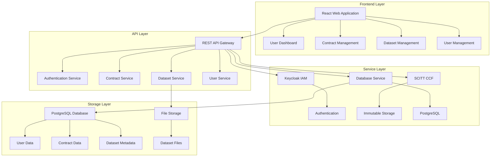

# Contract Management System Technical Reference

## 🎯 Overview

This document provides technical details for developers, system administrators, and technical stakeholders implementing or maintaining the Contract Management System.

## 🏗️ System Architecture

### **Core Components**



### **Technology Stack**
- **Frontend**: React 18, Material-UI, JavaScript
- **Backend**: Node.js, Express.js, Sequelize ORM
- **Database**: PostgreSQL with advanced indexing
- **Authentication**: Keycloak with JWT tokens
- **Storage**: Local file system with encryption
- **Security**: SCITT CCF for immutable records

## 🔧 API Reference

### **Authentication Endpoints**

#### **POST /api/auth/login**
Authenticate user and return JWT token.

**Request:**
```json
{
  "username": "user@example.com",
  "password": "password123"
}
```

**Response:**
```json
{
  "success": true,
  "token": "jwt_token_here",
  "user": {
    "id": 1,
    "username": "user@example.com",
    "role": "TDC",
    "firstLogin": false
  }
}
```

#### **POST /api/auth/first-login-password**
Change password on first login.

**Request:**
```json
{
  "token": "jwt_token_here",
  "newPassword": "new_password123"
}
```

### **Contract Endpoints**

#### **GET /api/contracts**
Get all contracts for the authenticated user.

**Response:**
```json
{
  "success": true,
  "contracts": [
    {
      "id": 1,
      "contractId": "CONTRACT_123",
      "title": "Data Sharing Agreement",
      "status": "active",
      "parties": ["TDC_123", "TDP_456", "CCRP_789"],
      "createdAt": "2024-01-01T00:00:00Z"
    }
  ]
}
```

#### **POST /api/contracts**
Create a new contract.

**Request:**
```json
{
  "title": "Data Sharing Agreement",
  "description": "Contract for sharing training data",
  "parties": ["TDC_123", "TDP_456", "CCRP_789"],
  "terms": {
    "dataUsage": "AI training only",
    "duration": "12 months",
    "pricing": "$1000/month"
  }
}
```

### **Dataset Endpoints**

#### **GET /api/datasets**
Get all datasets with filtering options.

**Query Parameters:**
- `category`: Filter by dataset category
- `domain`: Filter by dataset domain
- `search`: Search in dataset name/description

**Response:**
```json
{
  "success": true,
  "datasets": [
    {
      "id": 1,
      "datasetId": "DATASET_123",
      "name": "Medical Images Dataset",
      "category": "Healthcare",
      "domain": "Medical",
      "description": "Collection of medical images",
      "size": "10GB",
      "format": "DICOM",
      "createdAt": "2024-01-01T00:00:00Z"
    }
  ]
}
```

#### **GET /api/datasets/:datasetId**
Get detailed information about a specific dataset.

**Response:**
```json
{
  "success": true,
  "dataset": {
    "id": 1,
    "datasetId": "DATASET_123",
    "name": "Medical Images Dataset",
    "category": "Healthcare",
    "domain": "Medical",
    "description": "Collection of medical images",
    "metadata": {
      "size": "10GB",
      "format": "DICOM",
      "rows": 10000,
      "columns": 512
    },
    "accessControls": {
      "requiresContract": true,
      "allowedRoles": ["TDC"],
      "pricing": "$500/month"
    }
  }
}
```

### **User Management Endpoints**

#### **GET /api/users**
Get all users (admin only).

**Response:**
```json
{
  "success": true,
  "users": [
    {
      "id": 1,
      "username": "user@example.com",
      "role": "TDC",
      "status": "active",
      "createdAt": "2024-01-01T00:00:00Z"
    }
  ]
}
```

#### **GET /api/admin/users**
Get detailed user information for admin.

**Response:**
```json
{
  "success": true,
  "users": [
    {
      "id": 1,
      "username": "user@example.com",
      "role": "TDC",
      "status": "active",
      "profile": {
        "firstName": "John",
        "lastName": "Doe",
        "email": "user@example.com"
      },
      "createdAt": "2024-01-01T00:00:00Z"
    }
  ]
}
```

## 🗄️ Database Schema

### **Users Table**
```sql
CREATE TABLE users (
  id SERIAL PRIMARY KEY,
  username VARCHAR(255) UNIQUE NOT NULL,
  password_hash VARCHAR(255),
  role VARCHAR(50) NOT NULL,
  status VARCHAR(20) DEFAULT 'active',
  first_login BOOLEAN DEFAULT true,
  iam_user VARCHAR(255),
  created_at TIMESTAMP DEFAULT CURRENT_TIMESTAMP,
  updated_at TIMESTAMP DEFAULT CURRENT_TIMESTAMP
);
```

### **Contracts Table**
```sql
CREATE TABLE contracts (
  id SERIAL PRIMARY KEY,
  contract_id VARCHAR(255) UNIQUE NOT NULL,
  title VARCHAR(255) NOT NULL,
  description TEXT,
  status VARCHAR(50) DEFAULT 'draft',
  tdc_id INTEGER REFERENCES users(id),
  tdp_id INTEGER REFERENCES users(id),
  ccrp_id INTEGER REFERENCES users(id),
  terms JSONB,
  created_at TIMESTAMP DEFAULT CURRENT_TIMESTAMP,
  updated_at TIMESTAMP DEFAULT CURRENT_TIMESTAMP
);
```

### **Datasets Table**
```sql
CREATE TABLE datasets (
  id SERIAL PRIMARY KEY,
  dataset_id VARCHAR(255) UNIQUE NOT NULL,
  name VARCHAR(255) NOT NULL,
  description TEXT,
  category VARCHAR(100),
  domain VARCHAR(100),
  file_path VARCHAR(500),
  file_size BIGINT,
  file_format VARCHAR(50),
  metadata JSONB,
  tdp_id INTEGER REFERENCES users(id),
  created_at TIMESTAMP DEFAULT CURRENT_TIMESTAMP,
  updated_at TIMESTAMP DEFAULT CURRENT_TIMESTAMP
);
```

### **Signatures Table**
```sql
CREATE TABLE signatures (
  id SERIAL PRIMARY KEY,
  contract_id INTEGER REFERENCES contracts(id),
  user_id INTEGER REFERENCES users(id),
  signature_data TEXT NOT NULL,
  algorithm VARCHAR(50) NOT NULL,
  scitt_claim_id VARCHAR(255),
  created_at TIMESTAMP DEFAULT CURRENT_TIMESTAMP
);
```

## 🔐 Security Implementation

### **Authentication & Authorization**

#### **JWT Token Structure**
```javascript
{
  "sub": "user_id",
  "username": "user@example.com",
  "role": "TDC",
  "iat": 1640995200,
  "exp": 1641081600
}
```

#### **Role-Based Access Control**
```javascript
// Middleware for role-based access
const requireRole = (roles) => {
  return (req, res, next) => {
    if (!req.user || !roles.includes(req.user.role)) {
      return res.status(403).json({ error: 'Insufficient permissions' });
    }
    next();
  };
};

// Usage
app.get('/api/admin/users', requireRole(['Admin']), getUsers);
```

### **Data Encryption**

#### **Database Encryption**
- All sensitive data encrypted at rest
- AES-256 encryption for passwords
- Encrypted file storage for datasets
- Secure key management

#### **Transport Security**
- HTTPS for all API communications
- TLS 1.3 for secure connections
- Certificate pinning for mobile apps
- Secure headers implementation

### **SCITT CCF Integration**

#### **Signature Storage**
```javascript
// Submit signature to SCITT CCF
const signatureClaim = {
  type: 'contract_signature',
  data: {
    contractId: 'CONTRACT_123',
    signer: 'USER_DEPA_ID',
    signature: signatureData,
    algorithm: 'ECDSA-P256',
    timestamp: Date.now()
  }
};

const result = await scittCcfService.submitClaim(signatureClaim);
```

#### **Signature Verification**
```javascript
// Verify signature using SCITT CCF
const claim = await scittCcfService.getClaim(claimId);
const isValid = await verifySignature(claim.data.signature, publicKey, contractHash);
```

## 🧪 Testing

### **Test Structure**

#### **Unit Tests**
- **Location**: `backend/tests/unit/`
- **Coverage**: 90%+ for core services
- **Tools**: Jest, Supertest
- **Focus**: Individual functions and methods

#### **Integration Tests**
- **Location**: `backend/tests/integration/`
- **Coverage**: 85%+ for API endpoints
- **Tools**: Jest, Supertest
- **Focus**: API endpoints and service interactions

#### **End-to-End Tests**
- **Location**: `frontend/tests/e2e/`
- **Coverage**: Complete user workflows
- **Tools**: Playwright
- **Focus**: User interface and complete workflows

### **Running Tests**

#### **All Tests**
```bash
npm run test
```

#### **Specific Test Categories**
```bash
npm run test:unit          # Unit tests only
npm run test:integration   # Integration tests only
npm run test:e2e          # End-to-end tests only
```

#### **With Coverage**
```bash
npm run test:coverage
```

## 🚀 Deployment

### **Environment Variables**

#### **Required Variables**
```bash
# Database Configuration
DATABASE_URL=***REMOVED-DB_PASSWORD***ql://user:password@localhost:5432/contract_management

# Authentication
JWT_SECRET=your-jwt-secret
KEYCLOAK_URL=http://localhost:8080
KEYCLOAK_REALM=contract-management

# SCITT CCF Configuration
CCF_NODE_URL=http://localhost:8000
CCF_API_KEY=your-api-key

# Security
ENCRYPTION_KEY=your-encryption-key
SESSION_SECRET=your-session-secret
```

### **Dependencies**

#### **Backend Dependencies**
```json
{
  "express": "^4.18.0",
  "sequelize": "^6.35.2",
  "jsonwebtoken": "^9.0.0",
  "bcryptjs": "^2.4.3",
  "cors": "^2.8.5",
  "helmet": "^7.0.0"
}
```

#### **Frontend Dependencies**
```json
{
  "react": "^18.0.0",
  "@mui/material": "^5.11.0",
  "axios": "^1.3.0",
  "react-router-dom": "^6.8.0"
}
```

### **Production Deployment**

#### **Database Setup**
```bash
# Run database migrations
npm run migrate

# Seed initial data
npm run seed
```

#### **Service Configuration**
```bash
# Configure environment variables
cp .env.example .env

# Start services
npm run start
```

## 📊 Monitoring

### **Key Metrics**

#### **Performance Metrics**
- API response time: < 2 seconds
- Database query time: < 500ms
- File upload time: < 30 seconds
- System uptime: > 99.9%

#### **Security Metrics**
- Authentication success rate: > 99%
- Failed login attempts: < 1%
- Data encryption coverage: 100%
- Audit log coverage: 100%

#### **Business Metrics**
- Active users per day
- Contracts created per day
- Datasets uploaded per day
- API usage statistics

### **Logging**

#### **Application Logs**
```javascript
// Structured logging
logger.info('User login', {
  userId: user.id,
  username: user.username,
  ipAddress: req.ip,
  userAgent: req.get('User-Agent')
});
```

#### **Audit Logs**
```javascript
// Audit trail logging
await AuditLog.create({
  userId: user.id,
  action: 'contract_signed',
  resource: 'contract',
  resourceId: contract.id,
  details: {
    contractId: contract.contractId,
    signatureId: signature.id
  }
});
```

## 🔧 Troubleshooting

### **Common Issues**

#### **Database Connection Issues**
- **Symptom**: API calls fail with database errors
- **Cause**: Database connection lost or timeout
- **Solution**: Check database status and connection pool
- **Prevention**: Implement connection pooling and retry logic

#### **Authentication Failures**
- **Symptom**: Users cannot login
- **Cause**: Keycloak service down or misconfigured
- **Solution**: Check Keycloak service status and configuration
- **Prevention**: Implement service health checks

#### **File Upload Issues**
- **Symptom**: Dataset uploads fail
- **Cause**: File size limits or storage issues
- **Solution**: Check file size limits and storage space
- **Prevention**: Implement proper file validation and storage monitoring

### **Debugging Tools**

#### **Log Analysis**
```bash
# Check application logs
tail -f logs/application.log

# Check error logs
grep ERROR logs/application.log

# Check audit logs
grep "contract_signed" logs/audit.log
```

#### **Database Debugging**
```bash
# Check database connections
psql -h localhost -U username -d contract_management -c "SELECT 1;"

# Check table sizes
psql -h localhost -U username -d contract_management -c "SELECT schemaname,tablename,pg_size_pretty(pg_total_relation_size(schemaname||'.'||tablename)) as size FROM pg_tables ORDER BY pg_total_relation_size(schemaname||'.'||tablename) DESC;"
```

## 📚 Additional Resources

### **Detailed Documentation**
- **API Documentation**: Complete API reference
- **Architecture Guide**: Detailed system architecture
- **Security Guide**: Security implementation details
- **Deployment Guide**: Production deployment instructions

### **Development Resources**
- **Code Repository**: GitHub repository with source code
- **Issue Tracking**: GitHub issues for bug reports
- **Wiki**: Additional documentation and guides
- **Slack Channel**: Development team communication

---

**Document Version**: 1.0  
**Last Updated**: 2024-01-XX  
**For User Guide**: See USER_GUIDE.md  
**For System Overview**: See SYSTEM_OVERVIEW.md
