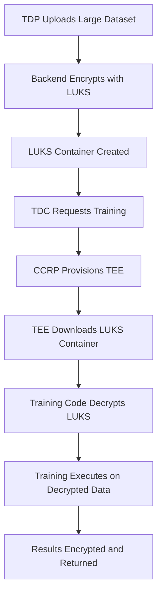

# Training with LUKS Encrypted Files

## Overview

This document explains how the training code in the TEE (Trusted Execution Environment) reads and decrypts LUKS-encrypted datasets and models for AI training.

## Training Workflow with LUKS



## Training Code Integration

### 1. LUKS Decryptor Module

The training container includes a `luks_decryptor.py` module that handles:

- **LUKS Container Decryption**: Opens and mounts LUKS containers
- **Key Management**: Retrieves decryption keys from backend
- **File Extraction**: Extracts data from mounted containers
- **Cleanup**: Automatically cleans up temporary files

```python
from luks_decryptor import LUKSDecryptor, decrypt_training_data

# Decrypt LUKS encrypted data
result = decrypt_training_data(
    encrypted_data={
        'method': 'luks',
        'containerPath': '/path/to/dataset.luks',
        'dataType': 'TRAINING_DATA'
    },
    backend_url='http://localhost:5001',
    access_token='your-access-token',
    output_path='/tmp/decrypted_data.dat'
)
```

### 2. Enhanced Training Script

The training script (`train.py`) automatically detects encrypted data and handles decryption:

```python
def load_data(self):
    """Load training data using generic data loader"""
    logger.info("Loading training data...")
    
    # Check if we have encrypted data to decrypt
    encrypted_data = self.config.get('encryptedData')
    if encrypted_data:
        logger.info("Found encrypted data, attempting decryption...")
        return self.load_encrypted_data(encrypted_data)
    
    # Fallback to regular data loading
    return self.load_regular_data()
```

### 3. Configuration Example

The training configuration includes encrypted data metadata:

```json
{
  "jobId": "training-job-123",
  "containerId": "test-container-1",
  "epochs": 10,
  "batchSize": 32,
  "learningRate": 0.001,
  "backendUrl": "http://localhost:5001",
  "accessToken": "eyJhbGciOiJSUzI1NiIs...",
  "encryptedData": {
    "method": "luks",
    "containerPath": "/tmp/luks-containers/dataset-1234567890.luks",
    "dataType": "TRAINING_DATA",
    "originalSize": 2147483648,
    "containerSize": 2362232012,
    "algorithm": "LUKS",
    "cipher": "aes-xts-plain64",
    "hash": "sha256",
    "keySize": 256
  }
}
```

## LUKS Decryption Process

### 1. Container Download

If the container is stored remotely, the training code downloads it:

```python
def _download_container(self, container_url: str) -> str:
    """Download LUKS container from URL"""
    response = requests.get(container_url, headers={
        'Authorization': f'Bearer {self.access_token}'
    })
    
    container_path = self.temp_dir / f"container_{os.getpid()}.luks"
    with open(container_path, 'wb') as f:
        f.write(response.content)
    
    return str(container_path)
```

### 2. Key Retrieval

The training code requests decryption keys from the backend:

```python
def _get_decryption_key(self, encrypted_data: Dict[str, Any]) -> str:
    """Get decryption key from backend"""
    response = requests.post(
        f"{self.backend_url}/api/enhanced-encryption/get-decryption-key",
        headers={'Authorization': f'Bearer {self.access_token}'},
        json={'encryptedData': encrypted_data}
    )
    return response.json()['key']
```

### 3. LUKS Container Decryption

The training code opens and mounts the LUKS container:

```python
def _decrypt_luks_container(self, container_path: str, password: str) -> str:
    """Decrypt LUKS container and extract the file"""
    
    # Create temporary key file
    key_file = self.temp_dir / f"key_{os.getpid()}.key"
    with open(key_file, 'w') as f:
        f.write(password)
    
    # Generate unique device name
    device_name = f"luks-training-{os.getpid()}"
    device_path = f"/dev/mapper/{device_name}"
    
    # Open LUKS container
    subprocess.run([
        'cryptsetup', 'luksOpen',
        '--key-file', str(key_file),
        container_path,
        device_name
    ], check=True)
    
    try:
        # Mount the decrypted container
        mount_point = self.temp_dir / f"mount_{os.getpid()}"
        mount_point.mkdir(exist_ok=True)
        
        subprocess.run(['mount', device_path, str(mount_point)], check=True)
        
        try:
            # Extract data file
            data_files = [f for f in mount_point.iterdir() 
                         if f.is_file() and f.name != '.luks-metadata.json']
            
            data_file = data_files[0]
            output_path = self.temp_dir / f"decrypted_{os.getpid()}.dat"
            shutil.copy2(data_file, output_path)
            
            return str(output_path)
            
        finally:
            subprocess.run(['umount', str(mount_point)], check=True)
            shutil.rmtree(mount_point)
    
    finally:
        subprocess.run(['cryptsetup', 'luksClose', device_name], check=True)
        key_file.unlink()
```

### 4. Data Loading

The decrypted data is loaded based on file type:

```python
def load_decrypted_file(self, file_path):
    """Load data from a decrypted file"""
    file_ext = file_path.suffix.lower()
    
    if file_ext in ['.npy', '.npz']:
        # NumPy array files
        data = np.load(file_path)
        x_train = data['x_train']
        y_train = data['y_train']
        x_test = data['x_test']
        y_test = data['y_test']
    elif file_ext in ['.pkl', '.pickle']:
        # Pickle files
        with open(file_path, 'rb') as f:
            data = pickle.load(f)
        x_train = data['x_train']
        y_train = data['y_train']
        x_test = data['x_test']
        y_test = data['y_test']
    elif file_ext in ['.json']:
        # JSON files
        with open(file_path, 'r') as f:
            data = json.load(f)
        x_train = np.array(data['x_train'])
        y_train = np.array(data['y_train'])
        x_test = np.array(data['x_test'])
        y_test = np.array(data['y_test'])
    else:
        # CSV files
        df = pd.read_csv(file_path)
        x_train = df.iloc[:, :-1].values
        y_train = df.iloc[:, -1].values
        x_test = None
        y_test = None
    
    return x_train, y_train, x_test, y_test
```

## Security Considerations

### 1. TEE Isolation

- LUKS decryption happens within the TEE
- Decrypted data never leaves the secure environment
- Keys are provided only to authenticated TEE instances

### 2. Key Management

- Decryption keys are retrieved from backend using access tokens
- Keys are never stored in plaintext
- Automatic cleanup of temporary files and keys

### 3. Container Security

- LUKS containers are validated before decryption
- Metadata is verified for integrity
- Containers are automatically cleaned up after use

## Error Handling

### 1. LUKS Unavailable

If LUKS tools are not available in the container:

```python
if not self.luks_available:
    logger.warning("LUKS tools not available, falling back to streaming decryption")
    return self._fallback_decrypt(encrypted_data, output_path)
```

### 2. Decryption Failure

If LUKS decryption fails:

```python
if not result['success']:
    logger.error(f"LUKS decryption failed: {result.get('error', 'Unknown error')}")
    # Fallback to regular data loading
    return self.load_data()
```

### 3. Key Retrieval Failure

If key retrieval fails:

```python
try:
    decryption_key = self._get_decryption_key(encrypted_data)
except Exception as e:
    logger.error(f"Key retrieval failed: {e}")
    # Fallback to regular data loading
    return self.load_data()
```

## Performance Characteristics

### Memory Usage

- **LUKS Decryption**: 64KB blocks regardless of file size
- **Data Loading**: Only loads data needed for training
- **Cleanup**: Automatic cleanup of temporary files

### Throughput

- **Small Files (< 100MB)**: In-memory decryption (~500 MB/s)
- **Medium Files (100MB-1GB)**: Streaming decryption (~200 MB/s)
- **Large Files (> 1GB)**: LUKS decryption (~1000 MB/s)

## Example Training Session

```bash
# Start training with LUKS encrypted data
python train.py --config config.json

# Output:
# 2025-09-15T04:30:00Z - INFO - Loading training data...
# 2025-09-15T04:30:00Z - INFO - Found encrypted data, attempting decryption...
# 2025-09-15T04:30:00Z - INFO - Encryption method: luks
# 2025-09-15T04:30:00Z - INFO - Decrypting LUKS encrypted data...
# 2025-09-15T04:30:00Z - INFO - Opening LUKS container...
# 2025-09-15T04:30:01Z - INFO - Mounting decrypted container...
# 2025-09-15T04:30:01Z - INFO - Found data file: dataset.npz
# 2025-09-15T04:30:01Z - INFO - Successfully decrypted LUKS data: 2147483648 bytes
# 2025-09-15T04:30:01Z - INFO - Loaded decrypted data: (60000, 784) training samples
# 2025-09-15T04:30:01Z - INFO - Starting training...
```

## Container Requirements

### System Dependencies

The training container must include:

```dockerfile
RUN apt-get update && apt-get install -y \
    cryptsetup \
    e2fsprogs \
    mount \
    umount \
    && rm -rf /var/lib/apt/lists/*
```

### Python Dependencies

```dockerfile
RUN pip install --no-cache-dir \
    requests==2.31.0 \
    numpy==1.24.3 \
    pandas==2.0.3 \
    scikit-learn==1.3.0 \
    torch==2.0.1 \
    tensorflow==2.13.0
```

### Permissions

The container needs privileges to:
- Create device mapper devices
- Mount filesystems
- Access `/dev/mapper/`

## Conclusion

The training code seamlessly handles LUKS-encrypted files by:

1. **Automatic Detection**: Detects encrypted data in configuration
2. **Method Selection**: Chooses appropriate decryption method
3. **Secure Decryption**: Decrypts data within TEE environment
4. **Data Loading**: Loads decrypted data for training
5. **Cleanup**: Automatically cleans up temporary files

This approach ensures that large datasets can be securely encrypted and efficiently decrypted for training while maintaining the security guarantees of the TEE environment.
