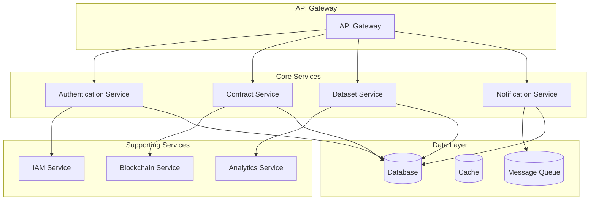

# User and Security Guides
## Contract Management System

Complete user guides, security documentation, and best practices for the Contract Management System.

**Document Version:** 3.0  
**Date:** December 2024  
**Author:** Contract Management System Team

---

## Table of Contents

1. [User Guide](#user-guide)
2. [Security Guide](#security-guide)
3. [Wallet Guide](#wallet-guide)
4. [User Onboarding Guide](#user-onboarding-guide)
5. [UI Design Documentation](#ui-design-documentation)
6. [Service Management](#service-management)
7. [Security Best Practices](#security-best-practices)
8. [Troubleshooting](#troubleshooting)

---

## User Guide

### Getting Started

#### System Overview
The Contract Management System is a blockchain-based platform that enables secure, transparent contract management between Training Data Providers (TDP), Training Data Consumers (TDC), and Confidential Clean Room Providers (CCRP).

#### Key Features
- **Decentralized Identity**: Use DIDs for self-sovereign identity
- **Smart Contracts**: Automated contract execution on Ethereum
- **Multi-Party Support**: TDP, TDC, and CCRP roles
- **Enterprise IAM**: Keycloak integration for enterprise security
- **Real-time Tracking**: Live contract status monitoring

#### Prerequisites
- **Web Browser**: Chrome, Firefox, Safari, or Edge
- **MetaMask**: Ethereum wallet extension
- **Ethereum Network**: Goerli testnet (for development)
- **Organization Domain**: For web-based DIDs (optional)

### Account Registration

#### Step 1: Connect Your Wallet
1. Open the application in your browser
2. Click "Connect MetaMask" button
3. Approve the connection in MetaMask
4. Ensure you're connected to the correct network (Goerli testnet for development)

#### Step 2: Choose Your DID Method

##### Option A: System-Generated DID (did:ethr)
- **Best for**: Individual users with Ethereum wallets
- **Process**: System automatically creates a DID from your wallet address
- **Format**: `did:ethr:goerli:0x[your-wallet-address]`
- **Benefits**: No setup required, fully decentralized

##### Option B: User-Provided DID (did:ethr)
- **Best for**: Users with existing Ethereum-based DIDs
- **Process**: Enter your existing DID and verify ownership
- **Example**: `did:ethr:mainnet:0x1234567890abcdef...`
- **Benefits**: Maintains identity continuity across platforms

##### Option C: User-Provided DID (did:web)
- **Best for**: Organizations with web domains
- **Process**: Enter your organization's web-based DID
- **Example**: `did:web:company.com:user:alice`
- **Benefits**: Cost-effective, organization-controlled

#### Step 3: Complete Registration
1. Fill in your profile information:
   - Full name
   - Email address
   - Organization (optional)
   - Phone number (optional)
   - Website (optional)
   - Location (optional)

2. Select your role:
   - **TDP (Training Data Provider)**: Dataset owners who create and manage datasets
   - **TDC (Training Data Consumer)**: Contract initiators who create contracts
   - **CCRP (Confidential Clean Room Provider)**: Compliance reviewers who sign contracts

3. If using a user-provided DID:
   - Enter your existing DID
   - Verify DID ownership through wallet signature
   - Wait for DID verification to complete

4. Submit registration and wait for confirmation

### DID Management

#### Understanding DIDs
Decentralized Identifiers (DIDs) are your digital identity on the blockchain or web. They provide:
- **Self-ownership**: You control your identity completely
- **Portability**: Use the same DID across multiple platforms
- **Verifiability**: Others can prove you are who you claim to be
- **Privacy**: You choose what information to share

#### DID Method Comparison

| Feature | did:ethr | did:web |
|---------|----------|---------|
| **Best For** | Individual users | Organizations |
| **Infrastructure** | Ethereum blockchain | Web servers |
| **Cost** | Gas fees | Hosting costs |
| **Speed** | Slower (blockchain) | Fast (HTTP) |
| **Control** | Wallet owner | Domain owner |
| **Decentralization** | Fully decentralized | Centralized hosting |
| **Setup** | Simple (wallet) | Moderate (web server) |

#### Managing Your DID

##### Viewing DID Information
1. Go to your profile page
2. View your DID details:
   - DID string
   - DID method (ethr or web)
   - Verification status
   - Creation date
   - Last verification date

##### DID Verification Status
- **Active**: Your DID is working normally
- **Pending Verification**: Waiting for ownership verification
- **Verification Failed**: Ownership verification was unsuccessful
- **Suspended**: Temporarily disabled (rare)

##### Updating Your DID
In most cases, your DID remains the same. You may need to update it if:
- You change your wallet address (for did:ethr)
- Your organization changes domains (for did:web)
- Your DID becomes compromised
- You want to use a different DID method

#### DID Security Best Practices

##### For did:ethr Users:
- Never share your private keys
- Use hardware wallets for high-value DIDs
- Backup your keys securely
- Use multi-signature setups when possible

##### For did:web Users:
- Ensure your web server is properly secured
- Always use HTTPS for DID document hosting
- Protect your domain registration
- Keep SSL certificates up to date

### Contract Management

#### Understanding Contract Roles

##### TDP (Training Data Provider)
- **Responsibilities**: Create and manage datasets, set pricing, approve contracts
- **Permissions**: Dataset creation, contract approval, usage analytics
- **Workflow**: Create dataset → Set pricing → Review contract requests → Sign contracts

##### TDC (Training Data Consumer)
- **Responsibilities**: Browse datasets, initiate contracts, manage negotiations
- **Permissions**: Dataset browsing, contract creation, payment management
- **Workflow**: Browse datasets → Initiate contract → Negotiate terms → Sign contract

##### CCRP (Confidential Clean Room Provider)
- **Responsibilities**: Review compliance, verify privacy requirements, sign contracts
- **Permissions**: Compliance review, contract signing, audit access
- **Workflow**: Review contract → Verify compliance → Sign contract → Monitor execution

#### Creating a Contract

##### Step 1: Contract Initiation (TDC)
1. Navigate to "Contracts" → "Create Contract"
2. Select the datasets you want to access
3. Choose the TDP (dataset owner)
4. Select a CCRP for compliance review
5. Set contract terms and duration
6. Specify compensation amount
7. Submit contract for review

##### Step 2: TDP Review
1. Receive notification of new contract request
2. Review contract terms and compensation
3. Approve or reject the contract
4. If approved, contract moves to CCRP review

##### Step 3: CCRP Review
1. Receive notification of contract for review
2. Review compliance requirements
3. Verify data privacy measures
4. Approve or reject the contract
5. If approved, contract is ready for signing

##### Step 4: Contract Signing
1. All parties receive signing notification
2. Review final contract terms
3. Sign contract using your DID
4. Contract becomes active upon all signatures

#### Contract Lifecycle

##### Contract States
- **DRAFT**: Initial contract creation
- **PENDING_TDP**: Waiting for TDP approval
- **PENDING_CCRP**: Waiting for CCRP review
- **PENDING_SIGNATURES**: Waiting for all parties to sign
- **ACTIVE**: Contract is live and enforceable
- **COMPLETED**: Contract has been fulfilled
- **CANCELLED**: Contract was cancelled

##### Contract Actions
- **View**: All parties can view contract details
- **Edit**: Only TDC can edit before signing
- **Approve**: TDP and CCRP can approve/reject
- **Sign**: All parties must sign to activate
- **Cancel**: TDC can cancel before signing

### Dataset Management

#### Creating Datasets (TDP)

##### Step 1: Dataset Information
1. Navigate to "Datasets" → "Create Dataset"
2. Enter dataset name and description
3. Specify dataset metadata:
   - Size and format
   - License information
   - Tags and categories
   - Usage restrictions

##### Step 2: Access Control
1. Set access level:
   - **PUBLIC**: Available to all users
   - **PRIVATE**: Only for specific contracts
   - **RESTRICTED**: Requires approval
2. Set pricing (if applicable)
3. Define usage terms

##### Step 3: Dataset Publication
1. Review all information
2. Submit for publication
3. Dataset becomes available for contracts

#### Managing Datasets

##### Dataset Actions
- **View**: See dataset details and usage
- **Edit**: Modify dataset information
- **Deactivate**: Temporarily disable dataset
- **Delete**: Permanently remove dataset
- **Analytics**: View usage statistics

##### Dataset Analytics
- **Access Count**: Number of times accessed
- **Contract Count**: Number of contracts using dataset
- **Revenue**: Total earnings from dataset
- **Usage Trends**: Historical usage patterns

### User Profile Management

#### Profile Information

##### Personal Information
- **Name**: Your full name
- **Email**: Contact email address
- **Phone**: Contact phone number
- **Location**: Your location
- **Website**: Personal or company website

##### Professional Information
- **Organization**: Company or organization name
- **Department**: Your department or team
- **Role**: Your job title or role
- **Employee ID**: Company employee identifier

##### DID Information
- **DID**: Your decentralized identifier
- **DID Method**: ethr or web
- **Verification Status**: Current verification state
- **Last Verification**: Date of last verification

#### Profile Actions

##### Update Profile
1. Navigate to "Profile" → "Edit Profile"
2. Modify desired fields
3. Save changes
4. Changes are applied immediately

##### Security Settings
1. **Password**: Change account password
2. **Two-Factor**: Enable/disable 2FA
3. **Session Management**: View active sessions
4. **API Keys**: Manage API access keys

### Notifications

#### Notification Types

##### Contract Notifications
- **New Contract**: New contract request received
- **Contract Approved**: Contract approved by party
- **Contract Rejected**: Contract rejected by party
- **Contract Signed**: Contract signed by party
- **Contract Active**: Contract is now active

##### System Notifications
- **DID Verification**: DID verification status updates
- **Security Alerts**: Security-related notifications
- **System Updates**: System maintenance notifications

##### Email Notifications
- **Daily Digest**: Summary of daily activities
- **Weekly Report**: Weekly usage and activity report
- **Security Alerts**: Important security notifications

#### Notification Settings

##### Email Preferences
- **Contract Updates**: Receive email for contract changes
- **Security Alerts**: Receive security notifications
- **System Updates**: Receive system maintenance notices
- **Marketing**: Receive promotional emails (optional)

##### In-App Notifications
- **Real-time**: Receive immediate notifications
- **Digest**: Receive daily summary
- **Off**: Disable all notifications

---

## Security Guide

### 🚨 **CRITICAL SECURITY FIXES APPLIED**

This document outlines the security vulnerabilities that were found and fixed in the Contract Management System.

#### **Issues Found and Fixed:**

##### 1. **Hardcoded Private Keys** (CRITICAL)
- **Issue**: Ethereum private keys were hardcoded in frontend and backend files
- **Files Affected**: 
  - `frontend/src/pages/ContractDetail.js`
  - `frontend/src/components/WalletSwitcher.js`
  - `backend/scripts/registerHardhatUsers.js`
  - `TEST_WALLETS.md`
- **Fix**: Replaced with environment variables and placeholder values
- **Risk**: Private key exposure could lead to account compromise

##### 2. **Hardcoded Passwords** (HIGH)
- **Issue**: Keycloak admin password (`***REMOVED-KEYCLOAK_ADMIN_PASSWORD***`) and database passwords were hardcoded
- **Files Affected**:
  - `docker-compose.iam.yml`
  - `scripts/setupKeycloak.js`
  - `backend/services/***REMOVED-KEYCLOAK_DB_PASSWORD***Service.js`
- **Fix**: Replaced with environment variables
- **Risk**: Unauthorized access to IAM system

##### 3. **Sensitive Data in Documentation** (MEDIUM)
- **Issue**: Private keys and credentials exposed in documentation files
- **Files Affected**: `TEST_WALLETS.md`, `SETUP_GUIDE.md`
- **Fix**: Updated to use placeholder values and warnings
- **Risk**: Credential exposure in public repositories

### **Security Improvements Applied:**

#### 1. **Enhanced .gitignore**
```bash
# Added comprehensive security exclusions
secrets/
credentials/
*.key
*.pem
*.p12
*.pfx
.env
.env.local
***REMOVED-KEYCLOAK_DB_PASSWORD***-config/realm-export.json
test-wallets.json
private-keys.json
```

#### 2. **Environment Variables**
- Created `env.example` template
- Replaced hardcoded values with environment variables
- Added secure defaults for development

#### 3. **Frontend Security**
- Removed hardcoded private keys from React components
- Added environment variable support for sensitive data
- Added TODO comments for production security improvements

#### 4. **Docker Security**
- Updated docker-compose to use environment variables
- Added secure defaults for development

### 🔧 **IMMEDIATE ACTIONS REQUIRED:**

#### **For Production Deployment:**

##### 1. **Set Secure Environment Variables:**
```bash
# Create .env file from template
cp env.example .env

# Edit .env with secure values
nano .env
```

##### 2. **Generate Secure Secrets:**
```bash
# Generate JWT secret (32+ characters)
openssl rand -hex 32

# Generate database password
openssl rand -base64 32

# Generate Keycloak admin password
openssl rand -base64 16
```

##### 3. **Update Keycloak Configuration:**
```bash
# Change default admin password
# Access Keycloak admin console: http://localhost:8080/admin
# Login: admin/***REMOVED-KEYCLOAK_ADMIN_PASSWORD***
# Change password immediately
```

#### **For Development:**

##### 1. **Use Test Environment:**
```bash
# Copy example environment
cp env.example .env

# Use test values for development
KEYCLOAK_ADMIN_PASSWORD=dev_admin_password
DB_PASSWORD=dev_db_password
JWT_SECRET=dev_jwt_secret_32_chars_minimum
```

##### 2. **Test Wallet Management:**
```bash
# For testing, use Hardhat's known private keys
# These are safe for local development only
REACT_APP_TDP_PRIVATE_KEY=0xac0974bec39a17e36ba4a6b4d238ff944bacb478cbed5efcae784d7bf4f2ff80
REACT_APP_TDC_PRIVATE_KEY=0x59c6995e998f97a5a0044966f0945389dc9e86dae88c7a8412f4603b6b78690d
REACT_APP_CCRP_PRIVATE_KEY=0x5de4111afa1a4b94908f83103eb1f1706367c2e68ca870fc3fb9a804cdab365a
```

### 🛡️ **SECURITY BEST PRACTICES:**

#### **Environment Management:**
- ✅ Never commit `.env` files
- ✅ Use different secrets for each environment
- ✅ Rotate secrets regularly
- ✅ Use secure secret management services in production

#### **Private Key Management:**
- ✅ Never hardcode private keys in source code
- ✅ Use hardware wallets for production
- ✅ Implement secure key storage solutions
- ✅ Use environment variables for development

#### **IAM Security:**
- ✅ Change default Keycloak admin password
- ✅ Use strong, unique passwords
- ✅ Enable 2FA for admin accounts
- ✅ Regular security audits

#### **Code Security:**
- ✅ Regular dependency updates
- ✅ Security scanning tools
- ✅ Code review for security issues
- ✅ Secure coding practices

### 🔍 **SECURITY MONITORING:**

#### **Tools to Use:**
1. **npm audit** - Check for vulnerable dependencies
2. **Snyk** - Security vulnerability scanning
3. **SonarQube** - Code quality and security analysis
4. **GitGuardian** - Secret detection in repositories

#### **Regular Checks:**
- [ ] Run `npm audit` weekly
- [ ] Review dependency updates monthly
- [ ] Security scan of codebase quarterly
- [ ] Review access logs monthly

### 📋 **SECURITY CHECKLIST:**

#### **Before Production Deployment:**
- [ ] All hardcoded credentials removed
- [ ] Environment variables configured
- [ ] Strong passwords set
- [ ] Keycloak admin password changed
- [ ] SSL/TLS certificates configured
- [ ] Security headers implemented
- [ ] Rate limiting configured
- [ ] Input validation implemented
- [ ] SQL injection protection
- [ ] XSS protection enabled

#### **Ongoing Security:**
- [ ] Regular security updates
- [ ] Dependency vulnerability monitoring
- [ ] Access log monitoring
- [ ] Incident response plan
- [ ] Security training for team

### 🚨 **EMERGENCY CONTACTS:**

If you discover a security vulnerability:

##### 1. **Immediate Actions:**
   - Do not commit the fix to public repository
   - Create private branch for fix
   - Notify security team immediately

##### 2. **Reporting:**
   - Use secure channels for reporting
   - Document the vulnerability
   - Create remediation plan

##### 3. **Recovery:**
   - Rotate all affected credentials
   - Audit for similar issues
   - Update security procedures

---

## Wallet Guide

### MetaMask Setup

#### Installation
1. **Download MetaMask**:
   - Visit [metamask.io](https://metamask.io)
   - Click "Download" for your browser
   - Install the extension

2. **Create Wallet**:
   - Click "Create a Wallet"
   - Set a strong password
   - Write down your seed phrase (12 words)
   - Store seed phrase securely offline

3. **Verify Installation**:
   - MetaMask icon should appear in browser toolbar
   - Click icon to open MetaMask
   - Verify wallet is created

#### Network Configuration

##### Goerli Testnet Setup
1. **Add Network**:
   - Open MetaMask
   - Click network dropdown
   - Select "Add Network"

2. **Network Details**:
   - **Network Name**: Goerli Testnet
   - **RPC URL**: `https://goerli.infura.io/v3/YOUR_PROJECT_ID`
   - **Chain ID**: `5`
   - **Currency Symbol**: `ETH`
   - **Block Explorer**: `https://goerli.etherscan.io`

##### Mainnet Setup
1. **Network Details**:
   - **Network Name**: Ethereum Mainnet
   - **RPC URL**: `https://mainnet.infura.io/v3/YOUR_PROJECT_ID`
   - **Chain ID**: `1`
   - **Currency Symbol**: `ETH`
   - **Block Explorer**: `https://etherscan.io`

#### Getting Test ETH

##### Goerli Faucet
1. **Visit Faucet**: [goerlifaucet.com](https://goerlifaucet.com)
2. **Connect Wallet**: Connect your MetaMask wallet
3. **Request ETH**: Click "Request 0.1 ETH"
4. **Wait**: ETH will be sent to your wallet

##### Alternative Faucets
- **Alchemy**: [goerlifaucet.com](https://goerlifaucet.com)
- **Chainlink**: [faucets.chain.link](https://faucets.chain.link)
- **Paradigm**: [faucet.paradigm.xyz](https://faucet.paradigm.xyz)

### Wallet Security

#### Best Practices
1. **Secure Storage**:
   - Never share your private keys
   - Store seed phrase offline
   - Use hardware wallets for large amounts

2. **Password Security**:
   - Use strong, unique passwords
   - Enable 2FA where possible
   - Regular password updates

3. **Transaction Security**:
   - Always verify transaction details
   - Check gas fees before confirming
   - Use trusted networks only

#### Common Scams
1. **Phishing Sites**:
   - Only use official MetaMask site
   - Check URL carefully
   - Never enter seed phrase on websites

2. **Fake Support**:
   - MetaMask never asks for seed phrase
   - Official support is free
   - Be wary of unsolicited help

3. **Fake Tokens**:
   - Verify token contracts
   - Check token addresses carefully
   - Research before investing

### Connecting to Applications

#### First Connection
1. **Visit Application**:
   - Navigate to the contract management system
   - Look for "Connect Wallet" button

2. **Connect MetaMask**:
   - Click "Connect Wallet"
   - Select MetaMask from options
   - Approve connection in MetaMask

3. **Verify Connection**:
   - Check wallet address is displayed
   - Verify correct network is selected
   - Test basic functionality

#### Managing Connections
1. **View Connected Sites**:
   - Open MetaMask
   - Go to Settings → Connected Sites
   - See all connected applications

2. **Disconnect Sites**:
   - Find site in connected list
   - Click "Disconnect"
   - Confirm disconnection

3. **Revoke Permissions**:
   - Some sites may have additional permissions
   - Review and revoke as needed
   - Regular permission audits

### Transaction Management

#### Sending Transactions
1. **Initiate Transaction**:
   - Perform action in application
   - MetaMask popup will appear

2. **Review Details**:
   - Check recipient address
   - Verify amount
   - Review gas fees

3. **Confirm Transaction**:
   - Click "Confirm" in MetaMask
   - Wait for confirmation
   - Check transaction status

#### Gas Fees
1. **Understanding Gas**:
   - Gas is the fee for blockchain operations
   - Fees vary by network congestion
   - Higher fees = faster processing

2. **Setting Gas Fees**:
   - **Low**: Slow, cheap
   - **Medium**: Balanced
   - **High**: Fast, expensive
   - **Custom**: Manual setting

3. **Gas Optimization**:
   - Batch transactions when possible
   - Use appropriate fee levels
   - Monitor network conditions

#### Transaction History
1. **Viewing History**:
   - Open MetaMask
   - Click "Activity" tab
   - See all transactions

2. **Transaction Details**:
   - Click transaction for details
   - View gas used, fees paid
   - Check confirmation status

3. **Block Explorer**:
   - Click transaction hash
   - Opens block explorer
   - Detailed transaction information

---

## User Onboarding Guide

### Welcome to Contract Management System

#### Getting Started Checklist
- [ ] Install MetaMask wallet
- [ ] Get test ETH from faucet
- [ ] Connect wallet to application
- [ ] Complete user registration
- [ ] Verify your DID
- [ ] Set up your profile
- [ ] Explore the dashboard

### Step-by-Step Onboarding

#### Step 1: Wallet Setup
1. **Install MetaMask**:
   - Download from [metamask.io](https://metamask.io)
   - Create new wallet
   - Secure your seed phrase

2. **Configure Network**:
   - Add Goerli testnet
   - Get test ETH from faucet
   - Verify wallet is working

#### Step 2: Application Access
1. **Visit Application**:
   - Navigate to contract management system
   - Click "Connect Wallet"
   - Approve connection in MetaMask

2. **Verify Connection**:
   - Check wallet address is displayed
   - Ensure correct network is selected
   - Test basic functionality

#### Step 3: User Registration
1. **Fill Registration Form**:
   - Enter personal information
   - Select your role (TDP, TDC, or CCRP)
   - Choose DID method

2. **DID Setup**:
   - **System-Generated**: Automatic DID creation
   - **User-Provided**: Enter existing DID
   - Verify DID ownership

3. **Complete Registration**:
   - Review all information
   - Submit registration
   - Wait for confirmation

#### Step 4: Profile Setup
1. **Personal Information**:
   - Add profile photo
   - Complete contact details
   - Set location and timezone

2. **Professional Information**:
   - Add organization details
   - Set department and role
   - Add professional bio

3. **Preferences**:
   - Set notification preferences
   - Configure privacy settings
   - Set language preferences

#### Step 5: First Actions
1. **Explore Dashboard**:
   - Review key metrics
   - Check recent activity
   - Navigate main sections

2. **Create First Dataset** (TDP):
   - Navigate to Datasets
   - Click "Create Dataset"
   - Fill dataset information

3. **Browse Datasets** (TDC):
   - Explore available datasets
   - Read dataset descriptions
   - Check pricing and terms

4. **Review Contracts** (CCRP):
   - Check pending reviews
   - Review contract details
   - Understand compliance requirements

### Role-Specific Onboarding

#### Training Data Provider (TDP)
1. **Dataset Creation**:
   - Learn dataset creation process
   - Set appropriate pricing
   - Configure access controls

2. **Contract Management**:
   - Review incoming contract requests
   - Understand approval process
   - Learn contract signing

3. **Analytics and Reporting**:
   - Monitor dataset usage
   - Track revenue and performance
   - Generate reports

#### Training Data Consumer (TDC)
1. **Dataset Discovery**:
   - Browse available datasets
   - Use search and filters
   - Read dataset documentation

2. **Contract Creation**:
   - Learn contract creation process
   - Select appropriate datasets
   - Set contract terms

3. **Payment Management**:
   - Understand payment process
   - Set up payment methods
   - Track payment history

#### Confidential Clean Room Provider (CCRP)
1. **Compliance Review**:
   - Understand compliance requirements
   - Review contract terms
   - Verify data privacy measures

2. **Contract Signing**:
   - Learn signing process
   - Understand legal implications
   - Maintain audit trail

3. **Monitoring and Reporting**:
   - Monitor contract execution
   - Generate compliance reports
   - Track audit activities

### Best Practices

#### Security Best Practices
1. **Wallet Security**:
   - Never share private keys
   - Use hardware wallets for large amounts
   - Regular security audits

2. **Account Security**:
   - Use strong passwords
   - Enable 2FA where available
   - Regular password updates

3. **Transaction Security**:
   - Always verify transaction details
   - Check gas fees before confirming
   - Use trusted networks only

#### Operational Best Practices
1. **Regular Monitoring**:
   - Check dashboard regularly
   - Monitor notifications
   - Review activity logs

2. **Data Management**:
   - Keep datasets updated
   - Maintain accurate pricing
   - Regular data backups

3. **Communication**:
   - Respond to contract requests promptly
   - Maintain professional communication
   - Document important decisions

### Troubleshooting

#### Common Issues
1. **Wallet Connection Problems**:
   - Check MetaMask is installed
   - Verify correct network
   - Clear browser cache

2. **DID Verification Issues**:
   - Check DID format
   - Verify ownership
   - Contact support if needed

3. **Transaction Failures**:
   - Check gas fees
   - Verify network connection
   - Ensure sufficient balance

#### Getting Help
1. **Documentation**:
   - Review user guides
   - Check FAQ section
   - Read troubleshooting guides

2. **Support Channels**:
   - Email support
   - Community forums
   - Technical documentation

3. **Escalation**:
   - Contact system administrators
   - Report bugs and issues
   - Request feature enhancements

---

## UI Design Documentation

### Design System Overview

#### Design Principles
1. **User-Centered Design**:
   - Focus on user needs and goals
   - Intuitive navigation and workflows
   - Accessibility for all users

2. **Consistency**:
   - Unified design language
   - Consistent component usage
   - Standardized interactions

3. **Security-First**:
   - Clear security indicators
   - Transparent transaction processes
   - Trust-building elements

#### Color Palette
```css
/* Primary Colors */
--primary-color: #1976d2;
--primary-light: #42a5f5;
--primary-dark: #1565c0;

/* Secondary Colors */
--secondary-color: #dc004e;
--secondary-light: #ff5983;
--secondary-dark: #9a0036;

/* Neutral Colors */
--background: #fafafa;
--surface: #ffffff;
--text-primary: #212121;
--text-secondary: #757575;

/* Status Colors */
--success: #4caf50;
--warning: #ff9800;
--error: #f44336;
--info: #2196f3;
```

#### Typography
```css
/* Font Family */
font-family: 'Roboto', 'Helvetica Neue', Arial, sans-serif;

/* Font Sizes */
--h1: 2.5rem;
--h2: 2rem;
--h3: 1.75rem;
--h4: 1.5rem;
--h5: 1.25rem;
--h6: 1rem;
--body: 1rem;
--caption: 0.875rem;
```

### Component Library

#### Navigation Components
1. **Header**:
   - Logo and branding
   - Main navigation menu
   - User profile and wallet connection
   - Notifications

2. **Sidebar**:
   - Role-based navigation
   - Quick actions
   - Recent items
   - Help and support

3. **Breadcrumbs**:
   - Current location
   - Navigation history
   - Quick navigation

#### Form Components
1. **Input Fields**:
   - Text inputs
   - Number inputs
   - Email inputs
   - Password fields

2. **Select Components**:
   - Dropdown selects
   - Multi-select
   - Autocomplete
   - Searchable selects

3. **Validation**:
   - Real-time validation
   - Error messages
   - Success indicators
   - Required field indicators

#### Data Display Components
1. **Tables**:
   - Sortable columns
   - Pagination
   - Search and filter
   - Bulk actions

2. **Cards**:
   - Dataset cards
   - Contract cards
   - User profile cards
   - Dashboard widgets

3. **Charts and Graphs**:
   - Usage analytics
   - Revenue charts
   - Activity timelines
   - Performance metrics

#### Interactive Components
1. **Buttons**:
   - Primary actions
   - Secondary actions
   - Destructive actions
   - Loading states

2. **Modals and Dialogs**:
   - Confirmation dialogs
   - Form modals
   - Detail views
   - Error messages

3. **Notifications**:
   - Success messages
   - Error alerts
   - Warning notifications
   - Info messages

### Page Layouts

#### Dashboard Layout
```jsx
<DashboardLayout>
  <Header />
  <Sidebar />
  <MainContent>
    <DashboardWidgets />
    <RecentActivity />
    <QuickActions />
  </MainContent>
  <Footer />
</DashboardLayout>
```

#### Contract Management Layout
```jsx
<ContractLayout>
  <Header />
  <Sidebar />
  <MainContent>
    <ContractList />
    <ContractFilters />
    <ContractActions />
  </MainContent>
  <Footer />
</ContractLayout>
```

#### Dataset Management Layout
```jsx
<DatasetLayout>
  <Header />
  <Sidebar />
  <MainContent>
    <DatasetGrid />
    <DatasetFilters />
    <DatasetActions />
  </MainContent>
  <Footer />
</DatasetLayout>
```

### Responsive Design

#### Breakpoints
```css
/* Mobile First Approach */
--mobile: 320px;
--tablet: 768px;
--desktop: 1024px;
--large-desktop: 1440px;
```

#### Mobile Considerations
1. **Touch Targets**:
   - Minimum 44px touch targets
   - Adequate spacing between elements
   - Thumb-friendly navigation

2. **Navigation**:
   - Collapsible sidebar
   - Bottom navigation for mobile
   - Swipe gestures

3. **Content**:
   - Stacked layouts
   - Simplified forms
   - Optimized images

### Accessibility

#### WCAG Compliance
1. **Perceivable**:
   - High contrast ratios
   - Alternative text for images
   - Captions for videos

2. **Operable**:
   - Keyboard navigation
   - Focus indicators
   - No time limits

3. **Understandable**:
   - Clear language
   - Consistent navigation
   - Error prevention

4. **Robust**:
   - Screen reader compatibility
   - Cross-browser support
   - Progressive enhancement

#### Accessibility Features
1. **Screen Reader Support**:
   - Semantic HTML
   - ARIA labels
   - Focus management

2. **Keyboard Navigation**:
   - Tab order
   - Skip links
   - Keyboard shortcuts

3. **Visual Accessibility**:
   - High contrast mode
   - Font size controls
   - Color blind friendly

### Performance Optimization

#### Loading Performance
1. **Code Splitting**:
   - Route-based splitting
   - Component lazy loading
   - Dynamic imports

2. **Asset Optimization**:
   - Image compression
   - CSS/JS minification
   - CDN usage

3. **Caching Strategy**:
   - Browser caching
   - Service worker
   - API response caching

#### Runtime Performance
1. **React Optimization**:
   - Memoization
   - Virtual scrolling
   - Efficient re-renders

2. **State Management**:
   - Optimized state updates
   - Selective subscriptions
   - Efficient selectors

---

## Service Management

### Service Overview

#### Core Services
1. **Authentication Service**:
   - User registration and login
   - DID verification
   - Session management

2. **Contract Service**:
   - Contract creation and management
   - Multi-party signing
   - Contract lifecycle management

3. **Dataset Service**:
   - Dataset creation and management
   - Access control
   - Usage analytics

4. **Notification Service**:
   - Real-time notifications
   - Email notifications
   - Push notifications

#### Supporting Services
1. **Blockchain Service**:
   - Smart contract interaction
   - Transaction management
   - Gas optimization

2. **IAM Service**:
   - Keycloak integration
   - Role-based access control
   - Enterprise authentication

3. **Analytics Service**:
   - Usage tracking
   - Performance monitoring
   - Business intelligence

### Service Architecture

#### Microservices Pattern


#### Service Communication
1. **Synchronous Communication**:
   - HTTP/REST APIs
   - Direct service calls
   - Request/response patterns

2. **Asynchronous Communication**:
   - Message queues
   - Event-driven architecture
   - Pub/sub patterns

3. **Service Discovery**:
   - Service registry
   - Load balancing
   - Health checks

### Service Monitoring

#### Health Checks
```javascript
// Health check endpoint
app.get('/health', async (req, res) => {
  const health = {
    status: 'healthy',
    timestamp: new Date().toISOString(),
    services: {
      database: await checkDatabase(),
      blockchain: await checkBlockchain(),
      ***REMOVED-KEYCLOAK_DB_PASSWORD***: await checkKeycloak()
    }
  };
  
  res.json(health);
});
```

#### Metrics Collection
1. **Application Metrics**:
   - Request/response times
   - Error rates
   - Throughput

2. **Business Metrics**:
   - User activity
   - Contract volume
   - Revenue tracking

3. **Infrastructure Metrics**:
   - CPU and memory usage
   - Disk space
   - Network performance

#### Alerting
1. **Critical Alerts**:
   - Service downtime
   - High error rates
   - Security incidents

2. **Warning Alerts**:
   - Performance degradation
   - Resource usage
   - Capacity planning

3. **Info Alerts**:
   - Deployment notifications
   - Maintenance windows
   - Feature releases

### Service Deployment

#### Deployment Strategy
1. **Blue-Green Deployment**:
   - Zero-downtime deployments
   - Quick rollback capability
   - Traffic switching

2. **Canary Deployment**:
   - Gradual rollout
   - Risk mitigation
   - Performance monitoring

3. **Rolling Deployment**:
   - Incremental updates
   - Service availability
   - Load balancing

#### Environment Management
1. **Development Environment**:
   - Local development
   - Feature testing
   - Integration testing

2. **Staging Environment**:
   - Pre-production testing
   - User acceptance testing
   - Performance testing

3. **Production Environment**:
   - Live system
   - High availability
   - Disaster recovery

### Service Maintenance

#### Regular Maintenance
1. **Daily Tasks**:
   - Health check monitoring
   - Log analysis
   - Performance review

2. **Weekly Tasks**:
   - Security updates
   - Dependency updates
   - Backup verification

3. **Monthly Tasks**:
   - Capacity planning
   - Performance optimization
   - Security audit

#### Incident Management
1. **Incident Response**:
   - Quick identification
   - Immediate mitigation
   - Root cause analysis

2. **Communication**:
   - Stakeholder notification
   - Status updates
   - Resolution timeline

3. **Post-Incident**:
   - Lessons learned
   - Process improvement
   - Documentation updates

---

## Security Best Practices

### Authentication Security

#### Password Security
1. **Strong Passwords**:
   - Minimum 12 characters
   - Mix of character types
   - No common patterns

2. **Password Management**:
   - Unique passwords per service
   - Regular password updates
   - Secure password storage

3. **Multi-Factor Authentication**:
   - Enable 2FA where available
   - Use authenticator apps
   - Backup codes storage

#### Session Management
1. **Secure Sessions**:
   - HTTPS only
   - Secure session cookies
   - Session timeout

2. **Session Monitoring**:
   - Active session tracking
   - Suspicious activity detection
   - Automatic logout

### Data Security

#### Data Encryption
1. **At Rest**:
   - Database encryption
   - File system encryption
   - Backup encryption

2. **In Transit**:
   - TLS/SSL encryption
   - API encryption
   - Message encryption

#### Data Privacy
1. **Data Minimization**:
   - Collect only necessary data
   - Regular data cleanup
   - Privacy by design

2. **Access Control**:
   - Role-based access
   - Principle of least privilege
   - Regular access reviews

### Network Security

#### Network Protection
1. **Firewall Configuration**:
   - Restrict unnecessary ports
   - Network segmentation
   - Intrusion detection

2. **VPN Usage**:
   - Secure remote access
   - Encrypted connections
   - Access logging

#### API Security
1. **API Protection**:
   - Rate limiting
   - Input validation
   - Authentication required

2. **API Monitoring**:
   - Request logging
   - Anomaly detection
   - Security scanning

### Blockchain Security

#### Wallet Security
1. **Private Key Management**:
   - Secure key storage
   - Hardware wallets
   - Key rotation

2. **Transaction Security**:
   - Double-check addresses
   - Verify transaction details
   - Use trusted networks

#### Smart Contract Security
1. **Contract Auditing**:
   - Professional audits
   - Security testing
   - Bug bounty programs

2. **Contract Monitoring**:
   - Transaction monitoring
   - Anomaly detection
   - Emergency procedures

### Compliance and Governance

#### Regulatory Compliance
1. **Data Protection**:
   - GDPR compliance
   - Data retention policies
   - User consent management

2. **Financial Compliance**:
   - KYC/AML procedures
   - Transaction monitoring
   - Audit trails

#### Security Governance
1. **Security Policies**:
   - Security framework
   - Incident response plan
   - Security training

2. **Risk Management**:
   - Risk assessment
   - Mitigation strategies
   - Regular reviews

---

## Troubleshooting

### Common User Issues

#### Wallet Connection Problems
1. **MetaMask Not Detected**:
   - Check MetaMask is installed
   - Refresh browser page
   - Clear browser cache

2. **Wrong Network**:
   - Switch to correct network
   - Add network if missing
   - Check network configuration

3. **Connection Refused**:
   - Check internet connection
   - Verify site is accessible
   - Try different browser

#### DID Verification Issues
1. **DID Format Error**:
   - Check DID syntax
   - Verify DID method
   - Ensure correct format

2. **Ownership Verification Failed**:
   - Check wallet connection
   - Verify signature
   - Try re-verification

3. **DID Resolution Error**:
   - Check DID document exists
   - Verify web server
   - Contact DID provider

#### Contract Issues
1. **Contract Creation Failed**:
   - Check wallet balance
   - Verify gas fees
   - Ensure correct parameters

2. **Contract Signing Failed**:
   - Check authorization
   - Verify contract status
   - Ensure all parties ready

3. **Contract Not Found**:
   - Check contract ID
   - Verify permissions
   - Refresh page

### Technical Issues

#### Performance Problems
1. **Slow Loading**:
   - Check internet connection
   - Clear browser cache
   - Try different browser

2. **Transaction Delays**:
   - Check network congestion
   - Increase gas fees
   - Wait for confirmation

3. **System Errors**:
   - Check system status
   - Contact support
   - Report bug

#### Data Issues
1. **Missing Data**:
   - Check permissions
   - Verify data exists
   - Refresh page

2. **Incorrect Data**:
   - Check data source
   - Verify calculations
   - Contact support

3. **Sync Issues**:
   - Wait for sync
   - Refresh page
   - Check network

### Getting Help

#### Self-Service Resources
1. **Documentation**:
   - User guides
   - FAQ section
   - Video tutorials

2. **Community Support**:
   - User forums
   - Community chat
   - Knowledge base

3. **Troubleshooting Tools**:
   - Diagnostic tools
   - Status pages
   - Health checks

#### Contact Support
1. **Support Channels**:
   - Email support
   - Live chat
   - Phone support

2. **Escalation Process**:
   - Tier 1: Basic support
   - Tier 2: Technical support
   - Tier 3: Expert support

3. **Response Times**:
   - Critical: 1 hour
   - High: 4 hours
   - Normal: 24 hours
   - Low: 72 hours

---

This comprehensive user and security guide provides all the information needed for users to effectively use the Contract Management System while maintaining security best practices. For technical implementation details, refer to the technical documentation. 